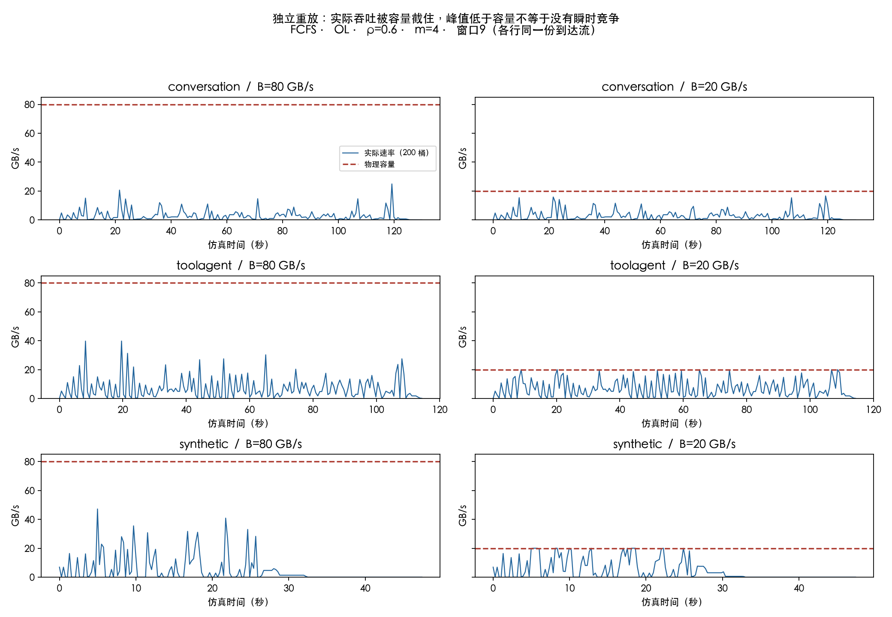
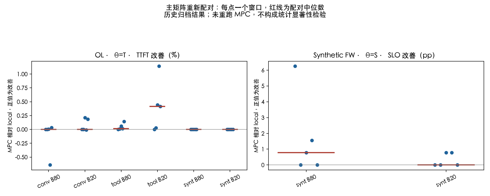
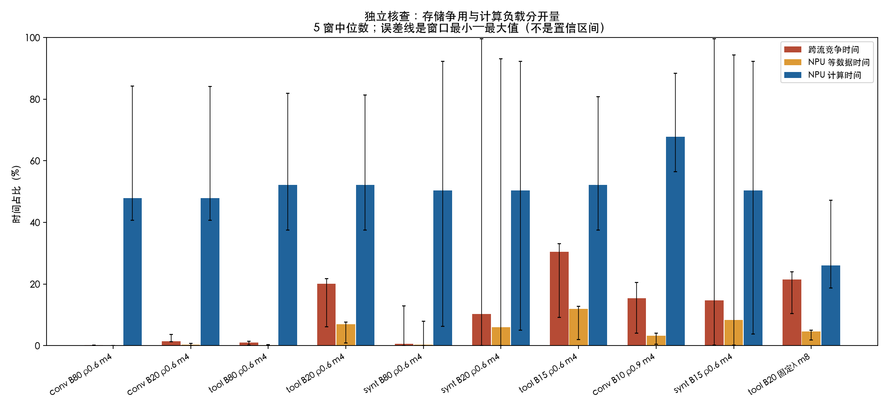

# E25 三问独立核查：计算时间的依据、带宽图的含义与间歇过载配置

| 项目 | 内容 |
|---|---|
| 创建日期 | 2026-09-21 |
| 回答对象 | [测试报告-E25实施-20260919.md](测试报告-E25实施-20260919.md)，问题 1–3 |
| 证据原则 | 从实现、规格、原始/派生 trace、新重放建立证据；仓库原有同题分析不作为数值或因果依据 |
| 本次验证 | 2 个冒烟 run；10 格 × 5 个完整窗口 = **50 个 FCFS 诊断 run**；主矩阵 MPC/local 逐窗口重新配对 |
| 共同条件 | OL；α=4；synthetic-v1；单 worker 一批；上限 8 请求/262144 新 token/128 GB 工作区；q_max=200 GB/s |
| 窗口 | {0,4,9,14,19}；代表时序用 w9；窗口中位数为描述性统计，不当作置信区间或显著性证明 |
| 代码与复现 | [独立核查工具](tools/e25_independent_audit.py)、[事前复核方案](docs/E25三问独立复核方案-20260921.md)；物理内核未修改 |

## 总判决与三问直答

**问题 1：按 synthetic-v1 的定义，公式实现与手工算例相符；但无法据此认定它算准了真实 NPU 时间。** 配对数和单位可验证，50μs、2e-7、1e-10、512 等参数没有目标 NPU 实测标定。当前实验能回答“在这套假设计算画像下，调度如何变化”，不能回答“某型号 NPU 上实际花多少毫秒”。

**问题 2：图画的是实际传输速率，实际速率必然不超过容量。B=20 曲线不超过 20 是正确物理行为，不是没有过载。** 更关键的是，B=20 的 ToolAgent **已经有间歇性跨 NPU 争用**：w9 占时 **21.75%**，五窗中位 **20.03%**。所以把 MPC 相对 local 的微小增益笼统归因为“没有间歇过载”，与新重放证据不符。B=80 的 w9 争用确实弱，但不能把一个代表窗口推广到全部窗口。

**问题 3：若只是需要“忙一阵、空一阵”的存储竞争，ToolAgent、OL、4 worker、ρ=0.6、B=20 已满足；要提高竞争强度，首选 B=15，保持到达流与计算画像不变。** 五窗竞争占时中位从 **20.03%→30.42%**，NPU 等数据占时从 **6.91%→11.89%**，计算占时均约 **52.12%**。若还要排除部分窗口的计算拥挤，可用 **8 worker、B=20、保持原来的绝对到达率 λ≈10.906 req/s**，新重放的五窗计算占时都低于 48%。

**Go / No-go：** 上述配置可作为共享存储争用诊断的 **go**；把它们宣称为“已证明 MPC 显著优于 local”的配置则是 **no-go**，因为本次资源重放没有做新的 MPC 收益验证，历史配对结果也不支持“越过载、优势必然越大”。

## 1. NPU 计算时间究竟算了什么，什么意义上正确？

### 1.1 计算量、服务时间、TTFT 是三个不同的量

代码 [sim/cq/profile.py](sim/cq/profile.py) 的 `batch_compute_s` 返回**整批、每层的计算时长**，并非完整请求时长。对批 β，令 h 为可从远端读取的命中前缀长度，u 为仍需 prefill 的新 token 数：

\[
N=\sum_{i\in\beta}u_i,\quad
A=\sum_{i\in\beta}\left(u_i h_i+\frac{u_i(u_i+1)}2\right),
\]

\[
\eta(N)=\min(1,\max(1/16,N/512)),
\quad c_\beta=50\times10^{-6}+2\times10^{-7}\frac{N}{\eta(N)}+10^{-10}A\quad\text{秒/层}.
\]

引擎 [sim/cq/engine.py](sim/cq/engine.py) 的 `_dispatch` 把相同 c 放到全部 32 层。因此整批的**纯计算占用**为

\[
C_\beta=32c_\beta.
\]

`_start_layer` 在计算当前层时预读下一层。设每层读取量 v=κΣh，κ=4096/10⁹ GB/token/层；独占恒定带宽时 r=v/min(B,q_max)。空系统下单批服务时间应为

\[
T_{\rm service}=r+(L-1)\max(r,c)+c
=Lc+r+(L-1)\max(0,r-c).
\]

第一层先读后算，后续读与上一层计算重叠；不能把每层读写与计算一律相加，也不能一律认定读取完全被隐藏。`singleton_K` 实际实现的就是这个**含读取**的参考服务时间，而不是纯计算 C。其命名和部分说明容易混淆，推导容量时应分开。

实际共享运行还会有请求队列等待和读取争用，TTFT 是完成时刻减到达时刻。NPU 泳道里的 `COMPUTE` 则只累计 C，读不到数据的时间计入 `STALL`。本模型只模拟 prefill 到首 token 边界，trace 的 output_length 不参与这段计算；不能把这里的结果当成完整 decode 服务时间。

### 1.2 哪些部分可独立证明？

**attention 配对计数正确。** 对第 j 个新 token（j=1…u），因果注意力可见 h+j 个位置；求和即 uh+u(u+1)/2。批内请求互不可见，因此是各请求配对数之和，不包含跨请求注意力。这证明的是“有效位置对数”，还不是 FLOP 数，更不是耗时。

**时间单位及算例正确。** 以 h=512、u=128 为例：

- A=65536+8256=73792，η=0.25。
- c=0.0001597792 s，即 **0.1597792 ms/层**。
- C=32c=**5.1129344 ms**。
- B=80 时 r=0.0262144 ms，小于 c；独占服务时间为 **5.1391488 ms**。

再看 h=8192、u=128：c=0.2580832 ms，B=80 时 r=0.4194304 ms，后续层也必须等读取；C=8.2586624 ms，但独占服务时间为 **13.679856 ms**。这是“纯计算正确”并不意味着“直接乘 32 就得到 TTFT”的具体例子。

[tests/test_cq_units.py](tests/test_cq_units.py) 的 U01/U02 对 κ、四类数值和参考服务时间有核对；U03 验证关闭批加速且 launch=0 时整批纯计算等于成员 singleton 之和。本次全量测试 **147 passed**。画像函数可使用 Fraction 精确计算，但生产重放使用 float；不能宣称整个实验没有浮点误差。

### 1.3 哪些部分没有足够依据？

参数的来源在[原始规格 §5.1、§5.4](docs/共享KV统一队列Batch与错峰调度-仿真实验设计实施与测试规格-20260915.md)中明确是合成画像，不是实测。代码与规格一致只能证明实现符合假设，不能证明假设准确。

| 参数/假设 | 当前依据 | 尚缺什么 |
|---|---|---|
| a=2e-7 s/token/层 | synthetic-v1 人工给定 | 指定模型、NPU、精度、并行度下的投影/MLP 等算子画像 |
| b=1e-10 s/配对 | 用有效 attention 配对数表达长上下文增长 | query 头数、kernel、内存访问与形状相关效率的实测 |
| launch=50μs/层 | 固定开销假设 | 实际执行图、融合方式、每层 launch/同步成本 |
| N_sat=512、η 下界=1/16 | 人工批效率曲线 | 小批到大批的实际吞吐曲线及验证误差 |
| 每层同 c、请求不 padding | 明确的仿真简化 | 不同层、实际调度/chunk、张量并行通信等影响 |
| 128 GB 工作区 | 为保留长 trace 而设的虚拟 worker 约束 | 实际单卡/多卡部署的可用内存与可行批能力 |

还有一个不能使用的推导：**8 个 KV 头 × 128 维，并不推出 hidden_size=1024。** GQA 允许多个 query 头共享一组 KV，KV 头数与 query 头数可以不同；[GQA 原论文，arXiv:2305.13245](https://arxiv.org/abs/2305.13245)明确给出该结构。因此不能从本仓库的 κ 反推出模型参数量，再算出“126/41 TFLOPS，故贴近真实 NPU”。这条论证缺少必要前提，应撤回。

η 还预先限制了批优化空间：N≥512 后 η=1，合批不再节省 aN 和 bA，只省固定 launch；若参与比较的 singleton 都已越过 512，n 条合批仅省 32×50μs×(n−1)。因此“真实 trace 上组批收益小”部分由当前计算函数决定，不能外推成真实 NPU 上 batching 普遍无收益。

**如何补齐依据：** 明确目标 NPU/卡数、模型、dtype、TP、算子/图模式和计时边界；在当前 trace 覆盖的 (h,u,批大小) 形状上测量，做留出验证，分别报告计算时长和含传输时长。拟合这几个常数不一定足以描述全部形状；必要时应使用实测查表或分段模型。得到这些数据之前，不能判断当前合成时间对目标硬件究竟偏快还是偏慢。

## 2. 为什么 B=80 时峰值能到 40 多，B=20 时又不超过 20？

### 2.1 首先确认纵轴，不要把供给当需求

[tools/e25_ts_deep.py](tools/e25_ts_deep.py) 的图 H 左轴为

\[
U_k=\frac{\text{served\_gb}_k}{\text{capacity\_gb}_k}
=\frac{\int_{I_k}R(t)dt}{\int_{I_k}B(t)dt}.
\]

左轴是利用率，右轴是 B(t) 的 GB/s 刻度。要得到实际 GB/s，使用 `served_gb/width_s`。例如 B=80、峰值 59%，对应约 47.2 GB/s；59% 本身不是 59 GB/s。

存储的 FCFS 分配器每次按 `rate_i=min(q_i,剩余带宽)` 分配，故

\[
R(t)=\sum_i rate_i(t)=\min\left(B(t),\sum_i q_i(t)\right)\le B(t).
\]

瞬时如此，桶平均也如此。**过载时应看未满足申请、等待、积压或竞争时间，实际传输曲线不会越过容量。** 如果实际带宽图显著越过 B，反倒应检查单位、统计或实现问题。

一个量纲例子：假设某次需要读 20 GB，在 80 GB/s 下 0.25 秒完成，放到 0.5 秒统计桶里就是平均 40 GB/s；在 20 GB/s 下需占满 1 秒，图中只会出现更长的 20 GB/s 平台。相同字节工作量可产生完全不同的峰高与持续时间。

### 2.2 本次重新运行的图与读数

以下重新执行图 H 的 FCFS 条件，固定 w9、ρ=0.6、4 worker；B80/B20 使用**同一份请求和到达时间**。每个 run 都通过 Σ传输字节=32κΣh 的守恒检查。

| trace | B80 桶均实际峰值 | B20 桶均实际峰值 | B80 跨流竞争占时 | B20 跨流竞争占时 |
|---|---:|---:|---:|---:|
| Conversation | 24.89 GB/s | 16.58 GB/s | 0.12% | 3.63% |
| ToolAgent | 39.79 GB/s | 20.00 GB/s | 1.03% | **21.75%** |
| Synthetic | 47.20 GB/s | 20.00 GB/s | 0.62% | **10.33%** |



图按同一 GB/s 纵轴绘制，比原图双轴更直接。ToolAgent w9 两个配置都传了约 **803.436 GB**；降低带宽改变的是读取时间分布，不是消灭多出来的字节。Conversation 的 B20 桶均峰值仍只有 16.58，却已有 3.63% 时间发生跨流竞争，是“平均图看不出瞬时争用”的直接例子。

原聚合器采用 `T_anchor=向上取整到0.1秒(1.1×T_end_FCFS)` 后均分 200 桶。w9 桶宽约为 Conversation **0.718 s**、ToolAgent **0.632 s**、Synthetic **0.262 s**。不能给所有 trace 套用同一桶宽。短暂打满很容易被平均掉；例如一桶里只有 10 ms 打满，其余空闲，0.632 s 桶上的利用率也只有约 1.6%。

此外，这不是把同一条“需求曲线”简单裁剪到 20。引擎会根据实际进度重新提交读取：首层申请 q_max=200，预读申请 min(200,v/c)，到期未完成又 boost 到 200。降低 B 后读取变慢、boost 增多、后续计算与派批推迟，需求本身也随之改变。因此不能把 B80 的需求分布直接当作 B20 运行的预测结果。

### 2.3 对 MPC/local，更应该量“共享争用”，而不是只有“申请超限”

从 [sim/cq/search.py](sim/cq/search.py) 的 `_IndependentBWStorage` 可知，local 在推演里为**每条流**分配 `min(q_i,B̂)`；实际执行仍然共用真实 FCFS 存储。它同样知道单流不能超过 B。

对相同当前状态和容量 b，定义

\[
D_{\rm ind}(t)=\sum_i\min(q_i(t),b),\quad
I_{\rm conflict}(t)=\mathbf 1[D_{\rm ind}(t)>b].
\]

这是共享与独立分配在该状态下产生差别的直接判据。本次竞争占时为对该指示量按事件区间长度积分，再除以完整重放时长；没有向普通策略增加状态访问权限。

| 当前读流申请 | B | 申请总和>B？ | 共享分配与 local 分配不同？ |
|---|---:|---|---|
| 一条流申请 200 | 20 | 是 | **否**，双方都给它 20 |
| 两条流各申请 15 | 20 | 是 | **是**，共享合计 20，local 合计 30 |
| 两条流各申请 8 | 20 | 否 | 否，双方合计 16 |

这个区别在 Synthetic 尤其明显：w9、B80 的 `Σq>B` 时间占比为 **2.78%**，真正跨流竞争仅 **0.62%**；B20 则为 **19.75% vs 10.33%**。不能把前者全算成“共享存储建模可以优化的干扰”。单流读取本身慢，没有竞争对手可错峰，local 也会预测它慢。

`∫(Σq−R)dt` 同样不能叫作“丢失的 KV 字节”或队列积压。它是申请速率与服务速率的差额积分，boost 及延迟会使它很大；实际未完成字节应读取 remaining_gb，完成后的总字节仍守恒。

### 2.4 “没有间歇过载，所以 MPC 不比 local 好”只能解释一部分场景

对于 B80 的弱竞争窗口，共享模型对预测时延的修正通常较小，确实是合理解释。但它不是完整因果证明：真实执行轨迹竞争少，不代表每个**未被选中的候选未来**也竞争少。

对于 ToolAgent B20，“不存在间歇过载”已经被重放否定。这里应检查的是下一条链能否走通：

**候选推演发生共享争用 → 两个模型对候选的评分不同 → 最优动作或 gate 选择改变 → 实际执行改善目标。**

中间任何一环不成立，都可能得到相同或近似结果。例如候选集里没有更好的批、所有可选动作主目标分数相同、收益不满足严格 gate、长批不可中断且当前无派批机会。当前代码还有 K_req=32、K_batch=24、H 实际按 1 处理、事件预算等限制；这些是应审计的结构条件，**本次没有给它们分配未经验证的“根因占比”**。

尤其不能声称“只有部分候选过载、部分不过载才能改变排序”：所有候选都过载时，重叠多久、谁先读、哪条请求临近期限仍可不同，排序完全可能改变。持续过载下共享建模也可能有价值；间歇过载不是 MPC/local 分化的逻辑必要条件，更不是收益的充分条件。

### 2.5 回到主矩阵，重新做同窗口配对

直接读取 `results/cq/eval/e25/e25_records.json`，固定 profile/default、cap/C、α4、相同 θ 与窗口。TTFT 改善定义为 `(local−mpc)/local`，正值表示 MPC 更快。以下是历史运行的再统计，不是本次重新测得的 MPC 性能。

| OL、ρ0.6、m4、θ=T | B | 五窗配对 TTFT 改善中位数 | 五窗范围 |
|---|---:|---:|---:|
| Conversation | 80 | 约 0.000% | −0.642%～+0.031% |
| Conversation | 20 | 约 0.000% | −0.008%～+0.212% |
| ToolAgent | 80 | +0.013% | 0～+0.142% |
| ToolAgent | 20 | **+0.416%** | 0～+1.141% |
| Synthetic | 80 / 20 | 0 | 0 |



有竞争但增量仍小，是这里需要解释的事实；不能用 MPC 相对 EDF 的收益替换 MPC 相对 local 的收益，也没有做显著性检验的依据。

图右侧还核对了常被引用的 FW Synthetic、θ=S：B80 的五个配对 SLO 改善分别为 **6.25、0、0.78125、1.5625、0 pp**，配对中位数是 **0.78125 pp**。分别取 MPC 与 local 两列中位数再相减可得 6.25 pp，但那不是“典型窗口里的 6.25 pp 改善”。B20 对应 **0、0、0.78125、0.78125、0 pp**，配对中位数为 0；这也**不等于所有窗口逐位相同**。要声称 B≈80 是最优带宽，更需完整扫描和逐候选证据，本次数据不支持该结论。

## 3. 如何结合计算与存储配置，造出所需工况？

### 3.1 先算守恒预算：每请求是 32 层，不是一层

对请求 i 定义完整读取量与纯计算量：

\[
V_i=L\kappa h_i,\quad C_i=Lc_i.
\]

绝对到达率 λ 下，平均 KV 到达工作量为 `D̄=λE[V]` GB/s，singleton 近似的计算负荷为 `ρ_compute≈λE[C]/m`。批 launch 摊销会修正后者，所以它是初始容量估计，不是精确稳态利用率。

间歇过载需要平均上仍有恢复余量、局部却会竞争。设计上先取 **λE[V]<B**，再通过新重放确认突发期间 `D_ind>B`、平时能恢复；这个平均条件必要但不保证稳定，FCFS、计算与预读耦合仍可能造成额外限制。也不应以“观察到的平均实际速率<B”代替它，因为供不应求时实际速率本来就受限。

以下从本地派生 trace 全量请求重新计算，不用旧分析里的均值：

| trace | E[C] 纯计算 s/条 | E[T0] 含读 s/条 | E[V] 全32层 GB/条 | 当前 λ0 req/s | ρ0.6 时 λE[V] GB/s | 纯计算容量对应读取率 4E[V]/E[C] GB/s |
|---|---:|---:|---:|---:|---:|---:|
| Conversation | 0.478261 | 0.478874 | 0.589321 | 8.352925 | **2.954** | 4.929 |
| ToolAgent | 0.219001 | 0.220072 | 0.642772 | 18.175846 | **7.010** | 11.740 |
| Synthetic | 0.311327 | 0.316102 | 1.308174 | 12.654154 | **9.932** | 16.808 |

这是从画像/trace 导出的工作量表，不是硬件实测。它说明四 worker 的平均计算容量对应的读取率远低于 B80：平均意义上增加到达率更容易先堆积计算队列。但这不排除短时读突发，也不能声称“加 ρ 绝不可能增加存储竞争”。

**λ0 公式需记录的缺陷：** [cq_common.py](sim/experiments/cq_common.py) 使用 `min(80/E[V_layer],4/E[T0])`。若将第一项解释成“每请求存储容量”，它遗漏了 L=32，应该是 `80/E[V_total]`。当前三 trace 按完整字节计算的存储容量仍约为 135.75、124.46、61.15 req/s，都高于表中计算锚，因此取 min 的结果不变；既有主矩阵到达率不因这处修正而改变。不过以后增加 worker 或加速计算时它可能切换成错误的绑定项，必须先修正语义，不能沿用来设计扩容。

### 3.2 为什么调低带宽合理，但不能越低越好？

预读申请大致是 `v/c`。同一 trace 下：降低 B 会加剧竞争；加快计算会缩短预读期限；增加 worker 可能让更多流并行。三者都可能把存储推向瓶颈。

最直接的第一步是只改 B，固定绝对到达时间、κ、画像、SLO、批能力和 q_max。**ToolAgent 的 B15 比全量平均 KV 工作量约 7.01 GB/s 大一倍多，留下恢复余量，又低于它的突发读取需求，适合作为起点。** 这只是选择候选配置的理由，工况成立与否仍由重放确认。

不能把 q_max=200 改大当作增加真实需求：单条流超过 B 只会被限速，不一定增加跨 worker 干扰。也不建议先加大 h、κ 或改 trace 来制造结果，因为那同时改变负载含义。单独把 L 放大通常同时放大计算与读取，未必能改变所需的存储/计算比例。

### 3.3 50 个新重放得到的配置对照

表内除竞争范围外均为五窗中位数；竞争是 `Σmin(q_i,B)>B` 的占时，STALL/计算的分母为 `m×T_end`。两种时间占比的分母不同，不能相加。全部运行从 0 到请求排空；到达期与排空尾部都包含在内。

| trace/配置 | 跨流竞争占时（范围） | NPU STALL | NPU 计算 | 判断 |
|---|---:|---:|---:|---|
| Conversation，m4，ρ0.6，B80 | 0.11%（0.05–0.12） | 0.04% | 47.89% | 存储争用很弱 |
| Conversation，m4，ρ0.6，B20 | 1.37%（1.23–3.63） | 0.35% | 47.89% | 有短时竞争，影响有限 |
| ToolAgent，m4，ρ0.6，B80 | 1.03%（0.17–1.42） | 0.19% | 52.12% | 存储争用较弱 |
| **ToolAgent，m4，ρ0.6，B20** | **20.03%（6.14–21.75）** | **6.91%** | **52.12%** | 已有间歇竞争 |
| **ToolAgent，m4，ρ0.6，B15** | **30.42%（9.23–33.07）** | **11.89%** | **52.12%** | 首选增强竞争配置 |
| **ToolAgent，m8，固定原 λ，B20** | **21.42%（10.41–23.89）** | **4.61%** | **26.06%** | 计算更富余，仍保留竞争 |
| Conversation，m4，ρ0.9，B10 | 15.42%（4.10–20.54） | 3.27% | 67.85% | 可制造竞争，但计算更紧 |
| Synthetic，m4，ρ0.6，B80 | 0.62%（0.02–12.94） | 0.35% | 50.38% | 不能由 w9 推广全 trace |
| Synthetic，m4，ρ0.6，B20 | 10.33%（0.08–99.63） | 5.92% | 50.35% | 窗口差异过大 |
| Synthetic，m4，ρ0.6，B15 | 14.67%（0.11–99.65） | 8.34% | 50.33% | 部分窗口持续拥塞，不宜统一称间歇 |



图中误差线是最小—最大窗口，不是置信区间。ToolAgent B15 的竞争时间稳定地处于部分时段；但其一个窗口计算占时约 **80.79%**，因此不能称五个窗口都排除了计算瓶颈。m8、固定 λ、B20 的计算占时范围为 **18.75–47.13%**，更适合作为区分计算与存储作用的对照。m 从 4 变 8 后 STALL 百分比的分母也翻倍，不能据此说总等待秒数下降。

Synthetic 的问题不是“再把带宽降一点”就能解决。w19 的到达期字节工作量约 **22.94 GB/s**，已高于 B20，争用占时 **99.63%**，几乎全程饱和；w0 的工作量约 **0.906 GB/s**，同样 B20 下争用只有 **0.08%**。其命中前缀/新 token 结构随窗口变化，整个文件的均值不能代替每个窗口的工况。实验应固定同一 B 后如实分层报告这些状态，不能为每个策略调不同带宽来“制造间歇”。

### 3.4 具体配置方法

**推荐 A：先把现有工况做实，再增强它。**

- trace：`toolagent_trace.jsonl`，OL，使用完整窗口。
- 4 worker；synthetic-v1 全部参数不变；α=4；q_max=200；批能力不变。
- λ固定为 `0.6×18.175846≈10.905508 req/s`，保留 trace 内同刻到达和时间间隔比例。
- B 以 **20 为已验证对照，15 为增强点**；后续可预先固定扫 {12,15,20,30}，未重放的 12/30 不写成已验证最优值。
- T0、deadline 与 λ0 的参考 B 保持 80；只改物理 `b_schedule=((0,B),)`。

**推荐 B：用计算富余对照回答“是否计算抢先成为瓶颈”。**

- 在推荐 A 的原请求与时间戳上只将 worker 改为 **8**，先用已验证的 **B20**。
- 绝对 λ 仍为 **10.905508 req/s**，不能随着 worker 自动翻倍。
- 若使用会按 m 重算 λ0 的既有辅助工具，因为当前该 trace 的锚是计算项，m8 时需设 **ρ=0.3**；本次核查工具直接沿用 m4 的 specs，所以输出中的 rho=0.6 指**原始四 worker 锚**，不是 m8 重算后的负载。

核心代码对应如下，可直接核对工具中相同逻辑：

```python
src = MooncakeSource("toolagent_trace.jsonl")
specs, duration = src.window_specs(
    9, src.lam0 * F(3, 5), F(4), limits=TRACE_WIDE_LIMITS)
scn = default_scenario(B_gbps=15, m=4, alpha=F(4),
                       limits=TRACE_WIDE_LIMITS)
# 计算富余对照：保留上面的 specs，改为 B_gbps=20、m=8。
```

如果坚持 B80 不变，单加到达率不是干净办法；要考虑更快计算或更多 worker，并保持/明确绝对到达流。按全量平均工作量估算，四 worker 把平均计算容量对应读取率推到 80，约需 Conversation **16.2×**、ToolAgent **6.8×**、Synthetic **4.8×** 的计算加速。这不是达到瞬时过载的最低加速倍数，也不是硬件建议；它只说明当前 B80 相对于合成计算画像的平均供给余量很大。固定 λ 时，即使计算加速，平均字节需求仍不变，变化的是请求处理节奏和重叠程度。

### 3.5 下一步怎样证明共享感知的价值？

配置验收和算法验收应分两步。

先固定 FCFS 作工况锚，检查到达期工作量低于容量、确实同时存在竞争与恢复时段、竞争是否导致 STALL、计算是否长期打满。必要时同时报告固定秒宽的图，避免不同排空长度导致桶宽改变；本次为复现图 H 保留原桶口径。

再在相同 trace、窗口、θ、候选空间、引擎能力和预算下，直接配对 **MPC vs local**。记录至少三个量：两种推演在哪些候选上分配不同；这些差别是否改变首动作/gate；改变后真实 TTFT/SLO 如何。必须分清“没有可改善动作”与“有动作但预测/搜索未找到”。普通策略继续只读可观测接口，诊断记录不能成为额外信息通道。

最后应检查控制成本。主矩阵使用 zero 控制延迟和宽松 CPU 搜索时间上限；真实部署下若收益只有不到 1%，搜索开销可能抵消它。这需要 measured 模式验证，本次未宣称部署收益。

## 4. 明确修正了什么

| 需要修正的判断 | 本次依据与修正 |
|---|---|
| “曲线没超过容量，所以没有过载” | 实际速率按构造≤B；应看竞争和等待。ToolAgent B20 已有 20.03% 五窗竞争中位占时 |
| “Σq>B 就是 MPC/local 的分岔条件” | 单流申请200、B20时两者同给20；用 Σmin(q_i,B)>B 识别相同状态下的分配差异 |
| “KV头数能推 hidden 并证明真实算力合理” | GQA 不允许这种反推；当前参数仍是未经 NPU 标定的假设 |
| “λ0 的带宽项是完整请求存储容量” | 实现用了每层字节，遗漏 L；当前未绑定所以不改变既有 λ0，扩容时不可忽略 |
| “B80 基线都不满，w9代表整个 trace” | Synthetic w14/w19 的 B80 桶均实际峰值可到80；必须逐窗口核查 |
| “降 B 提升 MPC 收益” | 竞争增强已验证；算法收益不能由资源指标代替，更不能拿单窗数字与五窗中位相比 |
| “FW Synthetic 的典型配对提升为6.3pp，B20逐位相同” | 原始主矩阵重新配对得到 B80 中位0.78125pp；B20中位0但有窗口差异 |
| “候选只有跨过容量两侧才能改变排序，B≈80已是最优” | 这不是必要条件，已有记录也没有证明最优点；需要候选级诊断与预定扫描 |

这些修正针对[原测试报告](测试报告-E25实施-20260919.md)与[仓库已有同题分析](docs/E25三问深答-NPU计算时间与存储带宽过载-20260921.md)中相应论断。本次保留原文件，明确记录修正原因，避免悄悄改变历史口径。

## 5. 复现、验收与局限

```bash
.venv/bin/python tools/e25_independent_audit.py --stage smoke
.venv/bin/python tools/e25_independent_audit.py --stage full
.venv/bin/python tools/e25_independent_audit.py --stage figures
.venv/bin/python -m pytest tests/ -q
```

新输出在 `results/cq/e25_independent/`：`smoke.json`、`full.json`、w9 的区段和聚合账本、`archive_pairs.json`。工具记录原始/派生 trace SHA256 与历史主矩阵文件 SHA256；raw 三文件指纹与 `sim/cq/trace.py` 固定值一致。新图为 `docs/figures/fig_e25_independent_*.png`，没有覆盖原正式图。

只读观察器的小世界核查逐请求完成时刻、原生 interval_log 与未包装的原生运行**逐项相同**。50 个 FCFS run 全部正常排空，并验证实际速率≤B、字节守恒；两次冒烟先于五窗完整诊断。全量测试 147 项通过。没有修改共享仿真模块，因此本次不是 v1/v2 机制回归实验。

**边界：** 五个完整窗口并非全部20窗口；并非所有 workload 都能被同一 B 调成同一种工况；时间占比分母含排空尾部，不能直接称稳态利用率；新重放仅 FCFS，不能替代 MPC/local 的新配置对照；历史配对未做统计显著性检验。所有计算与配置建议仍条件于 synthetic-v1，不能外推到未标定 NPU。

## 6. 通俗版解读

把系统想成四位厨师共用一条送食材的传送带。

**第一问：** 现在每道菜炒多久，是仿真里规定的菜谱工时；算账能算对，但还没有去目标厨房拿秒表测过。

**第二问：** 传送带每秒最多送20公斤，摄像头永远拍不到它每秒送40公斤；需求过大时发生的是厨师等料。把摄像头画面按一秒平均，还会把短暂拥堵藏起来。我们重新数了等料与争抢时段，确认 B20 已经在间歇拥堵。

**第三问：** ToolAgent 用四位厨师、B15，能增加争抢又留下空闲恢复时段；若担心厨师本身太忙，可加到八位，但保持客人来店速度不变。传送带拥堵说明“值得研究协调”，不保证更复杂的排菜方案一定比简单预测多赚收益——还要证明它能在那些时刻选到更好的动作。
