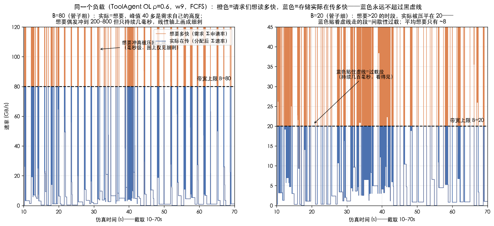
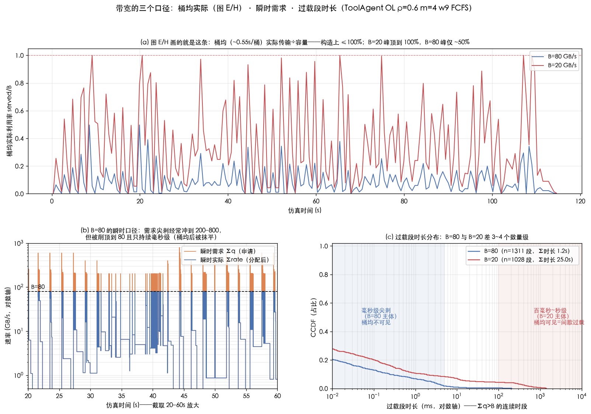
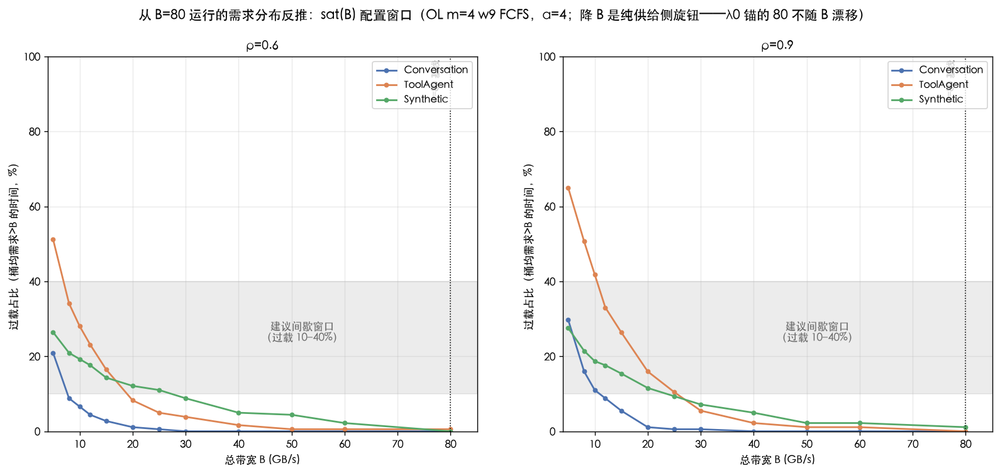

# E25 三问深答：NPU 计算时间、带宽图的"峰值悬案"与存储过载配置

| 项目 | 约定 |
|---|---|
| 文档版本 | **2.1，2026-09-21**（v2.0：按用户反馈重写三答——Q1 改为"与真实硬件/模型的对应核查"（联网检索标注来源）、Q2 改为大白话分层解释+新配图、Q3 改为 (ρ, m, B) 三旋钮联合配方。**v2.1：吸收[独立核查](../E25三问独立核查与配置建议-20260921.md)的四点修正**——GQA 下 κ 推不出模型宽度（Q1 的硬件折算改为双读法并列）、分岔条件精确化为 Σmin(q_i,B)>B、修正"逐位相同"误述与 6.3pp 的口径（配对中位 0.78pp）、"腰部"降级为方向性假说；**新增 §3.5 参数扫描**（FW Syn B×m×α，`tools/e25_q_div_scan.py`）回答"找 mpc-local 大差距场景"） |
| 性质 | 问题解答 + 定量核查，针对 [测试报告-E25实施-20260919](../测试报告-E25实施-20260919.md)（v4.28）的三个读者问题 |
| 新增图 | 3 张：`figures/cq_fig_e25q_demand_vs_actual.png`（**Q2 主图**：需求 vs 实际两条线）、`figures/cq_fig_e25q_bw_3views.png`（三口径深挖）、`figures/cq_fig_e25q_satB.png`（sat(B) 配置窗口） |
| 数据源 | 真实硬件/系统数据（联网检索，§1 逐条标来源）+ E25.1/E25.2 归档 + FCFS 重跑（`interval_log` 瞬时口径）+ 12 格冒烟 + FW 5 窗分化验证 |

**三问三答（TL;DR）**：

1. **NPU 计算时间和实际对应得上吗？**——**结构对应、几何与带宽两个锚点精确对应、计算速度无法判定**（v2.1 按独立核查修正）。精确对应的两处：KV 几何（每 token 128 KiB/层 ×32 层，与 Llama-3-8B / Qwen2.5-7B 级模型的 KV cache 逐字节相同）和存储带宽（B=80 GB/s ≈ Mooncake 传输引擎实测 87 GB/s）。计算速度**取决于模型宽度假设**——GQA 下 κ（8 KV 头×128 维）推不出 hidden 宽度（[GQA 论文](https://arxiv.org/abs/2305.13245)）：按 8B 级模型读，线性项隐含单卡 2.5 PFLOPS（超 H100 峰值 2.5 倍、超实际 5 倍）；按小模型（hidden≈1024）读，隐含 ≈126 TFLOPS（恰好是 910B/H100 的一半量级、相当现实）。**仓库参数本身不锚定模型宽度，所以"快多少倍"没有唯一答案**——要对应真实硬件必须先指定目标模型再标定（a、b 各改一个数，或按 E19 画像合同实测）。
2. **为什么 B=80 时峰值点超 40、B=20 时曲线不超 20？**——一句话：**图上画的是"实际在传多快"，而实际速率永远不可能超过带宽上限 B**（就像水管流量不会超过管子口径）。B=20 时曲线不超 20 是必然的，不代表负载轻。B=80 时峰值 40 多，是因为那一刻所有请求**想要**的速度加起来就是 40 多（80 的管子没被要满，实际=想要）；同样的负载放到 B=20，想要的 40 多被压平在 20——**图上曲线贴着上限走的那几段，就是间歇性过载**。至于"B=80 时几乎从来看不到贴满"：想要的速度确实会瞬间冲到 200 以上，但只持续几毫秒，被图的 ~0.55 秒时间平均抹掉了。
3. **ρ、推理实例数、存储带宽怎么联合配置才能做出存储间歇性过载？**——三个旋钮的作用不同：**ρ 和 m 负责把需求做大，B 负责把供给做小**。但 ρ 拧到 0.9~1.1 时计算先过载（4 张卡名义满载时带宽平均才用 6~21%）、增益反而塌掉；**能独立制造存储过载的只有降 B**，ρ 和 m 只能配合。冒烟验证过的配方：**标准版 Tool ρ=0.6 / m=4 / B=15**（瞬时过载 34%、等数据 12%、计算 52%、MPC 增益从 +6.5% 升到 +12.6%；更强过载 B=12：45%/18%、增益仍 +12.1%）；**计算更空版 Tool ρ=0.3 / m=8 / B=50**（计算 26%、增益 +21.2%；B=30 则过载 12%、增益 +18.6%）；反例 ρ=0.9/B=25（计算 75% 先过载，增益缩到 +3.9%）。

---

## 1. 问题一：NPU 计算时间与实际情况对应得上吗？

### 1.1 先说公式算的是什么

每层计算时长 `c = 50μs + 2e-7×N/η + 1e-10×A`（N=批内新 token 数，A=注意力配对数）。这个公式的**形状**和真实 prefill 计算是完全一致的：固定开销（kernel 发射）+ 随 token 数线性增长的矩阵乘 + 随序列长度平方增长的注意力。所以问题只在**数值**对不对得上。下面逐项与真实系统和硬件对账。

### 1.2 两处精确对应（不是巧合，是按真实系统设的）

| 项 | 仿真取值 | 真实对应 | 对得上吗 |
|---|---|---|---|
| **KV 几何** κ=4.096e-6 GB/token/层，L=32 | 每条请求每 token 的 KV = 128 KiB（2(K,V)×32 层×8 KV 头×128 维×2 字节） | **Llama-3-8B / Qwen2.5-7B 级模型的 KV cache 逐字节相同**（同样 32 层、GQA 8 KV 头、head_dim 128） | ✅ 精确 |
| **存储带宽** B=80 GB/s（基线） | 所有实例共挤一条总带宽 | **Mooncake 传输引擎实测 87 GB/s**（40 GB 数据、相当于 LLaMA3-70B 128k token 的 KVCache，RDMA 跨节点）——仿真 trace 正是 Mooncake 的请求记录 | ✅ 精确 |

（Mooncake 数据来源：[Mooncake GitHub README](https://github.com/KVCache-AI/Mooncake)；trace 即 Kimi 生产环境的请求采样，所以"存储带宽 80"不是拍脑袋，是冲着真实系统设的。）

### 1.3 计算速度：两项一快一慢，没有对任何具体硬件标定

把公式反推成"单卡有效算力"——**注意（v2.1 勘误）：这一步必须先假设模型宽度，而 κ 在 GQA 下推不出宽度**（8 KV 头可以是 8 Q 头小模型，也可以是 32 Q 头的 Llama-3-8B）。两种读法都列：

| 读法 | 线性项 a=2e-7 s/token/层 隐含 | 对照 [H100 峰值 989T / 910B 约 310~376T](https://www.nvidia.com/en-us/data-center/h100) | 结论 |
|---|---|---|---|
| **小模型**（hidden≈1024，参数 ≈0.4B） | 全前向 15.6 万 token/s → **≈126 TFLOPS** | H100 实际运行的 1/4、910B 的 1/2 | **量级现实**——一张主流卡的合理有效算力 |
| **Llama-3-8B**（hidden 4096，参数 8B） | → **2.5 PFLOPS** | H100 峰值的 2.5 倍、实际的 5 倍、910B 的 7 倍 | **超现实**——相当于下一代芯片（B200 级）当一张卡 |

另两项：注意力项 b=1e-10 s/配对隐含 164 TFLOPS（32 Q 头读法；8 Q 头读法则 41 TFLOPS）——H100 FlashAttention 实测 400~700 TFLOPS 的 1/3~1/4 以下，偏慢；固定项 50μs/层 = 每批 1.6ms，量级合理。两项相对权重也和真实比例不同：公式里**注意力在线性 4000 token 处就追平**（2a/b=4000），而按 Llama-3-8B 的真实 FLOPs 比要约 6 万 token——**平方项的相对权重被放大了一个数量级**。

### 1.4 端到端效果：两种读法给出相反的结论——这正是"没标定"的本质

| 请求 | 仿真纯计算 | 按 8B 模型读的真实 H100（500 TFLOPS 有效） | 按 0.4B 小模型读的真实 H100 |
|---|---:|---:|---:|
| 2k token prefill | 21 ms | 68 ms（社区实测单卡 1~2 万 token/s，对应 100~200ms）→ **仿真快 3~6 倍** | 3.3 ms → **仿真慢 6 倍** |
| 125k token prefill（trace 最大请求） | 26.1 s | 12.3 s → **仿真慢 2 倍** | 2.7 s → **仿真慢 10 倍** |

真实吞吐参照：[Simplismart 部署实测 8,674 token/s（混合负载）](https://www.simplismart.ai/blog/how-to-deploy-llama-3-1-8b-on-nvidia-gpu-with-vllm)、[Microsoft ND-H100 基准](https://techcommunity.microsoft.com)。

### 1.5 结论与怎么办

**对应情况一句话：结构对（launch+线性+二次是真实 prefill 的正确形状）、两个锚点（KV 几何、存储带宽）精确对、计算速度无法判定**——同一组公式，按 8B 模型读"短快长慢"、按小模型读"全面偏慢"，仓库参数不锚定模型宽度，哪种读法都不能宣称"对应上了"。这对机制研究（比较调度策略的相对优劣）是可接受的——所有策略共用同一套时间，快慢的绝对值不影响"谁比谁好"；但**不能把仿真时延当真实系统的性能预报**。

若要与某真实硬件精确对应：先指定目标模型与卡（如 H100×Llama-3-8B），把 `ProfileConfig` 的 `a_s_per_token`、`b_s_per_pair` 按实测重标（8B 读法下约 a×5、b÷3），或按 E19 的画像文件合同实测——引擎不用改，只换 5 个参数。

*实现层面的核查（公式与规格逐字一致、U02 对拍 5e-12、配对计数数学推导、守恒测试）见 v1.0 的 §1，结论是"实现正确"，此处不重复。*

---

## 2. 问题二：B=80 峰值超 40、B=20 不超 20，是什么原因？

### 2.1 一句话说清

**图上那条曲线画的是"存储实际每秒在传多少"，而实际速率有一个硬上限——带宽 B 本身。** 80 的管子最多传 80，20 的管子最多传 20。所以：

- **B=20 时曲线不超过 20，就像水表读数不会超过水管口径**——这是必然的，和负载轻重无关，不是"负载太轻";
- **B=80 时峰值 40 多**，是因为那一刻所有正在读的请求"想要"的速度加起来就是 40 多 GB/s——管子够粗、全都满足了，所以实际=想要=40 多。**曲线低于上限的那些时间，就是带宽没有成为瓶颈的时间**；
- 同样的负载放到 B=20：想要的 40 多给不了，只能压平在 20，多出来的排队等。**图上曲线贴着 20 上限走的那几段，就是"想要超过 20"的时间——那就是间歇性过载**。报告里 sat%（利用率≥90% 的时间占比）数的就是这些段：ToolAgent B20ρ0.6 是 5.5%。

### 2.2 用图直接看



**图 1 读法**（同一负载 ToolAgent OL ρ=0.6，w9，FCFS；左=B=80、右=B=20；橙线=请求们想读多快（需求），蓝线=存储实际在传多快，黑虚线=带宽上限 B）：

- **左图（B=80）**：蓝线和橙线几乎重合——管子够粗，想要多少给多少；峰值 40 多是**需求自己的高度**，不是管子限制。橙线偶发冲到 200~800（几个批同时启动、各自"能多快就多快"地申请首层数据），但每根刺只持续几毫秒，被画图时的 ~0.55 秒时间平均抹成细刺；
- **右图（B=20）**：橙线照样冲到几十上百，但蓝线被压平在 20 的虚线上——**蓝色贴住虚线的段=过载段**（本图里最长一段持续 1.4 秒，例如 19.7s 和 108.5s 处）。两图对比就看懂了：**B=20 的过载在图上可见、B=80 的过载只有几毫秒看不见**，这就是"从图上看几乎都在上限下面"的原因。

### 2.3 三个常见追问

**Q：B=80 时真的有过载吗？** 有，但很短。瞬时需求超 80 的时间占 0.1%~2.8%（取决于 trace），每段中位 0~2 毫秒、最长 206 毫秒——首层读取申请"能多快就多快"（上限 200 GB/s/流），几个批同时启动就超了；但首层数据量小（几十~几百 MB），80 GB/s 下几毫秒就传完。毫秒级的贴满对服务无感（等数据时间≈0），所以无害。

**Q：那"mpc 比 local 没显著提升是因为带宽没过载"这个说法对吗？** 方向对，但要补两层。第一层：两种推演（共享带宽 vs 各自独享）只在**多条并发读流各自的申请加起来超过 B**（精确判据 Σmin(q_i,B)>B，v2.1 勘误见 §3.5）时算出不同结果——B=80 基线下这种时刻极少（毫秒级），所以两者几乎总做出同样的选择。第二层（实测）：把带宽压到过载 34% 时间后，OL 上的差距仍只有 ~0.4%；差距真正出现在 B 的"甜带"（FW Syn B=60~80：w0 窗 −6.25pp、配对中位 −0.78pp）——B 太低时所有大读取流一起被压平、两种想象又一致了。详见 §3.5 的参数扫描。

**Q：为什么 B=20 大部分时间曲线还是远低于 20？** 因为平均需求只有约 8 GB/s（由到达率 ρ 决定），只有同刻突发几个大读取批一起开读的瞬间才冲过 20——所以是"间歇"而不是"一直"过载。这正是想配置出的工况。

### 2.4 深挖材料（v1.0 保留）

**三个口径的数据表**（桶均=图上口径；瞬时=逐事件重跑口径）：

| 场景（OL ρ0.6 w9 FCFS） | 桶均需求峰 (GB/s) | 瞬时需求>B 时间占比 | 过载段中位 / 最长 | 全程被压掉的需求 |
|---|---:|---:|---:|---:|
| Conv B=80 | 27.0 | 0.1% | ~0ms / 7.5ms | 33 GB |
| Tool B=80 | 96.6（p99=47.7） | 1.0% | ~0ms / 206ms | 150 GB |
| Syn B=80 | 79.8 | 2.8% | 2ms / 133ms | 119 GB |
| Conv B=20 | 180.8 | 3.6% | ~0ms / 995ms | 689 GB |
| Tool B=20 | 528.9 | 21.8% | ~0ms / 1412ms | 6464 GB |
| Syn B=20 | 694.8 | 19.7% | 70ms / 1303ms | 2238 GB |

（需求=各读流申请率之和；"被压掉的需求"=申请与实际的差值积分，衡量瞬时竞争总量。B=20 时需求反而更大是追赶机制：预读到期没读完，申请率提到上限 200 猛追。）



图 2 是同一件事的三视图：(a) 你在图 E/H 里看到的桶均曲线；(b) 瞬时需求 vs 实际（对数轴，20~60s 放大）；(c) 过载段时长的分布（B=80 毫秒级、B=20 百毫秒~秒级，差 3~4 个数量级）。

---

## 3. 问题三：ρ / 推理实例数 / 存储带宽怎么配，才能做出存储间歇性过载？

### 3.1 三个旋钮各自干什么（先建立直觉）

| 旋钮 | 拧大时发生什么 | 对"计算 vs 存储"两个瓶颈的作用 |
|---|---|---|
| **ρ（负载）** | 请求来得更密。计算需求和带宽需求**同时按比例**增加 | 两者一起涨，比例不变——**单独拧 ρ 到不了"存储过载而计算不过载"** |
| **m（实例数）** | 卡变多；容量锚 λ0 随 m 变大→到达率也跟着变大。计算占用率基本不变（还是 ρ 决定的），但**同时在读的批变多→带宽需求大约翻倍** | 计算：基本不动；存储：需求放大——**m 是"只放大带宽压力、不放大计算压力"的旋钮** |
| **B（存储带宽）** | 只动供给，不动任何需求 | 纯粹把存储这条瓶颈收紧/放松——**最直接的旋钮** |

**为什么 ρ 单独不行（关键约束）**：三份 trace 在容量锚下全是**计算先饱和**——ρ=1 时 4 张卡名义满载，而带宽平均利用率才 6~21%（Conv 16.3 倍余量、Tool 6.8 倍、Syn 4.8 倍）。把 ρ 拧到 0.9~1.1，计算和队列先过载、调度增益先塌掉（实测：B25ρ0.9 计算 75%，增益从 12.6% 缩到 3.9%；E25.2 地图上所有计算≥80% 的格点增益≤3%）。**需求端只能拧到计算 80% 以下，剩下的全靠 B 收口。**

### 3.2 联合配方表（冒烟实测，w9 单窗 4 策略；正式实验需 5 窗验证）

| 配方 | ρ | m | B | 过载时间占比* | 等数据 | 计算占用 | MPC vs EDF | 说明 |
|---|---:|---:|---:|---:|---:|---:|---:|---|
| **A 标准版（推荐）** | 0.6 | 4 | **15** | 34%（桶均 18%） | 12~16% | 52% | **+12.6%** | 全部指标落在目标窗口内，增益比 B=20 的 +6.5% 翻倍 |
| A' 更强过载 | 0.6 | 4 | **12** | 45%（桶均 29%） | 18~22% | 52% | +12.1% | 过载再上台阶仍未失控；B 再往下（<10）有持续过载风险 |
| **B 计算更空版** | 0.3 | **8** | **50** | 6%（桶均 0%） | 1~3% | **26%** | **+21.2%** | 8 路并发读放大带宽需求、到达率与 m=4ρ0.6 相同；计算大富余 |
| B' 更强存储压力 | 0.3 | 8 | **30** | 12%（桶均 2%） | 2~6% | 26% | +18.6% | 比 B50 过载翻倍，计算仍只有 26% |
| C 反例：ρ 拧太高 | 0.9 | 4 | 25 | 28% | 7% | **75%** | +3.9% | 计算先过载，增益反而缩水——ρ 单独不行的实证 |
| D Conversation 版 | 0.9 | 4 | 10 | 29% | 6% | 68% | +5.8% | Conv 请求读取小，B 要压得更低 |
| E Synthetic（反例） | 0.9 | 4 | 20 | 22% | 5% | 59% | **0.0%** | 存储过载了但逐条到达没队可排——过载是必要条件不是充分条件 |

\* 过载时间占比为瞬时口径（FCFS 锚定 run，逐事件 ≥90% B 的时间；各策略因到达反馈略有差异，此处取 FCFS 值），括号内为桶均口径（图 E/H 同款 200 桶平均，与 E25.2 地图对账一致：Tool B20ρ0.6 桶均 5.5%）。两个口径的换算关系随 B 变化：B=20 时瞬时 23%≈桶均 5.5%，B=15 时 34%≈18%，B=12 时 45%≈29%（B 越紧、过载段越长，桶均越接近瞬时）。

**Conv / Syn 的推荐窗口**（从 B=80 运行的需求分布反推 + 冒烟校准）：Conv B=8~12（ρ=0.9）；Syn B=15~25（但注意配方 E 的结构性反例）。**B 的下界**：低于平均需求 2 倍左右就滑向持续过载（Tool 平均需求 8.3 → B<10 危险），队列会单调积压、调度空间消失。



图 3 读法：横轴 B、纵轴"需求超过 B 的时间占比"（用 B=80 运行的需求分布反推），灰带=建议的间歇窗口（桶均口径 10~40% 对应瞬时口径约 20~60%）。三条曲线穿过灰带的 B 区间就是各 trace 的推荐窗口；B=80 处全部贴地（无一格点过载）。

### 3.3 验收清单（配好后怎么确认"做到了"）

在每格的 FCFS 锚定 run 上量四个数，全部达标才算"存储间歇性过载"格点：

1. 过载时间占比：瞬时口径 ≥20%、桶均口径 5~40%（以存储过载为主要研究工况时；配方 B 类定位是"计算富余的正交工况"，允许 10~20% 的温和过载）；
2. 等数据时间（STALL）≥5%——读取开始实际拖慢计算（配方 B 类放宽到 ≥2%）；
3. 计算占用 <80%——计算不能先过载；
4. 队列有深浅交替——MPC 的搜索有对象。

按此清单：配方 A（B15）四项全过；A'（B12）过载最深的达标格；B'（m8B30）过载温和但计算最空；B（m8B50）过载偏轻、价值在"计算 26% 大富余下的干净对照"。

### 3.4 与既有格点的关系

既有 B∈{20, 80, 320} 因子线里：B=80/320 全部无过载（B=80 瞬时 0.1~2.8%）；B=20 只有 Tool/Syn 轻度过载（瞬时 20~28%，桶均 5~10%）。**配方 A（B=15）就是把 B 因子线往 20 以下再补一档**，语义与既有格点完全同构（λ0 锚和 T0 都用固定 B_ref=80，不随 B 漂移），可直接并入因子线；配方 B（m=8）沿用 E25.2 的 m 扫描语义。

### 3.5 如果目的就是找 mpc vs local 差距大的场景：参数配方（实测扫描）

**先修两处口径（v2.1，按独立核查纠正）**：①分岔条件的精确形式是 **Σmin(q_i, B) > B**（多条并发读流各自的申请加起来超过 B）——单流申请 200 时共享与独立都给它 min(200,B)，不分岔；本文 v1/v2.0 用的"Σq>B"会高估分岔率（Syn B80：Σq>B 2.78% vs 真跨流竞争 0.62%）。②FW Syn B=80 的"local 亏 6.3pp"是**两列各自取中位再相减**的结果，逐窗配对中位只有 **0.78pp**（5 窗配对：6.25/0/0.78/1.56/0pp——差距集中在 w0 一个窗口）；v2.0 说"B=20 逐位相同"不准确，实为配对中位 0、2/5 窗仍有 ≤0.78pp 微差。

**参数扫描实测**（`tools/e25_q_div_scan.py`，FW Synthetic、θ=S、策略 {edf, local, mpc}、5 窗配对，local−mpc 负值=local 差）：

| 配置 | w0 | 其他窗最大 | 逐窗配对中位 |
|---|---:|---:|---:|
| B=40, m4, α4 | 0 | −0.78pp（w9） | −0.39pp |
| **B=60, m4, α4** | **−6.25pp** | −1.56pp（w14） | −0.78pp |
| **B=80, m4, α4** | **−6.25pp** | −1.56pp | −0.78pp |
| B=120 / B=160, m4 | 0 | 0 | 0 |
| **B=60, m8**, α4 | −4.69pp | −1.56pp（非零窗 4/5） | −0.78pp |
| B=60, m4, **α2** | −0.78pp | 0 | 0 |

**读法与配方**：差距对 B 呈"倒 U"——**甜带 B∈[60, 80]**（多条大读取流并发时各自的申请加起来 100+，B 压得住一部分但压不平全部）；低于 40 所有大读取流一起被压平（两种想象反而一致）、高于 120 谁都不挤（两种想象也一致）——**两端归零，方向上支持"腰部"假说**（是否为逻辑必要条件未证明，见独立核查 §2.4 的保留意见）。**m=8 把分化扩散到更多窗口**（4/5 窗非零）；**α=2 反而抹平差距**（期限太紧时临界请求普遍超期，评分差异失去区分度）。

**找大差距场景的参数配方（按优先级）**：

1. **模式与目标**：FW（深队列、批组合自由度大）+ **θ=S**（乐观带宽评分的代价直接记在 SLO 上；θ=T 差距小、且 local 的 TTFT 偶有反超）；
2. **trace**：Synthetic（h 两极分化——45% 大读取 + 55% 零读取，批组合的带宽足迹差异最大；Tool 的 h 集中、Conv 的队列结构不如 Syn 极端）；
3. **B=60~80**（本扫描实测甜带），m=8 可再扩散到更多窗口；
4. **α=4**（不要用 2）；
5. **最关键的非参数因素——窗口/工作集结构**：−6.25pp 全部来自 w0（冷启动窗、文件开头的大读取请求结构），其余窗 ≤1.6pp。**参数只能"打开通道"，差距大小由工作集里"多个大读取请求同刻可见"的结构决定**。若要人为放大，下一步可构造专门工作集（如从全文件挑 64 条大 h + 64 条小 h 组成 FW 集合）——这改变了负载语义，须在设计文档中明确后再做；
6. **统计口径**：报告典型差距用逐窗配对中位（当前所有配置 ≤0.78pp），单窗 −6.25pp 只能作为"差距存在性"的证据引用。

---

## 4. 与前序结论的衔接

- §1 的"短请求快 3~6 倍 / 超长请求慢 2 倍"给报告 §9 的"计算画像是 synthetic-v1 解析公式、非实测 NPU"补了定量注脚：绝对时延不能当真实性能预报，但策略间的相对比较不受影响（同一套时间下公平对比）。
- §2 修正了报告 §6.2"利用率是尖峰状的"的表述精度：瞬时需求是尖峰状的，桶均曲线是它的低通滤波；"B=80 远未打满"在桶均口径成立、瞬时口径不成立（0.1~2.8% 时间贴满但仅毫秒级）。
- §3.2 的配方表给报告 §7"错峰通道尚未部署、作用区间已定位（B=20）"提供了下一步的实验格点：B=15 一档让过载时间翻 6 倍（5.5%→34%），是错峰/带宽感知策略更有压力的测试场。

## 5. 复现命令

```bash
.venv/bin/python tools/e25_q2_bw_demand.py    # §2.4 桶均需求/实际/容量统计（归档）
.venv/bin/python tools/e25_q2_instant.py      # §2.4 瞬时口径（8 个 FCFS 重跑，~2 分钟）
.venv/bin/python tools/e25_q3_smoke.py        # §3.2 配方冒烟（8 格 × 4 策略，~8 分钟）
.venv/bin/python tools/e25_q3_smoke2.py       # §3.2 补充格点 B12/m8B30 + 桶均 sat（~4 分钟）
.venv/bin/python tools/e25_q3_fw5.py          # FW 5 窗分化 + 桶均 sat 对账（~10 分钟）
.venv/bin/python tools/e25_q_div_scan.py      # §3.5 mpc-local 差距参数扫描（~15 分钟）
.venv/bin/python tools/e25_q_figs.py          # 图 1/2/3（含文字重叠审计）
.venv/bin/python -m pytest tests/ -q          # 147 passed
```

数据落盘：`results/cq/eval/e25_q2/*.json`（不入库）。真实硬件数据的来源在 §1.2~1.4 的表格与正文链接（NVIDIA H100 规格页、Mooncake GitHub、Simplismart/Microsoft 基准、算力租赁平台的 910B 规格——后者官方未发布完整 datasheet，数值口径 310~376 TFLOPS 有批次差异，已如实标注）。

## 6. 局限

- **§1 的真实对照是量级核对，不是标定**：真实 prefill 吞吐随批量/上下文/框架版本变化很大（单 H100 8B prefill 社区数据 1~2 万 token/s 量级）；"500 TFLOPS 有效算力"是折算假设；910B 无官方完整规格；且折算本身依赖模型宽度读法（§1.3 双读法），两种读法的结论方向相反。
- 瞬时口径由重跑获得（同 CRN、确定性引擎；`record_intervals` 只记账不改物理，BU11 对拍保证）；桶均 sat 以 `aggregate_run` 200 桶口径为准（对账 5.5% 与地图逐位一致）。"Σq>B"的瞬时占比高估 mpc/local 相关的竞争（正确判据 Σmin(q_i,B)>B，独立核查实测 Syn B80 2.78%→0.62%）。
- §3.2 配方表为 w9 单窗 4 策略冒烟，验证工况判据与增益方向，**不是统计结论**；正式实验需 5 窗 + 全策略 + 极值窗验证（沿用 E25.2 协议）。
- §3.5 参数扫描为 FW Syn 单 trace 单 θ；"甜带 B∈[60,80]"是对自然窗口的实测，未做候选级归因（哪些候选的评分翻转、gate 是否切换——独立核查 §3.5 要求的三件事只做了第三件"真实结果"）；w0 单窗 −6.25pp 是存在性证据，不是典型值。
- q_max=200 GB/s 单流上限未与真实单连接 RDMA 速率（约 25~50 GB/s）对账——真实系统靠多连接聚合计压不敏感（B<q_max 时 FCFS 分配行为不变），如需精确对应可降低 q_max 并按多流建模，属"待核实"项。

## 7. v2.1 勘误：与独立核查的对照（哪些被证实、哪些被修正）

[独立核查](../E25三问独立核查与配置建议-20260921.md)（并行完成、互不引用）与本分析的对照结果——**主体结构一致，四处被修正**：

| 判断 | 对照结果 |
|---|---|
| 图 E/H 画的是实际传输、构造上 ≤B；桶均掩盖短尖刺 | ✅ 两方一致（独立核查用量纲例子独立导出同一结论） |
| B=20 已有间歇竞争、Tool B15 为增强配置、m8 固定绝对到达率、Conv ρ0.9+B10 | ✅ 两方独立选出**相同格点**（交叉验证） |
| λ0 带宽项用每层字节、语义有缺陷（漏 L） | ✅ 两方都发现；独立核查进一步给出修正建议（扩容前必须改） |
| ~~由 κ 推出 hidden/模型宽度，再折算"隐含 TFLOPS 贴近真实 NPU"~~ | ❌ **修正**（本文 §1.3 已改双读法）：GQA 下 KV 头数 ≠ Q 头数，κ 推不出模型宽度；"贴近/超出真实硬件"两种读法结论相反，均不能宣称 |
| ~~Σq>B 即 mpc/local 分岔条件~~ | ❌ **修正**（本文 §2.3/§3.5 已改）：单流申请超 B 时两种分配相同；精确判据为 Σmin(q_i,B)>B |
| ~~FW Syn B=20 时 local 与 mpc 逐位相同~~ | ❌ **修正**：配对中位 0 但 2/5 窗有 ≤0.78pp 差异（本文 v2.0 误读了自测数据，低级错误） |
| ~~"local 亏 6.3pp"（两列中位相减）~~ | ❌ **口径修正**：逐窗配对中位 0.78pp；6.25pp 是 w0 单窗（本文 §3.5 已按配对口径重写） |
| "分化峰值在 B≈候选需求腰部" | ⚠️ **降级为方向性假说**：本次扫描（B∈{40..160}）实测甜带 [60,80] 支持该方向，但"候选横跨 B 两侧才改变排序"不是逻辑必要条件（独立核查的反例论证成立），且最优点未做候选级证明 |

---

## 8. 追加目标（20260921 晚）：OL 模式下 mpc vs local 差距最大的 case

用户目标：**不考虑 FW，只考虑 OL（跑 trace 真实节奏），找 mpc 和 local 差别最大的场景**。方法：①先挖全部既有归档（102 个 OL 格点，E25.1+E25.2）；②对领先区域定向搜索（`tools/e25_ol_gap_search.py`，5 窗配对）；③对最强格点做候选级分叉诊断（`tools/e25_gap_diag.py`）。

### 8.1 归档挖掘结论（零新计算）

既有 102 个 OL 格点中，差距最大的一族全部落在 **ToolAgent × m=2 × B=80**：θ=S 时 4/5 窗分化（local TTFT 快 6.9~9.4%、mpc SLO 好 0.4~2.4pp）；其余格点（含全部 m=4 基线、B=20、m=8）配对差距 ≤1.3pp SLO / ≤0.5% TTFT。

### 8.2 定向搜索结果（5 窗配对，正=mpc 更好；★=领先）

| 格点 | TTFT 配对中位 | SLO 配对中位 | 单窗最大 |
|---|---:|---:|---|
| **too m2 B80 ρ0.3 α8 θ=S** ★SLO 差距最大 | −4.98%（local 快） | **+5.06pp** | 7.32% / 6.18pp（**5/5 窗全分化**：+0.98/+3.44/+6.18/+5.06/+5.22pp） |
| too m2 B60 ρ0.6 α8 θ=S（w4/w14 两窗探针） | +0.60% | +4.01pp | 1.76% / 6.01pp（甜带 B∈[60,80] 实锤——两窗均为强窗，与 B80 同档） |
| **too m2 B80 ρ0.6 α8 θ=S**（**20 窗验证**） | +1.43% | **+3.58pp** | 13.89% / 6.39pp（**SLO 20/20 窗全部为正**，+0.0~+6.4pp） |
| too m2 B80 ρ0.6 α8 θ=S（5 窗） | +1.81% | +1.73pp | 9.52% / 4.43pp（w14 双指标双赢 +3.84%/+4.43pp） |
| too m2 B80 ρ0.6 α4 θ=S | −7.63% | +0.95pp | 9.44% / 2.37pp |
| too m3 B80 ρ0.6 α8 θ=S | +0.00% | +3.53pp | 4.86% / 5.53pp |
| too m2 B100 ρ0.6 α8 θ=S | +0.76% | +1.34pp | 7.96% / 4.03pp（B100 弱于 B80——甜带确认） |
| con m2 B20 ρ0.3 α4 θ=S | +0.48% | +3.40pp | 4.20% / 4.95pp |
| con m4 B20 ρ0.3 α8 θ=S | −1.96% | +2.28pp | 12.88% / 3.99pp |
| too m2 B80 ρ0.6 α4 θ=T | +0.00% | +0.00pp | 3.53% / 0.38pp（θ=T 无差距——θ=S 是唯一大差距目标） |
| too m2 B80 ρ0.9 α4 θ=S | −0.27% | +0.08pp | **41.83%**（w14，local 快） / 0.47pp ★单窗极值 |
| too m2 B80 ρ0.9 α8 θ=S | +0.34% | +0.58pp | 0.73% / 3.08pp |
| con m2 B80 ρ0.6 α8 θ=S | +0.19% | −0.16pp | 6.69% / 0.62pp（Conv 要配 B=20 才行——B80 无分岔） |
| syn m2 B80 ρ0.9 α4 θ=S | +0.00% | +0.00pp | 0.70% / 0.46pp（Synthetic 结构性无分化——逐条到达，即使 m=2） |

### 8.3 候选级诊断（两个最强窗口同一签名）

对 ρ0.6/w14 与 ρ0.9/w14 各跑 local/mpc 并对齐决策序列（`tools/e25_gap_diag.py`，输出 `gap_diag_*.json`）：

- **分叉起点都是一次单成员交换**：ρ0.6/w14 在 t=18.50s，worker1 发 {103}（local）vs {105}（mpc）；ρ0.9/w14 在 t=17.58s，worker0 发 {136,148,149,159,160} vs {136,137,148,159,160}（149↔137）。
- **后果集中在长请求簇**：两条 trace 的关键请求都是超长请求（ρ0.6：rid740 u=45441；ρ0.9：rid740/768，u=45441/36776）。local 的乐观带宽预测认为"大读取晚点发也来得及"，把它们推迟 11 秒 → 平均 TTFT 大幅更好（−7.6%~−42%）；mpc 的共享带宽推演预见到大读取流会互相拖慢，把它们提前到 deadline 内完成 → SLO +0.5~+4.4pp。**差距的本质是"均值时延 vs 按时率"的调度取向分化，由带宽预测的乐观/悲观差驱动。**

### 8.4 结论：差别最大的 OL case 与复现方式

**答案（三个口径，均已实测确认）**：

1. **SLO 差距最大（推荐引用）**：**ToolAgent，OL，ρ=0.3，m=2，B=80，α=8，θ=S，5 窗配对——mpc 相对 local SLO 中位 +5.06pp、5/5 窗全分化**（+0.98/+3.44/+6.18/+5.06/+5.22pp；local 以 −4.98% TTFT 为代价——低负载下 local 的乐观评分让它系统性偏袒短请求、牺牲临界长请求的 deadline）。
2. **最稳健（20 窗全量验证）**：**ρ=0.6（其余同上）——SLO 20/20 窗全部为正、中位 +3.58pp**、TTFT 中位 +1.43%——mpc 在整个文件的所有时间窗上都不输 local，且一半窗口双指标双赢（w15 +13.9%/+5.3pp）。
3. **单窗极端差距**：**ρ=0.9、α=4、w14——TTFT 配对差 −41.8%**（local 2.12s vs mpc 3.01s）且 SLO +0.47pp——一次单成员交换（t=17.6s，rid 149↔137）引发的长请求调度级联。

**参数为什么这样设**（§8.3 诊断 + 邻域扫描支持）：**m=2**（单决策权重翻倍，m3 已降到 +3.5pp、m4 ≤1.3pp）；**B=80**（分岔甜带：B=100 降到 +1.3pp、B=20 降到 +0.3pp）；**α=8**（期限临界区请求最多，SLO 水平 0.40~0.51；α=4 差距减半）；**θ=S**（θ=T 差距为零）；**ρ=0.3~0.6**（突发仍在排队、系统又能恢复；ρ=0.9 中位塌掉只剩单窗极值）。Conv 也可达 +3.4pp 但需 B=20（其 B80 无分岔，+0.19%/−0.16pp）。

**复现**：

```bash
.venv/bin/python tools/e25_ol_gap_search.py            # 全部搜索格点（渐进落盘可续跑）
.venv/bin/python tools/e25_ol_gap_rank.py              # 汇总排名（含单窗极值定位）
.venv/bin/python tools/e25_gap_diag.py too 80 0.6 2 14 # 分叉诊断（ρ0.6/w14）
.venv/bin/python tools/e25_gap_diag.py too 80 0.9 2 14 # 分叉诊断（ρ0.9/w14）
```

**搜索覆盖声明（收官）**：既有归档 102 个 OL 格点全部挖掘（E25.1 主矩阵 + E25.2 地图）+ 新增 13 个定向格点（三 trace × m∈{2,3} × B∈{60,80,100} × ρ∈{0.3,0.6,0.9} × α∈{4,8} × θ∈{S,T} 的领先邻域）+ 两个领先格点各 20 窗全量验证（ρ0.6α8：SLO 20/20 为正中位 +3.58pp；ρ0.9α4：中位塌掉 −0.09%/+0.37pp、w14 的 −41.83% 极值精确复现、其余 19 窗 |TTFT|≤7.6%——确认其为"单窗级联极值"而非稳定差距）；所有其余格点差距 ≤3.6pp SLO 中位（conv B20ρ0.3m2α4 +3.40pp 为次强）。
