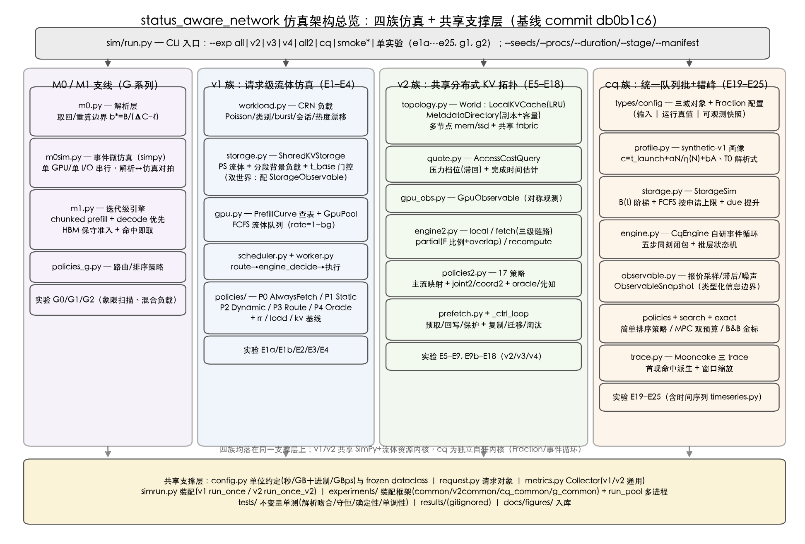
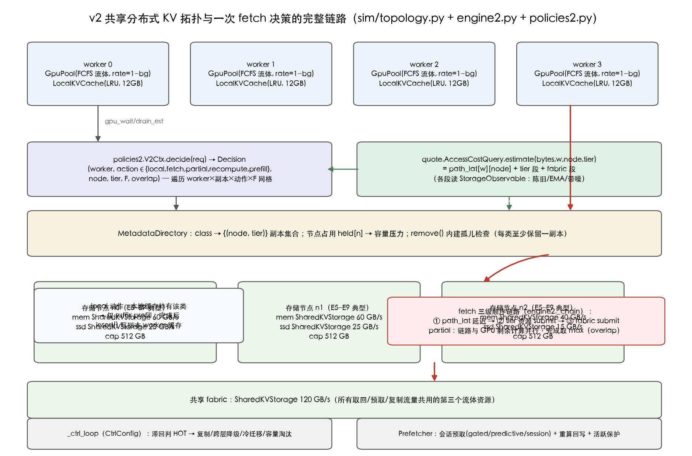
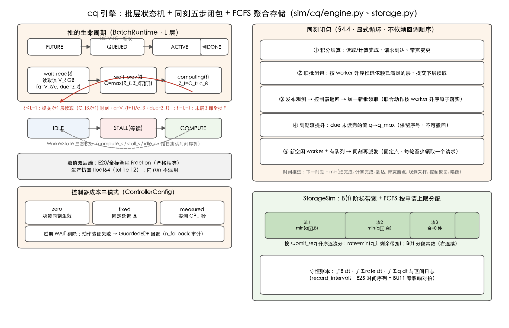
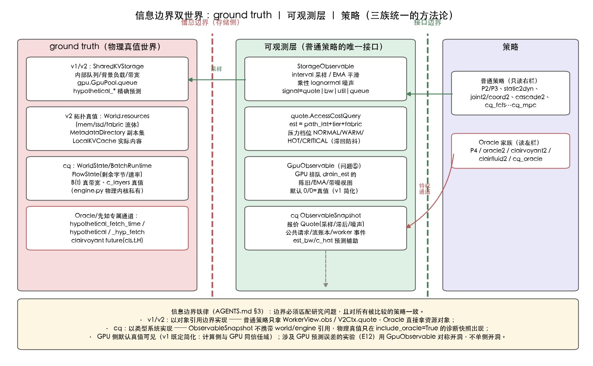
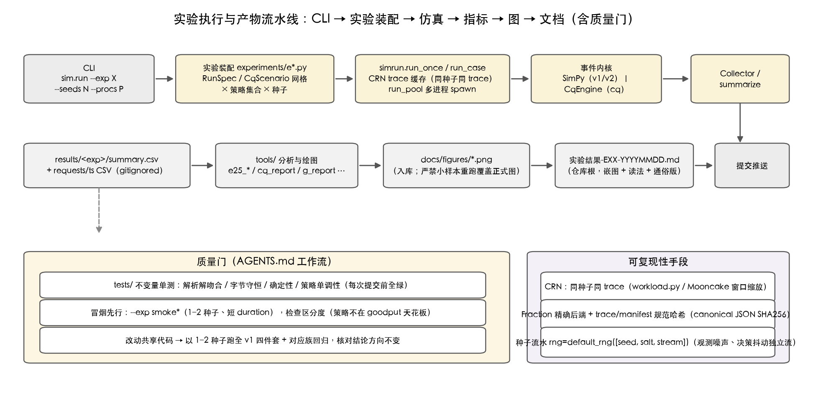

# 仿真架构分析（20260921）

| | |
|---|---|
| **目的** | 盘点当前仿真代码的完整架构：模块分层、事件内核、信息边界、实验装配与产物流水线，为后续修改/扩展提供地图 |
| **范围** | `sim/`、`tests/`、`tools/` 的**现状**描述；实验结论本身见根目录 `实验结果-*.md`，不在本文重复 |
| **代码基线** | commit `db0b1c6`（工作区另有 e23 相关未提交修改，见 §9） |
| **方法** | 逐文件精读源码归纳；配图 5 张（`figures/fig_arch_*.png`，由 `tools/arch_figs.py` 生成，可重跑） |

---

## 1. 总览：四族仿真 + 共享支撑层

**图 A 读法**：入口只有 `sim/run.py` 一个 CLI；向下分成四个互相独立的仿真族（泳道），全部落在同一共享支撑层（配置/请求对象/指标/实验装配/测试）上。v1 与 v2 共享 SimPy + 流体资源内核（`storage.py`/`gpu.py`），cq 是后起的独立自研内核，与 v1/v2 无代码复用。

| 族 | 目录 | 事件内核 | 对应实验 | 研究对象 |
|---|---|---|---|---|
| M0 / M0sim | `sim/m0.py`、`m0sim.py` | 无（解析）/ simpy 微仿真 | R0 | 取回 vs 重算的解析边界、解析↔仿真一致性 |
| M1 + G 系列 | `sim/m1.py`、`policies_g.py` | simpy，迭代级 | G0/G1/G2 | 全局共享 KV 场景的准入/排序（chunked prefill、HBM 容量） |
| **v1** | `sim/{storage,gpu,scheduler,worker,workload}.py`、`sim/policies/` | SimPy + 流体资源 | E1a–E4 | 单/多 backend 下存储压力感知的 fetch/recompute 决策与路由 |
| **v2** | `sim/{topology,quote,engine2,policies2,prefetch,gpu_obs}.py` | SimPy + 流体资源 | E5–E18 | 共享分布式 KV 拓扑：worker×副本×动作×F 联合决策、复制/预取闭环 |
| **cq** | `sim/cq/`（13 个模块） | **自研**事件循环（无 SimPy） | E19–E25 | 共享 KV 统一队列下的 Batch 组批与错峰调度 |

演进逻辑：M0 先手算出机制边界 → v1 把机制放进请求级仿真 → v2 引入真实拓扑（本地缓存/多副本/分层/部分取回）→ cq 换问题（统一队列 + 批 + 错峰），同时把方法论升级（Fraction 精确后端、类型化信息边界、控制器成本建模、精确求解金标）。M1/G 是与 v2 并行的支线，聚焦迭代级（token 预算）而非请求级抽象。

Python 代码量级：`sim/`+`tests/`+`tools/` 合计约 1.8 万行；实验文件 28 个（+4 个装配公共模块）、`test_*.py` 10 个（另加 `tests/cq_reference.py` 参考实现）。

---

## 2. 共享支撑层

- **单位与配置（`sim/config.py`）**：时间秒、字节 GB（十进制）、带宽 GB/s。全部参数为 `frozen dataclass`；分段常数背景负载统一用 `((t0, v), ...)` schedule（右连续，`piecewise_value`/`next_breakpoint` 求值）。`RunSpec` 是一次运行的完整描述（策略、种子、duration/warmup/margin、观测、策略超参、v2 拓扑挂载点 `topo`），`topo is None` 即 v1 模式——v1/v2 共用同一 RunSpec 与同一 `run_once` 入口。
- **CRN 负载（`sim/workload.py` + `simrun.get_trace`）**：Poisson 到达 + 类别抽样 + burst / 会话（首轮 miss 后续 hit）/ 热度漂移（类份额周期轮转）四种 trace 生成器；`(seed, duration, wl, burst, sessions, drift)` 为键做进程内缓存，同种子产生逐字节相同的 trace，这是全仓库"控制变量对比策略"的基础。
- **指标（`sim/metrics.py`）**：`Collector` 为 v1/v2 通用——请求级事件（到达/决策/完成）、窗口指标（burst 窗口）、粗采样（0.1s 队列/GPU 利用率）、可选细时间序列（0.01s）、汇总（goodput=SLO 达标数/时长、TTFT 分位、动作占比、quote MAPE、副本翻转率等）。统计口径统一为 `[warmup, duration)` 到达的请求。
- **CLI（`sim/run.py`）**：`_MODULES` 注册 22 个 v1/v2/G 实验，`_CQ_MODULES` 注册 7 个 cq 实验；聚合档位 `all/v2/v3/v4/all2/cq` 与冒烟档 `smoke/smoke2/smokeg/smokecq`（2 种子 + 短 duration）。cq 实验额外消费 `--stage/--manifest/--trace-dir/--seed-start`（train/eval 必须 manifest）。
- **并行装配（`sim/experiments/common.py`）**：`run_pool` 用 multiprocessing spawn 并行跑 `(meta, spec)` 作业；`save_rows` 落 `results/<exp>/summary.csv`；统一 matplotlib 样式与 `savefig`。

---

## 3. v1 族：请求级流体仿真（E1–E4）

### 3.1 一次运行的数据流（`simrun.run_once`）

trace 回放 → 每个到达的请求经 `Scheduler.dispatch`（先 `policy.route` 选 worker，再 `policy.engine_decide` 选动作）→ `Engine.handle` 执行：
`fetch` = `storage.submit(kv_gb)` 等完成后 `gpu.submit(suffix_tokens)`；`recompute/prefill` = 直接 `gpu.submit(prompt_tokens)`。两个 ticker 进程定期 `advance_to` 推进流体资源并采样（粗 0.1s / 细 0.01s）。`env.run(duration + margin)` 给在途请求留完成余量。

### 3.2 流体资源内核（`storage.py` / `gpu.py`）

- **`SharedKVStorage`**：processor sharing 共享带宽。`cap(t) = b_total − bg(t)` 在活跃传输间均分；传输有 `t_base` 门控期（不占份额不计分母）；`advance_to` 在完成点/门控点/背景负载断点处切分推进——**解析精确，无离散步长近似**。同一内核被 v2 复用为 mem/ssd/fabric 三类资源。
- **`GpuPool`**：每 worker 一个 FCFS 流体队列，服务速率 `1 − bg_gpu(t)`（背景负载 reserved-capacity 模型）；prefill 时长由 `PrefillCurve` 查表 + 分段线性插值。
- **Oracle 接口**：`hypothetical_fetch_time` / `hypothetical` 在不改变世界的前提下精确推演"假如现在插入我会何时完成"（含未来背景负载），供 P4/oracle2 使用。

### 3.3 策略阶梯（`sim/policies/`）

| 策略 | 类 | 信息源 |
|---|---|---|
| P0 `p0` | AlwaysFetch | 无（命中即取） |
| P1 `p1` | StaticCost | nominal 带宽解析估计 |
| P2 `p2` | DynamicCost | `StorageObservable`（陈旧/EMA/噪声） |
| P3 `p3` | StorageAwareRoute | 同 P2，但 route 与 action 联合取 min 代价 |
| P4 `p4` | Oracle | ground truth + hypothetical 精确推演 |
| 基线 | rr / load / kv | 轮询 / 最短队列 / KV-aware 路由 |

E3 的信号设计实验切换 `ObsConfig.signal ∈ {quote, bw, util, queue}` 四种估计口径；滞回 `margin=0.10` 防止 fetch/recompute 抖动切换。

---

## 4. v2 族：共享分布式 KV 拓扑（E5–E18）

**图 C 读法**：上半是决策层（策略遍历 worker×副本×动作×F 网格，成本来自 quote 接口），下半是物理层（4 个计算节点 + 3 个存储节点 + 共享 fabric）。红色路径是一次 `fetch` 的三级顺序链路；`partial` 动作把这条链路与 GPU 剩余计算并行。

### 4.1 World（`topology.py`）

- 每 worker：`GpuPool` + `LocalKVCache`（LRU，`serve`/`prefetch` 双来源，`coord` 模式按 crc32 一致性哈希限写入偏好 worker；问题⑫的活跃会话保护集）。
- 每存储节点：mem/ssd 两个独立 `SharedKVStorage`（各自带宽与背景负载）+ 容量 `cap_gb`。
- `fabric`：全所共用的第三个流体资源；`resources` 统一列表 `[n0.mem, n0.ssd, …, fabric]` 供采样与索引。
- `MetadataDirectory`：class → {(node, tier)} 副本集合 + 节点占用；`remove()` 内建孤儿检查（不允许删到零副本）。

### 4.2 决策与执行

- **`Decision`**（`policies2.py`）：`(worker, action, node, tier, fetch_tokens, fetch_gb, overlap, cost)`——携带执行所需全部信息，执行器无再决策。
- **`quote.AccessCostQuery`**：`estimate = path_lat + tier 段估计 + fabric 段估计`（各段来自对应 `StorageObservable`）；压力档位 NORMAL/WARM/HOT/CRITICAL 升档直达、降档单级滞回。
- **`EngineV2`**：`local`（仅 suffix prefill）/ `fetch`（三级链路→suffix）/ `partial`（F 比例取回，overlap 时完成取 max）/ `recompute`、`prefill`；命中完成后把前缀写回本 worker 本地缓存。
- **17 个策略**（`V2POLICIES`）：主流默认映射（`default2`≈Dynamo+vLLM、`tensorcast2`、`static2`≈AAFLOW+、`partial_static2`≈CacheFlow、`cascade2`）、本方向 `joint2`/`coord2`（+滞回/概率分流/在途影子项三重协同）、真值上界 `oracle2`、先知 `clairvoyant2`（未来视线 list-scheduling）与 `clairfluid2`（burst 流体最优比例切分）。
- **两个闭环控制器**（`simrun._ctrl_loop` 与 `prefetch.py`）：前者周期评估可观测 util，滞回判 HOT 后做复制/跨层降级/冷类迁移/容量淘汰（冷却防 churn）；后者做会话预取（gated/predictive/session 三模式 + 准入检查防驱逐连锁）与重算后异步回写。
- **GPU 对称观测（`gpu_obs.py`，问题⑤）**：默认 interval=0 且噪声=0 等价真值（保持 v1 既有结果可复现），E12 扫描时启用，保证信息边界不单侧开洞。

---

## 5. cq 族：统一队列批 + 错峰调度（E19–E25）

与 v1/v2 的关键差异：**不用 SimPy**（自研事件循环，原因是同刻闭包语义与 Fraction 精确性需要在引擎层显式控制）；**请求以批为单位领取**（统一队列 + 硬可行域）；**决策对象是联合动作**（多个空闲 worker 同刻一起领批）；**控制器有显式成本**（zero/fixed/measured 三模式）。

**图 D 读法**：左侧是三个正交状态机（请求四态、批的 L 层循环、worker 三态积分）与数值双后端；右上是一个事件时刻内的五步处理顺序（闭包到固定点才推进时间）；右下是聚合存储的 FCFS 分配与守恒账本。

### 5.1 三域类型（`types.py`）

不可变输入（`RequestSpec`、`Action`、`JointAction`、`HardLimits`）｜运行状态真值（`RequestRuntime`、`BatchRuntime`、`FlowState`、`WorkerState`，仅引擎与显式 Oracle 可见）｜可观测快照（`ObservableSnapshot`）。数值类型 `Fraction | float` 二选一，同 run 不混用。

### 5.2 计算画像（`profile.py`）

synthetic-v1 真值：每层计算 `c_βℓ = t_launch + aN/η(N) + bA`，`N=Σu`、`A=Σ[uh+u(u+1)/2]`（真实 token，不 padding），`η(N)=min(1, max(1/16, N/N_sat))` 是批加速；读取字节 `V = κ·h`；内存峰值约束进 `is_feasible`（1≤n≤n_max、Σu≤token_max、MemPeak≤workspace）。`singleton_K` 给出空系统单请求解析服务时间，作 T0 参考与归一化分母。`ProfilePredictor` 提供最近邻替身（合成真值模式下误差为 0）。

### 5.3 聚合存储（`storage.py`）

`B(t)` 阶梯带宽，FCFS 按 `submit_seq` 升序分配 `rate = min(q_i, 剩余)`；`due` 到期未读完的流提升 `q→q_max` 且保留原序号（lookahead 错峰的执行语义）。三个积分账本（∫B、∫Σrate、∫Σq）+ 可选区间日志支撑守恒校验。

### 5.4 引擎（`engine.py`）

事件源 = min(读完成、计算完成、到达、带宽断点、观测采样、控制返回、唤醒)。同刻五步闭包（图 D 右上）。批层推进：层 ℓ 计算启动时按 `q = min(q_max, V_{ℓ+1}/c_β)`、`due = Z_ℓ` 提交 ℓ+1 层读取流——**错峰在物理上有显形**。`clone_for_search` 深拷贝世界供搜索分支；`advance_until/advance_to_completion` 供精确求解与推演复用；`max_events` 事件预算可截断 runaway 推演。

### 5.5 可观测层（`observable.py`）

报价 `Quote`（采样时刻/交付时刻/带宽估计/各流已服务字节）按 `sample_period` 采样、`delivery_lag` 滞后交付、σ 乘性噪声（均值还原）；三种模式 `history|current|current_oracle`。`ObservableSnapshot` 是普通策略唯一输入，不携带 world 引用（信息边界的类型化实现，见 §7）。在线参数：`guard_w = 2×T0 滚动 P95`（样本<20 禁用）。

### 5.6 策略与求解（`policies.py`、`search.py`、`exact.py`）

- **简单策略**（`cq_fcfs/lpm/spt/edf/slack/pair`）：统一 `SimplePolicy` 填批——排序后前缀贪心，**首项失败即停不跳过**；`pair` 以最老请求为锚做读写互补配对。老化锚点保证超限请求强制入批。
- **`cq_mpc` / `cq_local`**（`MPCPolicy`）：候选批目录（四列表轮询选请求 × 同形/互补/紧迫三顺序，保留全部中间批，K_batch 截断）→ 联合动作逐 worker 扩展 → 每个候选用**从快照重建的估计世界**闭环排空打分（θ=M/S/T/R 词典序目标）→ gate 后替换基础动作。双预算：CPU 软预算 2ms + 事件预算 20000。`cq_local` 用独立带宽存储消融"预测是否建模跨 worker 干扰"。
- **E20 精确金标**（`ExactSolver`）：Fraction 网格（δ=1/2）上全动作枚举或 B&B（LB：目录最优 singleton 均摊 + 剩余计算/读取负载下界），给出 LB/UB 证书，用于校验简单/MPC 策略与最优的差距。

### 5.7 trace 与指标

`trace.py`：Mooncake 三份原始 trace（conversation/toolagent/synthetic，SHA256 固定）→ 首现命中派生文件 `derived/*.hit.jsonl`（hit+u=input、u≥1，frozen catalog 假设 = 前 20% 请求块构成的 trie）→ 全量时间等切 20 窗、按目标 λ 缩放到达（保留同刻 burst）、`deadline = arrival + α·T0`。`metrics.py` 用 cohort 口径（有限工作集全体计入；在线模式 `[warmup, arrival_stop)`），未完成请求**右删失**（F=null、报 TTFT 下界）。`timeseries.py`（E25）是事后只读聚合：worker 段日志 + 存储区间账本 + 到达-完成积压，锚定 200 桶网格，∫B 用 schedule 闭式解析积分复算守恒（失败抛 `TsConservationError`，该 run 不得进图）。

---

## 6. M0 / M0sim / M1 支线

- **M0（`m0.py`）**：纯解析。`RecoveryCost` 给出取回/重算交叉边界：`F = ℓ + B/bw`，取回划算 ⇔ `F < ΔC = R−P`，带宽阈值 `b* = B/(ΔC−ℓ)`（ΔC≤ℓ 时无解）。
- **M0sim（`m0sim.py`）**：单 GPU/单 I/O 串行 FCFS 的 simpy 微仿真，产出甘特区间与逐资源 busy 账本，对拍 M0 解析值（R0 的"解析一致"证据）。
- **M1（`m1.py` + `policies_g.py`）**：迭代级引擎——每迭代先推全部 decode，剩余 token 预算按准入顺序切 prefill chunk（vLLM V1 式）；活动集合按 (N+O) 全程预留 HBM（保守准入、无抢占）；命中即取在到达时提交 fetch。G 系列（g1 象限扫描 / g2 混合负载）在此之上比较 D2 排序/门控策略（含双上限档位门控 D2d、guardband γ）。

---

## 7. 横切设计原则：信息边界的三个实现层次

**图 B 读法**：左栏是物理真值（只有 Oracle 家族可读），中栏是可观测层（普通策略唯一接口），右栏是策略。这是三族共用的方法论骨架，但实现手段逐族收紧：

| | v1 | v2 | cq |
|---|---|---|---|
| 普通策略看到什么 | `WorkerView.obs`（StorageObservable） | `V2Ctx.quote` + `gpu_obs` | `ObservableSnapshot`（类型不含 world 引用） |
| 边界靠什么保证 | 对象引用（拿不到真值对象） | 同左 + GPU 侧对称观测 | **类型系统**（快照物理上不可达真值；诊断快照 `include_oracle` 显式开洞） |
| Oracle 通道 | `hypothetical_*` 精确推演 | 同左 + clairvoyant 未来视线 | `include_oracle` / `cq_current_oracle` |

配套纪律（AGENTS.md §3）：边界必须匹配研究问题、对所有被比较策略一致；GPU 侧默认真值可见是 v1 既定简化，涉 GPU 误差的实验（E12）用 `GpuObservable` 对称开洞。E7 的设计（各策略共享相同动作空间，只差决策信息源）是这一原则的实验面。

其他横切原则：**CRN**（同种子同 trace，策略间唯一差异是决策）；**流体近似 + 事件精确推进**（v1/v2 资源在断点处解析切分；cq 用 Fraction 在网格点上严格相等）；**确定性种子流水**（`default_rng([seed, salt, stream])`，观测噪声/决策抖动独立流）；**可复现产物链**（trace/manifest 规范 JSON SHA256）。

---

## 8. 实验执行与产物流水线

**图 E 读法**：第一行是执行链（CLI → 实验装配 → 仿真运行 → 事件内核 → 指标），第二行是产物链（summary.csv → tools 分析 → docs/figures → 根目录结果文档 → 提交）。左下质量门与右下可复现性手段是流程的两条护栏。

要点：

- `results/` gitignored；`docs/figures/` 入库；**严禁**用少量种子重跑覆盖已入库正式图（回归验证后 `git checkout --` 恢复）。
- 测试布局：`test_sim.py`（v1 解析吻合/守恒/确定性）、`test_v2.py`（拓扑与策略）、`test_m0/test_m1.py`、`test_cq_units/plans/trace/ts/derive/e25.py`（cq 六个面：单元不变量、四计划金标、trace 导入校验、时间序列守恒、首现命中派生、E25 专项）+ `cq_reference.py` 参考实现。
- 提交纪律：每完成一个逻辑单元即提交推送（用户已授权常态推送）。

---

## 9. 架构债与已知局限（现状披露，非待办清单）

1. **`MPCPolicy` 的 H>1 未实现**：`search.py` 明示逐决策点分支未实现，统一按 H=1 语义执行并记 `n_depth_clamped` 审计（20260917 审计发现原 beam 从排空态展开无效后的诚实处理）。E25 报告引用 MPC 结论时应记得它实际是 H=1。
2. **`_TRACE_CACHE` 无界**（`simrun.py` 模块级 dict，键含完整 WorkloadConfig）：大批量网格实验的长驻进程内存单调增长；当前实验规模下未构成问题。
3. **指标双轨**：`sim/metrics.py`（v1/v2 Collector）与 `sim/cq/metrics.py`（cohort 口径 + 右删失）分属两套世界，语义不同（前者 warmup 窗口、后者右删失下界）。AGENTS.md 已把"重写的 metrics.py"列为 v2 期间的真实风险源；两轨之间没有任何共享或换算。
4. **两套事件内核不互通**：SimPy（v1/v2/M0sim/M1）与自研 CqEngine 并存。cq 选自研有明确理由（同刻闭包 + Fraction），但意味着流体资源、观测层、指标能力在三族间各写一份。
5. **`measured` 控制成本不可跨机复现**：用 `perf_counter` 实测 CPU 秒作为决策延迟，机器相关；跨机器对比时应用 fixed 模式。
6. **小残留**：`quote.estimate` 的 `noisy` 参数形同虚设（`t *= 1.0`，噪声已在 Observable 段内叠加——代码有注释说明）；`worker.py` 的 `metrics.on_fetch_done` 是空占位；`run.py` 的 cq 专属参数与旧实验共用一个 argparse namespace。
7. **工作区未提交修改**（基线 `db0b1c6` 之上）：`sim/experiments/e23_trace.py` 与 `docs/figures/cq_fig_e23_*.png` 两图有未提交改动，属 E23 进行中的工作，本文未触碰。

---

## 10. 目录速查（增量版，完整版见 AGENTS.md §8）

| 内容 | 位置 | 备注 |
|---|---|---|
| v1 核心 | `sim/{config,storage,gpu,scheduler,worker,workload,request,metrics,simrun}.py` | SimPy + 流体；`simrun.run_once` |
| v1 策略 | `sim/policies/{base,always_fetch,static_cost,dynamic_cost,storage_aware_routing,oracle,routing_baselines}.py` | P0–P4 + rr/load/kv |
| v2 核心 | `sim/{topology,quote,engine2,policies2,prefetch,gpu_obs}.py` | `simrun.run_once_v2`（同文件下半部） |
| cq 核心 | `sim/cq/{types,config,profile,storage,engine,observable,policies,search,exact,trace,metrics,timeseries,simrun}.py` | 自研内核；入口 `cq/simrun.run_case` |
| 解析支线 | `sim/{m0,m0sim,m1,policies_g}.py` | M0/M0sim/M1+G |
| 实验 | `sim/experiments/e*.py` + `{common,v2common,cq_common,g_common}.py` | 注册于 `sim/run.py` |
| 架构图 | `tools/arch_figs.py` → `docs/figures/fig_arch_*.png` | 本文图 A–E，可重跑再生 |

---

## 附：与既有文档的关系

本文是**架构现状**的快照，不推翻任何既有结论；机制语义与基线映射以 `docs/五工作的Scheduler-Engine修改与主流默认实现-20260904.md` 为准，cq 的规格语义以 `docs/共享KV统一队列Batch与错峰调度-仿真实验设计实施与测试规格-20260915.md` 与 `docs/共享KV调度因子地图与时间序列-E25设计与测试规格-20260916.md` 为准。若后续重构与本文冲突，以代码为准并更新本文。
