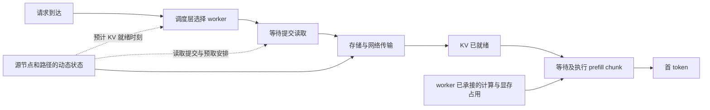

# 全局共享 KV 的调度与 Prefill 顺序研究逻辑

| 项目 | 说明 |
|---|---|
| 日期 | 2026-09-08 |
| 用途 | 解释存储状态如何影响 worker 选择和 prefill 顺序，并给出可证伪的实验设计 |
| 场景 | 所有 worker 共享同一 KV 目录，跨请求复用的 KV 从存储取回，worker 不保留本地复用缓存 |
| 本文状态 | 研究梳理与设计建议，未修改仿真代码，未运行新实验 |
| 阅读材料 | [默认策略公式](调度与执行顺序默认策略公式级梳理-20260908.md)、[G 系列设计](全局共享KV场景的存储感知调度策略与实验设计-20260908.md)、[G0/G1/G2 结果](../实验结果-G0G1G2-20260908.md) |

**最值得先回答的问题是，在读取相同 KV、执行相同计算的条件下，知道数据什么时候到，能否让请求分配和 GPU 执行安排得更好。** 先固定命中即取，把 worker 选择与 prefill 顺序各自的作用测清楚。取回还是重算、从哪个副本取，分别作为另外的实验变量。

现有 G1 已经观察到取算切换和副本选择的影响。用户关心的两条主线仍待验证。D1a 同时选择 worker、副本与取算动作，D2b 改的是取算动作；它们的收益不能直接回答“选 worker 有什么用”或“prefill 换个顺序有什么用”。

本文对照了当前实现，并于 2026-09-08 重新查阅 Dynamo、vLLM、SGLang 官方文档和 Mooncake 原文。文中的公式与手算例子是本研究的推导；已有运行数字只引用原结果报告。

## 1. 先把研究对象固定下来

“全局可见”表示每个 worker 查询到相同的可复用前缀及副本集合。“从存储取回”表示命中前缀不能通过 worker 的跨请求本地缓存直接复用。两者一起消除了本地命中优势，但仍允许不同 worker 的接收路径、排队情况和可用显存不同。

活动请求需要把 KV 放在 HBM 中执行；decode 继续使用本请求的 HBM KV。这里关闭的是跨请求本地复用。无命中的后缀仍需 prefill，新产生的 KV 也无需先绕到存储再读回来。

本轮问题建议采用以下边界。

| 项 | 主线设定 | 原因 |
|---|---|---|
| 命中前缀 | 固定 fetch，不主动重算 | 保证读取量和计算工作量可比较 |
| 副本 | 初始用单副本，或冻结所有策略相同的选源规则 | 把副本选择与 worker 选择分开 |
| worker | 同构，目录完全相同 | 排除本地缓存优势；路径对称性单独控制 |
| prefill | 研究 waiting 准入顺序，另列 chunk 执行顺序 | 两者改变的时间点不同 |
| decode | 固定调度纪律，保留其 GPU 时间与 HBM 占用 | decode 虽不反复读共享 KV，仍会影响 prefill 能拿到的资源 |
| 存储放置 | 冻结，不增加复制、去重、迁移 | 避免从其他数据能力获得收益 |

这把旧设计 S-G-4 的 `{fetch, recompute}` 主动作空间收窄为命中即取，目的是先回答本次指定的两个问题。取算研究保留为扩展，旧实验仍按原动作空间解释。

## 2. 一个请求到底在等什么



把几个时刻记下来，许多混乱就会消失。

| 符号 | 含义 | 单位 |
|---|---|---|
| \(a_i\) | 请求到达时刻 | 秒 |
| \(H_i,U_i\) | 命中前缀长度、待计算后缀长度 | token |
| \(B_i\) | 要取回的 KV 大小，由 \(H_i\) 与模型结构确定 | GB |
| \(f_i\) | 读取实际提交时刻 | 秒 |
| \(r_i\) | KV 到达可执行位置的时刻 | 秒 |
| \(s_i\) | 第一个 prefill chunk 开始时刻 | 秒 |
| \(F_i\) | 首 token 产生时刻 | 秒 |
| \(d_i=a_i+S_i\) | TTFT 的绝对截止时刻，\(S_i\) 为该请求的 TTFT 目标 | 秒 |

在整段 KV 就绪后才开始后缀计算的模型中，实际观测满足

\[
TTFT_i=F_i-a_i
=(f_i-a_i)+(r_i-f_i)+(s_i-r_i)+(F_i-s_i).
\]

四段依次是读取提交前等待、取回耗时、数据就绪后的 GPU 等待、从首次 prefill 到首 token 的耗时。最后一段包含后续 chunk 间等待，不能全部记成 GPU 计算时间。

**取回与既有 GPU 工作可以同时推进。** 若当前时刻为 \(t\)，新请求立即读取，估计还需 \(\widehat E_i(w)\) 秒取回，worker 还需 \(\widehat G_w\) 秒才能提供一个连续可用时段，那么简单预测为

\[
\widehat F_i(w)-t
\approx \max\{\widehat E_i(w),\widehat G_w\}
+\widehat C_i(w).
\]

\(\widehat C_i\) 是后缀 prefill 到首 token 的剩余服务时间估计。它应考虑上下文长度、batch 和 chunk 规则，不能普遍只看 \(U_i\)。

这与 \(\widehat G_w+\widehat E_i+\widehat C_i\) 有区别。例如 GPU 还忙 0.6 秒，取回需 0.4 秒，计算需 0.1 秒，理想重叠后共需 0.7 秒；直接相加得到 1.1 秒。只有读取必须等 GPU 排队结束后才发起，或排队项已经定义成取回后的等待时，相加才对应这条执行路径。

`max` 也只是教学近似。真实 chunked prefill 可能穿插于 decode，worker 有多个未来空档。实现时应使用共同的时间表预测器

\[
\widehat F_i(w)=\operatorname{PredictFirstToken}
\bigl(w,\widehat r_i,\text{已承接请求},\text{共同引擎规则}\bigr).
\]

它必须计入已分配但还在取回的请求，否则一台 GPU 此刻看起来空闲，几百毫秒后却可能收到一批同时就绪的工作。

## 3. 存储需要告诉两层什么

两层最先需要的是**针对这个请求、这个源、这个目标 worker 的预计 KV 就绪时间**。整个存储集群的平均利用率不足以完成这个判断。

| 状态 | 能解释什么 | 调度层怎么用 | 引擎层怎么用 |
|---|---|---|---|
| 源节点当前剩余工作量、服务能力 | 这个 KV 会在源端等多久 | 预测各候选 worker 的取回完成时间 | 判断还未提交的读取何时应开始 |
| fabric、目标接收链路的状态 | 拥堵是否只影响部分 worker，换源能否绕过 | 区分可选路径，识别所有候选共用的瓶颈 | 管理在途读取与预计到达节奏 |
| 本次读取剩余 GB、完成事件 | 已经传到什么程度，数据是否真正可用 | 更新该 worker 将来的 prefill 工作 | 未就绪请求不进可执行集合；已就绪时无需再猜取回时间 |
| 请求级取回时间估计与误差范围 | 同样大小的数据此时要等多久 | 与 GPU 可用时段一起预测首 token | 安排读取提前量，做截止期风险预测 |
| 时间戳、瓶颈标识 | 快照是否过期，多个估计是否竞争同一资源 | 防止所有 worker 同时相信同一份空闲容量 | 跨 worker 的读取预算按共享资源合并记账 |

请求自己的 \(B_i,H_i,U_i,d_i\) 是决策上下文。它们不属于存储压力。GPU 负载、未来 prefill 工作、HBM 余量也由计算侧提供。把这些来源分开，才能回答“额外存储接口究竟增加了什么信息”。

一个可解释的串行 FIFO 近似是

\[
\widehat E_i(w,s)
=\ell_{ws}+\sum_{k\in path(w,s)}
\left(\widehat W_k+\frac{B_i}{\widehat b_k}\right).
\]

\(\widehat W_k\) 表示等待，\(\widehat b_k\) 表示轮到该读取后可用的服务带宽。如果拿到的是包含排队的端到端有效吞吐，就不能再加一次相同排队。若链路逐块流水传输，逐段完整相加也不再适用。

当前仿真存储采用流体共享，多个读取同时分带宽；`quote` 使用在途字节和容量构造代理估计。因此上述 FIFO 式不能直接当作当前模型的精确解析解。正确做法是先验证估计器与执行模型的一致性，再比较输入信号。见 [StorageObservable](../sim/storage.py) 和 [AccessCostQuery](../sim/quote.py)。

接口建议从 `预计剩余取回时间 + 时间戳 + 共享瓶颈标识` 起步。误差范围必须用预测与实际完成的残差标定。当前 `confidence` 根据采样间隔和噪声参数计算，只能当启发式分数，不能当作某个概率覆盖率。

## 4. 调度层选 worker，什么时候值得看存储

### 4.1 最直接的作用来自 worker 之间的取回差异

固定源和 fetch 动作，比较以下两个路由器即可。

\[
w_{base}=\arg\min_w\operatorname{LoadScore}(w,i),
\qquad
w_{aware}=\arg\min_w\widehat F_i(w).
\]

负载基线保留原系统的负载定义。增强策略把 KV 预计到达时刻带入首 token 预测。不能把“KV block 分数”和“秒”直接相加；若改成秒制成本，应为静态、历史、实时三组使用同一预测器，只有取回估计来源不同。

下面是人为设定的手算例子，忽略 batch 与显存竞争，后缀计算都需 0.05 秒。

| 候选 worker | GPU 还忙多久 | 本请求取回时间 | 预计首 token |
|---|---|---|---|
| A | 0.10 秒 | 0.80 秒 | 0.85 秒 |
| B | 0.25 秒 | 0.15 秒 | 0.30 秒 |

只看 GPU 负载会选 A；把数据到达时间算进去会选 B。两台 worker 看到完全相同的 KV，这个区别仍然成立，因为接收路径不同。

研究要继续追问差异来自哪里。静态路径延迟不同，可能只需静态估计；只有实时状态相对历史估计还能稳定改变选择并改善指标，才支持新增反馈接口。

### 4.2 共用瓶颈时，一个公共惩罚项经常改变不了选择

若所有 worker 的取回时间都为 \(E_i\)，GPU 同速，且只用上述标量 `max` 模型，则

\[
\arg\min_w[\max(E_i,G_w)+C_i]
\]

总能由最小 \(G_w\) 的 worker 实现。存储很慢时还会产生更多并列候选。给所有 worker 加上相同的“存储很忙”分数，不会增加可用带宽。

因此，对称路径、共同单瓶颈、相同资源能力、固定取回的简化场景，是**纯 worker 路由**的负控制。它不能用来否定副本选择或读取顺序，也不能预先要求 TTFT 在任何复杂时序模型下都逐位相同。

### 4.3 对称路径仍可研究数据到达与计算空档的配合

真实 worker 可能有不同的已承接请求，未来 KV 到达时刻也不同。即使新请求对所有 worker 的取回时间相同，这个就绪时刻落在哪台 worker 的空档中，仍可能不同。

这条主线需要比较同样会记录 waiting 和在途请求的两个路由器。一组用历史数据预测 KV 到达，一组用实时反馈预测。若基线只看 running，而增强组额外记录了全部等待工作，收益同时包含了记账改进，不能全部归给存储状态。

**D1 的清楚问题可以定成两种。** 一种是路径状态不对称时选到更合适的 worker；另一种是数据到达时间变化时，把未来 prefill 工作分配得更均衡。第二种的价值尚待实验，不由“全局共享”自动保证。

## 5. 引擎层的顺序需要分开研究

“先执行哪个请求”可能指三件不同的事。

| 顺序 | 选择对象 | 直接改变的量 | 是否需要存储预测 |
|---|---|---|---|
| 读取提交顺序 | 尚未提交 fetch 的请求 | \(f_i\)，进而改变 \(r_i\) | 常有需要 |
| prefill 准入顺序 | KV 已就绪、尚未进入运行集合的请求 | HBM 分配和进入 running 的时刻 | 就绪事实足够判断可执行性；更多预测的增量需另证 |
| prefill chunk 顺序 | 已运行但 prefill 未完成的请求 | 每步谁获得 token 预算、\(F_i\) | 当前就绪请求的旧取回耗时通常不再是剩余成本 |

### 5.1 只重排已就绪请求，主要是在分配 GPU 时间

先构造可执行集合

\[
\mathcal R_w(t)=\{i\mid KV_i\text{已就绪，且满足当前执行约束}\}.
\]

FCFS 在集合中按到达时间选；LPM 按命中长度选；短作业规则可按预计剩余 prefill 服务时间选。未就绪请求不能因为排序靠前而占用本可给 ready 请求的计算机会。

如果每次只有一个请求可选，或所有候选都能在同一步得到相同服务，任何排序都没有机会改变结果。如果同时有多个 ready 请求竞争有限 token 预算，**即使完全没有等待 KV 的队头阻塞，排序也可能改变 TTFT 和达标率**。

手算例子中，两个请求的 KV 已经取回，GPU 一次运行一个完整 prefill。A 需 0.30 秒，截止期还剩 1 秒；B 需 0.05 秒，截止期还剩 0.10 秒。A 先执行时 B 在 0.35 秒出首 token，超时；B 先执行时两者都达标。两种顺序的总 GPU 服务量和完工时长完全相同。

这里的收益来自计算服务时间与期限信息。存储过去花了多久已经反映在当前剩余截止时间里。若增强组只增加旧取回耗时，不能把这种通用排序收益称为实时存储反馈收益。

当前 vLLM 调度源码会跳过仍处于远端 KV 等待状态的请求。因而“绕过未就绪请求”应是所有比较策略共同的能力。[vLLM 调度源码](https://docs.vllm.ai/en/latest/api/vllm/v1/core/sched/scheduler/)

### 5.2 存储感知排序的直接作用，更容易出现在读取提交阶段

若所有请求到达即无限制提交 fetch，之后只改 GPU 队列顺序，就无法直接改变这批读取最初的提交顺序。要研究读取顺序，需要真实的竞争约束，例如有限读取槽、有限接收缓冲区，或本来就存在的按需加载流程。约束对所有策略相同，容量也应有可解释来源。

在“一个读取槽、一台 GPU、读取可与其他请求计算重叠”的手算系统中，两个请求同时到达且都必须 fetch。

| 请求 | 读取时间 | 后缀计算时间 |
|---|---|---|
| L | 0.80 秒 | 0.05 秒 |
| S | 0.10 秒 | 0.30 秒 |

| 读取顺序 | GPU 执行时间段 | 两个首 token 的时刻 | 最后一个首 token |
|---|---|---|---|
| L 然后 S | L 在 0.80 至 0.85，S 在 0.90 至 1.20 | L 为 0.85，S 为 1.20 | 1.20 秒 |
| S 然后 L | S 在 0.10 至 0.40，L 在 0.90 至 0.95 | S 为 0.40，L 为 0.95 | 0.95 秒 |

两种顺序读取相同字节，GPU 都计算 0.35 秒，区别在于工作怎样重叠。若 S 的 TTFT 目标为 0.50 秒、L 为 1 秒，第二种顺序让两者达标。这个例子证明读取顺序有作用的可能性，**不证明最短读取优先在一般负载下最优**。长读取后接很长计算、不同截止期、共享带宽和饥饿保护都可能改变最好的顺序。

在当前共享流体模型中，应让同样的有限提交槽控制各策略，只替换谁获得槽位。不能给新策略独占带宽、给基线共享带宽。

### 5.3 一套可解释的候选规则

先提供最少的对照，避免一次设计许多相近名字。

| 控制点 | 基线 | 候选增强 | 主要检验 |
|---|---|---|---|
| 读取提交 | FCFS，另加历史预测版本 | 按预计首 token 或截止余量排序 | 实时取回预测是否改善完成顺序 |
| ready 准入 | FCFS、LPM、外生 priority | 最早截止期 EDF、最小余量 | 通用计算调度能解释多少收益 |
| chunk 执行 | 共同的既有顺序 | 暂不改变；后续单独实验 | 避免把准入和运行中抢占混在一起 |

剩余截止时间与最小余量写成

\[
D_i(t)=d_i-t,
\qquad
Slack_i(t)=d_i-\widehat F_i^{\,now}(t).
\]

\(\widehat F_i^{\,now}\) 表示此时给该请求下一次服务机会，按共同执行模型预测的绝对首 token 时刻。读取未完成时，它包含剩余取回；数据已就绪时，剩余取回为零。按 slack 升序是一个候选启发式，不能保证最大 goodput。

负 slack 表示按当前预测已不可达标。让所有负 slack 请求永远压在可达标请求前面，可能降低总达标数。第一轮应保持统一的不丢弃规则，并报告这种代价；如加入过载拒绝或不可达标队列，必须作为共同能力及独立策略变量。

排序按调度时刻更新，共用带版本号的观测快照。不能为了可复现而永久冻结到达时的取回估计。CRN 应固定外生 trace 和观测过程；它不要求策略在需要时停止更新信息。公平性同时报告等待最久请求和长请求组达标率，采用相同的老化保护规则。

### 5.4 若研究预取，就记录提前取回的代价

预计 GPU 在 \(\widehat s_i\) 时可用，取回需 \(\widehat E_i\)，可把读取目标发起时刻设为

\[
f_i^{target}=\max\{t,\widehat s_i-\widehat E_i-m_i\},
\]

其中 \(m_i\) 是按估计误差确定的提前量。提前读取能减少 GPU 等数据，但会提前占用接收空间。容量约束至少要覆盖

\[
M_{active}+M_{ready}+M_{reserved\_inflight}\le M_{capacity}.
\]

若接收数据先放主机内存，应另有主机缓冲账，并把主机到 HBM 的搬运计入就绪过程。不能只给 running 记 HBM，却允许无限多已取回 KV 停在没有容量限制的地方。

读取门控应与提交顺序分别测量。门控降低并发，排序选择谁先读；它们可能改善紧急请求完成时刻，也可能只是多等。是否允许重算是第三个变量。

## 6. GPU 利用率、TTFT 与 SLO 为什么会朝不同方向变化

| 变化 | TTFT 可能怎样变化 | GPU 利用率可能怎样变化 | 需要同时核对 |
|---|---|---|---|
| 避开某个 worker 的拥堵接收路径 | 取回变快，尾部下降 | 等 KV 的空档减少时上升 | 新 worker 是否积压，decode 是否变慢 |
| 把就绪请求分配到可用 GPU | 就绪后等待减少 | worker 之间忙闲更均衡 | waiting 和在途请求是否都已记账 |
| 优先计算短或紧急的 ready 请求 | 部分请求提前，部分请求延后 | 固定工作量下可能完全不变 | 长请求与最差类别是否受损 |
| 调整读取顺序，改善取回与计算重叠 | 可更早启动有价值的计算 | 有限批次的空档可能减少 | 长读取是否饥饿，缓冲是否安全 |
| 增加 prefetch 并发 | 可能更早就绪，也可能互相稀释带宽 | 可能减少等待 | 在途 GB、HBM 占用、实际取回尾部 |
| 主动重算命中前缀 | 少等存储，但多做计算 | 忙碌度常上升 | goodput 是否下降，重复计算占多少 |

利用率在这里是解释指标。固定读取量与计算量时，调度改善的是空档、等待和资源分布；不能把利用率上升当作所有机制都必须达到的目标。仿真的 GPU 忙碌比例也不等于真实硬件的 SM 利用率或 MFU。

TTFT 与 SLO 要分开看。把一个已经很快的请求再加速，可能降低平均延迟，却不增加任何达标请求；把一个刚好会超时的请求提前一点，可能改善 goodput 而几乎不改变总体 P95。

建议主报 TTFT 达标率，同时保留原 serving goodput 的 TTFT 与 TPOT 联合约束。decode 的策略固定，但 prefill 会改变迭代耗时和后续 decode 到达，故 TPOT/ITL 仍是保护指标。vLLM 官方说明 chunked prefill 优先调度 decode，并用剩余 token 预算安排 prefill；这有助于 ITL，但不保证任意 prefill 工作量下 decode 延迟不受影响。[vLLM 调优文档](https://docs.vllm.ai/en/latest/configuration/optimization/)

资源指标统一用同一个测量窗口，逐台 GPU 分出必要 prefill、decode、重复重算和空闲原因；存储逐瓶颈报告前台有效 GB/s。未出首 token 的请求必须在未完成数和超时率中体现，不能只对已完成样本报一个很好看的尾延迟。

在固定 fetch、固定工作量、没有额外效率损失的理想共同瓶颈中，存在容量必要条件

\[
\lambda\,\mathbb E[B]<b_{available},
\qquad
\lambda\,\mathbb E[C_{prefill}]<g_{available}.
\]

第二式把保留给 decode 的能力扣除，并用一致的计算工作单位。真实 batching 下还需要服务曲线验证。这些条件只能界定资源上限，不能保证稳定或达标。调度可以改善到达上限前的空闲和尾延迟，无法靠重排创造额外物理带宽。

## 7. 原有方案如何保留为基线

沿用 [五工作映射](五工作的Scheduler-Engine修改与主流默认实现-20260904.md) 的 D1/D2/D4 分类。下表保留原材料中的方案位置；标为“沿用映射”的论文和产品本轮没有逐项重新复核全部实现细节，不据此新增默认值或性能声明，进入实现前仍需核实对应版本原文。

| 原方案 | 本研究保留什么 | 加存储状态时如何比较 |
|---|---|---|
| Dynamo | cache credit 加 prefill/decode 负载的路由形态，官方成本式本轮复核 | 原公式保留为参照；另做相同秒制预测器的静态、历史、实时输入对照 |
| SGLang Router、MindIE Motor | 沿用原映射中的缓存亲和与负载选择角色 | 全局命中对称后保留各自负载定义，不一律声称等价于同一个 `gpu_wait` |
| Preble | 沿用实例选择与本地公平排序两个部分 | 分别对照，不能把二者合成一个排序收益 |
| Mooncake | 传输成本、计算排队与 prefill 成本共同参与实例选择 | 作为最接近的机制参照；静态削弱版还需配历史估计强基线 |
| Kairos | 沿用 prefill 放置与 decode 约束的角色 | P/D 偏转超出本轮固定 worker 执行能力的主对照，后续另测 |
| Llumnix、TensorCast | 沿用负载路由及迁移/放置能力的分类 | 固定迁移能力；启用迁移必须单独归因 |
| DistServe | 沿用离线资源配置角色 | 固定实例数与算力配置，避免用扩容解释路由收益 |
| vLLM | FCFS、priority，及明确配置的 chunk/token 规则 | 各组共用异步读取与跳过未就绪请求的能力 |
| SGLang 引擎 | FCFS、可选 LPM 与 priority | LPM 保留为前缀排序基线；共享存储版本应说明哪些原有缓存能力被关闭 |
| TensorRT-LLM | 沿用保守显存准入这一比较维度 | 准入能力和顺序分开，部署默认值另按版本确认 |
| Sarathi-Serve | 沿用 chunked prefill 与 decode 保护角色 | 初期作为共同执行纪律，后续再变 chunk 策略 |
| FastServe | 沿用计算时间感知与抢占排序角色 | 作为通用计算调度参照，启用抢占时全部策略共享该能力 |
| Cascade | 沿用顺序 σ 与恢复 φ 分开的联合框架 | 主线先固定 fetch，只比较顺序；实时存储预测与通用 deadline 排序分别归因 |
| AAFLOW+、Cache Flow | 沿用取算选择及部分恢复的角色 | 放入取算扩展，不用于证明固定 fetch 下的 worker 或纯 prefill 排序收益 |

Dynamo 的官方模型同时包含 prefill、decode、可选活动请求项和非负截断。共同命中项意味着缓存位置不再区分 worker，**不能单凭这一点推出各路由器都与本仓库 `B-LL` 逐位等价**。[Dynamo 成本模型](https://docs.dynamo.nvidia.com/dynamo/knowledge-base/modular-components/router/routing-concepts)

SGLang 当前官方参数表的 `schedule-policy` 默认值为 `fcfs`，`lpm` 是选项；priority 的方向也需显式配置。旧报告多处把 LPM 标成默认，后续应更正名称。vLLM 的配置默认同为 FCFS，并支持 priority。[SGLang 参数表](https://docs.sglang.io/docs/advanced_features/server_arguments)；[vLLM 调度配置](https://docs.vllm.ai/en/latest/api/vllm/config/scheduler/)

Mooncake 原文讨论了 prefill 从分布式 KV 池复用前缀，并明确考虑发送端拥塞对传输时间的影响。旧材料把它收窄为“只服务 P/D 传输”不准确。本文保留其 D1 角色，将差异化问题收窄为固定共享存储场景中，反馈对 worker 分配与 prefill/读取时序分别有什么增量；目前不声称这是一块未经研究的空白。[Mooncake 原文第 6 节](https://arxiv.org/html/2407.00079v4#S6)

## 8. G0/G1/G2 能支持什么，哪些解释需要修正

原数字保留在 [结果报告](../实验结果-G0G1G2-20260908.md)，本文没有重新生成实验图，也没有重算效应量。

| 已有观察 | 当前可支持的判断 | 暂时不能支持的判断 |
|---|---|---|
| G1 I/O 紧时，D2b 的 TTFT P95 为 0.582 秒，B-Hist 为 0.733 秒；D2b 命中取回占比为 0% | 在该实现与参数下，主动重算显著改变结果 | 固定从存储读取时，路由或排序有同样收益 |
| G1 D1a 与 D2b 结果相同 | 当前联合枚举未显示额外结果收益 | 所有共享拓扑下选 worker 都没有意义 |
| G1 D1b 在 I/O 紧和双紧场景改善尾延迟 | 副本选择加并列随机化值得分别验证 | 改善全部来自新增状态；随机化本身的作用尚需隔离 |
| G2 I/O 紧时，多种排序 P95 同为 1.076 秒 | 当前负载和执行规则下，没有测出这些排序的增量 | 排序必须让未就绪请求堵住 GPU 才能有效 |
| 双紧场景中动态取算和 True-State 都有负收益 | 当前贪心决策不因换成即时状态而自动可靠 | 已经排除预测器、成本模型或记账缺陷，唯一原因就是缺少协同 |

代码核对又给出了几条会影响解释的证据。这些是下一次实现的前置检查，本次只记录。

| 当前实现证据 | 对研究结论的影响 | 后续需要做什么 |
|---|---|---|
| `LoadAware` 与 `DynKV` 使用相同决策表达式 | B-LL 与 B-DynKV 相同主要反映代码定义，不能独立验证真实 Dynamo 的公式退化 | 保留简化基线标签；若声称复现 Dynamo，应实现其原负载评分 |
| `M1Worker.wait_est()` 只统计 running，未纳入 waiting；D1 成本把 GPU 等待和取回相加 | 可能漏记未来计算工作，并错估取回重叠 | 用已承接工作的共同预测器，同时给历史和反馈策略使用 |
| `order_key()` 在到达时算一次，之后存进 `okey` | 当前 budget/ready 是到达快照排序，不能视为完整的动态剩余预算调度 | 以调度时刻、当前剩余工作和观测版本更新排序 |
| `_fetch()` 到达即发起；`_admit()` 跳过未就绪请求，HBM 只在准入时记账 | ready-only 排序没有直接控制读取提交，已取回缓冲也未受到独立容量约束 | 明确存放位置，分别提供读取队列与 ready 队列 |
| `_loop()` 给 prefill 使用完整 `token_budget`，没有减去 decode token；迭代时间为 prefill 与 decode 时间相加 | 当前是独立 prefill 预算简化，不能称为精确的 vLLM 剩余总 token 预算复现 | 先固定共同规则并修正文档，再做顺序比较 |
| 估计器使用 `curve(N)` 或 `curve(U)`，实际执行累加 `curve(chunk)` | 非线性曲线的整段预测与切块服务可能不一致，取算交叉点和预算会受影响 | 统一估计与执行，加入跨 chunk 大小的解析验证 |
| 多 chunk 时，必要/重复 prefill 归因在每个 chunk 内使用整批 `t_pre`；资源累积与请求测量窗口也不完全一致 | 资源分解可能重复计账，原报告利用率相关解释需复核 | 做每步分解守恒与统一窗口统计，避免把原图当成已校准证据 |
| `M1Metrics.summarize()` 的 attain/goodput 同时检查 TTFT 和 TPOT | 旧报告“生成间隔不计入达标”的局限说明与代码冲突 | 明确区分 TTFT 达标与联合 serving 达标 |

证据位置见 [策略代码](../sim/policies_g.py)、[M1 引擎与指标](../sim/m1.py)、[G 场景配置](../sim/experiments/g_common.py)。后续修复若改变旧结果，应新增结果文档说明原因，不能沿用旧图宣称新机制通过。

旧 G3 对称性负控制也应收窄到第 4 节声明的动作空间和预测结构。当前 G 场景路径表本身有差异，并非严格对称。重建负控制时，要核对源、路径、worker 服务能力、已承接工作和并列选择规则。

## 9. 下一轮怎样做，才能让实验回答问题

### 9.1 每次先确认策略有机会改变决定

每次调度记录候选集合、旧策略选择、新策略选择，以及被改变的时刻。最小机制链是

```text
存储观测发生变化
  → 候选 worker 或请求的预测次序发生变化
  → 实际分配、读取提交或 prefill 开始时刻发生变化
  → 等待与资源空档发生变化
  → TTFT 或达标结果发生变化
```

若候选集合长期只有一个，先报告没有决策空间。若预测不同但动作相同，接口对该场景没有决策增量。若动作不同而指标不变，再检查是否被共同瓶颈或充分重叠吸收。这样得到的负结果同样有意义。

冒烟需要统计 `多候选决策比例`、`新旧选择分歧率`、`ready 竞争 token 预算的步数`，以及读取槽/HBM 限制的实际触发次数。正式 go/no-go 前还要检查瓶颈位置和 SLO 天花板。

### 9.2 按因果问题组织实验

以下是对后续 G2/G3/G4/G5 的建议拆分，尚未注册为 CLI 实验，也未执行。

| 问题 | 固定什么 | 只改变什么 | 可证伪的预期及负控制 |
|---|---|---|---|
| 路径感知能否改善 worker 选择 | 命中即取、固定源、固定引擎顺序 | 历史与实时取回估计 | 目标入口动态拥堵时可能改善；完全公共成本且标量负载模型下不应获得额外容量 |
| 对称路径下，到达预测能否改善分配 | 相同路径、相同完整工作记账、固定源与顺序 | 已承接请求的 KV 到达估计来源 | 突发到达使未来 ready 工作不均时可能有用；历史已准确时应接近零增量 |
| 纯 ready prefill 排序有没有收益 | 路由和全部读取提交时刻 | FCFS/LPM/EDF/余量排序 | 多 ready 竞争预算时可能改变 TTFT；无竞争时应打平。存储预测增量另做消融 |
| 存储感知读取顺序有没有收益 | 路由、有限读取槽、缓冲容量、ready 执行规则 | FCFS/历史/实时读取优先级 | 不同读取时间与后缀计算组合下可能改善重叠；取消提交竞争后该通道应减弱或消失 |
| 状态给哪层有增量 | 相同 fetch、源规则、接口与执行能力 | Router 历史/反馈 × Engine 历史/反馈 | 报告单层收益和交互，允许重复信息产生零或负交互 |
| 最少需要哪些状态 | 已有可测收益的机制 | 利用率、带宽、工作量、请求级估计，以及状态年龄 | 历史足够时否定复杂接口；动态变化快于反馈时检验失效边界 |

每个机制至少有静态、历史、实时三档估计，使用相同的成本函数、记账和决策动作。原论文/系统形态用于说明相对现有方案的总收益；同机制的历史对照用于说明接口增量。两种比较都需要，不能互相代替。

`History` 不能只依靠一套未经检查的 EWMA 参数。开发集调参、冻结后测试，另记录各类预测误差与选择翻转。完美状态诊断仍使用同一决策器；其失败只能否定“换成即时状态就够了”，不能自动诊断出缺少哪一种控制机制。

### 9.3 用少数能解释原因的变量替代盲扫

| 变量 | 如何构造 | 能回答什么 |
|---|---|---|
| 候选路径时间差与估计误差之比 | 固定拓扑能力，改变某入口背景负载及反馈年龄 | 差异够不够大，能否被及时识别 |
| 读取相对 GPU 空档的长度 | 改命中长度，保持后缀不变；再独立改变 GPU 背景 | 读取延迟是否被计算等待完全遮住 |
| 读取与计算需求的相关性 | 独立控制 H 与 U，并加入长读取短计算等组合 | LPM、短读取优先和截止期规则在哪里改变优势 |
| 瞬时竞争程度 | 改 burst 大小，保留相同总请求量 | 平均利用率不高时，短时排队是否仍给排序机会 |
| 缓冲和读取槽容量 | 按可解释的接收实现设置，并保留宽松对照 | 收益是否依赖现实存在的资源限制 |

decode 输出长度第一步固定，第二步再用短/长输出做稳健性检查。这样可以先识别 prefill 机制，随后确认它没有依赖过于宽松的 decode 负载。

### 9.4 验收标准先冻结

设计与实现先解决第 8 节影响本轮比较的模型和计量问题，新增不变量测试覆盖就绪依赖、缓冲安全、服务工作守恒、预测退化和多请求解析顺序。按仓库规则跑单实验冒烟、检查区分度，再执行正式实验。

正式统计沿用 [纲领 v1.1 第 10 至 11 节](共享KV压力感知调度-研究推导与仿真实验纲领-v1.1-20260907.md)。同种子同 trace，至少 10 个种子，报告种子级配对差的中位数和 95% 置信区间。先冻结场景与主指标，保留有收益、无收益和负收益区域。

项目既有实用验收线是容量提高至少 5%，或固定负载主尾延迟下降至少 10%，并满足有效吞吐和类别服务约束；新增反馈成本计入结果。满足样本门槛的类组，达标率非劣允许幅度为 1 个百分点，按原纲领用区间判断。主场景仍沿用预注册的 I/O 紧与双紧两族；若因本次收窄动作空间需要调整结构，必须在新实验设计中说明原因并事前冻结。

只测到通用 EDF/SJF 的收益，结论就写通用排序有效；实时状态相对充分调优的历史预测无增量，就收窄接口主张。无需为了得到正结果再人为增加队头阻塞。

## 10. 给汇报使用的通俗解释

可以把每台 worker 看成一间厨房，共享存储负责送来已经备好的食材。所有厨房看到同一份菜单和库存，但送达路线和灶台排班可能不同。这个比喻只用来解释分工。

派单要看食材什么时候送到、届时哪间厨房有位置。所有厨房共用一部已经满载的货梯时，换厨房无法让货梯更快；如果某间厨房的接收通道单独堵了，换厨房就可能有用。

厨房内部也有两张顺序表，一张决定先领哪份食材，一张决定已到的食材先做哪道菜。食材都到了以后，过去送了多久已成为等待经历；接下来主要比较还要做多久、哪桌快超时。食材还没到时，提前量和领取顺序才会直接用到配送状态。

下一轮可以用几句明确的话汇报各组实验的目的。

| 实验问题 | 一句话读法 |
|---|---|
| worker 选择 | 检验派单时考虑送达时间，能否减少请求等机器或机器等数据 |
| ready prefill 顺序 | 检验同一份已就绪工作，换个计算顺序能救回多少超时请求 |
| 读取顺序 | 检验相同读取量下，先读谁能让存储和 GPU 配合得更好 |
| 两层协同 | 检验调度层安排的到达节奏，是否被引擎执行顺序保留下来 |
| 状态接口 | 检验实时信息比已有历史记录多帮助了哪些实际决定 |
