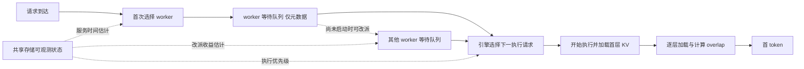

# 全局共享 KV 的调度与 Prefill 顺序研究逻辑

| 项目 | 说明 |
|---|---|
| 日期 | 2026-09-08 |
| 文档性质 | 研究问题、机制推导、策略与实验设计 |
| 研究场景 | 所有 worker 看到同一份全局 KV 目录；命中 KV 从共享存储加载；请求开始执行后才加载 |
| 核心决策 | 首次选择 worker、未执行请求的 re-schedule、worker 内 prefill 执行顺序 |
| 主要指标 | TTFT、TTFT SLO 达标率、prefill goodput、GPU 计算利用率与等待构成 |
| 参考材料 | [默认策略公式](调度与执行顺序默认策略公式级梳理-20260908.md)、[共享 KV 实验设计](全局共享KV场景的存储感知调度策略与实验设计-20260908.md)、[既有实验结果](../实验结果-G0G1G2-20260908.md) |

**存储状态的作用，是改变请求从开始执行到首 token 的服务时间，并使已经做出的分配决定随时间失效。** 调度层需要判断请求放在哪里、是否应该改派；引擎层需要判断当前先执行哪个请求。

这三个决定共享一个基础量，即加载与计算重叠后的 prefill 服务时间。研究重点是确定哪些信息足以支持这些决定、在哪些竞争条件下值得使用，以及一个请求变快是否会让其他请求变慢。层间 overlap 是所有策略共有的执行能力。

## 1. 场景与研究边界

### 1.1 请求什么时候读取 KV

请求在 waiting 中只保留输入、目录引用、到达时间和期限，不发起 KV 数据读取。被选入当前执行任务后，才加载第 1 层；计算第 l 层时最多加载到第 l+1 层。已经开始读取的请求不再属于本研究的 re-schedule 对象。

| 条件 | 固定设定 | 对研究的含义 |
|---|---|---|
| 全局可见 | 所有 worker 查询相同前缀与副本集合 | 消除跨 worker 本地命中优势 |
| KV 来源 | 命中即从存储加载，无主动重算 | 策略不通过增加计算换掉读取 |
| 存储放置 | 单副本或共同的固定选源规则 | 不把选副本、复制或缓存迁移的收益混入路由 |
| 等待期 | 不加载 KV | 未启动请求可改派，无需搬迁其 KV |
| 执行期 | 相同逐层流水，相同固定执行并发 | 排序改变谁启动，不改变底层执行能力 |
| 计算资源 | worker 为分配给 prefill 的固定资源份额 | 直接分析首 token 前的等待与工作 |
| 容量 | 固定模型、有限执行名额、共同容量检查 | 候选执行批必须放得下，不研究动态显存优化 |

### 1.2 decode 和 HBM 只作为边界条件

**主模型分析到首 token 为止，不模拟逐 token decode，也不研究 decode 排序和 KV 生命周期。** 共置任务的影响用所有策略相同的固定计算背景与容量预算表示。所得吞吐称为 prefill goodput，不能直接称为完整 serving 吞吐；需要外推到共置服务时，再做一组完整执行模型的稳健性验证。

HBM 保持有限，但只做共同的容量检查。固定模型的每层每 token KV 大小为 $\kappa_l$，请求要读取的大小为 $B_{i,l}=H_i\kappa_l$。执行名额及可用空间事先配置，保证活动任务放得下。等待请求不提前搬数据；已执行任务需要保留的 KV 不能因为按层计算就假设可立即释放。本研究不扫描模型结构、输出长度或显存分配策略。

这样可以把注意力集中在共享存储的读取压力、prefill 服务时间和调度决定上。

## 2. 存储状态怎样改变一个请求的执行成本

### 2.1 排队与执行分别计时

| 符号 | 含义 | 单位 |
|---|---|---|
| $a_i$ | 请求最初到达时刻，改派后也不重置 | 秒 |
| $u_i$ | 真正启动执行并发起首层加载的时刻 | 秒 |
| $F_i$ | 首 token 时刻 | 秒 |
| $H_i,U_i$ | 命中前缀长度、需要计算的后缀长度 | token |
| $x_{i,l}$ | 第 l 层从读取提交到 KV 可用的耗时 | 秒 |
| $c_{i,l}$ | 第 l 层后缀计算耗时 | 秒 |
| $A_l,R_l,C_l,Z_l$ | 第 l 层读取开始/读取完成/计算开始/计算完成时刻，以 $u_i$ 为原点（见 2.2） | 秒 |
| $d_i=a_i+S_i$ | TTFT 绝对截止期，$S_i$ 为该类 TTFT 目标 | 秒 |

$$
TTFT_i=Q_i+T_i^{pipe},\qquad Q_i=u_i-a_i.
$$

$Q_i$ 是启动前的总等待，包含改派过程；$T_i^{pipe}=F_i-u_i$ 是启动后的流水服务时间。本请求在排队期间没有读取，因而不能用自己的排队时间隐藏加载。

### 2.2 一层提前的流水模型

本节分析单个请求的执行，省略请求下标 $i$，记 $x_l\equiv x_{i,l}$、$c_l\equiv c_{i,l}$；下标 $l$ 一律指层号，请求号始终记作 $i$，因此下文 $A_1,R_1$ 中的 1 是第 1 层而非第 1 个请求。令 $A_l,R_l,C_l,Z_l$ 分别表示第 $l$ 层读取开始、读取完成、计算开始、计算完成的时刻，以执行启动 $u_i$ 为原点。先看单请求执行、无其他计算插入的解析模型。

$$
A_1=0,\quad R_1=x_1,\quad C_1=R_1,\quad Z_1=C_1+c_1;
$$

$$
A_l=C_{l-1},\quad R_l=A_l+x_l,\quad
C_l=\max(R_l,Z_{l-1}),\quad Z_l=C_l+c_l\quad(l\ge2).
$$

第 l 层的计算必须等自己的 KV 和上一层输出。下一层缓存 KV 已在存储中，读取它不依赖本次后缀的上一层输出，因此可以在当前层计算时加载。

忽略共同的首 token 输出固定开销，展开得到

$$
T_i^{pipe}=x_1+\sum_{l=2}^{L}\max(x_l,c_{l-1})+c_L.
$$

各层近似同质时

$$
\boxed{T_i^{pipe}=x_i+(L-1)\max(x_i,c_i)+c_i.}
$$

可见的加载等待为

$$
S_i^{exposed}=T_i^{pipe}-\sum_l c_l
=x_1+\sum_{l=2}^{L}\max(0,x_l-c_{l-1}).
$$

| 请求所处区间 | 服务时间 | 存储状态的影响 |
|---|---|---|
| 每层加载快于计算，$x_i\le c_i$ | $x_i+Lc_i$ | 后续加载大多被隐藏，主要影响流水启动 |
| 每层加载慢于计算，$x_i>c_i$ | $Lx_i+c_i$ | 多个层间持续等 KV，存储压力直接延长服务 |

因此，要比较的是不同请求的加载/计算比例，而不能只看集群平均存储利用率。长命中、短后缀请求的计算较少，却可能没有足够计算隐藏大量 KV 加载。

Mooncake 第 5.2 节描述了每层计算前等待当前层 KV、同时发起下一层加载的机制。本文借用这一依赖关系；具体 overlap 效率仍需按传输与计算能否真正并行校验。[Mooncake 逐层 prefill](https://arxiv.org/html/2407.00079v4#S5.SS2)；[CUDA 异步执行说明](https://docs.nvidia.com/cuda/cuda-programming-guide/02-basics/asynchronous-execution.html)

### 2.3 哪些成本需要预测

| 输入 | 来源 | 首次路由 | re-schedule | prefill 排序 |
|---|---|---|---|---|
| 每层读取 GB、后缀长度 | 请求与固定模型参数 | 估计新请求服务量 | 估计改派后服务量 | 比较候选请求 |
| 源、fabric、目标入口的可观测服务状态 | 存储/传输接口 | 估计目标路径成本 | 判断换 worker 是否真的更快 | 估计当前每层加载时间 |
| 当前及排队请求的剩余工作 | worker，共同完整记账 | 预测何时轮到新请求 | 比较留下与改派的剩余等待 | 识别下一执行机会 |
| 状态时间戳与误差范围 | 观测接口及残差标定 | 判断启动前会过期多少 | 防止为小幅不可靠收益反复改派 | 在执行选择时更新排序 |
| 最初到达时间、期限和改派成本 | 请求及调度控制面 | 判断可达标性 | 保留已等待时间，扣除真实改派开销 | 做期限与公平性控制 |

名义带宽只能提供静态参照。历史估计使用已完成读取及自身在途记账；实时反馈增加其他 worker、其他租户和路径的当前状态。三者必须使用相同的成本模型，才能测出信息的增量。

$x_{i,l}$ 应估计该层的端到端耗时，包含相应排队、传输和必要转换。整请求报价不能机械除以层数；请求级连接建立开销也不能重复计到每一层。计算 profile 同时考虑上下文长度和后缀长度。

仿真中每层读取实际竞争共享资源，不能把每个请求都按独占带宽执行。预测只能读取可观测视图；实际完成时刻及其他请求的未来行为不能提前给非 Oracle 策略。

## 3. 调度层的首次分配与 re-schedule

### 3.1 首次派发按预计首 token 时间选 worker

在时刻 $t$，令 $\widehat Q_w(i,t)$ 为按共同引擎规则预测的新请求等待时间。候选完成时刻为

$$
\widehat F_i(w,t)=t+\widehat Q_w(i,t)
+\widehat T_i^{pipe}(w,t+\widehat Q_w).
$$

$$
w^*=\arg\min_{w\in eligible(i)}\widehat F_i(w,t).
$$

单执行槽、FCFS 的简化队列中，等待估计由活动请求剩余流水时间与前序请求流水时间之和构成。不能只算 GPU 正在计算多少，因为活动请求等 KV 时也可能占着执行名额。

| 路由可能受益的条件 | 作用 | 无增量边界 |
|---|---|---|
| 不同 worker 的接收路径拥堵不同 | 同样 KV 在某条路径更快加载 | 所有路径成本相同 |
| 前序请求的 H/U 组成不同 | 存储变慢后，队列总服务时间的排名可能改变 | 完整队列工作与服务成本均对称 |
| 首次派发后出现新的拥堵或突发 | 初始预测失效，需要重新决定归属 | 执行很快开始，或历史预测已经准确 |

“GPU 当前空闲”要进一步区分为有空闲执行名额，还是某个活动任务正在等 KV。后者未必能马上接新请求。

### 3.2 尚未执行的请求应当允许 re-schedule

**全局 KV 可见，加上等待期没有读取，使未启动请求改派成为一项自然的调度动作。** 在这个阶段主要转移请求输入、元数据和队列归属，无需把 KV 从旧 worker 搬到新 worker，也没有已经完成的 prefill 需要重做。

改派仍有成本，包括队列撤回、输入传送、控制消息和目标插入等待。LLM 请求重调度已有研究，Llumnix 还覆盖运行中请求及其内存状态的迁移；本研究限定为尚未启动请求，范围更窄。[Llumnix 官方论文页](https://www.usenix.org/conference/osdi24/presentation/sun-biao)

设请求目前位于 worker $w$。以当前时刻比较留下与转到 $v$ 的完成时间

$$
\widehat F_i^{stay}=t+\widehat Q_w^{stay}+\widehat T_{i,w}^{stay},
$$

$$
\widehat F_i^{move}(v)=t+m_{wv}+\widehat Q_v^{after\ move}
+\widehat T_{i,v}^{after\ move},
$$

$$
\widehat\Delta_i(v)=\widehat F_i^{stay}-\widehat F_i^{move}(v).
$$

$m_{wv}$ 包含实际改派开销。目标队列等待和服务时间按改派后的状态估计，多个决定必须计入已接受的分配，不能同时使用一份“空闲 worker”快照。

最小策略只在 $\widehat\Delta_i(v)>\epsilon_i$ 时改派，$\epsilon_i$ 用于覆盖估计误差与防抖余量。已发生的等待是共同的历史，不应当因为换队列而归零；原始 $a_i$ 和 $d_i$ 保持不变。

| 控制项 | 最小规则 | 目的 |
|---|---|---|
| 候选请求 | 仍在 waiting，尚未发起首层读取 | 排除运行中迁移与重复工作 |
| 触发时机 | worker 释放执行名额、队列明显失衡或周期检查 | 比较事件触发与频繁扫描的成本 |
| 改派条件 | 预计完成更早且收益超过误差余量 | 避免只因“等得久”就盲目移动 |
| 并发决定 | 先登记目标接收承诺，再评估下一次改派 | 防止多个源同时填满同一空闲目标 |
| 防抖与公平 | 相同冷却规则和改派次数限制，保留原始排队年龄 | 避免往返改派和长请求被不断推后 |
| 执行竞态 | 转移归属与开始执行互斥，恰好一个 worker 有权启动 | 避免源端已启动、目标端又执行一次 |

这是最小可实现的改派规则。若引擎会重排队列，$\widehat Q_v$ 必须按目标的实际排序规则估计，不能默认插队到队首。

### 3.3 空闲 worker 为什么仍可能不值得接请求

把请求移到空闲 worker，通常能减少它自己的排队，但会更早启动一条读取。如果所有 worker 共用一个饱和存储瓶颈，新读取可能降低其他活动请求的带宽，延长它们的层间等待。被改派请求的收益与系统净收益可能方向不同。

因此，实验要同时检查

| 问题 | 需要的证据 |
|---|---|
| 被改派请求是否变快 | 相同 trace 下的请求级完成时间变化及估计误差 |
| 其他请求是否付出代价 | 全部未改派请求、目标队列原有请求的 TTFT 与达标变化 |
| 存储竞争是否加重 | 在途读取、每层实际带宽与活动请求的未隐藏等待 |
| 控制是否稳定 | 改派次数、往返次数、目标负载摆动和过载后恢复时间 |

根据这些结果，才决定简单收益阈值是否足够，或是否需要共享读取并发约束。任何额外准入能力都要作为独立变量，并给历史策略与实时策略共同使用。

### 3.4 必须加入普通 work stealing 和延迟绑定对照

| 队列组织 | 何时决定 worker | 它能够解决什么 | 比较目的 |
|---|---|---|---|
| 一次派发 | 到达时分配，此后不改 | 最简单的分配 | 测出早期绑定的代价 |
| 普通 work stealing | 有空闲名额时领取其他 worker 的等待请求 | 不看存储也能纠正队列失衡 | 分离一般负载均衡与存储感知收益 |
| 成本感知 re-schedule | 比较留下和改派的预计完成时间 | 处理路径与请求服务差异 | 在相同改派能力下比较历史与实时输入 |
| 全局队列、临近执行再绑定 | 请求先留在公共队列，worker 可执行时再分配 | 避免等待期间长期绑定到某台 worker | 检验是否根本需要复杂的“先派发再修正”机制 |

全局队列也应有相同的历史/实时成本版本；它有控制面集中、并发领取和伸缩成本，不是自动最优。它与本地队列属于系统组织对照，差值不能直接归因于状态接口。

Dynamo 官方提供延迟 dispatch 的排队配置，表明“在真正派发时再利用新鲜负载”是现实机制参照；它与本文的全局队列实验并不完全等价。[Dynamo 排队配置](https://docs.nvidia.com/dynamo/knowledge-base/modular-components/router/configuration-and-tuning)

## 4. 引擎怎样决定 prefill 顺序

### 4.1 同一批候选可以按不同目标排序

| 方案 | 排序键 | 主要目标或含义 |
|---|---|---|
| FCFS | 到达时间 $a_i$ | 到达序服务 |
| LPM | 命中长度 $-H_i$ | 沿用前缀命中优先思路 |
| 外生 priority | 业务给定的优先级 | 优先级服务 |
| 计算时间优先 | $\sum_l\widehat c_{i,l}$ | 优先完成计算量较小的请求 |
| 流水服务时间优先 | $\widehat T_i^{pipe}$ | 同时计入未隐藏加载 |
| EDF | 绝对截止期 $d_i$ | 优先处理更早到期的请求 |
| 最小余量优先 | $d_i-t-\widehat T_i^{pipe}$ | 考虑执行成本后的紧迫程度 |

每次真正选择执行请求时重新估计。所有方案共用加载时机、一层提前、执行并发和公平性规则。若使用 batch，先固定组批规则，再比较成员选择，不能把单请求服务时间之和当作精确 batch 时间。

最短服务时间、最低尾延迟和最高达标数是不同目标。负余量请求可能已经无法达标，持续让它们抢在其他请求之前会损害 goodput；按短作业排序又可能使长请求饥饿。候选策略应保持共同的老化和不丢弃规则，正式对照再判断是否需要更复杂的期限处理。

### 4.2 手算例子只用来解释机制

四层模型、两请求同时到达、每次只启动一个 prefill，首 token 输出固定开销忽略。

| 请求 | 特征 | 每层计算 $c$ | 存储快时每层加载 $x$ | 存储慢时每层加载 $x$ |
|---|---|---|---|---|
| A | 长命中、短后缀 | 0.010 秒 | 0.005 秒 | 0.040 秒 |
| B | 短命中、长后缀 | 0.020 秒 | 0.001 秒 | 0.008 秒 |

| 请求 | 存储快时服务时间 | 存储慢时服务时间 |
|---|---|---|
| A | $0.005+3×0.010+0.010=0.045$ 秒 | $0.040+3×0.040+0.010=0.170$ 秒 |
| B | $0.001+3×0.020+0.020=0.081$ 秒 | $0.008+3×0.020+0.020=0.088$ 秒 |

存储快时 A 更短；存储慢时 B 更短，因为 B 的计算能隐藏大部分读取。若 A 的 TTFT 目标为 0.30 秒，B 为 0.10 秒，慢存储下有

| 执行顺序 | A 首 token | B 首 token | 达标请求数 |
|---|---|---|---|
| A 然后 B | 0.170 秒 | 0.258 秒 | 1 |
| B 然后 A | 0.258 秒 | 0.088 秒 | 2 |

总读取量、GPU 计算量和最后完工时刻都没变，GPU 总计算均为 0.120 秒。排序把等待分给不同请求，可能改善达标数而完全不增加 GPU 利用率。

这个反转由公式就能解释，应作为正确性检查。正式研究还要回答混合负载、共享竞争和估计误差下是否仍有净收益，以及历史估计能否已经做出相同决定。

## 5. 基线方案与存储状态的对应关系

保留 [默认策略公式](调度与执行顺序默认策略公式级梳理-20260908.md) 与 [五工作映射](五工作的Scheduler-Engine修改与主流默认实现-20260904.md) 的逐方案角色。下表是本研究的映射，不将不同产品的完整能力压成同一个负载公式；沿用材料的具体配置与论文公式在实现前按版本核实。

| 原方案 | 本研究保留什么 | 加存储状态时如何比较 |
|---|---|---|
| Dynamo | cache credit 与 prefill/decode 负载组成的路由评分 | 保留原评分为参照；秒制预测另做静态、历史、实时三档 |
| SGLang Router | 缓存亲和与负载选择 | 全局命中对称后保留其负载选择规则，比较是否需要当前路径成本 |
| MindIE Motor | 负载选择的调度角色 | 与预计 prefill 完成时间路由对照 |
| Preble | 实例选择及本地公平队列的两部分 | 分别比较分配与排序，保留同样公平性能力 |
| Mooncake | 传输、排队与 prefill 共同参与实例选择 | 作为最接近的成本感知参照，固定源和读取动作后比较信息来源 |
| Kairos | 原映射中的 prefill 放置与资源约束 | 放置边界固定，不通过增加另一类实例执行能力获得收益 |
| Llumnix | 运行期重调度与负载再平衡的角色 | 本实验只允许尚未启动请求改派，并显式扣除改派成本 |
| TensorCast | 请求路由与数据放置分开控制的角色 | 固定 KV 放置，只比较请求分配 |
| DistServe | 离线实例与并行配置的角色 | 实例数和资源配置固定，不将扩容视为在线调度收益 |
| vLLM | FCFS、priority 及明确配置的执行纪律 | 顺序参照共享本文加载时机与层间 overlap |
| SGLang 引擎 | FCFS、可选 LPM 和 priority | 比较前缀命中排序与流水时间排序；LPM 标为选项 |
| TensorRT-LLM | 保守准入这一能力维度 | 容量规则固定，具体默认模式按版本确认 |
| Sarathi-Serve | chunked prefill 的执行角色 | chunk 与 batch 规则作为共同能力，不单侧改变 |
| FastServe | 计算时间感知和可抢占排序的角色 | 主线先比较服务时间；运行中抢占留作独立扩展 |
| Cascade | 顺序 σ 与恢复 φ 分开的框架 | 固定 fetch，只比较期限排序及服务时间估计 |
| AAFLOW+ | 逐请求取回或重算的动作角色 | 取算扩展参照，不用于证明固定读取的调度收益 |
| Cache Flow | 部分 KV 恢复与计算重叠的角色 | 固定整前缀读取及共同层间流水，不额外加入部分重算 |

Dynamo 的共同命中项并不意味着其全部负载评分与本仓库 B-LL 相同。SGLang 和 vLLM 的公开调度配置支持 FCFS，SGLang 的 LPM 为可选策略。本文对加载时机的统一是研究设定，不宣称各系统默认配置相同。[Dynamo 成本模型](https://docs.dynamo.nvidia.com/dynamo/knowledge-base/modular-components/router/routing-concepts)；[SGLang 参数表](https://docs.sglang.io/docs/advanced_features/server_arguments)；[vLLM 调度配置](https://docs.vllm.ai/en/latest/api/vllm/config/scheduler/)

此外，需要自建三组不依赖产品名字的强对照，普通 work stealing、历史成本感知改派、全局队列延迟绑定。它们用于判断新增状态和复杂控制各自是否必要。

## 6. 仿真实验最终应当得到什么结论

**目标是得到有适用边界的策略选择依据。** 已经能由公式推出的单请求反转或理想负载均衡，用小规模解析测试验证即可。大规模仿真应集中处理解析式无法单独决定的竞争结果。

### 6.1 五个真正未定的问题

| 研究问题 | 两种都可能成立的解释 | 关键对照 | 最终应交付的结论 |
|---|---|---|---|
| ① 收益主要来自状态，还是队列组织 | 普通 work stealing 已解决多数失衡；或者仍需存储状态识别不同请求与路径 | 一次派发、普通 stealing、历史/实时改派、历史/实时全局队列 | 是否需要新增存储接口，是否需要早派发后纠正 |
| ② 将请求移到空闲 worker，什么时候伤害系统 | 减少空闲提高吞吐；或者新增读取拖慢其他活动任务 | 相同候选和移动能力下，普通 stealing、成本阈值、额外共享并发约束 | re-schedule 的启用区域与失效区域，不能只报被迁请求变快 |
| ③ 排序是否在运行中破坏自己的预测 | 流水短作业优先持续有效；或者并发读取改变服务时间排名并牺牲长类 | 固定路由，计算优先、历史/实时流水优先、期限规则 | 最适合的排序目标及代价由哪些类别承担 |
| ④ re-schedule 是否降低首次精准路由的价值 | 改派能低成本修正，首次精算没必要；或者错派后很快启动，纠错窗口太短 | 首次历史/反馈 × 改派关闭/普通/成本感知，再加入引擎排序对照 | 状态应该优先供给哪个决策点，三者是互补还是替代 |
| ⑤ 实时状态的精度与时效要达到什么程度 | 粗粒度历史就够；或者压力突变时只有及时反馈能稳定改对决定 | 同策略、同动作，历史/快照/请求级估计，年龄与误差扫描 | 最小接口字段、可接受状态年龄与接口成本上限 |

预期结论不预设方向。例如，如果全局队列加普通排序与复杂方案相当，应选择更简单的组织方式；如果实时反馈只在极窄参数点有效，就限制其启用范围；如果改派提高 GPU 忙碌度却降低 goodput，就不能把“更多 GPU 同时忙”当作成功。

### 6.2 用有解释力的轴寻找边界

| 实验轴 | 怎么改变 | 想分辨什么 |
|---|---|---|
| 请求结构 | H 与 U 独立组合，再改变两者相关性及长请求份额 | 相同平均读取量下，结构是否决定排序价值 |
| 共享竞争 | 源瓶颈、目标入口瓶颈、所有 worker 共用 fabric 瓶颈 | 换 worker 能绕开的压力与不可绕开的压力 |
| 压力动态 | 相同平均负载下做平稳、突发、热点轮换 | 收益来自更准确均值，还是响应短期变化 |
| 可纠错窗口 | 改变首次派发到执行启动的间隔分布 | re-schedule 来得及修正多少请求 |
| 信息与控制成本 | 状态年龄、误差、改派时延与检查频率 | 预测收益何时被误差或控制成本吃掉 |
| 调度能力 | 一次绑定、可改派、临近执行绑定；固定执行批大小 | 信息收益是否依赖特定队列组织与执行能力 |

可纠错窗口应首先来自负载和队列自然产生的等待，不人为给某个策略增加延迟。压力时间尺度与观测年龄、层耗时、排队时长一起报告。

先用第①组选择有代表性的架构，再对第②③组做机制分离，最后做第④⑤组。无需对全部策略和全部参数直接做笛卡尔积；正式矩阵应保留正收益、零收益和负收益区域。

### 6.3 比较必须能分清因果

| 比较类型 | 必须相同 | 差值可以说明什么 |
|---|---|---|
| 信息增量 | 决策公式、队列结构、改派能力、执行规则、记账 | 历史换成实时状态的收益 |
| 动作增量 | 估计器与执行能力 | 增加 re-schedule 或改变排序的收益 |
| 架构比较 | 物理资源、请求 trace、服务约束，控制开销真实计入 | 本地队列与全局队列的系统取舍 |
| 执行模型敏感性 | 策略与信息来源 | 理想 overlap 或 batch 简化是否决定了结论 |

同种子共享外生到达和背景负载；决策后资源竞争各自演化。固定 trace 不意味着固定所有策略的实际服务时间，后者会抹掉 re-schedule 的存储竞争后果。

“零延迟状态”只用来诊断估计时效；若仍采用同一启发式预测器，它并不是知道未来的最优调度。若要用 Oracle 界定上限，必须单列其额外信息与动作权限。

### 6.4 应当输出哪些图与指标

| 输出 | 内容 | 能排除的误读 |
|---|---|---|
| 策略适用区域图 | 按共享压力和纠错窗口标出不改派、普通 stealing、成本感知改派各自表现 | 避免用一个赢的点证明普遍有效 |
| 系统与个体收益对照 | 被改派、未改派、目标原有请求及整体 TTFT/SLO | 避免把代价转移当成系统收益 |
| 路由与顺序交互图 | 首次分配、re-schedule、引擎排序的增量和交互 | 判断应把状态接到哪层 |
| 信息收益曲线 | 状态年龄、预测误差、反馈成本与净收益 | 找到最小实用接口 |
| 代表性时间线 | 请求归属变化、执行启动、层等待、在途读取 | 验证收益或损害确实沿预期机制发生 |

主指标是总体及分类 TTFT P50/P95/P99、TTFT 达标率、最差类别、prefill goodput。容量扫描要求持续到达下队列稳定且服务约束满足，不能仅用短时吞吐峰值。

固定窗口的 prefill goodput 为该窗口内按时产生首 token 的请求数除以窗口长度；类别达标率另按同一到达 cohort 随访统计。两个分母不能混用。未出首 token 的请求必须进入未完成或超时统计，拒绝率若启用也单列，不能通过丢请求抬高达标率。

GPU 分出实际计算、活动请求等 KV、没有可执行任务等时间。各 worker 的等待不直接相加成请求 TTFT；加载等待与计算可以并行。物理容量与请求工作量的守恒始终检查。

### 6.5 验证与验收

解析测试验证逐层依赖、闭式耗时、读取量守恒和无等待期加载。re-schedule 测试验证每请求恰好启动一次、移动与启动互斥、原始到达/期限不变、改派费用入账。它们是实现门槛，不作为研究贡献。

冒烟检查是否存在多候选竞争、策略是否真的改变选择、共享瓶颈是否落在声明位置，以及 SLO 是否已经全部满足。正式运行前冻结场景、主指标和保护规则，使用独立于调参的测试 trace，至少 10 个种子；报告种子级配对中位数及 95% 置信区间。

实用门槛沿用 [纲领第 11 节](共享KV压力感知调度-研究推导与仿真实验纲领-v1.1-20260907.md) 的 5% 容量或 10% 尾延迟改进，同时保护有效吞吐与类别服务，并计入反馈和改派成本。类组非劣沿用每种子至少 200 样本及 1 个百分点容许幅度的区间判定，稀有类按纲领合并统计。主场景覆盖存储紧、计算余量较大与两侧都紧两族；完整 serving 的声明另需完整系统验证。

更重要的验收是能明确作出选择。若普通 stealing 已足够，就不引入成本接口；若改派只在局部入口瓶颈下有效，就限制使用范围；若反馈对首次路由无增量而对执行时排序有增量，就优先接入引擎。研究应交付这些可操作的边界，数值提升为它们提供证据。

## 7. 通俗版解读

把 worker 看成几间厨房，共享存储负责按步骤提供备好的材料。排队订单只登记，真正开工才领取第一份材料；做当前步骤时领取下一步材料。

派单决定订单先归哪间厨房。re-schedule 处理已经分过去却迟迟未开工的订单，可以把订单交给有空位的厨房。开工顺序决定下一份先做什么。三种决定都要考虑材料送达速度，但所有厨房同时多开工，也可能把共同配送通道挤满。

| 实验 | 一句话结论应该回答什么 |
|---|---|
| 队列组织对照 | 普通调剂订单是否已经足够，还是需要存储实时信息 |
| re-schedule | 把订单移到空闲厨房，什么时候能让整体更快，什么时候会拖累其他订单 |
| prefill 排序 | 配送速度变化后该先做谁，以及谁会承担更多等待 |
| 三种决定的交互 | 精确派单、事后改派与本地排序是否可以互相替代 |
| 接口时效 | 信息需要多及时、多准确，才值得为它增加控制成本 |
