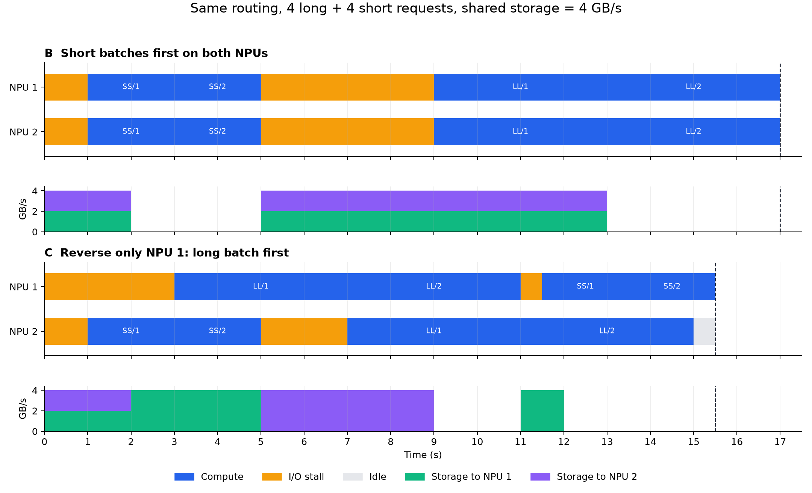

# 共享 KV 三层调度的大白话解读

这篇分析解读同目录下的《共享KV三层协同调度与全局指标分析-20260909》。原文是研究模型与实验设计，公式和表格很密。这一版按原文的八节顺序逐节展开，每一节都能和原文对照着读，原文里的每个机制、每张表、每组数字在这篇里都有对应的白话讲法。写法上有两条自律。第一，比喻只用来搭第一遍理解的桥，每个比喻后面都跟原文的正式名词，避免读完只记得比方忘了本尊。第二，指代一律写全称，说"实例 2 的长批"就一直是实例 2 的长批，不用"它""那边"这类容易指错的词。

## 一、研究的问题（对应原文第 1 节）

先交代系统设定。大模型收到一条请求，要先做 prefill。用户输入的一段话，模型把它从头到尾过一遍网络，算出一堆中间结果，这堆中间结果就是 KV 数据。KV 数据齐了，模型才能吐出第一个字。用户从发出请求到看见第一个字的等待时间叫 TTFT。KV 数据算一遍很费时间，算完就能反复用，所以工程上把它存进所有推理机器都能访问的共享存储。哪台机器接到请求，不重新算，直接从共享存储读。这个设定省了计算，代价是多了一条会被抢的通道。本篇的算例里这条通道只有 4 GB/s。

打个比方贯穿全文。请求是订单，推理机器是连锁餐厅的各家分店，分店里的 GPU（原文叫 NPU，本文跟着叫）是灶台，KV 数据是中央仓库预处理好的半成品食材，共享存储的带宽就是仓库到各分店那条共用的运货通道。TTFT 是从接单到第一道菜上桌的时间，SLO 是跟客人承诺的上菜时限。

三层在系统里的位置如下图。第一层在实例上方做派发，第二层在每台实例内部做排序组批，第三层管着实例与存储之间的那条共用通道。

```text
                   +------------------------------+
                   | 第一层  请求调度器           |
                   | 派发 / 全局队列 / 改派       |
                   +--------------+---------------+
                                  |
                   +--------------+------------+
                   v                           v
       +------------------------+ +------------------------+
       | 实例 1 (单 NPU)        | | 实例 2 (单 NPU)        |
       | 第二层  引擎内调度     | | 第二层  引擎内调度     |
       | 排序 / 组批 / 何时开工 | | 排序 / 组批 / 何时开工 |
       +-----------+------------+ +------------+-----------+
                   | 各活动批发起读取 KV       |
                   v                           v
       ==================================================================
           第三层 存储服务管辖的共享读取通道 (算例设定总带宽 4 GB/s)
       ==================================================================
                   |                           |
                   v                           v
                   +------------------------------+
                   |         共享 KV 存储         |
                   +------------------------------+
```

原文第 1 节的核心命题用原话的意思讲，一个实例决定下一批执行哪些请求，同时就决定了它将在什么时候占用多少共享存储带宽，其他实例的读取完成时间随之改变，整个集群的计算节奏跟着变。请求的服务时间随全局执行过程变化。先给每个请求算出一个固定的存储时间，再让每个实例各自优化自己的队列，这种做法漏掉的恰好是这个研究问题最要紧的因果。

原文把这个因果画成一条链，翻译过来是六步。请求分到哪个实例。实例决定何时开始、先做谁、哪些请求并成一批。各批逐层发起读取，一起挤共享存储和链路。存储分配服务，各批在不同时刻凑齐当前层数据。各实例开始计算，计算的同时发起下一层读取。新的读取竞争、计算空档、请求完成，接着轮到下一轮调度。

```text
 (1) 请求分到哪个实例 ------------------------- [第一层 路由与改派]
       |
       v
 (2) 何时开工 / 先做谁 / 和谁并批 --------------- [第二层 引擎内调度]
       |
       v
 (3) 各批逐层发起读取, 一起挤共享通道
       |
       v
 (4) 存储分配带宽, 各批在不同时刻凑齐当前层 ------ [第三层 存储服务]
       |
       v
 (5) 各实例开始计算, 同时发起下一层读取
       |
       v
 (6) 新的读取竞争 / 计算空档 / 请求完成
       |
       +-----------------------------------> 回到 (1), 进入下一轮调度
```

三层可以分开实现，但必须用同一个全局目标来评价。原文给了两个直觉反例。让每个实例各自追求最快完成自己手头的请求，不保证全集群平均 TTFT 最小。让所有实例都尽快开工，也不保证全局的计算等待最少。

## 二、原文圈定的研究边界（对应原文 1.1 节）

原文在展开之前先划了六条边界，每条都影响后面结论的适用范围。

第一条，只管 prefill。这里的"请求完成"指完成 prefill 并产出第一个 token，末端采样之类的固定开销可以并入最后一层计算。所以文中说的吞吐是 prefill 请求吞吐。要声称完整生成过程的吞吐提升，得另行验证后续生成阶段的瓶颈。

第二条，排队时不碰数据。等待队列里只有请求和登记信息，不读这个请求的 KV。实例正式准入一个执行批之后才开始加载第一层。计算第 $\ell$ 层时，最多提前加载第 $\ell+1$ 层。原文特意警告，不能把"准入"做成后台预取的别名，再让任意多的批次排在后面等计算。

第三条，一台实例同一时刻只有一个活动批。其余请求排队。批内请求做完本轮 prefill 之前不被迁走。所有被比较的策略使用相同的批大小、相同的 token 预算、相同的执行缓冲上限。这些是可行性约束，原文没有展开成显存生命周期优化。若要扩展成多活动批，必须明确允许的并发数和计算切换规则，并且所有对照一起开放。

第四条，全局可见不等于成本相同。全局 KV 可见只表示所有实例都取得到数据。共享存储内部分片、出口、路径可以不同，实际读取成本可能不同。基础实验先用一条共享带宽瓶颈把全局竞争隔离出来，再引入分片和路径差异。基础模型也不做请求间读取去重、不做缓存写回策略、不做取数还是重算的选择。把这些能力固定住，才能判断调度本身的贡献。

第五条，机制有文献出处。按层等待本层 KV、触发下一层异步加载，对应 Mooncake 的 Layer-wise Prefill（原文引了 Mooncake 论文 5.2 节）。但"排队时不预取"和单活动批这两条限制是本研究自己加的建模边界，不能当作对 Mooncake 实际行为的断言。

第六条，单位约定。时间用秒，数据量用十进制 GB，带宽用 GB/s。

## 三、五把尺子和一本设备时间账（对应原文第 2 节）

原文第 2 节在讲任何策略之前先把指标定死。这一节内容最多，分五块讲。

### 3.1 从既有论文借什么、不借什么

原文对齐了三篇论文的口径。DistServe 给出的是"给定 TTFT、TPOT 约束和满足率目标时，最大化每张 GPU 承载的请求率"，本文保留"满足时延目标时的容量"这个定义，但只施加 TTFT 约束。Sarathi-Serve 把容量定义为满足时延目标的最大持续请求负载，本文借它来区分"持续容量"和"一次有限请求集合的吞吐"，这两件事在 3.3 节会变成两个不同的指标。FastServe 同时关注平均与尾部响应时延，本文借它支持均值和尾部并报，但它的响应时延是完整请求的时延，不能直接当成 TTFT 用。还有一个用词陷阱，Sarathi-Serve 用无争用执行时间的倍数构造时延目标，但那个倍数针对的是生成过程的 token 间隔。本文"每个请求参考 TTFT 的倍数"是为本研究适配的自定义，归一化 TTFT 也有独立公式，都不能与其他论文的同名概念混用。

### 3.2 一个请求的等待由两段组成

请求 $i$ 的 TTFT 记作 $T_i = F_i - a_i$，其中 $a_i$ 是到达时刻，$F_i$ 是首 token 完成时刻。原文把它拆成两段，$T_i = (u_i - a_i) + (F_i - u_i)$，$u_i$ 是进入活动执行批的时刻。

```text
 a_i                     u_i                       F_i
  |                        |                         |
  |<-------- 排队 -------->|<-------- 执行 --------->|
     全局队列+实例队列+组批     启动读取+逐层计算
                                 +没被计算盖住的 I/O 等待
  |                        |                         |
  |<------------------ T_i = TTFT ------------------>|
```

前一段是排队，包括全局队列、实例队列和组批等待。后一段是执行，包括启动读取、逐层计算、没被计算盖住的 I/O 等待。这个拆分带出两条纪律。改派不重置 $a_i$，订单排了半小时再换桌，计时不清零。组批不重置 SLO，并批不会让时限重新起算。

再定义参考时间 $T_i^0$。这个请求独占一台同类实例和完整的基准存储带宽，按与其他请求相同的层间流水规则执行时的单请求 TTFT。所有被比较的策略用同一组参考值，系统再拥塞也不能把分母调大。原文特意提醒，这个参考值未必是数学上的最优下界。如果组批能显著提升计算效率，请求可能比单独跑还快，此时 $T_i/T_i^0 < 1$ 是合理的。研究里要是必须用"理论最优 TTFT"这个说法，就得在统一动作空间里求这个请求的合法最快完成时间，或者改名叫"相对下界比值"。第 7 节的算例用线性批计算模型，组批不省时间，参考值恰好同时也是理想最短时间。

### 3.3 五个指标各自回答什么问题

| 指标 | 白话含义 |
|---|---|
| 有限工作集吞吐 $X_{finite}=n/M$ | 固定同一批请求，全部做完要多久（$M$ 为最后完成时刻），做得越快吞吐越高 |
| 持续服务容量 $\lambda^*(\eta)$ | 承诺至少 $\eta$ 比例的请求按时完成的前提下，系统最多能持续接多大的到达率 |
| SLO 满足率 $A$ | 同样的输入负载下，多少比例的请求按时完成 |
| 平均 TTFT $\bar T$ | 每个请求权重相同，平均等多久 |
| 平均归一化 TTFT $\bar R$ | 每个请求相对自己的参考速度，平均慢了几倍 |

前两个指标的区别值得多说一句。有限工作集像包场，进来固定一批活，干完收工。持续容量像流水线常开，请求不断来，看系统能稳定扛住多大的量。原文要求两个都报告，因为"最小化 $M$"和"最小化完成时间之和"（对应平均完成时间）是两回事。长短请求的比例必须固定，否则 requests/s 的变化可能只是活变了，不是系统变强了，输入 token 数每秒可以作为辅助的工作量指标。

SLO 的阈值有两种设法。固定阈值 $s_i = s$，所有请求同一个时限。相对阈值 $s_i = \alpha T_i^0$，按各自体型放宽，比如参考时间 3 倍。原文要求两种都做实验，因为固定时限和按长度放宽时限可能改变策略排名。绝对截止时刻按 $d_i = a_i + s_i$ 计算。

还有一个容易混的量。实际统计窗口内按时完成的请求数除以到达总数，原文记作 $G$，这是实现层面的成功吞吐。$\lambda^*(\eta)$ 是给定满足率下系统理论上的最大可承载负载。两个是不同的量，表头必须写清。被拒绝或超时的请求计入分母、算作失败，不许靠删掉困难请求来美化满足率。

归一化 TTFT 有个性质容易被忽略。它按每个请求 $1/T_i^0$ 加权实际时延，短请求的委屈在里头占更大分量，所以 $\bar R$ 不等于 $\bar T$ 除以参考时间的平均。原文要求均值之外报告 TTFT 和归一化 TTFT 的 P50、P95、P99，以及长短请求各自的分组结果，防止均值掩盖饥饿。

### 3.4 NPU 的时间账本

统一观测窗口内，每个 NPU 的时间切成互斥的四块。Compute，正在进行有效 prefill 计算。I/O stall，已有活动批需要计算，但依赖的读取没完成，又没有别的可算。Idle，没有活动批，包括没请求、等准入、等组批。Other，调度和通信控制等杂项开销。四块加起来恒等于 1。多 NPU 实例按设备时间加权。

```text
 一个 NPU 在观测窗口内的时间账, 互斥四块, 加起来恒等于 1

 |<------- Compute ------->|<----- I/O stall ----->|<---- Idle ---->|<- Other ->|
        有效 prefill 计算          有活动批要算, 但数据      没有活动批      调度与通信
                                  没到, 又没有别的可算     (没请求/等准入/  等杂项
                                                           等组批)
```

三条纪律跟在这本账后面。第一，$U$ 是时间占比，代替不了硬件的算力利用率。batch 增大可能缩短总计算时间、提高吞吐，即便设备忙碌占比下降了也未必是退化。第二，STALL 要连绝对 NPU·s 数和占比一起报告。第三，警惕等待搬家。策略把等待从"活动批等 I/O"搬进"队列等准入"，STALL 会变好看，却可能没有任何请求更早完成。还有一条定义细节，单个请求在等 I/O 时，如果 NPU 正在计算其他请求，这段等待是该请求的等待，不能计成设备的 STALL。

### 3.5 目标怎么选

原文建议三条独立的评价线，每条只设一个主目标。容量线，主目标是最小的 $M$ 或最大的稳定容量，配套观察 Compute、STALL、Idle 和存储利用率。SLO 线，固定负载和阈值时最大化满足率，配套看失败请求和各长度组的满足率。时延线，分别最小化平均 TTFT 和平均归一化 TTFT，配套看尾部。NPU 利用率的定位是解释性能为什么变化，原文明确反对把它与 TTFT、SLO 按任意权重加成一个总分。一个方案值不值得采用，要讲清它在各目标之间的取舍。

## 四、把三层连起来的全局模型（对应原文第 3 节）

### 4.1 批、层和带宽

一个活动批第 $\ell$ 层要读的数据量，等于批内各请求该层读量 $v_{i\ell}$ 之和。本层计算耗时记作 $c_{\mathcal B\ell}$，取自真机测量的函数 $g_w$，受 token 数、上下文长度和 batch 形状影响。原文强调不能默认拿批内最长请求、请求数或 token 数之一来完全代替它。

带宽方面，基础模型把存储当成一条总容量 $B(t)$ 的单瓶颈，所有已经合法发起、尚未完成的读取流分这条容量，任一时刻各流速率之和不超过 $B(t)$。多分片、多链路时，对每条资源分别约束，经过这条资源的读取流之和不超过这条资源的容量。第一阶段把资源当流体，带宽可以任意细分。若启动时延或存储 IOPS 成为瓶颈，再增加对应的服务阶段，不能把它们虚构成随意变化的带宽。

### 4.2 层间流水与批内同步

每个批每一层有四个时刻，发起读取 $A$、读取完成 $R$、开始计算 $C$、计算完成 $Z$。规矩有三条。第一，整批同步，批内所有请求的这一层数据全部到齐才启动这一层的计算，所以 $R$ 取批内最大值。第二，上一层算完才开始算下一层。第三，本层计算开始的同时发起下一层读取，$A_{\ell+1} = C_\ell$。把这三条拼起来，一个批的执行时间等于第一层读取时间，加上中间各层"读取时间与上一层计算时间取较大者"，加上最后一层计算时间。中间那个取较大者就是 overlap 的直觉来源。读取要是赶在上层计算结束前完成了，这段时间就被藏住；万一读取拖得更久，超出的部分就成了 stall。

```text
(一格 0.25 秒, LL 批独占通道, 每层读 2 秒算 4 秒)
        0       2       4       6               10   (秒)
        +-------+-------+-------+---------------+
层1     [读取L1][    计算L1    ]
层2             [读取L2]        [    计算L2    ]
        A1      R1=C1   R2      C2=max(R2,Z1)   Z2

第2层读取在第1层计算开始时发起 (A2 = C1), 2 秒就读完,
藏在 4 秒的计算下面, 不拖累批完成时刻 Z2。

反过来, 若第2层读取要 6 秒而第1层计算只有 4 秒:

层1     [    计算L1    ]
层2     [........读取L2........]
                        ^^^^^^^^
藏不住的尾部 = I/O stall
```

原文在这之后给了一个关键警告，读取时间必须由当时的全局带宽分配积分算出来。改派、重排、组批都会改变读取的发起时间和竞争者，动作发生之后不能沿用动作之前的旧读取时间。

批的口径有两种。完整 prefill 批把成员绑定到最后一层，$F_i$ 等于整批最后一层算完的时刻。chunked prefill 的批只绑定一个执行块，请求做完最后一个 chunk 才产生 $F_i$。跨 chunk 的 KV 是留存还是重读，规则必须固定，不能既不留存又假设后续读取免费。还有一条现实差异，真实系统按请求、对象或连接公平分配带宽，与按批聚合分配不一定等价，仿真必须固定第三层的服务粒度。

### 4.3 一次局部动作的全局代价

原文给了判别式 $\Delta J$，把"执行这个动作"和"不执行"两条时间线里所有受影响请求的完成时间分别算出来，逐个求差再取平均。受影响的范围至少覆盖预测窗口内已到达且被波及的请求。两条时间线都要重新计算共享资源竞争，只更新目标实例是无效的。不同目标比不同的量，容量线比预测的最后完成时间，SLO 线比预计按时完成的请求数。在线实现只用已知请求和声明过的统计预测，不偷看未来的请求序列。这种全局评估本身可以当小规模参考策略，实际策略可以用短预测窗口、候选批筛选和存储报价来近似，实验要量化近似造成的损失。

## 五、三层各自的账本（对应原文第 4 节）

原文给三层各列了一张职责表，翻译过来是下面这样。

| 层 | 手里要有什么信息 | 能做什么动作 | 传给下一层什么 |
|---|---|---|---|
| 请求调度器 | 各实例活动批进度、待执行工作量、候选批、共享存储报价及路径差异 | 首次派发、保留全局队列、未执行请求改派 | 请求到达时间、SLO、读取量和计算画像 |
| 推理实例 | 本地队列、截止时间、每层读量和计算时间、其他实例造成的可观测带宽压力 | 排序、组批、定开始时刻与合法 chunk 大小 | 本层剩余读取量、下一层消费时刻、批依赖关系 |
| 存储服务 | 已提交读取、资源容量与服务进展，实例传来的依赖和紧迫性 | 公平共享、加权共享、优先服务、可行范围内承诺速率 | 可观测服务率、预计完成时间、报价有效期与误差范围 |

### 5.1 第一层，均衡的是可执行的活

按请求数平分是必要但弱的基线，因为长短请求、命中 KV 量、剩余计算各不相同，数量均衡不代表算力均衡。更强的基线按预计计算工作量或排空时间分配。存储感知路由还要多看一步，派发之后的读取在时间上怎么分布。两个实例排的等量计算，也可能恰好同时开始大读取，然后一起卡住。所以路由的另一个作用是给各实例配上适合组批、能错开竞争的候选集。

原文还立了一个正确性检验。实例完全同构、所有读取路径完全相同、所有实例处于对称状态时，单独换一个实例标签不会产生任何存储收益。收益必须来自后续的排队、组批、执行时刻或实际路径差异。这个对称场景要做成对照，用来验证实现没有虚构收益。

### 5.2 改派，搬的是登记条目，算的是全局账

请求在开始执行前没读过 KV，此时改派主要转移登记信息，避开了运行态 KV 搬运的成本。触发时机包括实例空闲、等待时间明显失衡、存储状态变化。规矩有四条。一个请求只能有一个所有者。撤销排队与开始执行撞车时，只允许一个动作成功。已经进入活动批的请求不归改派机制管。候选改派要把控制时延、对目标队列的影响、拆散原有 batch 的计算效率损失都算进成本。

原文给了一个反直觉的提醒。空闲实例接手请求后会立刻发起大块读取，可能把其他实例本来能藏在计算后面的下一层读取挤到明面上来。所以"被改派的请求变快了"不足以证明改派有益，要按 4.3 节的全局目标算总账，还要设收益门槛、冷却期和最大改派次数。文献坐标上，Llumnix 研究过跨实例运行时重调度和请求状态的整机迁移，本文的改派范围更窄，专门检验在没有 KV 搬迁成本时，纠正早期派发错误还剩多少价值。原文还要求配两个强对照。一个是空闲实例从别的队列偷请求的 work stealing。另一个是干脆不做预先派发，实例准备执行时才从全局队列领请求的晚绑定。如果晚绑定已经消除大部分早期分配错误，复杂改派机制的额外价值可能很小。

### 5.3 第二层，决定进入竞争的形状

实例内排序除了改变谁先谁后，还改变下一次读取的大小与时机。组批进一步改变本层计算持续多久，以及下一层读取必须在多长时间内完成。所以第二层的决策单位至少是"候选批加计划开始时刻"，对每个候选批预测本层启动读取、后续层能被藏住的读取、批内同步等待，以及对其他活动批的影响。延迟准入是个两难。推迟新批准入能帮进行中的批保持计算连续，代价是直接加重本队列请求的 TTFT，两笔账都要算。策略不以减少活动读取数为目标，更不许靠长期不给请求准入来制造好看的低 STALL。

### 5.4 第三层，看计算什么时候要数据

原文给了一条已发起读取定义了需求速率。这条读取还剩 $r_f$ 的数据，希望在 $\tau_f$ 之前就绪，它至少需要 $q_f = r_f/(\tau_f - t)$ 的速率。$\tau_f$ 可以取这个批当前层预计算完的时刻。如果所有已发起读取的速率需求在每条路径上都能满足，这批读取就能及时就绪，对应的层间等待就不会发生。$\sum q_f > B$ 是一个警报，说明这组速率目标此刻维持不住，但仅凭这一时刻的比值，不能断定未来的整个调度必然不可行。更强的可行性检查看时间窗内必须完成的总数据与可提供的服务量，并考虑读取的释放时间、路径和批依赖。

三条补充规则。还没发起的下一层读取不能提前占用真实服务。第一层读取前面没有计算帮它掩护，不能给它编一个"零时限"去套上面的除法，要结合请求截止时间或"启动一个新计算批的价值"来安排。带宽不够时还缺一项决策，放弃保护谁。可以保住最多 NPU 计算时间、保住最多按时请求、或降低平均完成时间，这些规则选中的保护对象未必相同，值得分别研究。

批内同步还改变分配的价值。给已经读齐的成员追加带宽没有收益。卡住全批的最后一段读取拿到带宽，可能马上放出一个 NPU。一个批还缺好几份数据时，这几份数据要当成有共同完成条件的一组需求。单纯的短读取优先或最早截止时间优先，都不保证全局最优。

### 5.5 一套能直接落地的决策流程

原文 4.5 节给了一个参考控制器，每逢请求到达、批完成、读取完成或报价更新就运行一遍，分五步。

1. 搭候选。从先来先服务、短服务优先、剩余预算优先三种排序各取有限个请求，拼成合法的单请求批、同类批和混合批。路由候选取几个低负载实例。只有还没开始执行的请求能进改派候选。
2. 试开始方式。每个候选分别尝试立刻开始，以及等下一个已知事件（某次计算或读取完成）之后再开始。等待期间维持现有活动批，不偷读候选批的 KV。
3. 试存储分配。第三层对每个候选尝试公平分配、按消费时限的需求分配、按截止时间优先三种方式。需求分配可行时，先保住各下一层所需的速率，余量给合法的新启动读取。不可行时，枚举少量"保护哪些批"的集合，剩余服务按固定公平规则兜底。第一层读取不伪造零时限需求。
4. 统一推演。用同一份可观测的容量预测，把所有活动批和受影响队列推进到共同的预测终点。容量线比预测的最后完成时间，SLO 线比预计按时完成数，时延线比完成时间之和或归一化之和。预测窗口外的剩余工作用统一的尾部估计，不许直接装作不存在。
5. 执行当前动作。只有眼下这一步真做，未来动作只是预测，新事件一来全部重算。平局按原到达顺序处理，改派另过收益门槛。

```text
 触发事件 (请求到达 / 批完成 / 读取完成 / 报价更新)
     |
     v
 (1) 搭候选 -> 三种排序各取有限个, 拼单请求批/同类批/混合批
     |
     v
 (2) 试开始方式 -> 立刻开始, 或等下一个已知事件再开始
     |
     v
 (3) 试存储分配 -> 公平 / 按消费时限需求 / 按截止时间
     |
     v
 (4) 所有候选推演到同一预测终点, 按评价线打分
     |
     v
 (5) 只执行当前动作, 新事件一来全部重算
```

原文给自己的定位很老实，这是一个有限候选、滚动重算的参考控制器，不保证求得连续动作空间的全局最优。候选数、预测窗口、状态更新成本、公平兜底规则都要记录在案。后续如果简单的局部规则能接近它，就优先保留简单实现。

## 六、过载、SLO、开环与闭环（对应原文第 5 节）

### 6.1 五种情形各做什么、不许顺便承诺什么

原文把负载状态和优化目标拆开判断，列了五种情形。

| 当前情形 | 合理动作 | 不能顺便承诺的结果 |
|---|---|---|
| 已发起读取都能在时限前就绪 | 保证及时就绪，有余量时继续服务合法待传数据 | 链路必须达到 100% 利用率 |
| 部分层间需求无法同时满足 | 选择保护对象、分配带宽、必要时限制新批开始 | 按请求均分或越紧急越优先必然减少总 STALL |
| 所有请求的 SLO 都有余量 | 去追容量或平均时延目标，同时保住 SLO | SLO 不构成约束后就没有调度价值 |
| 只能救回一部分请求 | 主目标是满足率时，选联合可行的一组请求 | 每个单独可救就能同时都救，只按最早截止时间排就行 |
| 当前这批请求已无人能救 | 避免无效抢救，按既定次目标和公平规则服务 | 后续到达的请求也没有可满足的 SLO |

### 6.2 存储要手不闲着，但只服务合法读取

原文的原则叫工作保守。只要有可服务的读取，就不故意浪费可用容量，这里的可用容量要同时满足路径约束和接收方约束。没有已准入的合法读取时，带宽闲置是合理的。禁止为了填满链路去预取还在排队的请求。策略主动推迟新批准入也会暂时减少读取供给，这种做法必须靠端到端收益来解释。

SLO 决策和带宽是否过载是两件独立的事，不存在固定的先后开关。存储不拥塞，计算排队照样可能让 SLO 只能部分满足。存储过载，时限宽松也可能全部按时完成。

### 6.3 开环里利用率为什么不动

开环指请求按外部节奏到达，与系统快慢无关。在稳定、不拒绝、不丢弃的长期运行中，如果每个请求需要的有效计算秒数固定，工作守恒给出 $U = \lambda\,\mathbb E[K_i]/W$，来的工作量除以设备数。排序改变谁等得久，不改变长期的计算工作总量。原文列了这条结论的适用前提，缺一不可。有限工作集、系统不稳定、拒绝策略变化、batch 改变计算效率，这些情况下都不能直接套用。第 7 节算例是有限工作集，利用率的分母随最后完成时间变化，就属于不能套的情形。

```text
 开环: 请求源 ==固定到达率 λ==> 系统 ==> 完成
       (到达节奏与系统快慢无关, 排队只改变谁等得久)
```

### 6.4 闭环里利用率为什么可能升

闭环指固定 $N_c$ 个客户端，上一轮做完才发下一轮。系统越快，客户端发得越勤，稳态请求率 $X = N_c/(\bar T_{\mathrm{cycle}} + Z)$，$Z$ 是思考时间。只求首 token 的 prefill 基准里，一轮耗时就是平均 TTFT。客户端若等完整回答，必须用完整响应时间，不能用 TTFT 顶替。降低周期时间可以抬高到达率和 NPU 利用率，直到撞上别的瓶颈。但闭环有个检测盲区，系统变慢时客户端自动降速，拥塞被掩盖了，所以闭环实验要和相同请求类型分布的开环实验分开报告。

```text
 闭环: 固定 N_c 个客户端, 上一轮完成后才发下一轮
       客户端 ==思考 Z==> 系统 ==> 响应 ==> 客户端收到, 再发下一轮
       (系统变慢, 客户端自动放慢, 拥塞被掩盖)
```

## 七、组 batch 的四笔账（对应原文第 6 节）

### 7.1 四笔要分开记的账

| 影响 | 记在哪 | 取舍 |
|---|---|---|
| 等待组批 | 排队时间那一段 | 拿到计算效率之前，先付出等待成本 |
| 计算效率 | 批计算时间函数 | 批大可能降低每请求计算秒数，形状不合时几乎不省 |
| 本层读取与计算同步 | 整批数据齐了才算 | 短请求可能被大读取或长计算绑住 |
| 全局读取节奏 | 批的读量与发起时刻 | 大批可能造成突发竞争，也可能用更长计算窗口藏住下一层读取 |

批的读取时间有一个容易想当然的地方。它既不天然等于各请求读取时间之和，也不天然等于最长单请求的独占读取时间，由并行度、实际带宽分配、数据积分和同步边界共同决定。一个读多算少的请求和一个读少算多的请求合批，可能互补，长计算窗口把 I/O 藏住；也可能互害，算多的干等读多的启动数据。混合组批和同类组批都要比，不能只按长短分类下结论。

### 7.2 完整批与 chunk 批

完整 prefill 批把成员绑定到最后一层。chunk 批做完一个执行块就散伙重组，能减少长请求对短请求的连续阻塞，代价是调度更频繁、可能损失计算效率、改变 KV 的读取次数。Sarathi-Serve 用 chunk 大小控制每次执行的时延并讨论了分块开销，支持批粒度按成本权衡这个研究方向。但原文提醒一个用词，论文里的 stall-free 指正在生成的请求不被新 prefill 暂停，不能拿这个词证明本文的存储 I/O 等待被消除了。执行顺序上，第一轮仿真先固定完整 prefill 批，比较单请求、同类组批、混合组批、全局预测组批，确认全局竞争机制之后，再把 chunk 当独立能力加入实验，避免同时改变读取生命周期和调度策略两个变量。

## 八、八个请求的完整账本（对应原文第 7 节）

原文第 7 节的算例是全文最要紧的部分，值得单独展开。

### 8.1 设定

八个请求在零时刻同时到达，四个长请求、四个短请求，平均分给两个实例。实例 1 分到长请求 L1、L2 和短请求 S1、S2，实例 2 分到长请求 L3、L4 和短请求 S3、S4。两个实例各是一块单 NPU，共享一条 4 GB/s 通道。模型只有两层，每个请求读两次、算两次。长请求每层读 4 GB、算 2 秒，独占系统的参考时间是 5 秒。短请求每层读 1 GB、算 1 秒，参考时间 2.25 秒。一个批最多装 2 个请求。算例还故意让组批不省时间，批的计算时间等于成员各自计算时间直接相加。这么设定是为了把组批的同步代价单独剥出来看，原文特意声明不能据此推断真实引擎应该永远一个请求一个批。每个请求的时限设为自己参考时间的 3 倍，长请求 15 秒，短请求 6.75 秒。总读取量固定 40 GB，总有效计算固定 24 NPU·s。

五个计划的具体差别在下表。

| 计划 | 实例 1 的执行顺序 | 实例 2 的执行顺序 | 存储分配 |
|---|---|---|---|
| A 混合组批 | (L1,S1) 然后 (L2,S2) | (L3,S3) 然后 (L4,S4) | 活动批之间平分 |
| B 同类短批优先 | (S1,S2) 然后 (L1,L2) | (S3,S4) 然后 (L3,L4) | 活动批之间平分 |
| C 两实例错开长短 | (L1,L2) 然后 (S1,S2) | (S3,S4) 然后 (L3,L4) | 活动批之间平分 |
| D 只改存储层 | 同 B | 同 B | 带宽优先给每层读量小的批 |
| E 单请求短优先 | S1、S2、L1、L2 逐个做 | S3、S4、L3、L4 逐个做 | 活动批之间平分 |

### 8.2 全局总账

| 全局指标 | A | B | C | D | E |
|---|---|---|---|---|---|
| 全部完成时间（秒） | 17 | 17 | 15.5 | 18.5 | 17 |
| 有限工作集吞吐（requests/s） | 0.471 | 0.471 | 0.516 | 0.432 | 0.471 |
| 平均 TTFT（秒） | 12.750 | 11.000 | 11.625 | 10.750 | 8.875 |
| 平均归一化 TTFT | 4.108 | 2.811 | 3.578 | 2.761 | 2.233 |
| SLO 满足率 | 25% | 50% | 75% | 75% | 75% |
| 有效计算（NPU·s） | 24 | 24 | 24 | 24 | 24 |
| I/O STALL（NPU·s） | 10 | 10 | 6.5 | 9 | 10 |
| Idle（NPU·s） | 0 | 0 | 0.5 | 4 | 0 |
| 有效计算占比 | 70.59% | 70.59% | 77.42% | 64.86% | 70.59% |

各请求的完成时刻也摘出来，因为后面所有对比都从这里取数。

| 请求 | SLO 截止 | A | B | C | D | E |
|---|---|---|---|---|---|---|
| L1（实例 1） | 15 | 8.5 | 17 | 11 | 14.5 | 11 |
| L2（实例 1） | 15 | 17 | 17 | 11 | 14.5 | 17 |
| L3（实例 2） | 15 | 8.5 | 17 | 15 | 18.5 | 11 |
| L4（实例 2） | 15 | 17 | 17 | 15 | 18.5 | 17 |
| S1（实例 1） | 6.75 | 8.5 | 5 | 15.5 | 4.5 | 2.5 |
| S2（实例 1） | 6.75 | 17 | 5 | 15.5 | 4.5 | 5 |
| S3（实例 2） | 6.75 | 8.5 | 5 | 5 | 5.5 | 2.5 |
| S4（实例 2） | 6.75 | 17 | 5 | 5 | 5.5 | 5 |

### 8.3 教训一，全局联动（B 对 C）

计划 B 和计划 C 里，两个实例分到的请求一模一样，实例 2 的动作一模一样，唯一区别是实例 1 把长请求提到前面。结果实例 2 的长请求 L3、L4 从 17 秒提前到 15 秒完成。原因在实例 1 身上。计划 B 里两个实例同时读各自长批的第一层，各要读 8 GB，一条通道两人挤，各分 2 GB/s，各花 4 秒。计划 C 里实例 2 的短请求先做完，等实例 2 的长批开始读第一层时，实例 1 的短请求还没开始读，通道上只有实例 2 一个客户，独占 4 GB/s，2 秒读完。实例 1 让出了通道的使用时机，实例 2 白捡 2 秒。反过来，实例 1 的短请求 S1、S2 为这次调序付出了代价，从 5 秒拖到 15.5 秒，远超 6.75 秒的时限。全局指标全面变化，SLO 满足率从 50% 涨到 75%，全部完成时间从 17 秒缩到 15.5 秒，平均 TTFT 从 11 秒涨到 11.625 秒，变好和变坏落在不同的请求身上。

```text
 计划 B (第 5-9 秒), 两个长批同时读第一层, 通道平分
   实例1 的 LL 批 |########|    2 GB/s, 8 GB 要读 4 秒
   实例2 的 LL 批 |########|    2 GB/s, 8 GB 要读 4 秒

 计划 C (第 5-7 秒), 通道上只剩实例2 的长批, 独占全宽
   实例2 的 LL 批 |################|    4 GB/s, 8 GB 只读 2 秒
```

下图的完整时间线把这次争抢逐秒铺开。



上图是计划 B 和计划 C 的完整时间线，橙色代表灶台等数据，蓝色代表有效计算，灰色代表没任务。两个计划的总计算量都是 24 NPU·s，总读取量都是 40 GB，差别的全部来源是时间分布。

计划 C 还有一个容易被忽略的细节。第 9 到 11 秒，通道空了整整 2 秒，谁都没在读。因为两个实例都在算各自长批的第二层，下一批的请求按规矩不许提前预取。这种空闲是规则允许的合法状态。它提醒我们，把带宽利用率做到 100% 在某些规则下根本做不到，不能拿它当考核标准。

### 8.4 教训二，只动存储一层也够改写全局（B 对 D）

计划 D 既不改路由也不改执行顺序，只换了带宽分配规则，带宽优先给当前每层读量小的批。结果短请求几乎不受影响，S1、S2 在 4.5 秒完成，S3、S4 在 5.5 秒完成。长请求一个提前一个更晚，L1、L2 在 14.5 秒完成，L3、L4 推到 18.5 秒。SLO 满足率从 50% 涨到 75%，平均 TTFT 从 11 秒降到 10.75 秒，但全部完成时间从 17 秒推到 18.5 秒。

这一组同时示范了一个指标陷阱。D 的 STALL 从 10 NPU·s 降到 9 NPU·s，听着是进步，但设备彻底没活干的时间从 0 涨到 4 NPU·s，有效计算占比从 70.59% 掉到 64.86%。带宽重分配让短请求先吃通道，长请求的读取被拉长、被切碎，全局完成节奏反而拖沓了。这类分配改变的其实是等待的去处，一部分等待落到了设备没活干的 Idle 上，一部分落到了被推迟的请求身上。所以原文要求 STALL 连同绝对秒数、完成时间、SLO 满足率一起报告，单看 STALL 给策略排名会选错。

### 8.5 教训三，组批有隐藏账单（A 对 E）

计划 A 把一个长请求和一个短请求绑成一个批。批的铁律是整批所有请求的这一层数据全部到齐才能开始算。于是一批里的短请求每层都要陪着同批的长请求等 4 GB 数据到位。看短请求 S1 的遭遇。计划 E 里 S1 单独做、第一个做，2.5 秒完成。计划 A 里 S1 被绑进第一批，8.5 秒才完成，超了 6.75 秒的时限。计划 E 的平均 TTFT 是五个计划里最低的 8.875 秒，平均归一化 TTFT 也最低。

组批在真实系统里能提高计算效率，一次算两个请求比分开算两次省时间。算例把这个好处关成零，组批就只剩同步等待的坏处。原文对这个结果的态度很克制，写明真实 batch 若有足够的计算收益，A 对 E 的结论方向可能反转，反转发生在大约多大的计算收益处，正是实验要测的东西。

### 8.6 这份账本证明不了什么

原文对算例的边界交代得很老实。C 的 15.5 秒不能称为全局最优，五个计划只是可行解的样本，不是穷举。E 的 8.875 秒平均 TTFT 同样不能称为最小值。八个请求同时到达、模型只有两层、参数确定无波动，这些限制决定算例的用途是验证因果和核对公式，不能推广为在线策略普遍有效的证据。还有一处结构性盲区，五个计划里每一批的第二层数据读取都被第一层计算完全盖住了，表中全部 STALL 都来自新批启动时的第一层读取，层与层之间的带宽竞争在这个算例里没有上场。原文点名后续要加每层读量更大、计算更短的组合，专门检验下一层数据来不及到位的情形。

## 九、实验该怎么设计（对应原文第 8 节）

原文第 8 节是实验总纲，分五块。

### 9.1 要回答的八个问题

| 问题 | 怎么控制变量 | 有价值的结果 | 能否定什么 |
|---|---|---|---|
| 全局信息值多少钱 | 共享带宽、实例数、读算比，相同动作空间下比局部与全局预测 | 全局策略收益出现和消失的边界，局部选择损害他实例的比例 | 强局部策略几乎一样好，就不必上复杂全局控制 |
| 最值得改哪一层 | 路由、引擎、存储三层分别开关 | 单层收益、层间互补或重复、额外控制成本 | 存储层已吸收收益时，上层复杂策略不值得实现 |
| 同类组批还是混合组批 | 批计算加速、读算相关性、到达稀疏度 | 计算加速何时抵消同步等待，最佳批形状如何随带宽变 | 固定短优先或混合必互补这类结论 |
| 是否限制活动实例数 | 带宽、读取启动成本、SLO 紧度、准入并发 | 并发何时提容量、何时只添 STALL，有无中间最优点 | 始终充分并发最优，就可删掉复杂准入控制 |
| SLO 优化与平均时延差多大 | 固定与倍数 SLO、紧度、长短比例 | 满足率与两种均值的取舍曲线，谁受益谁受损 | 用平均 TTFT 代替 SLO 结果的做法 |
| 改派还有没有独立价值 | 初始路由误差、控制时延、状态更新周期 | 相对 work stealing 和晚绑定的净收益及失败条件 | 晚绑定已足够，改派就该简化 |
| 观测多精确才值得用 | 报价延迟、噪声、负载变化速度 | 误差多大时不如简单基线，有无同步振荡 | 理想真值收益能直接落地的假设 |
| 开环结果能否解释闭环 | 固定到达率与固定客户端数分别测 | 收益归因于等待缩短、计算效率还是反馈到达率 | 把闭环吞吐增长说成物理带宽变大的解释 |

原文还专门写了一句，研究结论应包含什么时候不值得做。如果晚绑定加简单带宽公平就能接近全局参考策略，这同样是明确的实现方向。

### 9.2 对照策略要有明确语义

原文列了十三种可独立实现的基础对照，不把它们包装成任何真实系统的复现。路由五个。均匀派发，轮询或最少请求数，平局规则固定。计算负载感知，挑剩余计算工作最少的实例。名义服务时间感知，用固定基准带宽加当前队列估计完成时间。存储观测感知，用可观测报价预测派发后的服务，显式重算共享竞争。work stealing 和全局晚绑定，分别当纠正早派发和避免早派发的强对照。引擎五个。先来先服务。前缀长度优先，检验大量可复用 KV 在带宽受限时是否还值得优先。短服务优先，按固定无争用估计排序。截止时间优先和剩余预算优先。全局候选批预测，对少量候选顺序、batch、开始时刻评估全局目标。存储三个。公平服务，在固定服务粒度上等分带宽。按读取大小或截止时间优先，分别检验纯 I/O 信息和请求时限信息。计算依赖感知，用消费时刻、批依赖和选定的全局目标分配。

原文还拆了一个词的歧义。所有 worker 命中相同的全局 KV 时，挑"缓存命中高的实例"无从挑起，因为大家命中率一样。但单个请求命中量的多少仍然影响它的读量和剩余计算。两种"缓存感知"指的不是同一件事，不能混用。

信息边界在这里重申一遍。普通上层策略只读存储报出的观测值和反馈。带宽真值、背景负载的内部队列、假想服务的结果，只供仿真资源模型或明确标注的 Oracle 对照使用。存储执行器自己维护资源状态是实现职责，若要研究它的可部署决策，也必须规定它能拿到哪些真实可采集的状态，不能把仿真里的未来整个交给它。

### 9.3 先比能力，再比信息

固定无预取和一层前瞻，路由、引擎、存储三层各设开关，共八种组合，先做能力消融。某一层关闭代表用固定基础策略，开启代表在同一套候选能力下换感知策略。batch 允许一个还是两个、改派禁止还是允许，这类比较要标注为能力消融。选定能力组合之后，再在信息维度排四个等级，固定带宽估计、历史观测、实时观测、Oracle。普通策略与 Oracle 共享同一份候选动作，差别只在信息。拿着全部未来请求序列的离线搜索单独列，不许混称实时 Oracle。

两条记录纪律。只改一个实例的顺序时，记下其他实例完成时间怎么变。三层组合的收益不等于各层收益相加，用联合收益减去各单层收益的差额，判断层间是互补还是重复。

### 9.4 最小实验矩阵和运行纪律

实验分五步走。第一步，解析与小规模验证。复现第 7 节全部时间线，查字节守恒、设备时间守恒、计算依赖、无排队预取、唯一所有者。对缩小后的状态和明确的离散动作空间做穷举，得到该空间的最优值，连续带宽分配没求解就只能叫离散参考值。第二步，稳态边界。固定请求分布，扫共享带宽和到达率，看两个平均负载比，读量比 $\rho_{io}$ 等于每秒到达的期望读量除以通道容量，算量比 $\rho_{compute}$ 等于每秒到达的期望计算量除以设备数，还要看逐层需求峰值。均值小于 1 只是最基本的稳定条件，不保证没有突发等待，也不保证满足 SLO。组批改变计算量时按实际批执行归因。第三步，批与顺序。用互相独立的读量、计算量分布，造出正相关、负相关、无相关三种场景，扫批计算加速和批预算，找同类批、混合批、单请求的胜负分界。第四步，动态与信息误差。引入分段常数带宽变化、突发到达、报价滞后、改派开销，观察控制振荡和对其他实例的损害，再扩到多分片和不同路径。第五步，闭环与 SLO 敏感性。固定客户端数扫思考时间，同时扫固定 SLO 和倍数 SLO，给出容量、满足率、平均 TTFT、归一化 TTFT 的取舍曲线。

运行纪律有五条。同一场景共享请求序列和随机种子。先小种子冒烟，确认实验里存在 SLO 全满足、部分满足、几乎不满足三个区域，再跑多种子全量，缺了任何一个区域就说明负载没调好。调参只用训练场景或种子，结论用独立场景或种子验证，报告配对差值和不确定性。长期实验选定一批到达请求后停止计入新请求、把这批排空，避免只统计到先完成的短请求这种幸存者偏差。吞吐和设备占比另按统一稳态时间窗统计，记录窗口前后的积压。过载实验排不空时，明确超时和截断的请求数，不许拿幸存完成请求的均值冒充全部请求的均值。

### 9.5 每组结论要交什么证据

| 结论类型 | 必须配套的证据 |
|---|---|
| 容量提高 | 相同请求分布下的稳定容量曲线、队列随时间变化、Compute/STALL/Idle 分解 |
| SLO 改善 | 满足率随 SLO 紧度变化的曲线、长短请求分组、失败或拒绝计数 |
| 平均时延改善 | TTFT 与归一化 TTFT 的分布、长短分组、尾部变化 |
| 全局协同有效 | 本地动作对他实例影响的分布、三层消融、公平服务对依赖感知服务的对照 |
| 组批有效 | 实测或校准的批计算加速表、组批等待、读取同步等待、吞吐变化 |
| 策略可以落地 | 相对强简单基线的净收益、决策耗时、对观测误差和更新频率的容忍边界 |

原文收尾的原话意思是，单看带宽更大所以更快，或短请求先执行所以短请求更快，都够不上三层协同调度的研究结论。

## 十、我的评价

这份文档最大的本事，是把一个容易被讲得玄乎的主张落成了十钟能对完的手算账本。三层调度要作为全局系统来评价，这种话谁都会说，原文的做法是构造计划 B 和计划 C 这对最小对照，只动一个实例的顺序，让读者亲眼看到另一个实例的完成时间移动了 2 秒。因果链干净到没有辩解余地，这是全文最有价值的一块。

第二处好处是对指标的警惕全部带数字。讲 STALL 会骗人，就摆出计划 D 的 STALL 降了 1 秒而利用率跌了近 6 个百分点。讲平均 TTFT 和 SLO 满足率会打架，就摆出计划 B 和计划 C 排名互换。每一条指标有坑的判断都有算例里的具体行扛着。

第三处是实验设计那一半的分量。先比能力再比信息的消融顺序、十三种对照各自写明决策语义、每组结论绑定必须交付的证据、结论里要包括什么时候不值得做，这套规矩把文档从机制说明提升成了可以直接照着执行的实验协议。研究设计文档里把放弃条件写得和收益条件一样清楚的并不多见。

局限也是原文自己承认的那些。算例两层、八请求、零噪声、同时到达，只能验证因果，撑不起对在线策略有效性的判断。层间带宽竞争在算例里完全没登场，而那恰恰是共享存储场景里最要命的情形。组批的计算收益被设为零，导致 A 对 E 的教训方向在真实引擎里可能整个反转。这些都属于设计者明知且写明的边界，等正式仿真实验去补。

收个尾。三个决策层各自的局部最优加起来，可能是一个全局愚蠢的系统，而评价全局的每一把尺子自己又有坑。动手比拼任何调度策略之前，先把全局的账怎么算、用哪把尺子量想清楚。原文用八个请求、40 GB 数据、24 NPU·s 算力讲明白的就是这件事。

## 附、读原文的顺序建议

原文公式密集，按这个顺序读收益最大。先读第 1 节拿住局部动作有全局代价这个主张，直接跳到第 7 节对着时间表把计划 B 和计划 C 走一遍。回头读第 2 节和第 5 节的指标定义与开环闭环分析，这两节决定了所有实验数字该怎么解释。然后读第 3 节和第 4 节的全局模型与三层职责，读懂算例之后公式会顺畅很多。第 6 节和第 8 节是实验设计的操作手册，动手做实验时再当工具箱查。
