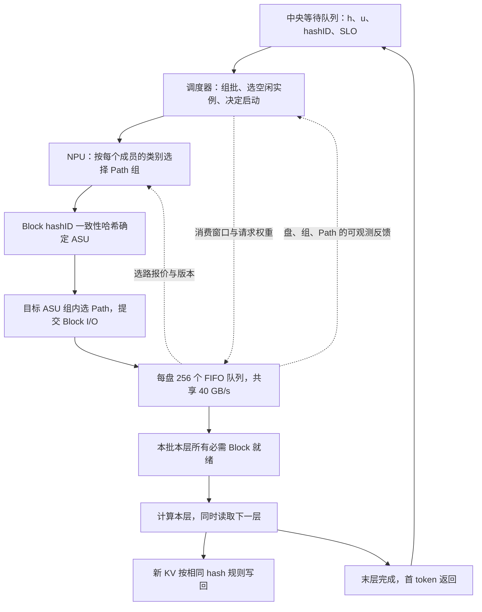
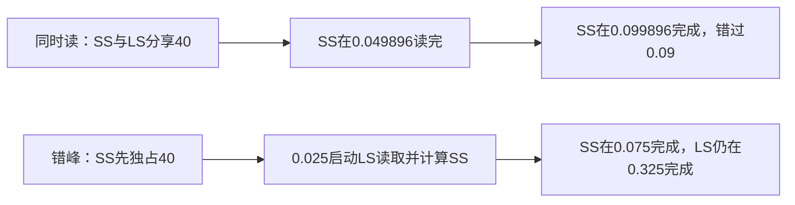

# 共享 KV 多 ASU、多 Path 下的组批、错峰与带宽协同调度设计

| 项目 | 约定 |
|---|---|
| 研究问题 | 中央调度器的组批、领取顺序和启动时刻，如何与 NPU 选 Path、ASU 带宽分配共同优化请求完成时间 |
| 基础架构 | 中央唯一等待队列；同构实例每次执行一个完整 prefill 批；执行前不读，执行中仅下一层 lookahead |
| 存储拓扑 | D 个 ASU；每盘 256 个逻辑等价 Path，每 Path 一个 I/O 队列；每盘总带宽 40 GB/s |
| 放置 | KV Block 的 hashID 经一致性哈希决定唯一 ASU；Path 是访问通道，不是数据副本或放置位置 |
| 请求分组 | 第一字母为命中长度 h，第二字母为未命中长度 u；主配置 h≤80000、u≤512 分别为 S，否则为 L |
| 现状复现 | SS/LS/SL/LL 的 Path 数为 96/96/32/32，基础组带宽为 20/12/4/4 GB/s；空闲份额均分给活跃 Path；组内选最短 I/O 队列 |
| 可调动作 | 组批与启动、组内 Path 选择、带宽分配；固定 Block 放置、总容量、计算能力和请求分类 |
| 设备比例 | NPU 物理卡数 N=XD，X∈{2,4,8}；每实例 P 卡时实例数 m=XD/P，不能将卡数与实例数混用 |
| 四个主目标 | 最小全部请求完成时间 M、最大 TTFT SLO 满足率、最小平均 TTFT、最小平均归一化 TTFT，分别求解 |
| 文档性质 | 调研、机制设计、形式化分析、解析算例和未来实验规格；没有声称已实现或取得正式实验增益 |
| 前序依据 | [原形式化分析](共享KV统一队列下的Batch效率与错峰调度形式化分析-20260913.md)、[实施规格](共享KV统一队列Batch与错峰调度-仿真实验设计实施与测试规格-20260915.md)、[E25 因子设计](共享KV调度因子地图与时间序列-E25设计与测试规格-20260916.md) |
| 日期与单位 | 2026-09-17；秒、十进制 GB、GB/s；80K 的二进制解释作为独立敏感性配置 |

**建议采用分层协同：中央调度器根据各盘的预计负载和逐层 KV 就绪时间组批、错峰；NPU 按预计完成时间选择组内 Path；ASU 在类别和请求之间分配有保底、可借用的带宽。第一阶段保持现有带宽规则，只优化调度和选 Path；第二阶段再引入带宽反馈闭环，用能力消融分清收益来源。**

最值得先验证的不是“多开几个 Path 是否更快”，而是三个问题：现有按活跃 Path 均分余量是否让并发数替代业务优先级；按队列条数选 Path 是否误判剩余工作量；调度器能否避免把同一个热点盘和同一层消费窗口同时压满。所有优化均不能把某盘的数据改读到另一空闲盘。

## 1. 完整问题、架构变化与研究边界

### 1.1 系统在做什么

请求 i 在 a_i 到达，已有 h_i 个 token 的 KV 可复用，还需计算 u_i 个 token，截止时间 d_i=a_i+s_i。待执行请求始终保留在中央队列；仅在领取时绑定空闲实例。实例读取本层需要的所有 Block 后计算，并在本层计算开始时提交下一层读取。完整批的成员到最后一层不变，成员一起产生首 token。



ASU 是共享池，不按 X 张卡绑定一个盘；X:1 仅是容量配比。主模型各 NPU 可达所有 ASU，网络不形成额外瓶颈。若真实部署存在拓扑亲和、链路上限或 TP rank 的分片访问，应增加共同约束，不能把它们隐藏在“40 GB/s”里。

### 1.2 相对原文修正了什么、为什么

| 原文假设或结论 | 本文修正 | 原因与影响 |
|---|---|---|
| 一个全局 B、批×层聚合流 | D 个独立带宽域、Block I/O、256D 个队列 | 一个批可能等待多个盘和多条 Path，不能只用总量除总带宽 |
| 存储全局 FCFS 按申请速率分配 | 每 Path 内 FIFO，Path 间按明确分配器并发服务 | 不存在全存储统一先来先服务序号；原式(1)与原四请求数值失效 |
| 调度动作只含批成员、实例和启动 | 增加组内选 Path、带宽配置动作 | 优化要计入动作对其他请求份额的影响 |
| 读取需求 V/c 同时用于申请协议 | V/c 保留为消费窗口需求；现状默认尽快读，非硬速率上限 | 用户的新规则未规定原文的申请速率限制，不应默默继承 |
| 读量固定即可闭合存储过程 | 显式给出新 KV 写回及读写共享规则 | 长未命中请求可能读少写多，只看读取会错判 SL/LL 的压力 |
| 原实验以 512/8192 区分长短 | 分类门槛改为 80000/512 | 8192 命中长度在本模型属于 S，旧 trace 标签不能直接复用 |
| 原四目标与 batch 同步损失 | 定义保留，新增多盘尾部、队头阻塞和带宽反馈 | 原定性风险继续成立，数值与胜负区间须重新验证 |

与仓库 [D1–D7 机制映射](五工作的Scheduler-Engine修改与主流默认实现-20260904.md) 对齐：中央控制对应 D1/D2，选 Path 与读带宽对应 D4，完整 prefill 能力仍是 D5，写回涉及 D7。本文新增的是研究方案，不将既有 TensorCast、Kairos、Cascade、AAFLOW+、CacheFlow 基线改名为本文算法，也不沿用未经重新核实的产品默认行为断言。

### 1.3 必须明确的补充假设

题设未完全定义的部分用下表封闭，实施前用硬件测量校准；这些不是声称真实 ASU 已采用的规则。

| 问题 | 主模型约定 | 独立敏感性/待核实项 |
|---|---|---|
| 80K 的 K | 80000 tokens；等号属于 S | 81920；边界样本覆盖两种解释 |
| Path 的 I/O 纪律 | 单个队头串行服务，后续 FIFO；读写共用队列 | 多 outstanding、乱序完成、独立读写队列 |
| “排队最少” | 未完成 I/O 条数，包含正在服务的队头 | 若设备只报 waiting 条数，单独作为另一基线 |
| 0.208 的精度 | SS 基础份额精确使用 20/96=5/24 | 0.208 仅展示值，否则总量少 0.032 GB/s |
| 单 Path 速率 | 无独立物理上限，基础份额可借用至整盘容量 | 必须测单 Path 峰值、并发饱和点、连接和网卡上限 |
| 选路粒度 | 每个 Block 的每层 I/O 独立选择目标盘内的一个 Path | 同请求同盘整层固定一条 Path、合并 I/O 粒度 |
| Path 分组 | 固定 96/96/32/32，所有实验共享 | 动态跨组借 Path 仅作后续能力扩展 |
| 读写能力 | 40 GB/s 是读写合计上限 | 若为单向峰值或读写耦合曲线，需要替换容量模型 |
| 写路径分类 | 使用产生该写入的原请求类别，批内不重分类 | 数据不带永久类别；后续读取由新的请求类别决定 |
| TTFT 和持久化 | 主模型末层计算完成即产生首 token；写入可继续 | 写确认后才返回首 token，作为明确的另一完成语义 |
| 缓存内容 | 命中列表在输入 trace 固定，无迁移、复制和跨请求读去重 | 写完成影响未来命中的闭环实验另做，不混入主比较 |

“逻辑等价”指每条 Path 具有相同物理能力和对本盘 Block 的访问能力；SS 的不同基础份额来自配置，不是更快的硬件。

没有硬件实测前，单 Path 独占 40 GB/s 是题设理想化模型的结果，不是硬件能力声明。路径数量少时是否达到 40 GB/s，是首轮标定的关键。

### 1.4 所有策略共用的能力

同模型、精度、并行配置、内存预算；每实例同时一个活动批，STALL 时不能接第二批；无本地 KV 命中优势、无跨批预读、无主动重算、无缓存副本选择。已入队 I/O 不撤回、不迁移、不抢占队头；修改的是未来入队选路和未来服务速率。主实验不丢弃超期请求，等待与超期均保留在到达 cohort 的分母中。

Mooncake 原文确实描述逐层异步加载、计算前等待、计算后异步存储；它还讨论等全部异步存储完成的执行方式。本文的中央队列、Path 分组和具体首 token 完成语义是额外研究约定，不能归因于 Mooncake。[Mooncake §5.2](https://arxiv.org/html/2407.00079v4#S5.SS2)

## 2. Batch 的计算效率、四类请求和画像

### 2.1 四类请求不能被简化成“长请求、短请求”

令 H_*=80000，U_*=512，分类函数为

$$
\chi_i=(\mathbf1[h_i>H_*],\mathbf1[u_i>U_*]),
$$

其中 0 对应 S，1 对应 L，输出按第一维、第二维排列。

| 类别 | 范围 | 常见资源倾向，不能替代画像 |
|---|---|---|
| SS | h≤80000，u≤512 | 新 token 少；接近 80000 的命中仍可能有大量读取 |
| LS | h>80000，u≤512 | 常见读多算少，但长上下文 attention 仍有成本 |
| SL | h≤80000，u>512 | 常见计算与新 KV 写回较多 |
| LL | h>80000，u>512 | 读取、attention、写回都可能较重 |

混合批没有单一类别。若一个批含 SS 和 LL，SS 成员的 I/O 始终进入 SS 组，LL 成员进入 LL 组。不能按批的最大长度把所有成员升为 LL，也不能按短成员给长成员占 SS 份额。SS 既是类别名，不能再用“SS 批”表示任意两个短请求的批，以免与原文算例记号混淆。

### 2.2 计算、读取、写入是三个量

对批 β，沿用原文工作量：

$$
N_\beta=\sum_{i\in\beta}u_i,\quad
A_\beta=\sum_{i\in\beta}\left(u_ih_i+u_i(u_i+1)/2\right),
$$

$$
c_{\beta\ell}=g_w(\{(h_i,u_i)\}_{i\in\beta},\ell,\text{布局、精度、并行配置}).
\tag{1}
$$

每层实际读、写分别记为 V^R_{i\ell}、V^W_{i\ell}。无压缩且完整 token 对齐时可取 κ_ℓh_i、κ_ℓu_i；块填充、部分块更新、元数据和复制写放大应使用实际字节，不能把逻辑 token 字节直接当设备传输字节。共享同一 hash 的多次读取仍分别计量，不暗含去重收益。

批收益继续报告

$$
G_{\rm batch}=\frac{\sum_{i\in\beta,\ell}c_{\{i\}\ell}}{\sum_\ell c_{\beta\ell}},
\qquad E_{\rm token}=N_\beta/\sum_\ell c_{\beta\ell},
\qquad K_\beta=\sum_\ell c_{\beta\ell}.
$$

增加 token 数可改善矩阵执行效率，但收益会随形状和硬件饱和；不能预设固定 batch 加速倍数。[NVIDIA 矩阵乘性能指南](https://docs.nvidia.com/deeplearning/performance/dl-performance-matrix-multiplication/index.html) 完整 prefill 本身可已具有较高并行度，Sarathi-Serve 的 decode/chunk 收益不能直接当成这里的完整批收益。[Sarathi-Serve §3–4](https://arxiv.org/html/2403.02310v2)

### 2.3 混批降低覆盖窗口需求，不等于降低字节或实际带宽

设下一层按盘分解的读量为 V^R_{\beta\ell d}。本层计算窗口为 c，则无阻塞读取的必要平均速率为

$$
q^{\rm need}_{\beta,\ell+1,d}=V^R_{\beta,\ell+1,d}/c_{\beta\ell}.
\tag{2}
$$

c=0 且字节为正时没有可覆盖窗口。混入计算较重成员可能增大 c，降低某个短成员的窗口需求；但仍需同时考虑首层读取、最慢盘、Path 前序 I/O、批内同步和写回。若合批显著加速计算，c 变短，读取反而更容易来不及。

对于释放时刻 s、消费时刻 τ 的一个读集合，无 STALL 必须对每个盘满足所需服务量，并对每个承载 I/O 的 FIFO 前缀满足服务约束。仅验证 `Σ_d V_d≤40D(τ−s)` 不充分。总容量条件满足时，也可能因为全部关键块集中到一个盘而失败。

### 2.4 画像与存储标定方法

原文 §2.5–§2.7 的公开 NPU 数据和 Vidur 数据仍可作为方法参考，但本次不重新背书其中版本与数值；尤其不能外推 32K 内 singleton 数据到超过 80K 的多请求混批。新的测量网格必须包含 h=0/4096/40000/79999/80000/80001/128000，u=1/128/511/512/513/2048/8192，以及同类和混合批。

纯计算画像在 KV 已就绪、无远端等待条件下采样，保存 n、每成员 h/u、N、Σhu、Σu²、布局、逐层时间、峰值内存、模型/设备/TP/软件版本。按 token 形状划分训练和留出集，报告 median/P95 相对误差和候选排序错误率；起始门槛仍为 10%/20%/10%，达不到就补测或标为合成机制研究。

ASU 另测：单 Path 与 1/2/4/8/32/96/256 活跃 Path 的吞吐；读写比例；I/O 大小；队列深度；相同字节不同条数；跨组借用；调度配置切换开销；上报周期与误差；各卡/链路总接收能力。计算与 I/O 测量分开，再用整批时间线核对耦合模型。

### 2.5 可运行的合成起点及内存修正

沿用 synthetic-v1 的 κ=4.096×10⁻⁶ GB/token/layer、L=32 和下式，只把它作为机制参数：

$$
\eta(N)=\min(1,\max(1/16,N/512)),
\quad c_{\beta\ell}=50\times10^{-6}+2\times10^{-7}N_\beta/\eta(N_\beta)+10^{-10}A_\beta.
\tag{3}
$$

例如 h=128000、u=128 的 LS 请求，每层读 0.524288 GB，写 0.000524288 GB，算 0.0017916256 s。独占一个 40 GB/s 盘，仅读取也需 0.0131072 s，明显超过计算窗口。对 D 个盘不能直接除以 D，必须先映射真实 Block 再求最慢盘。

原 16 GB 批工作区预算不适合直接照搬：保留完整 KV 时，仅该请求的 `32κ(h+u)=16.793993216 GB` 已超过 16 GB。本文合成起点取批工作区 64 GB，另设共享写暂存池 8 GB/卡；这都是仿真设计值。工作区沿用 `0.5+LκΣ(h+u)+(16×4096×2/10^9)N` 并叠加实际额外接收/复制占用，不得重复计相同 buffer。若目标 NPU 放不下，缩小批或更换对所有策略一致的逐层 KV 保留能力，不能只放宽优化策略。

## 3. Batch 怎么设，设备配比怎样进入问题

### 3.1 合法批与原子领取

$$
1\le|\beta|\le n_{\max},\qquad \sum_{i\in\beta}u_i\le T_{\max},\qquad
\operatorname{MemPeak}_w(\beta)\le H_w.
\tag{4}
$$

此外每层将产生的写字节不能超过对应暂存池总容量；若单层写都放不下，必须在配置验证时拒绝该批或共同启用分段写出模型，不能无限等待永远不可能满足的预留。

初始 n_max=8、T_max=8192，但实际可行域受内存约束。上限不是等满目标。候选至少包括 singleton、同类批、读算互补批、盘负载互补批，以及含最老请求的批。一个请求自身越界时必须在输入验证中指出，不能默默拆为 chunk。

候选批的可读 I/O 元数据按成员保留，只有同盘、同类、同依赖且固定共同规则允许时才合并提交；正式比较固定 I/O 粒度。否则某策略通过拆成更多 I/O、占更多活跃 Path 就改变了资源权利。

### 3.2 X=2/4/8 的两个不同实验

设每实例 P 张卡。主机制实验 P=1，故 m=XD；真实 TP 场景固定 P 且要求 XD 可整除 P。κ 与 g 要按整实例或各 rank 的实际分片口径匹配，不能每个 rank 都重复读取整实例 KV。

| 扫描方法 | 固定什么 | 回答什么 |
|---|---|---|
| 固定 D，改变 X | 盘数和每盘40，增加卡数 | 更多计算并发是否使每盘队列与读写竞争恶化 |
| 固定卡数 N，改变 X | 计算资源不变，D=N/X | 减少盘数之后调度能补偿多少存储容量损失 |

`40/X=20/10/5 GB/s/卡` 只是总容量均摊的预算刻度，不是保底或单卡限速。热 hash、分类和 Path 活跃数可使实际份额严重偏离。X 增大不保证协同收益单调增加；当硬瓶颈是总字节量时，排序不能创造容量。

### 3.3 等批、错峰与扩展能力

等批和主动错峰都计入中央等待，必须设唤醒事件，不能无限拖延。先保持完整批、固定 Path 组、固定放置。Chunk、跨组 Path 借用、I/O 迁移、跨请求去重及副本均独立为能力扩展，先重新给全部策略开放，再比较信息与决策。

## 4. 可复现的 ASU 与 Path 服务模型

### 4.1 一致性哈希只决定盘

给每盘固定 v 个虚拟节点，节点位置为 `H(namespace, disk_id, vnode_id)`，排序形成环；Block 的键为 `H(namespace, hashID)`，选择顺时针第一个节点所属盘，环尾回绕。固定编码、哈希算法、虚拟节点数、盐和 ring_version；禁止用进程随机化的语言内置 hash。起始 v=256，扫描 32/256/1024。

在主模型里，同一 Block 的各层切片沿用 Block 的盘映射，不能再对 layer 取哈希重新摊盘；写入和以后读取使用相同键。hashID 的身份应覆盖模型版本、KV 格式和必要的前缀上下文，避免不同内容误当同一对象。部分新块、已有块追加的实际写字节由 manifest 明确。

一致性哈希提供成员变化时较平滑的键映射，但不能保证热点访问带宽均衡。Chord 原文描述键到后继节点的映射与虚拟节点机制；本文使用静态目录映射，不实现 Chord 的分布式查找协议。[Chord 原文](https://pdos.csail.mit.edu/papers/ton%3Achord/paper-ton.pdf) 主实验不增删盘；动态扩容须单独计迁移、目录一致性和额外 I/O。

定义每批、层、盘、类的需求张量

$$
V^{R/W}_{\beta\ell dc}=
\sum_{i\in\beta:\chi_i=c}\sum_{k:\operatorname{disk}(k)=d}v^{R/W}_{ik\ell},
\quad V^{R/W}_{\beta\ell d}=\sum_cV^{R/W}_{\beta\ell dc}.
\tag{5}
$$

大前缀包含很多 Block 时，通常会跨多个盘；热门共享前缀或有限个大 Block 可形成热点。保留同一 hash 在所有策略、所有层的相关性。

### 4.2 现有规则 B0：基础份额加空闲余量均分

每盘固定组：

| 类别 c | Path 集合，示例编号 | 数量 n_c | 组基础额 B_c⁰ | 每 Path 基础额 r_c |
|---|---|---:|---:|---:|
| SS | 0–95 | 96 | 20 | 5/24≈0.208333333 |
| LS | 96–191 | 96 | 12 | 1/8=0.125 |
| SL | 192–223 | 32 | 4 | 1/8=0.125 |
| LL | 224–255 | 32 | 4 | 1/8=0.125 |

令 A_d(t) 为非空、可服务的 Path 集合，n_d=|A_d|，其余 Path 不保留空闲带宽。主模型无额外速率上限，n_d>0 时

$$
L_d=40-\sum_{p\in A_d}r_{c(p)},\qquad
b_{dp}=r_{c(p)}+L_d/n_d\quad(p\in A_d),
\tag{6}
$$

非活动 Path 为零；n_d=0 时整盘空闲。因此活动时 `Σ_pb_dp=40`。**20/12/4/4 是全活跃时的基础份额，不是组带宽硬上限。** 仅 SS 组活跃时，SS 可拿到 40。

若外部负载以已知实验 schedule 使本业务可用带宽 B_d(t)≤40，则把所有 r_c 等比例乘 B_d/40 后再用式(6)计算；这是故障/背景敏感性定义。也可显式模拟背景 I/O 竞争，但不能同时减容量又重复计同一背景字节。

### 4.3 活跃 Path 数如何改变组份额

设各组活动数为 a_dc，则

$$
B^{\rm actual}_{dc}=a_{dc}r_c+
\frac{a_{dc}}{\sum_ea_{de}}\left(40-\sum_ea_{de}r_e\right).
\tag{7}
$$

由此可直接算出下列瞬时服务率；各 Path 在观察区间内持续有数据，未引入端点限速。

| 活跃 Path | SS 合计 | LS 合计 | 解释 |
|---|---:|---:|---|
| SS=96、LS=96、SL=32、LL=32 | 20 | 12 | SL/LL 各4，总计40 |
| SS=1、其余为0 | 40 | 0 | 单 Path 理论上可用整盘 |
| SS=1、LS=1 | 481/24≈20.041667 | 479/24≈19.958333 | 两组接近均分，偏离20:12基础比例 |
| SS=2、LS=1 | 481/18≈26.722222 | 239/18≈13.277778 | SS 多开一条 Path，份额显著增加 |
| SS=96、LS=1 | 40−32/97≈39.670103 | 32/97≈0.329897 | LS 获得很少借用份额，但仍有正基础速率 |

现有模型并非严格零服务饥饿：正常容量下，活跃 LS Path 至少有 0.125。风险是长尾和 SLO 失守，以及资源份额随并发数变化。增加 Path 不增加盘容量，也不保证该请求或全局指标改善。

### 4.4 I/O 粒度、FIFO 与最短队列 P0

I/O j 带有 `(request,batch,layer,hashID,op,disk,class,bytes,submit_seq)`。对目标盘和请求类别，P0 选择

$$
p^*\in\arg\min_{p\in\mathcal P_{d,\chi_i}}\widehat{N}_{dp}(t),
\tag{8}
$$

N 包括在服队头；平局用固定可复现的 `(request_id,layer,block_id,op)` 哈希轮转，避免全部选最低编号。所有策略使用同样的平局和同刻提交排序规则。

多 NPU 依据旧快照可能同时选到同一 Path。客户端账本记录自己已提交但未反映在快照中的 I/O；配合存储入口的原子队列追加/短时版本校验。基线必须显式分为 P0-observed 和 P0-oracle，前者不能直接访问模拟器真实队列。入口版本确认只在真实提交时发生，不允许普通策略通过任意假设查询偷看内部状态。

每 Path 仅队头消耗 b_dp；队头完成后出队，下一个继承服务机会。新 I/O 无法因为 deadline 紧就越过旧队头，除非另组实验共同改变服务纪律。

### 4.5 每 Path 有硬上限时的扩展

若测得 Path 服务上限 q_dp，则主公式需要改为带上限的水位分配：先给 `min(r_c,q_dp)`，余量在未达 q 的活跃 Path 间均分，某 Path 达上限后继续迭代分给其余 Path。直到用满 40 或所有可行需求满足。不能只将式(6)逐条截断后留下本可利用的容量。

多个盘还共享同一 NPU 接收链路时，需要同时满足 `Σ_{j→w}b_j≤NIC_w` 等约束的多资源分配。不能每盘独立满速再把同一网卡重复计算 D 次。首轮理想模型排除此瓶颈；有上限的实验所有策略统一采用同一个可行资源分配器。

### 4.6 写回、缓冲区与完成语义

主实验包含读写。新 KV 在对应层计算结束 Z_βℓ 后成为可写数据；写 I/O 按产生它的请求类别和 Block hash 入队，和读取竞争同一个 40 GB/s。基础版沿用 P0 为写入选 Path；改进版对读写都使用相同可用信息和选路权限。

每卡有有限、显式计量的写暂存池。开始某层计算前，先为该层将产生的写字节预留空间；写完成才释放。空间不足则等待，计算尚未开始，因此不存在“生成后发现无处存放”。缓冲区由数据面持有，首 token 返回后仍可排空，但不得无限增长，也不能当作提前取下一批 KV 的缓存。副本/搬运成本并入共同画像或显式 Copy 事件；首轮可设为零，并明确是理想化。

默认 `F_i=末层计算结束`；额外报告 `F_i^persist=max(F_i,该请求全部写入完成)`。NPU 可以在 F_i 之后领取下一批，但下一批每层仍受暂存池余量约束。若采用写确认后返回的栈，所有策略统一以 F_i^persist 计 TTFT，并让实例占用到确认完成，不能在同一表里混用。

读写主实验冻结命中 manifest，写入仅产生固定后端负载，不在本轮实验改变未来请求的命中分类；这研究的是调度与带宽的因果作用。真实复用闭环必须检查 Block 写完才可命中、同键并发写和部分块一致性，再独立评价缓存反馈效应。纯读 R0 只用于解析对拍和读路径消融，不能替代读写全量结果。

## 5. 形式化调度模型

### 5.1 输入、状态和决策变量

输入集合为请求 I、到达/SLO、Block 读写 manifest、一致性哈希环、D/X/P、批可行域、g、容量 schedule、观测协议和控制开销。状态 X_t 包括中央等待、活动批层进度、暂存池、各队列与剩余字节、服务配置、延迟上报和待生效控制。真实状态只供物理仿真器使用，普通策略接收其可观测投影 O_t。

联合计划记为

$$
\sigma=(\mathcal B,\{w_\beta,s_\beta\},\{p_j\},\{\theta_d(t)\}),
\tag{9}
$$

其中 θ 指定合法带宽规则及参数。基线 θ=B0；协同方案 θ 来自 §11 的共同配置目录。即使在优化版，也不能直接选择违反分配器、FIFO 和容量的任意 b_j。

批划分覆盖每个请求恰好一次，s_β≥max_{i∈β}a_i；只有空闲实例才能领取。中央队列是已到达、尚未领取的请求集合。普通在线策略是历史可观测信息到动作的因果映射，不知道真实未来到达。

### 5.2 逐层依赖与 I/O 守恒

对读取 I/O j，逻辑提交/释放时刻为 A_j，实际完成为 R_j，Path 队头指示为 z_j(t)。设 x_j 为剩余 GB：

$$
\dot x_j(t)=-z_j(t)b_{d(j),p(j)}(t),\qquad
x_j(A_j)=v_j,\qquad x_j\ge0.
\tag{10}
$$

未提交或已完成 I/O 的服务率为零。R_βℓ 是本批本层所有读 I/O 完成时刻的最大值，读集合为空则 R_βℓ=A_βℓ。

设 E_βℓ 是层依赖满足后能原子获得该层写缓冲预留的最早时刻，则

$$
A_{\beta1}=s_\beta,\quad
A_{\beta,\ell+1}=C_{\beta\ell},\quad
C_{\beta\ell}=\max(R_{\beta\ell},Z_{\beta,\ell-1},E_{\beta\ell}),
\quad Z_{\beta\ell}=C_{\beta\ell}+c_{\beta\ell},
\tag{11}
$$

Z_β0=s_β。E 由相同的缓冲区释放/预留事件规则计算，不是优化器可自由填写的常数。写 I/O 在 Z_βℓ 释放。下一层预取最多提前一层，不能提前建立未执行批的 I/O。

### 5.3 设备时间与实例互斥

默认 F_i=F_β=Z_βL。同实例 `[s_β,F_β)` 不重叠，区间含读取等待、计算和暂存池背压。首 token 后尚未完成的写入属于数据面任务，继续计后端负载和 buffer 占用，不占本模型 NPU 计算实例。

每请求 TTFT=T_i=F_i−a_i；中央等待=s_β−a_i。实例状态互斥划分：计算时 Compute；未计算且缺必需 KV 时 STALL；KV 已齐但写预留或控制/拷贝阻塞时 Other；无活动批时 Idle。若同一时刻既缺读又缺写空间，主归因采用 STALL，另记录原因位图，避免重复计时。

$$
\text{活动时长}=\text{Compute}+\text{STALL}+\text{Other},\qquad
K+S+O+I=mH.
\tag{12}
$$

P>1 时按物理卡秒加权，总预算为 NH。原文三状态图在有写背压时需增加 Other，不能把写等待漏掉或算成有用计算。

## 6. 完整优化问题与约束

### 6.1 合法动作空间

| 决策层 | 允许改变 | 必须固定的约束 |
|---|---|---|
| 中央调度 | 新批成员、空闲实例、领取顺序、有限启动延迟 | 已活动批不拆不迁；相同内存与 token 能力 |
| NPU 选路 | 新释放 I/O 在目标盘、本请求组内选 Path | 不换盘，不重分类，不迁移既有 I/O |
| ASU 分配 | 在预定更新点改变组/请求权重与借用 | 每盘≤40、既有 FIFO、相同端点上限、同一公平保护 |
| 写控制 | 通过共同数据面执行固定缓冲/背压协议 | 不能靠不写或无限缓存隐藏写负载 |

主方案保持 Path 数不变。若重分组，须等待目标 Path 队列排空并原子切换组归属，重新定义公平性和容量；此动作不进入第一版。

### 6.2 四个目标

固定 n 个请求、观测起点 t₀，定义

$$
J_M=\max_iF_i-t_0,\qquad
J_S=\frac1n\sum_i\mathbf1[F_i>d_i],
$$

$$
J_T=\frac1n\sum_i(F_i-a_i),\qquad
J_R=\frac1n\sum_i\frac{F_i-a_i}{T_i^0}.
\tag{13}
$$

每次只优化一个 J。SLO 满足率=1−J_S，截止相等算成功。T_i⁰ 在实验前使用同一拓扑、hash 映射、B0/P0、无背景和独占实例的 singleton 重放固定，计入相同读写协议；它不会因待比较的带宽算法或拥塞变化而放宽。跨 X 场景主表固定一套参考 T⁰与 deadline，另列随硬件变化重新定标的敏感性表。

TTFT 的 M 不等于全部持久化时间；另外报告 `M_persist=max_iF_i^persist−t₀` 和未写完字节。优化请求 M 时仍要求有稳定、可排空的写入系统，不能用不断增长的写债务兑换虚假容量。

### 6.3 全部物理约束汇总

$$
\begin{aligned}
&\mathcal B\text{ 为 }I\text{ 的合法划分},\quad s_\beta\ge\max_{i\in\beta}a_i,\\
&[s_\beta,F_\beta)\cap[s_\gamma,F_\gamma)=\varnothing\quad(w_\beta=w_\gamma),\\
&d(j)=\operatorname{Ring}(hashID_j),\quad p_j\in\mathcal P_{d(j),\chi_{i(j)}},\\
&b_{dp}\ge0,\quad\sum_pb_{dp}\le B_d(t)\le40,\\
&\text{只有已释放、已入队且为队头的 I/O 可以获服务},\\
&\text{满足式(10)–(11)、写预留容量和固定回收规则},\\
&\theta(t)\text{仅在控制生效事件更新，物理分配严格执行选定规则}.
\end{aligned}
\tag{14}
$$

这些约束与目标合起来才是联合优化问题；只对候选批估一个 `读量/平均带宽+计算时间`，无法保留跨盘最大值、FIFO 前缀和重分配的相互影响。

### 6.4 必要容量条件与热点指标

长期稳定必须至少满足每盘 `λE[V_d^R+V_d^W]<40`，以及实际组批后的平均计算需求不超过卡容量。它们不是充分条件，有限 Path、消费依赖、端点和暂存空间还会限制系统。

对字节向量可报告

$$
\operatorname{skew}(V)=\frac{\max_dV_d}{(\sum_dV_d)/D},
\quad
\rho_d(\Delta)=\frac{\text{未来窗口已释放与预计释放的服务量}}{\int_t^{t+\Delta}B_d(x)dx}.
\tag{15}
$$

全零字节时 skew 记不可定义。ρ>1 表示按该窗口需求不可能全部满足；ρ≤1 不保证无 STALL，因为一些 I/O 晚释放或排在其他 I/O 后。调度不能仅凭散列整体均匀就忽略访问频度相关性。

## 7. 一个动作的全局代价和指标口径

### 7.1 严格代价与可实现预测

在真实状态 X_t 中固定过去和联合动作 α，定义 `Q_J*(X_t,α)=inf_{合法后续计划}J`。这是离线最优条件价值，不是在线可直接算的分数。实现上对 O_t 构建估计状态，使用共同后续策略、未来情景和终端排空规则，重放得到预测 F̂_i。

若 Δ_i=F̂_i^α−F̂_i^0，则四目标增量分别为：最大完成时间之差、失败指示之和除 n、ΣΔ_i/n、ΣΔ_i/T_i⁰/n。必须计入当前其他活动批、中央待执行请求和写回对后续请求的影响。不能只给新批自己的节省打分。

### 7.2 选 Path 与调带宽都具有外部影响

把一个 I/O 放到空 Path，既改变它自己的排队，也增大活跃数，从而重算整盘所有 b_dp。提高某组权重会延迟其他组关键块；给一个批的非瓶颈盘加速，可能完全不改变本层就绪时间。候选动作须联合重放，不能将若干互相影响的单独报价直接相加。

请求级 deadline 与下一层消费时刻不同。前者是首 token SLO，后者只表示何时可能 STALL。一个已无希望按时的请求仍需服务；一个下一层即将到期但最终 deadline 很松的请求，不必无条件挤掉可救回 SLO 的请求。

### 7.3 NPU 和存储利用率

Compute 占比=K/(NH)，同时报告 STALL、Idle、Other 的绝对卡秒；批效率提高可能让 K 和占比下降而 TTFT 更好。等待搬到中央队列也可能降低 STALL，却不减少总时延。

每盘 `U_d=∫Σ_pb_dp/∫B_d`，同时报告读、写字节及份额。池利用率是总服务除总容量积分，不能用未加权的不同窗口平均值。主窗与排空窗分开；M 时写入未排完，不能把“所有请求的总读写量/(40DM)”当成已经观测到的利用率。

在线容量要求：到达队列、I/O 队列和写暂存池都无持续增长，满足预设 SLO 比例，控制开销已计入。到达率固定、全部执行时，goodput 定义为窗口 cohort 按时完成请求数除到达窗口秒数，避免把排空期不同造成的吞吐变化误判为收益。

### 7.4 防止平均数掩盖牺牲

分别报告 SS/LS/SL/LL 的成功率、P50/P95/P99、归一化时延、最长等待、迟到量和进度。额外记录热点盘上的跨盘拖尾 `max_d R_d−min_d R_d`、逐层关键盘切换、队头阻塞时间、Path 活跃数和配置振荡。

SLO 目标可优先挽救临界请求，但不得删除失败请求或无限推迟长请求。统一等待保护 W_guard 和正服务保底；过载时不能宣称有限的硬等待保证。

## 8. 可手算的机制例子与错峰边界

以下均为假设参数的解析例子，不是实测 ASU 或全量仿真结果。小例子允许用单个聚合 I/O 代表一串固定同 Path Block，粒度在该例所有方案一致。

### 8.1 最短条数不等于最短等待

同类别的两个候选 Path 在外部负载维持相同速率的区间内，P1 有一个剩余 4 GB 的队头，P2 有四个各剩余 0.1 GB 的 I/O。一个新 0.1 GB I/O 到达：按条数选 P1，前方工作量 4 GB；按字节选 P2，前方只有 0.4 GB。

若均为 1 GB/s 且在完成前速率不变，两种预计完成耗时分别 4.1 s 和 0.5 s。真实 B0 中其他 Path 的结束还会改变速率，因此 `剩余字节/当前速率` 也是近似，最终应用重放核验。这说明 P0 可能出错，不是证明最短字节在所有场景最优。

### 8.2 多开 Path 可以改变权利，却不能创造带宽

式(7)中 SS 从一条改为两条活动 Path，LS 一条不变，SS 总速率从 20.041667 变为 26.722222，LS 从 19.958333 变为 13.277778。若总字节未变，变化来自服务份额重分配。

它解释了为什么独立 NPU 都选择空队列、倾向铺开 Path，可能互相争抢余量。解决方法不是强行把全部 I/O 塞到少量队列，而是把业务权重和 Path 数分离，再根据实际端点瓶颈选择需要的并发度。

### 8.3 完整两请求比较：错峰能改善短请求而不增加 M

D=1、X=2、P=1、两实例、L=1、所有请求 a=0、纯读 R0，无端点上限。一个 SS 请求每层读 1 GB、算 0.05 s；一个 LS 请求读 4 GB、算 0.20 s。可用 h=32000/128000、u 均≤512 及相应假设 κ 构造这些字节；此处计算时间独立给定，不使用式(3)。SLO 分别为 0.09、0.40 s。每请求的单个 I/O 使用自己组的一条 Path。

- A：同时领取，分别执行。初始速率 SS=481/24、LS=479/24。
- B：先领取 SS，0.025 s 它读取完成后再领取 LS。SS 的计算与 LS 的读取重叠。
- C：两个请求合为一个完整批，计算时间取无合批加速的 0.25 s，成员仍各走原类别 Path。

| 指标 | A 同时执行 | B 错峰 | C 混合批 |
|---|---:|---:|---:|
| SS 读取完成 | 24/481≈0.049896 | 0.025 | 0.049896 |
| LS 读取完成 | 0.125 | 0.125 | 0.125 |
| SS 首 token | 0.099896 | 0.075 | 0.375 |
| LS 首 token | 0.325 | 0.325 | 0.375 |
| M | 0.325 | 0.325 | 0.375 |
| 平均 TTFT | 0.212448 | 0.200000 | 0.375000 |
| 平均归一化 TTFT，T⁰=(0.075,0.300) | 1.207640 | 1.041667 | 3.125000 |
| SLO 满足率 | 50% | 100% | 50% |
| Compute 卡秒 | 0.250000 | 0.250000 | 0.250000 |
| STALL 卡秒 | 0.174896 | 0.150000 | 0.125000 |
| Idle 卡秒，以各自 M 为窗 | 0.225104 | 0.250000 | 0.375000 |

A 中短读结束后剩余长读独占 40，总字节 5 GB，连续忙碌读取恰在 5/40=0.125 s 结束。B 将读取顺序改变，但总读忙碌区间没有增加；LS 仍在 0.325 s 完成。C 的 STALL 最少，却因同步和较长单批计算变得最慢。三个方案都有 `Compute+STALL+Idle=2M`。



上述说明存在有用的错峰，不宣称 B 为所有合法启动和批划分的全局最优。两层及以上还会有下一层读取和写回重叠，不能直接照搬数值。

### 8.4 多盘尾部使“总带宽够”失效

两个盘各 40，一层读量向量为 `(8,0)` GB 时至少要 0.2 s；向量 `(4,4)` 时理想并行下界是 0.1 s。二者总量相同，`8/80=0.1` 只对后者可达。固定一致性哈希时不能为了追求 0.1 s 将前者的块改放盘。

若另一个批的向量为 `(0,8)`，两批并行有机会分别使用不同盘；若为 `(8,0)`，它们仍争同一个盘。组批/并发筛选应比较需求向量，而非只比较请求类别或总命中长度。

### 8.5 哪些情况下不应主动错峰

没有关键盘竞争、当前计算已能掩盖读取、暂存池充裕、到达率低且 deadline 紧时，等待通常只有成本。若单请求已读满唯一瓶颈盘，增加卡数不会降低该请求的数据下界；若单 Path 有低上限，则过度聚合反而丢失可利用带宽。带宽方案已能保护关键读取时，中央额外等待可能重复保护并浪费计算并发。最终以四目标之一的全局重放决策，不能由类别直接规定“LS 一律延迟”。

## 9. 复杂度：哪些最优问题仍然困难

### 9.1 归约的适用范围

一般离线模型允许请求数、盘数、实例数及有理数画像作为输入；成本画像可有效计算。考虑合法子问题：batch=1、单层、无远端读写、固定计算时长 p_i。Path、哈希和带宽决策不再影响结果，只剩非抢占机器调度。因此新增存储自由度不能使一般问题自动变容易。

这是对完整可配置问题族的结论，包含纯读零命中/关闭写入的机制子类；并不直接证明“强制所有请求有正读写、固定 P=1、D=1 和固定画像”的每个子类同样困难。

### 9.2 M 与 SLO

3-PARTITION 的 3m 个数满足 D₀/4<p_i<D₀/2、Σp_i=mD₀；能在 m 台实例上于 D₀ 完成，当且仅当可分为 m 个和为 D₀ 的三元组。令所有截止为 D₀，同一构造证明判断能否全部按时同样困难。

X∈{2,4,8} 不妨碍一般规模归约：固定 X=2、P=2，则实例数 m 等于盘数，可随输入变化；纯计算子问题仍成立。若强制 P=1，可用填满额外机器的长度 D₀ 作业将机器数补到 X 的整数倍。一般 M/SLO 优化强 NP-hard；固定两实例的 PARTITION 子类只给普通 NP-hard。[经典调度复杂度原文](https://ir.cwi.nl/pub/18051/18051A.pdf)

### 9.3 平均 TTFT 与归一化 TTFT

单实例、非抢占、允许不同到达时间、无 I/O 时，最小 `Σ(F_i−a_i)` 等价于 `1|r_i|ΣC_i`，因为 Σa_i 固定；这是经典困难子问题。单实例可取 D=1、X=P=2 实现。全部同时到达、单机独立处理的特例则可用 SPT，不能把困难性误用于该简单子类。[同上，Theorem 5](https://ir.cwi.nl/pub/18051/18051A.pdf)

T_i⁰=p_i 时，归一化目标为总 stretch `Σ(F_i−a_i)/p_i`，需要独立的复杂度依据，不能仅凭“加权”二字推断。本次重新取得并核对 Legrand、Su、Vivien 的作者期刊稿：§5.1、Theorem 4 以 PARTITION 归约说明非抢占单机、带释放时间的总 stretch 判定问题为 NP-complete。因此本文的一般归一化优化问题为 NP-hard，不将其升级为强 NP-hard，也不将连续的完整模型直接称为 NP-complete。[作者期刊稿，Theorem 4](https://polaris.imag.fr/arnaud.legrand/articles/JoS-LSV08.pdf)

### 9.4 不应过度解释硬度

一般 NP-hard 不妨碍小规模穷举；有限目录最优不等于连续权重与连续启动全局最优。未知未来的在线策略也不能普遍匹配拥有未来信息的离线最优。最大 NPU 占比只有在总计算工作固定且窗口取 M 时才与最小 M 对应，batch 改变计算工作后不能直接移用这个证明。

## 10. 精确算法、下界与近最优证书

### 10.1 先实现共同事件重放器

每个区间服务率保持常数，下一事件取 I/O 队头完成、计算完成、新到达、背景变化、观测交付、控制生效、调度唤醒的最早者。队头剩余字节/b 给出传输完成时间；b=0 不生成无穷循环事件。

同刻事件按以下顺序确定处理，零耗时依赖重复闭包至稳定：

1. 结算刚结束区间的字节、计算和状态积分；移除所有已完成 I/O，释放写暂存。
2. 处理计算结束与首 token 完成，释放本层写 I/O；既有批优先处理可启动的下一层，预留缓冲并提交 lookahead。
3. 登记新到达与控制返回；版本有效时原子领取新批，释放第一层读。
4. 合并同阶段 I/O，按固定 `(阶段,闭包轮次,worker,batch,layer,request,block,op)` 顺序选路、入队；其他已入队顺序不变。
5. 应用本轮已经生效的分配配置，更新活跃集并重新计算速率；按固定时间点生成观测，进入下一区间。

软件实现需要避免步骤2生成依赖步骤4的零时事件被推迟一个实际时间步；采用同刻闭包即可，闭包次数异常时应报错。配置迟到不会回溯更改已完成的服务量。

### 10.2 有限空间精确求解

离线小实例冻结合法批目录、启动网格 δ、控制更新网格、带宽配置目录、Path 决策范围和有限完工上界 H_max。遍历每个可决策状态的联合动作并精确重放；采用分支定界剪枝。只有穷尽声明空间或全局下界达到可行上界，才能说最优。

分别设三档证书：E-S 固定 B0/P0，只求调度；E-SP 固定 B0，联合调度与全组 Path 选择；E-SPB 再加入有限带宽目录。若 Path 候选仅取两条、调度只取启发式批目录，则证书只针对这个受限空间。空且完全等价的 Path 可按对称性约简；不能合并不同 FIFO 队列、端点亲和或不同未来平局语义的 Path。

带宽目录例如 B0、§11 B1 的φ∈{0.25,0.5,1}及有限紧迫性权重档。目录最优不冒称任意连续 b_dp 的最优。连续放松可提供下界，但离散网格的最优值不能自动作为更大连续可行域的下界。

### 10.3 四目标安全下界

对未领取请求取 `e_i=max(t,a_i)+min_{合法候选β含i}Σℓc_βℓ`，忽略 I/O、机器占用和伙伴可用性；活动批取 t 加剩余纯计算；已完成请求取真实 F_i。这样得到乐观完成时间 e_i。相应下界为

$$
LB_M=\max_ie_i-t_0,\quad LB_S=\sum_i\mathbf1[e_i>d_i]/n,
$$

$$
LB_T=\sum_i(e_i-a_i)/n,\qquad LB_R=\sum_i(e_i-a_i)/T_i^0/n.
\tag{16}
$$

M 可再取每盘必要剩余读取下界 `t+V_d^{R,rem}/40−t₀` 的最大值；读取包括队头/排队剩余、未提交后续层和未领取请求。**默认异步写的 TTFT-M 下界不能把所有剩余写入也要求在 M 前完成**，因为写可在首 token 后继续。若目标是 M_persist 或统一要求写确认才完成，则可用 `(V_d^{R,rem}+V_d^{W,rem})/40`。

计算工作下界用每请求在合法候选中最小的批计算分摊，再加活动批剩余计算，除 m；与盘下界取 max，不能相加，因为 I/O 与计算可重叠。没有可靠画像下界则取零，不以启发式重放结果充当下界。

### 10.4 超时、gap 与比较公平性

保存每个未搜索区域的下界，超时返回 `[LB,UB]`、最佳可行计划、空间定义、节点数、耗时和哈希。对时延目标报告 `(UB−LB)/max(UB,ε)` 与实际候选到最优可行解的差距；对失败率报告失败人数/百分点区间，避免零最优时的比值失真。

精确组所有策略共享真值、目录、网格、零控制开销，隔离算法搜索质量；部署组另测观测滞后、未知未来、真实控制开销。不能只让联合策略看到未来，再把胜出解释为联合动作本身。

## 11. 可实现的分层协同算法

### 11.1 总体控制闭环

中央调度器负责少量候选批及启动计划；NPU 数据面为已释放 I/O 做组内路由；每个 ASU 实施快速工作守恒分配。三层共享请求 ID、类别、层消费时刻、deadline 和配置版本。中央不逐个纳秒分配速率，ASU 也不自行改变批成员。

时间尺度建议：队头完成/新入队立刻重算可用份额；选 Path 每个 I/O 提交时执行；组权重初始每 5 ms 更新；中央在实例空闲、关键完成和有限周期时决策。5 ms 是起点，若 layer 时间远小于它，必须评估失配，扫描 0.5/1/5/20 ms；不能假设层级越多就天然稳定。

### 11.2 普通策略可见的接口与信息边界

| 接口/对象 | 最小字段 | 用途 |
|---|---|---|
| RequestManifest | h/u、类别、hashID→disk、各层读写字节、SLO、固定T⁰ | 请求级需求与盘向量 |
| DiskGroupObservation | sample_time、deliver_time、version、各盘组服务量/活跃数/估计容量/置信度 | 中央组批、压力预测 |
| PathObservation | Path、组、观测未完成数、观测剩余字节、速率区间、可选队头标签 | 组内预计完成时间与客户端账本 |
| ComputeProgress | 活动批、层进度、剩余计算、暂存池占用 | 消费窗口与背压 |
| ServiceHint | request/batch、消费时刻、最终deadline、权重、失效时刻 | 数据面需求反馈，非硬资源预留 |
| ControlCommit | snapshot/config/ring版本、待生效动作、成本、回退原因 | 原子落实与审计 |

队列/带宽/背景真值只用于环境。普通调度、选路、分配控制器都经导出的不可变观测对象读信息，不能拿到 `StorageSim` 引用或 `hypothetical_*`。物理 ASU 执行器识别自己哪些队列非空、限制实际服务以保持守恒，是执行约束，不等于将真实队列预测信息交给普通优化算法；实验中所有分配规则拥有同样执行边界。

策略可用自身提交回执补账，但不得伪造已经完成的字节。观测中未导出的量不能凭数组索引访问真值。若允许存储内部更强本地控制，明确为共同的“存储侧精确本地信息”实验，中央仍只能看导出信息。NPU 当前计算真值可见沿用仓库简化；引入计算预测误差时，全部策略统一切到计算 observable。

### 11.3 P1：预计完成时间选 Path

对 I/O j，先枚举本组合法 Path，再估算

$$
\widehat R_j(p)=t+
\frac{\widehat W^{ahead}_{dp}+v_j}{\max(\widehat b^{after}_{dp},\epsilon)}
+\widehat t^{submit}_{dp}.
\tag{17}
$$

其中 ahead 包含队头剩余、已排队字节、当前控制轮已承诺但快照未更新的字节；after 必须按“把 j 放入之后的活跃集合”重算。先用式(17)筛选 2–4 条，再在估计状态中重放入队到完成。无可服务容量时预测记无穷并等待下一容量事件，ε 只用于数值保护，不把零容量假装成真实服务。

若选择目标是本层完成，可比较 `max(其他必需读完成,R_j(p))`；若两个 Path 对该最大值均无影响，选对其他请求干扰更小者。完整联合版使用全局目标增量；只用 R_j 的局部版保留为强简单基线。

多 NPU 使用版本号、入口回执和短时客户端预留避免惊群。预留只覆盖已合法释放的 I/O，不为中央等待批提前占带宽；失效、超时与取消都释放。发生版本变化时重算或回退 P0，不能默默承诺已经不成立的速率。

### 11.4 B1：组保底、可借用余量，解除组份额对 Path 数的依赖

定义基础比例 `η=(0.5,0.3,0.1,0.1)`，保底系数 φ∈(0,1]。D_dc 是该组当前可供服务的速率需求上限，主模型无端点限制时，非空组 D_dc=∞、空组为0。第一步分配

$$
f_{dc}=\min(D_{dc},\phi\eta_cB_d),\qquad L_d=B_d-\sum_cf_{dc}.
$$

剩余按组权重 w_dc>0 做带上限的加权水位分配：

$$
B_{dc}=f_{dc}+\min(D_{dc}-f_{dc},\lambda_dw_{dc}),
\quad
\sum_cB_{dc}=\min(B_d,\sum_cD_{dc}).
\tag{18}
$$

λ_d≥0 由最后一个约束求得。已满足需求的组让出余量，空组不占带宽。主起点 φ=0.5，活跃组的名义保底为 10/6/2/2 GB/s，剩余依据权重分配。φ=1 且四组都持续繁忙时总保底恰好40，没有可优化余量，这是必须保留的对照。

w 的起点可为 η 的比例或统一1；自适应版本根据同一观测中的剩余量、消费窗口和年龄产生有上限的权重，详见 §11.6。**组保底按组算一次，不能按新开 Path 数重复发放。** 这使同样组需求不会仅因为多占几条逻辑 Path 就提高组级权利。

这种“保底、权重、上限”的区分受存储 QoS 文献启发，mClock 原文同时讨论 reservations、shares 和 limits；式(18)是本设计的 GB/s 流体分配器，不是 mClock 的 IOPS 标签算法，也不继承其全部保证。[mClock，OSDI 2010](https://www.usenix.org/legacy/event/osdi10/tech/full_papers/Gulati.pdf)

### 11.5 B1 的组内分配与 FIFO 限制

先找出本组各 Path 的实际可服务队头，将同一请求的多个队头聚合为一个服务实体。组内按请求权重和正的最小权重做与式(18)同类的水位分配，得到 b_i；再把 b_i 分给该请求作为队头所在的 Path，受每条 Path 的上限约束，余量继续回收。

请求权重只计一次，多个 Path 不能复制请求权重。主无上限模型可将 b_i 按队头剩余字节比例分配；需要延迟优化时用每个队头的消费时间加权，但所有权重正且有界。排在其他请求后面的 I/O 暂时不是服务实体，不能越过队头拿份额。因此 B1 解除的是组级/可服务请求级的并发数套利，不保证换 Path 数后完成时间完全不变。

Path 组仍然固定，LL 不能借 SS 的队列槽位；但空闲 SS 的带宽可按式(18)被 LL 借走。若所有 LL Path 都被慢队头占据，单靠组权重无力消除队头阻塞，这正是 P1 与 B1 需要协同的地方。

### 11.6 消费时刻、deadline、写水位的反馈

对已释放读取集合，以 `need=剩余GB/max(预计消费时刻−t,δ_min)` 表示追赶需求；当前层已 STALL 时消费时刻已过，使用有上限的紧迫性加成，避免除零或无限权重。再结合最终 SLO 的可挽救性、固定 `1/T_i⁰` 权重和等待年龄生成候选。不同主目标使用不同评分，不能把 EDF 自动当成四目标最优。

写入参与同一组/请求权重分配。提高写暂存水位、写年龄或预计下一层预留缺口会提高写紧迫性；低水位时可优先临近消费的读取，但不得写权重归零。连续写积压上升触发中央准入收缩，让已有请求排空，而不是继续领取更多批掩盖问题。

批混合时可为每个读取推导共同层消费时刻，但每成员保留独立 deadline、T⁰ 和权重。多盘读取的关键盘预测随服务变化重新评估，避免把带宽持续投入已经领先的盘。类标签只是初始隔离政策，真正的时效性由字节与依赖决定。

为避免首版只留下“根据紧迫性加权”的口号，给出一个可直接实现、仍需实验验证的权重候选。令同一请求在盘 d 上已释放但未完成的读写量为 qᵢdᴿ、qᵢdᵂ，消费窗口为 τᵢ−t，写排空目标窗口为固定 Δ_W，则

$$
r^{need}_{id}=\frac{q^R_{id}}{\max(\tau_i-t,\delta_{min})}+\frac{q^W_{id}}{\Delta_W},
\qquad
z_{id}=\operatorname{clip}\left(v_i^\theta\left[1+\min(8,r^{need}_{id}/40)+\min(2,age_i/W_{guard})+2\omega_w\right],1/8,32\right).
$$

ω_w 为该实例所在卡写暂存池占用比例；age_i 为最老未完成 I/O 的年龄。无读时第一项为0；多层读同时存在时按层分别求需求再求和。起点 δ_min=0.1 ms，Δ_W=max(5 ms,训练集层计算时间中位数)。这些参数固定进manifest，不从测试trace反推。

v_i^θ 的候选按目标选择：T取1；R取训练集T⁰中位数/T_i⁰并截断到[1/8,8]；S对预测F位于deadline附近±Δ_W的请求取8、其余取1；M对预测F位于当前未完成请求最大预测F的Δ_W范围内取8、其余取1。首token已完成只剩写回的请求取1，靠写水位和年龄继续获得服务。S/M的临界区规则是启发式候选，不能替代真实四目标重放。

组权重取 `w_dc=η_c+Σ_{i∈该盘该组有已释放未完成I/O的唯一请求}z_id`；组内请求权重取 z_id，按§11.5仅给实际队头分配。z对一个请求聚合字节一次，不按Path重复加和；权重更新只使用导出观测，执行器按实际可服务集合回收。固定权重、这个需求权重以及将关键盘权重翻倍的配置构成起始目录，联合搜索从中选取，避免首版求任意实数控制。

### 11.7 S1：盘向量与窗口感知的中央候选生成

每次取最老、最小 slack、最短参考时间、四类代表、低盘重叠代表组成候选请求集合，去重后初始不超过24个。形成最多32个合法批，保留 singleton 和最老请求候选；对同时空闲实例做互不重叠的联合选择。

筛选信号包括计算收益、每盘新增读写量、下一层窗口需求、与活动批预计消费区间的重叠、预测关键盘、写暂存压力。可以用 `Σ_d V_d^new×pressure_d` 排除明显差候选，但最终仍按完整目标重放。

启动选项包含立即、下一个关键 I/O/计算完成预测点、有限 δ 延迟；等待不超过下次唤醒期限。先保留原 B0/P0 比较 S0 与 S1，再更换 P1、B1，不能把三项一起换掉后宣称收益来自“更聪明的调度”。

### 11.8 联合滚动搜索与执行伪代码

```text
JOINT_CONTROL(observation, objective, budget):
    校验观测时间、ring/config版本；合并己方提交回执，构建估计状态
    生成合法候选批、联合领取/等待动作、有限带宽配置
    best = 同能力安全后续策略的可行计划
    对候选联合动作做 beam search，直到事件/墙钟预算耗尽:
        在估计状态中落实候选，不修改物理状态
        对合法释放的读写 I/O，用指定P0/P1产生选路并更新承诺账本
        按B0/B1重放所有盘、队列、层依赖与写缓冲
        搜索窗口结束后用共同后续策略排空已到达请求与必要写负载
        计算全部相关请求的J、分组损害、控制成本和不确定性
        若满足共同保护且目标改善，保留计划
    成本计入真实时间，系统原有计算/I/O在此期间继续前进
    返回时重验版本、实例空闲和成员仍在队列
    仅原子落实首个合法动作，未来计划留待下一轮重算
    超时/过期/预测不可信时，使用相同能力内的确定回退
```

初始 beam=8、深度=3个领取/控制决策、最多10000预测事件、墙钟预算1 ms，扫描0.1/0.5/1/2/5 ms。搜索停止后仍必须给窗口内未完成请求统一终端代价，不能让“全部等待”通过没有完成样本获胜。已到达集合全部排空过于昂贵时使用明确乐观/保守估计，并记录截断比例。

CPU耗时和通信/下发耗时分别记录；主评价使用实测或统一固定延迟模式，零成本只作算法上界。控制器不能暂停其他已经运行的计算与 I/O。若决策 P95 已接近 singleton TTFT，则收缩候选或退回简单规则。

### 11.9 稳定性、失效回退与防饥饿

组权重使用平滑和限幅，起点为 EWMA 系数0.2、单周期权重变化≤20%、最小保持两个控制周期；这些都是待调参设计值。快路径每次队头/活跃变化仍立即回收空闲容量，平滑只约束权重，不能让空组继续占份额。

采用相同的 W_guard，超时请求必须进入下一次可行批候选，多个超限按到达序；SS/LS/SL/LL 均有正带宽保底与请求正权重。观测过期、版本冲突、预测误差过大或预算用尽时退回 S0/P0/B0 或同能力的固定 B1，实验预先声明回退链并统计次数。

误差门槛从训练集候选排序残差确定，改善不足以覆盖误差时不切配置；不要用未经校准的固定“改善10%”冒充正确保证。陈旧报价、惊群、反复扩张活跃 Path、SS 抢走余量和读优先导致写背压，都是需专门构造的失效场景。

## 12. 实验设计、实施顺序和验收标准

### 12.1 研究假设与可否证结果

| 假设 | 需要观察到什么 | 何时否定或缩小结论 |
|---|---|---|
| P1 优于只看条数 | 大小混合/观测可靠时减少关键层读完成尾部 | 同大小I/O无改善，或陈旧信息下惊群抵消收益 |
| B1 减轻 Path 数引发的份额失衡 | 固定业务量时，改变Path展开数不再大幅改变组级权益 | 队头/端点限制仍主导，或保底损害全局目标 |
| S1 的盘向量与窗口有价值 | 热点/消费同步时改善TTFT或SLO | 哈希均匀、计算主导或总容量不足时无明显增益 |
| 三层协同有额外价值 | 同信息下联合方案超过最强单项/双项组合 | 复杂度与迟滞抵消收益，简单组合已足够 |
| X影响策略价值 | 两种X扫描出现可解释的容量/并发边界 | 仅报告某个X胜出，不能外推所有规模 |

### 12.2 策略矩阵：能力与信息分开

定义 S0=中央到达序贪心合法填批且立即启动，S1=全局预测；P0=组内最短条数，P1=预计完成；B0=现有按Path余量规则，B1=组/请求权重方案。首先跑完整 2×2×2 因子矩阵，包括原始 S0P0B0、三个单项、三个双项和全部联合，控制 trace、画像、分类、粒度与硬容量一致。

这八组回答“改变哪个机制产生收益”，不把跨 B0/B1 的差异说成纯信息增益。另在每个固定动作空间内部比较历史/实时/当前真值/离线全知，所有算法获得同一观测协议。S0 之外还需 EDF、SPT、最小slack、读算互补、盘互补贪心等强简单调度基线，并统一开放其可使用的候选批和等待选项。

B1 额外比较固定权重与自适应权重；P1 比较字节/当前速率、计入活跃集变化、全局外部影响三档。禁混批、batch=1、禁等待、只读、无写水位反馈分别是能力消融，单独命名。

### 12.3 拟实验单元与编号

检查当前 `sim/run.py` 已注册至 e25。以下 e26–e31 是本次拟议编号，实施前再次检查冲突；本次没有注册、运行或宣称完成这些实验。

| 拟实验 | 范围 | 主要输出 |
|---|---|---|
| E26 ASU/Path 解析校验与画像 | B0/B1、P0/P1、边界/读写/哈希 | 守恒、微例对拍、硬件标定差距 |
| E27 小规模联合最优 | n=2/4/6，D=1/2，X=2，L=1/2，有限目录 | 四目标证书、Path和带宽新增动作价值 |
| E28 组批与错峰因果 | 固定成员目录、消费窗口、热盘及I/O大小分布 | 调度/选Path/带宽2×2×2贡献和交互项 |
| E29 X配比与在线容量 | 固定盘/固定卡两线，X=2/4/8 | 满足SLO的稳定容量、每盘压力与写积压 |
| E30 信息误差与控制鲁棒性 | 延迟、噪声、惊群、带宽突变、缓冲大小 | 净收益、振荡、回退和失效边界 |
| E31 真实trace与配置迁移 | 带hash的trace与目标NPU画像 | 外部有效性、四类覆盖、未覆盖域 |

### 12.4 公共参数与工作负载

| 参数 | 起始配置 | 扫描 |
|---|---|---|
| D/X/P | D=2，X=4，P=1，m=8 | D=1/2/4；X=2/4/8；固定N=8的另一条线 |
| 每盘带宽/Path | 40，256，分组与题设一致 | 背景容量下降、单Path硬上限作为单独实验 |
| Block | 512 tokens；最后不足部分保存实际长度与字节 | 128/2048；固定同一实验内粒度 |
| ring | SHA-256 固定编码，256虚拟节点/盘 | 32/1024；ring种子与trace种子分开记录 |
| 四类代表 | SS=(40000,128)，LS=(128000,128)，SL=(40000,2048)，LL=(128000,2048)，各25% | 单类10%/50%/90%；阈值两侧；类内长尾 |
| profile | synthetic-v1，L=32，式(3) | 饱和点128/512/2048、无合批收益、真实逐层画像 |
| 批容量 | n≤8，Σu≤8192，工作区64 GB | 上限1/2/4/8；固定真实内存约束 |
| 写暂存 | 8 GB/卡，主模型异步写 | 0.25/1/8；另做写确认后返回 |
| 观测 | 1 ms采样、0额外交付延迟 | 0/1/5/20/100 ms延迟；噪声0/10%/30% |
| 控制 | §11起始参数 | 统一预算扫描，主结果包含开销 |
| SLO | 固定参考T⁰的2/4/8倍 | 共同固定绝对阈值、临界短请求 |

80000 不能被512整除，分类依据逻辑 h，物理 I/O 依据 manifest 的部分块/填充规则，二者不能混同。边界单测必须包含 h=79999/80000/80001、u=511/512/513。纯机制例可以没有文本，但真实画像应固定 tokenizer 和实际 token ID。

负载刻度以原始 S0P0B0 的输入需求定义

$$
\lambda_0=\min\left(\min_d\frac{40}{\mathbb E[V^R_{id}+V^W_{id}]},\frac{m}{\mathbb E[K_{\{i\}}]}\right),
\quad\lambda\in\{0.3,0.6,0.9,1.1\}\lambda_0.
\tag{19}
$$

零字节盘项视为∞。λ₀只是生成尺度，不是已证明容量；batch收益、层依赖和热点都能改变可达值。同格点各策略固定相同λ和trace，X的固定负载比较也锁定参考配置的λ₀；另一组容量扫描才独立寻找每种配置可承受的到达率。

到达包括 Poisson、每20 s内10 s的1.6λ高峰与10 s的0.4λ低谷、同步突发、有限工作集。hash 分布包括均匀独立、共享热门前缀、真实trace。构造热点时通过固定hashID集合和访问频率形成，不能直接覆盖一致性哈希的盘结果。类与热门盘相关性必须覆盖正交和相关两组。

容量扰动按盘使用 `((0,40),(60,20),(100,40))`；仅一盘降速与所有盘同时降速分开。所有策略共享相同背景时间线和外部随机数，随机数按请求/块等稳定键绑定，不按算法第k次调用采样。

### 12.5 不变量、解析对拍和行为断言

1. 分类边界、混合批保留成员类别、总Path数256、基础额精确和40。
2. 同hash同ring决定同盘，读写一致；固定ring时所有策略放置相同；不会绕开热点读另一盘。
3. B0逐项符合式(6)，所有活跃模式满足容量；式(7)表逐项复现；无活跃时零服务。
4. 有端点上限时正确迭代回收；多资源模式没有超额使用同一网卡。
5. 每Path只有队头消耗带宽；I/O字节守恒，不出现负剩余、未提交服务或同一I/O重复完成。
6. P0按声明的观测条数而非真实内部字段；P1把新活跃Path的外部影响计入估计；并发入队版本失效可恢复。
7. B1满足组保底/上限/工作守恒；同请求多Path不重复计权；φ=1全繁忙退化为无余量控制。
8. 领取唯一、活动批互斥、无批前读取、只有下一层lookahead；首层、零读取、零计算和同刻闭包正确。
9. 写只在计算结束后释放；缓冲预留/释放守恒，不超限；F与F_persist分别计算；写在F后继续不会消失。
10. Compute+STALL+Other+Idle守恒，积压与截断请求不被删除。
11. 复现§8.3两请求表，B0/B1和多盘积分使用独立微型参考实现对拍；不能两个搜索器共用错误内核后互相“证明”。
12. n≤4时无剪枝穷举与B&B逐目标一致；证书目录/网格/hash明确，合法计划重放一致。
13. 普通策略无真值引用、无未来trace；同seed同输入确定性；日志开关不改变执行结果。
14. 不额外断言“更多Path、更大批、提前启动、更高利用率总更好”；这些是待研究效应，不是应强行通过的单调性测试。

### 12.6 冒烟、调参、全量与结果输出

先 E26 解析与单测，再 E27 小规模证书；然后种子0、1、duration=150 s、warmup=20 s冒烟。至少找到两个强简单基线满足率在20%–95%的有效区间，并同时覆盖计算主导、存储主导、写背压、热点盘和低负载无收益场景。所有策略都100%按时时只能说明天花板，不能直接进入全量宣称无差异或有效。

训练种子0–4，选择配置与算法预算；冻结后正式用100–114，duration=600 s、warmup=60 s。固定到达cohort `[60,600)`，停止到达后排空请求与写I/O，排空预算预先固定为 `max(600s,10×参考T⁰的P99)`。截断请求保留失败/时延下界和积压状态，均值不只统计幸存完成者。

按同seed计算配对差值、中位数和95% bootstrap区间；若请求时序有明显相关性，使用时间块/trace级重采样，不把所有请求当独立样本。SS等各类和未覆盖类别均显式报告，真实trace缺少>80K样本时不能据此评价LS/LL。

| 输出 | 关键字段 |
|---|---|
| request/batch | a、h、u、class、成员、领取、F、F_persist、T⁰、SLO、截断 |
| block/io | hashID、ring_version、disk、path、op、layer、bytes、入队/开始/完成、FIFO序号 |
| allocation | 时间段、活跃数、组/请求权重、基础/借用/实际服务率、配置版本 |
| buffers/workers | 写预留/待写字节、每种设备状态区间、等待原因 |
| observation/control | 采样与交付时间、置信度、候选数、预计完成、耗时、生效/失效、回退 |
| solver/manifest | 目标、LB/UB、目录/网格、trace/profile/ring/config/git哈希 |

正式图至少包含：四类TTFT/SLO；四目标Pareto；逐盘/逐组读写带宽与256条Path热图；层计算/读取/写入/中央等待时间线；X两种扫描；活跃Path数对组份额；热点盘拖尾；写暂存水位；误差/开销与净收益；小实例gap。每个实验表配图，结果文档放根目录，通过 `docs/figures/fig_e26_*` 至 `fig_e31_*` 嵌入；本设计的示意图与解析表不冒充这些正式结果。

### 12.7 实施接口与仓库流程

建议新建 `sim/asu/` 模块族，避免替换 `sim/cq/storage.py` 后改变原E19–E25语义。拟分为 config、placement、types、storage、observable、engine、policies、search、exact、metrics；复用经过审查的纯计算画像和统计工具。现有 `sim/cq/observable.py` 已有白名单边界，应沿用其隔离思路，不能为方便全局重放泄露存储真值。

配置使用 frozen dataclass，时间/字节统一单位，schedule使用tuple；注释中文docstring，不引入新依赖。新实验各有模块并注册 `sim/run.py` choices。实现后应支持例如 `.venv/bin/python -m sim.run --exp e26 --seeds 2 --duration 150`；当前命令尚不可作为新实验运行。

交付顺序为本设计→实现与单测→解析/冒烟→正式实验→根目录嵌图结果→提交推送。设计文档本身是可独立提交的逻辑单元，本次不越级执行未来实现与实验。后续若改共享config/metrics/request/simrun/storage等代码，必须跑短版全v1 e1a/e1b/e2/e3/e4，不按文件猜实验子集。每次提交前全量pytest；回归不能覆盖正式图。

### 12.8 Go/no-go 和局限

正确性门槛是全部不变量通过、小例独立对拍、真值隔离和哈希/读写规则一致；任一失败停止扩大实验。证据门槛是训练测试隔离、控制成本和写债务入账、真实NPU画像或明确合成声明、每格点可追溯。

建议预注册实际价值门槛：在至少两个未参与调参的独立评估场景，相对最强同能力简单基线，净主时延改善≥5%或SLO提升≥5个百分点，配对95%区间不跨零；同时无持续写积压和等待保护失效。SS/LS/SL/LL的损害和其他目标退化照实报告。未达到可形成no-go或“仅需P1，无需完整MPC”的结论，不在测试集继续挑参数。

待硬件核实的主要项是单Path真实吞吐/并发语义、80K单位、读写40GB/s口径、队列可观测字段、I/O合并粒度、TP分片、写完成与首token语义。当前理想模型没有介质IOPS、寻址延迟、故障重试、跨盘网络瓶颈与缓存一致性反馈；它可以验证机制，但不足以给生产容量承诺。

## 13. 通俗版解读

把每个 ASU 看成一座总出货速度40的仓库，里面有256个取货窗口，每个窗口前面各排一条队。货放在哪座仓库由货号决定，不能因为旁边仓库清闲就去取同一件货。四种订单有各自的窗口区，但窗口本身没有能力差别。

现有规则先给每个窗口一点基础速度，再把空窗口没用的速度平均分给正在工作的窗口。因此一个类别同时打开更多窗口，可能拿走更多余量。订单量没变，仅窗口数量变化，另一类订单就可能变慢。这是第一件要测清楚的事。

“队伍人数少”也不一定快。前面一个人要搬四吨货，可能比四个人各搬一小箱等得更久。NPU选窗口应看前面剩多少货、预计有多快、自己进去以后会不会分薄其他窗口的速度。

中央调度器像安排加工台领料的人。它不仅要决定哪些订单一起加工，还要看这些订单会挤哪座仓库、什么时候用下一份材料。有时先让一张小订单取完货，再开始大订单取货，可以让小订单按时交付，而大订单结束时间不变。若仓库本来不挤，故意等待反而耽误订单。

三层协同就是中央安排加工节奏，NPU选择合适窗口，仓库按业务需要分配出货速度。新做出的KV还要送回仓库，回货区满了同样会堵住加工台，因此不能只优化取货。

E26先核对仓库的算账规则；E27用少量订单找有证明的最好安排；E28分清收益来自组批、选窗口还是分速度；E29研究每座仓库配2、4、8张卡的边界；E30检查消息迟到时是否乱调；E31再用真实订单和硬件画像确认这些结论能否迁移。最终判断依据是订单完成与按时交付，而不是窗口开得多、设备看起来忙。

## 附录 A. 与原文各部分的对应关系

| 原文部分 | 本文对应与新增内容 |
|---|---|
| 完整问题与修正 | §1，解释全局FCFS失效、模型假设与读写完成语义 |
| Batch效率、公开参数与画像 | §2，保留工作量/收益模型，新增80K以上测量与内存修正 |
| Batch设置与chunk边界 | §3，加入X/P关系和盘向量候选 |
| 存储纪律精确定义 | §4，哈希、256队列、余量均分、选Path、写回 |
| 形式化模型与完整优化 | §5–§6，Block/FIFO/缓冲依赖、联合变量与四目标 |
| 全局代价和利用率 | §7，纳入跨盘尾部、Path外部影响、写债务 |
| 混批/错峰解析例 | §8，新规则下重新计算，不复用原FCFS数值 |
| NP-hard | §9，逐目标与比例约束下的适用范围 |
| 精确最优与gap | §10，调度/选Path/带宽三档有限空间证书 |
| 在线算法 | §11，接口、P1/B1/S1、联合重放、开销与回退 |
| 实验与验收 | §12，完整因子消融、X扫描、实现顺序、输出与go/no-go |
| 通俗版 | §13，统一仓库/窗口/加工台类比 |

## 附录 B. 来源与证据状态

外部资料检索日期为2026-09-17；只用于表中对应机制。ASU盘数、256 Path、带宽及分组来自本次用户输入，不是外部资料推测。

| 来源 | 支持的内容 | 使用边界 |
|---|---|---|
| [Mooncake，arXiv:2407.00079v4，§5.2](https://arxiv.org/html/2407.00079v4#S5.SS2) | 逐层异步加载/存储及计算依赖 | 不支持本文ASU参数、中央队列或性能数字 |
| [NVIDIA矩阵乘指南](https://docs.nvidia.com/deeplearning/performance/dl-performance-matrix-multiplication/index.html) | 形状、并行度与计算效率 | 不作为目标NPU的数值画像 |
| [Sarathi-Serve，arXiv:2403.02310v2](https://arxiv.org/html/2403.02310v2) | prefill并行性、chunk与batch的边界 | 未启用chunk时不移用其增益 |
| [Chord，作者原文](https://pdos.csail.mit.edu/papers/ton%3Achord/paper-ton.pdf) | 一致性哈希后继映射/虚拟节点 | 不保证热门Block访问均匀 |
| [mClock，OSDI 2010](https://www.usenix.org/legacy/event/osdi10/tech/full_papers/Gulati.pdf) | 保底、权重、上限分离的QoS思路 | 本文式(18)是另行设计的流体模型 |
| [Lenstra等，1977](https://ir.cwi.nl/pub/18051/18051A.pdf) | 经典非抢占调度复杂度依据 | 特例与完整模型边界见§9 |
| [Legrand等作者期刊稿](https://polaris.imag.fr/arnaud.legrand/articles/JoS-LSV08.pdf) | 总stretch复杂度，§5.1 Theorem 4 | 已取得作者PDF并复核；不扩大为强NP-hard |

所有带宽和时间算例均由本文给定参数推导；候选算法、周期、预算、阈值和go/no-go线均为待验证设计，不能读作硬件测量或研究结果。
