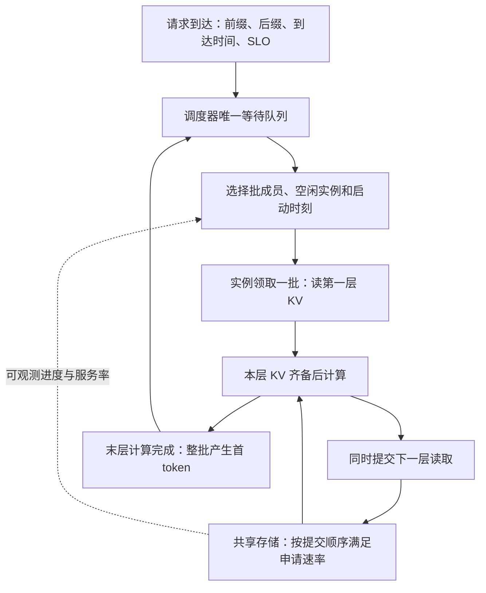

# 共享 KV 统一队列下的 Batch 效率与错峰调度形式化分析

| 项目 | 约定 |
|---|---|
| 研究问题 | 如何选择 batch 成员、领取顺序与启动时刻，协调多个推理实例的计算和共享 KV 读取 |
| 队列架构 | 调度器维护唯一等待队列；实例无本地等待队列，完成一批后再领取一批 |
| 存储纪律 | 按读取提交顺序先满足申请速率，剩余带宽继续分给后续读取，即 FCFS 按需分配 |
| 主目标 | 分别最小化全部完成时间 M、最大化 TTFT SLO 满足率、最小化平均 TTFT、最小化平均归一化 TTFT |
| 配套指标 | NPU Compute、I/O STALL、Idle；共享存储带宽利用率；分组与尾部时延 |
| 研究边界 | 完整 prefill 批、单实例单活动批、执行前不读取、执行中仅下一层 lookahead |
| 文档性质 | 独立的问题分析、形式化模型、复杂度论证和后续实验设计；算例为假设参数下的解析验证 |
| 前序文档 | [共享 KV 三层协同调度与全局指标分析](共享KV三层协同调度与全局指标分析-20260909.md) |
| 日期与单位 | 2026-09-13；时间为秒，数据为十进制 GB，带宽为 GB/s |

**结论是：将存储规则固定为 FCFS、将请求集中排队之后，优化的核心变成全局组批与启动时序。它同时影响计算效率、批内同步等待和读取之间的先后关系。四个主目标一般没有共同最优解；一般问题是 NP-hard，但小规模离线问题仍可求有证书的全局最优，大规模在线问题可以用滚动搜索求解，并量化与最优值或下界的差距。**

## 1. 完整问题与本次修正

### 1.1 系统在做什么

多个推理实例使用同一个模型，访问同一份共享 KV 目录。请求有一部分前缀已经有可复用 KV，需要从存储取回；其余后缀需要计算。本文只研究从到达到产生首 token 的 prefill 阶段，不把结果直接解释为完整回答的生成吞吐。



调度器中的“队列”是待执行请求集合，可以按调度策略选取和重排。**存储 FCFS 约束读取的提交顺序，不要求请求调度器按到达顺序选批。** 实例完成当前批后，才能原子地从中央队列取走新批。空闲实例也可以暂缓领取，此时请求仍在中央队列，不能暗中把下一批的数据预取进实例。

错峰有三种手段：改变同批成员，改变哪个批先领取，以及改变领取时刻。目标不是让所有读取串行，也不是尽量减少活动实例数。当计算可掩盖 I/O、各流申请率能被共同满足时，并发恰好可以更好地使用资源。

### 1.2 对前序分析修正了什么、为什么

| 前序讨论范围 | 本文调整 | 原因和影响 |
|---|---|---|
| 路由、本地排队、未执行请求改派 | 统一等待、执行时才绑定实例 | 消除“已派发但未执行”状态，改派和 work stealing 不再是主模型动作 |
| 实例内排序与组批 | 中央调度器选批，实例执行既定批 | 批的选择能看到所有待执行请求，不再受本地候选集限制 |
| 可比较公平、大小优先、依赖感知等存储规则 | 固定 FCFS 按申请速率分配 | 存储优先级不再是优化变量；原文公平共享时间线不能直接复用 |
| batch 效果用一般函数描述，示例用线性时间 | 展开 token、attention、内存、形状与效率模型 | 区分真实计算收益和单纯延长同步窗口的收益 |
| 用不同指标说明局部动作的外部影响 | 对每个目标写出条件最优代价和可实现的预测代价 | 明确什么是全局代价，以及预测只是近似的地方 |
| 原文列举可行计划，不宣称最优 | 增加逐目标复杂度证明、精确求解条件与 gap 定义 | 区分“难以大规模求解”和“无法找到任何全局最优” |

原文 §3.3 已给出平均 TTFT 的动作增量，不能说原文只有 M 的定义；本文将四个目标和利用率目标完整展开。原文算例中“某种错峰更好”的数字只在其公平共享服务模型下成立，不是本文 FCFS 模型的实验结论。

对应仓库既有的 [Scheduler–Engine 机制映射](五工作的Scheduler-Engine修改与主流默认实现-20260904.md)，这里将 D1 的执行时选实例和 D2 的准入/组批统一放在中央调度器；D4 的取数规则、D5 的完整 prefill 执行能力固定。本文不重新定义已有论文基线，也不据此宣称某个现有产品默认采用本架构。

### 1.3 所有策略共用的能力边界

- 同构实例、固定模型和并行配置，每实例同一时刻仅一个活动批。活动期间包括等待本层 KV 的时间，不能利用 STALL 偷接第二个批。
- 无 worker 本地缓存命中优势；固定 KV 放置与选源；不做跨请求读取去重、主动重算、复制或迁移。每个请求需要的读取字节在比较中固定。
- 本层整批 KV 齐备后，才开始本层计算；当前层计算开始时，提交下一层读取。第一层无前置计算可掩盖，下一批不能提前读取。
- 完整批的成员固定到最后一层，最后一层完成后一起产出首 token。实际引擎若支持拆批、成员提前完成或 chunk，须作为另一组共同能力重新建模。
- 固定请求数上限、token 上限、内存可行性检查和申请速率规则。不能给一种策略更大的批容量或更激进的速率申请权限。
- 基础离线问题执行完全部请求；基础在线实验不丢弃超期请求。若引入拒绝，拒绝请求计入到达分母并视为 SLO 失败，服务策略另行声明。

按层等待本层 KV 并触发下一层异步加载，可参考 Mooncake §5.2；中央队列、单活动完整批、无批间预取和 FCFS 是本文附加的研究约束，不是对 Mooncake 全部实现的描述。[Mooncake 原文](https://arxiv.org/html/2407.00079v4#S5.SS2)

## 2. Batch 具体怎样影响计算效率

### 2.1 “长短”和“batch 大小”都不只一个维度

设请求 i 命中前缀长度为 h_i，尚需计算的新 token 数为 u_i，主模型取 u_i≥1。完全缓存命中的请求若仍需一次末 token forward，应先按其真实执行方式转换为相应工作量。对批 β 定义

$$
n_\beta=|\beta|,\qquad
N_\beta=\sum_{i\in\beta}u_i,\qquad
A_\beta=\sum_{i\in\beta}\left(u_ih_i+\frac{u_i(u_i+1)}2\right).
$$

N 是线性层需要处理的新 token 数；A 是稠密因果 attention 中有效 query–key 配对数。每个新 query 访问已有前缀和不晚于自己的后缀 token，不同请求之间不存在交叉 attention。该配对式为本文的工作量推导，头数和维度等系数另行计入。滑窗、稀疏注意力等应替换此项，不能直接套用。

若每层每个命中 token 的 KV 字节系数为 κ_ℓ，则

$$
v_{i\ell}=h_i\kappa_\ell,\qquad V_{\beta\ell}=\sum_{i\in\beta}v_{i\ell}.
$$

对于常见 K/V 同精度、同维度结构，κ_ℓ 可按 `2 × KV头数 × head_dim × 每元素字节数 / 10^9` 计算；压缩、量化或其他 KV 布局使用实际字节数。

| 变化 | 对计算的影响 | 对远端存储的影响 |
|---|---|---|
| 请求数增加，同时 N 增加 | 线性层矩阵变大，工作量和并行度同时增加 | 新成员的命中 KV 增加读取量 |
| 请求数增加，但 N 不变 | 线性层主体规模接近，attention 与元数据开销仍可能不同 | 由命中前缀总量决定 |
| 命中前缀很长、后缀很短 | 新 token 少，但每个 query 的上下文长 | 可能读多算少 |
| 命中前缀很短、后缀很长 | 线性层和后缀 attention 工作较多 | 可能读少算多 |
| 总 token 相同，长度分布不同 | attention 配对数、kernel 形状和同步关系不同 | 还需单独比较 h 的分布 |

例如 h=0 时，1 个 1024-token 请求有 524800 个配对；4 个各 256-token 请求合计 131584 个配对。二者线性层 token 数相同，attention 工作量却相差约四倍。因而不能用“batch=4”或“总输入长=1024”之一包办性能估计。

### 2.2 计算收益从哪里来，何时停止增长

多个请求的新 token 可以沿矩阵的 token 维合并，共用模型权重进行线性层计算。小矩阵可能受到权重 HBM 访问、kernel 启动和并行度不足限制；增大矩阵后，每 token 成本可能下降。矩阵足够大时，硬件趋于饱和，再增加 token 主要使整批计算时间变长。矩阵维度和 tile 数量还会造成局部不平滑，不能假设批越大效率越高。[NVIDIA 矩阵乘指南](https://docs.nvidia.com/deeplearning/performance/dl-performance-matrix-multiplication/index.html)、[全连接层指南](https://docs.nvidia.com/deeplearning/performance/dl-performance-fully-connected/index.html)

prefill 一次就处理多个 token。Sarathi-Serve 的实验指出，完整 prefill 在单请求时就可能接近算力饱和，decode 则往往更依赖多请求 batching。其 token 预算讨论同时指出小块开销和 tile 形状影响。本文据此保留“单请求已饱和”的场景，不把 GPU 测得的饱和阈值或 decode 的加速倍数直接套到 NPU prefill。[Sarathi-Serve §3.1、§4.3](https://arxiv.org/html/2403.02310v2)

**HBM 带宽与共享 KV 存储带宽是两个资源。** 前者在计算 kernel 内部影响耗时，后者决定远端 KV 何时就绪。即使远端读完，attention 仍需访问设备内的 KV；不能把远端读取字节和所有 HBM 访问字节当成同一个量。

### 2.3 长短混合是否导致 padding 浪费

这取决于实现。padded 布局可能将短序列补到批中最大长度，产生无效计算和额外内存占用；packed/变长布局可以消除这部分填充。TensorRT-LLM 的 attention 文档明确区分这两种布局。[TensorRT-LLM Padded and Packed Tensors](https://nvidia.github.io/TensorRT-LLM/advanced/gpt-attention.html)

因此，本文不能普遍采用 `n_β × 最长请求长度` 作为计算工作量。使用 packed profile 时，应按真实 token 和 attention 形状计量。但 packed 也不自动取消批同步：一个短成员所需工作较少，仍可能要等完整批的本层 kernel 和最后一层完成才返回。

### 2.4 应该测量什么，而不是预设一个加速倍数

定义批在实例 w、第 ℓ 层的计算时间

$$
c_{\beta\ell}=g_w(\{h_i,u_i\}_{i\in\beta},\ell,\text{布局、精度、并行配置}).
$$

g 以目标 NPU 上的无远端等待 profile 为依据。下面只是拟合思路，不是已验证的硬件公式：

$$
c_{\beta\ell}\approx t_{\rm launch}
+\max\!\left(\frac{F_{\rm linear}}{P_{\rm linear}\eta_{\rm linear}},
             \frac{D_{\rm HBM,linear}}{B_{\rm HBM}}\right)
+\max\!\left(\frac{F_{\rm attn}}{P_{\rm attn}\eta_{\rm attn}},
             \frac{D_{\rm HBM,attn}}{B_{\rm HBM}}\right)
+t_{\rm other}.
$$

线性层 FLOPs 与 N 相关，attention FLOPs 与 A 相关；效率 η 随形状变化。算子有顺序依赖，因此这里将两部分耗时相加，而不是把全模型 FLOPs 与访存放进单一 max 后当成精确时长。

至少报告以下三个量：

$$
G_{\rm batch}(\beta)=
\frac{\sum_{i\in\beta}\sum_\ell c_{\{i\}\ell}}
     {\sum_\ell c_{\beta\ell}},\qquad
E_{\rm token}(\beta)=\frac{N_\beta}{\sum_\ell c_{\beta\ell}},\qquad
C_\beta=\sum_\ell c_{\beta\ell}.
$$

G 表示相对逐请求执行节省了多少设备计算时间；E 表示单位计算秒处理多少新 token；C 表示本批占用计算多久。G>1 不保证某个短请求更早完成，也不保证整个集群 M 更小。

profile 应覆盖请求数、h/u 组合、同类与混合长度、不同 token 总量及内存接近上限的形状；保存重复测量误差，留出未参与拟合的批形验证预测。没有目标 NPU 的测量时，可先用线性、饱和收益、padding 惩罚等假设模型扫描，但只能给出条件结论。

## 3. Batch 怎么设、为什么设

### 3.1 设的是可行域和选择规则，不是必须等满的固定人数

一个合法候选批至少满足

$$
1\le |\beta|\le N_{\max},\qquad
\sum_{i\in\beta}u_i\le T_{\max},\qquad
\operatorname{MemPeak}_w(\beta)\le H_w^{\rm available}.
$$

内存峰值包括权重、计算 activation、KV、接收缓冲和通信 workspace；需要保留的 KV 不会因为当前层算完就自动释放。单层 lookahead 也不意味着总内存只需两层 KV。实际执行的保留规则必须进入容量检查。

此外可设最大等批时间 W_batch、预测批时长预算 C_max 和最老请求保护规则。前两个容量上限是能力约束，后几个通常是策略控制参数，比较时应明确各自身份。SLO 可行性可以用 `预测 F_i≤d_i` 筛选候选，但在无法全部按时的场景必须有回退规则，不能因此把请求永久留在队列。

实际 token 预算参数的例子可见 vLLM 的 `max_num_batched_tokens`，但该文档讨论包含 decode 的迭代调度；本文完整 prefill 批的 token 预算与其默认执行策略不能混同。[vLLM Optimization and Tuning](https://docs.vllm.ai/en/stable/configuration/optimization/#chunked-prefill)

**上限不等于目标大小。** 低到达率、短 SLO 或只有一个合法请求时，可以直接发不满批；高负载下再从待执行集合里选取能获得计算收益、又不过度放大同步等待的批。若一个请求自身超过硬 token 上限，主模型须事先限制输入域，或明确共同的 singleton 特例；不能在完整批实验里悄悄改成 chunk。

### 3.2 参数如何确定

1. 根据内存峰值和模型限制确定硬容量，保证单请求合法且至少有可行调度。
2. 测量单位 token 时间随 N 和形状的曲线，找到收益趋平的区域，形成若干候选预算，不追求单个最大值。
3. 对当前请求计算剩余 SLO 余量 `d_i−t−预测剩余服务时间`。等批要付出真实时间，不能重置到达时间。
4. 在候选预算内同时生成单请求批、同类批和读算互补批，用全局预测比较。必要时给空闲实例设置一个短的下次唤醒时刻。
5. 用训练负载选预算和搜索宽度，用独立种子、长度组合和带宽条件检验；不把某条测试 trace 的最优参数作为通用配置。

设置这些约束的好处分别是防止容量溢出、控制单批占用时间、限制等批延迟和保证搜索开销可控。batch 的计算收益来自实际执行形状，设置一个更大的上限本身不会产生收益。

### 3.3 Chunk 是后续扩展

完整批将成员绑定到最后一层；chunk 把长请求拆成可重新调度的块，可能缩短短请求等待，但会增加调度次数，并改变历史 KV 保留、重读和 attention 成本。Sarathi-Serve 的 stall-free 指保护生成中的请求不被新 prefill 暂停，不代表本文的存储 I/O STALL 自动消失。[Sarathi-Serve §4](https://arxiv.org/html/2403.02310v2#S4)

首轮先固定完整批检验存储竞争，再将 chunk 作为所有策略共同拥有的能力消融。否则无法判断收益来自错峰决策还是更细的抢占/执行边界。

## 4. FCFS 按需分配必须精确到可复现

### 4.1 申请速率与实际分配速率

令 B(t) 为共享存储当前可供本业务使用的带宽，已提交但未完成的读取流按提交顺序排列为 f₁,…,f_k。q_f(t) 是引擎申请速率，b_f(t) 是实际获得的速率，则

$$
b_{f_j}(t)=\min\left\{q_{f_j}(t),
\left[B(t)-\sum_{h<j}b_{f_h}(t)\right]_+\right\}.
\tag{1}
$$

这就是本文固定的存储服务纪律。例如 B=4，三个流按顺序申请 1、4、2 GB/s，实际获得 1、3、0 GB/s。第一个流结束后，其余两个得到 4、0。若三个申请都是 1，则各得 1，剩余 1 GB/s 保持空闲。

因此它不是公平共享，也不总是“一次只传一个读取”。它在申请上限内工作守恒：

$$
\sum_f b_f(t)=\min\left(B(t),\sum_f q_f(t)\right).
$$

如果要求“申请率都已满足之后，剩余带宽仍继续超额给流”，那是另一种带宽纪律；本文按题设把申请率作为该流当前服务上限，不增加超额分配步骤。

### 4.2 FCFS 并未自动定义“按需”中的 q

只写 FCFS 而不规定申请率，问题仍不完整。本文为主模型选择以下统一的、确定的规则，便于解析和仿真实现：

| 读取阶段 | 申请规则 |
|---|---|
| 第一层读取 | 申请连接允许的最大速率 q_max，因为没有前一层计算可掩盖 |
| 下一层读取刚提交 | 当前层预计计算时长为 c，初始申请 `min(q_max,V_next/c)` |
| 消费时刻之前 | 保持初始申请率，存储按式 (1) 尽力满足 |
| 到当前层计算结束仍未读完 | 将申请提升到 q_max，补齐缺失数据，保留原 FCFS 序号 |
| 读取完成 | 删除活动流，立即重分配带宽 |

当 c=0 时直接使用 q_max；V=0 时立即视为已就绪，不建立消耗带宽的流。q_max 是连接能力上限，与当前背景负载扣除后的 B(t) 分开定义。初始 `V/c>q_max` 表示仅靠该窗口就已无法完全隐藏 I/O，不能伪造无 STALL 的承诺。

本规则的好处是申请率在有限事件之间固定，逾期后不会永远低速补读；代价是受阻后到消费截止前不会主动补偿早先缺口。另一种可部署规则是定期按 `剩余字节/剩余窗口` 更新，并在到期后申请 q_max。它需要固定更新周期、速率上限和零分母处理，应作为单独的申请协议敏感性实验，不能只让优化策略使用它。**本文中 q 由统一引擎协议生成，不是调度器可以任意优化的独立变量。**

即使以无 STALL 为目的申请带宽，这个局部就绪时刻也不等于请求的 SLO 截止。存储不根据请求 SLO 重排已经提交的流。

### 4.3 服务粒度和同刻事件顺序

主模型每个“批 × 层”提交一个聚合读取流，字节数是成员读取量之和，无跨请求去重。真实系统若按请求/对象分别提交，必须展开成多个流并固定批内提交顺序；按流 FCFS 对聚合粒度敏感，不能假设与聚合批完全等价。

同一时间点的确定性顺序规定为：处理读取与计算完成，启动已经满足依赖的本层计算并提交下一层读取，再由中央调度器向空闲实例派发新批，最后更新到期申请率并重新分配带宽。此前已提交的流始终保留原顺序。同阶段的多个新流按实例编号、层号等固定键赋序，不把平局顺序另开为优化权限。

这允许调度器通过稍晚领取改变新读取进入序列的位置，但不能撤销重提旧读取以改变优先级，也不能为尚未执行的批占用 FCFS 序号。

## 5. 形式化调度模型

### 5.1 输入、决策变量与中央队列

给定非空请求集合 I、实例数 m≥1、层数 L≥1，连接上限 q_max>0。每个请求包含到达时间 a_i、TTFT 阈值 s_i、绝对截止 d_i=a_i+s_i、各层读量 v_iℓ 和计算画像。固定参考 TTFT 为 T_i⁰>0，定义见 §6。

离线调度 σ 选择完整批集合 P、每批实例 w_β 和领取/启动时间 u_β，满足

$$
\bigcup_{\beta\in P}\beta=I,\qquad
\beta\cap\gamma=\varnothing\ (\beta\ne\gamma),\qquad
u_\beta\ge\max_{i\in\beta}a_i.
\tag{2}
$$

所有批满足 §3 的容量条件。在 t 时刻中央队列是

$$
Q(t)=\{i:a_i\le t,\ i\text{ 尚未被某个已启动批领取}\}.
$$

离线计划可以列出未来“哪个批由哪个实例执行”，这只是计划表示，不意味着提前将请求从中央队列取走。在线实现仅在实际领取时原子删除成员，保证每个请求只有一个执行所有者。

### 5.2 读取、计算与完成时间

对批 β、第 ℓ 层，读取提交、读取完成、计算开始、计算结束分别记为 A_βℓ、R_βℓ、C_βℓ、Z_βℓ。设 Z_β0=u_β，则

$$
A_{\beta1}=u_\beta,\quad
A_{\beta,\ell+1}=C_{\beta\ell},\quad
C_{\beta\ell}=\max(R_{\beta\ell},Z_{\beta,\ell-1}),\quad
Z_{\beta\ell}=C_{\beta\ell}+c_{\beta\ell}.
\tag{3}
$$

读取剩余字节 r_βℓ 满足

$$
r_{\beta\ell}(A_{\beta\ell})=V_{\beta\ell},\qquad
\frac{dr_{\beta\ell}}{dt}=-b_{\beta\ell}(t),\qquad
R_{\beta\ell}=\inf\left\{t\ge A_{\beta\ell}:\int_{A_{\beta\ell}}^t b_{\beta\ell}(x)dx=V_{\beta\ell}\right\}.
\tag{4}
$$

剩余字节微分式只在读取活动期间适用；读取完成后令该流 r=b=0。b 必须由式 (1) 和 §4.2 的 q 规则产生，不能由优化器自由选择。没有合法提交之前，积分服务量为零。

同一实例的任意两个活动区间不能重叠：

$$
w_\beta=w_\gamma\Longrightarrow
[u_\beta,Z_{\beta L})\cap[u_\gamma,Z_{\gamma L})=\varnothing.
\tag{5}
$$

注意这是“启动读取到整批结束”的区间不重叠，仅禁止计算区间重叠是不够的。完整批成员的完成时间为

$$
F_i=Z_{\beta L},\qquad T_i=F_i-a_i\quad(i\in\beta).
\tag{6}
$$

给定合法 σ、确定的 g、B(t)、速率规则及平局顺序，式 (1)–(6) 定义了全局执行轨迹。每个请求的服务时间是该轨迹的结果，不是一个与其他实例无关的固定输入。

### 5.3 等待、计算、STALL 的分解

批的纯计算时间和设备 I/O STALL 分别为

$$
K_\beta=\sum_{\ell=1}^L c_{\beta\ell},\qquad
S_\beta=(C_{\beta1}-u_\beta)
+\sum_{\ell=2}^L(C_{\beta\ell}-Z_{\beta,\ell-1}).
$$

无其他控制开销时，有

$$
F_i-a_i=(u_\beta-a_i)+K_\beta+S_\beta.
\tag{7}
$$

第一个括号就是中央队列等待，包含等批与暂缓领取。K_β 是整个同步批的计算时间，不能再除以批人数来充当某个成员实际经历的 TTFT。读取在计算中进行时不增加设备 STALL；只有计算依赖尚未满足的空档才计入。

### 5.4 优化问题

记所有满足式 (1)–(6) 的调度为 S。四条独立优化线为

$$
\min_{\sigma\in S}M(\sigma),\quad
\max_{\sigma\in S}A_{\rm SLO}(\sigma),\quad
\min_{\sigma\in S}\bar T(\sigma),\quad
\min_{\sigma\in S}\bar R(\sigma).
\tag{8}
$$

连续问题以下用“最小化”表示求下确界；只有下确界由可行调度取得时才称存在最优解。有限候选和有限时间网格的非空问题一定能取得最优值。基础离线分析假定输入存在全部请求有限完成的可行调度；若带宽永久不可用等条件使其不可行，应先报告不可行。

如果必须给出一个运营方案，可以采用词典序目标，如先最大化满足率，再在并列方案中最小化归一化 TTFT；也可以采用 ε 约束，如在 `A_SLO≥η` 下最小化平均 TTFT。约束不可行时需明确报告。任意加权和会引入业务权重与单位选择，而且不一定覆盖离散可行域中的全部 Pareto 解。

## 6. 各目标下“一个动作的全局代价”怎样定义

### 6.1 先统一指标口径

对相同的 n 个请求和固定观测起点 t₀，定义

$$
M=\max_iF_i-t_0,\qquad
A_{\rm SLO}=\frac1n\sum_i\mathbf1[F_i\le d_i],
$$

$$
\bar T=\frac1n\sum_i(F_i-a_i),\qquad
\bar R=\frac1n\sum_i\frac{F_i-a_i}{T_i^0}.
\tag{9}
$$

T_i⁰ 在比较开始前固定为该请求独占同类实例、完整基准存储带宽时，使用相同层间流水和申请规则所得的单请求 TTFT。它不能随策略拥塞、组批或背景带宽变化而重新放宽。batch 可能比单请求执行更高效，因此 T_i⁰ 不一定是可证明的最优下界，T_i/T_i⁰<1 并非必然错误。

平均归一化 TTFT 是按 `1/T_i⁰` 对实际时延加权，不等于“平均 TTFT 除以平均参考 TTFT”。短请求的同一秒延误通常占更大权重。固定阈值 `s_i=s` 与相对阈值 `s_i=αT_i⁰` 都需比较，且恰好在截止时间完成算满足。

### 6.2 全局代价的严格定义与在线近似

在状态 X_t 下，一个动作 α 可以是“现在向若干空闲实例发哪些互不重叠的批”，或“暂缓领取到下次决策”。它不修改已活动批或已提交读取的顺序。

将目标全部转为最小化形式：J_M=M，J_SLO=1−A_SLO，J_T=平均 TTFT，J_R=平均归一化 TTFT，J_U=−U。若离线未来已知，严格的动作价值为

$$
Q_J^*(X_t,\alpha)=
\inf_{\sigma\in S(X_t,\alpha)}J(\sigma),\qquad
\Delta_J^*(\alpha;\alpha_0)=Q_J^*(X_t,\alpha)-Q_J^*(X_t,\alpha_0).
\tag{10}
$$

S(X_t,α) 固定过去和当前动作，只优化之后的合法调度。它保留已完成请求的贡献；改变最后完成时间时，也不能忽略过去已完成的尾部。这个定义准确，却可能与完整优化问题一样难算。

可实现的方法是在两条分支中使用同一个后续策略 π 和同一组情景，模拟全部相关活动批及待执行请求，得到预测完成时间 F̂_i^α 和 F̂_i⁰，再比较 J。该值应称“相对于后续策略 π 的全局预测代价”，不能称为 Q*。如果只看有限窗口，要给未完成请求加统一的终端成本；不能让暂缓所有请求因窗口内没有失败或完成样本而获得虚假最优。

在线状态仅包含已到达请求、活动进度及可观测服务反馈。预测未知到达可以用共同的统计模型，不能使用当前在线策略看不到的未来 trace。每次预测在窗口内求到最优，也不意味着整条未来 trace 最优。

### 6.3 四种主目标的动作增量

设 Δ_i=F̂_i^α−F̂_i⁰。比较使用同一请求集合和固定分母 n，以下增量小于零表示改善：

| 目标 | 动作的全局预测增量 | 实际关心什么 |
|---|---|---|
| 最小 M | `max_i F̂_i^α − max_i F̂_i⁰` | 是否缩短最后完成时间；不能用 `max_i Δ_i` 替代 |
| 最大 SLO 满足率 | `(1/n)Σ_i(1[F̂_i^α>d_i]−1[F̂_i⁰>d_i])` | 新增失败数减去挽救的请求数 |
| 最小平均 TTFT | `(1/n)Σ_i Δ_i` | 所有请求提前和推迟的秒数之和 |
| 最小平均归一化 TTFT | `(1/n)Σ_i Δ_i/T_i⁰` | 按各请求参考时间加权后的提前和推迟 |

每个和式都必须包含其他实例被波及的请求及中央队列中被推迟的请求。候选新批自身的收益只是其中一部分；释放时刻变化还会影响尚未提交的后续层读取，需要重新模拟，而不是在旧的 I/O 时长上加减固定数值。

SLO 是阶跃目标。让一个已过期请求从 20 秒提前到 15 秒，若 deadline=10，主目标收益仍为零；让另一个请求从 10.1 提前到 10，才挽救一个按时完成。为便于搜索，可使用超期量或成功概率作为次级目标，但必须报告真实满足率。存在预测误差时，可用 `E[A_SLO]=(1/n)Σ_i P(F_i≤d_i)`；是否独立不影响期望线性相加，但模拟共享竞争时应保留相关性。

### 6.4 若目标改成最大 NPU 利用率

在统一窗口 [t₀,t₀+H] 中定义设备时间总量 K、S、I、O，分别表示 Compute、I/O STALL、Idle 和其他开销：

$$
K+S+I+O=mH,\qquad U=\frac K{mH}.
\tag{11}
$$

有活动批但缺本层数据计 STALL；无活动批，包括有中央积压却主动等批，计 Idle。多 NPU 实例按设备秒加权。这里 U 是有效 prefill kernel 所处时间的占比，不等于硬件 FLOPs 利用率。

如果窗口固定，动作增量为

$$
\Delta J_U=-\frac{K^\alpha-K^0}{mH}.
$$

如果观察到全部请求完成，H=M，且 K⁰、M⁰ 分别变化 ΔK、ΔM，则

$$
\Delta J_U=
\frac{K^0\Delta M-M^0\Delta K}
{mM^0(M^0+\Delta M)}.
\tag{12}
$$

只有 K 对所有候选调度不变时，最大化 U 才等价于最小化 M；此时也等价于最小化总 STALL+Idle+Other，不能只最小化 STALL。batch 改变计算效率时，K 本身会变，必须使用式 (12)。例如同一工作量从 `(K,M)=(12,8)` 改进到 `(8,6)`，两实例的忙碌占比从 75% 降到 66.7%，但全部完成时间反而更短。

若目标真的是算力效率，更有意义的辅助量是固定有效 FLOPs 除以设备峰值与时间，或固定请求集合的有效 token/s。增加 padding 或选择低效 kernel 不能算额外的有用工作。本文推荐以四个请求级目标为主，Compute/STALL/Idle 用来解释因果，不单独追求“更忙”。

### 6.5 存储利用率与有限/长期窗口

$$
U_{\rm storage}=
\frac{\int_{t_0}^{t_0+H}\sum_fb_f(t)dt}
{\int_{t_0}^{t_0+H}B(t)dt}.
\tag{13}
$$

分母为零时记为不可定义。另可报告物理链路利用率，以区分背景负载与本业务，但不要与式 (13) 混用。若固定字节全部读完、B 恒定且 H=M，则 U_storage=总字节/(BM)，它与 M 不独立。较低利用率可能因为数据已按需提前就绪、尚未释放下一层读取或等待请求到达，并不自动意味着带宽调度失效。

有限工作集的完成吞吐为 n/M。长期在线负载则应固定到达率，统计稳定队列、SLO 满足率及统一稳态窗口内的资源占比；通过扫描到达率才得到满足率目标 η 下的稳定容量。稳定开环、请求全部执行且每请求计算工作固定时，U≈λE[K_i]/m，改善排序不一定改变长期计算占比。batch 改变 E[K_i] 时要重新计量。

时延统计按固定到达 cohort 排空，不能只平均窗口内碰巧完成的请求。过载无法排空时报告积压、超时和截断；若采用拒绝，均值的条件和拒绝惩罚另行写清，不能用删掉慢请求后的均值代替全部输入的性能。

## 7. 长短混批：带宽需求下降与短请求延迟的具体关系

### 7.1 下降的是速率需求，不是数据量

设长、短请求下一层读量为 v_L、v_S，单独执行当前层时长为 c_L、c_S，混批时长为 c_LS。在整批同步、下一层共同消费的模型下，短成员的无 STALL 需求率可归因为

$$
q^{\rm need}_{S,solo}=\frac{v_S}{c_S},\qquad
q^{\rm need}_{S,mixed}=\frac{v_S}{c_{LS}}.
$$

当 c_LS>c_S 时，短成员的这个需求下降；总批需求从两个独立窗口的速率之和，变为一个共同窗口的需求：

$$
q^{\rm need}_{LS}=\frac{v_L+v_S}{c_{LS}},\qquad
q^{\rm need}_{LS}<\frac{v_L}{c_L}+\frac{v_S}{c_S}
\Longleftrightarrow
c_{LS}>\frac{v_L+v_S}{v_L/c_L+v_S/c_S}.
\tag{14}
$$

右侧只是窗口需求比较，不等于任意时刻都存在那两个独立流，也不等于实际 b 一定下降。真实服务还要经过 FCFS、连接速率上限和到期补读规则。第一层无覆盖窗口，不能用此式声称启动读取也更轻。

一个容易忽略的方向是：**batch 计算加速越强，当前层越快完成，下一层就需要更高的读取速率才能跟上。** 计算效率提升可能将瓶颈转移到存储。不能把“合批节省计算秒数”和“合批降低每秒带宽需求”同时设为无条件收益。

### 7.2 一个可手算的短请求反例

两层、B=q_max=4。每层长请求读 4 GB、算 2 秒；短请求读 1 GB、算 1 秒；混批每层读 5 GB、算 3 秒，刻意采用无计算加速的线性批模型。所有请求从 t=0 计时。

短请求单独执行时，第一层读 0.25 秒，第二层读取以 1 GB/s 藏在第一层的 1 秒计算里，故参考 TTFT 为 2.25 秒。混批独占资源时，第一层读 1.25 秒，第二层以 5/3 GB/s 藏在 3 秒计算里，整批 TTFT 为 7.25 秒。

短成员的下一层需求从 1 降到 1/3 GB/s，但它的字节数仍为每层 1 GB，TTFT 从 2.25 增加到 7.25 秒。若短请求阈值为 6.75 秒，它从满足变为失败。这是同步绑定的局部对照，尚不能代替执行同一完整请求集合的全局比较。

准确表述应是“短请求 TTFT 可能增加，SLO 满足率可能下降”。SLO 阈值本身没有降低。若混批减少的中央等待或全局 STALL 足够多，也可能抵消同步损失，使短请求最终更早完成。

### 7.3 同一批四个请求在固定 FCFS 下的全局比较

为避免沿用原文公平共享的数字，重新构造四请求算例。两个 L、两个 S 都在 t=0 到达，两实例、两层、最大 batch=2；每请求参数沿用 §7.2。长请求参考 TTFT=5 秒，短请求=2.25 秒；阈值分别为 15 和 6.75 秒。整组共有 20 GB 读取、12 NPU·s 计算，全部计划使用 §4 的相同协议。

| 计划 | 中央调度器的领取决定 |
|---|---|
| P1 同类短批先提交 | t=0，实例 1 领 SS、实例 2 领 LL；SS 首层获得较早序号 |
| P2 同类长批先提交 | t=0，实例 1 领 LL、实例 2 领 SS；LL 首层获得较早序号 |
| P3 两个混合批 | t=0，两个实例各领 LS，实例 1 首层获得较早序号 |
| P4 短批启动后再领长批 | t=0 只领取 SS；t=0.5，SS 第二层提交后，空闲实例才领取 LL |

计划 P4 的 LL 在 0–0.5 秒仍位于中央队列，实例是 Idle，没有提前预取或保留本地等待批。

| 指标 | P1 | P2 | P3 | P4 |
|---|---:|---:|---:|---:|
| 两个 S 的完成时间（秒） | 5，5 | 6.5，6.5 | 7.770833，8.717014 | 4.5，4.5 |
| 两个 L 的完成时间（秒） | 10.75，10.75 | 10.25，10.25 | 7.770833，8.717014 | 11，11 |
| M（秒） | 10.75 | 10.25 | 8.717014 | 11 |
| 平均 TTFT（秒） | 7.875 | 8.375 | 8.243924 | 7.75 |
| 平均归一化 TTFT | 2.186111 | 2.469444 | 2.656375 | 2.1 |
| SLO 满足率 | 100% | 100% | 50% | 100% |
| Compute（NPU·s） | 12 | 12 | 12 | 12 |
| STALL（NPU·s） | 3.75 | 4.75 | 4.487847 | 3 |
| Idle（NPU·s） | 5.75 | 3.75 | 0.946181 | 7 |
| Compute 占比 | 55.81% | 58.54% | 68.83% | 54.55% |
| 存储带宽利用率 | 46.51% | 48.78% | 57.36% | 45.45% |


图中蓝色为 Compute，橙色为 STALL，灰色为 Idle；右侧带宽按两个实例叠加。红色点线是短请求 6.75 秒截止；每行在本计划的 M 处结束统计，之后的留白不计入 Idle。图来自上述假设参数的分数精度事件积分，逐批与全局设备时间、总读取字节均已核对。

P3 的两个完成时间精确为 373/48 和 5021/576 秒，表内小数四舍五入。这里的低存储平均利用率包含后续计算和尾部排空，不意味着有合法申请时违反 FCFS 按需服务。

P1 的完整关键时间线如下，可直接按字节和设备时间复核：

| 时间段 | 存储服务 | SS 实例 | LL 实例 |
|---|---|---|---|
| 0–0.5 | SS 第一层 4 GB/s | STALL | STALL |
| 0.5–2.5 | LL 第一层 4 GB/s；SS 第二层已提交但排在其后 | 算第一层 | STALL |
| 2.5–3 | SS 第二层到期后申请 4 GB/s，读完 2 GB | STALL | 算第一层 |
| 3–5 | LL 第二层 2 GB/s | 算第二层，5 秒完成 | 算第一层 |
| 5–6.5 | LL 第二层 2 GB/s | Idle | 算第一层 |
| 6.5–6.75 | LL 第二层剩余 1 GB，以 4 GB/s 补齐 | Idle | STALL |
| 6.75–10.75 | 无未完成读取 | Idle | 算第二层，10.75 秒完成 |

P1 中 `12+3.75+5.75=2×10.75`，存储传输量为 `2+8+2+7+1=20 GB`。P4 中 SS 第二层先于 LL 首层提交，申请 1 GB/s，LL 首层拿到余下 3 GB/s；于是 SS 无层间 STALL、4.5 秒完成，LL 首层在 0.5–2.5 秒拿到 3 GB/s、在 2.5–3 秒拿到 4 GB/s，因而到 3 秒才完成，最后在 11 秒结束。

这些计划支持三个独立结论：P3 的 M 最小但短请求全部超期；P2 相比 P1 缩短 M，却增加平均及归一化 TTFT；P4 减少 STALL、改善两种均值，却增加 M 并降低 Compute 占比。**不能只按 STALL 最少、带宽最满或长短混合与否选策略。** 四个计划未穷举全部候选批和启动时间，不宣称其中任何一个是全局最优。

## 8. 是否为 NP-hard：逐目标说明

### 8.1 复杂度针对什么输入规模

讨论一般离线问题：请求数、实例数、到达时刻和请求工作量可以变化；数值为有限编码的有理数，g 可通过明确公式或可在多项式时间查询的已给定画像得到。不能把任意成本计算黑箱的复杂度藏进“调度复杂度”。

下面的归约使用这个问题族的子问题：batch 上限为 1、单层、读取量为 0。因此 FCFS 规则自动满足，中央队列仍按实例空闲时领取。读取为 0 对应无可复用前缀。证明说明**一般问题至少如此困难**，不说明固定八个请求或某一份 NPU profile 也具有同等最坏情况复杂度；若另外强制每请求有正读取且 m 固定，需要重新证明对应子类。

### 8.2 最小化 M：强 NP-hard，实例数作为输入

从 3-PARTITION 构造。给定 3m 个正整数 p_i，满足

$$
D/4<p_i<D/2,\qquad\sum_i p_i=mD.
$$

将它们变成 3m 个 t=0 到达的单请求批，计算时间 p_i，交给 m 个同构实例。问是否存在 M≤D 的调度。

如果能分成 m 组三元组、每组和为 D，就让每个实例依次领取一组中的三个请求，得到 M=D。反过来，若 M≤D，总计算量 mD 迫使每个实例都恰好处理 D；每个 p_i 位于 D/4 和 D/2 之间又迫使每实例恰好处理三个请求，因而得到原问题的三划分。这是多项式构造，所以一般 makespan 优化强 NP-hard。

如果实例数固定为 2，可由 PARTITION 得到普通 NP-hard，但不能把上面的强 NP-hard 原样搬过去。经典机器调度的复杂度体系参见 [Lenstra、Rinnooy Kan、Brucker，1977](https://ir.cwi.nl/pub/18051)。

### 8.3 最大化 SLO 满足率：强 NP-hard

沿用相同构造，并令所有请求的绝对截止为 D。存在 100% 满足的调度，当且仅当存在 M≤D 的调度。因此，即使只要求判断“最大满足率是不是 100%”，也能解决 3-PARTITION。

该结论不要求调度器丢弃失败请求：未按时的请求仍可在 D 之后执行，关键只是能否让所有请求在 D 前完成。一个实例、同时到达、固定处理时间的某些截止调度特例可能有高效算法，不与一般问题的硬度矛盾。

### 8.4 最小平均 TTFT：使用独立子问题证明

取单实例、单请求批、无读取，但允许不同到达时刻 a_i，则

$$
\sum_iT_i=\sum_iF_i-\sum_i a_i.
$$

到达时间之和是常数，所以它包含经典不可抢占的 `1 | r_i | ΣC_i` 问题，该问题为强 NP-hard。[Lenstra、Rinnooy Kan、Brucker，1977，Theorem 5，p.357](https://ir.cwi.nl/pub/18051/18051A.pdf)

到达时间和允许暂缓启动的前提很重要。若所有请求同时到达、单实例、固定独立处理时间且无存储和组批，SPT（短处理时间优先）即可最小化平均完成时间。不能从 M 的归约直接推断这一简单子问题也难。

### 8.5 最小平均归一化 TTFT：即使参考时间为单请求 p_i 也 NP-hard

同样取单实例、单请求批和无读取，参考时间按本文定义恰为 T_i⁰=p_i，则

$$
\sum_i\frac{T_i}{T_i^0}=\sum_i\frac{F_i-a_i}{p_i},
$$

这就是不可抢占、带释放时间的总 stretch 问题 `1 | r_i | ΣS_i`。Legrand、Su、Vivien 的论文 §5.1、Theorem 4 证明其判定版 NP-complete，采用 PARTITION 归约。因此本文归一化 TTFT 优化为 NP-hard；这里不将结论升级为强 NP-hard。[Minimizing the stretch when scheduling flows of divisible requests，2008](https://polaris.imag.fr/arnaud.legrand/articles/JoS-LSV08.pdf)

这个独立依据避免了“归一化就是加权，所以当然 NP-hard”的漏洞，因为本问题中的权重 1/p_i 并非任意可选权重。以上只给一般优化问题下界，不在未说明连续模型证书和验证复杂度时，把整个扩展问题直接称为 NP-complete。

### 8.6 利用率与在线问题需要额外限定

总 Compute 固定、窗口取 [0,M] 时，最大化 Compute 占比等价于最小化 M，因此继承该子问题的硬度。固定时间窗或可变 batch 效率下不再有这个等价，应按实际目标单独分析。

NP-hard 不意味着“小规模无法求最优”，也不意味着“绝不存在多项式算法”；通常的表述是在 P≠NP 假设下，不期望一般实例都有多项式时间精确算法。它同样不排除有近似保证的算法。

在线的困难还多一层：未来到达和带宽变化未知。即使计算无限快，非抢占的“现在启动长批”也可能被随后到达的紧急短请求反转。在线策略应与同信息条件的强基线比较，未来 trace 全知的离线最优用于衡量空间，不能混称可部署 Oracle。

## 9. 能否找到全局最优，怎样确认“接近最优”

### 9.1 小规模离线可以找，但必须明确所求解的空间

在全部输入已知、g 与 B 确定时，可以枚举批划分、实例分配和先后关系，并用分支定界或完整的数学规划搜索启动时刻。无限制的最坏情况运行时间可能指数增长，实际只能解决较小实例。

本文建议先建立有限候选批、有限启动时间网格和明确同刻事件规则的离线基准：在这个有限空间内完整枚举，或用可证明最优的整数约束模型求解。即便启动时间在网格上，FCFS 读取完成事件仍可在网格之间发生，评价器应积分到真实完成时刻；若执行过程也全部按时隙量化，则是另一套离散模型。

这些结果应标成“完整声明的候选集和时间网格内最优”。只搜索若干批模板、只允许现有事件点启动、有限宽度 beam 或搜索超时得到的可行解，都不能宣称连续时间全动作空间最优。尤其不能未经证明就假定最优启动只发生在其他批完成时。

连续时间也不是原则上无法求精确最优。采用 §4.2 的分段常数速率、有限层数、有限批集合时，可以对有限事件顺序和 FCFS 分配分支建模，结合积分关系做精确搜索。但必须处理相等时刻的固定顺序、严格先后关系、速率切换及有理时间；若出现只有趋近才能实现的分支，应区别最优值与下确界。本文没有给出完整连续求解器，也不承诺这一工程步骤已经完成。

### 9.2 求解器不能获得额外的存储调度权

只写 `Σb≤B`、计算 `NoOverlap` 和带宽 `Cumulative` 不足以表达本文问题；这会允许求解器自由分配带宽，得到另一个更宽松问题的最优解。

精确模型必须额外编码：每条读取的合法 release、FCFS 序号、活动集合、剩余字节、申请率和每个区段的式 (1)。在离散时隙模型中，也要对每个时隙按序满足申请，并守恒扣减字节。所得调度应由独立的同规则事件重放检查。把 FCFS 放宽成可任意服务可用于求下界，但应明确它只是松弛问题。

### 9.3 下界、可行解与证书

对于最小化目标，令 LB 是原问题的合法下界，UB 是可行调度的目标值，则

$$
LB\le J^*\le UB,\qquad
\text{相对证书差距}=\frac{UB-LB}{LB}\quad(LB>0).
\tag{15}
$$

若该比值≤ε，就能针对这一实例证明当前方案至多比最优值差 ε；如果 LB 很松，大 gap 不一定代表算法差。LB=0 时报告绝对差距。对满足率最大化，使用可行满足率 A_LB 与乐观上界 A_UB，报告 `[A_LB,A_UB]` 及百分点差距；在最优满足率为零的情形，乘法比值没有意义。

恒定 B 下，固定总读量 V_tot、请求都在 t₀ 之后到达时，可用 `M≥V_tot/B`。可变带宽则寻找满足 `∫[t₀,t₀+h] B(t)dt≥V_tot` 的最早时长 h。计算下界应写成 `M≥K_min/m`，其中 K_min 是所有合法批划分的总计算时间下界，**不能直接把单请求计算时间之和作为 K_min**，因为 batch 可能节省计算。

还可以在乐观模型中给每个请求求一个可证明的独立最早完成下界，汇总得到时延下界或可按时请求数上界。需要乐观放宽同步与竞争、允许最佳合法效率，不能不加证明地把参考 T_i⁰ 当成这种下界。

仅在受限候选空间算出的最优值，是对该空间最优的证书；对于完整空间，它仍只是一个可行解上界。扩大候选集、细化网格和搜索更久通常能改善参考值，但在 SLO 阶跃和 FCFS 平局敏感处，不能未经误差分析就声称连续问题的 gap 随网格宽度线性收敛。

### 9.4 哪些算法有现成近似保证

无读取、所有请求同时到达、batch=1、固定独立处理时间的同构机 makespan 子问题，可采用 LPT：按处理时间递减，将下一个请求计划给当前负载最小的实例。其经典比率为

$$
M_{\rm LPT}\le\left(\frac43-\frac1{3m}\right)M^*.
$$

这是 [Graham 1969](https://fanchung.ucsd.edu/ron/papers/69_02_multiprocessing.pdf) 对特定子问题的保证。计划可以在中央队列中保存，实例完成后再领取对应请求，不要求物理本地等待队列。

进入本文共享 FCFS 存储、多层释放和可变组批后，请求处理时间会受其他选择影响，LPT 的假设消失；SPT、EDF、最小 slack、读算比互补也没有因此获得本问题的通用近似比。本文不宣称不存在这样的算法，只是尚未建立这类保证。可采用启发式近似求解，再用小实例精确解、下界和实验检验是否接近最优。

## 10. 可实现的在线算法建议

### 10.1 采用候选组批与短视窗全局重放

每次请求到达、批完成、读取完成、可观测报价更新或暂缓定时器到期时，执行以下过程。多个空闲实例的批选择要联合评估，否则它们可能各自选择“局部看起来最好”却同时制造读取突发。

```text
输入：中央队列 Q、实例活动进度、存储可观测反馈、计算画像、主目标 J
1. 从到达序、短参考时间、最早截止、最小 slack 各取有限候选；包含最老请求。
2. 生成单请求批、长度相近批、读多算少与读少算多的互补批。
3. 过滤请求数/token/内存约束；保留不满批和必要的孤立执行候选。
4. 组合各空闲实例的互斥批选择，并加入有界暂缓动作。
5. 对每个动作，与固定基础动作使用相同后续策略和情景进行全局重放。
   所有分支继续执行已有批，按固定 FCFS 处理读取，估计队列中请求的完成时间。
6. 以所选目标的增量排序；用等待上限/老化保护和误差余量约束选择。
7. 只落实现在的领取动作；未来计划只是预测，后续事件到来时重新计算。
```

候选开始时刻可以包含立即、预计下一条关键读取完成、预计下一次层读取提交之后及若干短延迟网格点。这是压缩搜索空间的启发式，不是“事件点一定包含最优启动时刻”的定理。预计事件变化时应取消过时定时器并重新评估。

### 10.2 如何把“错开竞争”变成筛选信号

对当前可见的活动批和候选批，预测未来一小段时间内的读取提交和申请，构造

$$
D(t)=\sum_{f\text{ 预计在 }t\text{ 活动}}q_f(t),\qquad
\Omega=\int[D(t)-\widehat B(t)]_+dt.
$$

Ω 可用于筛掉明显制造竞争尖峰的候选，但不是主目标。它忽略了 FCFS 次序、短请求截止和批同步的离散后果；相同 Ω 可能对应不同 STALL 和 SLO。最终排序仍需使用 §6 的全局增量。已到期与即将消费的读如果被新批提前提交的首层读挡住，也应在重放中自然反映出来。

设候选动作数为 A、重放深度为 H 个批次、每批 L 层，则单个确定性重放的基础事件数约为 O(HL)，再加到达、带宽更新和定时器事件；队列与速率重分配产生额外开销。实际报告决策时延 P50/P95/P99，不能只比较不计控制成本的理想结果。

### 10.3 用局部搜索改进离线初解或滚动候选

从中央 FCFS、SPT、EDF 等初解出发，依次尝试跨批交换成员、拆批、合批、交换领取顺序和小幅改变启动时刻。每次改动都从受影响事件起重放共享竞争，只有主目标改善或满足声明的词典序规则才接受；已开始批不允许在线回退。

保持一个最佳可行方案，在计算预算用尽时输出它；使用多种初解减少陷入局部最优的概率。更宽的 beam、更多重启或更长窗口只能作为质量/开销选项，不能被称为全局最优保证。

### 10.4 信息一致性和防饥饿

普通策略读取存储报价、已报告服务率、完成反馈与元数据，不直接访问内部队列、未来带宽或 `hypothetical_*`。内部真值只用于资源模拟器和明确标记的 Oracle。若对计算预测引入误差，应给所有对照对称地提供同样的 GPU/NPU observable，不能仅让一方知道实际计算结束时刻。

区分三种参考：普通观测策略、当前资源状态真值但不知道未来 trace 的 Oracle、知道全部 trace 的离线参考。三者共享执行动作能力，信息优势另列。比较候选筛选损失时，再固定信息只改变候选集，避免把搜索优势误认为观测优势。

只优化满足率可能长期拖延已经无法挽救的请求；只优化归一化 TTFT可能长期拖延长请求。因此要报告最大等待，并可设置共同的老化优先级或最长准入等待规则。在过载下，硬等待上限本身可能不可行，必须报告违约，不能把它当成已证明的稳定性保证。没有请求到达且所有已知请求都可排空时，不允许无限期暂缓。

## 11. 后续实验设计和验收标准

本文完成研究与设计，不修改仿真器，也不将假设算例包装成正式多种子实验。进入实现时按仓库流程先实现不变量测试，再冒烟检查区分度，最后做全量实验与嵌图结果文档。

### 11.1 需要回答的未知问题

| 实验问题 | 控制变量 | 主比较与预期产物 |
|---|---|---|
| batch 的计算收益何时抵消同步损失 | g 的效率曲线、h/u 独立分布、布局 | 单请求、同类批、互补批的胜负边界 |
| FCFS 顺序怎样放大跨实例影响 | 首层读量、层数、连接上限、B、实例数 | 只变一个领取动作时，其他实例完成时间变化的分布 |
| 主动延迟领取是否值得 | 负载、SLO 紧度、允许延迟范围 | 区分真正减少请求时延与仅将 STALL 搬成 Idle |
| 计算加速是否将瓶颈转到存储 | 计算 profile 与 B 联合扫描 | 每层申请率、实际速率、到期补读及 STALL 时间线 |
| 四个目标冲突有多大 | 固定/倍数 SLO、长短比例 | M、满足率、两种均值的 Pareto 图和分组结果 |
| 全局预测离最优有多远 | 小实例规模、网格、候选数、窗口 | 每目标的最优证书或上下界、运行时间与 gap |
| 观测误差是否抵消收益 | 报价滞后、带宽变化、计算误差 | 相对强简单基线的净收益与决策开销 |
| 申请协议选择是否影响结论 | 固定申请后到期补读、周期追赶 | 在同一协议内部比较策略，再跨协议报告敏感性 |

同一场景使用 CRN，即相同种子生成相同请求 trace。g 的收益、读量和计算量不能永远正相关，至少覆盖读多算少、读少算多和两者都大的请求。先在假设 g 上定位机制，再在实测 g 上验证可迁移性。

### 11.2 基线与能力消融

主比较中的所有策略都采用中央队列和同一个 FCFS 存储实现。基线包括中央到达序贪心填批、固定参考时间 SPT 填批、EDF/最小 slack 填批、读算互补贪心，以及上述全局重放。统一请求数/token/内存约束，并对是否允许暂缓做共同设置。

先固定允许的单请求/同类/混合候选能力，比较局部评分与全局评分、历史观测与实时观测；再单独做 batch=1、禁止混批、禁止暂缓、加入 chunk 的能力消融。更改 FCFS 为公平共享属于存储协议实验，应单独标记，不能作为主算法暗含的额外权限。

### 11.3 必须通过的不变量和小规模校验

1. 字节守恒；没有未提交读取获得带宽；分配逐项等于式 (1)，总分配不超过 B 和各流申请率。
2. 批成员唯一、中央队列领取原子性、无本地等待批、实例整个活动区间互斥、无批间预取。
3. 层计算依赖和 lookahead 正确；数据提前读完不能让本层计算结束事件被误认为下一层计算结束。
4. 首层、零读取、零计算、申请未满足、消费时刻补读、同刻完成与新提交有确定行为。
5. 每批 `活动时长=Compute+STALL`；每个统一观测窗口 `Compute+STALL+Idle+Other=mH`。
6. 重现 §7 四请求算例，并用解析积分或独立重放核对；相同输入反复执行事件日志一致。
7. 精确小实例的候选集、时间空间、终止条件明确；求解器给出的计划重放可行，最优证书与目标口径一致。

FCFS 单资源在固定其他条件下的分配不变量可逐项验证；不要额外假设“增大 batch、减少某段计算或提前所有启动总能改善目标”，这些恰好是需要研究而不能预设的性质。

### 11.4 冒烟、全量及结果交付

先以少量种子、短时长确认瓶颈落在共享存储或其与计算的交互上，SLO 包含全满足、部分满足和大面积失败区间。若所有策略都到 goodput 天花板，不能直接进入全量实验。正式实验使用独立评估种子，报告多种子中位数、配对差值及不确定性，不能只展示最有利场景。

每组正式结果包含 M/容量、满足率、平均及归一化 TTFT、尾部/长短分组，搭配 Compute/STALL/Idle 绝对设备秒及占比、存储利用率、逐层时间线、计算画像与搜索开销。结果文档放仓库根并嵌入 `docs/figures/` 正式图。若后续改共享代码，需按仓库要求跑全量单测及缩短的全 v1 回归；少种子回归不得覆盖正式图。

验收标准不是“全局算法总赢”，而是能回答：它在什么计算收益、带宽竞争和 SLO 条件下值得做；收益来自批效率、顺序还是延迟；损害了哪类请求；相对有证书的小实例最优差多少；在何种观测误差和决策开销下应退回简单策略。当前没有真实 NPU batch profile 和正式实验数据，这些边界仍待验证。

## 12. 通俗版解读

可以把系统看成几座共用供料带的加工台。所有订单都留在中央登记处，加工台做完手里这一盘，再领取下一盘；每盘里的订单一起完成，供料带则按实际递交领料单的顺序，先满足前一张单要求的速度，再把余量给后面的单。

把小件和大件装进同一盘，大件加工得久，小件下一步材料就有更长时间送到，所需送料速度可以降低。但小件也要等整盘完成才交货，可能因此迟到。加工技术若让一盘做得更快，反而需要供料带更快跟上。

调度要决定哪些订单装在一起、哪座空台先领、是否稍等再领。最快做完所有订单、按时交货最多、平均交货最快、让小订单少受相对拖延，可能需要不同安排。加工台少等料未必代表订单更早交付，因为等待可能只是搬回了中央登记处。

小批订单可以逐一比较所有合法方案，找到可证明的最好安排；订单很多且不断新来时，就需要用有限候选和短期预测不断调整，再用小例子的最优答案检验方法离最好还有多远。
