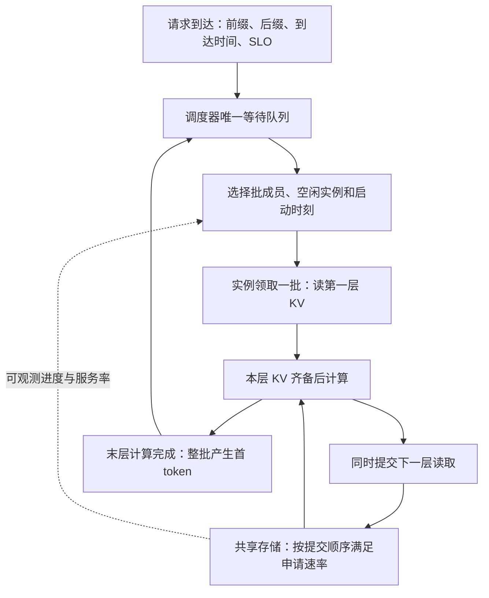
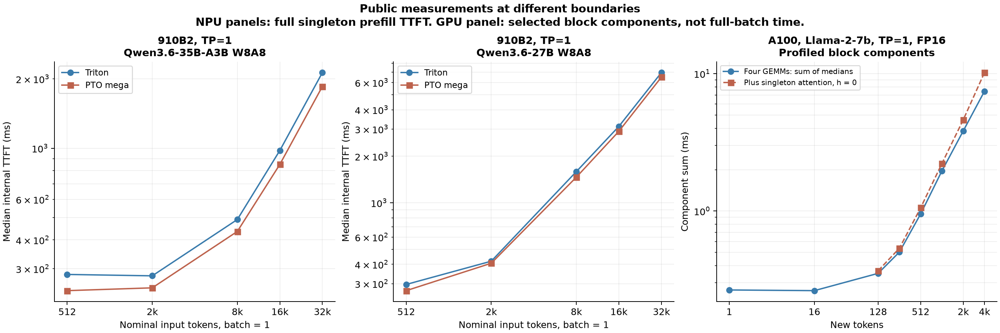
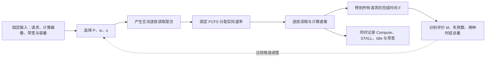
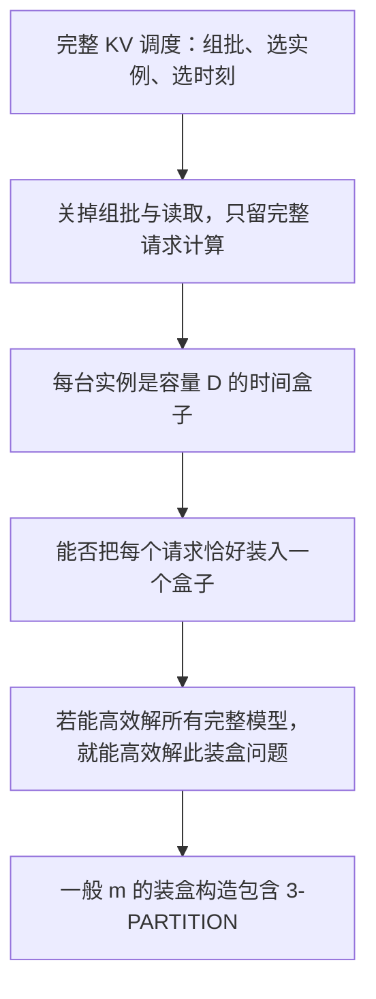
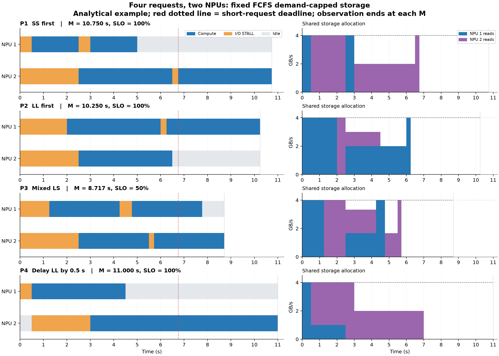
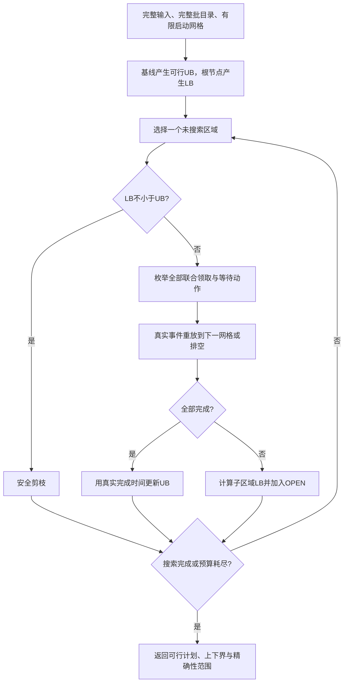
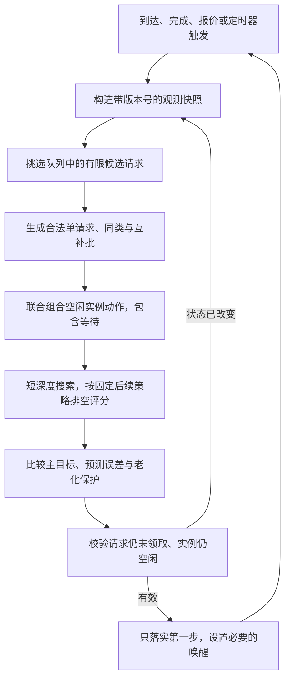

# 共享 KV 统一队列下的 Batch 效率与错峰调度形式化分析

| 项目 | 约定 |
|---|---|
| 研究问题 | 如何选择 batch 成员、领取顺序与启动时刻，协调多个推理实例的计算和共享 KV 读取 |
| 队列架构 | 调度器维护唯一等待队列；实例无本地等待队列，完成一批后再领取一批 |
| 存储纪律 | 按读取提交顺序先满足申请速率，剩余带宽继续分给后续读取，即 FCFS 按需分配 |
| 主目标 | 分别最小化全部完成时间 M、最大化 TTFT SLO 满足率、最小化平均 TTFT、最小化平均归一化 TTFT |
| 配套指标 | NPU Compute、I/O STALL、Idle；共享存储带宽利用率；分组与尾部时延 |
| 研究边界 | 完整 prefill 批、单实例单活动批、执行前不读取、执行中仅下一层 lookahead |
| 文档性质 | 独立的问题分析、形式化模型、复杂度论证和后续实验设计；算例为假设参数下的解析验证 |
| 前序文档 | [共享 KV 三层协同调度与全局指标分析](共享KV三层协同调度与全局指标分析-20260909.md) |
| 日期与单位 | 2026-09-13；时间为秒，数据为十进制 GB，带宽为 GB/s |

本次增补保留原有分析，并补齐从数据到算法的路径。建议先读 §2.5–§2.9 的昇腾结果和参数代入，再读新增 §6 的完整问题与直观复杂度桥接，最后读 §10 的精确算法、§11 的在线算法和 §12 的可执行实验设计。原第 9、10、11 节因此顺延为第 10、11、12 节。公开硬件数据、本文假设参数和未来待执行实验分别标注。

**结论是：将存储规则固定为 FCFS、将请求集中排队之后，优化的核心变成全局组批与启动时序。它同时影响计算效率、批内同步等待和读取之间的先后关系。四个主目标一般没有共同最优解；一般问题是 NP-hard，但小规模离线问题仍可求有证书的全局最优，大规模在线问题可以用滚动搜索求解，并量化与最优值或下界的差距。**

## 1. 完整问题与本次修正

### 1.1 系统在做什么

多个推理实例使用同一个模型，访问同一份共享 KV 目录。请求有一部分前缀已经有可复用 KV，需要从存储取回；其余后缀需要计算。本文只研究从到达到产生首 token 的 prefill 阶段，不把结果直接解释为完整回答的生成吞吐。



调度器中的“队列”是待执行请求集合，可以按调度策略选取和重排。**存储 FCFS 约束读取的提交顺序，不要求请求调度器按到达顺序选批。** 实例完成当前批后，才能原子地从中央队列取走新批。空闲实例也可以暂缓领取，此时请求仍在中央队列，不能暗中把下一批的数据预取进实例。

错峰有三种手段：改变同批成员，改变哪个批先领取，以及改变领取时刻。目标不是让所有读取串行，也不是尽量减少活动实例数。当计算可掩盖 I/O、各流申请率能被共同满足时，并发恰好可以更好地使用资源。

### 1.2 对前序分析修正了什么、为什么

| 前序讨论范围 | 本文调整 | 原因和影响 |
|---|---|---|
| 路由、本地排队、未执行请求改派 | 统一等待、执行时才绑定实例 | 消除“已派发但未执行”状态，改派和 work stealing 不再是主模型动作 |
| 实例内排序与组批 | 中央调度器选批，实例执行既定批 | 批的选择能看到所有待执行请求，不再受本地候选集限制 |
| 可比较公平、大小优先、依赖感知等存储规则 | 固定 FCFS 按申请速率分配 | 存储优先级不再是优化变量；原文公平共享时间线不能直接复用 |
| batch 效果用一般函数描述，示例用线性时间 | 展开 token、attention、内存、形状与效率模型 | 区分真实计算收益和单纯延长同步窗口的收益 |
| 用不同指标说明局部动作的外部影响 | 对每个目标写出条件最优代价和可实现的预测代价 | 明确什么是全局代价，以及预测只是近似的地方 |
| 原文列举可行计划，不宣称最优 | 增加逐目标复杂度证明、精确求解条件与 gap 定义 | 区分“难以大规模求解”和“无法找到任何全局最优” |

原文 §3.3 已给出平均 TTFT 的动作增量，不能说原文只有 M 的定义；本文将四个目标和利用率目标完整展开。原文算例中“某种错峰更好”的数字只在其公平共享服务模型下成立，不是本文 FCFS 模型的实验结论。

对应仓库既有的 [Scheduler–Engine 机制映射](五工作的Scheduler-Engine修改与主流默认实现-20260904.md)，这里将 D1 的执行时选实例和 D2 的准入/组批统一放在中央调度器；D4 的取数规则、D5 的完整 prefill 执行能力固定。本文不重新定义已有论文基线，也不据此宣称某个现有产品默认采用本架构。

### 1.3 所有策略共用的能力边界

- 同构实例、固定模型和并行配置，每实例同一时刻仅一个活动批。活动期间包括等待本层 KV 的时间，不能利用 STALL 偷接第二个批。
- 无 worker 本地缓存命中优势；固定 KV 放置与选源；不做跨请求读取去重、主动重算、复制或迁移。每个请求需要的读取字节在比较中固定。
- 本层整批 KV 齐备后，才开始本层计算；当前层计算开始时，提交下一层读取。第一层无前置计算可掩盖，下一批不能提前读取。
- 完整批的成员固定到最后一层，最后一层完成后一起产出首 token。实际引擎若支持拆批、成员提前完成或 chunk，须作为另一组共同能力重新建模。
- 固定请求数上限、token 上限、内存可行性检查和申请速率规则。不能给一种策略更大的批容量或更激进的速率申请权限。
- 基础离线问题执行完全部请求；基础在线实验不丢弃超期请求。若引入拒绝，拒绝请求计入到达分母并视为 SLO 失败，服务策略另行声明。

按层等待本层 KV 并触发下一层异步加载，可参考 Mooncake §5.2；中央队列、单活动完整批、无批间预取和 FCFS 是本文附加的研究约束，不是对 Mooncake 全部实现的描述。[Mooncake 原文](https://arxiv.org/html/2407.00079v4#S5.SS2)

## 2. Batch 具体怎样影响计算效率

### 2.1 “长短”和“batch 大小”都不只一个维度

设请求 i 命中前缀长度为 h_i，尚需计算的新 token 数为 u_i，主模型取 u_i≥1。完全缓存命中的请求若仍需一次末 token forward，应先按其真实执行方式转换为相应工作量。对批 β 定义

$$
n_\beta=|\beta|,\qquad
N_\beta=\sum_{i\in\beta}u_i,\qquad
A_\beta=\sum_{i\in\beta}\left(u_ih_i+\frac{u_i(u_i+1)}2\right).
$$

N 是线性层需要处理的新 token 数；A 是稠密因果 attention 中有效 query–key 配对数。每个新 query 访问已有前缀和不晚于自己的后缀 token，不同请求之间不存在交叉 attention。该配对式为本文的工作量推导，头数和维度等系数另行计入。滑窗、稀疏注意力等应替换此项，不能直接套用。

若每层每个命中 token 的 KV 字节系数为 κ_ℓ，则

$$
v_{i\ell}=h_i\kappa_\ell,\qquad V_{\beta\ell}=\sum_{i\in\beta}v_{i\ell}.
$$

对于常见 K/V 同精度、同维度结构，κ_ℓ 可按 `2 × KV头数 × head_dim × 每元素字节数 / 10^9` 计算；压缩、量化或其他 KV 布局使用实际字节数。

| 变化 | 对计算的影响 | 对远端存储的影响 |
|---|---|---|
| 请求数增加，同时 N 增加 | 线性层矩阵变大，工作量和并行度同时增加 | 新成员的命中 KV 增加读取量 |
| 请求数增加，但 N 不变 | 线性层主体规模接近，attention 与元数据开销仍可能不同 | 由命中前缀总量决定 |
| 命中前缀很长、后缀很短 | 新 token 少，但每个 query 的上下文长 | 可能读多算少 |
| 命中前缀很短、后缀很长 | 线性层和后缀 attention 工作较多 | 可能读少算多 |
| 总 token 相同，长度分布不同 | attention 配对数、kernel 形状和同步关系不同 | 还需单独比较 h 的分布 |

例如 h=0 时，1 个 1024-token 请求有 524800 个配对；4 个各 256-token 请求合计 131584 个配对。二者线性层 token 数相同，attention 工作量却相差约四倍。因而不能用“batch=4”或“总输入长=1024”之一包办性能估计。

### 2.2 计算收益从哪里来，何时停止增长

多个请求的新 token 可以沿矩阵的 token 维合并，共用模型权重进行线性层计算。小矩阵可能受到权重 HBM 访问、kernel 启动和并行度不足限制；增大矩阵后，每 token 成本可能下降。矩阵足够大时，硬件趋于饱和，再增加 token 主要使整批计算时间变长。矩阵维度和 tile 数量还会造成局部不平滑，不能假设批越大效率越高。[NVIDIA 矩阵乘指南](https://docs.nvidia.com/deeplearning/performance/dl-performance-matrix-multiplication/index.html)、[全连接层指南](https://docs.nvidia.com/deeplearning/performance/dl-performance-fully-connected/index.html)

prefill 一次就处理多个 token。Sarathi-Serve 的实验指出，完整 prefill 在单请求时就可能接近算力饱和，decode 则往往更依赖多请求 batching。其 token 预算讨论同时指出小块开销和 tile 形状影响。本文据此保留“单请求已饱和”的场景，不把 GPU 测得的饱和阈值或 decode 的加速倍数直接套到 NPU prefill。[Sarathi-Serve §3.1、§4.3](https://arxiv.org/html/2403.02310v2)

**HBM 带宽与共享 KV 存储带宽是两个资源。** 前者在计算 kernel 内部影响耗时，后者决定远端 KV 何时就绪。即使远端读完，attention 仍需访问设备内的 KV；不能把远端读取字节和所有 HBM 访问字节当成同一个量。

### 2.3 长短混合是否导致 padding 浪费

这取决于实现。padded 布局可能将短序列补到批中最大长度，产生无效计算和额外内存占用；packed/变长布局可以消除这部分填充。TensorRT-LLM 的 attention 文档明确区分这两种布局。[TensorRT-LLM Padded and Packed Tensors](https://nvidia.github.io/TensorRT-LLM/advanced/gpt-attention.html)

因此，本文不能普遍采用 `n_β × 最长请求长度` 作为计算工作量。使用 packed profile 时，应按真实 token 和 attention 形状计量。但 packed 也不自动取消批同步：一个短成员所需工作较少，仍可能要等完整批的本层 kernel 和最后一层完成才返回。

### 2.4 应该测量什么，而不是预设一个加速倍数

定义批在实例 w、第 ℓ 层的计算时间

$$
c_{\beta\ell}=g_w(\{h_i,u_i\}_{i\in\beta},\ell,\text{布局、精度、并行配置}).
$$

g 以目标 NPU 上的无远端等待 profile 为依据。下面只是拟合思路，不是已验证的硬件公式：

$$
c_{\beta\ell}\approx t_{\rm launch}
+\max\!\left(\frac{F_{\rm linear}}{P_{\rm linear}\eta_{\rm linear}},
             \frac{D_{\rm HBM,linear}}{B_{\rm HBM}}\right)
+\max\!\left(\frac{F_{\rm attn}}{P_{\rm attn}\eta_{\rm attn}},
             \frac{D_{\rm HBM,attn}}{B_{\rm HBM}}\right)
+t_{\rm other}.
$$

线性层 FLOPs 与 N 相关，attention FLOPs 与 A 相关；效率 η 随形状变化。算子有顺序依赖，因此这里将两部分耗时相加，而不是把全模型 FLOPs 与访存放进单一 max 后当成精确时长。

至少报告以下三个量：

$$
G_{\rm batch}(\beta)=
\frac{\sum_{i\in\beta}\sum_\ell c_{\{i\}\ell}}
     {\sum_\ell c_{\beta\ell}},\qquad
E_{\rm token}(\beta)=\frac{N_\beta}{\sum_\ell c_{\beta\ell}},\qquad
C_\beta=\sum_\ell c_{\beta\ell}.
$$

G 表示相对逐请求执行节省了多少设备计算时间；E 表示单位计算秒处理多少新 token；C 表示本批占用计算多久。G>1 不保证某个短请求更早完成，也不保证整个集群 M 更小。

profile 应覆盖请求数、h/u 组合、同类与混合长度、不同 token 总量及内存接近上限的形状；保存重复测量误差，留出未参与拟合的批形验证预测。没有目标 NPU 的测量时，可先用线性、饱和收益、padding 惩罚等假设模型扫描，但只能给出条件结论。

### 2.5 先看已有昇腾结果：能直接取得什么参数

本次补充优先采用昇腾 NPU 的公开结果。下面三类证据的计量边界不同，应分别入表；不能把它们拼成一个“某型号每层耗时”常数。

**A. 单 910B2 的逐输入长度测量。** 华为研究团队 MegaGDN 的公开材料声明使用单 910B2、64 GiB；脚本采用 TP=1、BF16 基础 dtype、Ascend W8A8 量化、eager、关闭 prefix cache，一次提交一个请求、只生成 1 token，预热 2 次、测量 10 次。材料还说明两条 GDN 路径内部算子精度并非完全一致，Triton 路径采用 BF16、PTO GDN 内核采用 FP16；基础 dtype 不代表所有内部算子的精度。以下是其 v0.19 数据目录中的 TTFT 中位数，单位毫秒。这里的 Triton/PTO 是被比较的实现路径。[硬件与方法](https://github.com/huawei-csl/megagdn-pto/blob/8f90f75098116f0f6d4b254704960a88423f74fd/blog/mega_gdn_en.md)、[测量脚本](https://github.com/huawei-csl/megagdn-pto/blob/8f90f75098116f0f6d4b254704960a88423f74fd/benchmarks/vllm_prefill/benchmark_prefill.py)

| 标称输入 token | Qwen3.6-35B-A3B W8A8，Triton | 同模型，PTO | Qwen3.6-27B W8A8，Triton | 同模型，PTO |
|---:|---:|---:|---:|---:|
| 512 | 283.326 | 240.970 | 296.367 | 270.205 |
| 2048 | 279.410 | 247.808 | 419.034 | 406.457 |
| 8192 | 490.427 | 435.348 | 1590.845 | 1464.261 |
| 16384 | 977.912 | 850.892 | 3120.351 | 2900.512 |
| 32768 | 2129.121 | 1853.413 | 6953.117 | 6500.871 |

原始数据分别为 [35B Triton](https://github.com/huawei-csl/megagdn-pto/blob/8f90f75098116f0f6d4b254704960a88423f74fd/outputs/data/prefill_20260502_9b27b35b_v019/qwen36_35b_a3b_w8a8/triton.jsonl)、[35B PTO](https://github.com/huawei-csl/megagdn-pto/blob/8f90f75098116f0f6d4b254704960a88423f74fd/outputs/data/prefill_20260502_9b27b35b_v019/qwen36_35b_a3b_w8a8/pto_mega.jsonl)、[27B Triton](https://github.com/huawei-csl/megagdn-pto/blob/8f90f75098116f0f6d4b254704960a88423f74fd/outputs/data/prefill_20260502_9b27b35b_v019/qwen36_27b_w8a8/triton.jsonl)、[27B PTO](https://github.com/huawei-csl/megagdn-pto/blob/8f90f75098116f0f6d4b254704960a88423f74fd/outputs/data/prefill_20260502_9b27b35b_v019/qwen36_27b_w8a8/pto_mega.jsonl)，固定版本为 `8f90f75098116f0f6d4b254704960a88423f74fd`。

这组数据可以直接作为“该栈下 singleton、无缓存的完整 prefill TTFT 查表”，例如 35B/PTO、标称 8192 token 填入 0.435348 秒。它不能直接填入 c_βℓ：测量仍含引擎与启动开销，也没有逐层分解。脚本配置 `max_num_seqs=8` 是上限，实际测量 batch=1，不能把表标成 batch=8。标称长度经过 token 截取再还原字符串，原始结果未逐次记录重新编码后的实际长度。

35B 在 512–2048 附近有明显平台，8192–16384 则接近翻倍；27B 的增长曲线不同。这说明模型、实现路径和长度都要进入画像。平台可能由固定开销主导，不能只凭曲线认定 NPU 已算力饱和。两模型均含混合层结构，35B 还含 MoE；其曲线不用于标定纯稠密 attention 的统一 αN+βA。

**B. Atlas A3 的长上下文与 chunk 配置结果。** vLLM-Ascend 维护方给出以下结果，表内硬件写为 Atlas A3 64 GB，并发均为 1。[Dynamic CPP 性能表](https://docs.vllm.ai/projects/ascend/en/latest/user_guide/feature_guide/dynamic_chunk_pipeline_parallel.html#performance)

| 模型与输入 | 固定 chunk=32k 的 TTFT | 动态 CPP、初始 chunk=32k 的 TTFT | 能说明什么 |
|---|---:|---:|---|
| DeepSeek-V3.1-W8A8，128k 输入 | 27.0 s | 22.5 s | chunk/流水配置改变完整 prefill 时延 |
| Qwen3-235B，256k 输入 | 61.4 s | 53.5 s | 同上；结果行未明确该模型精度 |

这两行未完整给出各自 TP/PP、输出长度等信息，缺失项保留为待核实。它们适合作为长上下文能力扩展的外部参照；主模型采用完整批，不能把动态 CPP 的收益直接算到本算法上，也不能由 Atlas A3 名称自行补写未注明的芯片型号。

**C. MindIE 的多请求 batch 调优结果。** 官方 MindIE 1.0 文档对 LLaMa3-8B、GSM8K、客户端并发 1000、最大输出 512 给出下表。公开页未完整注明硬件子型号、精度和 TP，因此不据它估计设备级算子时间。[不考虑时延的极限吞吐](https://www.hiascend.com/doc_center/source/zh/mindie/100/mindieservice/servicedev/mindie_service0107.html)

| maxBatchSize | maxPrefillBatchSize | GenerateSpeedPerClient（token/s） |
|---:|---:|---:|
| 435 | 217 | 2.8453 |
| 500 | 250 | 2.9803 |
| 600 | 300 | 2.5206 |

这里两个批上限同时变化，指标是每客户端生成速度，包含完整服务过程，不是单批 prefill tokens/s。它提供了可核查的“批上限加大后先改善、再下降”的案例；不能将上限 250 解释为每次实际恰有 250 个 prefill 请求，也不能倒数后当成 c。三类 NPU 结果共同给出配置与数量级参照，完整的 n×h×u 纯计算画像仍需要按目标执行栈测量。

### 2.6 公开算子表怎样直接代入：A100/Vidur 的具体例子

Vidur 发布了 A100、Llama-2-7b、TP=1 的参考 block 算子测量。wrapper 使用 FP16；以下是毫秒，重复配置行先对各组件的 `.median` 再取中位数。版本固定为 `abae7f63aa857300f5cdc6f5e0d27860cd24721b`。[mlp.csv](https://github.com/microsoft/vidur/blob/abae7f63aa857300f5cdc6f5e0d27860cd24721b/data/profiling/compute/a100/meta-llama/Llama-2-7b-hf/mlp.csv)、[attention.csv](https://github.com/microsoft/vidur/blob/abae7f63aa857300f5cdc6f5e0d27860cd24721b/data/profiling/compute/a100/meta-llama/Llama-2-7b-hf/attention.csv)

| 新 token 总数 N | QKV GEMM | O GEMM | MLP up GEMM | MLP down GEMM | 四项算术和 | 单请求 h=0 的 attention |
|---:|---:|---:|---:|---:|---:|---:|
| 1 | 0.065 | 0.025 | 0.116 | 0.060 | 0.266 | 未列 |
| 16 | 0.064 | 0.026 | 0.111 | 0.062 | 0.263 | 未列 |
| 128 | 0.0745 | 0.032 | 0.157 | 0.088 | 0.3515 | 0.016 |
| 256 | 0.112 | 0.052 | 0.229 | 0.1095 | 0.5025 | 0.033 |
| 512 | 0.234 | 0.088 | 0.402 | 0.229 | 0.953 | 0.103 |
| 1024 | 0.475 | 0.176 | 0.877 | 0.431 | 1.959 | 0.2585 |
| 2048 | 0.97925 | 0.301 | 1.6935 | 0.8505 | 3.82425 | 0.781 |
| 4096 | 1.89875 | 0.607 | 3.34475 | 1.5945 | 7.445 | 2.7335 |

这回答了“参数怎么填”：例如 N=512 时，上述四 GEMM 部分取 `0.953/1000=0.000953 秒`。若它是单个 h=0、u=512 的请求，再加所列 attention 得到 `0.001056 秒`的已列组件合计；完整层还需 norm、activation、RoPE、通信和实际栈开销。组件中位数之和不是观测到的总耗时中位数。

同样 N=512，若来自四个 u=128 请求，线性层可用相同 N 的画像作为起点，但不能直接把单个 512-token 请求的 attention 行搬过来。需要查询四序列形状或建立并验证序列级近似。Vidur 本身将 token 算子、序列算子和通信拆开采样，再用预测模型补齐查表；其无缓存 prefill 近似使用与 Σu_i² 相关的等效长度，不等于对任意缓存前缀和混批都精确。[Vidur §4.3–§4.4](https://arxiv.org/html/2405.05465v1)、[预测器源码](https://github.com/microsoft/vidur/blob/abae7f63aa857300f5cdc6f5e0d27860cd24721b/vidur/execution_time_predictor/sklearn_execution_time_predictor.py)



图中前两幅是单 910B2 的完整 singleton TTFT，第三幅是 A100 参考 block 中已列组件的合计，不能跨图直接比较设备速度。图用于说明怎样读取和利用不同粒度的公开数据，不是本仓库的硬件实测。

### 2.7 昇腾目标画像的采样、计时与拟合方案

第一阶段优先在实际可用的 Atlas A2/910B 系列设备上建立画像；如有 Atlas A3，再单独建立一份。芯片具体后缀、每设备可用内存、CANN/torch_npu/引擎版本和算子路径均须从实机记录。模型方面先选一种已能稳定运行的稠密模型做完整 n×h×u 实验；上面的混合/MoE 模型放在独立架构组。FP16、BF16、W8A8、TP=1/2/4/8 都是分组维度，不把不同配置混在一条曲线上；容量不够的组合标 infeasible。

建议的首轮网格如下，**这些是本研究设计参数，不是论文测得的时间**：

| 维度 | 采样值或规则 |
|---|---|
| 实际 batch 请求数 n | 1、2、4、8、16、32 |
| 每请求待算 u | 64、128、256、512、1024、2048、4096 |
| 命中前缀 h | 0、512、2048、8192、32768；按模型上下文和内存过滤 |
| 同总 N 的形状对照 | 1×2048、4×512、16×128；另取 `[128,384,512,1024]` |
| 固定 u、只变 h | 例如 u=128，逐项扫描 h，隔离缓存上下文效应 |
| 边界加密 | 255/256/257、511/512/513，检验 tile 或编译形状边界 |
| 重复 | 每形状先预热 10 次，测 30 次；波动明显再补到 100 次 |
| 留出集 | 完整留出 20% 的形状家族，不能把同一形状重复测量随机分到训练/验证两边 |

若直接在服务端发送 n 个并发请求，调度器可能分成多个实际 batch。必须在引擎执行入口固定成员并记录真实 batch 元数据；客户端并发数不能充当 n。h>0 的计算测试先把相应前缀 KV 准备在设备上，计时段内不包含远端加载，这样 c 不会重复包含存储等待。

```text
算法 P：PROFILE_BATCH(hardware, model, stack, shape_grid)
    冻结精度、TP、图模式、算子实现、频率策略与软件版本
    for shape in shape_grid:
        if 不满足上下文或内存约束: 记录infeasible；continue
        在设备准备输入和前缀KV；固定实际成员；完成编译/建图与预热；预热之间同样恢复KV状态
        samples ← []
        repeat 30次:
            在计时区外恢复相同的前缀KV长度h和写入位置，避免新KV累积
            同步相关设备和stream
            记录起始设备事件；执行一次固定成员prefill；记录结束事件
            等待结束事件与所有依赖完成
            保存逐层关键路径时间、整批时间、内存峰值和真实形状
        保存median、P95、离散程度与原始样本，不只保存一个均值
    按形状家族划分训练集和留出集
    优先查精确实测表；稀疏区拟合；超出测量范围标out_of_domain
    验证逐层和整批误差、关键候选批的排序错误率
```

Ascend 官方 `Event.elapsed_time()` 返回毫秒；同 stream 的计时可用下面的接口示意，写入仿真前除以 1000。实际 benchmark 适配到所用 torch_npu 版本。[Event 源码](https://github.com/Ascend/pytorch/blob/master/torch_npu/npu/streams.py)、[设备同步源码](https://github.com/Ascend/pytorch/blob/master/torch_npu/npu/utils.py)

```python
# 已在计时区外完成输入/KV准备、预热与建图。
torch_npu.npu.synchronize()
start = torch_npu.npu.Event(enable_timing=True)
end = torch_npu.npu.Event(enable_timing=True)
start.record()
run_one_fixed_prefill_batch()
end.record()
end.synchronize()
g_seconds = start.elapsed_time(end) / 1000.0
```

多 stream 或 HCCL 场景必须让结束事件依赖全部相关工作；也可用同步前后的单调墙钟测完整关键路径，但要注明其中含 host 提交成本。多 rank 的层时间取完成依赖所需的关键路径，不能把所有 rank 的 wall time 相加后当成单实例时长。可使用 Ascend PyTorch Profiler 的形状与 trace 数据复核。[官方 Profiler 指南](https://www.hiascend.com/document/detail/en/mindstudio/2610/TITools/ascend_pytorch_profiler/docs/en/ascend_pytorch_profiler/ascend_pytorch_profiler_user_guide.md)

建议每条画像保存 `model_revision,device,device_count,dtype,quant,TP,layer_type,kernel,graph_mode,n,h_list,u_list,elapsed_s,peak_memory_gb`。合并为全层表时分别保留首末层开销；没有逐层实测时，将全批时间均分给 L 层只能标成“均匀层敏感性模型”，不能冒充真实消费窗口。

拟合可从分段插值开始，样本足够后使用回归模型，特征至少包含 `(n,N,Σu²,Σhu,max(u),max(h),布局)`。相同总 N 的不同形状不能无条件合并。除时长误差外还应检验“哪两个候选批更快”的排序，因为调度器依赖比较结果。建议初始验收为留出集 median 相对误差≤10%、P95≤20%、关键候选排序错误率≤10%；这些是工程门槛，未达到就细分画像或补测，不是已实现精度。

### 2.8 尚无目标多请求画像时，一组可以实际代入的假设参数

为使仿真在画像未齐全时仍能进行机制验证，给出明确的 synthetic-v1，不把它命名为任何昇腾型号。其稠密 GQA 替身有 L=32、每层 κ=4.096×10⁻⁶ GB/token，等价于 8 个 KV 头、head_dim=128、K/V 各 2 字节；所有层使用

$$
\eta(N)=\min(1,\max(1/16,N/512)),\qquad
c_{\beta\ell}=50\times10^{-6}
+2\times10^{-7}\frac{N_\beta}{\eta(N_\beta)}
+10^{-10}A_\beta\quad\text{秒}.
\tag{P1}
$$

| 参数 | synthetic-v1 值 | 用于检验什么 |
|---|---:|---|
| 固定开销 | 50 μs/层 | 小批固定成本摊销 |
| 线性项 | 0.2 μs/token，按 η 调整 | token 维增大后的效率变化 |
| attention 项 | 0.1 ns/query–key 对 | 前缀与后缀长度分布影响 |
| 效率转折 N_sat | 512 tokens | 单请求已饱和或需合批才能饱和的差别 |
| 默认批上限 | n≤8、Σu≤8192 | 同类和混合批共享的动作空间 |
| 仿真可用批内存上限 | 预先指定并检查；示例取 16 GB 的批工作区预算 | 这是扣除权重等后预算，不是某块卡的总 HBM |

synthetic 的批工作区峰值明确取 `0.5 + LκΣ_i(h_i+u_i) + (16×4096×2/10^9)N_β` GB，并与16 GB预算比较；0.5 GB是固定workspace、末项是假设activation开销。此公式只为闭合机制模型，实际NPU必须换成测得的内存峰值。

代入一个 h=2048、u=128 请求，N=128、A=270400、η=1/4，得到每层 c=0.00017944 秒。四个相同请求合批，N=512、A=1081600、η=1，得到 c=0.00026056 秒；与四次 singleton 的 0.00071776 秒相比节省计算时间，但批成员经历的计算时长比 singleton 更长。

下一层读量分别为 0.008388608 和 0.033554432 GB，未截断的需求分别约 46.75 与 128.78 GB/s。可见，计算加速并没有令整批的带宽需求按比例下降。若配置 q_max=200 GB/s、共享 B=80 GB/s，四请求批自身的下一层需求已超过供给，这正是应检查的读算瓶颈切换。这些带宽也都是机制扫描值，不能据此声称某款昇腾的真实连接性能。

敏感性组将 N_sat 取 128/512/2048、固定开销取 0/50/100 μs、attention 系数取 0.05/0.1/0.2 ns；另设 η≡1 且固定开销为零的“无合批加速”对照。先固定一组后改变单个因素，不在同一场景里让不同策略使用不同系数。硬件画像到位后替换 P1，不改存储协议和目标函数。

### 2.9 从配置名到模型量，避免把软件参数当测量数据

| MindIE 配置或观测 | 在本文中的位置 | 不应作出的解释 |
|---|---|---|
| maxPrefillBatchSize | 请求数上限 N_max 的产品类比 | 不是每次实际 batch 人数 |
| maxPrefillTokens | 每轮 token 预算的产品类比 | 产品的 input-token 计数不能未经核实就当缓存后新 token N |
| maxQueueDelayMicroseconds | 等批时限的产品类比 | 不代表所有请求的总排队上限 |
| prefillTimeMsPerReq | 某些调度选择使用的配置估计 | 默认值不是不同形状实测 g |
| 实际 n、实际 token、执行 trace | profile 的输入和校验 | 客户端 concurrency 不能替代它们 |

MindIE 文档说明 prefill 的人数和 token 上限先到者结束组批，以及达到等批时限时可发不满批；这些可以帮助确定实验控制项。[MindIE 服务参数](https://github.com/Ascend/MindIE-LLM/blob/master/docs/zh/user_guide/user_manual/service_parameter_configuration.md) 本文仍使用自己的中央统一队列和 G3–G4，不据产品参数表声称 MindIE 已经实现本文的队列架构。

## 3. Batch 怎么设、为什么设

### 3.1 设的是可行域和选择规则，不是必须等满的固定人数

一个合法候选批至少满足

$$
1\le |\beta|\le N_{\max},\qquad
\sum_{i\in\beta}u_i\le T_{\max},\qquad
\operatorname{MemPeak}_w(\beta)\le H_w^{\rm total\ budget}.
$$

这里 MemPeak 与 H_total budget 都按含模型常驻权重的同一总口径计量。若使用扣除权重后的批工作区预算，则同时从峰值和预算中扣除相同常驻量；§2.8 的 synthetic 16 GB 就是后一种口径，不再重复扣权重。内存峰值包括权重、计算 activation、KV、接收缓冲和通信 workspace；需要保留的 KV 不会因为当前层算完就自动释放。单层 lookahead 也不意味着总内存只需两层 KV。实际执行的保留规则必须进入容量检查。

此外可设最大等批时间 W_batch、预测批时长预算 C_max 和最老请求保护规则。前两个容量上限是能力约束，后几个通常是策略控制参数，比较时应明确各自身份。SLO 可行性可以用 `预测 F_i≤d_i` 筛选候选，但在无法全部按时的场景必须有回退规则，不能因此把请求永久留在队列。

实际 token 预算参数的例子可见 vLLM 的 `max_num_batched_tokens`，但该文档讨论包含 decode 的迭代调度；本文完整 prefill 批的 token 预算与其默认执行策略不能混同。[vLLM Optimization and Tuning](https://docs.vllm.ai/en/stable/configuration/optimization/#chunked-prefill)

**上限不等于目标大小。** 低到达率、短 SLO 或只有一个合法请求时，可以直接发不满批；高负载下再从待执行集合里选取能获得计算收益、又不过度放大同步等待的批。若一个请求自身超过硬 token 上限，主模型须事先限制输入域，或明确共同的 singleton 特例；不能在完整批实验里悄悄改成 chunk。

### 3.2 参数如何确定

1. 根据内存峰值和模型限制确定硬容量，保证单请求合法且至少有可行调度。
2. 测量单位 token 时间随 N 和形状的曲线，找到收益趋平的区域，形成若干候选预算，不追求单个最大值。
3. 对当前请求计算剩余 SLO 余量 `d_i−t−预测剩余服务时间`。等批要付出真实时间，不能重置到达时间。
4. 在候选预算内同时生成单请求批、同类批和读算互补批，用全局预测比较。必要时给空闲实例设置一个短的下次唤醒时刻。
5. 用训练负载选预算和搜索宽度，用独立种子、长度组合和带宽条件检验；不把某条测试 trace 的最优参数作为通用配置。

设置这些约束的好处分别是防止容量溢出、控制单批占用时间、限制等批延迟和保证搜索开销可控。batch 的计算收益来自实际执行形状，设置一个更大的上限本身不会产生收益。

### 3.3 Chunk 是后续扩展

完整批将成员绑定到最后一层；chunk 把长请求拆成可重新调度的块，可能缩短短请求等待，但会增加调度次数，并改变历史 KV 保留、重读和 attention 成本。Sarathi-Serve 的 stall-free 指保护生成中的请求不被新 prefill 暂停，不代表本文的存储 I/O STALL 自动消失。[Sarathi-Serve §4](https://arxiv.org/html/2403.02310v2#S4)

首轮先固定完整批检验存储竞争，再将 chunk 作为所有策略共同拥有的能力消融。否则无法判断收益来自错峰决策还是更细的抢占/执行边界。

## 4. FCFS 按需分配必须精确到可复现

### 4.1 申请速率与实际分配速率

令 B(t) 为共享存储当前可供本业务使用的带宽，已提交但未完成的读取流按提交顺序排列为 f₁,…,f_k。q_f(t) 是引擎申请速率，b_f(t) 是实际获得的速率，则

$$
b_{f_j}(t)=\min\left\{q_{f_j}(t),
\left[B(t)-\sum_{h<j}b_{f_h}(t)\right]_+\right\}.
\tag{1}
$$

这就是本文固定的存储服务纪律。例如 B=4，三个流按顺序申请 1、4、2 GB/s，实际获得 1、3、0 GB/s。第一个流结束后，其余两个得到 4、0。若三个申请都是 1，则各得 1，剩余 1 GB/s 保持空闲。

因此它不是公平共享，也不总是“一次只传一个读取”。它在申请上限内工作守恒：

$$
\sum_f b_f(t)=\min\left(B(t),\sum_f q_f(t)\right).
$$

如果要求“申请率都已满足之后，剩余带宽仍继续超额给流”，那是另一种带宽纪律；本文按题设把申请率作为该流当前服务上限，不增加超额分配步骤。

### 4.2 FCFS 并未自动定义“按需”中的 q

只写 FCFS 而不规定申请率，问题仍不完整。本文为主模型选择以下统一的、确定的规则，便于解析和仿真实现：

| 读取阶段 | 申请规则 |
|---|---|
| 第一层读取 | 申请连接允许的最大速率 q_max，因为没有前一层计算可掩盖 |
| 下一层读取刚提交 | 当前层预计计算时长为 c，初始申请 `min(q_max,V_next/c)` |
| 消费时刻之前 | 保持初始申请率，存储按式 (1) 尽力满足 |
| 到当前层计算结束仍未读完 | 将申请提升到 q_max，补齐缺失数据，保留原 FCFS 序号 |
| 读取完成 | 删除活动流，立即重分配带宽 |

当 c=0 时直接使用 q_max；V=0 时立即视为已就绪，不建立消耗带宽的流。q_max 是连接能力上限，与当前背景负载扣除后的 B(t) 分开定义。初始 `V/c>q_max` 表示仅靠该窗口就已无法完全隐藏 I/O，不能伪造无 STALL 的承诺。

本规则的好处是申请率在有限事件之间固定，逾期后不会永远低速补读；代价是受阻后到消费截止前不会主动补偿早先缺口。另一种可部署规则是定期按 `剩余字节/剩余窗口` 更新，并在到期后申请 q_max。它需要固定更新周期、速率上限和零分母处理，应作为单独的申请协议敏感性实验，不能只让优化策略使用它。**本文中 q 由统一引擎协议生成，不是调度器可以任意优化的独立变量。**

即使以无 STALL 为目的申请带宽，这个局部就绪时刻也不等于请求的 SLO 截止。存储不根据请求 SLO 重排已经提交的流。

### 4.3 服务粒度和同刻事件顺序

主模型每个“批 × 层”提交一个聚合读取流，字节数是成员读取量之和，无跨请求去重。真实系统若按请求/对象分别提交，必须展开成多个流并固定批内提交顺序；按流 FCFS 对聚合粒度敏感，不能假设与聚合批完全等价。

同一时间点的确定性顺序规定为：处理读取与计算完成，启动已经满足依赖的本层计算并提交下一层读取，再由中央调度器向空闲实例派发新批，最后更新到期申请率并重新分配带宽。此前已提交的流始终保留原顺序。同阶段的多个新流按实例编号、层号等固定键赋序，不把平局顺序另开为优化权限。

这允许调度器通过稍晚领取改变新读取进入序列的位置，但不能撤销重提旧读取以改变优先级，也不能为尚未执行的批占用 FCFS 序号。

## 5. 形式化调度模型

### 5.1 输入、决策变量与中央队列

给定非空请求集合 I、实例数 m≥1、层数 L≥1，连接上限 q_max>0。每个请求包含到达时间 a_i、TTFT 阈值 s_i、绝对截止 d_i=a_i+s_i、各层读量 v_iℓ 和计算画像。固定参考 TTFT 为 T_i⁰>0，定义见 §7。

离线调度 σ 选择完整批集合 P、每批实例 w_β 和领取/启动时间 u_β，满足

$$
\bigcup_{\beta\in P}\beta=I,\qquad
\beta\cap\gamma=\varnothing\ (\beta\ne\gamma),\qquad
u_\beta\ge\max_{i\in\beta}a_i.
\tag{2}
$$

所有批满足 §3 的容量条件。在 t 时刻中央队列是

$$
Q(t)=\{i:a_i\le t,\ i\text{ 尚未被某个已启动批领取}\}.
$$

离线计划可以列出未来“哪个批由哪个实例执行”，这只是计划表示，不意味着提前将请求从中央队列取走。在线实现仅在实际领取时原子删除成员，保证每个请求只有一个执行所有者。

### 5.2 读取、计算与完成时间

对批 β、第 ℓ 层，读取提交、读取完成、计算开始、计算结束分别记为 A_βℓ、R_βℓ、C_βℓ、Z_βℓ。设 Z_β0=u_β，则

$$
A_{\beta1}=u_\beta,\quad
A_{\beta,\ell+1}=C_{\beta\ell},\quad
C_{\beta\ell}=\max(R_{\beta\ell},Z_{\beta,\ell-1}),\quad
Z_{\beta\ell}=C_{\beta\ell}+c_{\beta\ell}.
\tag{3}
$$

读取剩余字节 r_βℓ 满足

$$
r_{\beta\ell}(A_{\beta\ell})=V_{\beta\ell},\qquad
\frac{dr_{\beta\ell}}{dt}=-b_{\beta\ell}(t),\qquad
R_{\beta\ell}=\inf\left\{t\ge A_{\beta\ell}:\int_{A_{\beta\ell}}^t b_{\beta\ell}(x)dx=V_{\beta\ell}\right\}.
\tag{4}
$$

剩余字节微分式只在读取活动期间适用；读取完成后令该流 r=b=0。b 必须由式 (1) 和 §4.2 的 q 规则产生，不能由优化器自由选择。没有合法提交之前，积分服务量为零。

同一实例的任意两个活动区间不能重叠：

$$
\beta\ne\gamma,\quad w_\beta=w_\gamma\Longrightarrow
[u_\beta,Z_{\beta L})\cap[u_\gamma,Z_{\gamma L})=\varnothing.
\tag{5}
$$

注意这是“启动读取到整批结束”的区间不重叠，仅禁止计算区间重叠是不够的。完整批成员的完成时间为

$$
F_i=Z_{\beta L},\qquad T_i=F_i-a_i\quad(i\in\beta).
\tag{6}
$$

给定合法 σ、确定的 g、B(t)、速率规则及平局顺序，式 (1)–(6) 定义了全局执行轨迹。每个请求的服务时间是该轨迹的结果，不是一个与其他实例无关的固定输入。

### 5.3 等待、计算、STALL 的分解

批的纯计算时间和设备 I/O STALL 分别为

$$
K_\beta=\sum_{\ell=1}^L c_{\beta\ell},\qquad
S_\beta=(C_{\beta1}-u_\beta)
+\sum_{\ell=2}^L(C_{\beta\ell}-Z_{\beta,\ell-1}).
$$

无其他控制开销时，有

$$
F_i-a_i=(u_\beta-a_i)+K_\beta+S_\beta.
\tag{7}
$$

第一个括号就是中央队列等待，包含等批与暂缓领取。K_β 是整个同步批的计算时间，不能再除以批人数来充当某个成员实际经历的 TTFT。读取在计算中进行时不增加设备 STALL；只有计算依赖尚未满足的空档才计入。

### 5.4 优化问题

记所有满足式 (1)–(6) 的调度为 S。四条独立优化线为

$$
\min_{\sigma\in S}M(\sigma),\quad
\max_{\sigma\in S}A_{\rm SLO}(\sigma),\quad
\min_{\sigma\in S}\bar T(\sigma),\quad
\min_{\sigma\in S}\bar R(\sigma).
\tag{8}
$$

连续问题以下用“最小化”表示求下确界；只有下确界由可行调度取得时才称存在最优解。有限候选和有限时间网格的非空问题一定能取得最优值。基础离线分析假定输入存在全部请求有限完成的可行调度；若带宽永久不可用等条件使其不可行，应先报告不可行。

如果必须给出一个运营方案，可以采用词典序目标，如先最大化满足率，再在并列方案中最小化归一化 TTFT；也可以采用 ε 约束，如在 `A_SLO≥η` 下最小化平均 TTFT。约束不可行时需明确报告。任意加权和会引入业务权重与单位选择，而且不一定覆盖离散可行域中的全部 Pareto 解。

## 6. 将整个全局优化问题放在一起

本节把前面的参数、约束、执行规则和目标合并为一个问题；后续复杂度证明和算法均求解这个问题或其明确声明的受限版本。

### 6.1 完整输入与唯一的调度决策

离线输入记为

$$
\mathcal D=(I,m,L,\{a_i,d_i,T_i^0,(v_{i\ell})_{\ell=1}^L\}_{i\in I},
\mathcal B,\{c_{\beta\ell}\},B(t),q_{\max},\mathcal E).
\tag{G1}
$$

这里 I 是固定的非空请求集合；m、L 为实例数和层数；a、d、T⁰ 分别为到达、截止与固定参考时间；v 为各层字节；B(t) 为业务可用共享带宽。𝓑 是所有容量合法的请求子集构成的 batch 目录，c 由已冻结的 profile 给定；𝓔 固定 FCFS 粒度、申请协议、同刻事件处理和层间 lookahead。相同成员在一个场景中有固定画像，不能在搜索时为了改善结果而修改计算系数。

调度器选择三个对象

$$
\sigma=(P,w,u),\qquad P\subseteq\mathcal B,
\quad w:P\to\{1,\ldots,m\},\quad u:P\to\mathbb R_{\ge t_0}.
\tag{G2}
$$

P 决定哪些请求一起执行，w 决定由哪台实例领取，u 决定何时领取。请求顺序由这些领取事件产生，没有额外的实例等待队列。c 是输入；实际读取速率 b、各层完成时间和请求完成时间是这三个选择诱导的结果。

### 6.2 一组封闭的约束

给定 σ，以下条件必须同时成立；任何一个不满足，σ 都不是本文问题的可行解。

$$
\begin{aligned}
&\text{每请求恰好执行一次：}
&&\sum_{\beta\in P}\mathbf1[i\in\beta]=1 &&(i\in I),\\
&\text{到达与批容量：}
&&u_\beta\ge\max_{i\in\beta}a_i,\quad\beta\in\mathcal B,\\
&\text{首层与下一层释放：}
&&A_{\beta1}=u_\beta,\quad A_{\beta,\ell+1}=C_{\beta\ell},\\
&\text{读取完成：}
&&R_{\beta\ell}=\inf\left\{t\ge A_{\beta\ell}:\int_{A_{\beta\ell}}^t b_{\beta\ell}(x)dx=V_{\beta\ell}\right\},\\
&\text{计算依赖：}
&&C_{\beta\ell}=\max(R_{\beta\ell},Z_{\beta,\ell-1}),\quad
Z_{\beta\ell}=C_{\beta\ell}+c_{\beta\ell},\\
&\text{实例整个活动区间互斥：}
&&\beta\ne\gamma,\ w_\beta=w_\gamma\Rightarrow
[u_\beta,Z_{\beta L})\cap[u_\gamma,Z_{\gamma L})=\varnothing,\\
&\text{批内共同完成：}
&&F_i=Z_{\beta L}\quad(i\in\beta).
\end{aligned}
\tag{G3}
$$

其中 V_βℓ=Σ_i∈β v_iℓ、Z_β0=u_β。对当时已提交且未完成的流，按 𝓔 规定的序号排成 f₁,…,f_k，必须再满足

$$
b_{f_j}(t)=\min\left(q_{f_j}(t),\left[B(t)-\sum_{h<j}b_{f_h}(t)\right]_+\right).
\tag{G4}
$$

q 的完整约束也一并固定：首层申请 q_max；下一层提交时，以前层 c 为覆盖窗口，申请 min(q_max,V/c)；直到该窗口结束仍未完成才升至 q_max，保留原序号；c=0 时直接申请 q_max，V=0 时直接就绪。未释放的读取 b=0。这样 G1–G4 已经封闭，不能再由求解器选择一套更有利的 b。

### 6.3 一个问题、四个可以切换的目标

记由 G1–G4 得到的完成时间向量为

$$
(F_1,\ldots,F_n)=\Phi_{\mathcal D}(P,w,u).
$$

统一使用以下非负损失函数

$$
\begin{aligned}
J_M&=\max_iF_i-t_0,\\
J_S&=\sum_i\mathbf1[F_i>d_i],\\
J_T&=\sum_i(F_i-a_i),\\
J_R&=\sum_i(F_i-a_i)/T_i^0.
\end{aligned}
\qquad
\boxed{\inf_{(P,w,u)\ \text{满足 G2--G4}}J_\theta(\Phi_{\mathcal D}(P,w,u)),
\quad\theta\in\{M,S,T,R\}.}
\tag{G5}
$$

J_S 除以 n 是失败率，1−J_S/n 是满足率；J_T、J_R 除以 n 是两种均值。n 固定，所以使用总量有利于搜索实现，不改变各自最优解。这里是四次独立求解，也可以求 Pareto 集；没有声明一个调度同时最小化四项。

对每个解另计算

$$
K=\sum_{\beta\in P}\sum_\ell c_{\beta\ell},\quad
S=\sum_{\beta\in P}\left(Z_{\beta L}-u_\beta-\sum_\ell c_{\beta\ell}\right),\quad
I=mM-K-S,
$$

$$
U_{\rm compute}=K/(mM),\qquad
U_{\rm storage}=\frac{\sum_i\sum_\ell v_{i\ell}}{\int_{t_0}^{t_0+M}B(t)dt}.
\tag{G6}
$$

G6 对无额外开销、全部读取完成的有限工作集成立；有控制开销时增加 Other。它们主要是 G5 的解释指标。若另研究最大忙碌占比，目标改为 −K/(mM)，不能在 K 可变时用 J_M 代替。



### 6.4 为什么这个定义把“全局”保留下来了

改变一个 batch 的成员会改变 V 和 c，进而改变未来层的读取提交时间 A。A 改变会影响 FCFS 排位，进而影响另一实例的读取完成 R，最后改变该实例的 F。共享资源使 Φ 无法拆成“每个实例各自独立算一个固定服务时间”。

例如第 8 节 P1 到 P4 只延迟 LL 的领取，LL 首层就从“挡住 SS 的下一层读取”变成“排在 SS 下一层之后”。最终变化的不只是 LL 自己的等待，还有 SS 的完成时间。求解器搜索的是这一整条因果链。

### 6.5 从这个模型怎样走到 NP-hard

不需要先掌握调度复杂度符号，可以依次关掉四个开关：令最大 batch=1，所有请求的 v=0，只保留一层，所有请求都在 t=0 到达。G3 中的读取和批内同步问题于是消失，剩下的正是“中央队列如何把计算时长 p_i 的完整请求交给 m 台实例，才能尽早全部做完”。

| 原始模型中的量 | 这个特殊输入取值 | 还剩什么 |
|---|---|---|
| 合法 batch 目录 𝓑 | 只含单请求集合 | 每个请求不可拆分 |
| 远端 KV 量 v | 全为 0 | FCFS 自动满足，不参与决策 |
| 层数 L 与计算 c | L=1，c_{\{i\},1}=p_i | 请求的计算时长固定 |
| 到达 a | 全为 0 | 无须等待未来请求 |
| 调度变量 P、w、u | P 固定，仍需选择 w、u | 把完整工作装进各实例的时间轴 |

现在问“能否在 D 秒内全部完成”。每台实例就像一个容量 D 的时间盒子。总计算量即使正好等于 mD，也必须能把不可拆的请求分装进去，不能只比较总量。

取两台实例、D=15。请求 `(4,4,5,5,6,6)` 可以分成两组 `(4,5,6)`，恰好各算 15 秒。请求 `(4,4,4,6,6,6)` 总量也是 30，但要在 15 秒内完成，每台必须装三个请求；三数之和只能是 12、14、16、18，凑不成 15。最佳 M 至少为 16，实际上用 14 与 16 的分组可以达到。



严格证明还要让请求数和 m 随输入增长，这在第 9 节完成；上面的两组数只帮助看懂对应关系。证明的方向是：**假如有一个能高效精确求解所有完整 KV 调度输入的算法，那么把这种特殊输入交给它，也能高效解决已知难问题。** 因而一般模型至少同样难。增加存储竞争不可能让这个“适用于所有输入的算法”逃过上述特殊输入。

这条链直接证明 J_M；令所有 d_i=D，就同时证明“J_S 能否为零”的困难性。J_T、J_R 需要换成不同到达时间的单机特殊输入，分别得到总 flow time 和总 stretch；对应关系和独立原始依据见 §9.4–§9.5。不能从装盒例子一跳就宣布另外两个目标也得证。

## 7. 各目标下“一个动作的全局代价”怎样定义

### 7.1 先统一指标口径

对相同的 n 个请求和固定观测起点 t₀，定义

$$
M=\max_iF_i-t_0,\qquad
A_{\rm SLO}=\frac1n\sum_i\mathbf1[F_i\le d_i],
$$

$$
\bar T=\frac1n\sum_i(F_i-a_i),\qquad
\bar R=\frac1n\sum_i\frac{F_i-a_i}{T_i^0}.
\tag{9}
$$

T_i⁰ 在比较开始前固定为该请求独占同类实例、完整基准存储带宽时，使用相同层间流水和申请规则所得的单请求 TTFT。它不能随策略拥塞、组批或背景带宽变化而重新放宽。batch 可能比单请求执行更高效，因此 T_i⁰ 不一定是可证明的最优下界，T_i/T_i⁰<1 并非必然错误。

平均归一化 TTFT 是按 `1/T_i⁰` 对实际时延加权，不等于“平均 TTFT 除以平均参考 TTFT”。短请求的同一秒延误通常占更大权重。固定阈值 `s_i=s` 与相对阈值 `s_i=αT_i⁰` 都需比较，且恰好在截止时间完成算满足。

### 7.2 全局代价的严格定义与在线近似

在状态 X_t 下，一个动作 α 可以是“现在向若干空闲实例发哪些互不重叠的批”，或“暂缓领取到下次决策”。它不修改已活动批或已提交读取的顺序。

将目标全部转为最小化形式：J_M=M，J_SLO=1−A_SLO，J_T=平均 TTFT，J_R=平均归一化 TTFT，J_U=−U。若离线未来已知，严格的动作价值为

$$
Q_J^*(X_t,\alpha)=
\inf_{\sigma\in S(X_t,\alpha)}J(\sigma),\qquad
\Delta_J^*(\alpha;\alpha_0)=Q_J^*(X_t,\alpha)-Q_J^*(X_t,\alpha_0).
\tag{10}
$$

S(X_t,α) 固定过去和当前动作，只优化之后的合法调度。它保留已完成请求的贡献；改变最后完成时间时，也不能忽略过去已完成的尾部。这个定义准确，却可能与完整优化问题一样难算。

可实现的方法是在两条分支中使用同一个后续策略 π 和同一组情景，模拟全部相关活动批及待执行请求，得到预测完成时间 F̂_i^α 和 F̂_i⁰，再比较 J。该值应称“相对于后续策略 π 的全局预测代价”，不能称为 Q*。如果只看有限窗口，要给未完成请求加统一的终端成本；不能让暂缓所有请求因窗口内没有失败或完成样本而获得虚假最优。

在线状态仅包含已到达请求、活动进度及可观测服务反馈。预测未知到达可以用共同的统计模型，不能使用当前在线策略看不到的未来 trace。每次预测在窗口内求到最优，也不意味着整条未来 trace 最优。

### 7.3 四种主目标的动作增量

设 Δ_i=F̂_i^α−F̂_i⁰。比较使用同一请求集合和固定分母 n，以下增量小于零表示改善：

| 目标 | 动作的全局预测增量 | 实际关心什么 |
|---|---|---|
| 最小 M | `max_i F̂_i^α − max_i F̂_i⁰` | 是否缩短最后完成时间；不能用 `max_i Δ_i` 替代 |
| 最大 SLO 满足率 | `(1/n)Σ_i(1[F̂_i^α>d_i]−1[F̂_i⁰>d_i])` | 新增失败数减去挽救的请求数 |
| 最小平均 TTFT | `(1/n)Σ_i Δ_i` | 所有请求提前和推迟的秒数之和 |
| 最小平均归一化 TTFT | `(1/n)Σ_i Δ_i/T_i⁰` | 按各请求参考时间加权后的提前和推迟 |

每个和式都必须包含其他实例被波及的请求及中央队列中被推迟的请求。候选新批自身的收益只是其中一部分；释放时刻变化还会影响尚未提交的后续层读取，需要重新模拟，而不是在旧的 I/O 时长上加减固定数值。

SLO 是阶跃目标。让一个已过期请求从 20 秒提前到 15 秒，若 deadline=10，主目标收益仍为零；让另一个请求从 10.1 提前到 10，才挽救一个按时完成。为便于搜索，可使用超期量或成功概率作为次级目标，但必须报告真实满足率。存在预测误差时，可用 `E[A_SLO]=(1/n)Σ_i P(F_i≤d_i)`；是否独立不影响期望线性相加，但模拟共享竞争时应保留相关性。

### 7.4 若目标改成最大 NPU 利用率

在统一窗口 [t₀,t₀+H] 中定义设备时间总量 K、S、I、O，分别表示 Compute、I/O STALL、Idle 和其他开销：

$$
K+S+I+O=mH,\qquad U=\frac K{mH}.
\tag{11}
$$

有活动批但缺本层数据计 STALL；无活动批，包括有中央积压却主动等批，计 Idle。多 NPU 实例按设备秒加权。这里 U 是有效 prefill kernel 所处时间的占比，不等于硬件 FLOPs 利用率。

如果窗口固定，动作增量为

$$
\Delta J_U=-\frac{K^\alpha-K^0}{mH}.
$$

如果观察到全部请求完成，H=M，且 K⁰、M⁰ 分别变化 ΔK、ΔM，则

$$
\Delta J_U=
\frac{K^0\Delta M-M^0\Delta K}
{mM^0(M^0+\Delta M)}.
\tag{12}
$$

只有 K 对所有候选调度不变时，最大化 U 才等价于最小化 M；此时也等价于最小化总 STALL+Idle+Other，不能只最小化 STALL。batch 改变计算效率时，K 本身会变，必须使用式 (12)。例如同一工作量从 `(K,M)=(12,8)` 改进到 `(8,6)`，两实例的忙碌占比从 75% 降到 66.7%，但全部完成时间反而更短。

若目标真的是算力效率，更有意义的辅助量是固定有效 FLOPs 除以设备峰值与时间，或固定请求集合的有效 token/s。增加 padding 或选择低效 kernel 不能算额外的有用工作。本文推荐以四个请求级目标为主，Compute/STALL/Idle 用来解释因果，不单独追求“更忙”。

### 7.5 存储利用率与有限/长期窗口

$$
U_{\rm storage}=
\frac{\int_{t_0}^{t_0+H}\sum_fb_f(t)dt}
{\int_{t_0}^{t_0+H}B(t)dt}.
\tag{13}
$$

分母为零时记为不可定义。另可报告物理链路利用率，以区分背景负载与本业务，但不要与式 (13) 混用。若固定字节全部读完、B 恒定且 H=M，则 U_storage=总字节/(BM)，它与 M 不独立。较低利用率可能因为数据已按需提前就绪、尚未释放下一层读取或等待请求到达，并不自动意味着带宽调度失效。

有限工作集的完成吞吐为 n/M。长期在线负载则应固定到达率，统计稳定队列、SLO 满足率及统一稳态窗口内的资源占比；通过扫描到达率才得到满足率目标 η 下的稳定容量。稳定开环、请求全部执行且每请求计算工作固定时，U≈λE[K_i]/m，改善排序不一定改变长期计算占比。batch 改变 E[K_i] 时要重新计量。

时延统计按固定到达 cohort 排空，不能只平均窗口内碰巧完成的请求。过载无法排空时报告积压、超时和截断；若采用拒绝，均值的条件和拒绝惩罚另行写清，不能用删掉慢请求后的均值代替全部输入的性能。

## 8. 长短混批：带宽需求下降与短请求延迟的具体关系

### 8.1 下降的是速率需求，不是数据量

设长、短请求下一层读量为 v_L、v_S，单独执行当前层时长为 c_L、c_S，混批时长为 c_LS。在整批同步、下一层共同消费的模型下，短成员的无 STALL 需求率可归因为

$$
q^{\rm need}_{S,solo}=\frac{v_S}{c_S},\qquad
q^{\rm need}_{S,mixed}=\frac{v_S}{c_{LS}}.
$$

当 c_LS>c_S 时，短成员的这个需求下降；总批需求从两个独立窗口的速率之和，变为一个共同窗口的需求：

$$
q^{\rm need}_{LS}=\frac{v_L+v_S}{c_{LS}},\qquad
q^{\rm need}_{LS}<\frac{v_L}{c_L}+\frac{v_S}{c_S}
\Longleftrightarrow
c_{LS}>\frac{v_L+v_S}{v_L/c_L+v_S/c_S}.
\tag{14}
$$

右侧只是窗口需求比较，不等于任意时刻都存在那两个独立流，也不等于实际 b 一定下降。真实服务还要经过 FCFS、连接速率上限和到期补读规则。第一层无覆盖窗口，不能用此式声称启动读取也更轻。

一个容易忽略的方向是：**batch 计算加速越强，当前层越快完成，下一层就需要更高的读取速率才能跟上。** 计算效率提升可能将瓶颈转移到存储。不能把“合批节省计算秒数”和“合批降低每秒带宽需求”同时设为无条件收益。

### 8.2 一个可手算的短请求反例

两层、B=q_max=4。每层长请求读 4 GB、算 2 秒；短请求读 1 GB、算 1 秒；混批每层读 5 GB、算 3 秒，刻意采用无计算加速的线性批模型。所有请求从 t=0 计时。

短请求单独执行时，第一层读 0.25 秒，第二层读取以 1 GB/s 藏在第一层的 1 秒计算里，故参考 TTFT 为 2.25 秒。混批独占资源时，第一层读 1.25 秒，第二层以 5/3 GB/s 藏在 3 秒计算里，整批 TTFT 为 7.25 秒。

短成员的下一层需求从 1 降到 1/3 GB/s，但它的字节数仍为每层 1 GB，TTFT 从 2.25 增加到 7.25 秒。若短请求阈值为 6.75 秒，它从满足变为失败。这是同步绑定的局部对照，尚不能代替执行同一完整请求集合的全局比较。

准确表述应是“短请求 TTFT 可能增加，SLO 满足率可能下降”。SLO 阈值本身没有降低。若混批减少的中央等待或全局 STALL 足够多，也可能抵消同步损失，使短请求最终更早完成。

### 8.3 同一批四个请求在固定 FCFS 下的全局比较

为避免沿用原文公平共享的数字，重新构造四请求算例。两个 L、两个 S 都在 t=0 到达，两实例、两层、最大 batch=2；每请求参数沿用 §8.2。长请求参考 TTFT=5 秒，短请求=2.25 秒；阈值分别为 15 和 6.75 秒。整组共有 20 GB 读取、12 NPU·s 计算，全部计划使用 §4 的相同协议。

| 计划 | 中央调度器的领取决定 |
|---|---|
| P1 同类短批先提交 | t=0，实例 1 领 SS、实例 2 领 LL；SS 首层获得较早序号 |
| P2 同类长批先提交 | t=0，实例 1 领 LL、实例 2 领 SS；LL 首层获得较早序号 |
| P3 两个混合批 | t=0，两个实例各领 LS，实例 1 首层获得较早序号 |
| P4 短批启动后再领长批 | t=0 只领取 SS；t=0.5，SS 第二层提交后，空闲实例才领取 LL |

计划 P4 的 LL 在 0–0.5 秒仍位于中央队列，实例是 Idle，没有提前预取或保留本地等待批。

| 指标 | P1 | P2 | P3 | P4 |
|---|---:|---:|---:|---:|
| 两个 S 的完成时间（秒） | 5，5 | 6.5，6.5 | 7.770833，8.717014 | 4.5，4.5 |
| 两个 L 的完成时间（秒） | 10.75，10.75 | 10.25，10.25 | 7.770833，8.717014 | 11，11 |
| M（秒） | 10.75 | 10.25 | 8.717014 | 11 |
| 平均 TTFT（秒） | 7.875 | 8.375 | 8.243924 | 7.75 |
| 平均归一化 TTFT | 2.186111 | 2.469444 | 2.656375 | 2.1 |
| SLO 满足率 | 100% | 100% | 50% | 100% |
| Compute（NPU·s） | 12 | 12 | 12 | 12 |
| STALL（NPU·s） | 3.75 | 4.75 | 4.487847 | 3 |
| Idle（NPU·s） | 5.75 | 3.75 | 0.946181 | 7 |
| Compute 占比 | 55.81% | 58.54% | 68.83% | 54.55% |
| 存储带宽利用率 | 46.51% | 48.78% | 57.36% | 45.45% |



图中蓝色为 Compute，橙色为 STALL，灰色为 Idle；右侧带宽按两个实例叠加。红色点线是短请求 6.75 秒截止；每行在本计划的 M 处结束统计，之后的留白不计入 Idle。图来自上述假设参数的分数精度事件积分，逐批与全局设备时间、总读取字节均已核对。

P3 的两个完成时间精确为 373/48 和 5021/576 秒，表内小数四舍五入。这里的低存储平均利用率包含后续计算和尾部排空，不意味着有合法申请时违反 FCFS 按需服务。

P1 的完整关键时间线如下，可直接按字节和设备时间复核：

| 时间段 | 存储服务 | SS 实例 | LL 实例 |
|---|---|---|---|
| 0–0.5 | SS 第一层 4 GB/s | STALL | STALL |
| 0.5–2.5 | LL 第一层 4 GB/s；SS 第二层已提交但排在其后 | 算第一层 | STALL |
| 2.5–3 | SS 第二层到期后申请 4 GB/s，读完 2 GB | STALL | 算第一层 |
| 3–5 | LL 第二层 2 GB/s | 算第二层，5 秒完成 | 算第一层 |
| 5–6.5 | LL 第二层 2 GB/s | Idle | 算第一层 |
| 6.5–6.75 | LL 第二层剩余 1 GB，以 4 GB/s 补齐 | Idle | STALL |
| 6.75–10.75 | 无未完成读取 | Idle | 算第二层，10.75 秒完成 |

P1 中 `12+3.75+5.75=2×10.75`，存储传输量为 `2+8+2+7+1=20 GB`。P4 中 SS 第二层先于 LL 首层提交，申请 1 GB/s，LL 首层拿到余下 3 GB/s；于是 SS 无层间 STALL、4.5 秒完成，LL 首层在 0.5–2.5 秒拿到 3 GB/s、在 2.5–3 秒拿到 4 GB/s，因而到 3 秒才完成，最后在 11 秒结束。

这些计划支持三个独立结论：P3 的 M 最小但短请求全部超期；P2 相比 P1 缩短 M，却增加平均及归一化 TTFT；P4 减少 STALL、改善两种均值，却增加 M 并降低 Compute 占比。**不能只按 STALL 最少、带宽最满或长短混合与否选策略。** 四个计划未穷举全部候选批和启动时间，不宣称其中任何一个是全局最优。

## 9. 是否为 NP-hard：逐目标说明

### 9.1 复杂度针对什么输入规模

讨论一般离线问题：请求数、实例数、到达时刻和请求工作量可以变化；数值为有限编码的有理数，g 可通过明确公式或可在多项式时间查询的已给定画像得到。不能把任意成本计算黑箱的复杂度藏进“调度复杂度”。

下面的归约使用这个问题族的子问题：batch 上限为 1、单层、读取量为 0。因此 FCFS 规则自动满足，中央队列仍按实例空闲时领取。读取为 0 对应无可复用前缀。证明说明**一般问题至少如此困难**，不说明固定八个请求或某一份 NPU profile 也具有同等最坏情况复杂度；若另外强制每请求有正读取且 m 固定，需要重新证明对应子类。

### 9.2 最小化 M：强 NP-hard，实例数作为输入

从 3-PARTITION 构造。给定 3m 个正整数 p_i，满足

$$
D/4<p_i<D/2,\qquad\sum_i p_i=mD.
$$

将它们变成 3m 个 t=0 到达的单请求批，计算时间 p_i，交给 m 个同构实例。问是否存在 M≤D 的调度。

如果能分成 m 组三元组、每组和为 D，就让每个实例依次领取一组中的三个请求，得到 M=D。反过来，若 M≤D，总计算量 mD 迫使每个实例都恰好处理 D；每个 p_i 位于 D/4 和 D/2 之间又迫使每实例恰好处理三个请求，因而得到原问题的三划分。这是多项式构造，所以一般 makespan 优化强 NP-hard。

如果实例数固定为 2，可由 PARTITION 得到普通 NP-hard，但不能把上面的强 NP-hard 原样搬过去。经典机器调度的复杂度体系参见 [Lenstra、Rinnooy Kan、Brucker，1977](https://ir.cwi.nl/pub/18051)。

### 9.3 最大化 SLO 满足率：强 NP-hard

沿用相同构造，并令所有请求的绝对截止为 D。存在 100% 满足的调度，当且仅当存在 M≤D 的调度。因此，即使只要求判断“最大满足率是不是 100%”，也能解决 3-PARTITION。

该结论不要求调度器丢弃失败请求：未按时的请求仍可在 D 之后执行，关键只是能否让所有请求在 D 前完成。一个实例、同时到达、固定处理时间的某些截止调度特例可能有高效算法，不与一般问题的硬度矛盾。

### 9.4 最小平均 TTFT：使用独立子问题证明

取单实例、单请求批、无读取，但允许不同到达时刻 a_i，则

$$
\sum_iT_i=\sum_iF_i-\sum_i a_i.
$$

到达时间之和是常数，所以它包含经典不可抢占的 `1 | r_i | ΣC_i` 问题，该问题为强 NP-hard。[Lenstra、Rinnooy Kan、Brucker，1977，Theorem 5，p.357](https://ir.cwi.nl/pub/18051/18051A.pdf)

到达时间和允许暂缓启动的前提很重要。若所有请求同时到达、单实例、固定独立处理时间且无存储和组批，SPT（短处理时间优先）即可最小化平均完成时间。不能从 M 的归约直接推断这一简单子问题也难。

### 9.5 最小平均归一化 TTFT：即使参考时间为单请求 p_i 也 NP-hard

同样取单实例、单请求批和无读取，参考时间按本文定义恰为 T_i⁰=p_i，则

$$
\sum_i\frac{T_i}{T_i^0}=\sum_i\frac{F_i-a_i}{p_i},
$$

这就是不可抢占、带释放时间的总 stretch 问题 `1 | r_i | ΣS_i`。Legrand、Su、Vivien 的论文 §5.1、Theorem 4 证明其判定版 NP-complete，采用 PARTITION 归约。因此本文归一化 TTFT 优化为 NP-hard；这里不将结论升级为强 NP-hard。[Minimizing the stretch when scheduling flows of divisible requests，2008](https://polaris.imag.fr/arnaud.legrand/articles/JoS-LSV08.pdf)

这个独立依据避免了“归一化就是加权，所以当然 NP-hard”的漏洞，因为本问题中的权重 1/p_i 并非任意可选权重。以上只给一般优化问题下界，不在未说明连续模型证书和验证复杂度时，把整个扩展问题直接称为 NP-complete。

### 9.6 利用率与在线问题需要额外限定

总 Compute 固定、窗口取 [0,M] 时，最大化 Compute 占比等价于最小化 M，因此继承该子问题的硬度。固定时间窗或可变 batch 效率下不再有这个等价，应按实际目标单独分析。

NP-hard 不意味着“小规模无法求最优”，也不意味着“绝不存在多项式算法”；通常的表述是在 P≠NP 假设下，不期望一般实例都有多项式时间精确算法。它同样不排除有近似保证的算法。

在线的困难还多一层：未来到达和带宽变化未知。即使计算无限快，非抢占的“现在启动长批”也可能被随后到达的紧急短请求反转。在线策略应与同信息条件的强基线比较，未来 trace 全知的离线最优用于衡量空间，不能混称可部署 Oracle。

## 10. 能否找到全局最优，怎样确认“接近最优”

### 10.1 小规模离线可以找，但必须明确所求解的空间

在全部输入已知、g 与 B 确定时，可以枚举批划分、实例分配和先后关系，并用分支定界或完整的数学规划搜索启动时刻。无限制的最坏情况运行时间可能指数增长，实际只能解决较小实例。

本文建议先建立有限候选批、有限启动时间网格和明确同刻事件规则的离线基准：在这个有限空间内完整枚举，或用可证明最优的整数约束模型求解。即便启动时间在网格上，FCFS 读取完成事件仍可在网格之间发生，评价器应积分到真实完成时刻；若执行过程也全部按时隙量化，则是另一套离散模型。

这些结果应标成“完整声明的候选集和时间网格内最优”。只搜索若干批模板、只允许现有事件点启动、有限宽度 beam 或搜索超时得到的可行解，都不能宣称连续时间全动作空间最优。尤其不能未经证明就假定最优启动只发生在其他批完成时。

连续时间也不是原则上无法求精确最优。采用 §4.2 的分段常数速率、有限层数、有限批集合时，可以对有限事件顺序和 FCFS 分配分支建模，结合积分关系做精确搜索。但必须处理相等时刻的固定顺序、严格先后关系、速率切换及有理时间；若出现只有趋近才能实现的分支，应区别最优值与下确界。本文没有给出完整连续求解器，也不承诺这一工程步骤已经完成。

### 10.2 求解器不能获得额外的存储调度权

只写 `Σb≤B`、计算 `NoOverlap` 和带宽 `Cumulative` 不足以表达本文问题；这会允许求解器自由分配带宽，得到另一个更宽松问题的最优解。

精确模型必须额外编码：每条读取的合法 release、FCFS 序号、活动集合、剩余字节、申请率和每个区段的式 (1)。在离散时隙模型中，也要对每个时隙按序满足申请，并守恒扣减字节。所得调度应由独立的同规则事件重放检查。把 FCFS 放宽成可任意服务可用于求下界，但应明确它只是松弛问题。

### 10.3 下界、可行解与证书

对于最小化目标，令 LB 是原问题的合法下界，UB 是可行调度的目标值，则

$$
LB\le J^*\le UB,\qquad
\text{相对证书差距}=\frac{UB-LB}{LB}\quad(LB>0).
\tag{15}
$$

若该比值≤ε，就能针对这一实例证明当前方案至多比最优值差 ε；如果 LB 很松，大 gap 不一定代表算法差。LB=0 时报告绝对差距。对满足率最大化，使用可行满足率 A_LB 与乐观上界 A_UB，报告 `[A_LB,A_UB]` 及百分点差距；在最优满足率为零的情形，乘法比值没有意义。

恒定 B 下，固定总读量 V_tot、请求都在 t₀ 之后到达时，可用 `M≥V_tot/B`。可变带宽则寻找满足 `∫[t₀,t₀+h] B(t)dt≥V_tot` 的最早时长 h。计算下界应写成 `M≥K_min/m`，其中 K_min 是所有合法批划分的总计算时间下界，**不能直接把单请求计算时间之和作为 K_min**，因为 batch 可能节省计算。

还可以在乐观模型中给每个请求求一个可证明的独立最早完成下界，汇总得到时延下界或可按时请求数上界。需要乐观放宽同步与竞争、允许最佳合法效率，不能不加证明地把参考 T_i⁰ 当成这种下界。

仅在受限候选空间算出的最优值，是对该空间最优的证书；对于完整空间，它仍只是一个可行解上界。扩大候选集、细化网格和搜索更久通常能改善参考值，但在 SLO 阶跃和 FCFS 平局敏感处，不能未经误差分析就声称连续问题的 gap 随网格宽度线性收敛。

### 10.4 哪些算法有现成近似保证

无读取、所有请求同时到达、batch=1、固定独立处理时间的同构机 makespan 子问题，可采用 LPT：按处理时间递减，将下一个请求计划给当前负载最小的实例。其经典比率为

$$
M_{\rm LPT}\le\left(\frac43-\frac1{3m}\right)M^*.
$$

这是 [Graham 1969](https://fanchung.ucsd.edu/ron/papers/69_02_multiprocessing.pdf) 对特定子问题的保证。计划可以在中央队列中保存，实例完成后再领取对应请求，不要求物理本地等待队列。

进入本文共享 FCFS 存储、多层释放和可变组批后，请求处理时间会受其他选择影响，LPT 的假设消失；SPT、EDF、最小 slack、读算比互补也没有因此获得本问题的通用近似比。本文不宣称不存在这样的算法，只是尚未建立这类保证。可采用启发式近似求解，再用小实例精确解、下界和实验检验是否接近最优。

### 10.5 先实现共享的事件重放器

精确算法和在线算法都调用同一个执行内核；不同的是输入信息和选择下一动作的方式。内核本身不做最优决策，负责忠实执行 G3–G4。状态不能压缩成每台实例一个“剩余服务时间”。

| 状态字段 | 必须保存的内容 |
|---|---|
| requests | 尚未领取/活动/完成；到达、截止、参考时间及实际 F |
| workers | 当前批、已完成层、正在计算层、该层计算结束时刻、就绪层标志 |
| flows | 提交序号、所属批与层、剩余 GB、当前申请率、到期补读时刻 |
| future | 请求到达、带宽变化、计算完成、速率提升、启动网格或唤醒定时器 |
| accounting | 累积读取字节、Compute/STALL/Idle、动作日志和父节点 |

读取完成标志与计算完成标志必须分开。下一层已提前读完，不能让“当前层计算结束”直接被误认成“下一层也计算结束”。

```text
算法 A：ADVANCE(X, target_time, admission_disabled=true)
    PROCESS_SAME_TIME_CLOSURE(X)   # 处理已完成事件和由其触发的零耗时依赖
    while X.time < target_time and 并非全部请求已完成:
        active_flows ← 按提交序号排序的未完成流
        free_bw ← B(X.time)
        for f in active_flows:
            f.actual_rate ← min(f.request_rate, max(0, free_bw))
            free_bw ← free_bw - f.actual_rate

        next_read ← min(X.time + f.remaining / f.actual_rate)
                     只取actual_rate>0的流，否则为∞
        next_time ← min(target_time, next_read, 下一计算完成,
                        下一请求到达, 下一带宽变化, 下一申请率提升)
        if next_time==∞: 返回不可排空状态
        dt ← next_time - X.time
        按当前设备状态累计dt，并按actual_rate*dt扣减各流字节
        X.time ← next_time
        PROCESS_SAME_TIME_CLOSURE(X)
        # admission_disabled时，新到达只进中央队列，不自动领取
    return X

PROCESS_SAME_TIME_CLOSURE(X):
    处理所有该时刻已完成读取、已完成计算、到达和带宽切换
    对依赖满足且尚未计算的层，开始计算；同时提交其下一层读取
    重复上述处理，直到没有新的零字节/零计算事件
    对已经到期且未读完的流，将申请率升至q_max，序号不变
    # 新领取动作由调用者随后统一提交；提交后再运行一次闭包
```

这里的闭包必须按 §4.3 的固定同刻顺序执行。在真实时间完全相等处使用一致规则；离线证书推荐有理数。浮点重放可按明确容差验证字节守恒，但不能用任意 epsilon 改变 SLO 的“恰好按时”或错误剪掉最优分支。

### 10.6 有限启动网格上的完整分支定界

声明启动集合 `G={t₀,t₀+δ,…,t₀+Kδ}`，仅领取时刻被限制在网格上。内部读取和计算事件仍使用真实时间。最后一格之后不再允许领取，但已活动的批可继续到实际完成，不能把最后格强当完成截止。所有请求须在最后一格之前到达，并为该有限问题准备至少一个可行初解。

第一版取 n=6、m=2、N_max=2、L=2；完整目录包含全部合法 singleton 和 pair。δ 从最短正计算时长的 1/2、1/4、1/8 扫描，启动网格终点至少覆盖一个按网格逐批串行执行的完整基线计划。增加网格终点也需做敏感性检查，尤其是非 makespan 目标；该终点定义了受限问题的一部分。

节点 X 表示某启动格前已处理完内部事件的状态。动作是“各空闲实例领哪个批或不领”的一个联合组合；批成员必须已到达、未领取且互不重叠。已经活动的实例不可分支。**必须包含所有空闲实例再等一格的空动作**，否则算法不再搜索主动错峰。

```text
算法 B：EXACT_GRID(D, batch_catalog, G, objective, time_budget)
    incumbent ← 最佳可行网格基线计划；没有则为空
    UB ← J(incumbent)，无初解时为∞
    root ← 起始状态；OPEN ← {root，附带LB(root)}

    while OPEN非空 and 未到搜索时间预算:
        X ← 选择LB最小的未完成搜索区域
        if LB(X) >= UB: 删除X；continue
        if 全部请求完成:
            用真实F评价J，更新incumbent和UB；删除X；continue

        # X在全部子动作展开完以前仍留在OPEN，避免超时漏掉未搜索区域
        for alpha in ENUM_ALL_JOINT_ACTIONS(X):
            if 到预算: 中止展开，保留X及其LB；break
            Y ← 深复制X
            按固定实例顺序原子领取alpha中的批，提交第一层读取
            PROCESS_SAME_TIME_CLOSURE(Y)
            if X位于最后启动格:
                if 仍有未领取请求: 丢弃该分支；continue
                Y ← ADVANCE(Y, ∞)  # 已领取全部请求，只排空活动批
                if 可排空: 用真实F更新incumbent和UB
            else:
                Y ← ADVANCE(Y, 下一启动格)
                if 所有请求已经完成: 用真实F更新incumbent和UB
                elif LB(Y) < UB: 把Y作为未搜索区域加入OPEN
        if X的全部动作已展开: 删除X

    L_global ← min(UB, OPEN中所有区域的LB)，OPEN为空时取UB
    return incumbent, [L_global,UB], 搜索状态、节点数、目录及网格描述
```

为保证“全部动作”，实现时应递归遍历空闲实例：该实例依次尝试目录中每个可领取批或 WAIT，再递归到下一个实例；已使用成员从候选中排除。不要在精确模式中截断到前 32 个候选，也不要未经证明按 worker 标签合并状态，因为标签参与同刻 FCFS 顺序。



### 10.7 给四个目标都能实现的安全下界

先在状态时刻 t，为每个请求计算一个乐观的最早完成 e_i。已完成请求取实际 F_i。活动批成员取 `t+该批剩余纯计算时间`，忽略全部剩余 I/O 等待，但保留其已固定成员和层计算。未领取请求取

$$
p_i^{\rm lb}=\min_{\beta\in\mathcal B:i\in\beta}\sum_\ell c_{\beta\ell},\qquad
e_i=\max(t,a_i)+p_i^{\rm lb}.
$$

预计算 p 时允许使用实际上已经不再可用的伙伴、忽略伙伴到达和实例占用，都是向更容易的方向放宽，因此仍是下界。没有可靠画像下界时取 p=0，也正确但较松。不能用一次启发式重放得到的完成时间代替 e，它通常是可行上界。

$$
LB_M=\max_i e_i-t_0,\quad
LB_S=\sum_i\mathbf1[e_i>d_i],\quad
LB_T=\sum_i(e_i-a_i),\quad
LB_R=\sum_i(e_i-a_i)/T_i^0.
\tag{B1}
$$

进一步加强 M 下界时，剩余存储量必须包含活动流剩余字节、活动批未提交层及未领取请求的全部字节。按未来 B(t) 积分求其最早可传完时长 h_B，则 `t+h_B−t₀` 是另一项下界。

计算工作下界可预先分摊

$$
k_i^{\rm lb}=\min_{\beta\in\mathcal B:i\in\beta}
\frac{\sum_\ell c_{\beta\ell}}{|\beta|},\qquad
K_{\rm rem}^{\rm lb}=\sum_{\beta\in\mathrm{Active}}K_\beta^{\rm rem}
+\sum_{i\in\mathrm{Unclaimed}}k_i^{\rm lb}.
\tag{B2}
$$

任何实际批中各成员的 k_i 都不大于该批平均计算成本，求和不会高估批成本。因此 `t+K_rem^lb/m−t₀` 也是安全下界。将它、存储下界和 B1 的 LB_M 取最大值；不是把三者相加，因为计算和读取可以重叠。

超时时必须保留正在展开但尚未遍历完的区域。全局下界为 `min(UB,所有未搜索区域LB)`。若 OPEN 已空且 UB 有限，证明有限问题最优；否则报告区间。对于失败数，`LB_S=0、UB_S=2` 表示可能零失败，也可能确实至少要失败两个，不能把它称为“接近最优”。所有这些证书只针对 D 中的确定画像和声明搜索空间；画像预测误差不在证书内。

### 10.8 精确求解如何服务于后面的在线算法

精确模式首先是小规模正确性和质量基准。对每条小 trace、每个目标，保存 `最佳计划、LB、UB、是否证明最优、运行秒数、展开节点数、δ、目录哈希`。E20 的纯搜索子组固定所有 a_i=0、B 恒定、当前状态真值、零控制开销；简单策略和候选算法也强制使用相同启动网格与批目录，才把差距解释为搜索截断损失并使用共同证书。未知未来到达、动态带宽、连续启动和真实控制开销另组运行，报告在线信息/部署差距。该组的网格最优值只是一个参考计划，不将其LB冒充连续动作空间的下界。

实现优先级为事件重放器→无剪枝穷举→B1 剪枝→B2 强化→性能优化。n 很小时，无剪枝穷举和分支定界应输出相同最优目标；若不同，先修复剪枝或状态转移，不能靠更多搜索时间解释。

## 11. 可实现的在线算法建议

### 11.1 采用候选组批与短视窗全局重放

每次请求到达、批完成、读取完成、可观测报价更新或暂缓定时器到期时，执行以下过程。多个空闲实例的批选择要联合评估，否则它们可能各自选择“局部看起来最好”却同时制造读取突发。

```text
输入：中央队列 Q、实例活动进度、存储可观测反馈、计算画像、主目标 J
1. 从到达序、短参考时间、最早截止、最小 slack 各取有限候选；包含最老请求。
2. 生成单请求批、长度相近批、读多算少与读少算多的互补批。
3. 过滤请求数/token/内存约束；保留不满批和必要的孤立执行候选。
4. 组合各空闲实例的互斥批选择，并加入有界暂缓动作。
5. 对每个动作，与固定基础动作使用相同后续策略和情景进行全局重放。
   所有分支继续执行已有批，按固定 FCFS 处理读取，估计队列中请求的完成时间。
6. 以所选目标的增量排序；用等待上限/老化保护和误差余量约束选择。
7. 只落实现在的领取动作；未来计划只是预测，后续事件到来时重新计算。
```

候选开始时刻可以包含立即、预计下一条关键读取完成、预计下一次层读取提交之后及若干短延迟网格点。这是压缩搜索空间的启发式，不是“事件点一定包含最优启动时刻”的定理。预计事件变化时应取消过时定时器并重新评估。

### 11.2 如何把“错开竞争”变成筛选信号

对当前可见的活动批和候选批，预测未来一小段时间内的读取提交和申请，构造

$$
D(t)=\sum_{f\text{ 预计在 }t\text{ 活动}}q_f(t),\qquad
\Omega=\int[D(t)-\widehat B(t)]_+dt.
$$

Ω 可用于筛掉明显制造竞争尖峰的候选，但不是主目标。它忽略了 FCFS 次序、短请求截止和批同步的离散后果；相同 Ω 可能对应不同 STALL 和 SLO。最终排序仍需使用 §7 的全局增量。已到期与即将消费的读如果被新批提前提交的首层读挡住，也应在重放中自然反映出来。

设候选动作数为 A、重放深度为 H 个批次、每批 L 层，则单个确定性重放的基础事件数约为 O(HL)，再加到达、带宽更新和定时器事件；队列与速率重分配产生额外开销。实际报告决策时延 P50/P95/P99，不能只比较不计控制成本的理想结果。

### 11.3 用局部搜索改进离线初解或滚动候选

从中央 FCFS、SPT、EDF 等初解出发，依次尝试跨批交换成员、拆批、合批、交换领取顺序和小幅改变启动时刻。每次改动都从受影响事件起重放共享竞争，只有主目标改善或满足声明的词典序规则才接受；已开始批不允许在线回退。

保持一个最佳可行方案，在计算预算用尽时输出它；使用多种初解减少陷入局部最优的概率。更宽的 beam、更多重启或更长窗口只能作为质量/开销选项，不能被称为全局最优保证。

### 11.4 信息一致性和防饥饿

普通策略读取存储报价、已报告服务率、完成反馈与元数据，不直接访问内部队列、未来带宽或 `hypothetical_*`。内部真值只用于资源模拟器和明确标记的 Oracle。若对计算预测引入误差，应给所有对照对称地提供同样的 GPU/NPU observable，不能仅让一方知道实际计算结束时刻。

区分三种参考：普通观测策略、当前资源状态真值但不知道未来 trace 的 Oracle、知道全部 trace 的离线参考。三者共享执行动作能力，信息优势另列。比较候选筛选损失时，再固定信息只改变候选集，避免把搜索优势误认为观测优势。

只优化满足率可能长期拖延已经无法挽救的请求；只优化归一化 TTFT可能长期拖延长请求。因此要报告最大等待，并可设置共同的老化优先级或最长准入等待规则。在过载下，硬等待上限本身可能不可行，必须报告违约，不能把它当成已证明的稳定性保证。没有请求到达且所有已知请求都可排空时，不允许无限期暂缓。

### 11.5 把输入、候选生成、预测和落实动作分开

在线算法复用算法 A 的执行语义，但输入改为可观测状态建立的估计 X̂。存储内部真值不能透传给普通策略。计算画像有测量误差时，用共同的 profile 预测和误差模型；资源模拟器则使用冻结的真实场景画像。



建议把模块接口写成 `select_requests → build_batches → joint_actions → rollout_score → commit_first_action`。这样可以独立做“相同候选集、不同信息源”和“相同信息、不同搜索宽度”的消融。

### 11.6 候选请求和候选批的具体生成

先定义请求剩余 slack `d_i−t−预测singleton剩余服务时间`。它只用于召回候选，不作为最终最优性判据。读算比可取 `Σv_iℓ / Σc_{iℓ}`；分母为零时按纯读取类处理。

```text
算法 C：BUILD_BATCHES(Q, profile, limits, K_req, K_batch)
    pools ← 到达最早、参考TTFT最短、deadline最早、slack最小各取前k个
    R ← 去重合并pools；确保最老请求在内；总数限制为K_req
    B ← R中所有合法singleton

    for anchor in R:
        for order in [与anchor的(h,u)最接近,
                      与anchor读算比互补,
                      按deadline、到达序]:
            beta ← {anchor}
            for i in order且i不在beta:
                if beta∪{i}满足人数/token/内存:
                    beta ← beta∪{i}
                    将这个中间批加入B      # 保留不满批，不只保留最大批
    对成员集合排序后去重
    用预计纯计算效率、批内最小slack、读算窗口做廉价预排序
    返回前K_batch个，并额外保留最老singleton和基础策略此刻选择的批
```

互补排序的一个可实现版本是按 `|log(ratio_i) + log(ratio_anchor) − 2log(ratio_ref)|` 从小到大取，ratio_ref 为固定训练集参考比；零读/零算类型单列，避免取 log(0)。这个排序只提供候选，不保证配对后全局受益。参数在正式评估前冻结。

多个实例的联合动作使用互斥成员约束。小 m 时可以完整枚举；大 m 时采用“逐个空闲实例扩展的部分动作 beam”，每扩展一个实例，仅保留 J_width 个部分方案。候选包括 WAIT；全 WAIT 对应一个有界唤醒时间。基础策略的完整联合动作始终补回，以免候选剪掉参照方案。

暂缓不是提前预订请求。动作只设置实例的下一唤醒时刻 δ，等待中的请求继续属于 Q，期间到达或完成事件可以提前触发重新评估。将请求 ID 永久绑定到未来某个实例会重新引入预先派发，应禁止。

### 11.7 有终端排空的滚动搜索伪代码

直接截断到未来 20 ms 后只统计已完成请求，会偏爱拖延；因此首版采用“前 H 次决策搜索，之后用同一个后续策略排空已知集合”。已有 n 个请求的目标分母和到达时间在所有分支中固定。

```text
算法 D：MPC_DECIDE(snapshot, theta, params)
    若情景数R>1：
        (alpha, gain) ← 算法D2的候选首步动作及相对基础动作收益
        转到CHECK_COMMIT；本算法的深度搜索只处理R=1
    Xhat ← 用观测和冻结画像构造估计状态；记录snapshot.version
    scenario ← 共同的单个带宽/计算预测情景
    alpha_base ← 当前基础策略的联合动作
    best_plan ← ROLLOUT_TO_DRAIN(Xhat, alpha_base, continuation_policy)
    best_score ← 该情景中完整排空的J_theta
    beam ← {(Xhat, empty_prefix)}

    for depth in 1..H:
        next_beam ← []
        for node in beam:
            batches ← BUILD_BATCHES(node.queue, ...)
            actions ← BUILD_JOINT_ACTIONS(node, batches, 等待候选)
            重新计算此node上合法的基础动作pi(node)，确保actions包含它
            for alpha in actions:
                if 计算预算已用完: 转到COMMIT
                child ← 复制估计状态，执行alpha
                用算法A的语义推进到下一可决策事件，形成搜索前缀
                tail ← 用固定策略pi排空全部已知请求
                score ← 在共同单情景上评价“前缀+tail”的完整J_theta
                更新最佳可行预测计划；把child及其前缀加入next_beam
        beam ← 按完整排空score保留前W个，同时保留合法的基础延续分支

    COMMIT:
        alpha ← 最佳计划的第一个当前动作
        gain ← 基础完整评分 - 最佳计划完整评分
    CHECK_COMMIT:
        if gain小于误差保护门槛 or 违反共同老化保护:
            alpha ← 基础策略动作
        校验snapshot之后的当前请求所有权和实例状态
        若失效：基于新状态重评估；若预算耗尽，采用当前状态的基础策略
        原子落实现在的领取；等待只设置定时器
        return 动作、预期增量、决策耗时、版本号和回退原因
```

多情景版本首版采用 H=1 的稳健第一步评价，不把不同情景的未来状态压进同一个 child。它维护独立状态束 Xhat[s]，共享根动作，之后各自执行同一个只读可观测历史的后续策略 pi：

```text
算法 D2：ROBUST_ONE_STEP(snapshot, scenarios, probabilities)
    alpha_base ← 根状态上合法的基础动作
    actions ← 根状态上共同可行的联合领取/正时间等待动作，alpha_base排第一
    先完整评价alpha_base的全部情景，得到base_score
    如果基础评价超时：返回(alpha_base, 0)，进入D的CHECK_COMMIT
    best_action ← alpha_base; best_score ← base_score
    for alpha in 其余actions:
        若预算已用完：结束搜索，保留当前best_action
        for s in scenarios:
            Xs ← 用同一观测与第s个假设构造资源估计状态
            施加相同的当前alpha，再调用算法A重放
            后续每次由pi(当时可观测历史)选择动作，直至已知请求排空
            # 资源内核可以知道情景带宽表，pi不能访问它的未来部分
        只有所有情景都完整评价后，记score(alpha)=Σ_s probability[s]*J_s
        若score(alpha)<best_score：best_action ← alpha; best_score ← score(alpha)
        未完成全部情景的候选不参与比较；预算耗尽则结束搜索
    返回(best_action, base_score-best_score)
    无完整改善结果时返回(alpha_base, 0)；统一进入D的CHECK_COMMIT
```

概率由预测残差或声明的情景模型给定；同一观测历史下，pi的动作相同。不同情景在后来观察到不同进度时可以作出不同动作，这属于因果反馈。R>1、H>1的策略树搜索留作扩展，不由算法D的单状态beam自动实现。比较情景数量时也要加R=1、H=1对照，避免把深度变化混成情景收益。

每个情景都从同一组请求开始；若包含预测未来到达，也在该次比较前共同采样和冻结，在线不得偷看真实未来 trace。首版可不预测新到达，只排空已经知道的请求，并明确这个局限。多情景搜索只落实第一个非预知动作，未来方案用于估值而非保证一定执行；有未来观测时重新求解。不能让第一步动作随“未来哪种情景会发生”提前改变。

后续策略 π 的首版定义为“按到达序，按同样 token/人数预算贪心组批，有空闲实例即领”；SLO 实验可以另用 EDF 作为 π 做敏感性比较，但同一次候选比较不更换 π。对到期请求继续服务，确保排空。尾部估计太贵时，可以只对前几名做完整排空；采用低成本终端函数的版本必须单列，因为它改变了近似误差。

### 11.8 可以直接起步的搜索参数与成本约束

以下为待测初始值，不是已经证明适合某款 NPU 的默认配置。

| 参数 | 起步值 | 扫描与约束 |
|---|---:|---|
| K_req | 32 个已到达候选 | 16/32/64；基础动作和最老请求额外保留 |
| K_batch | 24 个批候选 | 12/24/48；另保留必要 singleton 与基础批 |
| J_width | 16 个联合动作候选 | 8/16/32；精确小实例另用完整枚举 |
| W | 8 个搜索节点 | 4/8/16 |
| H | 2 次未来决策扩展 | 1/2/4；不是秒数，也不是token数 |
| 带宽情景数 | 首版 1，误差实验用 3 | 中心、偏低、偏高；由训练残差标定，不假设等概率必须成立 |
| 等待候选 | 0、0.05/0.1/0.2 倍参考批计算时长，加预计关键读取事件 | 默认最长不超过参考批计算时长的 0.2 倍，且不超过保护规则允许值 |
| 单次搜索 wall-time 预算 | 从 2 ms 起测 | 0.5/2/5 ms；与真实设备时标一同评价，不承诺能完成全部配置的搜索 |

表中的0代表立即领取，不生成“0秒纯等待”。纯WAIT必须唤醒于严格晚于当前时刻的时间或下一个严格未来事件，防止同刻反复决策。

首版2 ms为软预算：初始排空、单次候选生成和单个tail可能超出剩余预算，必须记录实际耗时和超预算幅度。要实现严格预算，需为这些长步骤加入协作式中断，并随时返回已保存的合法基础动作；部分情景或半个tail的评价不得用于更新最佳得分。

算法耗时会随队列排空长度变化，H=2 不代表评价只需要两批。若一个候选的尾部很长，预算到时返回之前已有的基础可行计划；用增量重放与缓存优化，但缓存键必须包含活动流顺序、剩余字节、时间、画像版本和情景，不能只按批成员缓存共享存储下的完成时间。

实际控制延迟 τ_ctrl 需要进入系统：已有批在搜索期间继续运行，新领取最早发生在 t+τ_ctrl，中央请求也继续等待。比较策略时统一执行成本模型；另给不计控制开销的理想上界。建议验收目标为决策 P95 不超过参考 singleton TTFT 中位数的 1%，若达不到就缩小搜索或说明算法只适合较大批时标，不通过隐藏耗时宣称净收益。

多实例不能因每次等到空闲再重新启动一个串行长搜索而被无意串行化。可以用集中控制器一次形成联合动作，并使已空闲实例共享本轮决策结果；发生新事件则采用版本校验，不永久暂停已有计算。

### 11.9 改进局部搜索、误差保护和停止条件

```text
算法 E：LOCAL_IMPROVE(initial_plan, movable_suffix, budget)
    best ← 重放确认可行的initial_plan
    while 未到预算:
        improved ← false
        for move in [跨批交换成员, 拆批, 并批, 调换领取顺序, 移动启动时刻]:
            for candidate in 该move的有限邻域:
                只修改尚未执行部分；重新检查容量和唯一成员
                从最早受影响事件前的快照重放整个相关后缀
                if 可行且真实主目标严格改善:
                    best ← candidate; improved ← true; break
            if improved: break
        if not improved: break
    return best   # 只是局部改进，不附全局最优证书
```

若评估是预测值，可设置“平均 TTFT 至少改善训练残差对应的 δ 秒”或“SLO 成功概率至少增加 δ_p”的门槛。δ、δ_p 从预测误差实验确定；固定写 10% 并不能保证正确。已知真值的小规模比较先不加门槛，便于检验算法本身。

线上防饥饿采用共同保护：候选集合保留最老请求；当请求等待超过 W_guard 时优先选包含它的合法批。多个请求同时超限时按到达序处理；无实例空闲时不能立刻保证领取。建议 W_guard=2 倍训练集参考 TTFT 的 P95 起步，另扫描 1/2/4 倍。它是策略保护，不是过载时的硬保证，违反次数必须记账。

## 12. 后续实验设计和验收标准

本文完成研究与设计，不修改仿真器，也不将假设算例包装成正式多种子实验。进入实现时按仓库流程先实现不变量测试，再冒烟检查区分度，最后做全量实验与嵌图结果文档。

### 12.1 需要回答的未知问题

| 实验问题 | 控制变量 | 主比较与预期产物 |
|---|---|---|
| batch 的计算收益何时抵消同步损失 | g 的效率曲线、h/u 独立分布、布局 | 单请求、同类批、互补批的胜负边界 |
| FCFS 顺序怎样放大跨实例影响 | 首层读量、层数、连接上限、B、实例数 | 只变一个领取动作时，其他实例完成时间变化的分布 |
| 主动延迟领取是否值得 | 负载、SLO 紧度、允许延迟范围 | 区分真正减少请求时延与仅将 STALL 搬成 Idle |
| 计算加速是否将瓶颈转到存储 | 计算 profile 与 B 联合扫描 | 每层申请率、实际速率、到期补读及 STALL 时间线 |
| 四个目标冲突有多大 | 固定/倍数 SLO、长短比例 | M、满足率、两种均值的 Pareto 图和分组结果 |
| 全局预测离最优有多远 | 小实例规模、网格、候选数、窗口 | 每目标的最优证书或上下界、运行时间与 gap |
| 观测误差是否抵消收益 | 报价滞后、带宽变化、计算误差 | 相对强简单基线的净收益与决策开销 |
| 申请协议选择是否影响结论 | 固定申请后到期补读、周期追赶 | 在同一协议内部比较策略，再跨协议报告敏感性 |

同一场景使用 CRN，即相同种子生成相同请求 trace。g 的收益、读量和计算量不能永远正相关，至少覆盖读多算少、读少算多和两者都大的请求。先在假设 g 上定位机制，再在实测 g 上验证可迁移性。

### 12.2 基线与能力消融

主比较中的所有策略都采用中央队列和同一个 FCFS 存储实现。基线包括中央到达序贪心填批、固定参考时间 SPT 填批、EDF/最小 slack 填批、读算互补贪心，以及上述全局重放。统一请求数/token/内存约束，并对是否允许暂缓做共同设置。

先固定允许的单请求/同类/混合候选能力，比较局部评分与全局评分、历史观测与实时观测；再单独做 batch=1、禁止混批、禁止暂缓、加入 chunk 的能力消融。更改 FCFS 为公平共享属于存储协议实验，应单独标记，不能作为主算法暗含的额外权限。

### 12.3 必须通过的不变量和小规模校验

1. 字节守恒；没有未提交读取获得带宽；分配逐项等于式 (1)，总分配不超过 B 和各流申请率。
2. 批成员唯一、中央队列领取原子性、无本地等待批、实例整个活动区间互斥、无批间预取。
3. 层计算依赖和 lookahead 正确；数据提前读完不能让本层计算结束事件被误认为下一层计算结束。
4. 首层、零读取、零计算、申请未满足、消费时刻补读、同刻完成与新提交有确定行为。
5. 每批 `活动时长=Compute+STALL`；每个统一观测窗口 `Compute+STALL+Idle+Other=mH`。
6. 重现 §8 四请求算例，并用解析积分或独立重放核对；相同输入反复执行事件日志一致。
7. 精确小实例的候选集、时间空间、终止条件明确；求解器给出的计划重放可行，最优证书与目标口径一致。

FCFS 单资源在固定其他条件下的分配不变量可逐项验证；不要额外假设“增大 batch、减少某段计算或提前所有启动总能改善目标”，这些恰好是需要研究而不能预设的性质。

### 12.4 冒烟、全量及结果交付

先以少量种子、短时长确认瓶颈落在共享存储或其与计算的交互上，SLO 包含全满足、部分满足和大面积失败区间。若所有策略都到 goodput 天花板，不能直接进入全量实验。正式实验使用独立评估种子，报告多种子中位数、配对差值及不确定性，不能只展示最有利场景。

每组正式结果包含 M/容量、满足率、平均及归一化 TTFT、尾部/长短分组，搭配 Compute/STALL/Idle 绝对设备秒及占比、存储利用率、逐层时间线、计算画像与搜索开销。结果文档放仓库根并嵌入 `docs/figures/` 正式图。若后续改共享代码，需按仓库要求跑全量单测及缩短的全 v1 回归；少种子回归不得覆盖正式图。

验收标准不是“全局算法总赢”，而是能回答：它在什么计算收益、带宽竞争和 SLO 条件下值得做；收益来自批效率、顺序还是延迟；损害了哪类请求；相对有证书的小实例最优差多少；在何种观测误差和决策开销下应退回简单策略。当前已有外部公开的 NPU singleton/长上下文结果，但仍缺本文目标执行栈的多请求逐层画像和正式实验数据，这些边界仍待验证。

### 12.5 将实验拆成六个可独立执行的单元

下表是后续实现计划，不是已有实验结果。拟使用 e19–e24；当前 `sim/run.py` 尚未注册这些选择，实施时先确认编号未被其他工作占用，再注册并支持单实验冒烟。

| 拟实验 | 输入与规模 | 对照 | 需要交付的判断 |
|---|---|---|---|
| E19 画像可信度 | §2.7 网格，按硬件/模型/精度/TP 分组 | 实测、查表、回归、synthetic | 哪些形状可预测，哪些必须补测；分别报告误差和候选排序错误 |
| E20 小规模最优 | n=4/6/8，m=2，L=2，N_max=1/2；全部a=0、恒定B、共同目录/网格、真值与零控制开销 | 无剪枝穷举、B&B、简单规则、MPC | 最优证书、四目标gap和运行时间；不以超时方案冒充最优 |
| E21 组批收益 | m=4、L=32；h/u四类正交分布，扫描效率转折 | singleton、同类、互补、全局候选 | 计算效率与短请求同步损失的胜负边界 |
| E22 错峰因果 | 固定E21画像和成员候选，扫描带宽与启动偏移 | 同时启动、固定相位、主动等待、MPC | 单个动作怎样改变其他实例完成时间；等待究竟减少还是搬家 |
| E23 在线负载 | 固定画像，Poisson与突发到达，四种目标分别运行 | FCFS、SPT、EDF、slack、互补、MPC | 满足率和稳定容量、时延分组、开销后的净收益 |
| E24 鲁棒性与消融 | 固定E23关键场景，逐项加观测误差和能力限制 | 历史/实时/当前真值/离线，禁混批/禁等待等 | 搜索、信息、能力各贡献多少；何时应退回简单策略 |

E19 的 NPU 测量需要硬件环境；公开 singleton 数据先作为回归输入验证读取和单位换算，不能伪装成已经完成 n>1 的硬件采样。E20 首先使用第 8 节解析参数，之后才换实测画像。E21–E24 的初期假设结果与后期实测画像结果分开展示。

### 12.6 首轮公共参数、trace 和负载生成

为避免“实验矩阵有名字、没有参数”，给出下面这份可实现的起始配置。所有数字都是设计值；改变前须记录新配置哈希。

| 项目 | 初始设置 | 扩展扫描 |
|---|---|---|
| 机制画像 | synthetic-v1，L=32 | 无合批加速、N_sat=128/512/2048；随后替换实际NPU画像 |
| 实例数 | m=4 | 2/4/8；每实例设备数固定，在指标中单独记录 |
| 批能力 | n≤8，Σu≤8192，synthetic批内存预算16 GB | n上限1/2/4/8；token上限4096/8192/16384 |
| 请求类型 | (h,u)=(512,128)、(512,2048)、(8192,128)、(8192,2048)，各25% | 读多算少占比10%/50%/90%；其他类型等分剩余比例 |
| KV 字节 | v_iℓ=κh_i，κ=4.096×10⁻⁶ GB/token | κ固定，改变h；不靠偷偷改变字节制造策略差别 |
| 共享带宽与连接上限 | B₀=80 GB/s，q_max=200 GB/s | B=20/80/320；q_max=40/200，协议不变 |
| SLO | s_i=αT_i⁰，α=2/4/8 | 固定阈值采用训练集T⁰中位数的2/4/8倍 |
| 普通观测更新 | 5 ms、无随机噪声的可观测反馈 | 0/5/20/100 ms；“0”是无延迟观测接口，不是内部状态全开放 |
| 暂缓和老化 | 使用§11.8–§11.9默认值 | 禁止暂缓、半倍/双倍等待保护 |
| 控制开销 | 记录算法实际CPU耗时，并在重放中施加领取延迟 | 同时给理想零开销结果、固定延迟敏感性结果 |

以初始 B₀ 和 singleton 画像定义一个**负载刻度**

$$
\lambda_0=\min\left(\frac{B_0}{\mathbb E[V_i]},
\frac{m}{\mathbb E[K_{\{i\}}]}\right),\qquad
\lambda\in\{0.3,0.6,0.9,1.1\}\lambda_0.
$$

λ₀只用于统一生成请求，不是已证明稳定容量；批效率、首层等待和 release 依赖都可能使实际容量与它不同。带宽扫描时固定原 λ，不能为每种策略分别重算 λ₀，否则比较的 trace 已不同。

到达场景包括：Poisson 开环；以相同长期平均 λ 在每 20 秒内交替 10 秒高负载、10 秒低负载的突发流，高段1.6λ、低段0.4λ；有限离线工作集则固定所有请求或给出明确到达表。带宽扰动使用 `((0,B₀),(60,0.5B₀),(100,B₀))`，共同作用于所有策略。

机制仿真的 h、u 是明确输入，不需真实文本；真实 NPU 测量须保存实际token ID和tokenizer版本，避免不同随机文本重编码后长度偏移。画像的随机测量残差若作为环境噪声注入，按可复现的请求/批事件规则生成并记录；不能简单按策略内部第k次采样绑定随机数，导致不同策略遭遇不同的外部带宽扰动。

### 12.7 分阶段运行，避免一次做巨大笛卡尔积

**阶段一：解析和实现校验。** E20复现四请求结果，并新增同刻读完/计算完、低申请率留下带宽、多流到期补读、实例空闲而中央有队列等边界。n≤6时让无剪枝穷举与B&B逐目标比对；搜索预算取1/10/60秒，超时保留区间。简单策略/MPC在该子组使用共同网格和目录；若改用连续启动，不再引用网格LB计算带证明的gap。还要验证公共ADVANCE与另一份独立小型积分检查器一致，不能只让两个算法共用同一个错误内核后互相证明。

**阶段二：冒烟定位。** 训练种子0、1，duration=150秒、warmup=20秒；只用m=4、α=4、B=20/80/320和负载0.6/0.9λ₀，先看画像和瓶颈。期望至少找到两个简单强基线满足率处于20%–95%的场景，且曲线覆盖更松和更紧区域；这是选实验区间的检查，不是要求每个格点都落在此范围。若带宽始终低于10%且主要等待在计算，先判断是否研究资源选错，而不是直接全量。

**阶段三：算法参数训练。** 种子0–4只用于选择候选数、beam宽度、控制预算和误差门槛。先固定m和画像扫描B/λ，再在关键格点扫描批形和SLO，最后扫描信息误差。把所有淘汰配置和原因留在训练记录中，避免只保存赢家。

**阶段四：正式评价。** 冻结画像、算法参数、SLO参考和场景选择，使用种子100–114，duration=600秒、warmup=60秒。cohort为[60,600)到达的请求；停止新到达后排空，最长排空预算预先设为max(600秒,10倍参考T⁰的P99)。到期仍未完成必须报告截断和积压；均值不能只取幸存完成者。

逐步挑选代表格点意味着正式结论只覆盖声明的场景集合。若需要全域结论，补充随机抽取的未参与调参格点，而不是把局部扫描结果外推到所有配置。


### 12.8 一个完整实验驱动的伪代码

```text
算法 F：RUN_STUDY(frozen_manifest)
    检查画像来源、时间单位、硬件/模型分组和容量规则
    确认实验模块和CLI choices已注册，记录git与环境版本
    for scenario in manifest.scenarios:
        for seed in manifest.seeds:
            trace ← GENERATE_TRACE(scenario, seed)
            background ← 同一份预生成外部带宽变化
            reference_T0 ← 使用固定参考资源、singleton规则预计算
            保存trace_hash、profile_hash、config_hash
            for theta in [M, S, T, R]:
                for policy in scenario.policies:
                    重置系统；载入相同trace、背景、参考T0和环境规则
                    执行policy，记录所有领取/读取/计算/完成事件
                    在运行中检查关键不变量；失败则标本次运行无效
                    对固定cohort计算目标、分组时延、超时与截断
                    对共同统计窗计算设备秒、带宽、队列积压与控制开销
                若是精确小实例：保存LB/UB及各策略相对证书的差距
        对相同seed的策略结果计算配对差值
    汇总训练与测试隔离的结果，生成表、图、失败清单和结论边界
```

M 主要用于有限工作集，不对无限持续到达流宣称“全部完成时间”。在线实验可额外对停止到达后的固定 cohort 计算排空 M，但要写清这是另一种观测。持续容量采用固定SLO目标下的稳定负载扫描。四个主目标不能在同一个实验运行中暗中混用：每次运行的 theta 必须进日志和结果文件名。

### 12.9 输出数据、图和明确的通过/否决标准

| 文件或记录 | 最小字段 | 用于核验 |
|---|---|---|
| requests | request_id、a、h、u、T⁰、d、u_batch、F、长度类、超时/截断标记 | TTFT含中央排队、归一化分母固定 |
| batches | batch_id、成员、worker、领取时刻、每层g、画像版本 | 实际批形与能力一致 |
| flows | batch/layer、提交序号、A/R、V、申请率变化、实际速率区段 | FCFS和字节守恒 |
| worker_state | 区段起止、Compute/STALL/Idle/Other、批和层 | 时间守恒及等待是否搬家 |
| decisions | 状态版本、候选数、搜索深度、预测增量、耗时、落实动作、回退原因 | 可部署性与预测质量 |
| solver | 目标、目录/网格、LB/UB、超时、展开节点和可行计划 | 最优性证书适用范围 |

正式汇总图至少包含：按n/h/u分面的计算时间与预测误差；M/满足率/均值的Pareto散点；SLO阈值扫描与长短分组；NPU三状态和存储时间线；小实例gap对搜索时间；队列随时间变化；观测误差对净收益；控制开销对收益。图文件拟用 `fig_e19_*` 至 `fig_e24_*`，正式结果文档在仓库根通过 `docs/figures/...` 嵌入。

验收分为三层，不能混为“测试通过就证明算法有效”。

- **正确性硬门槛**：单位、唯一领取、层依赖、FCFS、字节和设备时间守恒全部通过；小规模B&B与穷举目标一致。失败则停止后续实验。
- **证据质量门槛**：至少报告真实NPU画像或清楚标注只有合成结果；预测误差达到§2.7目标或明确降级；每个正式格点保留配对种子、截断与超时。多种子差值给中位数和bootstrap置信区间；对失败率给百分点差，不只给相对百分比。
- **研究go/no-go**：预先声明如“至少两个独立评估场景中，相对最强同能力简单基线，计入控制开销后，主时延目标改善≥5%或满足率提升≥5个百分点，配对95%区间不跨零”。这只是建议的实际价值阈值；未达到可形成no-go结论，而不是继续在测试集上调参。其他目标恶化、长请求饥饿或关键小实例gap过大都需一并报告。

小实例可将“证书相对gap≤5%”作为近最优质量目标，但不能要求所有规模都能证明；遇到松下界要分别报告可行解差距和证明不足。在线算法即使在小例子近最优，也仍需经过负载和误差评价，不能仅靠这一项验收。

实现后的冒烟命令示意为 `python -m sim.run --exp e20 --seeds 2 --duration 150`、`--exp e22` 等。它们在完成新模块与CLI注册前不可运行；本次文档补充不声称这些实验已经实现或完成。仓库提交前的现有全量测试，与上述未来研究实验是两套不同验证。

## 13. 通俗版解读

可以把系统看成几座共用供料带的加工台。所有订单都留在中央登记处，加工台做完手里这一盘，再领取下一盘；每盘里的订单一起完成，供料带则按实际递交领料单的顺序，先满足前一张单要求的速度，再把余量给后面的单。

把小件和大件装进同一盘，大件加工得久，小件下一步材料就有更长时间送到，所需送料速度可以降低。但小件也要等整盘完成才交货，可能因此迟到。加工技术若让一盘做得更快，反而需要供料带更快跟上。

调度要决定哪些订单装在一起、哪座空台先领、是否稍等再领。最快做完所有订单、按时交货最多、平均交货最快、让小订单少受相对拖延，可能需要不同安排。加工台少等料未必代表订单更早交付，因为等待可能只是搬回了中央登记处。

小批订单可以逐一比较所有合法方案，找到可证明的最好安排；订单很多且不断新来时，就需要用有限候选和短期预测不断调整，再用小例子的最优答案检验方法离最好还有多远。
