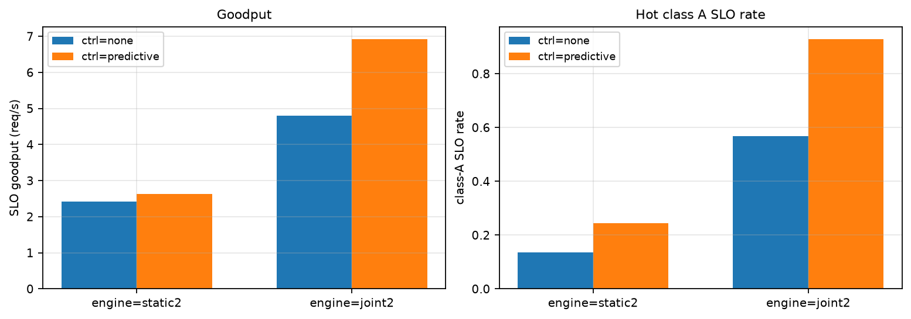
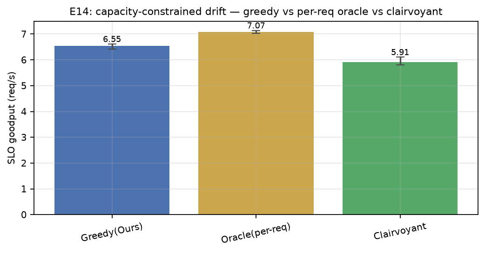
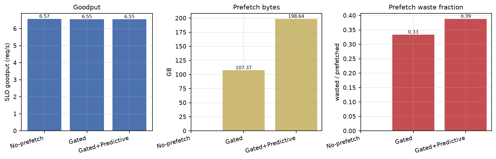
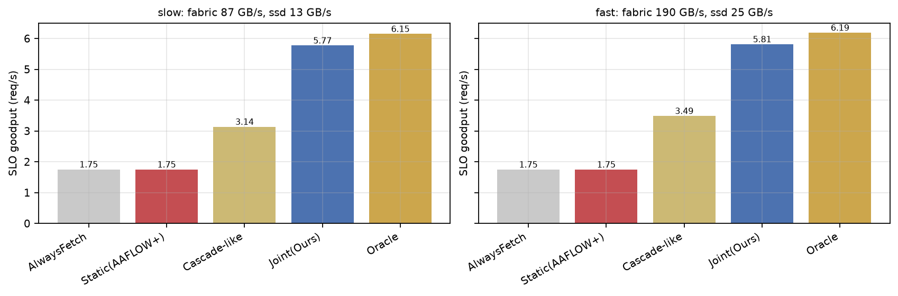

# 实验结果：改进方案 II 四实验（E13 / E14 / E15 / E16）

|  |  |
|---|---|
| 日期 | 2026-09-04 |
| 代码 | `sim/`（`python -m sim.run --exp v4 --seeds 8` 复现） |
| 方案 | [仿真v2局限问题分析与改进方案II-20260904.md](docs/仿真v2局限问题分析与改进方案II-20260904.md)（问题⑥⑦⑧⑨） |
| 前提 | 参数现实性已核查（见 E16）；其余同前 |

## 总判决

**四个假设三个被推翻——但每次推翻都产出了比原假设更有价值的结构性结论：**

1. **E13（引擎×控制 2×2）H6 推翻，产出本轮最重要发现**：控制器（预测式复制）的收益在**强引擎**（joint2：+2.12 req/s）下远大于弱引擎（static2：+0.20），交互效应 **−1.92**（方向与假设相反）。机制：static2 按 nominal 成本选副本，**"看不见"新复制的便宜副本**——存储侧控制与引擎信息能力是**互补品而非替代品**；"引擎自稳挤占控制器收益"的推断不成立，挤占的是弱引擎的收益。
2. **E14（容量约束先知）H7 推翻**：clairvoyant − oracle = **−16.4%**（IQR 分离）。连续漂移负载下，未来视线（list-scheduling 均衡）换不来 goodput，反而为"预留均衡"牺牲单请求最优；其收益形态仍是排队峰值（E9b：羊群峰值 4.0 vs 8.0）。注：先知为启发式而非离线最优，见局限。
3. **E15（会话预测预取）H8 推翻**：浪费率 predictive/gated = **1.16**（验收线 ≤0.5）。类级轮间隔 EMA 无法区分**同类内混合速度的会话**（快慢会话的间隔被平均成 ~4s < horizon，过滤形同虚设）；预测必须下沉到**会话身份级**。
4. **E16（参数档位）H9 达成**：慢档（ssd 13 / fabric 87 GB/s）与快档（fabric 190）下策略排序**完全一致**（oracle > joint > cascade > alwaysfetch ≈ static），结论对现实参数档位稳健；占位参数经联网核查全部落在公开实测区间内。

---

## E13：引擎能力 × 存储侧控制 2×2（问题⑥）

场景同 E8（热点类单副本 + GPU bg 70% + 命中 85%）：

| 引擎 | 控制器 | goodput | 热点类A SLO率 | P95 | 复制次数 |
|---|---|---:|---:|---:|---:|
| joint2 | none | 4.80 | 0.567 | 1.56 s | 0 |
| joint2 | predictive | **6.92** | **0.929** | 1.14 s | 2.5 |
| static2 | none | 2.42 | 0.135 | 261.8 s | 0 |
| static2 | predictive | 2.63 | 0.243 | 83.1 s | 6.5 |

**读法**：

- 控制器效应：joint2 **+2.12 req/s**、static2 仅 +0.20；交互效应 **−1.92**——与 H6 预期完全相反。
- 机制解释：static2 选副本按 nominal 带宽静态成本，复制到空闲节点后**名义成本不变**，它继续涌向原副本（且其复制次数反而更多：6.5 次——控制器在"救不回来的引擎"上反复尝试）；joint2 通过 quote 即刻感知新副本便宜，立刻分 流。
- 结论改写：**"何时需要存储侧控制"的前置条件不是引擎弱，而是引擎具备读取新状态的信息通道**——控制（改变状态）与感知（利用状态）必须成对建设。这直接反驳了"引擎够强就不需要存储侧控制"的直觉，也指出只做存储侧优化、不改引擎信息接口的方案注定低效。

## E14：容量约束下的先知对照（问题⑦）

E11 场景（容量受限 + 6 类 + 热度漂移、无控制器）：

| 策略 | goodput（中位 [IQR]） | P95 |
|---|---|---:|
| Greedy（joint2） | 6.55 [6.41, 6.62] | 1.19 s |
| Oracle（逐请求·完美信息） | **7.07 [7.02, 7.14]** | 1.19 s |
| Clairvoyant（+未来视线） | 5.91 [5.81, 6.11] | 1.56 s |

**读法**：

- H7 被推翻且 IQR 分离：先知 −16.4%。list-scheduling 的"预分配均衡"在连续到达流中持续把当前请求推给次优资源（为想象中的未来让路），而未来请求到来时会重新决策，让掉的容量白让。
- 与 E9b 合并成完整结论：**未来视线的收益边界极窄**——同步 burst 中它与逐请求贪心持平（−0.9pp），连续负载中为负（−16%）；它真正改善的是排队峰值（羊群 4.0 vs 8.0）。"全局协同"的价值应该定位在**稳定性目标**（峰值/振荡），而非吞吐目标。
- 诚实边界：本 clairvoyant 是启发式；真正的离线最优（小规模可解的分配问题）未实现，不排除存在正收益的离线解——见局限。

## E15：会话预测预取（问题⑧）

混合速度会话（同类内快 0.6s / 慢 8s 各半）：

| 变体 | goodput | P95 | 预取字节 | 浪费率 |
|---|---:|---:|---:|---:|
| No-prefetch | 6.57 | 0.70 | — | — |
| Gated | 6.55 | 0.82 | 107 GB | 33.3% |
| Gated+Predictive（类级） | 6.55 | 0.73 | 199 GB | 38.8% |

**读法**：

- H8 推翻：浪费率不降反升（1.16×）。根因是**预测粒度**：类级轮间隔 EMA 把同类内快慢会话平均（0.6 与 8 的均值 ~4.3s < horizon 5s），过滤器几乎全放行，还因为快会话高频触发而多预取了 86% 的字节。
- 结论：**会话预测必须绑定会话身份（session id）**，类级统计在混合速度负载下无效——这是第三轮的直接工作项（E17）。

## E16：参数档位敏感性（问题⑨）

| 策略 | 慢档（ssd 13 / fabric 87 GB/s） | 快档（ssd 25 / fabric 190 GB/s） |
|---|---:|---:|
| AlwaysFetch | 1.75 | 1.75 |
| Static(AAFLOW+) | 1.75 | 1.75 |
| Cascade-like | 3.14 | 3.49 |
| **Joint(Ours)** | **5.77** | **5.81** |
| Oracle | 6.15 | 6.19 |

**读法**：

- 两档排序**逐位一致**（oracle > joint > cascade > alwaysfetch = static）；量级差异 <11%（cascade 档位间差最大，因其 fetch/recompute 切换点随带宽移动）。
- 结合设计文档 II 的参数核查表：占位参数（prefill 表 ≈ H100 实测 0.2–0.4s、ssd 13–27 GB/s、fabric 87–190 GB/s）均在公开实测区间内，**既有全部相对结论可视为参数现实**；唯一系统性偏差是 path_lat 高估（2–8ms vs RDMA 实测 ~0.01–0.1ms），但其为估计中的加性小项，敏感性由两档检验覆盖。

## 与验收标准对照（汇总）

| 验收项 | 结果 |
|---|---|
| ⑥ 2×2 全表 + 交互效应量化 | ✅ 交互 −1.92（方向与 H6 相反，机制已解释） |
| ⑦ 三策略全表 + 差的符号与 IQR 分离 | ✅ −16.4%，IQR 分离（H7 推翻） |
| ⑧ waste ≤ 0.5 × gated 且 goodput 不降 | ❌ 1.16×（类级预测无效，需会话身份级） |
| ⑨ 排序不变 + 优势区间给出 | ✅ 逐位一致 |

## 局限与下一步

1. **E15 的会话身份级预测（E17）**：trace 与 Request 需携带 session id，预取器按会话自身间隔判断；这是 H8 的正确实现路径。
2. **E13 机制的直接验证**：补一格"static2 + 动态副本选择"（静态成本引擎但副本选择走 quote）——若其控制器收益接近 joint2 档，则"互补性=副本可见性"的机制归因成立。
3. **离线最优先知**：对小规模请求窗口解离线分配（MILP/回溯），确认"未来视线为负"不是启发式的实现缺陷。
4. 标定仍待硬件实测填参（`tools/calibrate.py` 就绪）。

---

# 附录：通俗版解读

- **E13 给仓库添新货架，谁受益？** 会看报价的司机（joint2）立刻用上新货架，多拉 2.1 单/秒；只背说明书的司机（static2）根本不知道新货架更空，还在旧货架排队——白添。**结论：改仓库之前，先确认司机的收音机（信息接口）是好的。**
- **E14 预知未来有用吗？** 在连续车流里，"给后来的车让路"的先知司机反而跑得慢（−16%）——后来的车自己会挑路，你让的路白让。先知的真本事是把高峰压平（排队峰值减半），不是拉高总运量。
- **E15 按"这类货最近买得勤不勤"来预取，为什么没省？** 因为同一类货里既有天天来的常客也有一年来一次的散客，平均一下人人都像常客。**预测要认人（会话），不能只认货（类）。**
- **E16 换成现实的快慢仓库都试了一遍**：排名纹丝不动。之前所有"谁比谁好"的结论，在真实参数档位下站得住。

## 如果只记三句话

1. **控制与感知是成对的基础设施**：只建存储侧控制、不给引擎信息通道，收益趋近于零（E13）。
2. **全局协同的KPI应是稳定性而非吞吐**：未来视线在 burst 里持平、在连续流里为负，但排队峰值始终减半（E9b+E14）。
3. **预测要认会话，参数核查已过关**：类级预测无效（E15），策略排序对现实参数档位完全稳健（E16）。
