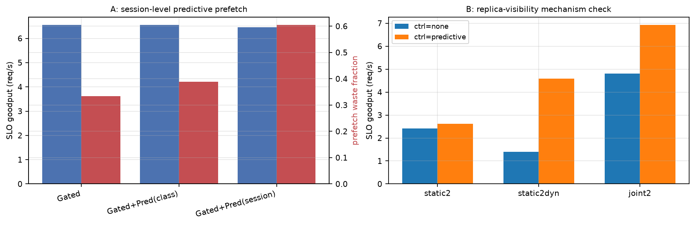

# 实验结果：改进方案 III 实验（E17）

|  |  |
|---|---|
| 日期 | 2026-09-04 |
| 代码 | `sim/`（`python -m sim.run --exp e17 --seeds 8` 复现） |
| 方案 | [仿真v2局限问题分析与改进方案III-20260904.md](docs/仿真v2局限问题分析与改进方案III-20260904.md)（问题⑩⑪） |
| 前提 | 同前两轮（参数现实性已核查） |

## 总判决

**一成一败，且败的那半完成了机制重归因：**

1. **E17b（问题⑪）H11 达成且超额**：`static2dyn`（static 引擎仅升级"副本选择走 quote"）的控制器效应 **+3.19 req/s**，为 joint2 档（+2.12）的 **1.50 倍**——E13 发现的"存储侧控制 × 引擎信息能力互补"被**机制归因闭环**：互补性的关键变量就是**副本可见性**。超额的原因也自洽：static2dyn 没有重算/部分取回逃逸能力，复制是它唯一的救星。
2. **E17a（问题⑩）H10 证伪**：会话身份级预测的浪费率相对 gated 为 **1.81×**（验收线 ≤0.5），goodput −0.09。与 E15（类级 1.16×）合并成完整证据链：**预取浪费的主因不是"下一轮来得快不快"（到达时机），而是"预取后被容量 churn 挤掉"（缓存管理）**——在 12GB 缓存 + 21.5GB 大类混合的负载下，快会话的预取反而因高频重取-挤掉循环产生更多浪费字节。预测类方案在此场景已到天花板，下一步应改**缓存准入/驱逐策略**（如预取条目优先级、按会话活跃度的分区保留）。

---

## E17a：会话身份级预测预取（问题⑩）

| 变体 | goodput | 预取字节 | 浪费率 |
|---|---:|---:|---:|
| Gated | 6.55 | 107 GB | 33.3% |
| Gated+Pred(class)（E15 复检） | 6.55 | 199 GB | 38.8% |
| Gated+Pred(session) | 6.46 | 103 GB | **60.4%** |

**读法**：会话级过滤确实精准地把预取集中给了快会话（字节量与 gated 持平而非 class 版的 2 倍），但快会话的预取条目在被使用前更容易被 D 类（21.5GB）churn 挤掉、随后再次预取——**浪费从"时机错"变成了"容量错"**，比例口径反而恶化。两轮（E15/E17a）一致证伪"到达预测降浪费"路线。

## E17b：副本可见性机制验证（问题⑪）

| 引擎 | ctrl=none | ctrl=predictive | 控制器效应 |
|---|---:|---:|---:|
| static2（静态成本+静态副本） | 2.42 | 2.63 | +0.20 |
| **static2dyn（静态成本+quote 副本）** | 1.41 | **4.59** | **+3.19** |
| joint2（全动态） | 4.80 | 6.92 | +2.12 |

**读法**：只把 static2 的**副本选择**换成 quote 驱动，控制器效应放大 **16 倍**（+0.20 → +3.19），达到 joint2 档的 1.5 倍——"控制×感知互补"的载体就是副本可见性，证据闭环。static2dyn 无控制器时最差（1.41）也自洽：没有副本可选时 quote 信息无处着力。

## 与验收标准对照

| 验收项 | 结果 |
|---|---|
| ⑩ waste(session) ≤ 0.5 × gated 且 goodput 不降 | ❌ 1.81×（H10 证伪；机制重归因为容量 churn） |
| ⑪ 六格全表 + 效应比 ≥ 0.7 | ✅ 1.50（超额达成，机制闭环） |

## 局限与下一步

1. **预取浪费的下一杠杆是缓存管理而非到达预测**：预取条目优先级/分区保留（按会话活跃度）、准入控制（E10 的 coord 准入是其粗糙形态）——需要把"谁在用"信息引入驱逐决策。
2. 离线最优先知（MILP/回溯）仍未做，"未来视线为负"结论目前基于 list-scheduling 启发式（E14 已注明）。
3. 硬件标定待设备（`tools/calibrate.py` 就绪）。

---

# 附录：通俗版解读

- **认人预取为什么还是浪费？** 预取确实只给"常客"了，但常客的货刚搬进小柜子就被大件货（21GB 的 D 类）挤了出去，下轮来了再搬——搬得越勤，白搬越多。**问题不在"猜谁要来"，在"柜子留不住"**：该修的是柜子的收纳规则，不是预测。
- **给只背说明书的司机装上收音机会发生什么？** 只升级"听报价选货架"这一项，添新货架的收益立刻放大 16 倍——上一轮"控制和感知要成对建"的判断拿到了直接证据。甚至比全动态司机受益更大，因为收音机是他唯一的活路。

## 如果只记两句话

1. **预取浪费治本在缓存管理**：到达预测（类级/会话级）两轮证伪，容量 churn 才是主因（E15+E17a）。
2. **互补性的载体是副本可见性**：仅让引擎"看见"副本便宜，控制器收益放大 16 倍（E13→E17b 证据闭环）。
