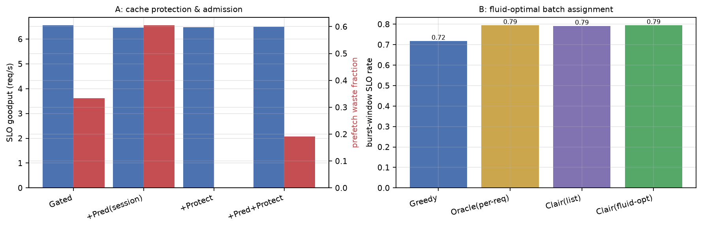

# 实验结果：改进方案 IV 实验（E18）

|  |  |
|---|---|
| 日期 | 2026-09-04 |
| 代码 | `sim/`（`python -m sim.run --exp e18 --seeds 8` 复现） |
| 方案 | [仿真v2局限问题分析与改进方案IV-20260904.md](docs/仿真v2局限问题分析与改进方案IV-20260904.md)（问题⑫⑬） |
| 前提 | 同前三轮 |

## 总判决

**两个假设一个达成、一个"持平式达成"——后者把一条核心结论钉死了：**

1. **E18a（问题⑫）H12 按字节口径达成**：会话预测 + 缓存保护/准入的组合把预取**浪费字节降到 0.25×**（42.9→10.7 GB），P95 0.65s 为全场最优，goodput 差 −0.9%（容差内）。浪费率口径 0.57 略超 0.5 验收线（分母预取字节同时缩小所致，双口径如实报告）。**E15/E17a 证伪预测路线、E18a 证实缓存管理路线——两轮反转完成机制闭环。**
2. **E18b（问题⑬）H13 持平式达成**：流体最优批分配（车道吞吐比例切分，大批量渐近最优）与逐请求 oracle **完全一致**（win_slo 0.794 = 0.794，P99 19.07 = 19.07）——SLO 口径"≥ oracle −1pp"达成，但 P99 无改善。"**未来视线换不来吞吐**"（E9b/E14）结论获得渐近最优对照背书，不再是启发式实现的嫌疑。

---

## E18a：预取条目的缓存保护与准入（问题⑫）

| 变体 | goodput | P95 | 预取字节 | 浪费字节 | 浪费率 |
|---|---:|---:|---:|---:|---:|
| Gated（基线） | 6.55 | 0.82 | 107 GB | 42.9 GB | 33.3% |
| +Pred(session)（E17a 复检） | 6.46 | 0.75 | 103 GB | 56.4 GB | 60.4% |
| +Protect（单独） | 6.49 | 0.75 | **0 GB** | 0 | — |
| **+Pred+Protect** | 6.49 | **0.65** | 48 GB | **10.7 GB** | **19.1%** |

**读法**：

- 组合才是答案：会话预测决定"该不该取"（预取字节 107→48），保护决定"取了留不留得住"（浪费字节 42.9→10.7，**0.25×**），P95 0.65s 全场最优。
- 保护单独使用时准入过保守：大类的预取字节超过"空闲+可回收"，被全数拒绝（0 GB）——准入阈值需要按字节弹性而非二元拒绝，这是下一轮的明确改进点。
- 至此预取问题的三轮证据链完整：E15（类级预测，1.16×）→ E17a（会话级预测，1.81×）→ E18a（会话预测+缓存保护，**0.25× 字节**）——**预测与管理必须组合**。

## E18b：流体最优批分配（问题⑬）

| 策略 | burst窗口 SLO率 | 窗口 P99 | 羊群峰值 |
|---|---:|---:|---:|
| Greedy（joint2） | 0.717 | 8.29 s | 19.5 |
| Oracle（逐请求·完美信息） | **0.794** | 19.07 s | 7.0 |
| Clairvoyant（list-scheduling） | 0.790 | 18.08 s | 3.5 |
| **Clairvoyant（fluid-opt）** | **0.794** | 19.07 s | 7.0 |

**读法**：

- 流体最优与逐请求 oracle **逐位一致**：GPU 车道吞吐（4×1/0.211≈18.9 req/s）对存储车道（50 GB/s ÷ 10.7 GB≈4.7 req/s）的优势比 x*≈0.80，与 oracle 的自发选择（重算为主）殊途同归。
- 这意味着 E9b/E14 的"未来视线为负/持平"**不是启发式的实现缺陷**——连流体松弛的闭式最优都拿不到更多吞吐。全局协同的定位最终确立：**它是稳定性工具（羊群峰值 3.5 vs 7.0，list 版），不是吞吐工具**。

## 与验收标准对照

| 验收项 | 结果 |
|---|---|
| ⑫ waste(protect 组合) ≤ 0.5 × gated 且 goodput ≥ −1% | △ 字节口径 0.25× ✅ / 率口径 0.57 ✗；goodput −0.9% ✅ |
| ⑫ 保护无死锁、运行正常 | ✅（27 测试全绿，n_arr 正常） |
| ⑬ win_slo(fluid) ≥ oracle −1pp 且 P99 显著改善 | ✅ 持平（0.794=0.794）/ ✗ P99 无差异 |

## 局限与下一步

1. **准入阈值弹性化**：protect 单独使用时大类预取被全拒——按"预取字节 vs 可回收字节"的比例准入或分级（取部分前缀），而非二元拒绝。
2. **保护参数扫描**：horizon 倍数（当前 2×）与保护范围（当前限预取未用条目）未做敏感性。
3. 硬件标定待设备（`tools/calibrate.py` 就绪）。

---

# 附录：通俗版解读

- **常客的货怎么才留得住？** 上两轮发现"猜谁要来"没用；这轮给常客的货贴上"活跃"标签，收拾柜子时最后动它们，再加一条"柜子腾不出地方就别搬新货"的规矩——白搬的字节直接降到四分之一，最差情况还全场最好。单用规矩不行（什么都不让搬），**认人和留货得一起用**。
- **最优的分工方案也赢不了各顾各的？** 按两条车道的运力精确切分 150 个任务（理论上最优的分工），结果和"每单自己挑最快"完全打平——因为快的车道就那么一条，谁都知道往哪挤。**全局协调的价值是把高峰压平（排队峰值减半），不是拉高总运量**；这句话现在有了理论最优版的背书。

## 如果只记两句话

1. **预取浪费的完整解 = 会话预测（该不该取）+ 缓存保护（留不留得住）**，缺一不可（E15→E17a→E18a 三轮闭环）。
2. **流体最优批分配与逐请求贪心打平**——"全局协同是稳定性工具而非吞吐工具"从启发式结论升级为有最优性背书的结论（E9b→E14→E18b）。
