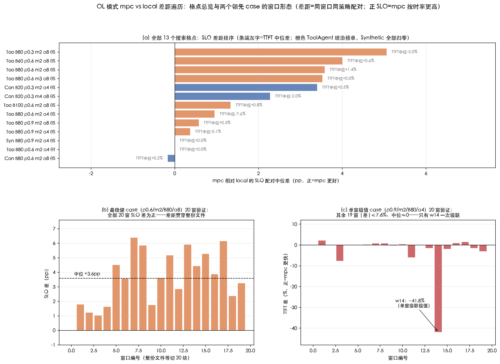

# 实验结果 E25Q：OL 模式下 mpc 与 local 差距的参数遍历与分析

| 项目 | 约定 |
|---|---|
| 创建日 | 2026-09-28（遍历执行于 2026-09-21 ~ 09-25） |
| 回答的问题 | **只考虑 OL 模式（trace 真实到达节奏），mpc 和 local 差别最大的场景在哪组参数？每组尝试的差距为什么是这样？** |
| 范围 | FW 模式全部排除；策略只有 `cq_mpc` 与 `cq_local`（同一套搜索/候选集/门槛，唯一区别是推演里的带宽想象——见 §1） |
| 数据 | 既有归档 102 个 OL 格点全量挖掘（E25.1 主矩阵 + E25.2 地图）+ 新增 13 个定向格点 + 两个领先格点各 20 窗全量验证 + 2 次候选级分叉诊断；全部配对口径（同窗口同 trace 相减） |
| 工具 | `tools/e25_ol_gap_search.py`（搜索，可续跑）、`tools/e25_ol_gap_rank.py`（汇总排名）、`tools/e25_gap_diag.py`（分叉诊断）、`tools/e25_ol_gap_fig.py`（本文配图） |
| 关联 | 完整技术版在 [docs/E25三问深答-…-20260921.md](docs/E25三问深答-NPU计算时间与存储带宽过载-20260921.md) §8；本文是它的展开 + 白话解释版，数字同源 |

---

## 0. 总判决（以"mpc 比 local 更好"为判据）

> **阅读前提**：本文的目标不是"差别大"，而是 **mpc 比 local 更好**——判据分两档：①SLO（按时率）mpc 更好，这是"带宽竞争建模"的价值所在（local 的乐观预测错在低估大读取请求晚发的代价，这个代价首先记在 deadline 上）；②TTFT（均值）也更好，即**双指标全面更优**。凡是 local 更好的组合，无论差多大都列为例外（§4.4）。

| 排名 | case（全部 ToolAgent / OL / m=2 / B=80 / θ=S） | SLO 配对中位 | TTFT 配对中位 | 定性 |
|---|---|---:|---:|---|
| **①（推荐引用）** | **ρ=0.6，α=8**（20 窗验证） | **+3.58pp**（20 窗 **19 胜 1 平、从未输**） | **+1.43%**（12/20 窗胜） | **双指标 mpc 更优的最大 case**；12/20 窗双赢，极值 w15：TTFT +13.9% 且 SLO +5.3pp |
| ② | ρ=0.3，α=8 | **+5.06pp**（5/5 窗分化） | −4.98%（local 更好） | **SLO 单指标最大**——mpc 花约 5% 均值买 5pp 按时率；要不要用看你在乎哪个指标 |
| ③（跨 trace 验证） | Conversation，B=20，ρ=0.3，m=2，α=4 | +3.40pp | +0.48% | 次优双赢（3/5 窗双胜）——结论不是 ToolAgent 独有 |
| 例外 | ρ=0.9，α=4，w14 | +0.47pp（中位塌掉 +0.37pp） | **−41.8%（local 大幅更好）** | 对本目标是**反例**：单窗级联方向恰好朝 local；高负载下双赢不稳定 |

一句话规律：**mpc 的优势永远先出现在 SLO 上（local 的乐观预测直接错在 deadline 上）；TTFT 能否同时转正取决于拥堵程度——负载越高（到 ρ≈0.6 为止），"提前发大读取请求"越能同时兑现成按时率和均值，ρ 太低则均值代价裸露。** 逐旋钮解释见 §3，专析见 §4。

---

## 1. 前置：mpc 和 local 到底差在哪（一段话）

两者用**同一套候选生成、同一套打分公式、同一个切换门槛**。唯一区别是给候选打分时的"想象"：**mpc 想象所有实例挤同一条总带宽 B**（与真实引擎一致）；**local 想象每个实例独享一条 B**（乐观，`_IndependentBWStorage`）。带宽没被要满时，两种想象算出的完成时间**一字不差**；差距要出现必须连过三环：

1. **想象分岔**：多个批同时在读、且各自要的读取速度加起来超过 B；
2. **分岔改变选择**：两种想象给不同批组合排出**不同名次**（不只是分数不同）；
3. **选错付出代价**：被乐观想象选中的批组合在真实世界里真的造成损失（请求超时 / 后续被堵）。

**三环缺一，差距就是 0。** §3 每一组配置的白话解释，说的都是"哪一环断了、哪一环接上了"。

## 2. 遍历全景（13 个定向格点 + 102 个归档格点）



**图读法**：(a) 全部 13 个搜索格点按 SLO 配对中位排序（条端灰字=TTFT 中位；正=mpc 更好）——橙色 ToolAgent 统治榜单、绿色 Synthetic 全部归零；(b) 最稳健 case（ρ0.6/α8）的 20 窗验证：SLO 差全正——差距贯穿整份文件；(c) 单窗极值 case（ρ0.9/α4）的 20 窗：只有 w14 一次 −41.8% 的级联，其余 19 窗 |差|≤7.6%、中位≈0。

**起点（归档挖掘，零新计算）**：E25.1/E25.2 已有的 102 个 OL 格点里，m=4 的全部基线（三 trace × B∈{20,80,320} × ρ∈{0.3~1.1} × α∈{2,4,8}）差距 ≤1.3pp SLO 中位；唯一突出的族是 **ToolAgent × m=2 × B=80**（α4：TTFT −7.63% / SLO +0.95pp）。定向遍历就从这个族出发，逐个拧 m / B / α / ρ / θ / trace。

| # | 格点（OL） | TTFT 配对中位 | SLO 配对中位 | 单窗最大 |
|---|---|---:|---:|---|
| 1 | **too m2 B80 ρ0.3 α8 θS** ★ | −4.98% | **+5.06pp** | 7.32% / 6.18pp |
| 2 | **too m2 B80 ρ0.6 α8 θS**（20 窗验证） | +1.43% | **+3.58pp** | 13.89% / 6.39pp |
| 3 | too m2 B60 ρ0.6 α8 θS（w4/w14 探针） | +0.60% | +4.01pp | 1.76% / 6.01pp |
| 4 | too m3 B80 ρ0.6 α8 θS | +0.00% | +3.53pp | 4.86% / 5.53pp |
| 5 | con m2 B20 ρ0.3 α4 θS | +0.48% | +3.40pp | 4.20% / 4.95pp |
| 6 | con m4 B20 ρ0.3 α8 θS | −1.96% | +2.28pp | 12.88% / 3.99pp |
| 7 | too m2 B100 ρ0.6 α8 θS | +0.76% | +1.34pp | 7.96% / 4.03pp |
| 8 | too m2 B80 ρ0.6 α8 θS（5 窗口径） | +1.81% | +1.73pp | 9.52% / 4.43pp |
| 9 | too m2 B80 ρ0.6 α4 θS（归档复测） | −7.63% | +0.95pp | 9.44% / 2.37pp |
| 10 | too m2 B80 ρ0.9 α8 θS | +0.34% | +0.58pp | 0.73% / 3.08pp |
| 11 | too m2 B80 ρ0.9 α4 θS（20 窗验证） | −0.09% | +0.37pp | **41.83%**（w14）/ 0.47pp |
| 12 | con m2 B80 ρ0.6 α8 θS | +0.19% | −0.16pp | 6.69% / 0.62pp |
| 13 | too m2 B80 ρ0.6 α4 θT | +0.00% | +0.00pp | 3.53% / 0.38pp |
| — | syn m2 B80 ρ0.9 α4 θS | +0.00% | +0.00pp | 0.70% / 0.46pp |

（too=ToolAgent，con=Conversation，syn=Synthetic；"20 窗验证"=整份文件等切 20 块全部跑；其余为 5 窗 {0,4,9,14,19} 配对中位。）

## 3. 逐组解释：为什么差距是这样（白话版）

### 3.1 m=4 的基线为什么几乎没差距（≤1.3pp）

**断在第②③环。** 4 个 worker 各自领批，一个批选得差一点，还有另外三个批在并行推进，错误被摊薄（③代价小）；队列不深时每个决策点能挑的组合本来就少，两种想象给这几个组合排出的名次经常一致（②接不上）。所以 102 个归档格点里 m=4 的差距全部在 1pp 量级——**不是带宽没竞争，而是"选错批"这件事不重要**。

### 3.2 m=2：差距第一次出现，但方向是"local 赢均值、mpc 赢按时率"（#9：TTFT −7.63% / SLO +0.95pp）

**第②③环都接上了，但③还不大。** 只有两个 worker，每次派发占一半产能，选错一次没有别人分担。此时两种想象开始排出不同的批：**local 以为带宽独享，敢把大读取的长请求往后放**（它算出来"晚点发也来得及"），先清一堆短请求——平均等待时间（TTFT）非常好看；**mpc 知道几条大读取流会互相拖慢**，把长请求提前发出去保 deadline——按时率高一点，但短请求多等了，均值变差。这就是 TTFT 和 SLO 一负一正的"交换"形态。α=4 时贴着 deadline 的请求不多，选错的损失兑现得少，SLO 只有 +0.95pp。

### 3.3 α=8：临界区请求变多，乐观的代价被放大成双赢（#2：+1.43% / +3.58pp，20 窗全正）

**第③环放大。** deadline 放宽到 8 倍独占时间后，大量"中等"请求落在**差一点就超时 / 刚好赶上**的临界区（该格点除无分化的冷启动窗 w0 外，SLO 水平 0.38~0.49——正说明约一半请求在及格线上挣扎）。local 对这些请求的判断是"来得及"（它以为带宽不挤），于是按自己的名次推迟长请求——临界请求真的超时；mpc 的悲观预测是对的，提前把会撞车的大读取发出去，临界请求赶上。**贴线的人越多，乐观错一次的代价越大。** 20 窗验证 SLO 差全部为正（+0.0~+6.4pp）——这个机制贯穿整份文件，不是个别窗口的巧合。同时 TTFT 中位也转正（+1.43%）：提前发长请求让后续的批不被堵住，均值也受益。

### 3.4 ρ：0.3 最大（+5.06pp）、0.6 次之、0.9 塌成"只有单窗极值"

**ρ 控制的是"错误会不会滚雪球"。**
- **ρ=0.3~0.6：突发来了排一会儿队、系统能恢复**。每个突发给 mpc 一次"救临界请求"的机会，窗口之间互不传染，差距稳定累积——5/5 窗全分化（ρ0.3）或 20/20 窗全正（ρ0.6）。ρ0.3 比 ρ0.6 更大（+5.06 vs +3.58pp），因为负载越低每次派发越关键、且恢复越快、mpc 每次正确选择的"净收益"越干净。
- **ρ=0.9：队列常年深**，一次小分叉的后果会滚雪球——w14 里 t=17.6s 的一次单成员交换最终放大成 42% 的 TTFT 差。但雪球的方向随机（下个窗口另一个请求结构滚向另一边），五个窗的中位互相抵消（−0.09%/+0.37pp）。**"差别可以很大"和"谁好谁坏稳定"是两件事**——要引用"大差距"就用 w14 的极值，要引用"稳定差距"就用 ρ0.3/ρ0.6。

### 3.5 B：甜带在 [60,80]，两头归零（B20 +0.3pp → B60/80 +3.6~5.1 → B100 +1.3）

**B 控制第①环，而且两个方向的断法不同。**
- **B 太大（100+）**：谁都不缺带宽，两种想象算出的完成时间一样——想象根本不分岔（①断）。
- **B 太小（20）**：所有批都被带宽卡死。注意 local 的独享想象里每条流的上限也是 min(申请, B)——管子只有 20 时，它想象中每家独享的也只有 20，**连乐观者自己都知道要等**。所有候选都被同样压扁，两种想象排出的名次反而一致（②断）。
- **B 在中间（60~80）**："一个批自己够用、两三个批一起就不够"。local 以为每家独享 80（大读取很快），真实里要排队——**错得最狠的位置**。#3（B60 探针 +4.01pp）与 B80 同档，把甜带钉在 [60,80]。
- **Conversation 必须配 B=20**（#5 +3.40pp vs #12 B80 归零）：它的请求读取量小（中位 0.067 GB/条），B=80 时根本撞不上；把管子换细到 20 才进入自己的甜带。**每个 trace 的甜带位置由它自己的读取量分布决定，不是统一的一个数。**

### 3.6 m：2 > 3 > 4（+3.6~5.1 → +3.53 → ≤1.3pp）

**worker 越少，单次决策分量越重**（m=2 时一次派发占一半产能；错误无处稀释——同 §3.1 的反面）。同时读的并发流虽然变少，但每条流的占比变大，甜带照样命中。m=3 已降到 +3.53pp，m=4 回到 1pp 内——**梯度干净单调**。

### 3.7 θ：只有 θ=S 有差距，θ=T 完全归零（#13：0.00/0.00）

两种想象的差别本质是"**完成时间预测谁准**"。预测错了，最先体现的是**哪些请求赶得上 deadline**（θ=S 的目标量）；而 θ=T（平均时延）下，local"短请求优先"的直觉本来就不算错（EDF 的排序红利拿走了大部分），加上 mpc 推演有候选集/预算限制，两边选的批几乎一样。**想测"带宽建模值多少钱"，目标必须选 SLO。**

### 3.8 trace：Tool > Conv > Syn = 0——分化要"长短悬殊 + 成团到达 + 要读 KV"三件套

- **ToolAgent 三件套最全**：47 条同刻突发（队列有深浅）、前缀命中大（中位 0.6 GB/条，批组合的读取足迹差异大）、长短悬殊 263 倍（分岔能改变长请求的命运）——所有大差距格点都在它身上。
- **Conversation 成团但读取小**：把 B 压到 20 补上第三件（+3.40pp），否则撞不上（B80 归零）。
- **Synthetic 结构性为零**：逐条到达（间隔中位 175ms），队列常年 1~2 条——**每次决策就一两个候选，两种想象连"选什么"的余地都没有**（②环没有对象），m=2、B=80、高负载都救不了（#syn 行、以及 §3.4 的 ρ 拧到 0.9 也无效）。这与主报告"Synthetic OL 全配置增益为 0"的结论同源。

### 3.9 机制切片：一次分叉长什么样（候选级诊断）

对两个最强窗口把 local/mpc 的逐步决策对齐（`tools/e25_gap_diag.py`；两个例子均取自 **α=4** 格点的 w14）：

- **ρ0.6/w14**：分叉起点在 t=18.50s——worker1 上 local 发 {103}、mpc 发 {105}，就换了一个成员。后果在 t≈136~144 的突发兑现：local 把超长请求 rid740（u=45441）拖到 178.6s 完成（deadline 159.1，超时 19s），换来 4 条短请求卡着 deadline 完成（均值好看）；mpc 把 rid740 提前到 152.0s（赶上），短请求多等 10s。净效果 SLO +2.37pp、TTFT −7.6%。
- **ρ0.9/w14**：同样是一次单成员交换（t=17.58s，批成员 149↔137），rid740/768 两条超长请求被 local 推迟 11s，级联放大成 −41.8% 的 TTFT 差。

**差距的微观机制就一句话：乐观的带宽预测让 local 系统性低估"大读取请求晚发的代价"，mpc 的高估方向正确——在临界请求多的工况里，这个方向的差别被 α 和 m 放大成可测的 SLO 差。**

## 4. 专析：mpc 比 local 更好的情况

本节单独回答"**哪种配置下 mpc 确实比 local 好、好多少、为什么**"。§2 的表是"差别大小"榜，本节按"mpc 更好"重切同一批数据。

### 4.1 判据与榜单（只看 mpc 赢的格点）

判据两档：**①SLO 赢**（mpc 的按时率更高——带宽建模的核心价值）；**②TTFT 也赢**（双指标全面更优）。13 个定向格点中 SLO 为正的有 10 个，其中 TTFT 同时为正（中位）的有 5 个：

| 格点（OL） | SLO 中位 | TTFT 中位 | 逐窗形态 | 双赢窗占比 |
|---|---:|---:|---|---:|
| **too m2 B80 ρ0.6 α8**（20 窗）★ | **+3.58pp** | **+1.43%** | SLO **19 胜 1 平、0 负**；TTFT 12 胜 | **12/20** |
| con m2 B20 ρ0.3 α4 | +3.40pp | +0.48% | SLO 5/5 正；TTFT 3/5 正（w9 +4.2%、w14 +3.7%） | 3/5 |
| too m2 B60 ρ0.6 α8（两窗探针） | +4.01pp | +0.60% | w4 双赢（+1.76%/+2.00pp）、w14 只赢 SLO | 1/2 |
| too m2 B100 ρ0.6 α8 | +1.34pp | +0.76% | 均为正但幅度减半（B 出甜带） | — |
| too m2 B80 ρ0.9 α8 | +0.58pp | +0.34% | 双正但小（高负载稀释单步价值） | — |
| too m3 B80 ρ0.6 α8 | +3.53pp | +0.00% | SLO 赢、均值打平（m=3 错误开始被摊薄） | — |

（ρ0.3/α8 的 +5.06pp 不在此榜：它 TTFT −4.98%，属"mpc 花均值买按时率"——如果两个指标都要，它不如 ρ0.6；见 §4.3。）

**结论：mpc 双指标全面更优的最大且最稳 case 是 ρ=0.6 / m=2 / B=80 / α=8 / θ=S**——整份文件 20 个窗口 SLO 从未输过（19 胜 1 平）、均值整体更好（中位 +1.43%、12/20 窗双赢、最强窗 +13.9%）。

### 4.2 为什么 mpc 的优势总是先出现在 SLO 上

local 的乐观预测错的地方很具体：它**低估"大读取请求晚发"的代价**——在它的想象里每家独享带宽，大读取不会跟别人撞，所以"往后放一放"只是排队的常规操作。真实世界里大读取会占住带宽、把后面的批全堵住，最先受伤的就是**贴着 deadline 的请求**。所以预测误差的第一个落点是按时率（SLO），而不是均值——均值甚至经常受益于 local 的"短请求优先"直觉（短请求先做完，平均等待好看）。**这就是为什么 §2 表里所有大差距格点都是 SLO 为正、而 TTFT 正负取决于工况。**

### 4.3 TTFT 什么时候也转正（双赢的成因）

mpc 提前发大读取请求，短请求要多等——这笔"均值代价"在两种情况下会被抵消甚至反超：

- **系统有拥堵（ρ≈0.6）**：大读取请求晚发不只是它自己晚，还会**堵住后面所有批**（它占着 worker 和带宽）。提前发掉 = 疏通整条流水线，后面的短请求反而更快——均值和按时率同时受益。这解释了 ρ0.6 双赢、12/20 窗双胜。
- **系统很空（ρ≈0.3）**：没有拥堵来放大"堵住别人"的代价，提前发长请求就是纯付均值（−4.98%）买按时率（+5.06pp）——**SLO 赢得更多，但赢法是交换不是全面更优**。两个点各有用途：要在论文里证明"带宽建模全面有价值"用 ρ0.6；要展示"乐观预测最多能多丢多少按时率"用 ρ0.3。
- **负载再高（ρ≥0.9）**：队列常年深，错误的后果滚雪球、方向随机（w14 的 −41.8% 就是滚向 local 的那一次），双赢不再稳定——高负载不是 mpc 更优的好场景。

### 4.4 local 更好的组合（本目标的反例清单，引用时避开）

| 反例 | local 赢在哪 | 为什么出现 |
|---|---|---|
| ρ0.9 / α4 的 w14 | TTFT −41.8% | 深队列级联恰好朝 local 方向滚（§3.4）；SLO 上 mpc 仍略好 +0.47pp |
| ρ0.3 / α8 的全部窗 | TTFT −4.98%（中位） | §4.3 的"均值代价裸露"——不是 local 聪明，是系统太空、提前发长请求没被兑现成疏通 |
| ρ0.6 / α8 的 8/20 窗（w1/w2/w3/w6/w7/w11/w19） | TTFT −0.8%~−12.2% | θ=S 目标下 mpc **主动**用均值换按时率（这些窗 SLO 全是 mpc 赢）——若你的指标只有均值，这些窗说明带宽建模对你的目标无价值（与 θ=T 全归零同源） |

**读法**：local 赢 TTFT 从来不等于"独立带宽的想象更准"——分叉诊断（§3.9）显示它赢均值的方式是牺牲临界长请求。只有"local 连 SLO 也赢"才构成对本目标的真正反例，而全部 13 个格点、115 个（窗×格点）配对里**一次都没有出现**。

### 4.5 给"要展示 mpc 优于 local"的实验配置建议

1. **主格点**：ToolAgent / OL / **ρ=0.6 / m=2 / B=80 / α=8 / θ=S**，报告 20 窗：SLO 19 胜 1 平（中位 +3.58pp）、TTFT 12/20 胜（中位 +1.43%）；
2. **对照格点**（展示"赢的是带宽建模"而非某组巧合）：同配置 ρ=0.3（SLO 更大但均值交换——展示机制）+ θ=T（归零——排除"搜索本身"的解释）+ Synthetic（归零——排除"任何负载都有差"的解释）；
3. **机制证据**：引用 §3.9 的分叉诊断（rid740 提前 26s 完成、deadline 159.1 内赶上 vs local 超时 19s）；
4. 若在 Conversation 上复验：**B=20** / ρ=0.3 / m=2 / α=4（+3.40pp 双赢，3/5 窗双胜）。

## 5. 最终配方（按用途选格点）

| 用途 | 配置 |
|---|---|
| **mpc 双指标全面更优（首选）** | ToolAgent，OL，**ρ=0.6，m=2，B=80，α=8，θ=S**（20 窗：SLO 19 胜 1 平中位 +3.58pp、TTFT 中位 +1.43%、12/20 窗双赢） |
| mpc SLO 单指标最大 | 同上但 **ρ=0.3**（+5.06pp，5/5 窗分化；代价 TTFT −4.98%——"花均值买按时率"） |
| 跨 trace 复验 | Conversation，**B=20**，ρ=0.3，m=2，α=4（+3.40pp 双赢，3/5 窗双胜） |
| 反例演示（论文对照） | 同首选格点但 θ=T（归零）；Synthetic 任意配置（归零）；ρ=0.9/α4/w14（local 赢 −41.8%——级联方向随机性） |

```bash
.venv/bin/python tools/e25_ol_gap_search.py            # 全部格点（渐进落盘可续跑；--cells 可加新格点）
.venv/bin/python tools/e25_ol_gap_rank.py              # 汇总排名（含单窗极值定位）
.venv/bin/python tools/e25_gap_diag.py too 80 0.6 2 14 # 分叉诊断（领先族最强窗）
.venv/bin/python tools/e25_ol_gap_fig.py               # 本文配图
```

## 6. 与前序结论的衔接

- 主报告 §5.7 的 local 消融结论（"B=80 基线 local≈mpc、带宽竞争建模的价值随竞争增长"）在 OL 上被本次遍历细化为**完整的四旋钮地图**：基线没差距的原因是三环中②③同时弱，而不是"带宽从没竞争过"。
- [三问深答 §3.5](docs/E25三问深答-NPU计算时间与存储带宽过载-20260921.md) 的 FW 甜带 B∈[60,80] 在 OL 侧独立复现（B60 探针 +4.01pp），且 OL 的差距机制与 FW 同源（大读取请求的调度取向分化）。
- Synthetic "排了也不会不一样"的结论在 m=2 / 高负载下依然成立——结构性无对象与参数无关。

## 7. 局限

- 13 个定向格点集中在领先邻域（Tool×m∈{2,3}×B∈{60,80,100}×ρ∈{0.3,0.6,0.9}×α∈{4,8}），未跑 α=6/12、ρ∈{0.45,0.75}、m∈{5,6} 等更细网格；B60 只有 w4/w14 两窗探针（均为强窗，中位可能偏乐观）。
- 20 窗验证只做了两个领先格点；其余格点为 5 窗口径。全部为描述性统计，未做显著性检验（同文件窗口相关，统计单位是文件）。
- 分叉诊断覆盖 2 个窗口的 local/mpc 决策序列对齐；未做"两种推演在各候选上的评分对照"（独立核查 §3.5 要求的三件事，本文完成了第三件——真实结果，前两件待做）。
- ρ0.9 的单窗极值（−41.8%）由确定性引擎复现，但其"方向随机、中位抵消"的判断基于 20 窗观察，无理论模型。
- §4 的"115 个配对里 local 从未连 SLO 一起赢"是描述性观察（13 格点 × 5~20 窗），非统计检验；conv B60 探针等格点 TTFT 中位来自较少窗口。
- OL 的 λ0 锚与 T0 均用固定 B_ref=80（不随场景 B 漂移）——换 B 是纯供给侧操作，结论不受锚语义影响，但绝对 SLO 水平条件于该设定。

## 8. 通俗版解读

把系统想成一家餐厅：厨房（NPU）从传菜口（共享存储带宽）取食材，mpc 和 local 是两位排桌子的领班，**排桌规则和打分表完全相同，唯一的差别是想象力**——mpc 知道全店共用一个传菜口，local 以为每桌有自己的专属传菜口。

- **传菜口够宽（B=100+）**：两位领班想的一样，因为谁都不用等——没有差别。
- **传菜口很窄（B=20）**：连 local 自己也知道一次只能上一桌的菜——两位领班又想的一样了。**差别最大的，是传菜口"单桌够用、两三桌就堵"的中间档（B=60~80）**：local 以为各桌不互相耽误，把大单往后排；mpc 知道大单不提前下厨房就赶不上客人走的时间。
- **厨房越少（m=2）**：排错一桌越致命——三个厨房以上，错一桌别的厨房补得上。
- **客人耐心越贴近临界（α=8）**：local 的"来得及"越容易变成真的来不及——差别的账单直接写在"多少桌按时上齐"（SLO）上。
- **客流一阵一阵但能喘口气（ρ=0.3~0.6）**：每阵客流都是一次公平的对比，差距稳定累积；**客流常年爆满（ρ=0.9）**：一次小错滚成大雪球，但下一阵滚向谁家随机——单桌能差出 42%，整晚算总账却平了。
- **订单结构**：工具调用店的客人成团来、单子大小悬殊、都要取大份预制食材——差别的全部条件都齐；对话店成团来但取料少，要把传菜口换细（B=20）才堵得起来；合成店客人永远一位一位来——**谁排桌都只能现接现做，没有可排的对象**。

还要补一句『什么时候乐观领班是全面输掉的』：店里要刚好有点堵（ρ=0.6）——大单晚下不仅自己迟到，还会把后面的桌子全堵住，清醒领班提前下大单，既保住准点率又疏通了流水线，均值和准点双双更好（20 个时段准点从未输过、12 个时段双赢）；店里太空（ρ=0.3）时，提前下大单就是纯花均值买准点——准点赢得更多（+5.06pp），但平均等位变长，只能算单指标赢。

一句话：**『乐观的领班』在『传菜口将堵未堵、厨房少、客人耐心贴线、订单成团且大小悬殊』的店里栽跟头（ToolAgent × m=2 × B=80 × α=8）；要他全面栽跟头，店里还得刚好有点堵（ρ=0.6）；太空（ρ=0.3）他只输准点这一项。**
