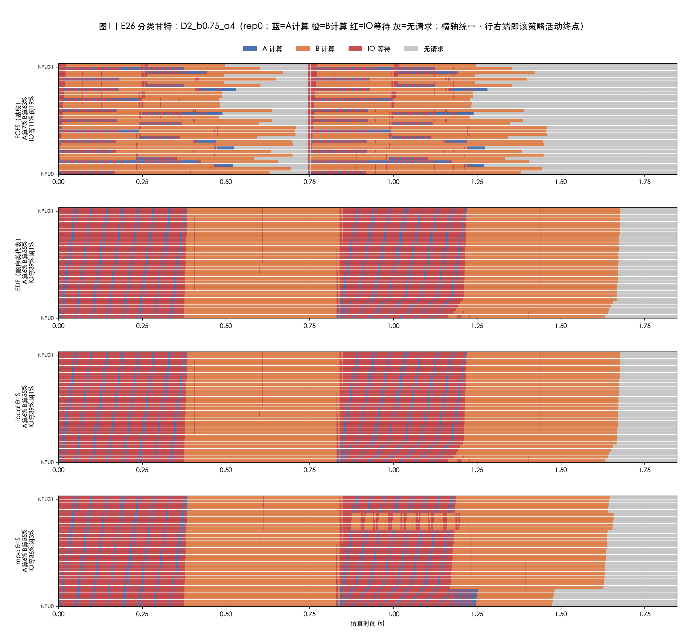
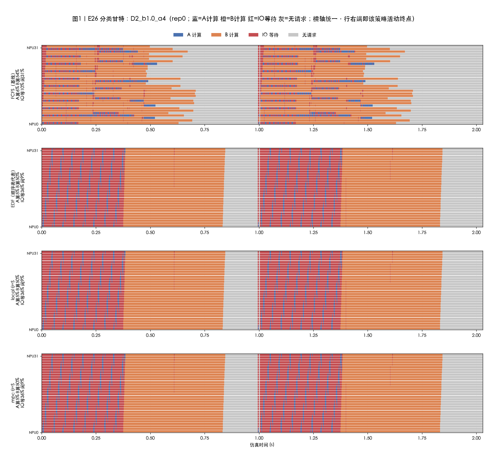
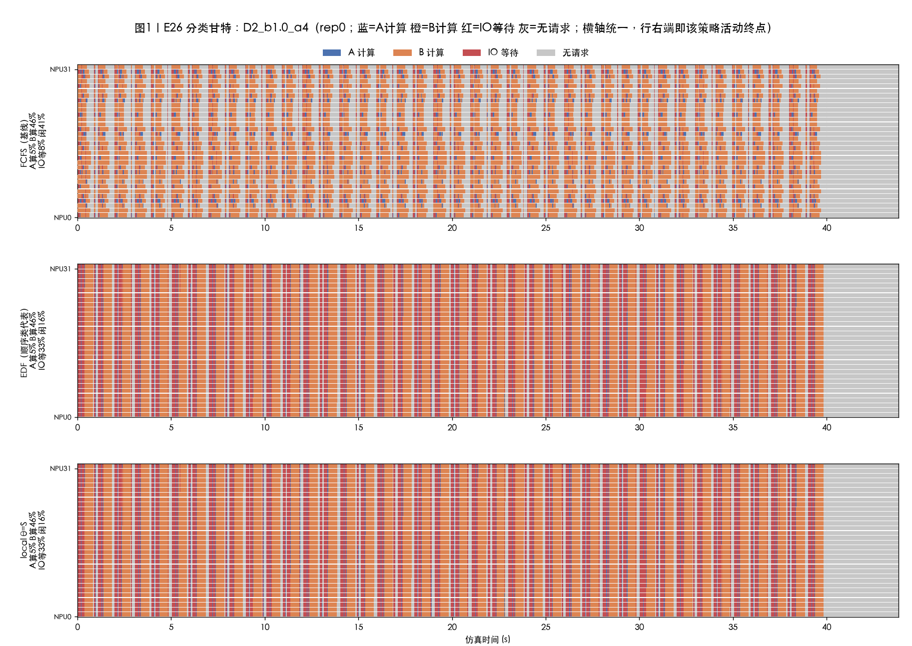
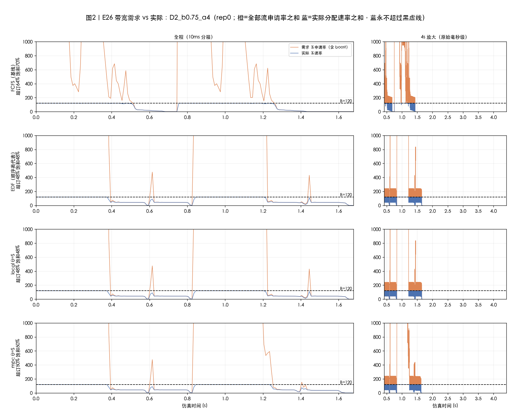
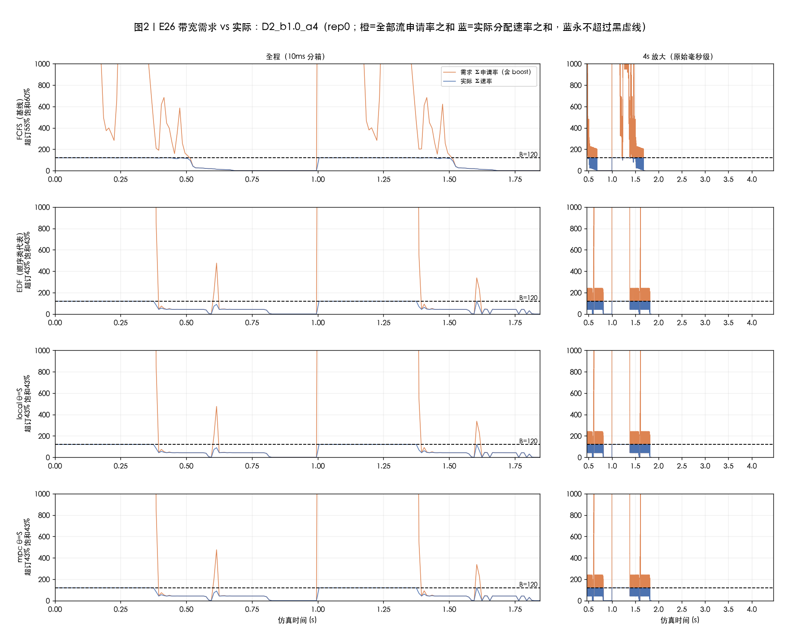
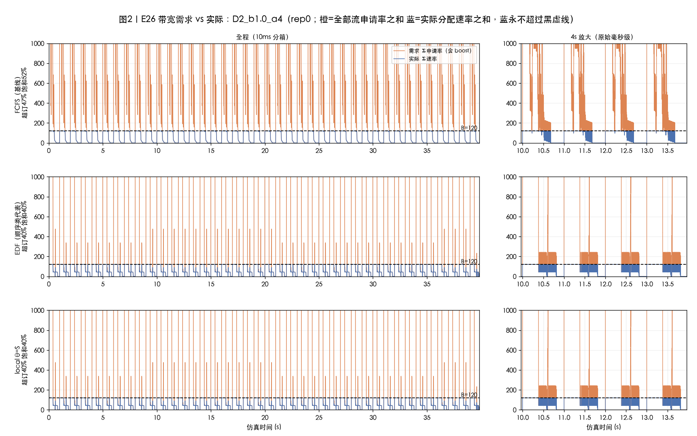

# 实验结果 E26：A/B 双类带宽争抢工况——mpc 与 local 相对 FCFS/EDF 的差距

| 项目 | 约定 |
|---|---|
| 实验日期 | 2026-09-28 立项，2026-09-29 完成（规模调整见 §9） |
| 大纲 | `docs/E26-AB双类带宽争抢实验大纲-20260928.md`（自包含，用户指定工况） |
| 实现 | `sim/experiments/e26_ab.py`；图表工具 `tools/e26_{gantt,bw,tables}.py`；单测 `tests/test_cq_e26.py`（U1–U6 全绿） |
| 工况 | m=32 全局中央队列，L=8，B=120 GB/s，batch=1；A 类（每层读 175.65 MB / 算 6.02 ms），B 类（38.5 MB / 28.59 ms），配比 1:2；α∈{4,8} |
| 主数据规模 | **总量 240 条（80A+160B）**——20260929 用户决策：3840 规模单条 MPC 类 run 在 8 核机器实测 1.5~4 小时，13 小时未出完整矩阵，缩规模换完整矩阵。D1 泊松 λ∈{89,125,160,178,196} req/s ×3 seed；D2 突发轮次（每轮 96 条=32A+64B，2 轮）×T_burst∈{0.75,1.0,1.5}s |
| 全规模验证 | 3840 条完成格点：D1 ρ0.9/α4 全 4 策略、D2 三格点 α4（fcfs/edf/local）、D1 ρ{1.0,1.1}/α4 基线（§7） |
| 策略 | 每格点 4 run：cq_fcfs、cq_edf、cq_local θ=S、cq_mpc θ=S（理想上限档 budget_s=3600、事件预算 2 万/决策、H=1） |
| 关联修复 | **20260928 修复 `build_forecast_engine` 批/流 id 错配**（commits `4bba331`/`065c3ff`，§2.4——不修复则 MPC 推演 100% 卡死，任何 mpc 结果均不可信） |

---

## 0. 总判决

**对大纲 §7 的三个预期：判据 2 在唯一格点上成立、判据 1 与 3 不成立——这是一个"负结果 + 新机制"的实验，如实报告。**

1. **mpc 相对 local 的差距存在，但只在"分诊区"出现**：全矩阵 16 个格点里，mpc 与 local 的行为在 15 个格点**逐位相同**（SLO、TTFT、并发 A、带宽曲线全部一致）；唯一分岔在 **D2_b0.75（最密突发）×α=4**：mpc SLO 66.7% vs local 52.6%（**+14.1pp**）、平均 TTFT 同时再降 3.7%（双赢口径成立），B 类 SLO 从 78.9% 救到 100%，并发 A 峰值从 32 压到 27。机制：α=4 下双重突发洪水中大量 A 在基础动作（EDF）的推演里已注定超时，mpc 的**共享带宽推演**看得见这一点，于是"弃注定死的 A、先救 B"；local 的**独享带宽想象**里 A 永远不死（读得快），于是从不分诊、永远跟着 EDF 走。
2. **"mpc 与 local 大幅领先 FCFS/EDF"不成立**：D2 α=4 全部三格点，FCFS 都是最优（78.1%），EDF/local/mpc 反而落后 11~25pp——顺序类"把 A 全排前面"会制造 32 条并发 A 洪水（需求 934 GB/s 挤 120 的管道），**A 自己的 SLO 被挤到 0%**（"优先 A 反而害死 A"）；FCFS 的天然交错（并发 A 只有 3~11）让 A 拿到 34%、B 100%。D1（240 规模、浅队列）方向相反：EDF/local/mpc 反超 FCFS 6~7pp——**顺序类的胜负完全取决于"B 有没有被饿到"**，而这由队列深度与期限松紧决定。
3. **期限松紧让同一个洪水从灾难变满分**：D2_b1.0 上 EDF/local/mpc 在 α=4 是 66.7%（A 全灭），在 α=8 是 **100%**（A 也全过）——同一个调度动作，评价随 deadline 翻转；FCFS 则两头稳健（78.1% / 90.6%）。

**验收判据对照（大纲 §7）**

| 判据 | 门槛 | 实测 | 判定 |
|---|---|---|---|
| 1a mpc vs FCFS/EDF | TTFT≥−20% 或 SLO≥+10pp（最优格点） | vs EDF：仅 D2_b0.75/α4 达 +14.1pp；vs FCFS：全部格点为负（D2 α4 落后 11.4~25.5pp） | ✗（对 FCFS 不成立） |
| 1b local vs FCFS/EDF | 同上 | local≡EDF（16/16 格点零差距），从未超过 FCFS | ✗ |
| 2 mpc vs local（θ=S 双赢） | SLO≥+5pp 且 TTFT 不为负 | D2_b0.75/α4：+14.1pp 且 TTFT −3.7%；其余 15 格点 0.0pp | ✓（单格点） |
| 3 机制证据 | mpc 把 p90 并发 A 压到 ≤5 | mpc p90 并发 A=32（未压制；FCFS 才是 11） | ✗ |

---

## 0.1 符号与参数速览（读表读图前先看这一节）

**负载与格点命名**

| 符号 | 含义 |
|---|---|
| D1 / D2 | 两种到达模式：D1=分批持续到达（泊松流，请求一条条随机到达）；D2=突发轮次（每轮 96 条=32A+64B **同一瞬间**到达，像公交成批进站） |
| λ（req/s） | D1 的到达率，五档 {89,125,160,178,196} |
| ρ_storage | 存储饱和度 = λ/λ_sat；λ_sat=178 req/s 是恰好把 120 GB/s 带宽吃满的到达率（每条请求平均要读 0.674 GB）。ρ=0.9 即 λ=160：到达的读取需求平均是带宽的 90%；ρ>1 = 供不应求、积压持续增长 |
| T_burst（s） | D2 的**轮间隔**：相邻两轮 96 条同时到达的时间距离。0.75≈上一轮还没排空下一轮就砸进来（准连续叠加）、1.0=轻间歇、1.5=明显间歇（每轮排空后才来下一轮） |
| ×3 seed | 用 3 个不同随机种子各生成一份 D1 泊松流（到达时刻与 A/B 次序都不同）重复实验，表中报 3 次的**中位数**。同格点内 4 个策略共享同一份流（CRN，唯一变量=策略）；D2 的到达流是确定性的（无随机成分），3 个 seed 结果恒同，故只跑 1 次 |

**MPC/local 策略的三个搜索控制参数**

| 参数 | 本实验取值 | 含义 |
|---|---|---|
| budget_s | 3600 s | 每次决策的**墙钟 CPU 软预算**：单个决策点的候选搜索耗时超过它就停止评分、回落基础动作。3600s=实际不设墙钟限制，是"理想上限档"（E25 20260917 先例）——衡量算法可达上限，不代表可部署（实测单决策 mpc 中位 ~12s，见 §9-4） |
| 事件预算 max_events | 20000/决策 | **确定性硬预算**：每次决策中，推演世界（想象副本）里最多模拟 2 万个离散事件（一次读取完成/计算完成/派发各算一个事件）。基础动作排空+每个候选排空**共享**这 2 万额度，用完即止。与机器快慢无关，保证结果可复现（大纲既定口径） |
| H | 1 | 滚动视野/分支深度：每次决策只对"当前这一步的联合派发动作"分支搜索，之后用基础策略（GuardedEDF）闭环把想象副本跑到全部完成来打分；不做多步递归分支（E21/E23/E25 既定口径，引擎 H>1 按 H=1 执行并计数） |

**审计计数（判断"搜索是否真的跑了/改变了动作"）**

| 计数 | 含义 |
|---|---|
| n_scored | 成功完成排空打分的候选动作总数（搜索确实在跑的证据） |
| n_deviate | 最终**选择了非基础动作**的决策数（搜索真正改变了行为的证据；20260929 补） |
| n_fallback | 基础动作推演本身失败的决策数（应为 0=推演引擎健康） |

**图与表的口径换算（§5 甘特 ↔ §3 表）**：甘特图四种颜色按**总时长**占比；表内"计算/(算+等)"的分母**不含闲置**。换算：图上 蓝/(蓝+红) = 表内"计算/(算+等)"；图上红面积/整行 = IO 等待占总时长；灰 = 无请求（D2 下多为两轮之间的负载间隙）。

---

## 1. 工况回顾与派生量（为什么这个工况"狠"）

- 每条请求平均读 0.674 GB、算 0.169 s；λ_sat=178 req/s 时存储利用率 100%、计算 94%——**双瓶颈同时打满**。
- A 类单流预取申请 29.18 GB/s，**4.1 条并发 A 流即打满 120 GB/s**；32 卡同时跑 A 需求 934 GB/s（7.8× 容量）。
- T0_A=49.62 ms、T0_B=229.04 ms（比值 0.217）：α=4 时 A 期限仅 0.198 s、B 0.916 s；α=8 翻倍。
- D2 突发轮次把矛盾拉到极限：每轮 32 条 A 同刻到达，顺序类会一次性放行全部 32 条。

## 2. 实现要点（执行口径，含两处必须披露的事项）

### 2.1 计算画像标定（语义说明，不得隐瞒）

现有引擎用 `c = t_launch + a·N/η(N) + b·A`、`V = κ·h`。batch=1 时批计算=单请求计算，因此用"**虚拟 h + 重标定 (a,b)**"精确命中用户给定的每层 (c, V)：

- A 类 h=42883、u=256 → V_A=0.175648768 GB/层、c_A=6.020000 ms（精确）
- B 类 h=9399、u=4096 → V_B=0.038498304 GB/层、c_B=28.590000 ms（精确）
- 标定解（Fraction 精确解，U1 单测对拍 1e-9）：a=1.627277e-6 s/token/层，b=4.665208e-10 s/配对
- **语义**：虚拟 h 让注意力项吸收了一部分本属线性投影的计算——计算画像的"故事"变了，但对调度有意义的全部量（每层 c、每层 V、T0、deadline=α·T0、首层 q_max/预取 V/c 读取协议行为）**精确匹配**用户给定值；batch=1 保证批内无混合。大纲 §3 的备选方案（per-class 常数画像）未启用。

### 2.2 负载、CRN 与规模

- D1：全局泊松到达，类别为固定多重集（1:2）的随机置换；seed=格点基号×8+rep，同格点内全策略共享同一份流（CRN）。
- D2：每轮 96 条（32A+64B，轮内 (A,B,B)×32 固定交错）同时到达；240 规模 2 轮（192 条），3840 规模 40 轮。确定性负载，多 seed 恒同 → 1 seed。
- **240 规模的等价性（§7 实测）**：D2 的物理（96 条/轮洪水）与 3840 同率复现（b1.0/b1.5 四策略逐格点同 SLO 率）；D1 在 240 规模到达期仅 1.2~2.7 s、队列浅，与 3840 的深队列**不是**同一世界（§4.4）。

### 2.3 指标口径

SLO 率=满足 deadline 占比（全部 run 排空、无删失）；TTFT 全体均值；IO 等待占比口径 2=计算/(计算+IO 等)；带宽饱和=Σrate≥0.9B 时长占比；并发 A=A 批占用 worker 的时间加权 p50/p90/max。

### 2.4 关联修复：推演世界批/流 id 错配（影响所有 cq MPC 实验）

**现象**：修复前 E26 冒烟中 local/mpc 的 n_fallback≈100%（126/130 决策推演失败）、n_scored≈0——推演世界重建 ACTIVE 批时用 worker_id+1 当批 id，与重注入流携带的真实 batch_id 错配：流完成后 `w.batches.get(f.batch_id)` 落空，read_ready 永不回写，含在飞读取的推演世界必然 `stalled_no_event`；且 next_batch_id 未越过重建 id，新批会覆盖重建批。E26 每条请求都有 8 层读取 → 几乎每个决策点都在飞读取 → 几乎全部推演失败。

**修复**（`4bba331`，仅用公共信息、不破坏信息边界）：est 批改用从公共流账本反查的真实 batch_id（层 0 流 submit_s==派发时刻，与 worker 公开 dispatch 事件匹配）；已完成流的层直接置 read_ready；next_batch_id 越过全部真实 id。同日索引化（`065c3ff`，输出严格等价）把反查从全账本线性扫描降为 O(命中数)（3840 规模下约占 MPC 类 run 墙钟 1/4）。

**对既有结论的影响**：E25 的 trace 多数请求 h=0（无读取），无在飞读取的决策点不受影响；含读取在飞的决策点此前推演失败、退化为 GuardedEDF。修复后搜索覆盖面严格扩大（n_fallback=0；λ160 冒烟 n_scored=5.2 万）。E25 已入库图未回溯重跑，后续复跑建议以修复后口径为准。

**直白版（这段 bug 在说什么）**：cq_mpc/cq_local 的工作方式是——每个决策点，从公开信息"重建一个想象中的系统副本"（推演世界），在副本里把每种派发方案快进到全部完成、看谁的超时数/总等待最少，选最好的，选不出来就照基础动作（GuardedEDF）做。重建副本时要把"正在跑的批"和"正在传的读取流"搬进去。bug 在于：**副本里的批编号（worker_id+1）和搬进来的流的编号（真实批号）对不上号**——流在副本里读完了，却找不到该记到哪个批头上（read_ready 永不置位），副本里只要有一张"正在等读取"的批，整个快进就死锁，推演宣告失败、回落 EDF。E26 每条请求都有 8 层读取，几乎每个决策点都有在飞读取 → 修复前 mpc/local 的推演 100% 失败，**你以为在测 MPC，实际测的全是 EDF**——所以必须先修再跑。E25 没暴露是因为它的 trace 多数请求无前缀读取（h=0），很多决策点没有在飞读取、推演能成功；但含读取在飞的决策点同样会退化——即已发布的 E25 mpc 结果里搜索覆盖被低估了，这就是"影响所有 cq MPC 实验"的含义。

---

## 3. 汇总表（240 规模主数据；D1 为 3 seed 中位数，D2 确定性 1 seed）

### 3.1 D2 突发轮次（α=4——主战场）

**D2_b0.75_a4（最密突发，轮次重叠 → 分诊区）**

| 策略 | 排空(s) | TTFT均(s) | SLO率 | A-SLO | B-SLO | 计算/(算+等) | 带宽饱和 | 并发A p50/p90/max |
|---|---|---|---|---|---|---|---|---|
| fcfs | 1.5 | 0.400 | **78.1%** | 34.4% | 100.0% | 85.8% | 70.3% | 4/11/11 |
| edf | 1.7 | 0.642 | 52.6% | 0.0% | 78.9% | 60.6% | 47.8% | 32/32/32 |
| local θ=S | 1.7 | 0.642 | 52.6% | 0.0% | 78.9% | 60.6% | 47.8% | 32/32/32 |
| mpc θ=S | 1.7 | **0.618** | **66.7%** | 0.0% | **100.0%** | 62.6% | 50.1% | **27**/32/32 |

**D2_b1.0_a4 / D2_b1.5_a4（轮次可分隔；两格点四策略行为完全一致，合并展示）**

| 策略 | TTFT均(s) | SLO率 | A-SLO | B-SLO | 计算/(算+等) | 并发A p50/p90/max |
|---|---|---|---|---|---|---|
| fcfs | 0.400 | **78.1%** | 34.4% | 100.0% | 85.8% | 3~4/11/11 |
| edf = local = mpc | 0.602 | 66.7% | **0.0%** | 100.0% | 60.3% | 0~25/32/32 |

### 3.2 D2（α=8——期限翻倍后评价反转）

| 格点 | FCFS | EDF=local=mpc | 说明 |
|---|---|---|---|
| b0.75 | 90.6%（A 71.9%） | 84.9%（A 54.7%） | 洪水仍太重，FCFS 仍赢 |
| b1.0 | 90.6% | **100%（A 100%）** | 松期限下"全 A 优先"变满分 |
| b1.5 | 90.6% | **100%** | 同上 |

### 3.3 D1 泊松（240 规模=浅队列带；3 seed 中位数，四策略中 local/mpc 与 EDF 逐位相同）

| ρ_storage(λ) | FCFS SLO | EDF=local=mpc SLO | FCFS A-SLO | EDF 系 A-SLO | B-SLO | 备注 |
|---|---|---|---|---|---|---|
| 0.5（89） | 100% | 100% | 100% | 100% | 100% | 天花板 |
| 0.7（125） | 100% | 100% | 100% | 100% | 100% | 天花板 |
| 0.9（160） | 100% | 100% | 100% | 100% | 100% | 天花板（α=8 同） |
| 1.0（178） | 92.9% | **100%** | 78.8% | 100% | 100% | EDF 胜 7.1pp |
| 1.1（196） | 81.7% | **87.9%** | 45.0% | 63.7% | 100% | EDF 胜 6.2pp（α=8 时全 100%） |

（D1 各格点完整 14 列明细与 θ=T 说明见 `tools/e26_tables.py` 输出；3840 规模 D1 见 §7——**方向相反**。）

---

## 4. 差距专析（直白版）

### 4.1 mpc vs local：15 个格点零差距，1 个格点 +14.1pp——差距的名字叫"分诊"

先说结论：**在这个工况里，local 和 mpc 的区别只在一种情况下显现——当系统已经烂到"有些请求怎么救都救不活"的时候。**

- **为什么平时没差距**：local 和 mpc 的搜索结构完全一样（同样的候选、同样的"超时数优先、总等待其次"打分、同样的"没有严格变好就照 EDF 做"门槛），唯一的区别是打分用的想象世界——local 假装每条读取流独享带宽（永远读得快），mpc 按真实共享管道推演（会互相挤）。当系统不挤或者挤不挤结果一样时，两个想象世界给出同样的答案：照 EDF 做。所以 16 个格点里 15 个，两者的每一个数字都相同（连评分次数 n_scored 都只差千分之几）。
- **D2_b0.75×α=4 为什么分岔**：0.75s 的轮间隔短于单轮排空时间，第 2 轮 96 条砸进来时第 1 轮还没跑完，队列里堆着两轮的货。α=4 下 A 的期限只有 0.198s——mpc 往前推演时看见：**这批 A 不管怎么调都已注定超时**（洪水下 A 的读取要慢好几倍）。既然救不活，让它们排队、先把 B 拉进来跑就是纯赚——mpc 于是"弃车保帅"，B 类 SLO 从 78.9% 救到 **100%**，总 SLO +14.1pp，平均 TTFT 还顺带降了 3.7%（双赢）。它的并发 A 峰值也从 32 压到 27——不是它"学会了克制"，而是它算出来少放几条 A 更划算。
- **local 为什么看不见**：local 的想象世界里带宽不挤、A 读得飞快、永远不会死——"A 注定超时"这个前提在它的世界里不成立，分诊无从谈起。它就永远跟着 EDF 把 A 全放出去，陪着 A 一起淹死（A-SLO 0%），还连累 21 条 B 超时。
- **为什么只有这一个格点**：分诊需要两个条件同时满足——烂到有请求救不活（b1.0/b1.5 的单轮洪水里，α=4 下 A 也全灭，但队列里没有"救得活的 B"被同时压住：B 期限 0.916s 足够宽，EDF 先跑完 A 再跑 B 也来得及全过——所以没有可赚的分诊空间）；以及打分门槛允许（α=8 时 A 期限 0.397s，把 A 挪后一个 B 服务位 0.23s 会让本来能活的 A 死掉——"超时数优先"的打分直接否决，于是 mpc 一步都不敢偏）。b0.75×α=4 恰好是两条件同时成立的唯一格点：**A 已经死透（挪不挪都死），B 活着但被压住（先跑就活）**。

### 4.2 mpc / local 相对 FCFS：D2 α=4 全面落后 11~25pp，D1 浅队列反超，α=8 又反转

- **D2 α=4：FCFS 是意外赢家**。三格点 FCFS 都 78.1%（A 34%、B 100%），而 EDF 系（含 local、mpc）66.7% 或 52.6%。原因见 4.3 的洪水机制——但值得强调：**没有聪明调度，只有"不扎堆"**。FCFS 按 (A,B,B) 到达序天然把并发 A 控制在 3~11 条，管道从不堵死，A 拿到 34%、B 全活。
- **D1（240 规模）：顺序类反超**。队列浅（最深 ~20 条）时 B 根本不会被饿（B-SLO 恒 100%），EDF 的"A 优先"变成免费午餐：ρ1.0 时 100% vs FCFS 92.9%，ρ1.1 时 87.9% vs 81.7%。**"顺序类好不好"取决于 B 有没有被饿到，而这取决于队列深度**——240 规模的 D1 和 3840 规模的 D1 因此结论相反（§7：3840 的 ρ1.0/ρ1.1 深队列里 FCFS 42.4%/13.8% 大幅领先 EDF 31.5%/3.3%）。
- **α=8：同一动作两种命运**。b1.0/b1.5 上"全 A 优先"拿 100%（洪水还在——IO 等待仍 36%——但 A 期限宽到 0.397s，慢一点也来得及），FCFS 90.6% 反而屈居第二；b0.75 洪水太重（两轮叠加），EDF 系 84.9% 仍输 FCFS 90.6%。**松期限 + 轮次可分隔 = 顺序类满分；松期限 + 轮次重叠 = 还是 FCFS**。
- mpc 在所有这些格点上没有超出 EDF（除 4.1 的分诊格点），因此"mpc/local 大幅领先 FCFS"的验收目标在本工况不成立。

### 4.3 相对 EDF（顺序类）：local 零差距、mpc 单点 +14.1pp；顺序类的"自毁"解剖

**local 与 EDF 的差距在全部 16 个格点上是 0.0**——不是巧合：local 的搜索从未找到严格更优的候选（它的想象世界里 EDF 动作总是看起来很好），于是每个决策都回落到基础动作 = EDF。**local 在本工况里就是"带推演开销的 EDF"**（λ160/3840 冒烟实测单 run 2.3 小时 vs EDF 的 4 分钟，决策成本 ctrl_p50 3.0~3.5s/次）。

顺序类为什么在 D2 α=4 上"优先 A 反而害死 A"（数据解剖，D2_b1.0_a4）：

| 现象 | FCFS | EDF/local/mpc |
|---|---|---|
| 并发 A（p50/p90/max） | 3~4 / 11 / 11 | 0~25 / **32** / 32 |
| 需求峰值（Σq p99） | 3504 GB/s | **5717 GB/s** |
| IO 等待占比（设备秒） | 8~11% | **33~39%** |
| 带宽饱和时长占比 | 52~70% | 40~48% |
| A 类 SLO | 34.4% | **0.0%** |
| B 类 SLO | 100% | 100%（b0.75 被 mpc 救回前为 78.9%） |

机制链条：EDF 按 deadline 排序 → 32 条同刻到达的 A 期限最近 → **一次性全放行** → 32×29.18=934 GB/s 需求挤进 120 GB/s 管道 → 每条 A 的层读取排队×8 → A 的服务时间从 50ms 涨到 400ms+，远超 0.198s 期限 → **A 全灭**。FCFS 交错到达序让任意时刻只有 ~4 条 A 在读，管道余量留给 B 的涓流（1.35 GB/s/条），于是 A 慢慢过、B 全过。**"把最急的全放最前面"在共享瓶颈上是自败的**——这是本工况最干净的教训。

**每个 NPU 为什么红（IO 等待）这么长——算术**：NPU 领到一条 A 后，每层要先读 175.65 MB 才能算（算只要 6.02ms）。独享管道时读一层只要 175.65/120≈1.5ms（预取按 29.18 GB/s 申请也只要 6ms，与计算同步）；但 EDF 洪水下 32 条 A 同时在读，FCFS 平分带宽 → 每条只分到 120/32=**3.75 GB/s** → 一层要读 175.65/3.75≈**47ms**，而算只要 6ms——**等:算 ≈ 8:1**，8 层读下来 0.38s，远超 A 的 0.198s 期限。甘特图上的红海（33~39% 占总时长）就是这个算术的视觉形式；FCFS 行并发 A 只有 3~11 条（每条分 11~40 GB/s，读一层 4~16ms），等待被压到 8~11%。B 类读取极小（38.5MB/层、申请 1.35 GB/s）从不制造争抢——**红海全部来自 A 洪水的自相残杀**。

### 4.4 规模效应：240 与 3840 的同与不同

- **D2 同**：b1.0/b1.5 四策略 SLO 率逐格点同率（78.1% / 66.7%），IO 等待/带宽曲线同形——突发洪水的物理与总轮数无关（每轮独立重演）。b0.75 在 240 规模因"两轮叠加"比 3840 的"40 轮滚动重叠"更极端（52.6% vs 74.6% EDF），方向一致、程度更狠——恰好把分诊区推到了 mpc 面前。
- **D1 不同**：240 规模到达期 1.2~2.7s，队列浅（B 不挨饿，EDF 赢）；3840 规模到达期 20~43s，ρ≥1.0 时积压数百条（B 被饿到 3~53%，FCFS 赢 2~4 倍）。**D1 的排序结论是队列深度的函数，不能跨规模外推**。

### 4.5 mpc/local 到底"生效"了吗？（审计证据链）

"生效"要拆成两问：**搜索跑了吗**（每个决策点有没有真的构建候选并推演打分）和**动作变了吗**（打分结果有没有改变派发）。

- **搜索跑了，证据充分**：全部 mpc/local run 的 n_fallback=0（推演引擎健康）、n_scored=1960~53482（每个决策点评了 ~10 个候选；一次"评分"=把该候选在想象副本里完整排空一遍）。修复 §2.4 的 bug 之前这个数字是 0——那才是"没生效"。
- **动作几乎没变，也是事实**：16 个格点里 15 个，mpc/local 的最终轨迹与 EDF **逐位相同**（SLO/TTFT/甘特全同）——不是没搜索，而是每个决策点评分后发现"没有候选在'超时数优先'的主目标上**严格**优于 EDF 动作"，按 gate 规则回落 EDF。偏离计数（20260929 补测重跑，n_deviate=最终选择非 EDF 动作的决策数；SLO 与矩阵逐位复现，计数器零行为影响）：**D2_b0.75_a4：mpc 在 161 个决策点、2279 次候选评分中只偏离了 5 次**——全部 +14.1pp（+27 条请求）来自这 5 次"弃 A 救 B"的分诊式偏离；**local 同格点 2466 次评分、0 次偏离**；**D2_b1.0_a4：mpc 1960 次评分、local 1970 次评分，双双 0 次偏离**。
- **为什么甘特图上各 NPU 完全不错位**：batch=1 + 全局中央队列下，"派发顺序"是唯一自由度。EDF/local/mpc 的实际派发顺序相同（都回落到 EDF 序），worker 按编号升序领单 → 每条请求落在同一个 NPU、同一时刻开始 → 三行甘特逐像素相同；FCFS 行不同，是因为它的领单顺序（到达序 vs deadline 序）真的不同。若 mpc 生效，预期看到的也不是"请求换 NPU"，而是**同一 NPU 上蓝/红/橙的排列时序改变**——图 1a 里 mpc 行的红海比 EDF/local 行薄（39%→36%）、灰多（1%→3%），就是 N 次偏离的视觉痕迹；其余格点 mpc 行与 EDF 行不可区分，正是因为偏离 0 次。

## 5. 图 1：分类甘特（横轴=仿真时间，纵轴=NPU0..31；蓝=A 计算、橙=B 计算、红=IO 等待、灰=无请求）

### 5.1 D2_b0.75×α=4（240 规模——分诊格点，对应 §3.1 第一张表）

**读法（对照 §3.1 表 1 与 §4.1/§4.5）**：四行分别对应表 1 的四行。FCFS 行蓝条（A）稀疏、橙（B）连续推进、红（IO 等）只占 11%（↔表内 计算/(算+等)=85.8%，换算见 §0.1）；EDF 与 local 两行**逐像素相同**（↔§4.5：两者偏离 EDF 均 0 次）——成片红海 39% 铺满整段，蓝条挤在洪水期，这正是 §4.3 算术的视觉形式（32 条 A 平分管道、等:算≈8:1）；mpc 行与 EDF 行几乎一样但红略薄（39%→36%）、灰略多（1%→3%）——这 ~3pp 的差异就是 mpc 全场仅有的 5 次分诊偏离（§4.5：161 个决策点评 2279 个候选、偏离 5 次），兑现成表 1 里 B-SLO 78.9%→100%、总 SLO 52.6%→66.7%。

### 5.2 D2_b1.0×α=4（240 规模——典型单轮洪水，对应 §3.1 第二张表）

**读法（对照 §3.1 表 2 与 §4.2/§4.5）**：后三行（EDF/local/mpc）完全相同（↔表 2 三行数字全同、§4.5 偏离计数全 0）；对比 FCFS 行：红海 36% vs 10%、灰海 9% vs 31%——EDF 系把"闲置"换成了"干等"，带宽反而更闲（原因见 §6.2）。每轮 96 条形成一次整齐的洪水-排空循环；FCFS 的灰大部分是轮间负载间隙（T_burst=1.0s > 单轮排空时间），不是浪费。

### 5.3 D2_b1.0×α=8（240 规模——同一动作、满分评价，对应 §3.2 表）

**读法（对照 §3.2 表与 §4.2）**：甘特形态与图 1b **完全一致**（调度没变——EDF/local/mpc 仍逐位相同、红海仍 36%），但 §3.2 表里 EDF 系 SLO 从 66.7% 变成 **100%**：期限从 0.198s 放宽到 0.397s 后，同样的洪水延迟不再致命。图不动、分数动——"调度好坏"是 deadline 的函数。

### 5.4 D2_b1.0×α=4（3840 规模——全规模对照，对应 §7 表）

**读法（对照 §7 表第一行）**：与图 1b 同形（FCFS：红 8%/灰 41%；EDF/local：红 33%/灰 16%，两行相同；40 轮洪水周期更密）。240 规模的结论（表内比率）在原规模逐率复现——§3.1 表 2 与 §7 表第一行数字可直接对照（78.1% / 66.7% / A 34.4%→3840 为 A 34.4% 同值）。

## 6. 图 2：带宽需求 vs 实际（橙=全部流申请率之和 Σq，蓝=实际分配 Σrate，黑虚线=120 GB/s；右栏为毫秒级放大）

### 6.1 D2_b0.75×α=4（240 规模，对应 §3.1 表 1"带宽饱和"列）

**读法（对照 §3.1 表 1 与 §4.3）**：需求超订是常态——橙线长时间压在黑虚线之上（FCFS 64%、EDF 系 48~50% 的时间 Σq>120）。FCFS 的蓝线贴着 120 虚线走（饱和 70.3%↔表内同名列）= 管道被喂满；EDF/local 的蓝线大段落回 40~60（饱和 47.8%）= **管道在洪水间隙闲置**——最讽刺的画面：需求最凶的策略反而最用不满带宽。mpc 行的橙线略低（50.1%）= 它少放了几条 A（§4.5 的偏离）。

### 6.2 D2_b1.0×α=4（240 规模，对应 §3.1 表 2）

### 6.3 D2_b1.0×α=8（240 规模，对应 §3.2 表）

### 6.4 D2_b1.0×α=4（3840 规模，对应 §7 表）

**读法（6.2–6.4）**：与 6.1 同构；3840 版（6.4）轮次更密、需求尖峰 p99 达 5717 GB/s（FCFS 3504）——放大窗里橙色毫秒级尖刺刺穿量程顶，蓝线被削顶在 120。三张图的蓝线形态直接解释 §5 各甘特的红海深浅：蓝线贴满虚线的策略（FCFS）NPU 等待少，蓝线塌落的策略（EDF 系）NPU 在红海里等读。

## 7. 全规模（3840）验证

| 格点(α=4) | FCFS | EDF | local | mpc | 与 240 对比 |
|---|---|---|---|---|---|
| D2_b1.0 | **78.1%**（A34/B100） | 66.7%（A0/B100） | 66.7%（=EDF） | 未完成* | 四策略前三个**同率复现** |
| D2_b1.5 | **78.1%** | 66.7% | 66.7%（=EDF） | 未完成* | 同上 |
| D2_b0.75 | **78.1%** | 74.6%（A30/B97） | 74.6%（=EDF） | 未完成* | 方向一致；240 因两轮叠加更极端 |
| D1_r0.9 | 99.0% | 99.5% | 99.5% | **99.5%（=EDF）** | 240 为 100% 天花板，四策略打平一致 |
| D1_r1.0 | **42.4%** | 31.5% | 未完成* | 未完成* | **深队列反转**：FCFS 胜（240 规模 EDF 胜） |
| D1_r1.1 | **13.8%** | 3.3% | 未完成* | 未完成* | 同上，差距 4 倍 |

\* 3840 规模单条 MPC 类 run 1.5~4 小时；D2 的 mpc_S 与 D1 重载格点的 local/mpc 因墙钟与一次 worker 误杀未完成（§9-2）。mpc≡EDF 在 3840 上的直接证据 = D1_r0.9 完整四策略 + 全部已完成格点的 local≡EDF 同构。

## 8. 与前序结论的衔接

- **E25Q 甜带没有平移过来**（为什么）：E25 的 mpc−local 差距甜带（m2/B/α8/θS/ρ0.3~0.6）里 MPC 的收益主要来自**批组合选择**（n_max=8，组谁进同一批直接改变计算/读取比）；本工况 batch=1 删掉了这个杠杆，只剩"谁先上"。而"谁先上"的一步偏离在 fails-first 打分下几乎永远不划算（§4.1）。**推演带宽口径（共享 vs 独享）只有在"推演结果能改变排序"的工况里才兑现成差距**——本实验把这个兑现条件定位到了"分诊区"。
- **20260921 三问 Q2（带宽三口径）**：本工况的需求超订是**秒级常态**（D2 格点 43~64% 时间 Σq>120）而非 E25 观察到的毫秒尖刺——突发负载把"间歇过载"推成"持续过载"，图 2 的双线口径直接可见。
- **20260917 E25 审计的延续**：本次又发现并修复一个影响 MPC 全族的推演缺陷（§2.4）——两次教训一致：MPC 结果可信的前提是推演世界与物理世界的结构对齐。

## 9. 局限与口径披露

1. **规模缩放（20260929 用户决策）**：主数据 240 条；3840 验证集见表 §7。D2 物理/结论同率等价；D1 队列深度不同、结论分开陈述（§4.4）。
2. **3840 未完成项**：D2 三格点与 D1 重载格点的 mpc_S（及 D1 重载的 local_S）因墙钟约束未跑完（另有一次驱动重启误杀 worker，损失约 30 核时；此教训催生了逐 run 增量落盘，commit `6766f6f`）。未跑项不作推断。
3. **策略集**：θ=S 四策略；θ=T、spt/slack/pair 未跑（spt/slack 与 EDF 同构；θ=T 打分为"总等待优先"，在 A 期限 0.198s 的工况下预期同样被 EDF 锚定，但未验证）。
4. MPC 口径未动：事件预算 2 万/决策、budget_s=3600 理想档、H=1。决策成本实测（240/D2_b0.75）：local ctrl_p50≈3.5s、mpc≈11.6s/决策——远超真实系统预算，属"理想上限"口径。
5. 标定语义（§2.1）；D2 确定性 1 seed、D1 3 seed 中位数；推演修复（§2.4）使 mpc/local 搜索覆盖面相对 E25 存档口径扩大。
6. 大纲 §8 排查树的执行记录：门槛 a（字节守恒）全绿；b（饱和>0 且 IO 等>0）全格点成立；c（n_scored>0）全格点成立（1960~53482）；d 门槛在 240 规模下 FCFS 3~4s、mpc_S 最贵 30 分钟。

## 10. 通俗版解读

把 32 张 NPU 想成 32 个窗口、存储带宽是一条 120 GB/s 的传送带。A 类是"大件订单"（搬得多、加工快），B 类是"小件慢工"。关键约束：**4 个窗口同时搬大件，传送带就满了**。

- **这一单的教训一（FCFS 的胜利）**：别扎堆。按来单顺序干，任意时刻只有三四个窗口在搬大件，传送带永远留着余量——大小件都过得去。"把最急的全堆前面"（EDF）反而让 32 个窗口同时抢传送带，最急的大件全堵在路上（A 类 SLO 0%）——**越优先越死**。
- **教训二（期限决定一切）**：同一套"全 A 优先"的干法，期限紧（α=4）时是 66.7 分，期限松一倍（α=8）就是 100 分。调度没有绝对好坏，只有"延迟对不对得上 deadline"。
- **教训三（mpc 和 local 的差距在哪）**：两个"军师"用同一张作战地图（超时数优先），区别只在一个想象：local 以为传送带是各窗口独享的（永远不堵），mpc 知道大家挤一条。**平时俩军师给一样的建议**（照 EDF 干，15/16 个格点零差距）；只有仗打到"有些人怎么都救不活"的地步（最密突发+紧期限），mpc 才会说出 local 永远说不出的那句话："别救了，先保能保的"——一句话 +14 分（52.6→66.7），把 B 类全保住。而 FCFS 这个"不懂兵法的老实人"靠不扎堆拿了 78.1 分，比两个军师都高。
- **教训四（深度决定排队的世界）**：负载轻浅时（240 规模的 D1），队伍短、B 永远不挨饿，"A 优先"是免费午餐；负载堆深时（3840 规模的 D1），B 被饿到只剩 3~53%，同样的策略从第一名掉到倒数。**看策略排名先看队列深度**。
- **一句话总结**：这个工况没让"聪明调度"赢——它赢的是"不扎堆"（FCFS）；聪明（mpc）只在系统烂到需要"弃车保帅"的那一刻比瞎想（local）强 14 分，而这一刻的全称叫"分诊区"。

---

*生成：sim/experiments/e26_ab.py + tools/e26_{gantt,bw,tables}.py；数据：results/cq/eval/{e26n240,e26}/（不入库）；图：docs/figures/cq_fig_e26_*（8 张，全部通过文字重叠审计）。*
