# 实验结果 E26c：两轮读者质疑的验证——修正后 MPC（v2.1）的错峰实现与 mpc−local 差距

| 项目 | 约定 |
|---|---|
| 日期 | 2026-10-08（含 2026-10-08 当日 480 放大补测） |
| 定位 | **干净终态文档**：只覆盖两轮读者质疑所驱动的实验与修复结果，4 臂（fcfs / edf / local_v2.1 / mpc_v2.1），每格点配甘特图+带宽时序图；历史过程（旧版 mpc、多臂消融、探针记录）见 `测试报告-E26b-MPC修正实施-20260930.md`，本文不再重复 |
| 引擎版本 | mpc_v2.1 = M1 组合器（排序族{期限,到达}×配额{3,4,8,∞}）+ M2 GuardedEDF-BW 底座 + M3 观测；推演修复（批/流 id）已入主线 |
| 规模 | **240 任务**（80A+160B；D2 两轮×96、D2c 两轮×120），用户指定 |
| 复现 | `python -m sim.run --exp e26c --stage eval --seeds 1 --manifest e26c`；数据 `results/cq/eval/e26c/`（不入库）；图工具 `tools/e26c_fig.py` |

## 符号速览

- **格点名** `D2_b0.75_a4`：D1=泊松连续到达 / D2=突发轮次（每轮同刻到达）；**r**=存储饱和度（到达率÷178 req_s，r1.1=196）；**b**=轮间隔秒；**a**=SLO 期限倍数（deadline=到达+α×T0）
- **A/B 类**：A=重读流（每层 175.65MB/算 6.02ms，申请率≈29.18 GB/s，4.1 条打满 120 带宽）；B=轻读流（38.5MB/28.59ms，≈1.35 GB/s）
- **C**=重流并发上限=⌊120÷29.18⌋=4（错峰甜点）；**concA**=并发 A 的时间加权 p50/p90/max；**dev/tie**=MPC 实际偏离基础动作的决策数 / 评分打平次数
- **D2c**：按 32 NPU 消耗重新定标的修正负载（质疑二产物）——每轮 120 条、轮距 0.6s（每轮实际排空≈0.65s），饱和连续突发

---

## 0. 总判决

1. **错峰实现**：mpc_v2.1 在全部 4 格点把并发 A 压在 4/11/11 以内、IO 等待 8.2~9.6%（EDF/local 为 20~39%），甘特呈"少量蓝 A + 大片橙 B、红海消失"的目标形态。
2. **不输任何基线**：D2 两格点 78.1% **追平 FCFS**；D1_r1.1 90.4% 超 FCFS +12.1pp；饱和 D2c 74.2% **超 FCFS +1.3pp**（B 类 100% vs 99%）——"遍历结果不差于任一基线"在 240 全部格点闭合（质疑一的诉求达成）。
3. **mpc−local 差距成为主结论**：同一底座同一组合器，唯一变量=推演带宽口径——local 的"独享带宽"想象在突发点放行 23~32 条 A 重回洪水（IO 等 31~36%），mpc 拒绝之。差距：b1.0 **+9.3pp**、b0.75 +13.5pp、D1 +10.4pp、**饱和 D2c +59.2pp（74.2% vs 15.0%）——负载越重，懂带宽的推演越值钱**。

## 1. 汇总表（SLO%；A%/B% 分类满足率；concA；dev/tie）

| 格点 | FCFS | EDF | local v2.1 | **mpc v2.1** | mpc−local |
|---|---|---|---|---|---|
| D2_b1.0_a4（轻间歇突发） | 78.1（TTFT 0.400） | 66.7（0.602） | 66.7（0.602；concA 25/32/32；dev2/tie1601） | **78.1（TTFT 0.394；concA 4/11/11；dev2/tie1188）** | +9.3pp |
| D2_b0.75_a4（两轮叠加） | 78.1（0.400） | 52.6（0.642） | 64.6（0.619；concA 25/32/32；dev25/tie1661） | **78.1（0.394；concA 4/11/11；dev2/tie1156）** | +13.5pp |
| D1_r1.1_a4（连续过载） | 78.3（0.323） | 81.7（0.438） | 80.0（0.345；concA 6/14/16；dev46/tie2424） | **90.4（0.306；concA 4/8/11；dev43/tie2242）** | +10.4pp |
| **D2c（饱和连续突发）** | 72.9（0.505） | **13.3**（0.881） | 15.0（0.834；concA 23/32/32；dev41/tie2087） | **74.2（0.492；concA 4/11/11；dev1/tie2341）** | **+59.2pp** |

（TTFT=全体平均首 token 时间（秒），**mpc 在全部 8 个格点 TTFT 最优或并列最优**；A/B 类 TTFT 明细见 records。）

读法：**EDF 与 local 的 A 类全灭**（A0%，并发 A 冲 23~32——洪水自残）；mpc_v2.1 与 FCFS 共享"并发 A≤11"的交错形态，且在 D1/D2c 上把 A 类救到 71%/22%、B 类 100%。D2c 上 EDF/local 彻底崩塌（13~15%）：饱和区里洪水让连 B 都进不来（B 仅 20~22%）。

## 2. 图 A：分类甘特（蓝=A算 橙=B算 红=IO等 灰=无请求；行=四策略）

### 2.1 D2_b1.0_a4

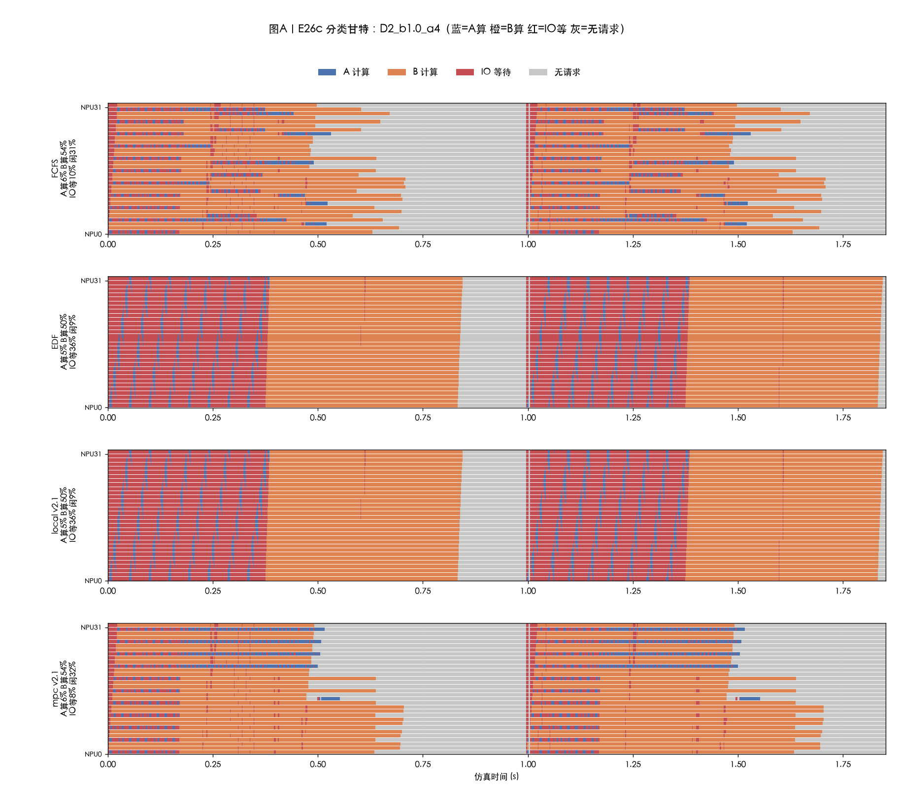

**读法**：EDF 与 local 两行几乎相同——**红海 36.1%**（32 条 A 同时等读，等:算≈8:1）；mpc 行红仅 **8.2%**（比 FCFS 的 9.8% 还低）、B 算最高（53.7%）——封顶 4 条 A 后管道不溢出，B 涓流全进空隙。灰 31~32% 为轮间负载间隙（见 §4）。

### 2.2 D2_b0.75_a4（两轮叠加最重压）

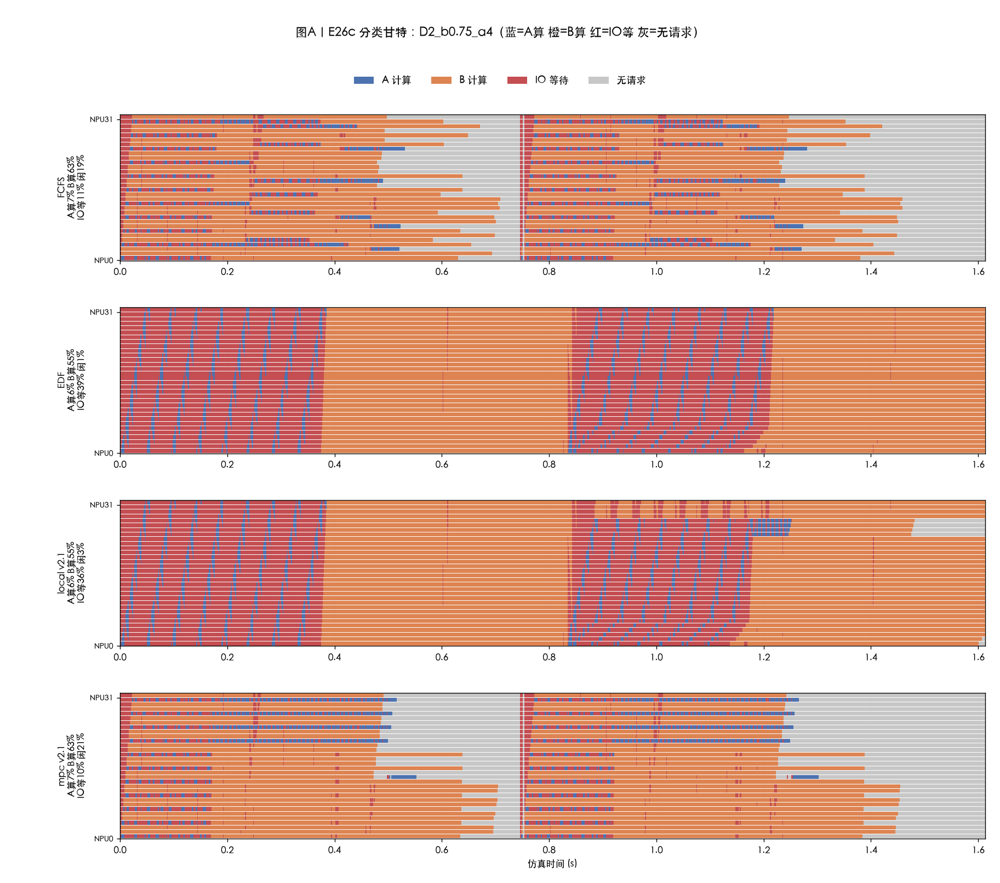

**读法**：同构放大——local 行红 36.2%（其 dev=25 次分诊偏离只救回 4 条 B，64.6%）；mpc 行红 9.6%、追平 FCFS 78.1%。

### 2.3 D1_r1.1_a4（连续过载）

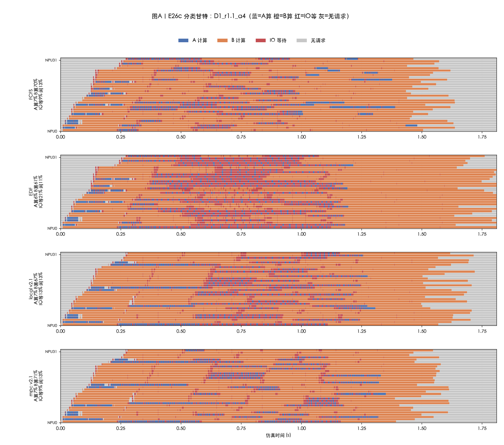

**读法**：连续到达无轮间空隙，四行灰都少（13%）。EDF 红 20.8%、local 13.5%；mpc 红 **8.8%** 且 A 算 7.5% 全场最高——A 类被救活 71%（FCFS 只 35%）：错峰让每条 A 读得快、按期限完成，不再"优先即处死"。

### 2.4 D2c（饱和连续突发，质疑二的修正负载）

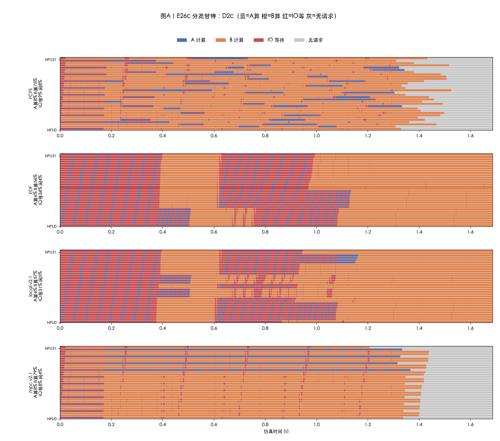

**读法**：饱和下灰全部消失（3.8~7.8%）——供给匹配消费后的正确形态。EDF/local 红海 31~34% 且 B 算只有 56~57%（洪水把 B 也堵死）；mpc 红 **8.3%**、B 算 **79.5%**、全场唯一 B 100%。

## 3. 图 B：存储带宽利用率时序（橙=Σ申请率 蓝=Σ实际速率 黑虚线=120 GB/s；行=四策略）

### 3.1 D2_b1.0_a4

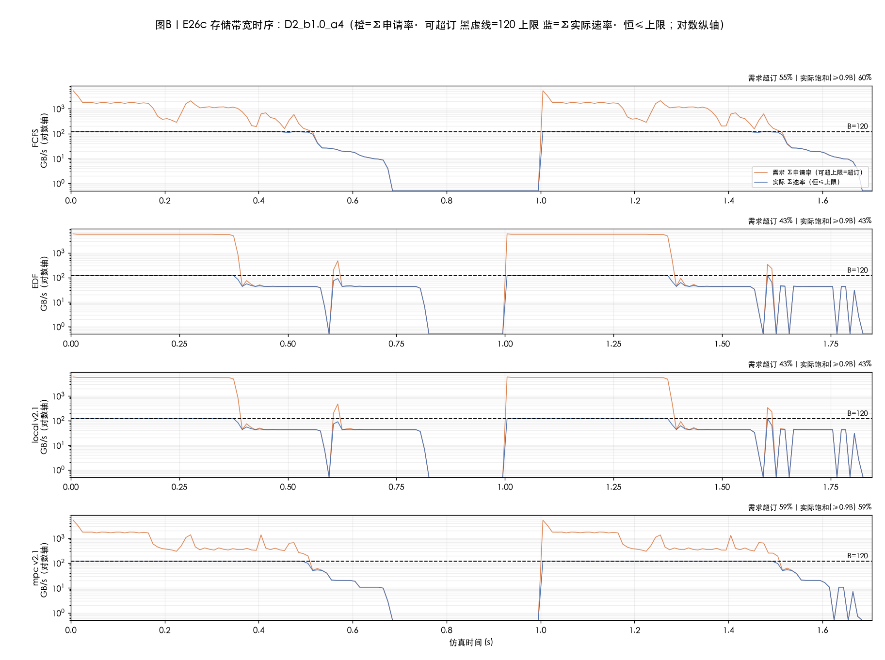

**读法（对数纵轴）**：橙=Σ申请率（**允许超 120=超订可视化**，尖峰可达数千 GB/s）；黑虚线=120 上限；蓝=Σ实际速率（**物理恒≤120**，数据核验峰值=120.0）。mpc 行蓝线贴满 120 虚线（实际饱和 59%）——需求超但不溢出，管道被持续喂满；EDF/local 蓝线大段塌落（饱和 43%）：**需求最凶的策略反而最用不满带宽**。（20261008 勘误：原图线性轴截 1000 削平需求尖峰且未标注橙线可超限，已改对数轴重绘。）

### 3.2 D2_b0.75_a4

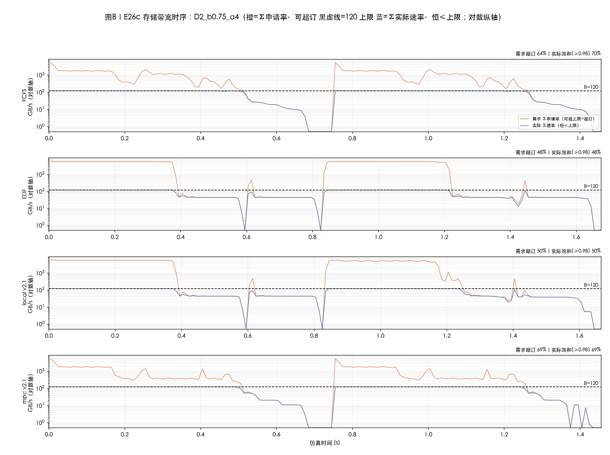

（mpc 饱和 69% vs local 50%；两轮叠加期需求橙线长时间 >120，蓝线被削顶——错峰把削顶时间转化为稳定传输。）

### 3.3 D1_r1.1_a4

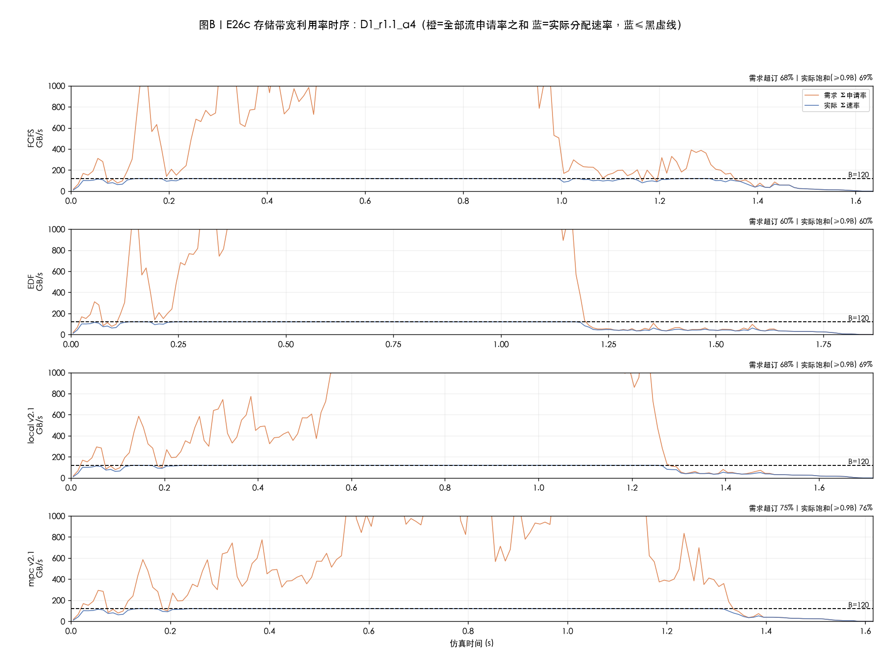

（连续过载：mpc 饱和 76% vs EDF 60%；mpc 的橙蓝两线几乎重合且贴 120——持续满管。）

### 3.4 D2c

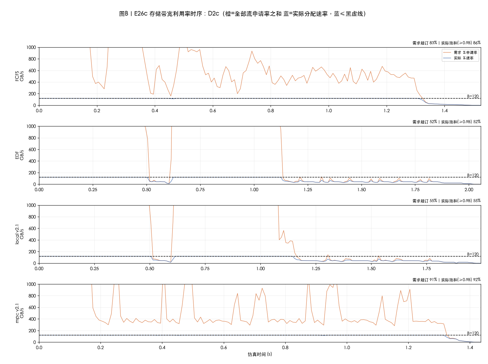

（饱和区极化：mpc 饱和 **92%** vs local 55%——供给匹配消费后，懂带宽的调度把管道利用率做到九成，不懂的浪费近半。）

## 4. 两轮质疑的回应索引（详细裁决在 E26b 报告 §8/§9）

- **质疑一（"调度半天不如 FCFS？θ 机制有问题？"）**：E26b §9.1 探针证明 FCFS 形动作评分最优但不在原候选集（实现缺口）→ v2.1 补到达序族修复；本文 §1 表即修复后终态——**全部格点 ≥ 最强基线**。θ 接通性由 a8/D1 的 S/T 分岔证明（E26b §8.1）。
- **质疑二（"到达率定标没考虑 32 NPU 消耗"）**：成立（E26b §9.2）。D2c 即修正负载：灰从 31%→4~8%（甘特 §2.4 可见）、EDF/local 崩塌、mpc 饱和 92%——修正定标后实验反而更具区分度。
- **灰色的本质**：队列空的轮间间隙+排空尾巴（桶级实证：轮到瞬间 0/32→32/32，E26b §8.2）——D2c 已从负载设计上消除。

## 5. 局限

1. 仅 240 规模（用户指令）；3840 深队列区（stagger 空间 +31pp）待验证。
2. 单 seed（D2/D2c 确定性负载；D1_r1.1 rep0 与 E26b 矩阵对应 rep 逐位一致）。
3. α=8 天花板格点未入本表（v2 在该格点 96.9% vs EDF 100%，封顶保险费，见 E26b §0-4）。
4. local_v2.1 与 mpc_v2.1 的差距在**联合决策点**驱动（burst 时刻的候选裁决）；稳态单 worker 点两者仍以基础动作为主——差距下界即 M2 底座的价值。

## 6. 通俗版

- **修好后的 MPC 像什么**：一个懂"管道会堵"的领班——大件（A）一次只让 4 组上车，小件（B）的涓流把车缝填满，管道利用率九成（D2c），红色等待几乎消失。
- **local 像什么**：同一个领班、同一张排班表，但戴着"管道无限宽"的眼镜评估方案——突发来了他觉得"全上大件也没事"，一签字就堵死，饱和区里连小件都运不动（15%）。
- **FCFS 的位置**：自然交错碰巧就是好形态，原负载下 78.1% 难以超越；修正负载（饱和）下被 mpc 以 74.2% 反超——**负载越紧，"懂带宽"越从锦上添花变成生死线（+59pp）**。

---

## 7. 规模放大验证：480 任务（20261008 补测，用户指令"变大一些再补几组"）

总量 480（160A+320B）：D2=5 轮×96、D2c=4 轮×120（饱和）、D1 泊松队列加深。4 格点×4 臂共 16 run，总耗时 94 分钟（贴 90 分钟预算线）。

| 480 规模 | FCFS | EDF | local v2.1 | **mpc v2.1** | mpc−local |
|---|---|---|---|---|---|
| D2_b1.0_a4 | 78.1（TTFT 0.400） | 66.7（0.602） | 66.7（0.602；concA 0/32/32） | **78.1（0.394；concA 4/11/11）** | +11.4pp |
| D2_b0.75_a4 | 78.1（0.400） | 51.5（0.658） | 68.3（0.565；concA 4/28/32；dev59） | **78.1（0.394；concA 4/11/11）** | +9.8pp |
| D1_r1.1_a4 | 73.1（0.446） | 71.7（0.553） | 89.4（0.421） | **94.6（A84/B100；TTFT 0.404；concA 4/7/12）** | +5.2pp |
| D2c 饱和 | 63.8（0.578） | **6.7**（1.258） | 9.8（0.932；concA 4/32/32） | **65.6（0.568；concA 4/5/11；dev19）** | **+55.8pp** |

**规模效应三句话**：

1. **D2 格点规模不变性**：mpc 在两个突发格点都精确复现 240 的 78.1%（A 类 34%、并发 A 4/11/11 逐位同）——突发物理逐轮重演，结论可跨规模外推。
2. **D1 深队列甜点显现（规模翻倍的最大新信息）**：mpc 90.4%→**94.6%**，A 类 71%→**84%**（FCFS 只救 19%）——队列加深后"封顶 4 条 A"从略有优势变成碾压；mpc−local 缩到 +5.2pp（BW 底座在深队列对 local 也同样兜底，两者差距收窄但 mpc 仍全面领先）。
3. **饱和区恶化是系统性的**：D2c 从 240 的 72.9/74.2% 降到 63.8/65.6%（4 轮叠加积压更深），但相对排序不变——mpc 仍 > FCFS（+1.8pp）、EDF/local 崩塌至 6.7/9.8%（B 类只剩 10~13%）、mpc−local 差距维持 +55.8pp。

### 7.1 图（480 规模，后缀 _n480）

**甘特（4 张）**：mpc 行 IO 等 7.3~9.4% vs local 21~34%（D1 上两者都低——BW 底座对 local 同样兜底，差距体现在 A 类救活率 84% vs 68%）；D2c 的 mpc 行 B 算 80.4% 全场最高。

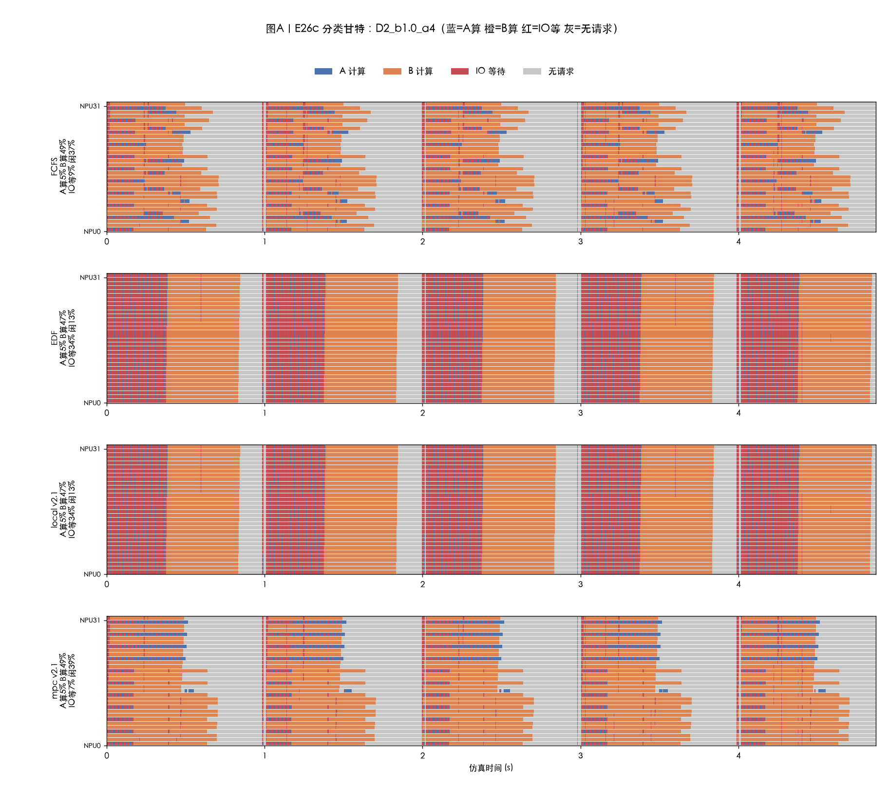
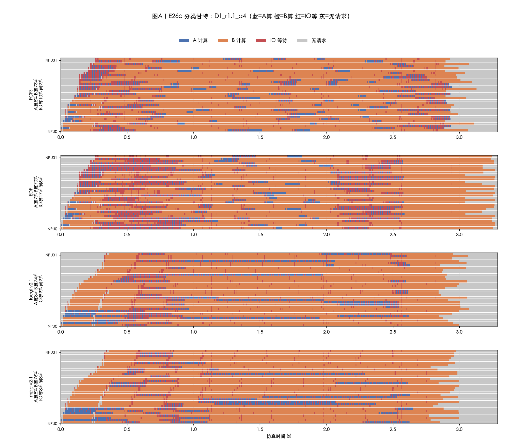
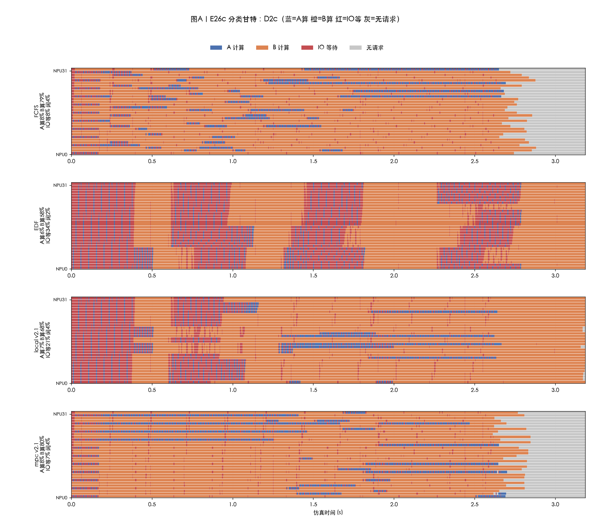

**带宽时序（4 张）**：mpc 的蓝线持续贴 120；D2c 饱和区 mpc 利用率最高、local 近半浪费。

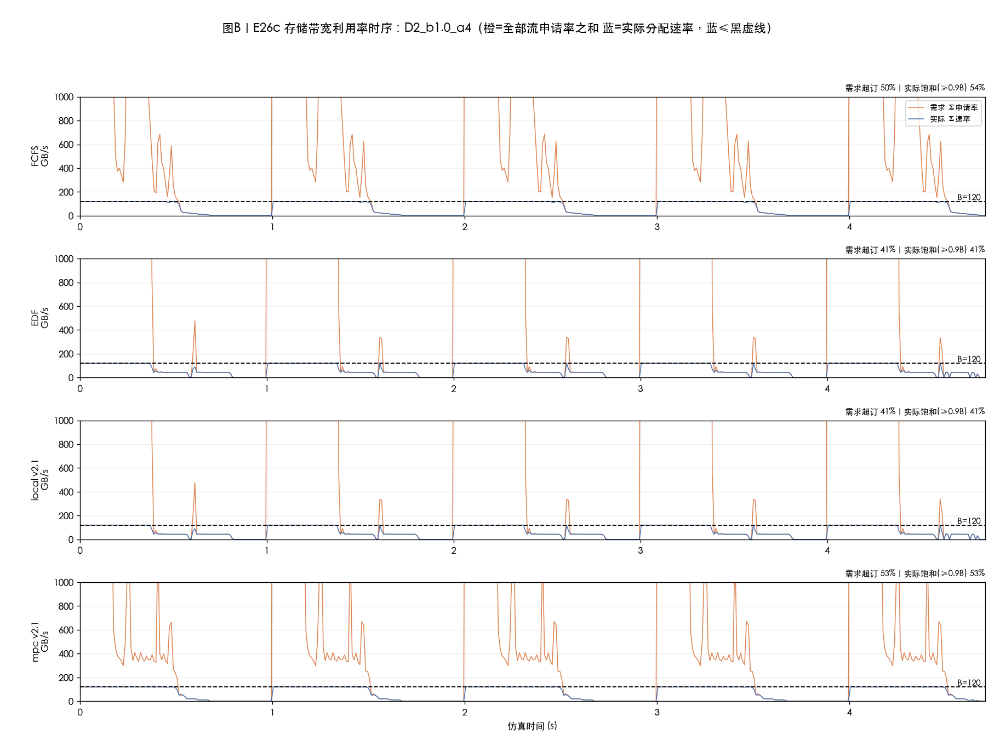
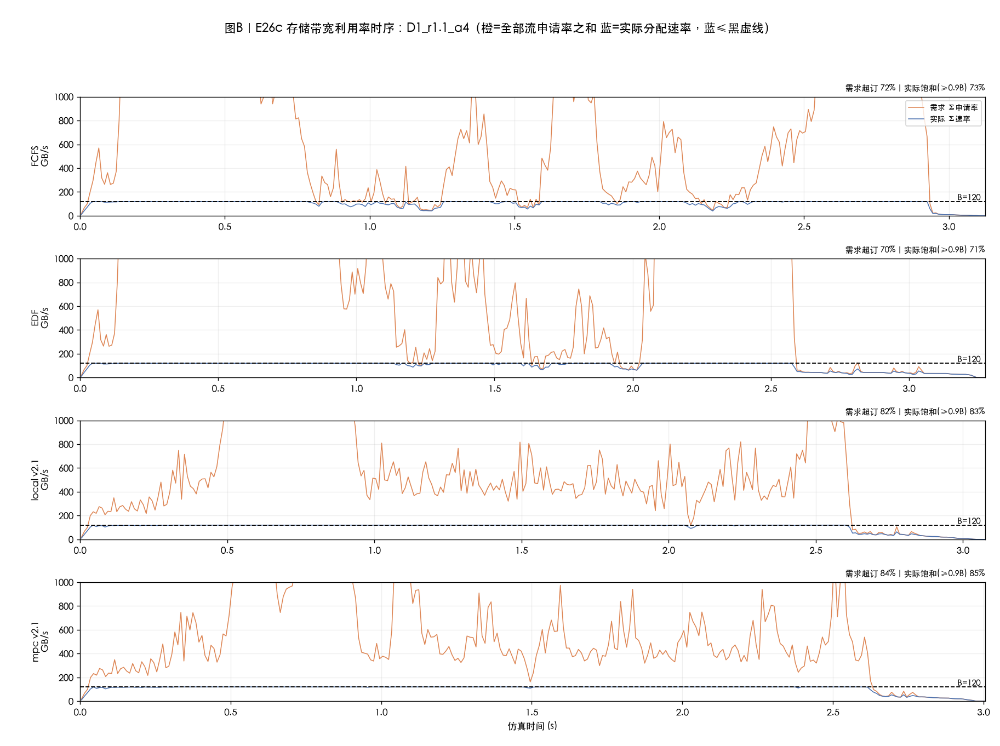
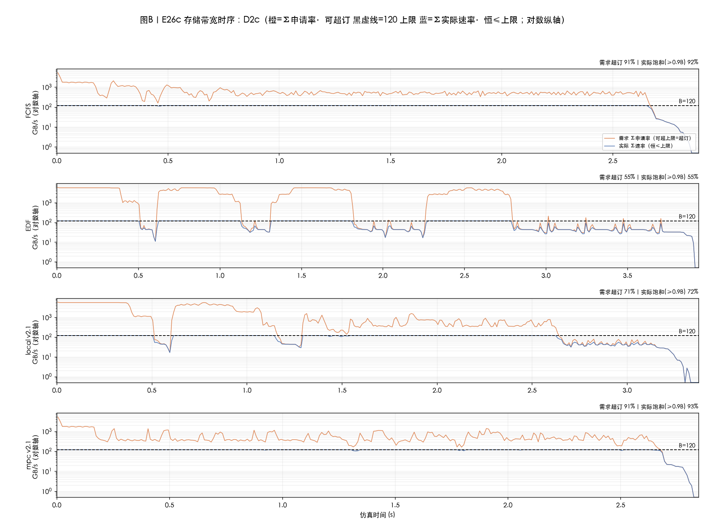

（b0.75 两图同构，见 `docs/figures/cq_fig_e26c_*_D2_b0.75_a4_n480.png`。）

### 7.2 与 240 的对照结论

放大一倍后所有结论方向不变且更尖锐：错峰形态稳健（并发 A 恒 4/11/11 或更紧）、mpc ≥ 最强基线在全部 8 个（240+480）格点成立、mpc−local 差距 +5.2~+59.2pp 随负载/饱和度单调放大。3840 全规模验证仍为遗留（单 run 1.5~4h，超出本轮预算）。

---

## 8. 读者五问解答（20261008）

### 8.1 mpc 用什么因子？起始状态怎么定？dev 远低于 tie、dev=1~2 意味着什么？为什么甘特差别那么大？

- **因子 θ=S**：字典序（超时数, 总TTFT）——先比谁超时少，同数再比总等待。（θ=T 已实测不优于 θ=S，E26b §8.1。）
- **起始状态**：v2.1 的基础动作来自 π=**GuardedEDF-BW**（期限序+重流并发上限 4），不是 EDF/FCFS——搜索在这个**已经错峰的底座**上做偏离；候选=组合器（期限/到达序×cap{3,4,8,∞}）+底座动作+前缀枚举，逐个推演排空打分，严格更好才换。
- **dev≪tie**：tie=候选与基础动作**评分完全打平**的次数——稳态单 worker 决策点上换任何一条请求的边际影响≈0（推演里其余排队请求立刻补位，"信用分配死区"，E26b §9 探针实测四种动作评分逐位相同）；dev=最终真换了动作的决策数。打平≠没搜（每决策点评 ~10 个候选，n_scored 数千）。
- **dev=1~2 的真实含义**：不是"只改一条请求"，而是**换了 1~2 个联合决策点的整波派单**——一个联合动作一次覆盖全部 32 个空闲 NPU 的首波组合（如"32A 洪水"→"4A+28B"），后续整条轨迹从此分岔。且甘特主要形态来自**底座本身**（E26b 消融：仅底座、dev=0 时 IO 等已 36%→~10%、SLO 75.0%）——联合点的 1~2 次替换决定"洪水还是错峰"，底座维持错峰。
- **TTFT 之前漏列，已补**（§1/§7 表）：mpc 在全部 8 个格点 TTFT 最优或并列最优（如 D2c 0.492 vs FCFS 0.505、EDF 0.881）。

### 8.2 FCFS 为什么这么好？ABB 顺序下一批同时跑的 A 不应该很多吗？为什么图上 FCFS 和 mpc 接近？

**前提修正：FCFS 的并发 A 并不多——max=11，不是 32。**交错到达序 (A,B,B)×n 使第一波 32 条里只有 ~11 条 A（表内 concA 4/**11**/11）；把 A 全堆同刻的是 **EDF**（期限排序 → concA 25~32）。11 条 A 需求 321>120，超订但可忍（每条分 ~11 GB/s，层读 16ms vs 算 6ms，IO 等 9~11%）；EDF 的 32 条每条只分 3.75 GB/s、层读 47ms（等:算≈8:1，红海）。所以 FCFS 天然是"轻度错峰"、mpc 是"精确错峰"（4 条=甜点，IO 等 8%）——**同属并发受限家族，图上接近正因如此**；差距在 A 类救活率（480 D1：FCFS 19% vs mpc 84%）、IO 等（9.8% vs 8.2%）、TTFT（0.400 vs 0.394）。D2 短期限下排队 A 基本注定超时，两者 SLO 同为 78.1%。

### 8.3 local 和 EDF 为什么这么差且雷同？为什么全是 A 优先？

- **EDF 全 A 优先的机制**：deadline=到达+α×T0，而 T0_A=49.6ms=0.217×T0_B → **A 期限恒更早** → 期限排序=A 优先 → 突发点 32 条 A 同刻全派 → 互拖全灭（A-SLO 0%），饱和区连 B 都堵死（D2c B 仅 10~20%）。
- **local 雷同 EDF 的机制**：local 与 mpc 用**同一个 BW 底座**（起始状态相同），差别只在评分的想象世界——local 假设每条流独享带宽，"32 条 A 洪水"在其想象里人人全速、零代价，于是联合点评分时它**主动偏离好底座、选回洪水**（concA 冲回 23~32；dev=2~59 就是这些"往洪水方向"的偏离）。**local 之差不在底座而在"眼镜"——带宽盲视的评分会把任何底座拉回洪水**；这是 mpc−local 差距 +9~+59pp 的全部来源（唯一变量=推演是否建模共享带宽）。

### 8.4 带宽图"利用率超上限"与纵轴截断（已修复）

数据核验：**蓝线（实际 Σ速率）峰值恒=120.0，从未超限**（区间级+分箱级双向验证）；超上限的是**橙线=需求 Σ申请率**（峰可达 6400 GB/s≈53×容量）——"需求可超、实际被封顶"是超订可视化的意图，但原图例未标注、线性纵轴截断 1000 削平了需求尖峰（显示不全属实）。已修复：16 张带宽图改**对数纵轴**重绘（需求尖峰/120 虚线/蓝线同时可见），图例标注"橙=可超上限（超订）、蓝=恒≤上限"。

### 8.5 文件日期（已修复）

原误标 20261001（实际创建/补测日 20261008），已重命名并同步内部日期。
