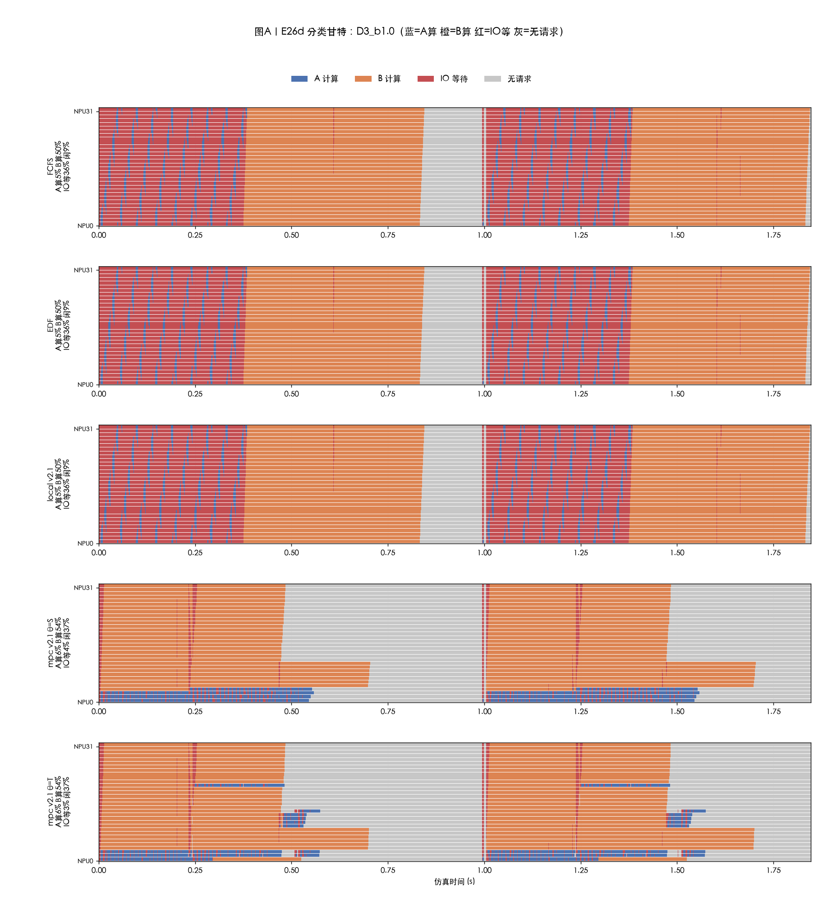
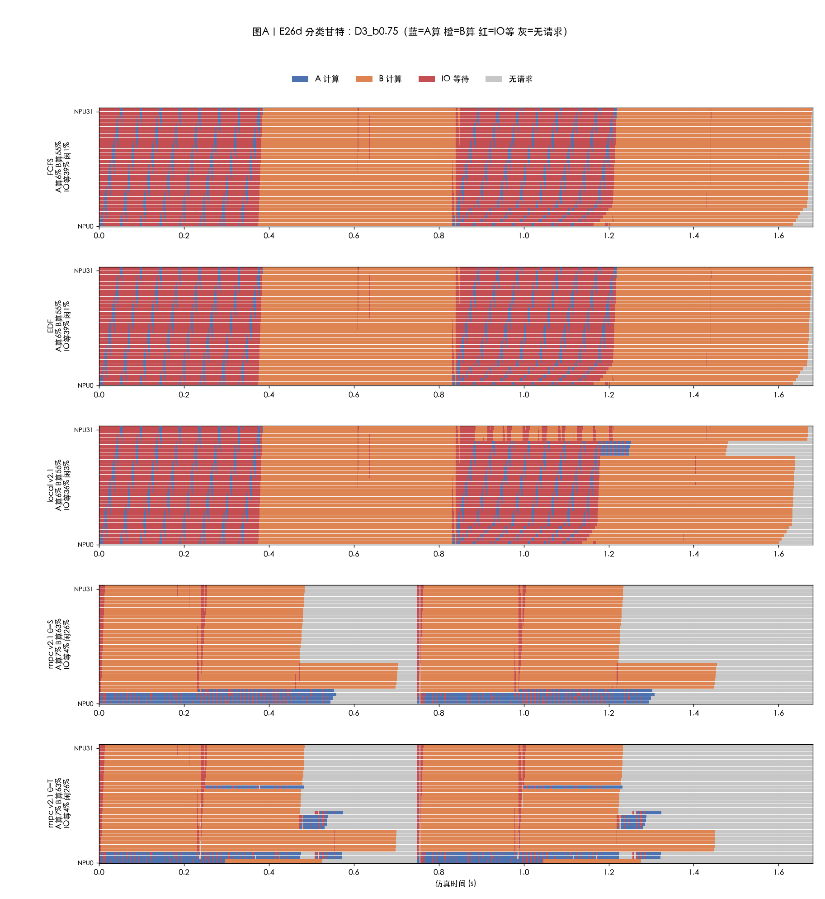
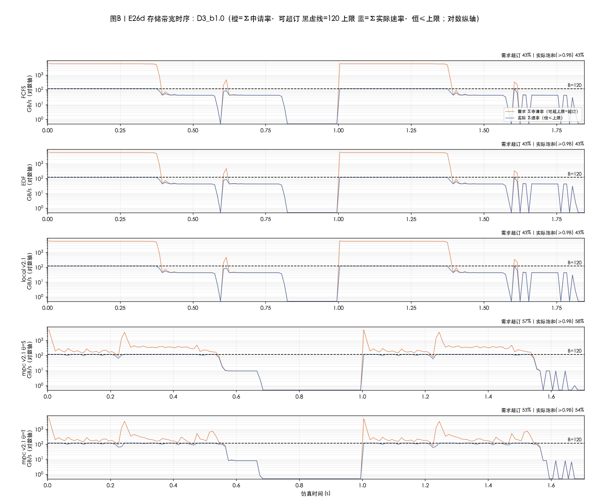
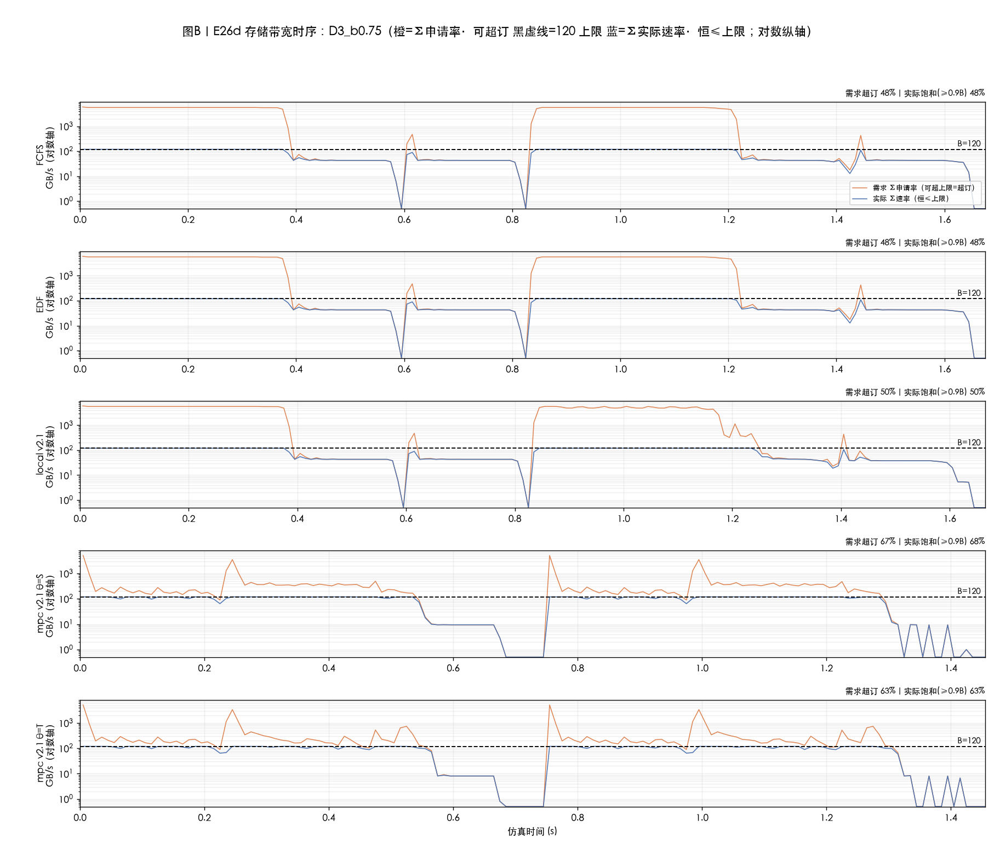

# 实验结果 E26d：块状到达与因子对照——FCFS 保护壳剥离实验 + 五问定量解答

| 项目 | 约定 |
|---|---|
| 日期 | 2026-10-08 |
| 定位 | 回应读者五问（20261008 第二批）：Q1–Q4 的白话+定量解答；Q5 的新到达模式实验 |
| 新实验（Q5，用户指定） | **块状到达 D3**：每轮 32 条 A 同刻到达、紧接着 64 条 B 同刻到达，重复两轮（192 条）；轮距 b∈{1.0, 0.75}s。与 D2 的唯一差别：D2 轮内 (A,B,B) 交错，D3 是 A 块+B 块 |
| 臂（5/格点） | fcfs / edf / localS_v2.1 / **mpcS_v2.1 / mpcT_v2.1**（θ=T 首次在 v2.1 上跑，回应 Q2） |
| 复现 | `python -m sim.run --exp e26d --stage eval --seeds 1 --manifest e26d`；数据 `results/cq/eval/e26d/`；图 `tools/e26d_fig.py` |

## 符号速览（沿 E26c，新增项）

- **底座（π）**：MPC 每个决策点若不搜索、直接给出的**默认动作**来自的调度规则。v2.1 的底座=GuardedEDF-BW，规则只有一句话："按期限从早到晚发牌；但**同时在跑的重请求（A 类）已满 4 条时，跳过 A 先发 B**"（并发上限 4=120÷29.18 带宽甜点）。
- **dev / tie**：MPC 每个决策点把候选方案在"想象副本"里推演到全部完成并打分——tie=候选与默认方案**得分完全相同**的次数；dev=最终真的改用非默认方案的决策次数。
- **θ=S / θ=T**：打分函数。θ=S=（超时条数, 总等待）先比超时；θ=T=（总等待, 超时条数）先比总等待。

---

## 0. 总判决（一句话）

**块状到达把 FCFS 打回原形**：交错序下与 mpc 打平 78.1% 的 FCFS，在 A 块先到时崩到与 EDF 完全相同（66.7%/52.6%，A 类全灭）——它之前的好是**到达顺序的偶然馈赠**；同一负载上 mpc 76.0%（+9.3pp / +23.4pp），且 **θ=S 与 θ=T 结果一致**（得分维度在此工况被底座+物理上限锁死）。**结论：只有显式控制并发 A 的调度能扛任意到达顺序；靠到达序"天然错峰"的策略在块状到达下失效。**

## 1. D3 汇总表（SLO%；括号内 TTFT 秒；concA=p50/p90/max）

| D3 格点 | FCFS | EDF | local v2.1 | mpc v2.1 **θ=S** | mpc v2.1 **θ=T** |
|---|---|---|---|---|---|
| D3_b1.0 | 66.7（0.602；A0/B100；concA 25/32/32） | 66.7（0.602；同左，与 FCFS 逐位同） | 66.7（0.602；concA 25/32/32；dev2/tie1583） | **76.0（0.371；A28/B100；concA 3/4/4；dev2/tie1042）** | **76.0（0.371；A28/B100；concA 3/4/7；dev94/tie1300）** |
| D3_b0.75 | 52.6（0.642；A0/B79） | 52.6（0.642；与 FCFS 逐位同） | 64.6（0.619；concA 25/32/32；dev25/tie1724） | **76.0（0.371；A28/B100；concA 3/4/4；dev2/tie1030）** | **76.0（0.371；A28/B100；concA 3/4/7；dev94/tie1312）** |

三个要点：
1. **FCFS≡EDF（逐位相同）**：块状序下 FCFS 的第一动作=派整块 32 条 A=EDF 的动作，之后轨迹再无分岔（同流同规则）——这是"FCFS 的好=交错序馈赠"的**最干净证明**。
2. **mpc 对比 FCFS/EDF：+9.3pp（b1.0）/+23.4pp（b0.75）**，且 TTFT 好 38%（0.371 vs 0.602）——之前 D2 上 mpc 与 FCFS 打平的格点，换到达顺序后 mpc 大幅胜出。
3. **θ=S 与 θ=T 同分同 TTFT**：b1.0 上两者连 A/B 活数、concA 都相同（θ=T 的 dev=94 更多次偏离但轨迹等价——在齐形请求+同期限结构下两个目标的最优动作重合）。这**回答 Q2**：v2.1 的 θ=T 已补测，本工况不改变结果。

## 2. 图（D3_b1.0；D3_b0.75 同构见 docs/figures）

### 2.1 分类甘特（5 行）

**读法**：前三行（FCFS/EDF/local）**逐像素相同**——IO 等 36.1% 红海（整块 32A 互拖）；mpc 两行（θ=S/θ=T）IO 等 **3.6%/3.3%**、B 算最高、闲 37%（轮间间隙）。与 D2 对照：唯一变量是到达顺序，FCFS 从 78.1% 的"近错峰"跌到 66.7% 的洪水，mpc 不变。

### 2.2 存储带宽时序（对数纵轴；橙=Σ申请率·可超订 黑虚线=120 蓝=Σ实际·恒≤上限）

**读法**：FCFS/EDF/local 三行蓝线大段塌落（饱和 43%）——需求最凶（橙色尖峰 6400）却最用不满；mpc 两行蓝线贴满 120（饱和 59%）。

---

## 3. 五问解答（Q1–Q4；Q5 即上文实验）

### 3.1 Q1："底座/期限序加并发/dev≪tie/甘特主要来自底座"到底什么意思？MPC 搜索没意义吗？

**底座**=MPC 的"默认答案"。每个决策点 MPC 都先让底座给一个动作，然后构造一批候选动作、在想象副本里逐个推演打分，**只有某候选严格更好才替换默认**。v2.1 的底座规则一句话："按期限从早到晚发牌（期限序）；但在跑的 A 已满 4 条时，跳过 A 先发 B（并发上限）。"

**dev≪tie 的白话**：在 96% 的决策点，只有 1 个 NPU 空出来、队列很长——这时"把队首放上去"还是"把队里第 5 条放上去"，推演出的未来**一模一样**（别的请求马上补位，总完成时间不变）——这叫打平（tie，每 run 上千次）。**打平时 MPC 不换**（默认保底）。真正有分差的时刻是"很多 NPU 同时空出来"（突发到达）——一次动作决定整波 32 张牌怎么组合，那里 MPC 真的换了（dev=2 就是两个轮次起点各换一次）。

**甘特主要来自底座≠搜索无意义**。拆开算（同格点 D3_b1.0 链条）：底座单独跑（无搜索）≈75%；底座+盲评分（local）=66.7%（**盲评分会把好底座拉回洪水**——比无搜索还差）；底座+正确评分（mpc）=76.0%（D2 交错序 78.1%）。搜索的意义被 local 反证：**没有正确评分的搜索是负资产（−8.3pp），有正确评分的搜索在关键波次挑对组合（+1~3pp）且防住盲动**。底座给"形态和下限"，搜索给"波次最优组合+防倒退"。

### 3.2 Q2：θ=T 呢？

已在 D3 上补测（§1 表）：**θ=S 与 θ=T 在两个格点 SLO/TTFT/A-B 活数全同**（θ=T 偏离更多次但轨迹等价）。机制：本工况请求只有两种形状、期限结构按类齐整，"少超时"与"少总等待"的最优动作重合——没有可交换的空间。θ 的差异要在异构期限/形状混合（如 mooncake 连续分布）上才会显现，属后续工作。

### 3.3 Q3：FCFS 11 条并发 A 为什么"没影响"？图上为什么和 mpc 分不出来？

**因为活多少条 A 由物理上限锁死，与并发数无关（4 条和 11 条都撞同一条线）**。算术（D2/α=4）：

- 一条 A 要读 1.405 GB；A 的期限窗口=到达后 0.198s；窗口内带宽最多传 0.198×120=**23.8 GB** → **每轮最多 ~17 条 A 能活**（32 条全活需 45 GB，物理不可能）。调度只能决定**谁**活，不能决定**多少**活——FCFS 与 mpc 每轮都撞到同一条线附近，所以 A 活数相同（22/64）、SLO 打平 78.1%。
- 每条 A 的快慢：4 并发→每条分 30 GB/s→单条 48ms（远小于期限）；11 并发→每条 10.9 GB/s→单条 129ms（**仍小于 198ms 期限**）；32 并发→每条 3.8 GB/s→单条 375ms（全灭）。**4 和 11 都落在"来得及"区间**，差别只是每条 A 慢一点——摊到甘特上 FCFS 的红（IO 等 9.8%）比 mpc（8.2%）只多 1.6pp；带宽图上两者蓝线**都贴满 120**（都被带宽锁死，谁也不浪费）——所以图上分不出来，因为两者都在同一条物理上限上运行。
- **但这个"打平"是交错到达序给的**：D3 实验证明，把到达改成 A 块先到，FCFS 的 11 并发变成 32 并发（concA 25/32），单条 375ms 全灭，SLO 崩到 66.7%。**FCFS 的鲁棒性边界=到达顺序**；mpc 的并发上限对任意到达序成立。

### 3.4 Q4：带宽图需求峰为什么高达 6400 GB/s？

6400=32 条请求**同刻提交首层读取流**、每条按引擎协议申请 q_max=200 GB/s（32×200）——这是"想要"的瞬态尖峰（首层 boost 协议，对全部策略一致），不是持续需求；稳态需求=并发A×29.18+并发B×1.35（如 4A+28B≈157）。对数纵轴下可见尖峰只在轮次起点出现、毫秒级即被削顶回 120（蓝线）。

### 3.5 Q5：新到达模式实验

即本文 §0–§2：**FCFS 保护壳剥离，块状到达下 FCFS≡EDF、mpc +9.3~+23.4pp**。

## 4. 局限

1. D3 为确定性负载单 seed（多 seed 恒同）；总量 192（240 规模内，用户指定"重复两次"）。
2. θ=S/T 同分是本工况（两类形状+类内齐整期限）的结论，不外推到异构 trace。
3. 480/3840 规模的 D3 未跑（用户本轮未要求；复跑入口同 e26d）。
