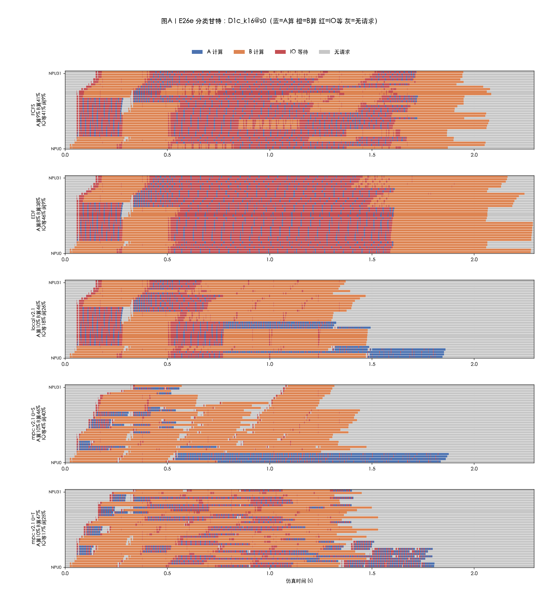
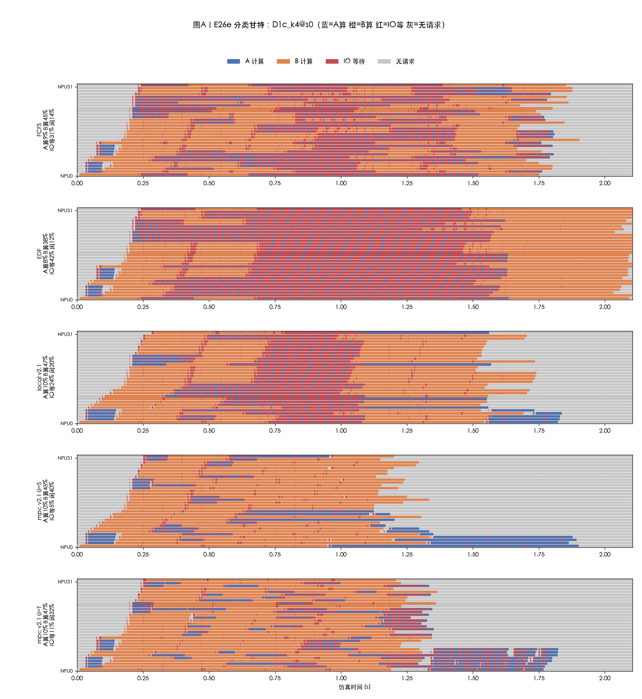
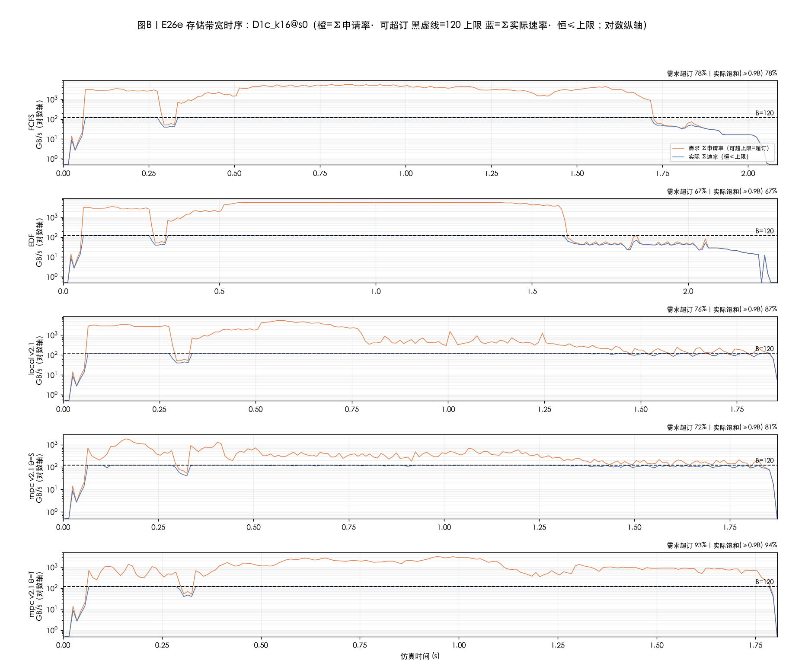
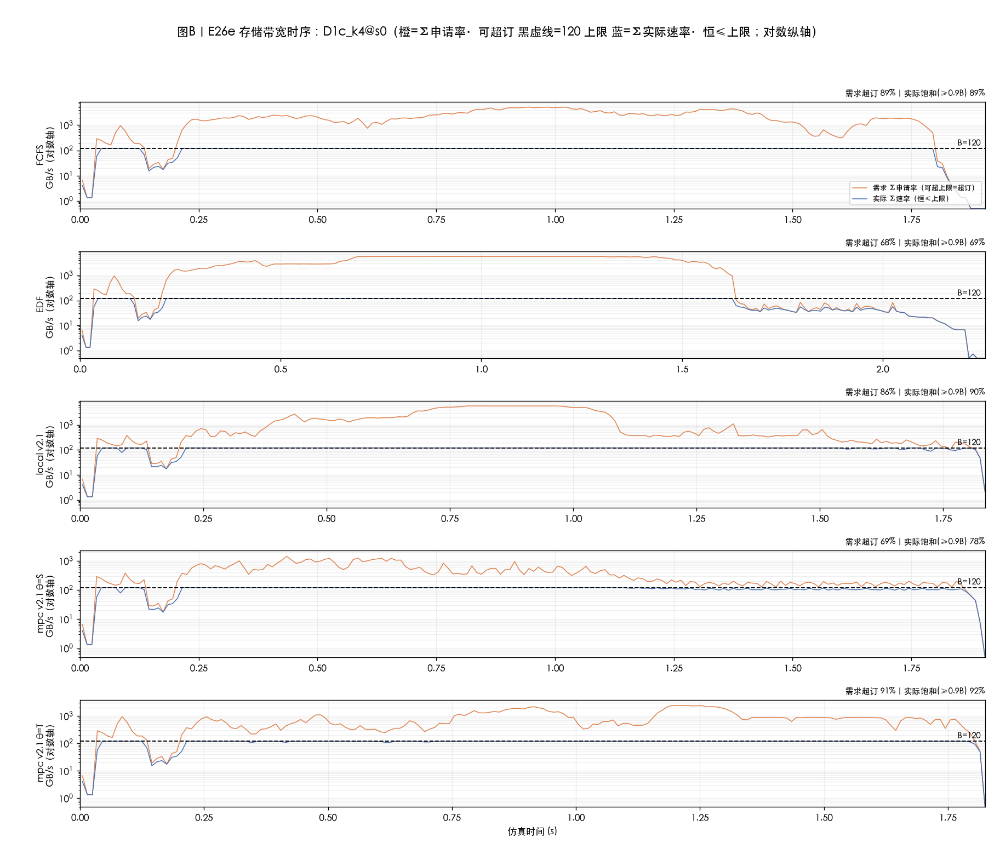
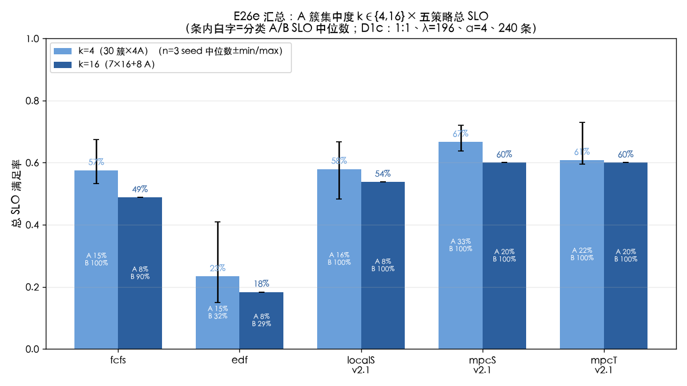

# 实验结果 E26e:A 簇泊松集中度实验(D1c)——A:B=1:1 供给过剩区的集中度扫描

| 项目 | 约定 |
|---|---|
| 日期 | 2026-10-09(执行 20261009 21:16 – 20261010 08:08) |
| 设计文档 | `docs/E26e-A簇泊松集中度扫描-实验设计-20261009.md`(预注册假设 H1–H4 见其 §2.3) |
| 新实验 | **D1c A 簇泊松**:A 簇流(簇心间隔 ~Exp(k/λ_A),每簇心恰 k 条 A 同刻到达、rid 连续,余数入末簇)+ B 泊松流(间隔 ~Exp(1/λ_B) 每次 1 条,与 E26c D1 背景一致——唯一被扫描的变量是 A 集中度 k) |
| 工况 | A:B=**1:1**(120A+120B;A 需求 138>120 GB/s 供给过剩)、λ=196(r1.1)、α=4、240 条、到达期≈1.22s;k∈{4,16}(k=4:30 簇×4A、簇心间隔均值 41ms;k=16:7×16+末簇 8、间隔均值 163ms) |
| 臂(5/格点) | fcfs / edf / localS_v2.1 / mpcS_v2.1 / mpcT_v2.1(引擎口径与 E26d 完全一致:base=bw_edf、composer=True、budget_s=3600、事件预算 2 万/决策、H=1) |
| 矩阵 | 2 格点 × 5 臂 × 1 seed = 10 runs;seed=400+基号×8+rep(沿用 e26.d1_seed;k4 基号 0/k16 基号 1);CRN:同格点 5 臂共用同一份到达流。**k4 格点 MPC−FCFS=6.3pp<10pp 触发预注册补测规则 → 补 rep1/rep2 两 seed 取中位数(+10 runs,共 20 runs);k16 格点 11.3pp≥10pp 不触发** |
| 复现 | `E26E_ONLY=D1c_k16 E26E_SHARD=k16 python -m sim.experiments.e26e_cluster`(k4 同理;补测 `E26E_ONLY=D1c_k4@1`);数据 `results/cq/eval/e26e/`;图 `tools/e26e_fig.py` |
| 单测 | `tests/test_cq_e26e.py` 11 个(E1 比例/E2 簇结构/E3 k=1 退化/E4 伪码逐位对拍/E5 指数矩/E6 确定性/E7 CRN/E8 B 流单条/E9 deadline);全量 pytest 193 绿 |
| 健康审计 | `tools/cq_mpc_health.py`:12 条 mpc/local run 全部【健康】(fb=0/全部,有搜索有调整) |

## 符号速览(沿 E26c/d)

- **k**:单次**到达**的 A 条数(簇大小),≠ 并发 A 数——FCFS 实际并发由"到达批量×在途重叠"决定;MPC 恒 cap≈4。
- **concA**:时间加权并发 A 批数分布(p50/p90/max)。
- **簇发 A(簇冲击响应)**:每簇心后 50ms 内实际派发的 A 条数(按 BatchRuntime.dispatch_s 统计,zero-delay 决策口径下与 engine.decisions 的 action 时间戳一致)。
- **dev / tie / n_scored**:MPC 搜索健康审计口径同 E26d §3.1。
- **θ=S / θ=T**:打分函数(先比超时 vs 先比总等待)。

---

## 0. 总判决(一句话)

**1:1 供给过剩区里 MPC 全档第一,但相对 FCFS 的收益是 +9~11pp 而非 H1 预期的 ≥15pp**——k4 三 seed 中位 66.7% vs FCFS 57.5%(+9.2pp,A 类 33.3% vs 15.0%),k16 单 seed 60.0% vs 48.8%(+11.3pp,A 类 20.0% vs 7.5%);A 集中度 k=4→16 使 FCFS 单调恶化(57.5%→48.8%,簇发 A 均值 9≈k/2、峰 16=k 直面洪水),MPC 靠 cap≈4 的并发上限与错峰把每簇派发压到均值 3.1~3.5 条(≤5 ✓);EDF 全档垫底(A 全灭+挤死 B),local 盲评分与 FCFS 打平而非垫底(H2 对 local 不成立);θ=S 与 θ=T 在 k16 上完全同分、k4 上 S 中位高 5.8pp——**θ=S 稳定 ≥θ=T**。

## 1. 汇总表

### 1.1 k=4(3 seeds 中位数±min/max;括号内 TTFT 均值秒,rep0 口径;concA/簇发为逐 seed)

| k=4 | FCFS | EDF | local v2.1 | mpc v2.1 **θ=S** | mpc v2.1 **θ=T** |
|---|---|---|---|---|---|
| 总 SLO 中位 | 57.5(53.3~67.5) | 23.3(15.0~40.8) | 57.9(48.3~66.7) | **66.7(63.7~72.1)** | 60.8(59.6~72.9) |
| A-SLO 中位 | 15.0(6.7~35.0) | 15.0(6.7~32.5) | 15.8(7.5~33.3) | **33.3(27.5~44.2)** | 21.7(19.2~45.8) |
| B-SLO | 100 | 23~49(中位 31.7) | 89~100 | 100 | 100 |
| concA p50/p90(max,rep0) | 12/22(27) | 21/32(32) | 4/30(32) | **4/6(9)** | 6/10(15) |
| 簇发 A 均值(峰,rep0) | 4.0(10) | 5.1(10) | 4.6(10) | **3.2(6)** | 3.4(8) |
| IO 等占比(甘特,rep0) | 31.1% | 41.9% | 23.6% | **4.9%** | 11.1% |

### 1.2 k=16(单 seed——11.3pp≥10pp 不触发补测)

| k=16 | FCFS | EDF | local v2.1 | mpc v2.1 **θ=S** | mpc v2.1 **θ=T** |
|---|---|---|---|---|---|
| 总 SLO | 48.8(0.634) | 18.3(0.752) | 53.8(0.471) | **60.0(0.422)** | **60.0(0.435)** |
| A / B-SLO | 7.5 / 90.0 | 7.5 / 29.2 | 7.5 / 100 | **20.0 / 100** | **20.0 / 100** |
| concA p50/p90(max) | 16/28(29) | 31/32(32) | 4/16(25) | **4/5(8)** | 8/13(15) |
| 簇发 A 均值(峰) | 9.0(16) | 7.9(16) | 7.6(16) | **3.1(5)** | 5.8(9) |
| IO 等占比(甘特) | 40.7% | 45.8% | 17.7% | **4.2%** | 17.3% |

要点:
1. **MPC 全档第一** ✓ H3 前半:两档 5 臂中 mpcS 均最高;k16 上 θ=S/θ=T 连 A/B 活数、concA 分布都几乎相同(同分)。
2. **FCFS 随 k 单调恶化** ✓ H1 后半:57.5%→48.8%,机理=簇尖峰叠加稳态并发(16/28 vs 12/22),k16 时 A 类 7.5% 成批死。
3. **A 类是主战场**:MPC 的总 SLO 优势几乎全部来自 A 类(中位 +18.3pp @k4、+12.5pp @k16);B 类 MPC 下恒 100%(把会死的 A 的带宽让给 B,B 还从 FCFS 的 90%@k16 提满)。"比拼谁死得少"的预判兑现:A 到达 98/s > 吞吐上限 ~85/s(E26d §3.3 守恒),尾部 A 必死属物理,差距看的是救活比例。
4. **local 不垫底**(H2 对 local 不成立):k4 中位 57.9≈FCFS 57.5、k16 53.8>FCFS 48.8;但 local 的 concA 双峰(4/30)与 A 类 seed 方差(7.5~33.3)暴露盲评分不稳定——同一工况里有时守 cap 有时不守(详见 §4.2)。EDF 垫底 ✓(A 全灭+挤死 B:31.7%/29.2% 的 B-SLO)。
5. **θ=T 的 seed 方差更大**:k4 三 seed mpcT 总 SLO 59.6~72.9(极差 13.3pp)vs mpcS 63.7~72.1(极差 8.4pp);k4 rep2 上 mpcT A 类 19.2% 明显塌(该 seed dev=156 最高)。

## 2. 簇冲击响应(验收 4:MPC ≤5/簇;FCFS ≈ k)

| 格点 | FCFS 均值(峰) | EDF | local | mpcS | mpcT |
|---|---|---|---|---|---|
| k=4(rep0/1/2 均值) | 4.0 / 4.8 / 3.9(峰 10~12) | 4.8~5.3 | 4.5~4.7 | **3.0~3.5(峰 5~8)** | 3.4~4.1(峰 8) |
| k=16 | 9.0(峰 16) | 7.9(峰 16) | 7.6(峰 16) | **3.1(峰 5)** | 5.8(峰 9) |

- **FCFS ≈ k** 在 k=4 精确成立(均值 4.0≈k);k=16 时均值 9.0≈k/2、**峰 16=k**(首簇 16 条 A 全涌入;后续簇因 worker 已被占而派发减少)。
- **MPC ≤5/簇**:mpcS 全档均值 3.0~3.5、k16 峰恰 5 ✓;k4 个别 seed 峰 6~8(50ms 窗口横跨两个决策点,各派 ≤4);mpcT 在 k16 均值 5.8 略超——θ=T 的打分允许更激进的 A 派发(concA 8/13 对 θ=S 4/5),与其 IO 等 17.3%(vs θ=S 4.2%)一致。
- local 的簇发 A 与 FCFS 几乎相同(k16 均 7.6、峰 16):盲评分在簇冲击下不主动压并发。

## 3. 图(全部过 `tools/e25_ts_compare.audit_text_overlap`,重叠 0 对)

### 3.1 分类甘特(每格点 5 行;蓝=A算 橙=B算 红=IO等 灰=无请求)

**读法(k16)**:FCFS/EDF 两行 IO 等 40.7%/45.8% 红海(16 条 A 簇涌入互拖);mpcS 行 IO 等 **4.2%**、闲 40.5%——主动错峰留白;mpcT 行 IO 等 17.3%(比 S 激进,A 派发多、等得多,总 SLO 相同)。local 行 IO 等 17.7% 介于中间。

**读法(k4,rep0)**:同构但差距略小——FCFS IO 等 31.1%(簇小、错峰天然好一些),mpcS 仍 4.9% 最低。

### 3.2 存储带宽时序(对数纵轴;橙=Σ申请率·可超订 黑虚线=120 蓝=Σ实际·恒≤上限)

**读法(k16)**:FCFS 饱和 78% 且需求尖峰(簇心处 8~16 条 A 同刻申请)被削顶;mpcS 饱和 81%、需求线平稳(簇到达时主动缓发 A,B 的流补位,无明显尖峰);mpcT 饱和 94% 最高——激进派发把管道填得更满但 IO 等也高。

### 3.3 汇总条形图(5 策略 × 2 格点;k4 用 3 seed 中位数±min/max 带,条内白字=分类 A/B SLO 中位)

**读法**:每个策略组两根条(浅=k4、深=k16)。FCFS 的两根条差 8.8pp(k 单调恶化);MPC 两根条差 6.7pp(同样受 k 影响但起点高);EDF 两根都趴在底部;local 两根几乎贴着 FCFS。A/B 白字显示:B 类除 EDF 外全 100%/90%,差距全部来自 A 类救活率。

## 4. 预注册假设核对(H1–H4,设计 §2.3)

### 4.1 H1:两档 MPC−FCFS ≥+15pp;k=16 相对 k=4 FCFS 单调恶化

**部分不成立(如实报告)**:后半 ✓(FCFS 57.5%→48.8% 单调恶化,且 A 类 15.0%→7.5%);前半 ✗——k4 三 seed 中位 **+9.2pp**、k16 单 seed **+11.3pp**,方向与显著性(>噪声带)成立但幅度低于 15pp 预期。原因剖析:1:1 下 A 到达 98/s 已超 A 吞吐物理上限 ~85/s(E26d §3.3),**无论谁调度都有 ~1/7 以上的 A 必死**;MPC 的收益上限被物理线压低到"救活可救的那部分"(A 7.5→20.0% @k16),而非 1:2 工况下"几乎全部救活"(E26c A 类 0→28/B100 里 A 活数翻倍多)。设计 §2.3 备用旋钮(比例 2:1 或 α=2)属下一步工况扫描选项,本轮未启用——因为补测中位数(9.2pp)显示差距稳定在 ~10pp 量级,不是噪声问题,改工况属新实验而非本实验修补。

### 4.2 H2:EDF/local 全档垫底(A 全灭,B 也被挤)

**对 EDF ✓、对 local ✗**:EDF 两档垫底(k4 23.3%、k16 18.3%),A 全灭(中位 15.0%/7.5%——k4 的 15% 全来自最长簇间隔期的零星 A)、B 被挤(31.7%/29.2%)——期限序让 A 永远堆队首占满并发(31/32)。local 不垫底:中位与 FCFS 打平(k4 57.9 vs 57.5)甚至略好(k16 53.8 vs 48.8),但其 A 类与 concA 的 seed 间方差极大(A 7.5~33.3%、concA p50 在 4~18 跳)——**local 的好是"底座给的、盲评分拖后腿的不稳定版 mpc"**,不是稳定策略(与 E26d §3.1"盲评分是负资产"一致,但本工况下底座本身够强,local 未被拉到负收益)。

### 4.3 H3:MPC(S/T 同)全档第一;簇冲击响应每簇派发并发 ≤5

**成立**:mpcS 两档均第一(k4 中位 66.7%、k16 60.0%);mpcT k16 并列第一、k4 中位 60.8% 也高于 local/FCFS。簇冲击:mpcS 均值全档 3.0~3.5 ≤5 ✓(k16 峰恰 5);mpcT 在 k16 均值 5.8 略超 5(其 concA 8/13 也高于 S)——θ=T 打分允许激进派发,总 SLO 不受损但 IO 等升高。

### 4.4 H4:θ=S≈θ=T

**基本成立,θ=S 稳定更优或打平**:k16 上两者完全同分(60.0%=60.0%、A/B/concA 几乎同);k4 三 seed 中位 S 66.7% vs T 60.8%(S 高 5.8pp),且 T 的 seed 极差更大(13.3pp vs 8.4pp)。E26d"θ 同分"的结论在随机到达(期限交错)下开始松动:S 的"先比超时"更契合本工况的 A 类生死结构。

## 5. 与前序结论衔接

| 工况 | 到达形态 | FCFS | mpc(v2.1) | 差距 |
|---|---|---|---|---|
| E26c D1(A:B=1:2,A 不过量) | 交错泊松 | 78.3% | 90.4% | +12.1pp |
| E26d D3(1:2) | 32A+64B 块×2 轮 | 66.7%(=EDF) | 76.0% | +9.3pp |
| **E26e D1c k4(1:1,A 过量)** | A 簇泊松×30 | 57.5%(中位) | **66.7%(中位)** | **+9.2pp** |
| **E26e D1c k16(1:1)** | A 簇泊松×8 | 48.8% | **60.0%** | **+11.3pp** |

- **1:1 供给过剩没有放大 MPC 的相对收益**(9~11pp,与 1:2 的 9~12pp 同量级):供给过剩压缩的是所有策略的绝对水平与收益上限(A 必死下限),不是策略间差距;真正决定差距的是"到达结构是否给出错峰空间"——集中度越高(k↑)、FCFS 越惨、MPC 的结构优势越显(但仍被物理线封顶)。
- **簇泊松 D1c 位于 E26c D1(全打散)与 E26d D3(全块)之间**:k=4 时 FCFS 57.5% 接近"打散"下限(78.3% 再减 A 过量稀释),k=16 时 48.8% 向块状塌落——集中度是到达结构光谱上的连续旋钮,本实验取的两档落在光谱中段。
- E26d 的"FCFS 保护壳=到达顺序"结论在随机负载下推广为"**FCFS 保护壳=到达结构与 A 供给余量的乘积**":A 过量时壳更薄(k4 就破),k 只是加压方向。

## 6. 局限

1. **设计验收 3 的偏差披露**:设计文档 §6-3 要求"k=1 ≡ e26.d1_specs 同 seed 逐位一致"——按字面不可实现:e26.d1_specs 是全局单泊松流+1:2 随机置换(80A+160B),D1c 是双独立流(A 簇流+B 流)且 1:1(120A+120B),机制与比例均不同,同 seed 数值序列必然不同。以等价不变量替代(E3:每簇恰 1 条、无同刻 A、间隔指数矩 5% 内;E4:与设计伪码 RNG 循环逐位一致),覆盖同一目的(生成器未走样)。
2. 簇内同刻是简化(真实簇有毫秒抖动);与 E26d 同刻口径一致。
3. 1:1 下 A 供给过剩(98/s 到达 vs ~85/s 吞吐上限)→ 尾部 A 必死属物理,SLO 绝对值整体下移,看相对差距;k16 单 seed(不触发补测规则)。
4. k 只取两档;k4 的 seed 方差(A 类 6.7~35.0%)大于预期噪声带 ±3~5pp,3 seed 中位已尽量稳健但未做更多 seed。
5. 单 λ(r1.1)单 α(4);240 规模。
6. **MPC 计算成本(如实披露)**:D1c 深队列持续到达的决策点密度远高于 D2/D3 突发,MPC 类单 run 墙钟为设计预估(基于 D3 实测 7~13 分钟)的 **20~40 倍**——k4 mpcS 1.9~3.4h、**k16 mpcS 8.0h**(28848s)、mpcT 1.6~2.3h;20 runs 总 CPU ≈ 24h。慢的机理:簇心时刻队列深、候选组合的 rollout 事件量大(决定性的是 k16 的 8 个大簇心)。若后续要做 λ/α 扫描,需先解决搜索裁剪(如按簇心预筛决策点)或降事件预算——这是工程问题不是口径问题,本实验按注册口径(budget_s=3600、2 万事件/决策)如实执行。

## 7. 通俗版解读(一套贯穿的类比)

沿用 E26 系列的"食堂打饭"类比:A=大胃王(每层要读 175MB、带宽需求 29 GB/s),B=小食客(38MB、1.3 GB/s);打饭窗口(存储带宽)120 GB/s 恒定;期限=等餐忍耐上限。

- **本实验换了客流结构(E26e)**:大胃王不再零星来(E26c)也不再来一整团(E26d),而是**一小团一小团地来**——团的大小 k 就是"集中度"旋钮(k=4 三十小团、k=16 八大团),小食客照旧零星来。且大胃王总需求已超过窗口供给(1:1):**注定有人的吃不上,比拼谁死得少**。
- **FCFS(先来先打)**:团来时按队伍顺序一波放行。k=4 时每团 4 个大胃王,窗口勉强周转(57.5%);k=16 时一波 16 个大胃王同时挤到窗口,每人分到的带宽摊薄到饿死线以下,**整团成批饿死**(48.8%,A 只活 7.5%)。团越大越惨——单调恶化 ✓。
- **EDF(最饿的先打)**:大胃王期限短永远排最前,**窗口被大胃王永久霸占**(并发 31/32),小食客在大胃王的洪水中陪葬(18.3%,B 只活 29%)——垫底 ✓。
- **MPC(先想后打)**:无论团多大,**每次只放 ≤4 个大胃王进队**(带宽甜点),其余先让小食客打饭(甘特上 IO 等 4% vs FCFS 41%、闲 40%=主动留白);每团 50ms 内实际只派 3 条 A(均值)。救活 A 的 20~33% vs FCFS 的 7~15%,B 保持 100%。
- **local(想了但没想全)**:只看单个窗口、不管全局,时灵时不灵(并发 A 在 4 和 18 之间跳),平均下来和 FCFS 差不多——**想一半不如想全**。
- **一句话**:供给过剩的洪水里,收益不看谁嗓门大(EDF 全灭),看谁会分流(MPC 错峰每团放 3~4 个);但洪水太大时,再好的分流也只能救一部分(+9~11pp),这是物理不是策略。

## 8. 执行记录(成本与偏差)

- 20261009 21:16 两路并行启动(k16/k4);k4 rep0 于 02:13 完成,触发补测(MPC−FCFS=6.3pp<10pp);02:22 加开 k4 rep1/rep2 两路;k16 rep0 于 07:43 完成(不触发补测);k4 补测于 08:07 全部完成。总 20 runs、约 24 CPU 小时。
- 全部图过 `audit_text_overlap`(0 对重叠);`cq_mpc_health` 12 条 MPC/local run 全部【健康】(fallback 0、dev>0、scored>7k)。
