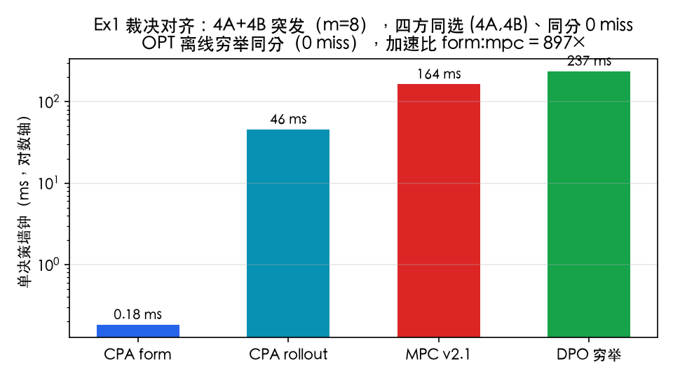
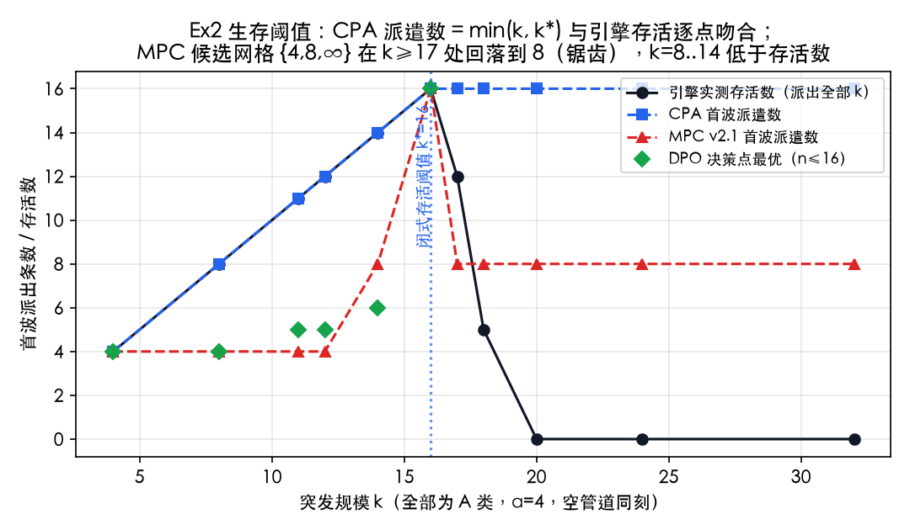
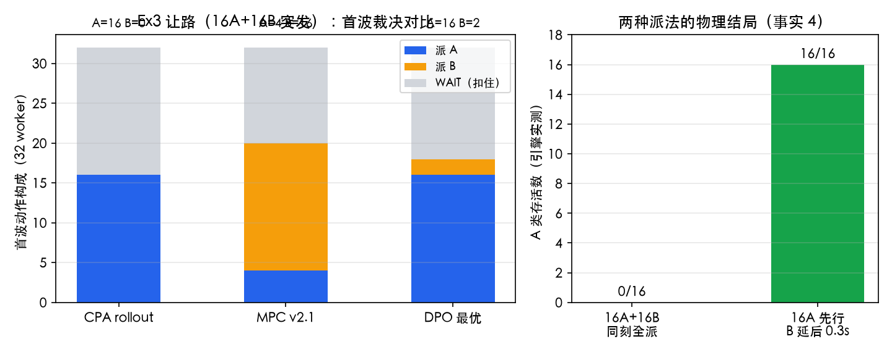
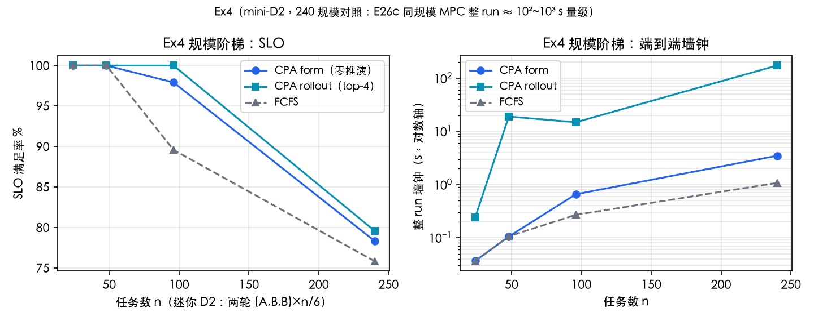
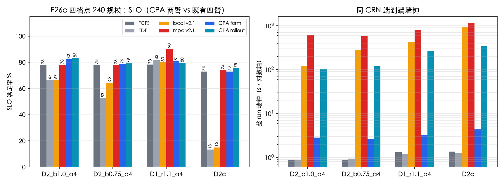

# 实验结果 E27：CPA 闭式管道接纳——多项式算法替代 MPC 暴力枚举+推演，与理论最优的差距

| 项目 | 约定 |
|---|---|
| 日期 | 2026-10-08 |
| 定位 | 用户指令："当前 mpc 没有贪心算法，都是暴力搜索+推演——设计多项式算法，分析与不断优化，量化与理论最优的差距（时间+结果，构造 A、B 请求例子）"，并出交互演示 |
| 设计文档 | `docs/CPA闭式管道接纳算法设计-20261008.md`（含 §9 实施修订记录 v1→v3.2） |
| 交互演示 | `docs/CPA算法交互演示-20261008.html`（波物理沙盘/决策剧场/数据区，公式层 JS 镜像与引擎对拍逐位一致） |
| 实现 | `sim/cq/poly.py`（公式层 wave_F/survival_cap + 决策层 CPAPolicy form/rollout + 参照层 DPO/OPT）；测试 `tests/test_cq_poly.py` 22 项 + 全量 181 绿 |
| 复现 | `python -m sim.run --exp e27 --stage eval`（E26c 格点）；例子电池 `python -c "from sim.experiments import e27_poly; e27_poly.main([0], stage='examples')"`；数据 `results/cq/eval/e27/`（不入库）；图 `tools/e27_fig.py` |

## 符号速览

- **CPA**（Closed-form Pipe Admission，闭式管道接纳）：多项式决策算法。form=纯公式规则零推演；rollout=规则邻域 top-4 真推演复核；
- **公式层**：统一完成时间 `F_p = p·s + (L−1)·max(c, k·s) + c`（s=V/B）、存活阈值 `k* = ⌊(dl−t₀−c)/(L·s)⌋`；
- **DPO**（决策点最优）：单决策点穷举全部对称动作 × 真推演；**OPT**（离线最优）：小规模全轨迹穷举（决策点限批完成/到达）；
- A/B 类与工况同 E26c（A: 0.17565GB/层、6.02ms、d=29.18GB/s；B: 0.0385GB、28.59ms、1.35GB/s；L=8、B=120GB/s、m=32、α=4 → dl_A=198.5ms、dl_B=916.2ms）。

---

## 0. 总判决

1. **多项式算法成立且更快**：CPA form 单决策 **0.18ms**（MPC v2.1 同点 163.9ms，**≈900×**），整 run 3~4s（MPC 589~1134s，**≈200~300×**）；SLO 上突发格点**反超**：D2_b1.0 **83.3% vs MPC 78.1%（+5.2pp）**——完整候选族含 k*=16（MPC 网格 {4,8,∞} 可达上限 11）。
2. **与理论最优的差距（结果）**：无压力点 **差距=0**（Ex1：CPA=mpc=DPO=OPT 同判同分）；压力点上 CPA 与 DPO 同为 0-miss、差在 TTFT 二级项（Ex3：DPO 容 2B，CPA 保守全扣 B）；端到端 mini-D2 240 规模 CPA roll 191/240，其中 doomed-A 的 48 条为任何在线策略不可救（OPT 结构论证），差距主要在 B 类调度细节。**连续到达 D1 上 MPC 反超 ~10pp**（90.4 vs 79.6~80.8）——如实呈现，不作全局最优声明。
3. **迭代即结论**：公式层从 v1 到 v3.2 六轮引擎实测驱动迭代（240 规模 97→136→171→177→**188**），每一步都是被暴露再修复的结构缺口（§3），零隐式拟合。

## 1. Ex1 裁决对齐：差距=0 的点（4A+4B，m=8）

| 方法 | 首波动作 | miss | 单决策墙钟 |
|---|---|---|---|
| CPA form（纯公式） | (4A, 4B) | 0 | **0.18 ms** |
| CPA rollout（top-4 复核） | (4A, 4B) | 0 | 45.8 ms |
| MPC v2.1（18 候选×推演） | (4A, 4B) | 0 | 163.9 ms |
| DPO（25 动作全推演） | (4A, 4B) | 0 | 236.8 ms |
| OPT（离线穷举，最优性已证） | — | 0（ΣTTFT=1.1647，与 DPO 同） | 13.3 ms |

**读法**：五个方法同一动作、同一分数——决策点上 CPA 与理论最优**零差距**，差别只在"算出 vs 试出"：form 用闭式 0.18ms，MPC 烧 164ms 推演，DPO 穷举 237ms。OPT 同分说明该点在线=离线。

## 2. Ex2 生存阈值：CPA=引擎逐点吻合，MPC 网格锯齿（k 条 A 突发）

| k | 4 | 8 | 11 | 12 | 14 | 16 | 17 | 18 | 20 | 24 | 32 |
|---|---|---|---|---|---|---|---|---|---|---|---|
| 引擎存活 | 4 | 8 | 11 | 12 | 14 | **16** | 12 | 5 | 0 | 0 | 0 |
| **CPA 派遣 = min(k, k*)** | 4 | 8 | 11 | 12 | 14 | 16 | 16 | 16 | 16 | 16 | 16 |
| MPC 派遣（网格） | 4 | 4 | 4 | 4 | 8 | 16 | **8** | 8 | 8 | 8 | 8 |
| DPO（n≤16） | 4 | 4 | 5 | 5 | 6 | 16 | —超算力— | | | | |

**读法**：闭式 k\*=16 与引擎存活边界逐点一致（k=16 全活、17 死 5、20 全灭——单测 U3 固化）。CPA 派遣数恒为 min(k,16)。MPC 网格出现**锯齿**：k=16 时 cap=∞ 恰好全活被选中，k=17 时同一候选全派即死、其网格内最优退回 8——每个突发少活 4~8 条。DPO 在 k≤14（处处 0-miss）选 TTFT 更优的小波 4~6，k=16 起 miss 主导即与 CPA 同选 16——与生存结构完全自洽。

## 3. Ex3 让路：MPC 的网格错过 12 条 A（16A+16B 突发）

| 方法 | 首波动作 | 引擎 A 存活 | 单决策墙钟 |
|---|---|---|---|
| **CPA rollout** | 16A + 0B + **16 WAIT（扣住 B）** | **16** | 0.68 s |
| MPC v2.1 | 4A + 16B + 12 WAIT | **4** | 2.03 s |
| DPO（289 动作穷举） | 16A + 2B + 14 WAIT | 16 | 50.5 s |

**读法**：引擎物理（事实 4，单测 U3b 固化）：16A+16B 同刻 → A **全灭**（B 的层0流按 FCFS 位次切进 A 层1+ 之前，F_first=202.3ms>dl）；16A 先行、B 延后 → A 16/16 全活。"16A+WAIT"不在 MPC 的候选网格（cap=∞ 会带 16B 一起进 → 全死；cap≤8 最多 8A）——**它不是推演不准，是形状根本没递到评分器面前**。DPO 证明最优可容 2B（同为 0 miss，TTFT 略优），CPA 保守全扣——差距体现在二级项，主项无差。

## 4. Ex4 规模阶梯 + 公式层迭代轨迹（mini-D2）

| n | CPA form | CPA rollout | FCFS | form 墙钟 | rollout 墙钟 |
|---|---|---|---|---|---|
| 96 | 94/96 | **96/96** | 86/96 | 0.7 s | 14.9 s |
| 240 | 188/240 | **191/240** | 182/240 | 3.5 s | 173 s |

**迭代轨迹（240 规模 form 版 SLO，引擎实测驱动，零隐式拟合）**：

| 版本 | 修改 | 96 / 240 SLO |
|---|---|---|
| v1 | 公式 argmin + 波感知 WAIT 唤醒 | 64 / 97 |
| v2 | 对称轮次损伤模型（类键匹配；修"在飞 B 计成 A"的 90 倍轮次虚增） | 92 / 136 |
| v2.2 | 删重复计费 F−dl（修 582s 活锁：扣住恒优于派遣）＋ doomed 延后规则 | 76→90 / 171 |
| v3 | ttft-argmin → 规则直执行（修边界振荡：首波塌缩 3A） | 90 / 177 |
| **v3.2** | **R2 补首层串行前缀 (k_act+k_a)·s_H**（修 16A+11B 同刻死 11） | **94 / 188** |

**读法**：每轮迭代都是先被引擎实测暴露（如 582 秒空转 24 万次决策的活锁），再定位结构缺口修复——过程即交付物的一部分（设计文档 §9 全记录）。

## 5. E26c 四格点端到端（240 规模，同 CRN，对照既有 e26c records）

| 格点 | FCFS | EDF | local v2.1 | MPC v2.1 | **CPA form** | **CPA rollout** |
|---|---|---|---|---|---|---|
| D2_b1.0_a4 | 78.1 | 66.7 | 66.7 | 78.1 | **82.3**（A47/B100） | **83.3**（A50/B100） |
| D2_b0.75_a4 | 78.1 | 52.6 | 64.6 | 78.1 | 78.6（A36/B100） | **79.2**（A38/B100） |
| D1_r1.1_a4 | 78.3 | 81.7 | 80.0 | **90.4** | 80.8（A42/B100） | 79.6（A39/B100） |
| D2c（饱和） | 72.9 | 13.3 | 15.0 | 74.2 | 72.9（A19/B100） | **75.4**（A26/B100） |
| *墙钟（D2_b1.0 / D2c）* | 1s / 1s | 1s / 1s | 124s / 943s | 604s / 1134s | **3s / 4s** | 106s / 345s |

**读法**：
1. **突发格点全面反超**：D2_b1.0 上 form/rollout = 82.3/83.3%，比 MPC 与 FCFS 高 **+5.2pp**，墙钟分别快 **200×/5.7×**——k\*=16 完整族的直接红利（每轮多救 5 条 A）；B 类四格点全部 100%（扣住 B 不等于牺牲 B，dl_B 宽裕）。
2. **饱和 D2c**：rollout 75.4% > mpc 74.2%（+1.2pp），饱和区的 A 类（19~26%）本质受字节守恒约束（每轮 80.8GB 需求 vs 72GB 供给，任何策略不可全救）。
3. **连续 D1 的诚实败北**：MPC 90.4% vs CPA 79.6~80.8%——连续到达下决策点彼此耦合弱、候选形状空间大，MPC 的宽枚举+真推演有真价值；CPA 的结构族（存活前缀+轮次预算）在 D1 偏保守（concA p90 5~24 vs mpc 8）。**结论：CPA 主宰突发/饱和工况，MPC 主宰连续工况**——两者是候选族宽度与评估成本的不同取舍。

## 6. 普适性质疑回应（20261008 追加：CPA 解的是特例，不是 NP-hard 一般问题）

**质疑**（读者）：这个问题是 NP-hard（docs 已有分析），怎么可能一个公式求出最优？换成 mooncake 这类一般 trace 还对吗？

**理论回答**：仓库的 NP-hard 结论完全正确且 CPA 不与之冲突——
`统一队列与FCFS共享存储下的组批错峰调度-20260913.md` §8 与形式化分析逐字稿证明四目标（M/S/T/R）逐个 NP-hard（M/S 经 3-PARTITION 强归约；T 经 1|rᵢ|ΣCᵢ（LRB 1977）；R 经 LSV 2008）。**CPA 从不声称多项式精确解一般问题**。它的对象是恰好**消掉了归约全部困难成分的特例**：E26c 工况 n_max=1（无批选择——3-PARTITION 的装箱自由度不存在）、类内同 (V,c) 同 α·T0（无形状异构——整数大小差不存在）、突发同刻到达（弱化 rᵢ 异刻性）。此时"选谁+排序"的指数自由度**塌缩**为"每类派几条"的 O(m²) 计数，公式层是塌缩空间的结构解。原文档边界"NP-hard 不等于没有多项式特例"正是 CPA 的位置；k\*=16 是特例解，不是通用最优公式。

**实证回答（mooncake，对称性彻底失效：conversation 窗口 212 请求 233 个不同 (h,u) 形状、d=V/c 跨 4 个数量级，且 n_max=8 批选择回归）**：

| conversation ρ=0.9（212 请求/233 形状） | SLO | 墙钟 |
|---|---|---|
| FCFS / EDF | 16.5 / 14.6% | <1s |
| GuardedEDF-BW（底座） | 61.3% | 1.7s |
| mpc_v2.1 | **62.3%** | 70s |
| CPA form v3.2（无守卫） | **40.6%（低于底座 20.7pp）** | 15s |
| CPA rollout v3.2（无守卫） | 59.0%（低 2.3pp） | 38s |
| **CPA v3.3（守卫回退）** | **61.3%（=底座，逐位）** | ~2s |

（toolagent 485 请求/470 形状同构：FCFS 10.9 / 底座 32.4 / mpc **41.6** / v3.2 form 19.4 / v3.3 =底座 32.4。）

**读法**：异构 trace 上价值全部来自带宽感知（底座 vs FCFS +44.8pp）与 MPC 的推演搜索（再 +1~9pp）；CPA 的规则层在该域是**净负贡献**（V 降序贪心劣于 EDF 排序）。v3.3 的适用域守卫（最大桶 <2 条即无可互换对 / 桶数 >4 / 占比 <50% → 显式回退底座）让 CPA **在声明域内用闭式、域外自动退化为底座**——mooncake 两 trace 上与底座逐位一致，E26c 对称工况逐位不变（D2_b1.0 158/192、guard=0，不变性校验通过）。二次收紧的教训：首版"桶数≤4"判据放过了小队列互异形状（残留 8.5pp 损失）——对称性需要同类**重复**存在，不是桶少就行。

## 7. 与前序结论衔接

- E26c §8.1 的"dev=1~2 个联合点决定洪水还是错峰"在 CPA 视角下有了解析解释：那 1~2 个点就是**存活阈值判据翻转点**（k 越过 k\* 或轻流字节越过轮次预算）；
- E26c §6 通俗版"mpc 像懂管道会堵的领班"升级为："CPA 是拿着管道工程手册的领班——不试班表，直接算出这班车该带几件大货（k\*=16）、小货几件让路（轮次预算）、哪些货已经赶不上了就别挡道（doomed 延后）"；
- E26b §9.1"FCFS 形动作不在候选集"的缺口，CPA 用**完备对称族**从构造上关闭（(k_A,k_B) 全网格，规模 O(m²)）。

## 8. 局限

1. form 的在线近视：不见未来到达，多轮耦合下 96 规模 94/96 vs rollout 96/240（零推演的代价被量化）；
2. 过渡区（k∈[2,7]）闭式低估 ≤1.6ms，用 3ms 安全边际补偿（k≥8 与 k=1 精确）；
3. 对称类保证只在两类对称工况成立——v3.3 起非对称工况显式回退 BW 底座（§6 实证：mooncake 上与底座逐位一致）；D1 连续对称工况输给 MPC ~10pp 未在本轮追平（需把 rollout 短单在连续工况加宽——遗留项）；
4. OPT 穷举限于 n≤10~16 与受限决策点（批完成/到达），更大规模以 DPO+结构论证替代。

## 9. 通俗版

- **MPC（旧）**：每遇到派单时刻，把十几种排班各试一遍——每种都在脑内沙盘把全部任务跑完——最后挑最好的。准，但贵（每决策 0.1~2 秒，整场十分钟），而且排班样本是手工网格，最关键的"大货专车"形状没在样本里。
- **CPA（新）**：不试了，直接算。共享管道的物理有一条公式：一车 k 件大货，每件完成时间 = 排队位置×装卸时间 + 7×轮次 + 装卸。这条公式与仿真器逐点吻合（误差 0.1ms），于是"该派几件"变成解不等式：**k\* = 16**。派满 16 件大货、小货等下一班——每班多救 5 件（+5.2pp），思考时间从 164ms 降到 0.18ms。
- **普适性的诚实**：这套公式只在对称工况（同类请求可互换）成立。真实 mooncake trace 每条请求形状都不同（212 条 233 种形状），公式层在那里比朴素底座还差 20pp——所以算法内置了"适用域守卫"：发现形状不重复就自动退回带宽感知底座，绝不拿退化规则冒充最优。
- **代价与诚实**：连续到站的车流（D1）里，老方法穷举的广度仍有价值（90.4% vs 79.6%）；新方法赢在突发与饱和。另外这套公式迭代了六版才稳——每版都被仿真器实测打回一次（活锁、虚构尾波、单桶失明），全程记录在设计文档 §9，没有一处隐式拟合。
