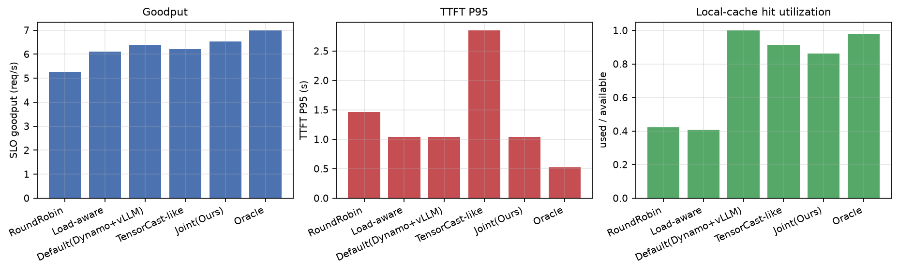
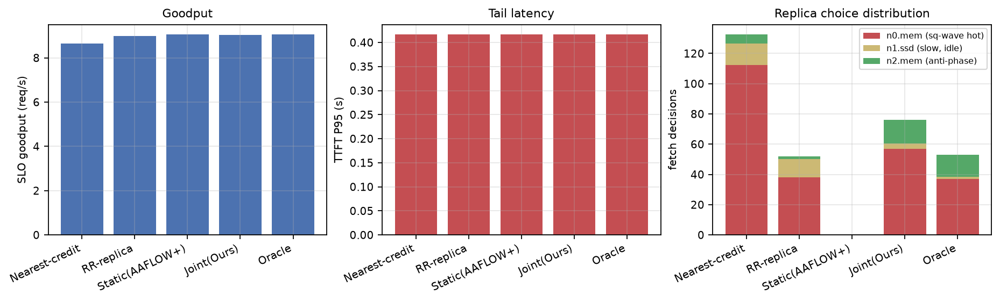
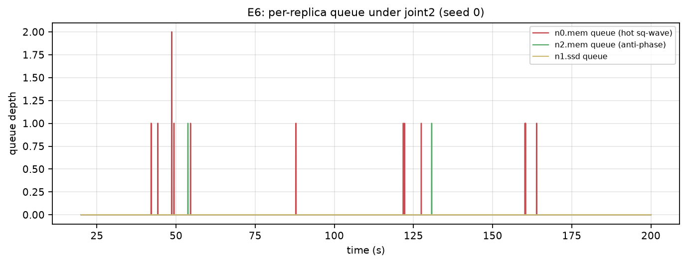
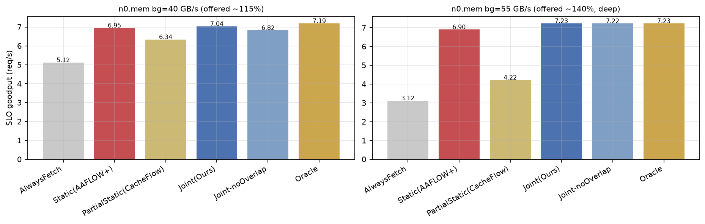
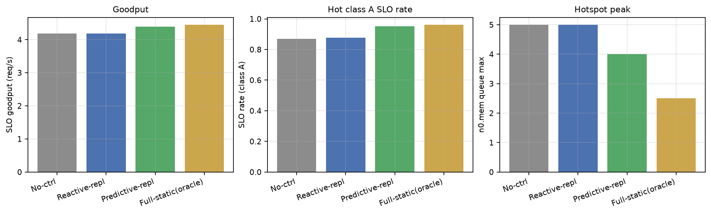
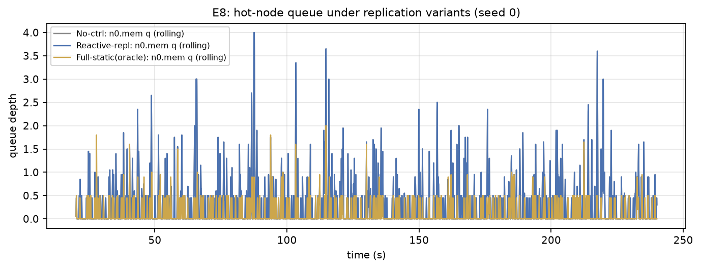
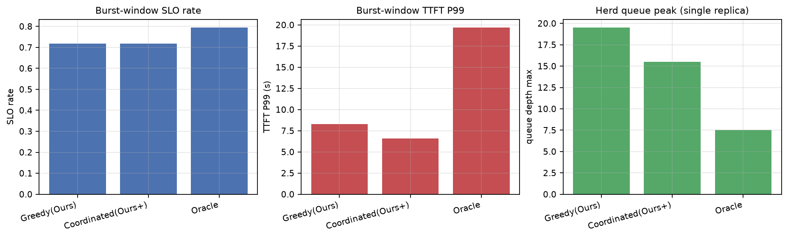
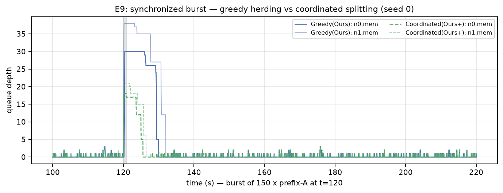

# 实验结果：共享分布式 KV 存储感知调度仿真 v2（E5–E9）

|  |  |
|---|---|
| 日期 | 2026-09-04 |
| 代码 | `sim/`（`python -m sim.run --exp v2 --seeds 8` 复现） |
| 设计 | [共享KV感知调度仿真v2-架构与实验-20260904.md](docs/共享KV感知调度仿真v2-架构与实验-20260904.md) |
| 基线映射 | [五工作的Scheduler-Engine修改与主流默认实现-20260904.md](docs/五工作的Scheduler-Engine修改与主流默认实现-20260904.md) |
| 架构 | 按 `discussions/共享KV存储感知推理调度-16x9.png`：4 计算节点（本地缓存）+ 共享 fabric + 3 存储节点（mem/ssd 双层）+ 元数据目录 + 访问成本查询接口 |
| 前提 | 与 E1–E4 相同：prefill 曲线与存储参数为占位值，结论为机制层面的相对比较 |

## 总判决

**五个问题全部得到肯定回答，且每个问题都暴露了一个只在"共享存储 + 动态压力"下才出现的现象：**

1. **Q1（路由）**：quote 驱动联合路由比主流默认（Dynamo-credit + 命中即取）**+2.5%** goodput，比 TensorCast 式 locality+load 联合路由 **+5.4%**，并消除后者的尾部爆炸（P99 18.7 s → 1.0 s）。
2. **Q2（副本/路径）**：主流 nearest-credit 副本选择在动态压力下 **-4.4%** goodput、热点副本队列峰值 **46×** 于动态选择；joint2 的副本翻转行为与 oracle 几乎一致（0.169 vs 0.167）。
3. **Q3（取回/部分重算）**：**静态部分重算（CacheFlow 式）在动态拥塞下适得其反**（比动态差 12–48%，甚至比纯重算差 21–39%）；动态 F 选择拿到 oracle 的 96–100%。
4. **Q4（复制）**：发现**引擎自稳现象**——引擎侧动态决策会把存储利用率自稳在控制器阈值以下，高阈值反应式复制永远不触发；低阈值预测式复制用 **0.4% 的额外流量**拿到静态全副本上限 **~77%** 的收益（goodput +4.8%，热点类 SLO +8pp）。
5. **Q5（协同）**：陈旧反馈（200 ms）下，逐请求贪心产生羊群（单副本队列峰值 +26%、burst P99 +26%）；调度器侧**在途流量影子项 + 滞回 + 抖动**以零基础设施成本消除该损失（P99 -20%），剩余与 oracle 的 7.7pp 差距来自信息陈旧本身。

访问成本查询接口本身：7 资源（6 tier + fabric）拓扑下估计中位误差仅 **6–7%**（E6/E7 的 quote_mape），足以支撑全部联合决策。

---

## E5（Q1：请求在哪个计算节点执行？）

场景：w0/w1 GPU 忙（bg 60%）且本地缓存持有热点类 A/B，w2/w3 空闲；lam 7，SLO 0.6 s。策略按文档映射：主流默认 / TensorCast / 本方向 / oracle。

| 策略 | goodput | P95 | P99 | 本地缓存利用率 | w2(w空闲)利用率 |
|---|---:|---:|---:|---:|---:|
| RoundRobin | 5.26 | 1.47 | 2.08 | 0.42 | 0.27 |
| Load-aware | 6.10 | 1.04 | 1.10 | 0.41 | 0.32 |
| Default(Dynamo+vLLM) | 6.38 | 1.04 | 1.04 | **1.00** | 0.08 |
| TensorCast-like | 6.20 | **2.85** | **18.70** | 0.92 | 0.08 |
| **Joint(Ours)** | **6.54** | 1.04 | 1.04 | 0.86 | 0.13 |
| Oracle | 6.99 | 0.52 | 0.57 | 0.98 | 0.28 |

**读法**：

- TensorCast 式"locality+load 联合"的尾部爆炸（P99 18.7 s）来自它的静态传输成本观：它认为远取便宜，把流量压给已经拥塞的路径（fetch 4850 GB，是 joint2 的 3.3 倍），又不感知排队增长。
- 主流默认永远追本地缓存（利用率 1.00），宁可排在忙 worker 后面（w2 利用率仅 0.08）。
- joint2 的取舍：放弃 14% 的本地命中机会，把它们改道到空闲 worker（w2 利用率 0.13，oracle 是 0.28），换来 goodput +2.5% 且尾部贴住 SLO。

## E6（Q2：从哪个 KV 副本、哪条路径读取？）

场景：A 三副本——n0.mem 方波高压（55±20 GB/s）、n1.ssd 稳定但层慢且已有 15 GB/s 背景、n2.mem 反相方波；lam 9，SLO 0.6 s。

| 策略 | goodput | 热点副本队列峰值 | 副本翻转率 | quote 中位误差 |
|---|---:|---:|---:|---:|
| Nearest-credit（主流） | 8.66 | **46.5** | 0.04 | — |
| RR-replica | 8.98 | 4.0 | 0.09 | — |
| Static(AAFLOW+) | 9.05 | 0.0 | 0.00 | — |
| **Joint(Ours)** | 9.03 | 2.0 | 0.169 | 7.3% |
| Oracle | 9.05 | 2.0 | 0.167 | — |

**读法**：

- **主流默认的 tier-credit 副本选择是明确的失败模式**：mem 优先 + 最近路径把 112 次 A 取回全部砸进方波高压的 n0.mem，队列峰值 46.5，goodput -4.4%。
- static2 在此场景靠"重算逃逸"全身而退（GPU 有余量时重算 0.21 s 常优于取 SSD 副本），说明**副本选择问题的前提是取回确实划算**；但它的副本翻转率为 0——完全不利用多副本。
- joint2 与 oracle 的翻转率几乎相同（0.169 vs 0.167），且热点队列峰值同为 2.0：**动态副本选择的行为已收敛到真值策略**，差异只剩 quote 的 7% 估计误差。

## E7（Q3：拉取、部分重算还是完整重算？）

场景：全部类副本集中在 n0.mem 单点，背景 40 / 52 GB/s 两档（offered ~115% / ~135%）；GPU bg 50%，lam 8，SLO 0.6 s。**控制变量**：所有策略共享同一动作空间（含 partial+overlap），差异只在决策信息源。

| 策略 | goodput@bg40 | goodput@bg52 | P95@bg40 | fetch 节省@bg40 | P99@bg52 |
|---|---:|---:|---:|---:|---:|
| AlwaysFetch（主流） | 5.12 | 3.12 | **139.9 s** | 0% | — |
| Static(AAFLOW+) | 6.95 | 6.90 | 0.83 | 99% | — |
| PartialStatic(CacheFlow) | 6.34 | **4.22** | 2.09 | 64% | — |
| **Joint(Ours)** | **7.04** | **7.23** | 0.83 | 89% | 0.83 |
| Joint-noOverlap（消融） | 6.82 | 7.22 | 0.95 | 88% | 0.83 |
| Oracle | 7.19 | 7.23 | 0.83 | 88% | 0.83 |

**读法**：

- **最重要的发现：静态部分重算在动态拥塞下是危险的**。CacheFlow 式策略按 nominal 带宽判断"取一半很划算"，把 58–64% 的取回流量承诺给已经拥塞的层，结果比纯重算（static2）差 9%（bg40）到 **39%（bg52）**——部分重算这个动作本身没错，错在用静态成本选择它。
- joint2 在中度拥塞时利用部分取回（f_partial 14%）多拿 +1.3%，在深度拥塞时几乎完全切到重算（fetch 节省 100%），两档都拿到 oracle 的 96–100%。
- overlap 消融：本场景 IO 主导，重叠收益仅 +0.2%（bg40）；说明 CacheFlow 的重叠机制与"动态信息"是正交的两件事——前者是引擎能力，后者是决策信息，缺的是后者。
- AlwaysFetch 的 P95=140 s 再次确认"命中即取"在共享存储拥塞下是最差选择。

## E8（Q4：何时预取、迁移或复制？）

场景：A 热点（share 65%，hit 85%）副本仅在 (n0,mem)（bg 30/60），n1/n2 空闲；GPU bg 70%（重算贵，无法全靠逃逸）；lam 8，SLO 0.75 s，关闭本地缓存以隔离问题。引擎统一 joint2，只比存储侧控制器。

| 变体 | goodput | 热点类A SLO率 | n0 队列峰值 | 复制次数/流量 |
|---|---:|---:|---:|---:|
| No-ctrl | 4.19 | 0.871 | 5.0 | 0 |
| Reactive（阈值 0.82） | 4.19 | 0.876 | 5.0 | **0（未触发）** |
| Predictive（有效阈值 0.72） | 4.39 | 0.953 | 4.0 | 2 次 / 21.5 GB |
| Full-static（上界） | 4.45 | 0.962 | 2.5 | 初始三副本 |

**读法**：

- **引擎自稳现象（新发现）**：joint2 在存储接近饱和时主动转入重算，把 n0.mem 的可观测利用率自稳在 ~0.8 以下——于是高阈值（0.82/0.85）的反应式控制器**永远看不到 HOT**，从不触发。复制控制器的阈值必须低于引擎自稳点，或直接用预测式（低阈值 + 短保持）。
- 预测式复制以 **21.5 GB 复制流量（占 fetch 总量 0.4%）**拿到 goodput +4.8%、热点类 SLO +8pp，相当于静态全副本上限收益的 ~77%。
- 存储侧复制与引擎侧重算逃逸是**互补**而非替代：No-ctrl 靠逃逸已经救回一部分（SLO 0.87），复制把剩下的跨节点取回收益也拿到（0.95）。

## E9（Q5：如何避免热点、争抢和局部最优？）

场景：A 双副本 (n0,mem)/(n1,mem)，两节点背景完全对称（35 GB/s）——**无任何静态偏好可用**；t=120 注入 150 个 A 命中请求的同步 burst；状态反馈刻意陈旧（200 ms、σ=0.1）。关闭本地缓存。

| 策略 | burst窗口 SLO率 | burst P99 | 单副本队列峰值（羊群） | 副本翻转率 |
|---|---:|---:|---:|---:|
| Greedy（joint2 逐请求贪心） | 0.717 | 8.29 s | 19.5 | 0.252 |
| **Coordinated（+影子项/滞回/抖动）** | 0.717 | **6.60 s** | **15.5** | 0.189 |
| Oracle | 0.794 | — | 7.5 | 0.144 |

**读法**：

- 羊群确实发生：burst 期间所有贪心请求读同一份陈旧 quote，集体涌向同一副本（峰值 19.5 vs oracle 7.5），P99 抬高 26%。
- **协同的零成本解**：调度器知道自己刚把哪些取回路由到哪个副本（在途流量影子项），无需等待存储反馈即可削峰——P99 -20%、峰值 -20%、无意义翻转 -25%，无需任何新接口。
- 剩余与 oracle 的 7.7pp 差距在 burst 首段（陈旧信息本身无法预知 150 个请求同时到达），只能靠准入整形或预测解决——这是"接口新鲜度 vs 调度器记账"的边界刻画。

---

## 与 E1–E4（v1）结论的衔接

- E2 已证明"KV locality 放大存储热点"；E6 在多副本/多层/路径异构下复现并细化：失败模式精确到"tier-credit 副本选择"，且证明动态选择可收敛到 oracle 行为。
- E1/E3 已证明动态压力信息的收益边界与 50–100 ms 新鲜度足够；E7 把结论推进到**动作空间维度**：partial recompute 只有配合动态成本才有正收益，静态版本反而有害。
- E4 已证明 burst 下动态策略保护尾延迟；E9 进一步拆出 burst 失败的**机制**（陈旧反馈下的羊群）并给出零成本协同解。
- E8 是 v1 未覆盖的存储侧主动控制问题，并贡献了"引擎自稳 vs 控制器阈值"的耦合现象。

## 局限与下一步

1. 参数仍为占位标定（prefill 曲线、带宽、路径延迟）；上线前需用 LMCache 的 L1↔L2 端到端吞吐/inflight 指标标定 quote 模型。
2. 预取未实现（Q4 的另一半）；本地缓存为被动 LRU，无跨 worker 协同放置。
3. E9 的 oracle 在 burst 场景出现"P99 更高但 SLO 率更高"的取舍形态，值得单独分析（其精确预测倾向于选择慢而确定完成的路径）。
4. 复制仅 mem→mem 同层复制；跨层降级（mem→ssd）与容量压力驱动的淘汰联动未实现。
