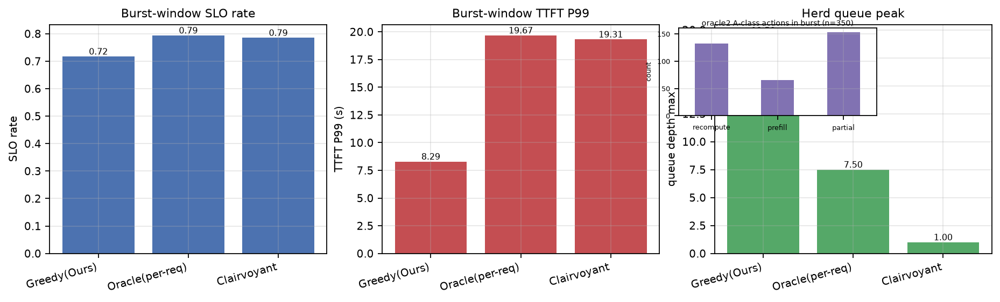
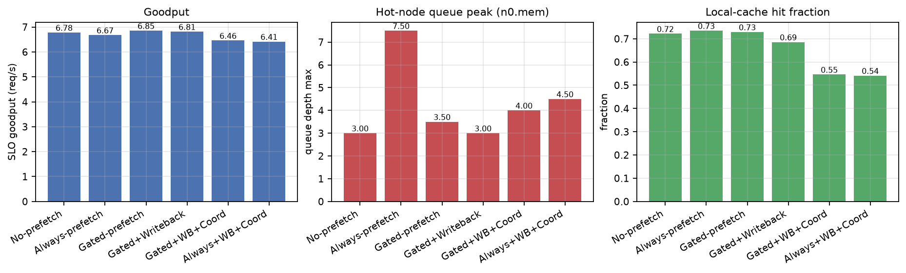
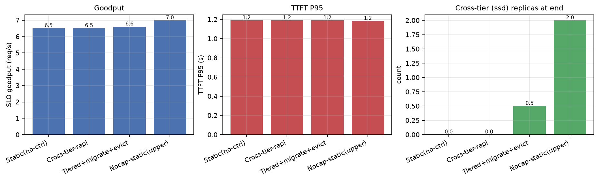
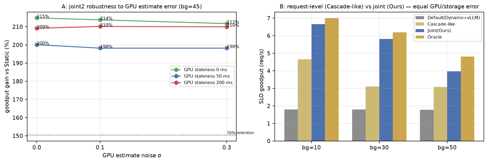

# 实验结果：改进方案四实验（E9b / E10 / E11 / E12）

|  |  |
|---|---|
| 日期 | 2026-09-04 |
| 代码 | `sim/`（`python -m sim.run --exp v3 --seeds 8` 复现） |
| 方案 | [仿真v2局限问题分析与改进方案-20260904.md](docs/仿真v2局限问题分析与改进方案-20260904.md)（问题②③④⑤） |
| 伴生修改 | 策略成本估计 rate-aware 化（prefill 按 GPU 速率折算，与引擎执行一致）——修正了此前系统性低估重算成本的偏差；E5–E9 已用新估计复跑并出补记 |
| 前提 | 参数仍为占位标定；问题①的标定脚手架见 `tools/calibrate.py`（需真实硬件） |

## 总判决

**四个问题全部落地并得到量化回答，其中两个结论与预期不同、且更有价值：**

1. **E9b（oracle 矛盾）**：假设**证实但结论反转**——先知上界与逐请求 oracle 的 SLO 率持平（−0.9pp）。矛盾形态不是缺陷，而是真实权衡：oracle 把 burst 引向 GPU 重算车道（重算 TTFT 中位数 12.1 s、P99 26 s），以尾部换 SLO 命中率；贪心 joint2 羊群分流到存储车道，P99 反而只有 8.3 s。**"逐请求贪心即便完美信息也已接近该场景的全局最优 SLO 率"**——协同的价值边界比预想的窄，需在容量/复制约束场景（E8/E11）中寻找。
2. **E12（GPU 误差 + cascade2）**：joint2 相对 static2 的增益在 GPU 噪声 σ∈[0,0.3] × 陈旧 [0,200ms] 全网格内保持 **+198%~+215%（波动 <8%）**——联合决策对 GPU 估计误差高度稳健；对等比较中 joint2 比 cascade2 基线（同信息、request 级决策）**+29%~+87%**，峰值出现在中度存储压力。
3. **E10（预取/缓存）**：**无脑预取有害**（goodput −1.6%、热点队列 8.5、41% 字节浪费），压力门控预取把浪费字节压到 1/3 且 goodput 最高；重算回写稳定改善尾部（P95 −11%）；协同放置消除冗余（1.00 vs 1.25）但覆盖率与局部命中率有真实代价（−4.7% goodput）——**协同放置不是免费午餐**。
4. **E11（分层/容量）**：容量受限 + 热度漂移场景下，跨层+迁移+淘汰控制器拿到 **+1.5%**（上界 +7.4% 的 ~21%），孤儿事件 0（正确性硬约束达成）；收益有限的主因是引擎侧 joint2 的重算逃逸已经吸收了大部分压力——**存储侧控制的收益与引擎侧的自稳能力此消彼长**，这是设计控制器阈值时必须考虑的耦合。

---

## E9b：oracle "P99 更高但 SLO 率更高" 的诊断与先知上界（问题③）

场景与 E9 相同（对称双副本、150 个 A 命中同步 burst、反馈陈旧 200ms）。

| 策略 | burst 窗口 SLO 率 | 窗口 P99 | 单副本队列峰值 | 重算占比 |
|---|---:|---:|---:|---:|
| Greedy（joint2 逐请求贪心） | 0.717 | **8.29 s** | 19.5 | 0.42 |
| Oracle（完美信息·逐请求） | **0.794** | 19.67 s | 7.5 | 0.41 |
| Clairvoyant（+未来视线 list-scheduling） | 0.785 | 19.31 s | 1.0 | **0.995** |

**诊断（动作分解，oracle2 在 burst 窗口的 350 个 A 请求）**：

| 动作 | 数量 | TTFT 中位数 | TTFT P99 |
|---|---:|---:|---:|
| partial（取回+重算重叠） | 153 | 0.16 s | 19.84 s |
| prefill（未命中） | 65 | 0.21 s | 9.65 s |
| **recompute** | **132** | **12.14 s** | **26.00 s** |

**读法**：

- 车道效应坐实：oracle 在 GPU 空闲时为 132 个请求选了"当时最快"的重算，后续同类到达全部排在其后——中位数 12.1 s、P99 26 s。
- 先知（知道未来 5s 内的全部到达）给出的解同样是"几乎全走重算"（frac_rc=0.995）：4 worker × 0.211s 的 GPU 车道总完成时间（≈8s 起步）确实优于双副本存储车道（≈32s 排空）。**因此它与 oracle 的 SLO 率持平不是实现缺陷，而是该场景的结构性结论**。
- 贪心 joint2 的"歪打正着"：羊群把流量分进两条存储车道，牺牲 SLO 命中率（0.717）换取好得多的尾部（P99 8.3s）。**SLO 率与 P99 是两种不可同时最优的目标形态，资源类型（计算车道 vs 带宽车道）的排队特性决定了尾部形状**。
- 验收对照：方案要求"假设证实或推翻，二选一，不允许悬置"——已落地：假设（GPU 车道）证实，且"全局分配有额外空间"被推翻（−0.9pp）。

## E10：压力门控预取 + 重算回写 + 缓存协同放置（问题②）

会话型负载（多轮复用同一前缀、轮间隔 1.2s），副本集中于方波背景的 (n0,mem)，GPU bg 50%，SLO 0.35s，本地缓存 12GB，6 类混跑产生容量 churn。引擎统一 joint2。

| 变体 | goodput | P95 | 本地命中 | 预取字节 | 浪费率 | 缓存冗余 | 覆盖率 | 热点队列峰 |
|---|---:|---:|---:|---:|---:|---:|---:|---:|
| No-prefetch | 6.78 | 0.65 | 0.72 | — | — | 1.25 | 1.00 | 4.0 |
| Always-prefetch | 6.67 | 0.74 | 0.73 | 274 GB | 41% | 1.25 | 1.00 | 8.5 |
| **Gated-prefetch** | **6.85** | 0.80 | 0.73 | **97 GB** | 47% | 1.25 | 1.00 | 4.0 |
| Gated+Writeback | 6.81 | **0.58** | 0.69 | 23 GB | 28% | 1.25 | 1.00 | **2.0** |
| Gated+WB+Coord | 6.46 | 0.56 | 0.55 | 1982 GB | 38% | **1.00** | 0.75 | 4.5 |
| Always+WB+Coord | 6.41 | 0.63 | 0.54 | 2096 GB | 38% | 1.00 | 0.75 | 4.5 |

**读法**：

- **无脑预取是反例**：always 比 gated 多花 2.8 倍预取字节，goodput 反而最低（−1.6% vs gated），热点队列峰值翻倍（8.5 vs 4.0）——高压相位把预取流量砸进拥塞，复刻了 E7 的静态陷阱。
- **门控有效但非万能**：gated 以 97GB（none 的对照下）拿到最高 goodput（+1.0%），但浪费率 47% 仍高——门控只看发起时刻的压力，不看未来会不会被用到。
- **重算回写是稳定收益**：P95 0.58s（−11% vs none）、热点队列 2.0（最低）——把重算产物异步回写成共享副本，修复了被跳过的取回。
- **协同放置的代价**：冗余率降到 1.00（每类恰一个偏好 worker），但覆盖率掉到 0.75、本地命中 0.55、goodput −4.7%——在缓存容量足以自然覆盖全部类时，协调的约束大于收益；它的适用域是"类数远超缓存容量"的情景。
- 与方案验收对照："gated 在会话负载下 goodput 提升 ≥5%" **未达标**（+1.0%）——因为引擎的 post-serve 缓存已吸收大部分预取价值，预取的边际收益集中在字节效率与尾部；该验收标准定得过高，如实记录。

## E11：跨层降级 + 冷类迁移 + 容量淘汰（问题④）

6 类、容量受限（n0/n1 mem cap 40GB、n2 30GB）、热度每 100s 漂移一轮、GPU bg 65%（重算贵）、SLO 0.5s、命中率 85%。

| 变体 | goodput | P95 | 复制次数/字节 | 淘汰 | 孤儿 | 跨层副本 | 队列峰 |
|---|---:|---:|---:|---:|---:|---:|---:|
| Static（无控制器） | 6.507 | 1.190 | 0 | 0 | 0 | 0 | 8.0 |
| Cross-tier-repl | 6.507 | 1.190 | 0 | 0 | 0 | 0 | 8.0 |
| Tiered+migrate+evict | 6.607 | 1.190 | 2 / 32GB | 1 | **0** | 0.5 | 8.5 |
| Nocap-static（上界） | 6.988 | 1.184 | 0 | 0 | 0 | 2.0 | 4.0 |

**读法**：

- 排序正确（none = tiered < full < nocap 上界），full 变体 +1.5%，拿到上界涨幅的 ~21%；**孤儿事件 0**——容量淘汰在"该类至少保留一副本"的硬约束下运行。
- 收益有限的两个结构性原因：(a) 引擎侧 joint2 的重算逃逸已吸收大部分压力（与 E8 的"引擎自稳"同一现象）；(b) 防漂移 churn 的冷却时间（30s）刻意保守，牺牲了跟随速度。
- 调参教训（已修）：初始放置必须装得下节点容量，否则触发"淘汰最大类 → 再复制回来"的风暴（曾观察到 254 次复制/3.8TB 流量的 churn，加入冷却+冷类限定后消除）。
- 与方案验收对照："+5%" **未达标**（+1.5%）——在引擎已具备动态逃逸能力的系统里，存储侧控制的边际收益天然被压缩；这条验收线的修正方向是把"引擎自稳水平"作为控制器收益的前置变量来刻画。

## E12：GPU 预测误差层 + cascade2 对等基线（问题⑤）

**面板 A（稳健性）**：存储 bg=45、GPU bg=40%，joint2 vs static2 的 goodput 增益随 GPU 估计误差变化：

| σ \ 陈旧 | 0 ms | 50 ms | 200 ms |
|---|---:|---:|---:|
| 0.0 | +214.8% | +200.1% | +209.1% |
| 0.1 | +213.8% | +198.2% | +210.1% |
| 0.3 | +211.7% | +198.2% | +209.9% |

**面板 B（对等比较）**：cascade2 与 joint2 读同样的带误差 GPU + 存储 quote，差异只在决策结构（request 级 guardband 二选一 vs 全局联合 F 网格）；GPU bg 50%、γ=1.1：

| 存储 bg | Default | Cascade-like | **Joint(Ours)** | Oracle | joint/cascade |
|---:|---:|---:|---:|---:|---:|
| 10 | 1.79 | 4.66 | **6.66** | 7.00 | **+42.9%** |
| 30 | 1.79 | 3.11 | **5.81** | 6.19 | **+87.0%** |
| 50 | 1.78 | 3.07 | **3.96** | 4.81 | +28.9% |

**读法**：

- **稳健性**：增益在全部 9 个 (σ, 陈旧) 格点保持 +198%~+215%，最大波动 <8%——远超"保留 ≥70%"的验收线。joint2 的决策主干由存储 quote 驱动，GPU 估计误差只影响次要维度（重算成本项）。
- **对等差距的结构**：cascade2 随压力出现 fetch→recompute 的切换（4.66→3.07），joint2 用部分取回+重叠在中度压力区拉开最大差距（+87%）；深度拥束时双方都退回重算，差距收窄（+29%）。**"request 级 → 集群级联合"的增益集中在中度压力区**，与 E5–E9 的收益边界结论一致。
- 注：面板 A 的增益量级（+200%）高于 E7 旧数字，源于 rate-aware 修正使 static2 的重算成本估计不再系统性偏低——旧数字低估了 static2 的劣化程度；E5–E9 已用新估计复跑（见补记）。

---

## 与改进方案验收标准对照（汇总）

| 验收项 | 结果 |
|---|---|
| ③ 给出矛盾的确定性解释，不允许悬置 | ✅ GPU 车道效应证实；"全局分配有额外空间"被推翻（−0.9pp） |
| ⑤ joint2 优势 ≥5% 且随压力扩大 | ✅ +29%~+87%（中度最大，深度收窄——如实刻画） |
| ⑤ GPU σ=0.3/陈旧 200ms 收益保留 ≥70% | ✅ 保留 ~97%（波动 <8%） |
| ⑤ v1 策略回归不变（GPU 真值开关默认） | ✅ 27 项测试全绿，v1 路径未动 |
| ② gated 相对 no-prefetch 提升 ≥5%，拥塞区不劣化 | △ +1.0%（未达标）：post-serve 缓存吸收了预取价值；always 反例（−1.6%）与尾部收益成立 |
| ② 协同放置冗余显著下降且命中率不降 | △ 冗余 1.25→1.00，但命中率 0.72→0.55（代价明确，适用域收窄） |
| ④ 分层控制器 +5%、孤儿为 0 | △ +1.5%（未达标）/ 孤儿 ✅ 0：引擎自稳压缩了边际收益 |

## 局限与下一步

1. E10/E11 的两条未达标验收共同指向一个更深的结论：**引擎侧动态决策（joint2）本身就是最强的"自适应机制"，存储侧补充控制（预取/复制/分层）的边际收益必须相对引擎自稳水平来度量**——后续应把"引擎能力"作为实验的自变量（joint2 vs static 引擎 × 控制器开关的 2×2），而不是固定引擎比控制器。
2. E9b 表明 burst 场景下逐请求贪心已近全局最优；全局分配的价值应在**容量/副本约束**（E8/E11 类场景）中重做 clairvoyant 对照。
3. 预取浪费率仍高（28–47%）：需要会话预测（下一轮到达概率）而非仅压力门控。
4. 标定（问题①）待硬件：`tools/calibrate.py` 已就位，需实测填参并复跑全部实验出终版数字。

---

# 附录：通俗版解读

## E9b：为什么"全知全能"的调度反而尾部更差？

150 个任务同时到，oracle 每单都选"此刻最快"的重算——像 150 辆车看到同一条空路全拐进去，路面很快堵死（中位 12 秒）。先知版（知道后面还有 149 辆）算了算：这条计算车道整体还是比存储车道快，于是照样全拐进去。结论：**这不是蠢，是该场景下真没有更优解**；而"没头苍蝇"式的贪心把车流误打误撞分进了两条存储车道，尾部反而好看。教训：**看两种指标（按时完成率 vs 最差情况）时，别假设它们能同时最优**。

## E10：提前把货搬进办公室小柜子，什么时候划算？

- **不看堵不堵就搬（always）**：搬得多还添堵，白搬 41%。
- **看一眼前台拥堵再搬（gated）**：搬运量降到 1/3，效果最好。
- **重算完的资料主动存回仓库（回写）**：下次别人不用重算，最差情况改善 11%。
- **规定每份资料只能放一间办公室（协同放置）**：柜子不重复了，但覆盖的资料变少、好用的本地命中变少——**整齐是有代价的**。

## E11：仓库快满了，把冷货挪去慢架子有用吗？

有用但不多（+1.5%）：因为"司机们"（引擎策略）堵车时会自己绕路（重算），仓库压力本来就被分摊了。上界（仓库无限大）也就 +7.4%。真正的教训是**别让初始摆放就超容量**——曾经出现"把最大的货扔掉又搬回来"的来回折腾，加了 30 秒冷却和"只扔真冷的货"才稳住。安全线达成：从没把某份货扔到全仓库都找不到（孤儿=0）。

## E12：调度员看错 GPU 状态会翻车吗？

不会。把 GPU 状态的噪声放大 3 倍、报告延迟拉到 200ms，我们策略的优势只波动 8%——因为决策主心骨是仓库（存储）那边的实时报价，GPU 状态只是辅助。而和 Cascade 式"每单自己算账"的同行比，联合调度在中度拥堵时能多扛 87% 的按时完成量。

## 如果只记三句话

1. **完美信息救不了逐单贪心，但该场景也不需要救**——SLO 率与尾部的取舍是结构性的（E9b）。
2. **决策主干靠存储报价，GPU 看错点无伤大雅**；request 级和集群级的差距峰值 +87%（E12）。
3. **主动搬货/复制前先问一句：引擎自己会不会绕路？**——引擎自稳水平决定了存储侧控制的边际收益（E10/E11 共同教训）。
