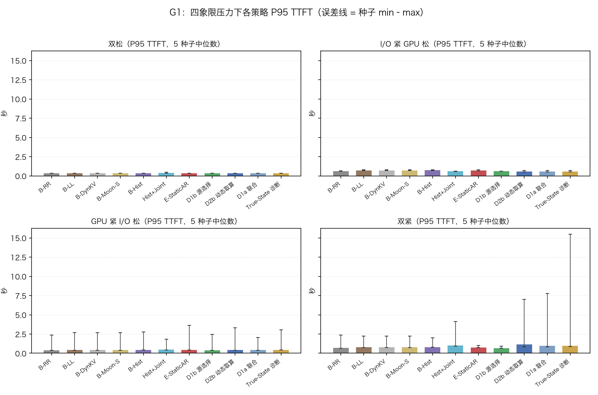
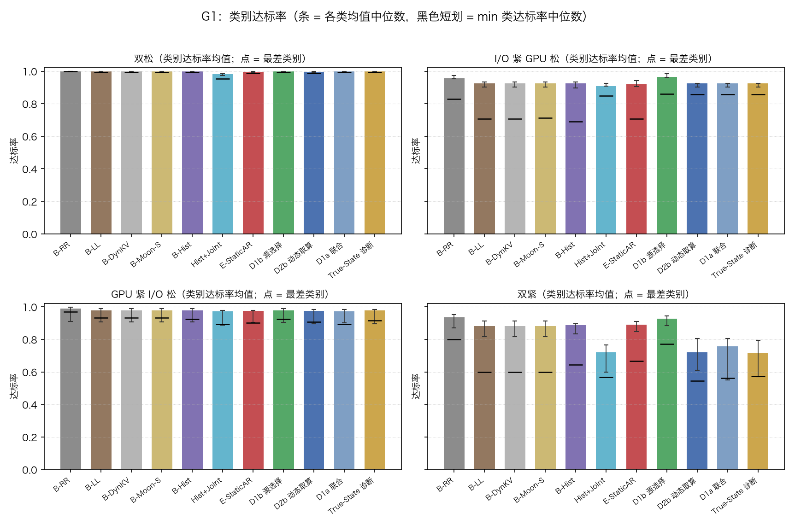
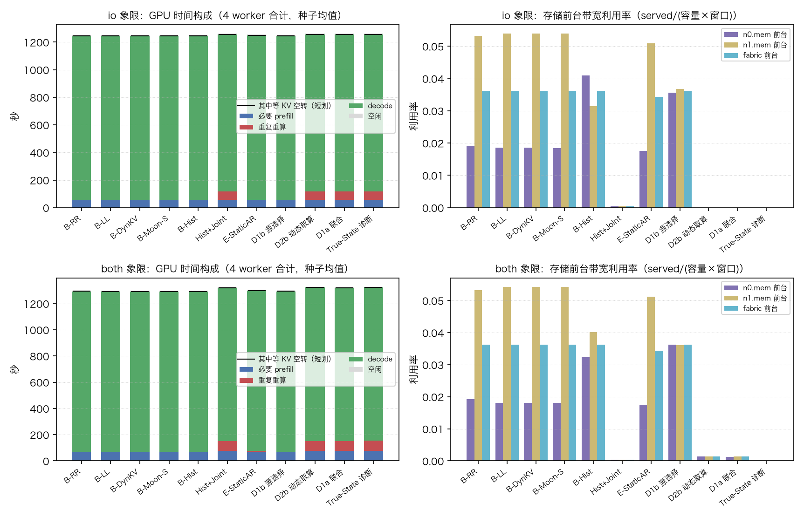
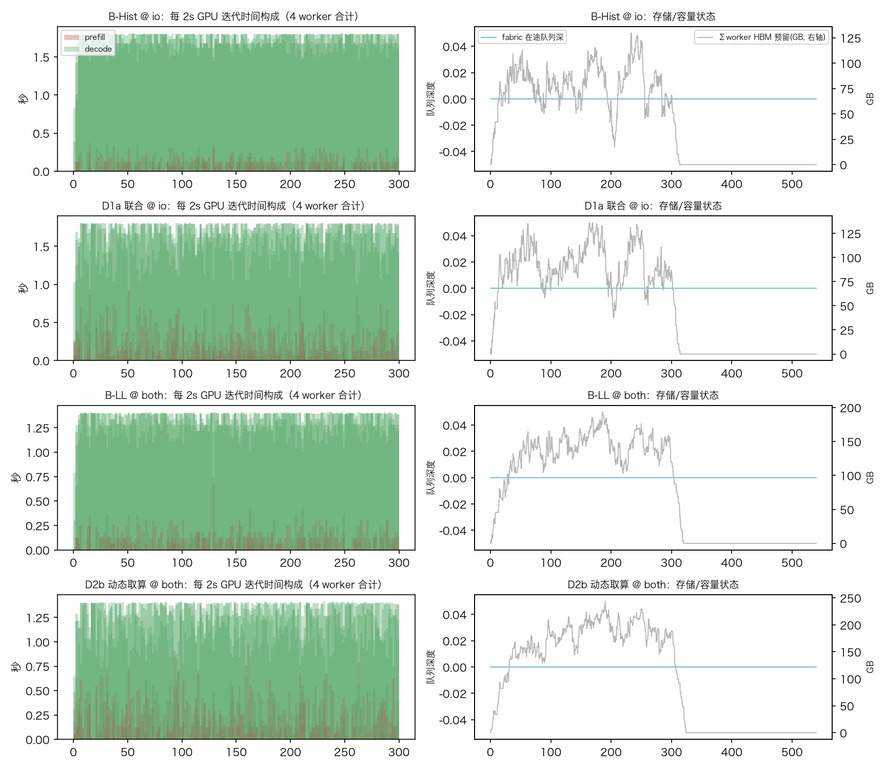
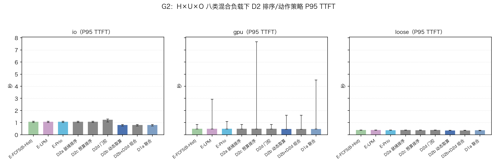
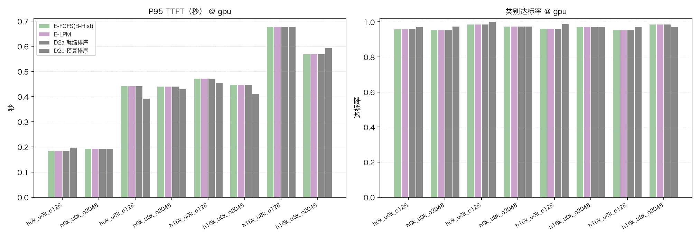
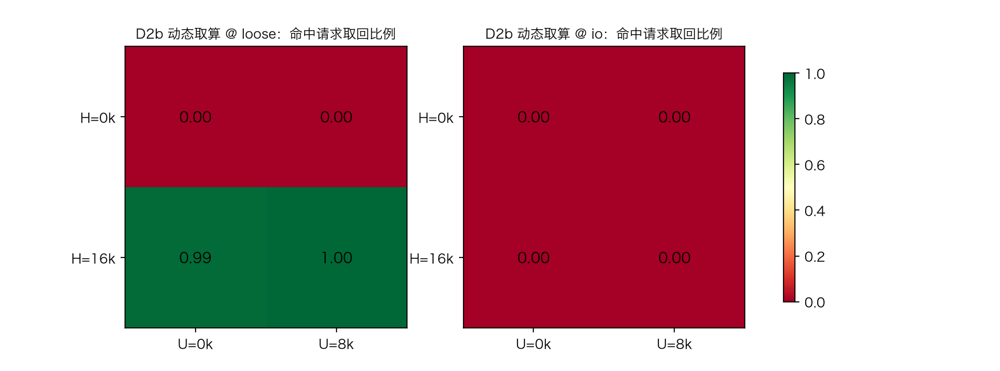

# 实验结果-G0G1G2：全局共享 KV 场景首轮机制实验（M1 引擎 + 存储感知调度策略）

| 项目 | 说明 |
|---|---|
| 日期 | 2026-09-08 |
| 范围 | 按设计文档 [全局共享KV场景的存储感知调度策略与实验设计-20260908](docs/全局共享KV场景的存储感知调度策略与实验设计-20260908.md) 完成第一轮机制验证：G0（引擎正确性）+ G1（四种压力场景 × 路由/动作策略）+ G2（八类混合负载 × 执行顺序策略）。**不含**：容量极限扫描、G3–G5 正式实验包 |
| 被测代码 | [sim/m1.py](sim/m1.py)（M1 引擎）、[sim/policies_g.py](sim/policies_g.py)（策略）、[sim/experiments/g_common.py](sim/experiments/g_common.py)（场景与负载）、[tools/g_report.py](tools/g_report.py)（图表） |
| 测试状态 | 全量单元测试 **65 项通过**（37 项既有 + 28 项本轮新增） |
| 复现命令 | `.venv/bin/python -m sim.run --exp g1 --seeds 5 --duration 300`；`--exp g2` 同；`.venv/bin/python tools/g_report.py` 生成图表 |
| 定位声明 | 这是**机制验证轮**：每种配置跑 5 个随机种子，只回答"因果方向是否成立"；设计要求的正式验收（10+ 种子冻结矩阵）留待下一轮，本文所有数字不外推为生产收益 |

---

## 0. 先读这一节：名词与策略速查

### 0.1 场景一句话

多台推理服务器（worker）**共用一个全局 KV 缓存仓库**：所有 worker 都能看到仓库里的全部缓存（目录全局可见），worker 本地不留缓存副本——要用缓存就去仓库取（走"存储节点 + 共享网络"两级通道），嫌取回慢也可以选择在 GPU 上重新计算（重算）。每个请求到达时要决定：**发给哪台 worker、从仓库的哪个副本取、取回还是重算**；进了 worker 还要决定**先算谁后算谁**。

### 0.2 四种压力场景（"象限"）

背景负载（别的租户占用的资源）造出四种拥挤组合，对应图的四个分栏：

| 代号 | 含义 | 比喻 |
|---|---|---|
| loose（双松） | 存储网络空、GPU 空 | 货梯和灶台都闲 |
| io（I/O 紧） | 存储带宽被背景占约 70%，GPU 空 | 货梯被外人占满，灶台闲 |
| gpu（GPU 紧） | GPU 被背景占 30%，存储空 | 灶台被占，货梯闲 |
| both（双紧） | 两边同时被占 | 货梯和灶台都挤 |

### 0.3 指标怎么读

| 名词 | 通俗解释 |
|---|---|
| 首字节延迟（TTFT） | 从请求到达到吐出第 1 个 token 的等待时间 |
| P95 | 95% 的请求比这个值快。看"尾部体验"（最差的 5% 有多糟） |
| 每步生成间隔（TPOT） | 出了首 token 之后，平均每多生成一个 token 的时间 |
| 达标率 | 同时满足该类延迟目标的请求占比（每类请求有不同的目标线，事先用公式定死，不按结果回调） |
| 最差类别 | 所有请求类别里达标率最低的那个。单看平均值会掩盖"牺牲了谁" |
| 取回占比 | 有缓存可用的请求里，实际选择"去仓库取"的比例；其余选择在 GPU 上重算 |
| 获胜种子 | 每个随机种子下让两个策略跑**完全相同的请求序列**，直接相减；"5/5"表示 5 个种子全部改善 |
| 可信区间 [x, y] | 真实差异大概率落在的范围。下端和上端都小于 0 = 方向一致、改善可信；跨 0 = 不确定 |
| 负向验证 | 预期"不应该有收益"的场景（如双松场景）——如果那里也"赚了"，说明度量有问题 |

### 0.4 策略速查（图和表里的代号都在这里）

**对照组 = 现有主流系统的默认做法**（在"全局共享仓库"场景下的形态）：

| 代号 | 一句话描述 | 对应现实系统 |
|---|---|---|
| B-RR | 轮询分发：请求按固定顺序轮流发给各 worker | Dynamo 无事件时的兜底 |
| B-LL | 挑最闲的：发给当前排队最短的 worker | MindIE Motor 默认 |
| B-DynKV | Dynamo 式打分路由 | 理论上应等价于"挑最闲的"（见下文验证） |
| B-Moon-S | 按名义带宽（纸面参数）估计"哪台机器+哪个副本取回最快" | Mooncake 调度器的静态版 |
| B-Hist | 按自己的历史传输记录（滑动平均）估计取回耗时来选路 | **强基线：新机制必须赢它才算数** |
| E-FCFS | 先来先服务（到达顺序执行） | vLLM 默认 |
| E-LPM | 命中前缀长的请求优先执行 | SGLang 默认（lpm） |
| E-Prio | 按外部给定的优先级排序 | vLLM/SGLang 的 priority 模式 |

**实验组 = 在决策里加入存储侧实时状态**（通过"访问成本查询"接口读取当前拥塞程度）：

| 代号 | 一句话描述 |
|---|---|
| E-StaticAR | 用**纸面带宽**比较"取回 vs 重算"哪个快（AAFLOW+ 论文的做法，对照组） |
| D2b 动态取/算 | 用**实时观测带宽**比较"取回 vs 重算"，逐请求二选一 |
| D1a 联合决策 | worker、副本、取/算三件事一起按实时观测选 |
| D1b 智能选副本 | worker 仍挑最闲，但取回时按实时观测挑源节点，并列时随机分散（防扎堆） |
| Hist+Joint | 历史经验 + 允许改重算（分离"信息来源"与"动作空间"两个因素） |
| True-State 诊断 | 假设实时反馈**零延迟、零误差**的参照系（只用于诊断，不代表可实现） |
| D2a 就绪优先 | 不用等取回的请求排前面 |
| D2c 期限紧迫优先 | 快超时的请求排前面（Cascade 论文式预算排序的实时版） |
| D2d 取回限流 | 存储压力大时限制同时发起的取回条数与字节量 |

---

## 总判决

**阶段性 go（限于机制验证轮）。** 三句话结论：

1. **看"实时拥塞"确实有用，看"纸面参数"没用。** 存储被背景占满（I/O 紧）时，按实时观测做"取回 vs 重算"二选一（D2b），把最差 5% 请求的首字节等待从 0.733 秒压到 0.582 秒（**快 21.6%，5 个种子全部改善，可信区间整体小于 0**）。同样会做二选一、但只看纸面带宽的 E-StaticAR 没有这个收益——说明起作用的是"现在有多挤"这条信息，不是"会换动作"本身。
2. **但两边同时挤时，聪明反被聪明误。** 双紧场景下，每个请求都看到货梯挤、都改为自己重算，结果重算洪峰压到本已 89% 满负荷的 GPU 上，整体反而慢 46%，所有类别都变差。**连"零延迟零误差的真值反馈"也一样失败**——问题不在信息不准，在于大家各自为政（需要协同机制，这是下一轮 G5 的靶子）。
3. **执行顺序怎么排，在这套系统里几乎不影响结果。** 八类混合负载下，先来先服务、长命中优先、就绪优先、期限优先四种排法的结果**一字不差地相同**。原因：引擎从设计上就保证"等数据的请求不挡道"，且该负载下排队不是瓶颈。真正的杠杆是**动作选择**（取回还是重算）和**选哪个副本**——后者（D1b）是唯一在两种拥挤场景下都稳定改善的策略（I/O 紧快 16%、双紧快 17%，5/5 种子）。

边界：以上结论只在"全局共享仓库"场景、5 种子、本报告的参数档位内成立；双松场景按预期所有策略打平（负向验证通过）。

---

## G0：先证明引擎账算得对（前置门槛）

新增 28 项单元测试（[tests/test_m1.py](tests/test_m1.py)），核心几条：

| 验证内容 | 做法 |
|---|---|
| 单请求时间与手算完全一致 | 取回路径逐段（路径延迟→存储服务→网络传输→剩余计算）手算，误差 < 10⁻⁹ 秒；重算路径、跨多步切块（预算不够一次算完）同样吻合 |
| 账目守恒 | 存储真正送出的字节 == 所有取回请求的字节总和；每个请求生成的 token 数不多不少 |
| 容量安全 | HBM 显存预留峰值永远不超过容量上限 |
| 降级正确 | 实时观测接口退化为纸面参数时，决策与静态策略逐字相同 |
| 可复现 | 同一种子跑两遍，输出逐字节相同 |

**判读**：门槛已过。开发中冒烟还暴露了三个缺陷（引擎空转时永不放行第一个请求；限流闸门在未启用的策略上也生效；路由器比较"取回 vs 重算"时忘了把重算成本按 GPU 被占程度打折，导致一边倒偏向重算）——都是先看到指标异常、再定位修复，符合"先冒烟查区分度"的流程要求。

---

## G1：四种压力场景 × 路由/动作策略

**这一节回答的问题：把存储侧实时状态加进"选机器 / 选副本 / 取回还是重算"的决策，什么时候有用、什么时候有害？**

**场景**。4 台 worker、2 个存储节点（每个 60 GB/s，两节点各存一份副本）+ 共享网络（120 GB/s）；5 类请求（短/长命中 × 短/长后缀 × 短/长输出的四个角 + 一个无命中对照），每秒 2.5 个请求，每格 5 个种子。

**怎么读**。四个分栏是四种压力场景，柱子是策略（名字见 §0.4 速查），柱高 = 5 个种子的 P95 首字节延迟中位数，误差线 = 种子间的最好/最差。**双松**栏所有柱子贴在一起（0.33 秒上下）——预期中的无收益区，负向验证通过。**I/O 紧**栏分层清晰：三个动态策略（D2b/D1a/True-State，0.582 秒）明显矮于历史经验基线 B-Hist（0.733 秒）。**GPU 紧**栏回到齐平（动态取/算偶尔小幅有益）。**双紧**栏方向反转：智能选副本 D1b 最矮（0.669），动态取/算 D2b 反而最高（1.147）。

### 表：G1 关键结果（完整表由 `tools/g_report.py` 生成）

（"变化量"= 相对 B-Hist 的同种子配对差中位数，方括号为可信区间，区间整体小于 0 即方向一致）

| 场景 | 策略 | 首字节 P95（秒） | 变化量 [可信区间] | 获胜种子 | 达标率（最差类别） | 取回占比 |
|---|---|---:|---|---:|---:|---:|
| I/O 紧 | B-Hist 历史经验（参照） | 0.733 | — | — | 0.93（0.69） | 100% |
| I/O 紧 | E-StaticAR 纸面带宽二选一 | 0.712 | −0.015 [−0.029, +0.003] | 4/5 | 0.92（0.71） | 35% |
| I/O 紧 | **D2b 实时二选一** | **0.582** | **−0.158 [−0.170, −0.108]** | **5/5** | 0.92（**0.86**） | 0% |
| I/O 紧 | D1a 联合决策 | 0.582 | −0.158 [−0.170, −0.108] | 5/5 | 0.92（0.86） | 0% |
| I/O 紧 | D1b 智能选副本 | 0.603 | −0.119 [−0.184, −0.090] | 5/5 | **0.96**（0.86） | 100% |
| 双紧 | B-Hist 历史经验（参照） | 0.805 | — | — | 0.89（0.64） | 100% |
| 双紧 | E-StaticAR 纸面带宽二选一 | 0.764 | −0.025 [−1.003, −0.020] | 5/5 | 0.89（0.67） | 35% |
| 双紧 | **D1b 智能选副本** | **0.669** | **−0.136 [−1.073, −0.105]** | **5/5** | **0.93**（0.77） | 100% |
| 双紧 | D2b 实时二选一 | 1.147 | **+0.372 [+0.075, +5.065]** | 0/5 | 0.72（0.54） | 1% |
| 双紧 | True-State 真值诊断 | 0.990 | +0.215 [+0.107, +13.461] | 0/5 | 0.71（0.57） | 0% |

**怎么读**。柱 = 各类请求达标率的平均，黑色短划 = 最惨的类别。I/O 紧场景里 D2b/D1b 把最差类别从 0.69 拉到 0.86；双紧场景里 D2b 反而把最差类别打到 0.54——平均数好看不等于没人被牺牲。

**四个发现（附资源证据）**：

1. **I/O 紧场景的收益，本质是"用 GPU 计算换存储排队"**。左图：历史经验基线在"等数据空转"上浪费 GPU（约 1 秒/worker），取回请求的 P95 等待 0.69 秒；D2b 用约 59 秒的额外重算（红色"重复重算"段）换掉了全部取回等待（右图存储前台流量归零）。因为重算可以和正在生成中的请求并行推进，而取回只能干等拥挤的共享通道——把串行等待换成并行计算，这就是 21.6% 的来源。
2. **双紧场景的反转是"各自为政的踩踏"**。GPU 本已被背景占 30%、生成负载又吃掉约 89% 剩余算力；D2b 让所有命中请求都改重算，又压进约 74 秒重算，prefill 排队变长，五个类别达标率全部下跌。最有说服力的对照是：只看纸面参数、对拥塞"无反应"的 E-StaticAR 反而稳定小赚（−0.025，5/5）——它继续取回，让货梯和灶台各自并行流动。**个体眼里的最优（避开货梯）在集体层面变成了踩踏信号（挤爆灶台）**；连真值反馈都救不了，说明缺的是"大家互相打个招呼"的协同机制。
3. **智能选副本（D1b）是唯一两边都赢的策略**。它不换动作、不给 GPU 添活，只是按实时观测在两个副本里挑当前更快的那扇门、并列时随机分散（取回 P95 等待从 0.69 降到 0.46–0.47 秒）。I/O 紧和双紧都 5/5 改善，且双紧下达标率最高（0.93）。**它是本轮最接近"可以直接拿去用"的机制**。
4. **两个设计预言被运行证据确认**：其一，B-DynKV、B-Moon-S 与 B-LL 三个"主流默认路由"的结果**逐字相同**——全局可见目录下，Dynamo 式"谁有缓存"的打分对所有 worker 一样，路由确实退化为纯负载均衡；其二，"挑最闲"（B-LL，0.705）反而不如最朴素的轮询（B-RR，0.617），因为它会让请求扎堆到同一台机器——这是 least-loaded 路由的已知弱点（生产上用"随机抽两台挑闲的"缓解）。

**怎么读**。上两行（I/O 紧）：历史经验的 GPU 里 prefill（红）与生成（绿）交错、共享网络队列（蓝线）起伏；D1a 切换成重算后网络前台流量清零、GPU 的 prefill 密度上升。下两行（双紧）：D2b 的重算洪峰让显存预留（灰线，右轴）与等待队列同步堆积——这就是"踩踏"的样子。

---

## G2：八类混合负载 × 执行顺序策略

**这一节回答的问题：请求进入 worker 后"先算谁"，对结果有多大影响？长命中优先（SGLang 默认）在存储压力下会不会帮倒忙？**

**场景**。命中长度 × 后缀长度 × 输出长度三个维度各取短/长，组成 **8 类请求**（等比例混合，每秒 2.2 个），这是为了把"要取多少数据"（命中长度）和"要算多少"（后缀长度）、"要生成多久"（输出长度）拆开看。路由固定用历史经验基线（B-Hist），只变执行顺序/动作策略。三种压力场景：I/O 紧、GPU 紧、双松。

**怎么读**。I/O 紧栏：五种排序策略（先来先服务、长命中优先、优先级、就绪优先、期限紧迫）的柱子**完全一样高**（1.076 秒）——顺序怎么排没有任何差别；"取回限流"（D2d）单独变差（1.238）；"动态取/算"（D2b 等）降到 0.796。GPU 紧栏全体接近，D2b 略优。双松栏 D2b 仍小幅领先（快 0.027 秒，5/5）。

### 表：G2 关键结果（对照 = 先来先服务 + 历史经验路由）

| 场景 | 策略 | 首字节 P95（秒） | 变化量 [可信区间] | 获胜种子 | 最差类别达标率 | 取回占比 |
|---|---|---:|---|---:|---:|---:|
| I/O 紧 | 先来先服务（参照） | 1.076 | — | — | 0.51 | 100% |
| I/O 紧 | 长命中优先（SGLang 默认） | 1.076 | +0.000 | 0/5 | 0.51 | 100% |
| I/O 紧 | 就绪优先 / 期限紧迫 | 1.076 | +0.000 | 0/5 | 0.51 | 100% |
| I/O 紧 | 取回限流 D2d | 1.238 | +0.140 [−0.006, +0.194] | 1/5 | 0.51 | 100% |
| I/O 紧 | **动态取/算 D2b** | **0.796** | **−0.286 [−0.308, −0.257]** | **5/5** | **0.78** | 0% |
| GPU 紧 | 期限紧迫 D2c | 0.488 | +0.000 | 2/5 | **0.95** | 100% |
| GPU 紧 | 动态取/算 D2b | 0.464 | −0.025 [−0.050, +0.750] | 4/5 | 0.96 | 52% |
| 双松 | 动态取/算 D2b | 0.355 | −0.027 [−0.034, −0.008] | 5/5 | 0.99 | 51% |

**怎么读（GPU 紧场景，按 8 类逐个看）**。期限紧迫排序把弱势类别小幅拉平（如"短命中长后缀"类 0.985→1.00、"长命中短后缀短输出"类 0.959→0.986）——快超时的先算，公平性有小红利，但幅度不到 2 个百分点。

**怎么读**。动态取/算的决策矩阵：双松（左图）只有"长命中"行选择取回（颜色越绿越倾向取回）——短命中重算比取回还快（固定的路径启动开销都省不回来，理论"死区"）；I/O 紧（右图）整表翻转为重算。

**三个发现**：

1. **执行顺序在这套系统里没有发挥空间（诚实的负结果）**。四种排序策略与先来先服务**一字不差**。原因有两层：其一，引擎从设计上就保证"等数据的请求不挡道"——等取回的请求不会占用计算预算，后面的请求照常进批（这是设计文档从纲领继承的规则）；其二，本负载下计算预算和显存都不构成准入竞争，排队顺序改变不了任何人的开始时间。设计里预注册的假设"长命中优先会让大取回扎堆、恶化尾部"**不成立**。要让排序有意义，需要构造"排在前面的请求占着资源等数据"的配置（例如取回在排到队首时才发起、或显存收紧）——这给下一轮的场景设计提供了明确输入。
2. **动态取/算的收益与代价都看得见谁在承担**。I/O 紧场景里它把最惨的"长命中"类从 0.51 拉到 0.78–0.98，但"短命中"小类从 0.99 跌到 0.84–0.87——重算洪峰的代价由没有受益的类别承担。这正是"调度改变的是全系统的资源分配"的实测注脚：报告收益时必须同时报告谁受损。
3. **取回限流（D2d）单独使用有害**。它只会推迟取回的发起、不会改换动作：背景负载主导的拥挤下，纯粹多等。与动态取/算组合后限流几乎不触发（该取回的早就改重算了），结果与单独 D2b 相同。限流的正确用法是"被拦下的请求转重算"——与动作策略耦合，留待下一轮协同实验（G5）。

---

## 实现 ↔ 设计一致性检查（按用户要求逐条核对）

**一致**的关键项：

| 设计要求 | 实现证据 |
|---|---|
| 全局可见目录、无本地缓存、副本放置冻结 | 场景构建 `build_topo`（`local_cache_gb=0`）+ 测试断言 |
| 共同引擎纪律（先生成、剩余预算切 prefill）+ 顺序可插拔 | 引擎主循环 + 五种排序键 |
| 信息边界：策略只读可观测接口 | 策略只经查询接口取数；真值仅诊断变体可用 |
| 基线与增强策略清单 | 设计 §3/§4 所列策略全部实现并运行（含补齐的 E-StaticAR、True-State） |
| 统计规则：同种子同请求序列、配对差、中位数+区间 | trace 只由种子生成；报告全部为配对统计 |
| SLO 目标线公式冻结 | 运行前由公式固定，未按结果回调 |

**偏差与未覆盖**（设计已划入后续范围，本文不宣称）：

1. TRT-LLM 式保守准入（E-NoEvict）未单列——第一版引擎的准入纪律本身就是保守预留，所有策略共用，无法构成对照。
2. 历史经验的"完美调参版"诊断、不同信号字段（利用率/带宽/排队/报价）的替换实验未做（真值反馈一档已覆盖）。
3. 容量极限（最大可承载速率）未扫描，只有固定负载对照；G3（状态给路由还是引擎）、G4（反馈时效）、G5（协同）未正式运行——双紧象限的踩踏现象就是 G5 的直接动机。
4. 只跑 4 worker 单档；引擎纪律变体与计算曲线形状敏感性未跑（曲线为本轮声明的机制级占位）。
5. 输出长度按类别确定（无预测误差维度）；生成间隔只报告、不计入达标判定。
6. 种子数 5（设计要求正式验收 ≥10）——机制方向可信，效应量数值下一轮复核。

---

## 与前序结论的衔接

- 上一轮 [M0R0](实验结果-M0R0-20260907.md) 用两请求的手算例子证明"贵的取、便宜的算"有价值；本轮把它放大到系统级并首次看到**失效边界**（双紧踩踏）。
- 旧 E5–E18 系列关于"本地缓存/局部性路由"的结论在"全局共享仓库"场景下不适用（本地缓存已关闭）；本轮 B-DynKV ≡ B-LL 的逐字相同，首次用运行证据确认了设计文档的退化推论。
- 纲领 v1.1 预设的"观察→行动"路线图命中两行：本轮观察到"真值反馈也失败"→ 下一步走协同（R5）；"改善平均但弱类受损" → 需要保护约束。

## 局限（读结论前必看）

1. 5 个种子、单一时长、固定负载；没做容量扫描和队列稳定性检验，**不能外推为可承载吞吐**。
2. 计算时间曲线、生成步耗时、显存容量等参数是机制级占位值，未经真实硬件标定；"取回 vs 重算"的交叉点位置随曲线形状移动（曲线必须轻微超线性，长命中取回才有意义——这一点已固化为单元测试）。
3. 存储用流体资源共享模型，没有队头阻塞等真实磁盘效应；相同缓存被并发请求同时取回时不合并（带宽账里含重复搬运）。
4. 双紧场景部分策略个别种子出现秒级尾刺（可信区间很宽），中位数稳健但尾部待扩种子后复查。

## 下一步（按证据依赖排序）

1. **协同主线（G5）**：以双紧踩踏为靶子——动态取/算 + "决策时计入同期已被别人占用的算力"（影子承诺）或按"每 GB 数据换回的计算量"分档限额，目标同时保住 I/O 紧的收益和双紧的稳健性。
2. 容量扫描 + 10 种子冻结矩阵，按设计验收线出正式 go/no-go。
3. 对称性负控制与"状态给路由还是给引擎"的 2×2（本轮 D1a 与 D2b 结果相同，预示对称拓扑下选 worker 无增量，需负控制确认后收窄主张）。
4. 执行顺序策略的前提检验（取回延迟到队首发起 / 收紧显存），判定排序类策略的适用条件。

## 通俗版解读（厨房比喻）

仓库是唯一货源，每间厨房都能看到全部货架（这就是"全局共享 KV"场景）。这一轮我们给厨房装了第一块"仓库实时看板"（访问成本查询接口），问三个问题：

- **看板有用吗？** 有。货梯被外人占满时（I/O 紧），会看板的厨师当场改自己重做，等第一道菜的时间缩短两成；只背价目表的老厨师（纸面带宽）做不到——**关键确实是"现在"两个字**。
- **看板会帮倒忙吗？** 会。货梯和灶台同时都挤时（双紧），每个厨师都看到货梯挤、都改自己重做，结果灶台被重做洪峰压垮，所有桌上菜都变慢；**就算看板零延迟零误差也一样**。缺的不是更准的看板，是大家之间的排号规则（协同）。
- **排队顺序重要吗？** 在这套规矩里不重要——厨房早就学会"等菜的客人不挡道"，而且灶位也不缺，谁先谁后都一样。顺序要有用，得先让"排在前面的客人占着灶台等货"成为可能。
- 最稳的赢家反而不改做法：**只换提货窗口**（智能选副本 D1b）——两扇窗哪扇人少走哪扇，货梯灶台都不添乱，两种拥挤下都赚。
