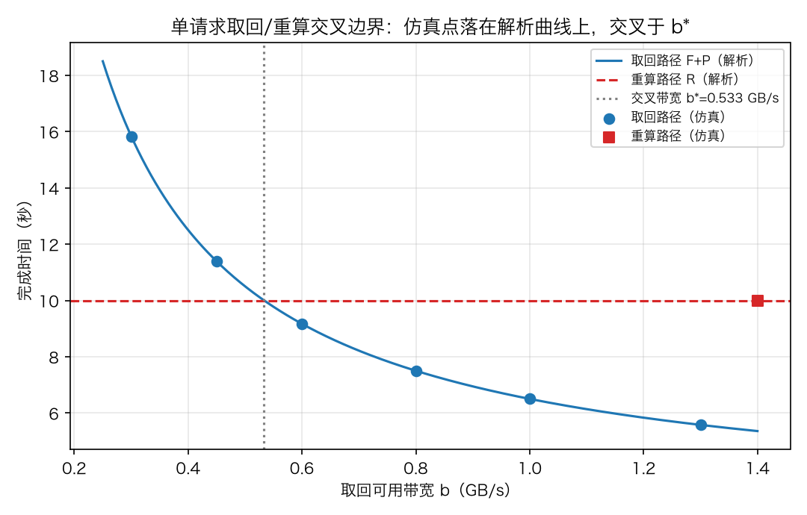
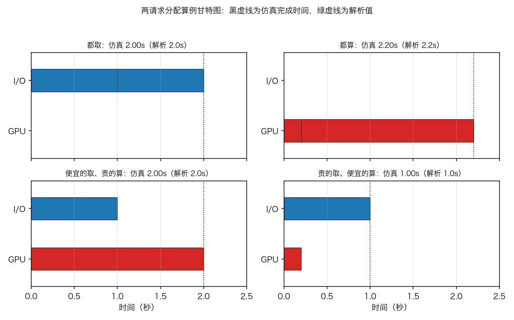
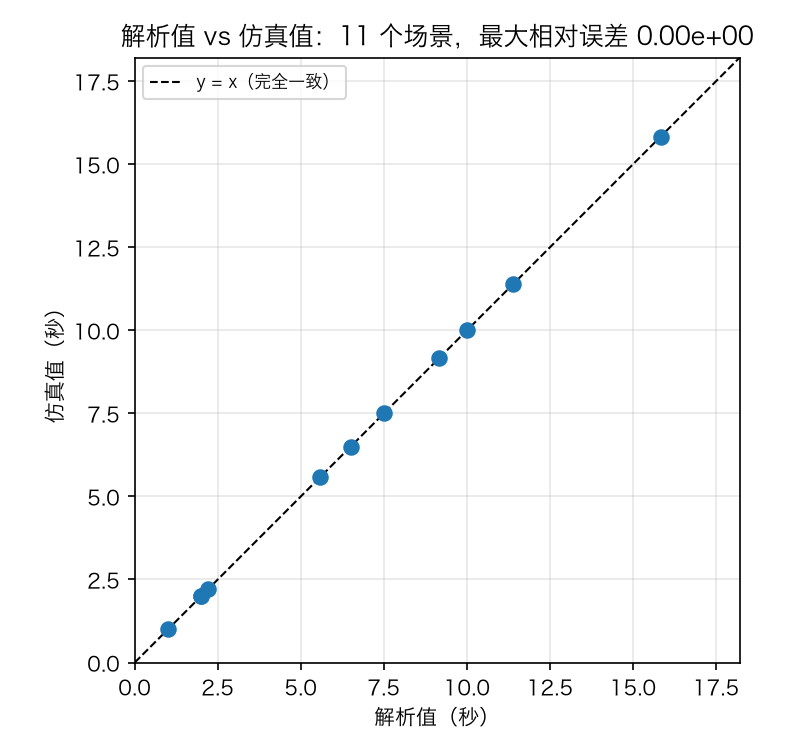

# 实验结果-M0R0：解析层验证（M0 微仿真 + R0 前置）

| 项目 | 说明 |
|---|---|
| 日期 | 2026-09-07 |
| 范围 | 纲领 [v1.1](docs/共享KV压力感知调度-研究推导与仿真实验纲领-v1.1-20260907.md) 的 M0 解析层与 R0 前置验证；不包含 M1 事件引擎与任何机制跑分 |
| 被测代码 | [sim/m0.py](sim/m0.py)（解析模型）、[sim/m0sim.py](sim/m0sim.py)（事件级微仿真）、[tools/r0_m0_report.py](tools/r0_m0_report.py)（图表工具） |
| 测试状态 | `.venv/bin/python -m pytest tests/ -q`：**55 项全绿**（27 项既有 + 28 项本轮新增） |
| 复现命令 | `.venv/bin/python -m pytest tests/ -q`；`.venv/bin/python tools/r0_m0_report.py` |
| 图表命名 | R 系列沿用 `docs/figures/fig_{r包}_{内容}.png`（延续 v1 字母、v2 e5–e9 的惯例） |
| 参数口径 | 全部数字为纲领 §3.1/§3.3 的**手算算例**（R=10s、P=2s、B=4GB、ℓ=0.5s；两请求各 1GB、I/O 1GB/s、重算 0.2s/2s），是占位参数，不是实测 |

## 总判决

**go（限于 M0 解析层）。** 仿真器在单 GPU、单 I/O 的限定世界里账目正确：阈值交叉点、两请求分配算例、逐资源守恒与解析值全部吻合，**11 个对照场景最大相对误差 0**。按纲领 R0 的判读，解析一致这一关已过；但排队、decode、部分恢复等事件级行为依赖 M1 引擎，**完整 R0 验收未完成，不进入任何机制跑分**。

## 检查一：不变量单元测试（55 项全绿）

对应纲领 v1.1 §11.1 不变量表，本轮覆盖其中三项："解析一致"、"资源守恒"（M0 层）、"单调性范围"（单请求串行模型内）。分组如下：

| 测试组 | 项数 | 验证的性质 |
|---|---:|---|
| 既有 v1/v2 回归（tests/test_sim.py、test_v2.py） | 27 | 既有行为不被破坏 |
| TestKVBytes：KV 字节张量计数 | 3 | 32 层×8 头×128 维×2 字节×2(K,V)=131072 B/token；4096 token≈0.537 GB；层数/头数等比例缩放 |
| TestFetchThreshold：单请求取回/重算阈值 | 7 | b*=B/(ΔC−ℓ)；阈值上下判决正确；边界处 F+P=R；**比较对象是 ΔC 不是完整 R**；ΔC≤ℓ 时带宽无解；线性放大反例（ℓ=0 时等比放大不改变取回偏好） |
| TestTwoRequestAllocation：两请求算例 | 7 | 四种分配 = 2.0/2.2/1.0/2.0 秒；最优分配严格优于两端极限；每种分配恰好达到资源下界（无凭空开销）；非法分配报错 |
| TestRecoveryCaseFromTokens：token→字节装配 | 2 | KV 字节随模型张量计数，成本由调用方给定 |
| TestM0Simulation：事件级仿真一致性 | 9 | 仿真完成时间与解析值一致；逐资源账本=提交工作量；同资源作业区间不重叠；阈值两侧仿真判决与解析一致；b* 处相等 |

## 检查二：阈值交叉边界（纲领 §3.1）

取回路径完成时间 `F+P = ℓ + B/b + P` 随带宽 b 递减，重算路径 `R = 10s` 为常数，两线交叉于 `b* = B/(ΔC−ℓ) = 4/7.5 ≈ 0.533 GB/s`。

**读法。** 蓝色实线是解析的取回路径时间，红色虚线是重算时间，灰色竖线是手算交叉点。蓝色圆点是事件级仿真在同一带宽下的完成时间——全部落在解析曲线上。b 左侧取回慢于重算、右侧快于重算，判决在交叉点翻转，与 §3.1 的推导一致。红线上的红方块是重算路径的仿真点（与带宽无关，恒为 10s）。

### 表：阈值扫描仿真点

| 带宽 b（GB/s） | 解析 F+P（秒） | 仿真完成（秒） | 相对误差 |
|---|---:|---:|---:|
| 0.30 | 15.8333 | 15.8333 | 0.0e+00 |
| 0.45 | 11.3889 | 11.3889 | 0.0e+00 |
| 0.60 | 9.1667 | 9.1667 | 0.0e+00 |
| 0.80 | 7.5000 | 7.5000 | 0.0e+00 |
| 1.00 | 6.5000 | 6.5000 | 0.0e+00 |
| 1.30 | 5.5769 | 5.5769 | 0.0e+00 |

## 检查三：两请求分配算例与甘特图（纲领 §3.3）

两请求同时到达，各需 1 GB KV，共享 I/O 1 GB/s，单 GPU 重算分别需 0.2s、2s。

**读法。** 每个子图是一种分配，蓝条是 I/O 作业、红条是 GPU 作业，黑虚线是仿真完成时间、绿虚线是解析值（两者重合）。右下角"贵的取、便宜的算"让 I/O（1 秒）和 GPU（0.2 秒）**并行推进**，1 秒全部完成——这是四种分配里最快的，比"都算"（2.2 秒，GPU 串行成为瓶颈）快一倍以上。左下角是它的反面：把 I/O 让给便宜的请求、贵的排队重算，GPU 的 2 秒成为瓶颈。这张图就是 §3.3"异质计算代价使分配有价值"的可视化。

### 表：四种分配的完成时间与逐资源账本

| 分配方式 | 解析完成（秒） | 仿真完成（秒） | I/O 账本（秒） | GPU 账本（秒） |
|---|---:|---:|---:|---:|
| 都取 | 2.0 | 2.0000 | 2.00（应 2.0） | 0.00（应 0.0） |
| 都算 | 2.2 | 2.2000 | 0.00（应 0.0） | 2.20（应 2.2） |
| 便宜的取、贵的算 | 2.0 | 2.0000 | 1.00（应 1.0） | 2.00（应 2.0） |
| 贵的取、便宜的算 | 1.0 | 1.0000 | 1.00（应 1.0） | 0.20（应 0.2） |

账本守恒：每个资源累计服务时间恰好等于提交给它的作业总量，没有凭空出现或漏算的工作。同时验证了 §3.3 的关键限定：这个算例只证明"分配有价值"，**不证明需要动态反馈**——静态成本策略也能选出第三行。

## 检查四：解析值 vs 仿真值总对照

**读法。** 11 个场景（6 个阈值扫描点 + 重算路径 + 4 种两请求分配）的解析值与仿真值全部落在 y=x 对角线上，最大相对误差 0.00e+00。在无竞争、串行 FCFS 的限定模型里，事件级执行与手算公式应当严格相等——这验证的是"仿真器会算账"，还不是"serving 真实"。

## 与前序结论的衔接

- 纲领 v1.1 §11.1 的"解析一致、资源守恒、单调性范围"三项不变量在 M0 层已有测试锚点；"估计收敛、承诺对账、信息隔离"等待 I1 基线与接口实现后补。
- R0 要求的甘特图、逐资源账本、解析-仿真误差表三类证据在本轮首次产出（M0 层）；排队/理想分享场景、分块 prefill 与 decode 事件、部分恢复两端退化，依赖 M1 事件引擎。
- 线性放大反例已固化为测试（`test_linear_scaling_leaves_threshold_unchanged`）：ℓ=0 且成本线性时，等比放大请求不改变取回偏好。后续任何"长短命中偏好不同"的实验结论都必须来自非线性来源，这个测试防止负载设计退回"同一模板放大十倍"。

## 局限

1. 全部场景为**无竞争、串行 FCFS、单 GPU + 单 I/O** 的限定模型；排队、processor sharing、多请求竞争下的行为尚未验证。
2. 没有 decode、没有 HBM 容量约束、没有部分恢复——这些是 M1 引擎的范畴，本文档的结论不能外推为 serving 收益。
3. 参数为手算占位值，未做硬件标定（纲领 §13.2 待标定清单不变）。
4. 图 1–3 由 `tools/r0_m0_report.py` 确定性生成，可复现；正式实验的多种子统计规则（纲领 §10）在本层不适用。

## 通俗版解读（厨房类比）

这一轮只回答了一个问题：**账本算得对不对。** 厨房里有一位厨师（GPU）和一部货梯（I/O）。我们手工算了三笔账——"货梯多快时，去取比自己做划算"（阈值交叉）、"两桌订单怎么分派厨师和货梯最快"（两请求算例）、"账本上每个资源干了多少活"（守恒）——然后让一个小机器人按规则真的去执行一遍，看它报的时间和手算是否一致。结论：分毫不差。但机器人现在只会在空厨房里干活；等真正挤满了客人、还要连着上菜（decode）的那套规矩建好（M1 引擎），才能开始研究"实时看板值不值得装"。
