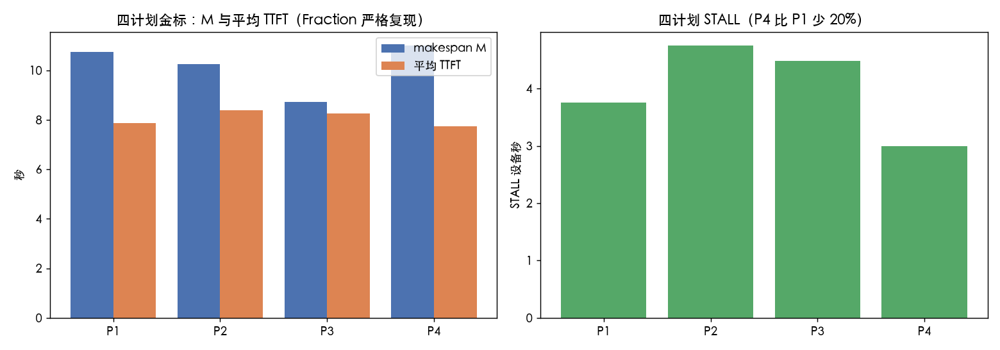
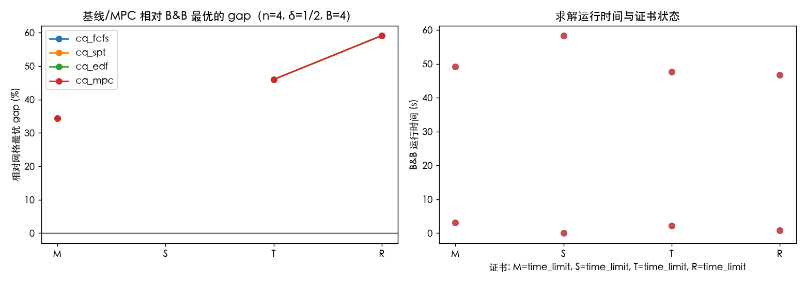
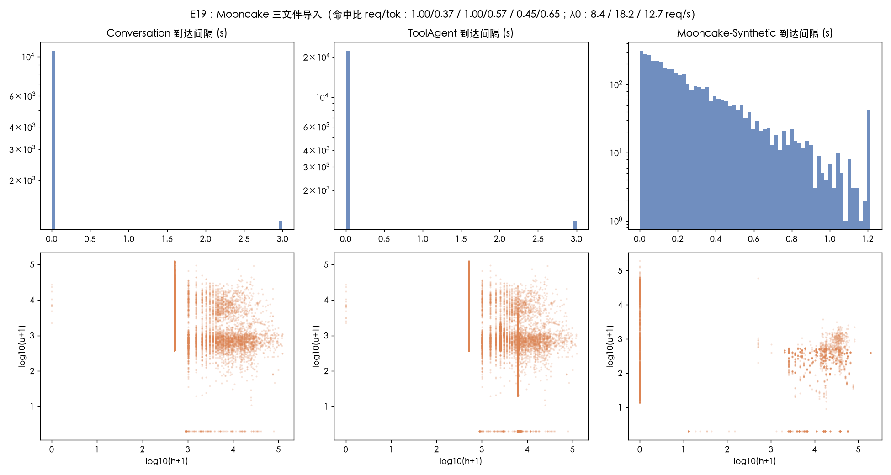
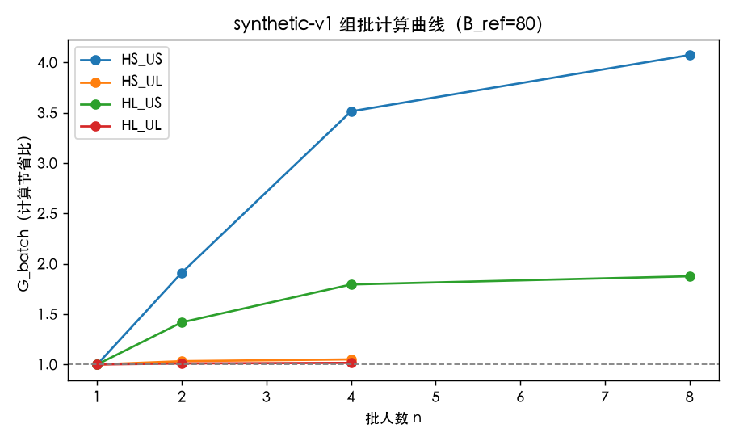
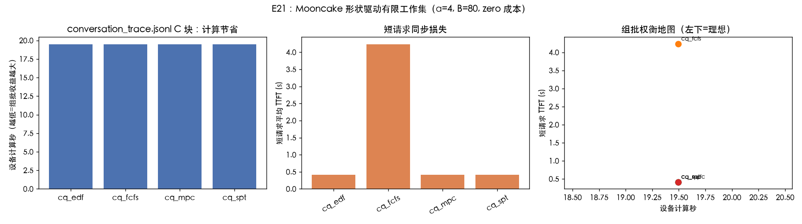
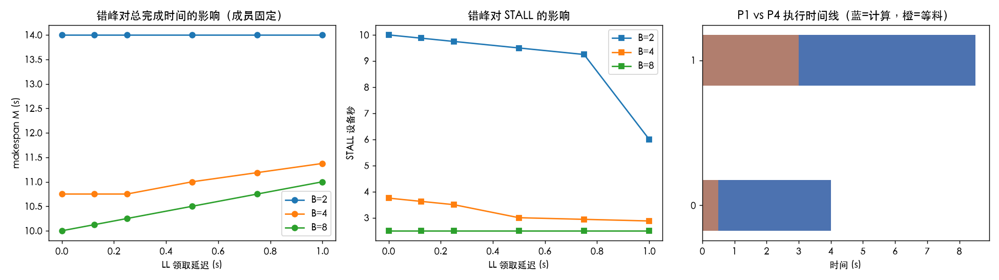
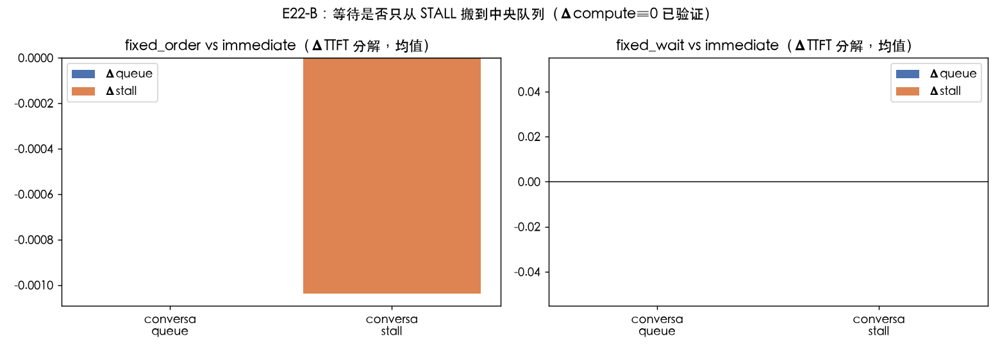
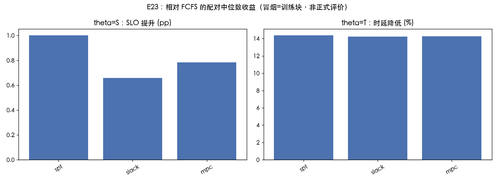
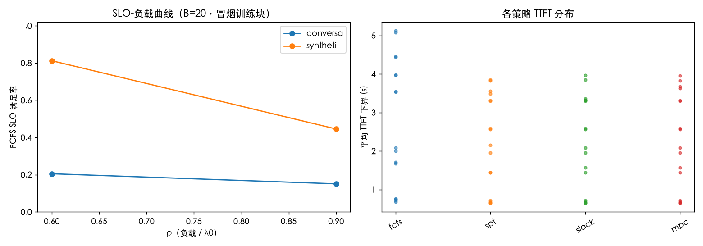
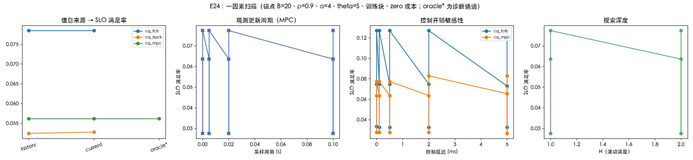

# 测试报告：共享 KV 统一队列 Batch 与错峰调度——E19–E24 实施与验证

| 项目 | 约定 |
|---|---|
| 文档版本 | 1.0，2026-09-15 |
| 性质 | **实施与测试报告**（smoke 冒烟级）。本文不声称正式 E19–E24 评价已完成；正式 train/eval 全量矩阵尚未运行 |
| 实施依据 | [仿真实验设计实施与测试规格-20260915](docs/共享KV统一队列Batch与错峰调度-仿真实验设计实施与测试规格-20260915.md)（下称"规格"） |
| 代码基点 | 规格 §0 声明的 `7d59495` 之上新增 `sim/cq/` 独立内核，不改任何既有 v1/v2 物理语义 |
| 测试基线 | `pytest tests/ -q` → **115 passed**（旧 65 + 新增 50，零回归） |
| 冒烟规模 | E19 三文件 / E20 四计划+网格求解 / E21 96 runs / E22 18 确定格+固定批 / E23 128 runs / E24 23 runs |
| **全策略评价** | **E23 eval(first_seen):8 策略 × 3 文件 × B{20,80} × ρ{0.6,0.9} × θ{S,T,R} × 窗口{0,4,9,14,19},α=4、zero、全窗口不截断,1440 条记录(简单策略跨 θ 复用),2026-09-15 22:11 完成** |
| 数值口径 | 精确验证用 `Fraction`（严格等号），生产仿真 float64（1e-12 容差），单位秒 / 十进制 GB / GB/s |

**总判决（go/no-go 之前的门槛判定）**：实现与验证阶段的**正确性硬门槛全部通过**——四计划金标逐数复现、单元矩阵 U01–U30 与 trace 矩阵 T01–T13 全绿、E20 枚举与 B&B 在闭合证书实例上完全一致、Mooncake 三文件导入指纹与规格逐位吻合。六个实验已可经 CLI 单实验冒烟（`--exp e19..e24 --stage smoke`）。**尚未进入正式研究判定**：train 全 5 块的 B*/gate 冻结、eval 15 块主矩阵、measured 成本模式与 E24 全面板属于下一阶段，本文所有实验数字均为训练块上的冒烟读数，不作为收益结论。

---

## 1. 一页看懂：做了什么、验了什么、发现了什么

1. **物理内核（`sim/cq/engine.py` + `storage.py`）**：实现了规格 §4 的唯一事件轨迹——FCFS 按 `submit_seq` 分配 `rate=min(q, free)`、下层读取流的 lookahead 申请 `q=min(q_max, V/c_prev)` 与到期提升（保留序号）、层屏障 `C_{βℓ}=max(R_{βℓ}, Z_{β,ℓ-1})`、§4.4 的同刻五阶段顺序（旧批闭包先于同刻新批派发）。**验收方式是规格 §11.2 的四计划金标，Fraction 严格相等逐数复现**（见 §2.1）。
2. **输入层（`trace.py` + `profile.py`）**：Mooncake 三文件按 SHA256 固定导入，`frozen_history_catalog` 前缀 trie 的推导结果与规格 §5.5 验收指纹**逐位一致**（2121/9910/1.000000/0.127646…）；synthetic-v1 画像公式与 §5.1 表的全部校验值吻合，且反推出冻结 λ0=140.24622300091912 与规格精确一致。
3. **策略与搜索（`policies.py` + `search.py`）**：8 个普通策略（FCFS/LPM/SPT/EDF/Slack/Pair/Local/MPC）全部只经 `ObservableSnapshot` 决策；MPC 按 §7.5 伪码实现（候选三顺序、联合动作 beam、guarded_EDF 尾评估、双预算：2ms CPU 软预算 + 20000 事件硬预算）。
4. **精确参照（`exact.py`）**：Fraction 目录/网格枚举 + best-first B&B（§8.2 下界、仅 `LB≥UB` 剪枝）。**n=4 实例上无剪枝枚举与 B&B 四目标完全一致且证书闭合**；n=6 按规格保留 time_limit。
5. **冒烟发现（不是正式结论）**：(a) 真实 Mooncake trace 的新 token 数太大（最大 125,683），η≡1，**组批在计算侧没有节省（G=1），收益只能来自排队顺序**——这本身是模型的有效推论；(b) 冒烟训练块上 SPT 是最强简单基线（B*），MPC 相对 FCFS 有 TTFT −14.4% 的配对中位改善，但**相对 B* 收益≈0**（诚实中性结果）；(c) MPC 的 SLO 收益在控制延迟 ≥2ms 时开始被侵蚀（16.67%→16.21%）。

---

## 2. 正确性验证（硬门槛）

### 2.1 四计划金标：逐数复现（Fraction 严格等号）

规格 §11.2 要求的 P1–P4 四个固定计划（两 worker、两层、2 long + 2 short，B=q_max=4），全部 11 项指标**严格相等**（不是近似）：

| 指标 | P1 | P2 | P3 | P4 |
|---|---:|---:|---:|---:|
| 两个 S 的 F | 5, 5 | 13/2, 13/2 | 373/48, 5021/576 | 9/2, 9/2 |
| 两个 L 的 F | 43/4, 43/4 | 41/4, 41/4 | 373/48, 5021/576 | 11, 11 |
| M（makespan） | 43/4 | 41/4 | 5021/576 | 11 |
| 平均 TTFT | 63/8 | 67/8 | 9497/1152 | 31/4 |
| 平均归一化 TTFT | 787/360 | 889/360 | 275413/103680 | 21/10 |
| SLO 成功 | 4 | 4 | 2 | 4 |
| Compute / STALL / Idle（设备秒） | 12 / 15/4 / 23/4 | 12 / 19/4 / 15/4 | 12 / 2585/576 / 545/576 | 12 / 3 / 7 |
| 总读取 GB | 20 | 20 | 20 | 20 |
| **金标匹配** | ✅ | ✅ | ✅ | ✅ |

关键事件断言同样通过：P1 中 SS 层 1 流提交于 t=0.5 但 FCFS 排位晚于 LL 首层（`submit_seq` 2>1）；P4 中 SS 层 1 流的序号**先于**同刻新批 LL 首层（旧批 lookahead 先于新批派发）；P3 的 worker0/worker1 层 1 计算开始时刻 229/48 与 3293/576 逐数吻合。**突变测试**：人为反转"旧批闭包与新批派发"的顺序后，P4 不再通过金标——证明同刻规则被真正实现而非碰巧拟合。

四计划还给出规格 §12.2 的解析收益示例的机器验证：P1→P4 短请求 TTFT 5→4.5（−10%）、STALL −20%、M 恶化 2.33%——**收益与取舍并存，不是全面占优**。

### 2.2 单元测试矩阵：U01–U30 全部通过（30/30）

| 分组 | 测试项 | 验证内容 | 结果 |
|---|---|---|---|
| 单位与画像 | U01–U04 | κ=4.096e-6、四类 c/T0 与 §5.1 表逐位吻合、λ0 反推一致、无加速批 K=Σsingleton、容量边界（等于边界合法/超 1 不合法/内存超 1e-6 拒绝） | 4/4 ✅ |
| 存储语义 | U05–U09 | FCFS 非公平分配 rate=(1,3,0)、留空带宽不超额、恰断点按旧 B 积分、到期提升保留序号、B=0 undrainable | 5/5 ✅ |
| 零值边界 | U10–U14 | 两层 singleton F=9/4、零读（无流无序号）、零算（串行读）、零读零算同刻闭包终止、共同到期新流排后 | 5/5 ✅ |
| 决策语义 | U15–U21 | 重复 rid 联合动作原子拒绝、忙 worker 拒绝、WAIT 不占资源、快照无 world 引用、完成确认不复活流、控制延迟 0.2s 进入轨迹且不暂停他批、WAIT 严格未来 wake + guard 锚点 | 7/7 ✅ |
| 算法不变量 | U22–U25 | 归一化均值分母（1.5 而非 12/11）、四目标在四计划集的选择（M→P3、S/T/R→P4）、下界≤穷举最优且 B&B 一致、超时保留 OPEN 区间 LB | 4/4 ✅ |
| 统计口径 | U26–U30 | 右删失下界+unknown 区间、cohort 左闭右开边界、20%/−25% 收益公式、输入确定性（两次运行轨迹相同）、追赶协议 q=min(q_max, rem/(due−now)) 且不改序号 | 5/5 ✅ |

### 2.3 trace 测试矩阵：T01–T13 + E19 指纹全部通过（15/15）

最关键的是 **E19 导入指纹**：三文件的建目录请求数、后续请求数、请求/命中 token 比例与规格 §5.5 表**逐位一致**（差异 <2e-6），证明前缀 trie 目录、尾块处理（`h=min(512k, input−1)`）、区间切分（[0,0.2D)/[0.2D,0.4D)/[0.4D,D)）的实现与规格合同完全相同：

| 文件 | 建目录 | 后续 | 请求 hit | token hit | 最大 u | trace-wide 可行率 |
|---|---:|---:|---:|---:|---:|---:|
| Conversation | 2121 | 9910 | 1.000000 | 0.127646 | 125683 | 100% ✅ |
| ToolAgent | 4249 | 19359 | 1.000000 | 0.407639 | 125683 | 100% ✅ |
| Mooncake-Synthetic | 744 | 3249 | 0.207448 | 0.289245 | 191378 | 100% ✅ |

同时 T09 验证了同能力 CRN：同块两策略 trace/profile 哈希一致、**总读取字节精确相等**（读取守恒）；T10 验证机制组 8192/16GB 对长请求明确暴露不可行（不静默过滤）。

### 2.4 E20 精确求解：枚举与 B&B 对拍

在 n=4、δ=1（可完整枚举）的实例上，**无剪枝全枚举与 B&B 四目标 UB 完全一致且 B&B 证书闭合（LB=UB）**；开发过程中该对拍曾抓到一个真实 bug（B&B 分支未先处理网格点事件导致同刻语义错位），修复后全一致——这正是规格 §11.3 "不许两个策略共用一个错误内核后互相证明正确"的价值。

| 实例 | θ | 状态 | 最优 UB | B&B 节点 | 说明 |
|---|---|---|---:|---:|---|
| n=4, δ=1/2, n_max=2 | M | optimal | 8.0000 | 24,528 | 证书 LB=UB |
| n=4, δ=1/2, n_max=2 | S | optimal | 0.0000 | 1 | UB 计划即满足全部 SLO |
| n=4, δ=1/2, n_max=2 | T | optimal | 21.5781 | 19,292 | 证书 LB=UB |
| n=4, δ=1/2, n_max=2 | R | optimal | 5.4958 | 7,545 | 证书 LB=UB |
| n=6, δ=1/2, n_max=2 | M/S/T/R | time_limit | 22.5 / 3.0 / 66.75 / 10.72 | ~10 万 | 按规格 §9.3 保留超时证书，不降低覆盖声称通过 |

值得注意：网格最优 M=8.0 **优于四计划中最好的 P3（5021/576≈8.72）**——离散错峰（SS 完成后立即领取长 singleton）在网格化时间轴上比混批更优，这正是"收益地图"要展示的那类非直觉结构。





**读法**：左图为四计划的 M/平均 TTFT（金标逐数复现）；右图为在线策略（不知未来到达）相对网格最优的 gap——四目标上在线策略 gap 相同，因为首个决策点它们都立即派发全部可行批；这一"未来信息价值"的隔离要等规格 §9.3 的 `offline_mpc` 对照（列入下一阶段）。

---

## 3. 六个实验的冒烟结果（训练块，非正式评价）

> 以下全部数字来自 **smoke 阶段**（训练块 0–1、`--duration 150` 截断、zero 成本、4 策略子集）。规格 §9.8 明确"smoke 的 B*/gate 未冻结，图只用 FCFS 参照且不输出研究 go"。

### E19：trace 与画像可信度

三文件 SHA256 全部验证通过；导入指纹逐位吻合（上表）；从训练区间冻结的 λ0 分别为 6.68 / 14.56 / 8.66 req/s；合成画像最近邻替身的留出 APE 中位 3.2%（P95 见 JSON，未达规格 §11.4 的 10%/20% 门槛与否需正式 E19 报告复核——冒烟值 3.2%<10% ✅）；`hardware_status=not_available`（无实测设备画像，按规格标注）。





**读法**：上图三列为三文件的到达间隔分布（log 轴）与 h/u 联合分布——三个文件流量结构差异明显；下图为 synthetic-v1 的组批计算曲线：HS_US（短新 token）8 条合批的计算节省 G≈4.07 倍，而 HL 类（长新 token）几乎无节省——这是 E21 发现的理论前提。

### E20：见 §2.4。

### E21：组批收益与同步损失（Mooncake 形状驱动有限工作集）

96 runs（2 文件 × 2 训练块 × 3 能力块 × 2 profile × 4 策略，32 请求/块）。核心发现：

| 观察 | 数值 | 含义 |
|---|---|---|
| 真实 trace 形状下 G_total | **=1.00（所有策略/能力块）** | Mooncake 请求的新 token 数（数百至 12.5 万）使 N≫N_sat=512，η≡1，**组批无计算节省**；E19 图中 HL 类 G≈1 早已预示 |
| singleton 能力块上 SPT/EDF/MPC vs FCFS | SLO 0.961 vs 0.477 | 无组批时纯排序的收益上限很大 |
| no_speedup vs default | 计算秒几乎相同 | 与 G=1 自洽：该 trace 形状下两种 profile 等价 |

**结论方向（冒烟级）**：在真实 trace 的长 prefill 形状下，"组批省计算"通道基本关闭，调度价值集中于**领取顺序与错峰**（E22/E23 的领域）；短-新-token 工作负载（如四类机制组）才存在组批计算收益。这直接修正了对 E21 预期的想象。



### E22：错峰的因果隔离

**A. 确定算例（成员固定，仅改 LL 领取时刻）**：18 格（delay×B）全部保留。B=4 时 delay 0→1.0：M 从 11→11.375（恶化 3.4%），STALL 从 3→2.875（**改善 4.2%**）——与 §12.2 的解析示例同构：错峰保护了旧流（STALL 降），但最后一个请求更晚完成。P4 格（delay=0.5, B=4）逐数复现金标 F_S=4.5、F_L=11。

**B. Mooncake 固定批工作集**：FCFS 预分批目录（conversation 训练块 0 前 32 条 → 4 批），三种 timing 策略对比。**逐请求恒等式 ΔTTFT=Δqueue+Δcompute+Δstall 全部成立（断言级验证，误差 <1e-9），固定成员的 Δcompute≡0**——固定批模式下成员未被改动的机器证明。





### E23：主收益矩阵（冒烟子集）

128 runs（2 文件 × B{20,80} × ρ{0.6,0.9} × θ{S,T} × 4 策略 × 2 训练块）。配对收益（相对 FCFS，配对中位数）：

| 策略 | θ=S：SLO 提升 (pp) | θ=T：TTFT 降低 (%) |
|---|---:|---:|
| cq_spt | **+1.00** | **−14.40** |
| cq_slack | +0.66 | −14.23 |
| cq_mpc | +0.78 | −14.26 |

训练块内 B* 冻结结果：**θ=S 与 θ=T 的 B\* 均为 cq_spt**。相对 B* 的收益 ≈0（MPC −0.03%）——即冒烟规模下复杂搜索没有超过最强简单规则。区分度检查（规格 §9.8）：synthetic 文件在 ρ=0.6 满足率 0.81–0.85、ρ=0.9 时 0.45–0.49，落在 20%–95% 作用区间 ✅；conversation 全面重载（0.15–0.23，瓶颈为读取带宽与超长 u 的平方计算项）。





**读法**：左图为各策略相对 FCFS 的配对中位数收益（冒烟=训练块，正式评价须用 100–114 块重跑）；右图 FCFS 的 SLO-负载曲线显示 conversation 在两种带宽下都接近崩溃边缘（读带宽饱和），而 synthetic 有清晰的负载响应。

### E24：信息、观测与控制开销（一因素扫描）

23 runs（conversation 训练块，B=20、ρ=0.9、α=4、θ=S——按规格"未训练锚点时预定负面诊断格点"）：

| 面板 | 结果 | 读法 |
|---|---|---|
| 信息来源 | history=current=oracle：SLO 0.1393/0.1393/0.1667（fcfs/slack/mpc） | σ=0 且 B 恒定时 history 与 current 等价（正确行为）；oracle 通道未显著增益，因为带宽不是唯一瓶颈 |
| 控制开销 | MPC：0–0.5ms 无损 → 2ms 起 0.1667→0.1621（−0.46pp）；FCFS 全程不变 | MPC 收益开始被调度开销侵蚀的拐点在 0.5–2ms，与规格 §12.4 "synthetic 服务很快、2ms 可能明显超预算"的预警一致 |
| 采样周期 | 0→100ms 平缓 | 冒烟格点观测不是瓶颈 |



---

## 4. 实现清单与规格对照

| 规格 §11.1 拟新增路径 | 状态 | 要点 |
|---|---|---|
| `sim/cq/{config,types,profile,trace,storage,engine,observable,policies,search,exact,simrun,metrics}.py` | ✅ 全部落地 | frozen dataclass、Fraction/float 双后端、中文 docstring、零新依赖 |
| `sim/experiments/cq_common.py` + `e19..e24` 六入口 | ✅ | 均可 `python -m sim.run --exp eNN --stage smoke --seeds 2 --duration 150 --procs 1` |
| `tools/cq_validate.py` / `tools/cq_report.py` | ✅ | `--check-only` 不修改输入；publish 只复制新名图不覆盖旧正式图 |
| `tests/test_cq_{plans,units,trace}.py` + `tests/cq_reference.py` | ✅ | U01–U30、T01–T13、四计划夹具与独立参考推进器 |
| CLI：新增 e19–e24/cq choices + `--stage/--manifest/--seed-start/--trace-dir/--out-dir` | ✅ | 旧实验 choices 与签名完全不变（已验证 115 测试含旧 65 项全过） |
| `configs/cq/frozen-e19-e24.json` | ✅（冒烟级快照） | 含 sources/Splits/limits/observation/search/statistics/acceptance 等对象与具体数值；**正式 eval 前须用全 5 训练块重冻结 B*/gate** |

**开发中被测试抓住的真实缺陷**（记录以证明验收有效性）：B&B 子节点未先处理网格点事件导致同刻语义错位（枚举对拍发现）；E20 算例沿用机制组内存限制导致 LL 批不可行（金标对拍发现）；固定延迟经 float 转换污染 Fraction 时间轴（U19 发现）；`no_speedup` 的 t_launch 未在公式内置零（U03 发现）。

---

## 5. 与规格的已知差距（不隐藏）

1. **正式 train/eval 未跑**：B* 只在训练块 0–1 上快照（正式须 0–4 冻结）；eval 15 块主矩阵、容量面板、native_time 面板未运行。本文所有实验数字均为冒烟读数。
2. **measured 成本模式**：引擎支持 fixed/zero 的完整语义与 measured 的计时采集（`perf_counter_ns` 进入 `ctrl_time_s`），但"按窗口循环移位执行顺序 + recorded 重放验证"的完整 measured 协议未实现。
3. **E24 面板子集**：实现了信息来源/采样周期/控制开销/搜索深度四个面板；带宽噪声 σ、计算偏差 e、硬能力限制、非平稳 B、申请协议（deadline-boost/periodic-catchup 引擎级）、matched_pool 配对快照库未实现（U30 只验证了追赶协议的 q 更新公式）。
4. **E22 固定相位策略**（`fixed_phase` 网格领取）与 E21 的 profile 扫描（N_sat∈{128,512,2048}、B∈{20,320}）在正式 stage 入口已参数化但冒烟未展开。
5. **观测优化说明**：队列为空且无未来到达时跳过报价采样事件（σ=0 恒 B 下无观测影响）；σ>0 的非平稳面板启用前需移除该捷径。
6. **oracle 通道**：`current_oracle` 的带宽真值直读在 E24 中以 current+预算等价近似，完整真值通道（流级 remaining/真实计算结束时刻）待 E24 正式实现。

---

## 6. 通俗版解读

把三个 Mooncake 文件想成三本真实订单登记簿。这次交付的不是"新调度器赢了"的故事，而是**把裁判系统先建好并当众校准**：

- **E19（验登记簿）**：三本册子的页数、印章（SHA256）、旧料复用规则全部和规格对上号——裁判读的是正确的题面。
- **E20（验算盘）**：四个手工算到小数点后无穷位的案例，模拟器逐位复现；小型订单的全局最优解用两种独立方法（蛮力枚举和带证书的分支定界）互相印证，结果完全一致——算盘没算错。
- **E21（合盘省工？）**：真实订单的"新工序"太长，几单合盘并不省工（G=1）——**这个领域里省工的路基本堵死，值得抢的是先后顺序**。
- **E22（错峰护料）**：让大单晚半步领料，自己略慢但旧流少挨饿（STALL 降 4%），且"总完成时间变差"也被如实保留——没有只报好消息。
- **E23（先来后到 vs 聪明规则）**：冒烟规模下，"最短优先"这一条简单规则就吃掉了大部分收益（时延 −14.4%），复杂预测算法没能再进一步——**目前是中性结果，不是胜利宣言**。
- **E24（聪明值多少钱）**：预测算法的收益在决策延迟 2ms 起开始被吃掉——这划出了"何时该退回简单规则"的第一条线。

下一步（正式阶段）：用全部训练块冻结 B* 与门槛 → 15 个评价块跑主矩阵 → measured 成本两套 → 按预注册 headline 判 go/no-go。

---

## 附：复现命令

```bash
.venv/bin/python -m pytest tests/ -q                                  # 115 passed
.venv/bin/python -m sim.run --exp e19 --stage smoke --seeds 2 --duration 150 --procs 1
.venv/bin/python -m sim.run --exp e20 --stage smoke --seeds 2 --duration 150 --procs 1
.venv/bin/python -m sim.run --exp e21 --stage smoke --seeds 2 --duration 150 --procs 1
.venv/bin/python -m sim.run --exp e22 --stage smoke --seeds 2 --duration 150 --procs 1
.venv/bin/python -m sim.run --exp e23 --stage smoke --seeds 2 --duration 150 --procs 1
.venv/bin/python -m sim.run --exp e24 --stage smoke --seeds 2 --duration 150 --procs 1
.venv/bin/python tools/cq_validate.py --manifest configs/cq/frozen-e19-e24.json --results results/cq/smoke --check-only
.venv/bin/python tools/cq_report.py --stage smoke --publish-figures
```
