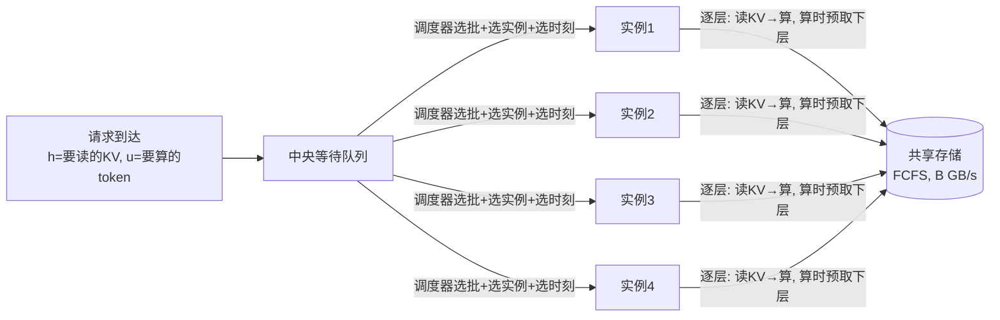

# 测试报告：E25 因子地图与时间序列面板——实施、验证与实验结果

| 项目 | 约定 |
|---|---|
| 文档版本 | 2.0，2026-09-16（v2.0：全文按"第一次读也能懂"重写——新增 §0 怎么读/名词表，全文改为"先说结论→再给证据→图先教怎么看"的结构；v1.1 的分 trace 结果、配置总表、图导读全部保留并扩写） |
| 性质 | 实施 + 测试 + 正式实验报告，依据 [E25 设计与测试规格 20260916](docs/共享KV调度因子地图与时间序列-E25设计与测试规格-20260916.md) |
| 代码 | `b18bee8`（时间序列聚合器）+ `a6a40a3`（实验入口与图）；测试 **143 passed**（新增 25 项），既有测试零回归 |
| 实验 | 全矩阵 255 格点 / 7080 条记录 / 时间序列守恒校验 **0 失败**；结果按 trace 分开保存（每条记录带 `file` 等字段） |
| 配套 | MPC 方案的图解教学页：[docs/MPC方案图解-20260916.html](docs/MPC方案图解-20260916.html)（例子+动画+公式） |

---

## 0. 怎么读这份报告

**如果你只有 5 分钟**：读 §1（我们在研究什么）和 §8（结论）。
**如果你有 15 分钟**：加上 §4 的三个 trace 小节（每个先读一句话结论）和 §7（为什么"只有时延无条件赢"）。
**如果你要核查数字**：§3 是全部实验条件，§9 告诉你这些数字不能推广到哪，§10 是复现命令。

### 0.1 名词表（按出现顺序，读到不认识的词就回来查）

| 名词 | 意思 |
|---|---|
| **请求 / h / u** | 一条推理请求。h = 命中前缀的 token 数（这部分 KV 要从共享存储读回来）；u = 还要新算的 token 数 |
| **TTFT** | 首 token 时延 = 完成时刻 − 到达时刻，包含排队、读 KV、计算的全部时间 |
| **T0** | 这条请求"独占整个系统"时的参考 TTFT（空系统、参考带宽下的解析值）。用来做归一化和定 SLO |
| **SLO / 满足率** | 服务等级目标：deadline = 到达 + α×T0（α=4 即"给你 4 倍独占时间"）。满足率 = 按时完成的请求占比 |
| **四个优化目标 θ** | M=最后一条请求何时完成（越小越好）；S=没按时完成的请求数（越少越好）；T=平均 TTFT；R=平均"TTFT/T0"（短请求的同样延误在这里权重更大） |
| **策略 / 方案** | 决定"哪些请求拼成一批、给哪个实例、现在发还是等等"的算法，共 8 个（§2） |
| **FCFS 基线** | 到达序贪心填批、有空闲实例立即发。它是 vLLM/SGLang 默认调度逻辑在本研究架构中的投影，所有收益都相对它度量 |
| **FW / OL 两种实验模式** | FW=有限工作集：取 128 条请求全部同时到达，能干净定义 M；OL=在线流：按 trace 的真实时间节奏（缩放后）到达，更接近真实服务 |
| **trace / 窗口** | 三份 Mooncake 请求记录（Conversation 对话 12031 条 / ToolAgent 工具调用 23608 条 / Synthetic 发布方合成 3993 条）。每份等切成 20 个时间窗，实验用其中 5 个 |
| **ρ（负载）** | 到达率 = ρ × λ0，λ0 是该 trace 的参考容量刻度。ρ=0.6 即六成负载 |
| **B / q_max** | 共享存储总带宽（基线 80 GB/s） / 单条读取流的申请率上限（200 GB/s） |
| **Compute / STALL / Idle** | 实例的三种状态：正在算 / 批已领但本层数据没到（干等）/ 没有批（闲）。三个加起来 = 4 实例 × 总时长 |
| **G_total** | 组批计算节省率 = "这些批逐个单独跑需要的计算秒" ÷ "合批实际花的计算秒"。=1 表示合批不省计算 |
| **配对中位数** | 收益的度量方法：同一窗口、同一条件下两策略相减，再对全部窗口取中位数（避免不同窗口的负载差异污染比较） |

### 0.2 这份报告回答的三个问题

1. **八种调度方案，在四类指标上到底谁好多少？**（§4，按三份 trace 分别回答）
2. **拧动六个"全局影响因子"（带宽、期限、负载、批能力、计算画像、搜索），结果怎么变？**（§5）
3. **系统运行过程中，计算/等数据/闲置和带宽利用率随时间怎么变化？策略改变了什么？**（§6）

---

## 1. 我们在研究什么（系统模型，一段话版）

多个推理实例共用同一份 KV 存储。请求带着"已命中前缀"到达，先进**唯一的中央等待队列**；空闲实例从队里**取走一批**请求，然后逐层执行"读这层的 KV → 算这层"，算本层的同时预取下一层；所有实例的读取挤**同一条共享带宽**，存储按 FCFS（先提交先服务）分配。调度器能决定的只有三件事：**哪些请求拼一批、哪个实例先领、要不要晚点再领**。



要回答"调度到底值多少"，就必须在**同一物理规则**下只换调度算法比较——这就是本报告全部实验的做法（同窗口同请求流配对）。

## 2. 被比较的八个方案

| 方案 | 一句话：它怎么决定 | 类比 |
|---|---|---|
| **cq_fcfs**（基线） | 谁先到谁先做，凑满 8 个或凑不满都立即发 | 先来后到 |
| **cq_lpm** | 命中前缀最长的先做 | 大客户优先 |
| **cq_spt** | 预计最快做完的先做（按 T0 排序） | 小单优先 |
| **cq_edf** | 截止时间最早先做（deadline = 到达 + 4×T0） | 快到期优先 |
| **cq_slack** | 剩余时间最紧的先做（截止 − 现在 − 预计耗时） | 最急优先 |
| **cq_pair** | 最老请求打头，其余按"读多算少/读少算多"互补搭配 | 拼桌搭配 |
| **cq_local** | 与 MPC 相同的候选与评分，但预测时假装各实例互不抢带宽 | 近视版 MPC |
| **cq_mpc**（本文提出的方案） | 每次决策：生成若干"发批/等待"候选，**在系统副本上把每种候选完整模拟到排空**，按 θ 打分选最优，只落实第一步 | 下棋先在脑子里推演 |

MPC 的完整机制（预测状态怎么建、候选怎么生成、怎么打分、为何常与 EDF 相同）见配套教学页 **[docs/MPC方案图解-20260916.html](docs/MPC方案图解-20260916.html)**（含例子动画与公式）。

## 3. 实验条件（§1.4 表的完整版）

### 3.1 系统与计算

| 参数 | 取值 | 为什么 |
|---|---|---|
| 推理实例数 | **4**，同构，每实例同时只有 1 个活动批 | 规格 §12.6 首轮公共参数 |
| 层数 L | 32 | synthetic-v1 画像定义 |
| 每层计算时长 | `c = 50μs + 2e-7 s/token × N/η + 1e-10 s × A`；N=批内新 token 总数，A=attention 有效配对数，η=min(1, max(1/16, N/512)) | **解析公式（synthetic-v1），不是任何真 NPU 的实测**——文档1 §2.8 定义的机制研究假设参数。η 的含义：批内新 token 总数不到 512 时合批省计算，超过 512 后收益归零 |
| 每请求每层读取量 | 4.096e-6 GB × h（只读命中前缀） | 8 KV 头 × 128 维 × K/V 各 2 字节 |
| 读取协议 | 算本层时提交下层读取（lookahead），申请率 min(200, 下层字节/本层时长)，到期没读完提速补读 | 所有策略共用的引擎协议，不是策略可选项 |

### 3.2 批容量 / 存储 / 负载 / 评价

| 参数 | 取值 | 为什么 |
|---|---|---|
| 批上限 | **8 个请求、Σu≤262144、工作区 128 GB** | 真实 trace 最长请求有 191,378 个新 token，机制组默认的 8192/16GB 装不下；放宽后**覆盖率 100%，不截长不丢请求** |
| 共享带宽 B | 基线 **80 GB/s**，因子线 {20, 320} | 80≈读取完全被计算掩盖的拐点之上（见 §6） |
| SLO | deadline = 到达 + **α×T0**，基线 α=4，线 {2,8} | 相对期限：每条请求的期限与自身体量成比例 |
| 负载 ρ | 基线 0.6，线 {0.3, 0.9, 1.1}；到达时间按比例缩放 | λ0 按文件全量冻结，所有策略同一份请求流（CRN） |
| 控制成本 | zero（决策不耗时） | measured 为扩展项 |
| 评价 | 5 窗口 × 同窗口配对中位数；时间序列 200 桶、FCFS 锚定 | 配对消除窗口间负载差异 |

### 3.3 两个常见问题（FAQ）

**Q：同一时刻到达的请求不够一批，会等凑满吗？**
**不会。** 简单策略只要"有空闲实例 + 队列非空"就立即发不满批（head-of-line：按排序键取队首逐个塞，第一个塞不下的就停批）。只有 MPC 有"等 0.05/0.1/0.2 倍参考批时长或等到某条读取完成"的候选动作，但本次实验里从未胜出；E22 的相位策略才按固定相位等待。产品里的"等批时限"（如 MindIE 的 maxQueueDelayMicroseconds）在本研究中属未部署的 timing 因子。同刻组超过 8 条时（Conversation 最大同刻组 28），按排序键前 8 条成批、依次给 4 个空闲实例，其余排队。

**Q：为什么 spt/edf/slack/local/mpc 五个方案结果几乎一样？**
两个原因叠加：① SLO 定义是"到达+4×T0"，于是 SPT（按 T0 排）、EDF（按 4×T0+到达排）、Slack（按 3×T0−已等排）的排序键是**同一个东西的仿射变换**——FW 模式全体同时到达时三个顺序完全相同；② MPC 的基础动作和后续策略都是 EDF，它只在找到**严格更优**的首动作时才偏离（gate=0），本矩阵从未发生（§7）。`pair` 锚定最老请求、近似到达序，所以像 FCFS。

---

## 4. 主要结果：三个 trace 分开看

> 先记住一句话框架：**排序类策略（spt/edf 等）无一例外地大幅降低平均时延；其他指标（SLO、M）是否也改善，取决于这份 trace 的请求结构**。三个 trace 正好构成三种典型。

### 4.1 Conversation（对话流，12031 条，长上下文多）

**一句话结论：顺序类几乎全面占优——时延 −60%、总完工时间 −16%，SLO 只有小的代价。**

FW（128 条同时到达）绝对中位数：

| 策略 | M 最后完成 (s) | SLO 满足率 | 平均 TTFT (s) | 归一化 TTFT |
|---|---:|---:|---:|---:|
| fcfs（基线） | 28.31 | 0.078 | 6.48 | 307.7 |
| 顺序类（spt 等 5 个） | **22.71** | 0.016 | **2.62** | **11.5** |

相对 FCFS：**M −16.2%、TTFT −59.5%、归一化 −96.3%，SLO −6.2pp**。OL（真实节奏）：顺序类 **SLO +1.6pp、TTFT −27.9%、归一化 −59.8%**。

**为什么**：对话流的计算量集中在少数超长请求上；先清掉大量短请求不影响最后的完工（反而减少长请求前的排队干扰），所以连 M 都改善。

### 4.2 ToolAgent（工具调用流，23608 条，同刻突发最大 47）

**一句话结论：排序类赢得时延、输掉按时率与总工期——这是"牺牲谁"的反面教材。**

FW 绝对中位数：

| 策略 | M (s) | SLO 满足率 | 平均 TTFT (s) | 归一化 |
|---|---:|---:|---:|---:|
| fcfs（基线） | **6.76** | **0.078** | 2.11 | 130.7 |
| 顺序类 | 12.68 | 0.008 | **1.54** | **23.2** |

相对 FCFS：**TTFT −27.2%、归一化 −82.2%，但 M +67.6%、SLO −7.0pp**。OL：**TTFT −32.9%、归一化 −80.1%，SLO −6.1pp**。

**为什么**：同刻大突发里，到达序恰好让长请求按次序得到服务；任何重排都把长请求往后推——超过 4×T0 期限就变成 SLO 失败。之前报告说"没有策略稳定胜过 FCFS"，主要来源就是这份 trace。

### 4.3 Mooncake-Synthetic（合成 trace，3993 条，短请求占比高）

**一句话结论：全矩阵最大的单指标改善在这里——顺序类 SLO +24.2pp（近 4 倍）；但在线低负载下所有策略完全一样（队列太空，没得排）。**

FW 绝对中位数：

| 策略 | M (s) | SLO 满足率 | 平均 TTFT (s) | 归一化 |
|---|---:|---:|---:|---:|
| fcfs（基线） | **10.27** | 0.086 | 5.47 | 573.1 |
| 顺序类 | 16.91 | **0.328** | **2.28** | **15.6** |

相对 FCFS：**SLO +24.2pp、TTFT −58.4%、归一化 −97.3%，代价 M +64.7%**。

OL（ρ=0.6）上**所有策略与 FCFS 结果逐项相同**——不是策略坏了，而是这份文件缩放后到达间隔约 0.13s、请求又快，**队列中位数只有 2~3 条，请求几乎到达即服务**，排序没有对象（§6 图 F 的 synthetic 列可见队列贴着横轴）。要看它的差异需 ρ≥0.9（§5.3）。

**怎么看图 A 与图 C**：


图 A 是 2×2 四个面板，分别是 M / SLO 满足率 / 平均 TTFT / 归一化 TTFT。横轴是 8 个策略；每个点是一个 (文件×窗口) 的值（颜色区分文件），黑色粗横线是该策略全部点的中位数。**读法：同一列里点越低越好（SLO 面板相反，越高越好）**。你会看到排序类在 TTFT/归一化两个面板整列偏低、在 SLO/M 面板整体偏高（差），但 synthetic 的点（绿色）在 SLO 面板明显偏高——这就是 +24.2pp 的视觉来源。


图 C 把同样的数据画成两张"鱼与熊掌"平面：左图 x=M、y=SLO（越靠左上越好），右图 x=平均 TTFT、y=归一化（越靠左下越好）。每个点=策略×文件×窗口。**读法：找有没有点同时占据左图的左上和右图的左下——没有，这就是"四目标无全能冠军"的直观形态。**

---

## 5. 六个影响因子的响应（图 B 系列）

每张图 B 的结构都一样：**行 = 指标（FW 四个或 OL 四个），列 = 三份 trace，横轴 = 该因子的取值，每条线 = 一个策略（5 个窗口的中位数，阴影带 = 窗口最小最大值）**。看两点：线的**高度**（该水平下指标好坏）和线的**斜率**（这个因子有没有影响）。

### 5.1 共享带宽 B：20 → 80 有用，80 → 320 完全没用

FCFS 的 SLO（OL）：0.176 / 0.193 / 0.193；平均 TTFT：2.412 / 2.179 / 2.177s（B=20/80/320）。**带宽过了 80 GB/s 就不再是瓶颈**——§6 会看到 B=80 时"等数据"时间几乎为零，瓶颈在计算和到达侧。这是环境因子（不是调度方案），但它告诉你：这个负载下买更快的存储没有收益。


### 5.2 SLO 紧度 α：期限松紧会**反转**赢家

FCFS 的 SLO：α=2/4/8 时 0.106 / 0.193 / 0.304；EDF：0.075 / 0.220 / **0.409**。**紧期限（α=2）FCFS 胜 3.1pp，松期限（α=8）EDF 胜 10.5pp**。"哪个策略好"没有无条件答案——期限设定本身是先决条件。


### 5.3 负载 ρ：单调退化，但都不至于崩

FCFS 的 SLO：0.223 / 0.193 / 0.153 / 0.130；TTFT：1.53 / 2.18 / 3.45 / 4.45s（ρ=0.3→1.1）。ρ=1.1 过载下 600s 排空预算内三份 trace 都没有未完成请求。


### 5.4 批能力（A 禁组批 / B 同象限 / C 自由）：真实形状下**组批是纯亏的**

| 能力 | FCFS SLO | SPT SLO | SPT 的 M |
|---|---:|---:|---:|
| A（每批 1 条） | 0.141 | **0.156** | 16.6s |
| B（同象限） | 0.133 | 0.055 | 23.1s |
| C（自由） | 0.078 | 0.016 | 19.3s |

**能力越放开，SLO 越差**。原因：真实请求的新 token 太多，批内总 token 远超饱和点 512，G_total≈1.005——**合批一点计算都不省，只剩"整批陪最后一个成员等"的同步损失**。只有禁组批时 SPT 才在 SLO 上小胜 FCFS。


### 5.5 计算画像（能否打开"合批省计算"通道）

真实 trace 上三档画像（默认 / 无加速 / 饱和点降到 128）的 G_total 都≈1.00、四指标无差。用四类机制组夹具（64 条短请求）验证通道本身：默认画像 G=1.099（合批省 9.9% 计算，11/11 批都省）、无加速严格 =1.000——**机制正确**；但即便省 9.9% 计算，请求级 TTFT/SLO 变化 <2%：计算节省被同步等待吃掉。


### 5.6 搜索：MPC 相对 EDF 全线零增量

MPC − EDF 的配对差在 FW/OL、全部因子线、四个目标上全部为 0.000。原因见 §7 与[教学页](docs/MPC方案图解-20260916.html)最后一节。

---

## 6. 时间序列：运行过程中发生了什么（图 D/E/F）

三张图同一个网格：**行 = 4 个代表策略 × 带宽 {80, 20}，列 = 三份 trace**（OL 在线流、窗口 9）。先看懂坐标，再看结论。

### 6.1 图 D：NPU 三状态时间线

**每个格子**：横轴 = 仿真时间（缩放后），纵轴 = 4 个实例的总占用比例，蓝色=Compute（在算）、橙色=STALL（批领了但本层数据没到，干等）、灰色=Idle（没活干）。三色堆满到 1。


**三个结论**：① B=80 的四行橙色几乎看不见（0~0.7%）——**读取完全被计算掩盖**，这就是 §5.1"带宽加到 320 没用"的原因；② B=20 时橙色出现，ToolAgent 上 fcfs 7.1% vs spt **10.1%**，而 spt 的队列更低（中位 14 vs 18）——**排序类的时延收益来自"批内多等一点、队伍短一点"的交换**；③ 蓝色始终≈50%：4 个实例只喂到半满（灰色≈50% 是流量余量）。

### 6.2 图 E：存储带宽利用率时间线

**每个格子**：蓝线 = 该时刻窗口实际传输速率 ÷ 可用带宽（0~1），右侧坐标的黑色虚线阶梯 = 可用带宽 B(t) 本身。


**结论**：利用率是**尖峰状**的——B=20 时 ToolAgent/Synthetic 的**峰值打满 100%**、中位只有 25%/2.7%。瓶颈存在于突发窗口的瞬时并发竞争，而不是平均带宽。这同时解释了 §5.1（平均带宽翻倍无效）和 §7 里"错峰策略的作用区间"。

### 6.3 图 F：队列时间线

**每个格子**：蓝线 = 等待+执行中的请求数（时间加权均值），阴影 = 瞬时峰值。


**结论**：spt/mpc 的均值线整体低于 fcfs（短请求快速清队），但峰值阴影揭示被均值掩盖的突发积压——**"时延赢、SLO 不赢"的时间结构解释**：清得快的是短请求，长请求在阴影处等过了期限。synthetic 列的曲线贴着横轴，对应 §4.3 的"到达即服务"。

---

## 7. 回应一个合理的疑问："理论上换个因子，其他指标也应该能提升啊？"

对——而且数据部分支持了这个直觉。把四个因子通道的现状摆在一起就清楚了：

| 因子 | 状态 | 数据 | 什么条件下它会提升其他指标 |
|---|---|---|---|
| **顺序** | 已生效，且不止提升时延 | Synthetic 的 SLO **+24.2pp**、Conversation 的 M **−16.2%**、Conversation OL 的 SLO **+1.6pp**——这些都是真实提升 | 已发生；看分 trace 结果（§4） |
| **组批** | 通道关闭 | G_total≈1.005：批内新 token 远超饱和点 512，合批不省计算只剩同步损失（§5.4） | 批内新 token 进入 <512 区间（短请求负载）或实测画像效率曲线更陡；机制组夹具已验证通道可开（G=1.099）但 9.9% 的节省不够翻盘 |
| **时机（错峰/等待）** | **尚未部署** | E25 没跑 E22 的相位策略；MPC 的"等一等"候选在 gate=0 下从未胜出（§3.3 Q1）。错峰要保护的对象（STALL）只在 B=20 存在：7.1%/5.9%、峰值利用率 100% | **B=20 格点 × 相位/等待策略是下一批最可能产出 SLO/M 增益的实验**——B=80 时 STALL≈0，错峰没有作用对象，这是"因子在错误工况下拧不动"的实例 |
| **搜索** | 零增量 | MPC−EDF 全线 0.000（四次独立复现，本次首次覆盖 M 目标） | 需更松的 gate、更深的搜索预算、或突发更强的场景 |

另一层原因在目标本身：四目标的可行域在这个负载下互相挤压（文档1 §8 的理论预期）——顺序类把平均 TTFT 压到 42% 的同时长请求必然后移，SLO/M 受不受损取决于长请求占比与突发结构（Conversation 受损最小、ToolAgent 最重）。此外**当前方案集里没有面向 M 的候选**（如"长作业优先/装箱式"），MPC 的 θ=M 也坍缩到 EDF——想系统提升 M 需要补这类方案，属下一批格点。

---

## 8. 结论

1. **时延类收益是无条件的**：三份 trace、FW/OL 两模式，排序类平均 TTFT −27~−60%、归一化 −80~−97%，且零实现成本。
2. **其他指标的收益存在但依赖 trace 结构**：Synthetic SLO +24.2pp、Conversation M −16.2%/OL SLO +1.6pp；ToolAgent 则是 SLO −6~−7pp、M +68% 的代价面。
3. **没有策略在所有 trace × 所有指标上占优**；期限松紧 α 还会反转赢家（α=8 时 EDF +10.5pp）。
4. **真实形状下组批是纯负因子**（G≈1 → 同步损失）；带宽过了 80 GB/s 无增益；这两条是"别把钱花在哪"的结论。
5. **错峰通道未部署**，其作用区间（B=20、峰值利用率 100%、STALL 5~10%）已定位——这是下一步最有希望的增益来源。
6. 正确性：143 项测试全绿、7080 个 run 的时间序列守恒校验零失败。

## 9. 局限（这些数字不能推广到哪）

计算画像是 synthetic-v1 解析公式、**非实测 NPU**（§3.1）；OL 横轴是缩放后仿真时间；线扫描不覆盖因子交互（如 B×α）；MPC 预算固定（gate=0、H=1）；timing 因子未部署；逐桶对比在溢出段不成立（本矩阵未出现溢出）；图质量为程序化验证（0 缺字警告 + 结构检查 + 同源断言）。

## 10. 复现命令

```bash
.venv/bin/python -m pytest tests/ -q                                        # 143 passed
.venv/bin/python -m sim.run --exp e25 --stage eval --seed-start 0 --seeds 5 \
    --manifest configs/cq/frozen-e19-e24.json --procs 1                     # 255 格点/7080 记录，可续跑
.venv/bin/python tools/e25_analysis.py eval                                 # 本报告全部数字
```

## 11. 通俗版解读

三本订单簿要分开读：**对话簿**上"最短优先"几乎全胜，连总工期都缩短 16%；**工具簿**上它只赢得平均分，按时率和总工期双输；**合成簿**上它把按时率提到近 4 倍——可在线回放时队伍几乎总是空的，谁来都一样。

"为什么看起来只有平均分在涨"？因为四个旋钮只拧了一个：排序旋钮已拧且见效（在不同簿上各自提升了不同指标）；**拼桌旋钮**在真实订单下不省工，拧了是负收益；**错峰旋钮还没装**——它只在传送带压到 20、峰值打满的工况下有用武之地，这正是下一批该做的实验；**预测搜索旋钮**拧了，但从没比简单规则多看到一步。

考场布景（§3）：4 张桌子、每桌一次一盘、每盘至多 8 单、传送带基线 80 GB/s、交卷期限是各自独占时间的 4 倍——每个数字都注明了为什么这么设。
