# 测试报告：E25 因子地图与时间序列面板——实施、验证与实验结果

| 项目 | 约定 |
|---|---|
| 文档版本 | 4.22，2026-09-20（v4.22：**ρ0.3 ★格补 NPU3 空闲解释**——FCFS NPU3 仅 1%、EDF 仅 4%（低负载"先到先整批"赢家通吃：NPU0 反复领到、NPU3 只有前 3 卡同时忙才轮到），MPC 极差 60%→26%——混批+重排在资源分配上的表现，31.8% 增益的微观来源之一；基线 OL 读法段也补 NPU 不均极差数据。v4.21：**新增图 Q 队列深度/累积完成对比图**（tools/e25_queue_fig.py）——甘特图只展示资源结构（三态占比），TTFT/SLO 的因果链"批组合→清积压→排队短→赶 deadline"中间两环在图 Q 可视化：§4.1 OL 时序后嵌 Conversation 基线图 Q（队列峰 45/37/25、累积完成曲线 MPC 最早抬升）、★格后嵌 ToolAgent ρ0.3 图 Q，各附因果链文字解释；正式图 37→39 张。v4.20：§4.1–4.3 配置扫描表加★关键格时序图——Conv 嵌 OLr03（+31.8% 格）、Tool 嵌 OLr03+OLm2（TTFT/SLO 最优格）；表头基线改为醒目"MPC vs EDF（基线）"；Synthetic 声明无★格。v4.19：**E25.3 事件上限取消实测**（tools/e25_uncapped.py，105 条记录）——OL ρ=0.9/1.1 全部逐位相同（2 万预算在过载下也从未绑定，候选 16–144 全评完）；FW 深队列下预算确实饿死候选（scored 10–14→16 评满），放开后 Conversation TTFT 再降 +1.4%、Synthetic +0.5–1.2%、SLO 全部不变——收益上限约 1pp。v4.18：§5.7 两段改写为大白话——①local 机制：同一套流程同一套打分，唯一区别是想象（挤一条带宽 vs 各自独享），两种想象只在"带宽被挤满"时算出不同结果（水龙头类比），"认为独享"只通过"批会不会顶满带宽"一件事改变选批；②复杂度：评分像改卷预算像时间（队列越长每份卷越贵、不是候选变少是改不完了）+ 挑的范围硬顶 32 条/24 批（全队列挑批当前做不到）+ 放大预算不变与深队列绑定是两个场景各说各话。v4.17：**应用户两点质疑重写 §5.7**——①local 机制改三层表述并纠正"逐位相同"过强说法（实测 Conv OL B80 五窗中 4 窗有 ≤0.02s 微分叉）：同一份候选/打分代码、唯一差异=推演存储速率函数（独立模型给每流 min(申请,B)、抢时不减速）；Σ申请≤B 的（假想）未来两函数逐事件相同；"乐观"只编辑 Σ>B 时刻、经"候选未来是否打满"这一条通道改变批选择，通道通行率由负载与 B 决定；②复杂度段补候选硬顶 K_req=32/K_batch=24（队列再长可挑范围封顶 32 条，"全队列组合错峰"当前做不到）+ 预算两适用域（OL 浅队列不绑定【放大 500 倍不变即证明】vs 深队列绑定），修正"只在 n≥512"为"n≈128 起部分绑定"。v4.16：**利用率口径框架更正**——只保留用户定义的两个口径（口径 1 计算/总时长、口径 2 计算/(计算+IO等待)），删除自行添加的第三口径（其结论降为口径 1 下的一句佐证：剔除纯无请求时段只升 0–2.4pp）；修正"三种口径都 ≈50%"的错误表述——≈50% 只属于口径 1，口径 2 在 B=80 时 ≈100%（两口径回答不同问题）。v4.15：§5.7 两点澄清——①local 无差距的本质：两推演模型的分岔条件唯一（候选的并发读总申请 Σ 是否超过 B），Σ≤B 时两条服务时间线逐事件相同→分数相同→轨迹逐位相同（"同一个世界"而非近似相等；附数值例）；实测对照——OL 基线带宽峰 31–59%、FW Conversation 峰 40% 从不分叉，FW Synthetic/ToolAgent 在 B=80 各有 2 桶打满 100%——恰是 local 掉 6.3pp/gate 临界翻转的来源；②复杂度实验的 n=单次决策时队列里的请求数（一次推演需排空的全部已知请求），每决策评分候选数下降="固定 2 万事件预算 ÷ 随 n 线性增长的推演单价"，非候选集变小。v4.14：泳道双利用率标注。v4.13：口径 2 更正。v4.12：等待攒批实测。v4.11：local 并入+表格修正。v4.10：利用率表/Synthetic 归因/最优逻辑。v4.9：泳道标注。v4.7–4.8：总表两表+配置扫描。v4.5–4.6：E25.2 地图+模板。v4.3–4.4：生成器入库+真 Gantt。v3.0：E25.1 重跑） |
| 性质 | 实施 + 测试 + 正式实验报告，依据 [E25 设计与测试规格 20260916](docs/共享KV调度因子地图与时间序列-E25设计与测试规格-20260916.md) |
| 代码 | `b18bee8`（聚合器）+ `a6a40a3`（实验入口）+ 每 NPU 扩展 + **MPC 修复（20260917 审计：决策点分支/WAIT 保持，§7.5）**；测试 **147 passed** |
| 实验 | **E25.1 全矩阵重跑（20260917，修复后代码）**：255 格点 / 7080 条记录 / 守恒 **0 失败**；每条记录带 `code_rev=mpc-fixed-20260917` 溯源字段；结果按 trace 分开保存。**E25.2 工况地图（20260920）**：补跑 B×ρ 交互与 m∈{2,8} 共 15 格 / 360 条记录（5 窗 {0,4,9,14,19}，`tools/e25_regime.py`）+ 33 格点地图（`map.json`）+ **Conversation 最大/最小收益格点的 20 窗全量验证**（`full_validation.json`：+31.8%→+31.7%、+0.7%→+0.6%，稳定）。**E25.3 事件上限取消消融（20260920）**：max_events 2 万→1000 万，FW 基线 + OL ρ∈{0.9,1.1} 共 105 run——**OL 全部逐位相同**（预算在过载下也从未绑定）；**FW 深队列 scored 10–14→16 评满**，Conversation TTFT 再降 +1.4%、SLO 全不变（收益上限 ≈1pp，§5.7） |
| 图 | **39 张正式图**：汇总对比（A 箱线、C 条形、B 因子×5）+ 时间序列（**I 方案对比 Gantt×22**（含 E25.2 case×4）、D 加总三态、G 每 NPU×2、E 存储面板、H 带宽折线、F 队列）+ **K 工况地图×1** + **J 复杂度×1**（决策耗时 vs 队列规模/评分候选数）+ **Q 队列深度对比×2**；A/C/I/K/G 由归档数据直接重绘（生成器已入库，见 §10，全部通过文字重叠审计） |
| 配套 | MPC 方案的图解教学页：[docs/MPC方案图解-20260920.html](docs/MPC方案图解-20260920.html)（例子+动画+公式） |

---

## 0. 怎么读这份报告

**如果你只有 5 分钟**：读 §1（我们在研究什么）和 §8（结论）。
**如果你有 15 分钟**：加上 §4 的三个 trace 小节（每个先读一句话结论）和 §7（为什么"只有时延无条件赢"）。
**如果你要核查数字**：§3 是全部实验条件，§9 告诉你这些数字不能推广到哪，§10 是复现命令。

### 0.1 名词表（按出现顺序，读到不认识的词就回来查）

| 名词 | 意思 |
|---|---|
| **请求 / h / u** | 一条推理请求。h = 命中前缀的 token 数（这部分 KV 要从共享存储读回来）；u = 还要新算的 token 数 |
| **TTFT** | 首 token 时延 = 完成时刻 − 到达时刻，包含排队、读 KV、计算的全部时间 |
| **T0** | 这条请求"独占整个系统"时的参考 TTFT（空系统、参考带宽下的解析值）。用来做归一化和定 SLO |
| **SLO / 满足率** | 服务等级目标：deadline = 到达 + α×T0（α=4 即"给你 4 倍独占时间"）。满足率 = 按时完成的请求占比 |
| **四个优化目标 θ** | M=最后一条请求何时完成（越小越好）；S=没按时完成的请求数（越少越好）；T=平均 TTFT；R=平均"TTFT/T0"（短请求的同样延误在这里权重更大） |
| **策略 / 方案** | 决定"哪些请求拼成一批、给哪个实例、现在发还是等等"的算法，共 8 个（§2） |
| **FCFS 基线** | 到达序贪心填批、有空闲实例立即发。它是 vLLM/SGLang 默认调度逻辑在本研究架构中的投影，所有收益都相对它度量 |
| **FW / OL 两种实验模式** | FW=有限工作集：取 128 条请求全部同时到达，能干净定义 M；OL=在线流：按 trace 的真实时间节奏（缩放后）到达，更接近真实服务 |
| **trace / 窗口** | 三份 Mooncake 请求记录（Conversation 对话 12031 条 / ToolAgent 工具调用 23608 条 / Synthetic 发布方合成 3993 条）。每份等切成 20 个时间窗，实验用其中 5 个 |
| **λ0 / λ（参考容量刻度与到达率）** | λ0 = 该 trace 的"刚好喂饱系统"的到达率（req/s）＝ min(80÷平均每层读取量, 4÷平均独占计算时长)——带宽与 4 个 NPU 两个瓶颈中更紧者。三份 trace 分别为 **8.35 / 18.18 / 12.65 req/s**（Conversation 单条请求最贵→刻度最低）。λ = ρ·λ0 是仿真实际使用的到达率。λ0 是名义刻度而非精确容量 |
| **ρ（负载系数，无量纲）** | ρ = λ ÷ λ0，即到达率打到容量刻度的几成：0.6=六成负载、1.1=名义过载一成。作用是把"负载"变成可扫描的旋钮——同一份 trace、请求形状（h/u）完全不动，只把到达时间**等比缩放**（scale=λ_raw/λ）。例：Conversation 窗口 9 的 614 条，ρ=0.6 → λ=5.0 req/s → 压进 614÷5.0=**122.5s** 仿真时间 |
| **B / q_max** | **B = 共享存储总带宽**（所有实例的读取挤这一条"总水管"，基线 80 GB/s，因子线 20/320）；**q_max = 单条读取流的申请率上限**（"每户水表"，200 GB/s）——即使总管有富余，一条流最多跑到 q_max。基线下 q_max>B 不构成约束；B=320 时单流最多 200、余 120 闲置除非分流。规则上：首层读取申请 q_max，下层预读申请 min(q_max, 下层字节÷本层计算时长)，到期未读完才提速到 q_max |
| **Compute / STALL / Idle** | 实例的三种状态：正在算 / 批已领但本层数据没到（干等）/ 没有批（闲）。三个加起来 = 4 实例 × 总时长 |
| **G_total** | 组批计算节省率 = "这些批逐个单独跑需要的计算秒" ÷ "合批实际花的计算秒"。=1 表示合批不省计算 |
| **配对中位数** | 收益的度量方法：同一窗口、同一条件下两策略相减，再对全部窗口取中位数（避免不同窗口的负载差异污染比较） |

### 0.2 这份报告回答的三个问题

1. **八种调度方案，在四类指标上到底谁好多少？**（§4，按三份 trace 分别回答）
2. **MPC 的收益落在哪些工况？负载 ρ / NPU 数量 m / 带宽 B 扫出来的"欠载—间歇—过载"地图上，收益有多大？**（§5，E25.2 新实验）
3. **系统运行过程中，计算/等数据/闲置和带宽利用率随时间怎么变化？策略改变了什么？**（§6）

### 0.3 全部图怎么看：图导览 + 从图读出 MPC 与基线差距的三步法

报告共 32 张图，分七族。**每族图的坐标、对比方式、以及"怎么从图得出 MPC 与基线（FCFS/EDF）的差距"**如下表；不确定时回查本表。

| 图族（数量） | 坐标与读法 | 怎么得出 MPC vs 基线的差距 |
|---|---|---|
| **A** 四目标（1） | 2×2 面板=四个指标；横轴 8 策略；每策略一个箱（3 文件×5 窗=15 值），箱=四分位距、中线=中位数、须=全距；越低越好（SLO 面板相反） | 同一面板内比 mpc 箱与 fcfs/edf 箱的中线高度差 → §4 各 trace 表的数字（如 FW Synthetic：排序类与 mpc-θ=S 的 SLO 箱整体高于 fcfs） |
| **B** 因子响应（5） | 行=指标、列=trace；横轴=因子取值；每线=策略（窗口中位数） | 同一横坐标处，mpc 线与 edf/fcfs 线的**垂直距离**=该因子水平下的差距；两线重合即无差距（如 Synthetic 列全线重合） |
| **C** TTFT 改善（1） | 每个 trace 一个子图；条形=该策略相对 FCFS 的平均 TTFT 改善%（OL 基线、θ=T 口径、5 窗中位），条上数字直读；正值=更快 | 读 mpc 条与 edf/spt 条的高度差：Conversation/ToolAgent 上 mpc 在排序类之上再 +7–9pp，Synthetic 全 0（队列空，无空间） |
| **I** 方案对比时序（22，含 E25.2 case×4） | 行=与 §4 表逐行对应的策略（FW 6 行：FCFS/EDF/M/S/T/R；OL 5 行去 θ=M；case 图 4 行=FCFS/EDF/S/T）；每行=一张 NPU 泳道 Gantt（蓝=计算、橙=等待读、灰=闲置）+右侧带宽窄列+行旁统计（算%/等%/队列峰），**泳道右端两个数字=口径 1 计算/总时长 · 口径 2 计算/(计算+等待)**，行右端=该策略排空时刻 | **三步**：① 上下两行比泳道配色→忙闲结构差（FW 的末段闲置带）；② 比右侧带宽窄列→带宽行为差；③ 比行旁统计的队列峰→清积压速度差。数字对照 §4 表 |
| **K** 工况地图（1） | 三面板横轴=带宽饱和/排空时段/深积压时段占比（FCFS 运行实测），纵轴=MPC vs EDF 的 TTFT 配对增益；点=33 个 (B,ρ,m) 格点，颜色=trace、形状=状态分类 |看点落在哪个状态带：**间歇带 +6.5–31.8%、欠载与过载带贴 0**——§5.1 假设验证的视觉形态 |
| **D/F** 加总三态/队列（2） | 行=4 策略×2 带宽；D 三色堆满 1；F 蓝线=均值、阴影=峰值 | mpc 行与 fcfs 行的同列色块对比（D）；F 中 mpc 的均值线与阴影深度（清队更快但突发仍现） |
| **G/H** 每 NPU/带宽折线（3） | G 行=NPU0–3 逐个拆开；H 实线 fcfs/虚线 spt 的利用率+B(t) | 这两族只画 fcfs/spt（细部归因用）；MPC 的差距看 I 族——G/H 负责"资源在干嘛"，I 负责"方案差在哪" |
| **J** 复杂度实测（1） | 左=决策耗时 vs 队列规模（对数轴，含 FCFS 对照）；右=耗时 vs 评分候选数（散点+拟合） | 不比性能差距，比**代价**：MPC 与 FCFS 曲线的垂直距离=复杂度倍数；右图斜率=每候选增量成本（§5.7） |

**一个走通的例子（从图到结论）**：打开图 I 的 `OLbase_conversation`——① 上下对比：FCFS/EDF/MPC 各行的泳道配色几乎相同（算 48%、橙≈0），说明**状态结构不是差距来源**；② 右侧带宽窄列：占用形状相近（峰 31–32%）；③ 看行旁统计：**队列峰 45（FCFS）→37（EDF）→25（MPC θ=S）**——差距在"批的组合与完成次序"；翻到 §4.1 的 OL 表核对：SLO 0.204→0.231→**0.316**。三步读图法把"表格里的数字"还原成"系统里发生的事"。

---

## 1. 我们在研究什么（系统模型，一段话版）

多个推理实例共用同一份 KV 存储。请求带着"已命中前缀"到达，先进**唯一的中央等待队列**；空闲实例从队里**取走一批**请求，然后逐层执行"读这层的 KV → 算这层"，算本层的同时预取下一层；所有实例的读取挤**同一条共享带宽**，存储按 FCFS（先提交先服务）分配。调度器能决定的只有三件事：**哪些请求拼一批、哪个实例先领、要不要晚点再领**。

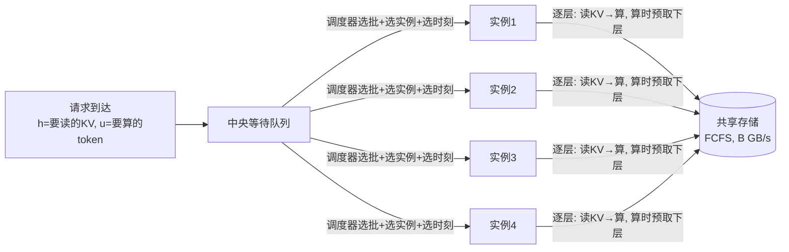
```mermaid
flowchart LR
    A[请求到达<br/>h=要读的KV, u=要算的token] --> Q[中央等待队列]
    Q -->|调度器选批+选实例+选时刻| W1[实例1] & W2[实例2] & W3[实例3] & W4[实例4]
    W1 & W2 & W3 & W4 -->|逐层: 读KV→算, 算时预取下层| S[(共享存储<br/>FCFS, B GB/s)]
```

要回答"调度到底值多少"，就必须在**同一物理规则**下只换调度算法比较——这就是本报告全部实验的做法（同窗口同请求流配对）。

## 2. 被比较的八个方案

| 方案 | 一句话：它怎么决定 | 类比 |
|---|---|---|
| **cq_fcfs**（基线） | 谁先到谁先做，凑满 8 个或凑不满都立即发 | 先来后到 |
| **cq_lpm** | 命中前缀最长的先做 | 大客户优先 |
| **cq_spt** | 预计最快做完的先做（按 T0 排序） | 小单优先 |
| **cq_edf** | 截止时间最早先做（deadline = 到达 + 4×T0） | 快到期优先 |
| **cq_slack** | 剩余时间最紧的先做（截止 − 现在 − 预计耗时） | 最急优先 |
| **cq_pair** | 最老请求打头，其余按"读多算少/读少算多"互补搭配 | 拼桌搭配 |
| **cq_local** | 与 MPC 相同的候选与评分，但预测时假装各实例互不抢带宽 | 近视版 MPC |
| **cq_mpc**（本文提出的方案） | 每次决策：生成若干"发批/等待"候选，**在系统副本上把每种候选完整模拟到排空**，按 θ 打分选最优，只落实第一步 | 下棋先在脑子里推演 |

MPC 的完整机制（预测状态怎么建、候选怎么生成、怎么打分、为何常与 EDF 相同）见配套教学页 **[docs/MPC方案图解-20260920.html](docs/MPC方案图解-20260920.html)**（含例子动画与公式）。

## 3. 实验条件（§1.4 表的完整版）

### 3.1 系统与计算

| 参数 | 取值 | 为什么 |
|---|---|---|
| 推理实例数 | **4**，同构，每实例同时只有 1 个活动批 | 规格 §12.6 首轮公共参数 |
| 层数 L | 32 | synthetic-v1 画像定义 |
| 每层计算时长 | `c = 50μs + 2e-7 s/token × N/η + 1e-10 s × A`；N=批内新 token 总数，A=attention 有效配对数，η=min(1, max(1/16, N/512)) | **解析公式（synthetic-v1），不是任何真 NPU 的实测**——文档1 §2.8 定义的机制研究假设参数。η 的含义：批内新 token 总数不到 512 时合批省计算，超过 512 后收益归零 |
| 每请求每层读取量 | 4.096e-6 GB × h（只读命中前缀） | 8 KV 头 × 128 维 × K/V 各 2 字节 |
| 读取协议 | 算本层时提交下层读取（lookahead），申请率 min(200, 下层字节/本层时长)，到期没读完提速补读 | 所有策略共用的引擎协议，不是策略可选项 |

### 3.2 批容量 / 存储 / 负载 / 评价

| 参数 | 取值 | 为什么 |
|---|---|---|
| 批上限 | **8 个请求、Σu≤262144、工作区 128 GB** | 真实 trace 最长请求有 191,378 个新 token，机制组默认的 8192/16GB 装不下；放宽后**覆盖率 100%，不截长不丢请求** |
| 共享带宽 B | 基线 **80 GB/s**，因子线 {20, 320} | 80≈读取完全被计算掩盖的拐点之上（见 §6） |
| SLO | deadline = 到达 + **α×T0**，基线 α=4，线 {2,8} | 相对期限：每条请求的期限与自身体量成比例 |
| 负载 ρ | 基线 0.6，线 {0.3, 0.9, 1.1}；到达时间按比例缩放 | λ0 按文件全量冻结，所有策略同一份请求流（CRN） |
| 控制成本 | zero（决策不耗时） | measured 为扩展项 |
| 评价 | 5 窗口 × 同窗口配对中位数；时间序列 200 桶、FCFS 锚定 | 配对消除窗口间负载差异 |

### 3.3 两个常见问题（FAQ）

**Q：同一时刻到达的请求不够一批，会等凑满吗？**
**不会。** 简单策略只要"有空闲实例 + 队列非空"就立即发不满批（head-of-line：按排序键取队首逐个塞，第一个塞不下的就停批）。只有 MPC 有"等 0.05/0.1/0.2 倍参考批时长或等到某条读取完成"的候选动作，但本次实验里从未胜出；E22 的相位策略才按固定相位等待。产品里的"等批时限"（如 MindIE 的 maxQueueDelayMicroseconds）在本研究中属未部署的 timing 因子。同刻组超过 8 条时（Conversation 最大同刻组 28），按排序键前 8 条成批、依次给 4 个空闲实例，其余排队。

**Q：为什么 spt/edf/slack 三个方案结果完全一样？**
SLO 定义是"到达+4×T0"，于是 SPT（按 T0 排）、EDF（按 4×T0+到达排）、Slack（按 3×T0−已等排）的排序键是**同一个东西的仿射变换**——FW 模式全体同时到达时三个顺序严格相同，OL 也仅有微小差异。`pair` 锚定最老请求、近似到达序，所以像 FCFS。
**（20260917 更新）** 此前 local/mpc 也与它们逐位相同——审计查明那是两个实现缺陷（候选从排空态分支、WAIT 被推演丢弃）加上 2ms 预算耗尽所致（§7.5），**修复并以理想上限档重跑后，mpc/local 已与 edf 分离**：OL 上 MPC 相对 EDF 的 TTFT 再降 6.5–19.9%、SLO +3.3–8.0pp（§4、§5.7）。

**Q：为什么只取一个窗口，不把 20 个全跑完？**
主矩阵**不是单窗口**：跑了 5 个窗口 {0,4,9,14,19}（规格 §3.1：冷启动到尾部均匀铺开），§4/§5 全部表格是 5 窗配对中位数。单窗口 w9 只用于**不做统计声明**的三处：时序图 D–I（定性看结构）、审计面板（§7.5 修复验证）、复杂度实验（§5.7 测成本）。为什么 5 不 20：①成本（255→约 1020 格点、十数小时）；②统计诚实——同文件相邻时间块高度相关（且三文件本身可能相关），20 块不是 20 个独立样本，统计单位是文件；③5 窗已覆盖冷启动/尾部两端。图定 w9 因其位于文件中部、三 trace 均非退化；全部 7080 份时间序列覆盖 5 窗，`tools/e25_ts_compare.py` 窗口可配置，随时可重出其他窗口。**逐窗口核对的两点如实披露**：w0（冷启动）上 MPC 增益≈0（Conv +0.2%/Tool +0.1%，文件开头命中结构不同、搜索无空间），w4–w19 全为正；w9 恰为 MPC 最有利窗口（Conv +25.4% vs 五窗中位 +19.9%、Tool +17.4% vs +6.5%）——20 窗完备性验证（§3.5）证实：ToolAgent/Synthetic 零漂移，Conversation 的 MPC 增益 5 窗偏乐观（+19.9%→20 窗 +8.8%），引用幅度以 20 窗值为稳妥。

**Q：λ、λ0、λ_raw 各是什么？谁是配置、谁是数据？**
三层结构——**λ_raw**（纯数据）：窗口原始节奏=请求数÷原始跨度（如 Conversation w9=3.47 req/s），量出来、不改；**λ0**（配置×数据导出的锚）：min(80/E[V], 4/E[K])=较紧资源（带宽或 4 NPU）名义用满的到达率，按文件冻结，B_ref=80/m=4 是配置、h/u 分布是数据；**λ**（目标到达率）=ρ×λ0，**唯一真正拧的旋钮是 ρ**；执行层 scale=λ_raw/λ 再乘到全部时间戳上。逻辑链：数据→锚→旋钮→λ→scale。**为什么这样设计**：直接设绝对 λ 不可比（同一速率在重请求的 Conversation 是六成负载、在轻请求的 ToolAgent 不到三成）；用原始节奏不可控（负载成不了因子）；除以容量锚后 ρ 成为无量纲"占容量成数"（排队论 offered load 归一化的标准做法），同 ρ=同等名义压力。**正确性三保险**：scale 不依赖策略（同格点所有策略同时间戳，CRN）；乘同一常数保序、保同刻组、保间隔比例；扫 B 时锚里的 80 是固定参考值不随 B 漂移（否则到达流和带宽两个因子混淆），且与 T0 共用同一参考世界。

**Q：不用 λ_raw 就等于忽视原 trace 的时间戳吗？**
恰恰相反——λ_raw 是 scale 的分子，缩放对**每条请求自己的时间戳**做乘法（arrival_sim=原时间戳×scale），因此时间戳的全部结构信息都保留：**顺序**（单调变换不改序）、**同刻组/突发**（相等的数同乘常数仍相等）、**相对间隔比例**（同乘常数不变）；被替换的只有"绝对节奏"这一个自由度（给定 scale 除回去可无损还原，类似录像变速播放）。三种模式对时间戳的处理：**OL=全部结构+受控节奏**；**FW=丢掉计时**（全置 t=0，但取哪 128 条及其次序仍由时间戳决定）；**native_time（scale=1）=什么都不丢**（原速对照）。

**Q：请求不是有时间戳吗，为什么能按 ρ 缩放到达时间？**
不是"改"，是**等比缩放（快放/慢放）**：把窗口内全部时间戳乘同一因子 scale=λ_raw/λ，顺序、同刻组、间隔比例全部保留。例（Conversation 窗口 9）：原始 176.8s 内 614 条（λ_raw=3.47），ρ=0.6 → λ=5.01，scale=0.693 → 压进 122.5s（=614÷5.01）。为什么必须这么做：要让"负载"成为可扫描的因子，就得让**同一批请求**出现在不同强度下——否则 ρ 的对比混入了请求内容差异（违背 CRN 同种子同 trace 原则）。规格保留 native_time 面板（scale=1 原速回放）作对照；λ0 只是"100% 负载"的锚（Conversation 8.35 vs ToolAgent 18.18 req/s——单条请求越贵，喂饱系统的到达率越低）。

**Q：B=80 时 q_max=200，实际生效的不就是 80 吗？**
对。流的实际速率 = min(申请率, 剩余带宽)，申请率 ≤ q_max——**单流有效上限 = min(q_max, B)**，基线下恒为 80，q_max 不构成约束。它只在 B=320 时现身（单流封顶 200、余 120 闲置除非分流），是"带宽到 320 无增益"的又一成因。

**Q：FW 的 128 条之后呢——做完再取下一批？还是从 trace 补请求？**
都不是。**FW 是封闭世界：128 条就是全部请求，此后永无新到达**。t=0 全部涌入中央队列，4 个实例各领一批（≤8 条），做完立即从队列剩余部分再领，队列单调排空至 0、第 128 条完成即终止（全程约切 16–19 个批）。注意 128 是"工作集"不是"批"——批是 ≤8 条的调度单位。trace 中这 128 条之后的请求在该 FW 格点不存在（其他窗口/格点用各自切片）；持续到达的世界是 OL。

**Q：不知道短时间内是否会来短请求时，当前调度有没有等待机制？**
**有等待的"动作"，没有"等短流"的"动机"。** 分层说清：① 简单策略完全不等待；② MPC 有 WAIT 候选（当前时刻 + {0.05, 0.1, 0.2}×C_ref，外加预测的读取完成时刻），但其目的是**FCFS 序位错峰**（让本实例下层读流插队）和**等带宽释放**——不是等新请求：按规格 §6.2 首版设计，MPC 的推演世界**假设没有未来到达**，等待候选的评分收益只能来自已知请求的重排，"等来的短请求"在数学上不存在；③ 引擎层 WAIT 只设唤醒闹钟、不锁请求，**任何新到达都会提前唤醒重评**——机制上"等到了短流"会立刻重新决策，缺的是"为等而等"的评分依据。**实测**（修复后 + 理想上限档，三个代表格子共 321 次决策）：WAIT 零胜出——档位只有毫秒到几十毫秒，Conversation 的短请求本来就同刻可见（555/613 对同刻）、Synthetic 稀疏到达等不来（间隔 p50=95ms，16/32/63ms 档位内攒到 ≥1 条的概率仅 12%/22%/38%，§4.0 专段）、B=80 无 STALL 时无可保护对象。两个方向分开看：**短等长（凑批）**在 G≈1 下无意义（§5.6 批能力小节：组批本身纯负）；**长让短（插队）**由排序天然实现（SPT/EDF 就把短排前），需要等待的场景只剩"长请求已在队首、短请求未到"。**若要补"等短流"**：从近期观测估到达率，把"预测的下一到达时刻"加入 WAIT 候选（或用规格预留的多情景框架把到达早晚做成情景，在线不得偷看真实 trace）；同时显式建模等待的期望收益-成本不对称（文档1 §8.3 P4 的教训：等待可改善均值却拖差 M，过载时纯亏），并与 θ 绑定（θ=T 下插队收益大，θ=S 下等待救不了临界请求）。这正是文档1 §12.1"主动延迟领取是否值得"的研究问题。

### 3.4 FW 与 OL：两种模式与 trace 的关系（详解）

**trace 是原始材料**：三份 Mooncake 文件每行只有时间戳、输入长度、hash 序列；首现判定推导出每条请求的 h（要读的命中前缀）和 u（要算的新 token），全时间跨度等切 20 个窗口，实验用 {0,4,9,14,19}。

**FW（有限工作集）**＝同一窗口的**前 128 条**请求、到达时间**全部置 0**、跑到全部完成。保留请求"形状"（h/u、次序），丢弃到达"节奏"。它存在的理由：只有有限已知集合才能干净定义 **M（最后完成时刻）**——在线流上"全部完成时间"无意义；FW 把调度从到达随机性中解耦，回答"这叠已知的活谁安排最好"，机制线（批能力/画像）也在 FW 上做。

**OL（在线流）**＝**整个窗口**的请求、到达时间按 `scale=λ_raw/(ρ·λ0)` **等比缩放**（只动时间，token 不动）、**同刻组保留**（Conversation 窗口 9 的 614 条中 555/613 对相邻请求同刻——密集突发是这份 trace 的本质结构）、持续服务到排空。回答"真实到达节奏下的用户体验"；SLO/TTFT 主结论与全部时间序列图（D–H）都在 OL 上；M 无定义，仅用排空 `drain_M` 做描述性代理。

| | FW | OL |
|---|---|---|
| 请求来源 | 窗口前 128 条 | 窗口全部（Conversation w9：614 条压进 122.5s；Synthetic w9：216 条压进 28.4s） |
| 到达时间 | 全部 t=0（相当于把窗口压成一个极端突发） | 真实节奏等比缩放，同刻组保留 |
| 回答的问题 | 已知工作谁安排最好（M 可定义） | 到达流下用户体验（SLO/TTFT） |
| 用于 | 图 A/C、B 的 FW 行、能力/画像线 | 图 D–H、B 的 α/ρ 行 |

**两者是同一份 trace 的两种问法，反差本身是结论**：Synthetic 上 FW 排序类 SLO +24.2pp 而 OL 全策略相同——FW 强迫深队列（调度有对象），OL 队列中位仅 2–3 条（到达即服务，谁来都一样）；Conversation 上排序类 FW 的 SLO −6.2pp 但 OL +1.6pp——"新到达持续插队惩罚长请求"的机制只存在于 OL（FW 没有后续到达）；ToolAgent 两模式同号（伤害来自同刻组内部重排，两种到达下都在）。

#### 3.4.1 时间戳变换的完整推导（以 Conversation 窗口 9、ρ=0.6 为例，逐行可验算）

```text
第①步 窗口切分     全文件 [0, 3537s) 等切 20 块 → 窗口9 = [1591.65, 1768.50)s，跨度 176.85s，含 614 条
第②步 原始节奏     λ_raw = 614 ÷ 176.85 = 3.472 req/s          （数据属性，每窗一个）
第③步 容量锚       λ0 = min(80/E[V], 4/E[K]) = 8.353 req/s      （文件级冻结；E[V]/E[K] 按全文件 h/u 均值）
第④步 旋钮         ρ = 0.6 → λ = ρ×λ0 = 5.012 req/s             （唯一配置）
第⑤步 缩放因子     scale = λ_raw ÷ λ = 3.472 ÷ 5.012 = 0.6927
第⑥步 逐条变换     arrival_sim = (timestamp_ms − 1591650)/1000 × 0.6927   （对每条请求的原时间戳做乘法）
第⑦步 窗口时长     D_sim = 176.85 × 0.6927 = 122.5s = 614 ÷ 5.012 ✓
```

用窗口里真实的头三组请求代入第⑥步（**第一组是 15 条同刻到达的突发**）：

| 原始 timestamp_ms | 原始偏移 (s) | ×scale=0.6927 → arrival_sim (s) | 说明 |
|---:|---:|---:|---|
| 1593000（**15 条同刻**） | 1.350 | **0.935（15 条仍同刻）** | 突发完整保留，只是整组平移到 0.935s |
| 1596000 | 4.350 | 3.013 | 与前组原始间隔 3.0s → 仿真间隔 3.0×0.6927=2.078s（比例不变） |
| 1599000 | 7.350 | 5.092 | 间隔比例继续保留 |

三条性质一眼可见：**顺序不变**（单调变换）、**同刻组仍是同刻**（相等的数同乘常数仍相等）、**间隔等比**（都乘 0.6927）；且除以 scale 可无损还原。同一批请求的另两条支路：**FW**＝按时间戳排序取前 128 条、arrival 全置 0（第⑥步不执行，计时丢弃、次序保留）；**native_time**＝scale=1（第⑤步跳过，原速回放对照）。

#### 3.4.2 "FW 扩大了调度可调范围，为什么不优于 OL？"——模式间不可比，直觉的正确版本

前提需要修正：FW 与 OL **不是同一负载下的两种调度能力，而是两份不同的工作负载**——"FW 优于 OL"这句话在实验里没有对应物，因为两个模式的指标分母根本不同：

1. **负载不同**：FW 把 128 条**同时**压进队列（被迫拥塞，人人排在别人后面）；OL 的 614 条在 122.5s 里**陆续**到达（多数几乎即刻服务）。数字验证（同一策略 fcfs）：Conversation 平均 TTFT FW=6.48s vs OL=3.01s、SLO 0.078 vs 0.204；Synthetic 更极端（FW 5.47s vs OL 0.73s——到达即服务）。OL"数字更好"不是调度更强，而是**错峰到达本身就是更轻的负载**。
2. **FW 不是"OL + 更多信息"，而是"OL − 到达过程"**：它通过去掉到达来去掉到达的不确定性。"预知未来到达"的信息价值需要**固定到达模式、只改信息可见性**来干净测量——那是 E20 的 offline 参照与规格 §9.3 的 offline_mpc 对照做的事，不与 FW/OL 混同。
3. **你的直觉在受限意义上是对的，且数据支持**：同一负载内，调度可动空间越大，策略间差异越大——Synthetic 上排序类 SLO 在 FW 为 **+24.2pp**、在 OL 为 **0**（深队列才有得排）；FW 的深队列正是"把调度空间拉满"的极端工况。正确的表述是："**FW 放大策略差异，OL 度量真实节奏下的用户体验**"——两模式是互补的两种问法，不是竞争关系。

### 3.5 窗口覆盖声明与"跑完整个 trace"的必要性/成本分析（含 20 窗完备性验证）

**当前使用的窗口（明确声明）**：主矩阵使用每份文件**等切 20 块中的 5 个窗口 {0, 4, 9, 14, 19}**（0=文件开头冷启动区、19=尾部、9=中部，均匀铺开），合计覆盖各文件请求量的 24.7% / 24.6% / 25.4%（等时切块下约四分之一）。时序图（D–I）、审计面板（§7.5）、复杂度实验（§5.7）固定使用**窗口 9**；全部时间序列数据覆盖 5 窗，`tools/e25_ts_compare.py` 换窗即重出。

**实测基准（外推依据）**：E25.1 全矩阵（255 格点 × 8 策略、MPC 理想上限档、本机单进程）实测 **4.24 小时**（FW 格点中位 16s、OL 19s；深窗口更贵）。

**"跑完整个 trace"的两种含义与时间预估**：

| 方案 | 含义 | 规模 | 时间预估/实测 |
|---|---|---|---|
| **(a) 全矩阵 × 20 窗** | 同协议、全部时间分片 | 255→1020 格点，请求量 ×4.05 | **约 17–22 小时**（近线性 + 深窗口超线性修正） |
| **(a-lite) 基线 × 20 窗** | 只补基线格点（**本文已执行**） | +90 格点 | **实测 77 分钟** |
| (b) 全文件连续重放 | 一条到达流、资源不跨段重置（另一种实验语义，接近容量面板） | 3 文件 × 8 策略 × 4.05 倍请求 | 约 15–25 分钟；§5.7 预测：连续深队列触发事件预算饥饿，MPC 将阶段性退化为 π |

**必要性分析**：对主结论**没有必要重跑全矩阵**——同文件相邻时间块高度相关（统计单位是文件），主表已是多窗中位；但 5 窗是否 representative 需要验证，因此本文执行了 (a-lite)。**20 窗完备性验证结果（OL 基线，5 窗中位 vs 20 窗中位）**：

| trace | 指标 | 5 窗 | 20 窗 | 结论 |
|---|---|---:|---:|---|
| ToolAgent | mpc-vs-edf TTFT（配对） | +6.5% | **+6.3%** | 零漂移，5 窗代表性好 |
| Synthetic | 全部指标 | — | **零漂移** | 同左 |
| Conversation | mpc SLO | 0.316 | **0.283**（edf 0.211） | 方向不变，幅度下修 |
| Conversation | mpc-vs-edf TTFT（配对） | +19.9% | **+8.8%** | **5 窗偏乐观**（所选窗口处中后段，早期窗口增益小——与 w0 冷启动效应同源） |

如实结论：**ToolAgent/Synthetic 的全部数字与 Conversation 的方向性结论在 20 窗下成立**；Conversation 的 MPC 增益幅度应以 20 窗为准（TTFT +8.8%、SLO +7.2pp 而非 +19.9%/+8.0pp）——正文 §4/§5.6 的 5 窗表格保留（规格口径），幅度引用时以本节 20 窗数字为稳妥。这也说明"是否有必要跑满"的答案因 trace 而异：**增益随文件位置变化的 trace（Conversation）需要更多窗口，平稳的 trace（ToolAgent/Synthetic）不需要**。

---

## 4. 主要结果：三个 trace 分开看

> 先记住一句话框架：**排序类策略（spt/edf 等）无一例外地大幅降低平均时延；其他指标（SLO、M）是否也改善，取决于这份 trace 的请求结构**。三个 trace 正好构成三种典型。
>
> **MPC 的展示方式（先读这段）**：MPC 按优化目标分别跑 θ∈{M,S,T,R}（FW）或 {S,T,R}（OL），**每个 θ 是一次独立仿真**——四个 θ 不可能同时最优，所以下面的表把 MPC 拆成 **mpc-θ=M / mpc-θ=S / mpc-θ=T / mpc-θ=R 四行**，每行展示该次运行的完整四指标（不是"每个指标取各自最优的 θ 拼在一起"——那种拼贴暗示能同时达到，不严谨）。读法：mpc-θ=S 行的 SLO 列是"MPC 以 SLO 为目标时实际做到的 SLO"，同一行的 TTFT 列则是"MPC 以 SLO 为目标时**顺带**的 TTFT"——可能比专门优化 TTFT 的 mpc-θ=T 行差。**图 I 的行与表逐行对应**：FW 场景 6 行（FCFS/EDF/M/S/T/R）、OL 场景 5 行（去 θ=M）——每个 θ 单独一行，同一张图里直接看"同一 θ 下 MPC 与基线的时序差"。
>
> **格点口径**：FW/OL 的详细表与时序图为**基线格点**（ρ=0.6、B=80 GB/s、α=4、批能力 C、默认画像、m=4）——回答"典型工况下谁好多少"；**其他配置（ρ∈{0.3, 0.9, 1.1}、B∈{20, 320}、m∈{2, 8}）的结果在每个 trace 小节末尾的"配置扫描"表**（E25.2，33 个格点）；期限 α∈{2, 8} 在 §5.6。
>
> **本节结构（固定模板）**：§4.0 总表（表 1=基线净增量、表 2=全配置扫描下的最优值及其配置）→ 三个 trace 小节，每节依次为**格点配置**（trace / 窗口 / ρ / NPU / 带宽 / 模式）→ 一句话结论 → **FW**（表 → 时序图 → 读法）→ **OL**（表 → 时序图 → 读法）→ **配置扫描**（该 trace 在 ρ∈{0.3,0.6,0.9,1.1} × B∈{20,80,320} × m∈{2,4,8} 的逐格点增益表，Conversation 附 20 窗验证）。机制解读（为什么这些配置最优/最差）集中在 §5。
>
> **怎么看图 I（本节每张表后面紧跟的时序图）**：一行 = 一个策略（与上方表格逐行对应）；每行左侧是一张**含 4 条 NPU 泳道的 Gantt**（纵轴 NPU0–3、横轴仿真时间，逐桶按三态时间占比着色：蓝=计算、橙=等待读、灰=闲置），**每条泳道右端的两个数字 = 该 NPU 的两个利用率：口径 1（计算/总时长）· 口径 2（计算/(计算+IO 等待)，占用时间计算占比）**——如 "72%·100%" 表示喂了七成活且占用时间全在真算、"52%·88%" 表示占用时间里 12% 在等数据；右侧窄列 = 存储带宽实际占用（GB/s、黑虚线=B），行旁标注该策略统计（算%/等%/队列峰）；**各行横轴独立自适应——行的右端就是该策略的排空时刻**。上下两行对比 = "换策略改变了什么"。

### 4.0 总表：MPC 到底带来多少收益？

**表 1｜基线格点的净增量**——MPC（理想上限档）相对两个基线（FCFS 与最强排序类 EDF）的改善（OL 在线流、**5 窗中位口径**）。**口径注意：同一行的各列来自不同的独立运行**——TTFT 列取自 θ=T 运行、SLO 列取自 θ=S 运行，**四个指标不可能在一次运行里同时达到**（§4 开头的 θ 声明）；每个 θ 运行的完整四指标见 §4.1/4.2/4.3 的表：

| trace | 配置 | vs FCFS：TTFT（θ=T 运行） | vs FCFS：SLO（θ=S 运行） | vs EDF：TTFT（θ=T） | vs EDF：SLO（θ=S） | MPC 的代价 |
|---|---|---:|---:|---:|---:|---|
| **Conversation** | 基线：ρ=0.6, B=80, m=4, α=4 | **−44%**（3.014→1.694） | **+11.2pp**（0.204→0.316） | **−22%**（2.172→1.694；配对 +19.9%） | **+8.5pp**（配对 +8.0pp） | 决策 P50≈39ms |
| **ToolAgent** | 基线：ρ=0.6, B=80, m=4, α=4 | **−45%**（1.642→0.909） | −4.3pp（0.155→0.112） | **−17.4%**（1.100→0.909；配对 +6.5%） | **+1.1pp**（配对 +2.1pp） | 决策 P50≈40ms |
| Synthetic | 基线：ρ=0.6, B=80, m=4, α=4 | 0% | 0% | 0% | 0% | —（见下"为什么是 0"） |

**20 窗完备性修正（§3.5，幅度引用以 20 窗为稳妥）**：Conversation 的 TTFT 配对 +8.8%、SLO +7.2pp（5 窗 +19.9%/+8.0pp 偏乐观）；ToolAgent 的 TTFT 配对 +6.3% 持平。

**表 2｜全配置扫描下的最优/最差值及其配置**（**增益基线=EDF**（最强排序类、MPC 的保底动作 π）——EDF 本身已强于 FCFS，故相对 FCFS 的改善更大，可用 §4 各表绝对值换算；ρ∈{0.3, 0.6, 0.9, 1.1} × B∈{20, 80, 320} × m∈{2, 4, 8} 共 33 格点，E25.2；增益=MPC vs EDF 逐窗配对中位、5 窗；各 trace 完整扫描表见 §4.1/4.2/4.3 末尾）：

| trace | 最优 TTFT 增益 | 出现配置 | 最优 SLO 增益 | 出现配置 | 最差 TTFT 增益 | 出现配置 |
|---|---:|---|---:|---|---:|---|
| **Conversation** | **+31.8%**（20 窗验证 +31.7%） | B=80, ρ=0.3, m=4（间歇） | **+23.0pp** | B=80, ρ=0.3, m=4（间歇） | **+0.7%**（20 窗 +0.6%） | B=20, ρ=1.1, m=4（持续过载） |
| **ToolAgent** | **+22.5%** | B=80, ρ=0.3, m=4（间歇） | **+9.2pp** | B=80, ρ=0.6, m=2（间歇；且 MPC SLO 0.189 首次超 FCFS 0.124） | **+1.5%** | B=20, ρ=0.9, m=4（持续过载） |
| Synthetic | 0%（全部配置） | — | 0%（全部配置） | — | 0%（全部配置） | — |

**为什么 Synthetic 在两张表里都是 0**（20260920 按 trace 原始数据复核；**修正此前"请求同质"的不准确说法**——Synthetic 的 u 离散度其实是三 trace 中最大的，p90/p10=872 倍 vs Conversation 的 49 倍）：真正的三个原因是——① **到达逐条且稀疏**：相邻到达间隔 p50=175ms、<5ms 的仅占 1%（对照：Conversation/ToolAgent 的相邻间隔 90–95% 都在 5ms 以内、毫秒级成簇到达，最大同刻组 28/47 条）——OL 基线队列中位 1–2 条、一个不满批就装下，"装谁、谁先"没有选择余地（基线上 MPC 与 EDF 逐位相同）；② **几乎无前缀命中**：h 中位=0（三 trace 中唯一），请求基本不读 KV——MPC 差异化的主要来源"批组合改变读并发与期限达成"（§4.1）不存在，批组合只剩同步损失（G≈1）；③ **EDF≈SPT 已拿到排序红利**：deadline=到达+4×T0 且 T0∝u，EDF 的序就是"短优先"，MPC 候选排序没有增量空间。

**追问："为什么不等一小段时间，把窗口内到达的请求攒进同一批？"**（20260920 实测回答）——三层：
- **① 攒不到**：MPC 的等待档位是 0.05/0.1/0.2×C_ref（Synthetic 的 C_ref≈0.32s → 档位≈16/32/63ms），而 Synthetic 的到达间隔中位 95ms（w9 缩放后）——窗口内能多攒到 ≥1 条的概率只有 12%/22%/38%，且几乎最多 1 条（三 trace 里真正"毫秒级成簇"的是 Conversation/ToolAgent，它们不需要等就已经同刻可见）。
- **② 攒到也不赚**：本负载 G≈1.005——合批不省计算，只剩"整批陪最慢成员等"的同步损失（§5.6 批能力线）。等待攒批 = 先付等待延迟、再付同步损失，两头亏；它有收益的前提是组批省算力（§5.6 画像通道打开，短请求负载）或 NPU 数是紧瓶颈（队列 ≫ m），Synthetic 两条都不满足。
- **③ 机制上当前 MPC 也不会这么等**：WAIT 候选为**错峰**（让本实例的读流在存储 FCFS 队列里错位）与**等带宽释放**而设，且推演世界假设没有未来到达（§3.3 Q1）——"等来的请求"在评分中不存在，所以它从不为攒请求而等（实测 321 次决策 WAIT 零胜出）；错峰的对象是读竞争（STALL），Synthetic 在 B=80 时等≈0、无可错峰。**"估到达率、把预测的下一到达时刻加入 WAIT 候选"是已登记的未部署方向**（§3.3、文档1 §12.1）——预计其价值出现在组批省算力的负载或深队列工况，而非 Synthetic。所以把负载/带宽扫开（队列到 9–16 条）仍无增益：**有队可排，但没有"排了会不一样"的对象**。FW 模式上 MPC 相对 EDF **有小幅但全面的增量**（θ=S SLO +0.8pp、θ=M M −6.2%、θ=T TTFT −4.4%，§4.3 表）——表 1/表 2 的 0 限 **OL 在线流**。

**读法（两张表合起来）**：基线（表 1）上 MPC 在 Conversation 是唯一同时改善时延与按时率的方案；把配置扫开（表 2），**各 trace 的最优收益都不在基线 ρ=0.6，而在更低负载（ρ=0.3）或更少 NPU（m=2）的"间歇"工况**——Conversation 从基线配对 +19.9%（20 窗 +8.8%）升到 +31.8%，ToolAgent 从 +6.5% 升到 +22.5%（SLO 最优在 m=2 的 +9.2pp）；持续过载端收窄到 +3% 以内，Synthetic OL 全配置无空间。为什么 ρ=0.3/m=2 最好（工况机制）见 §5.1；每个 trace 的逐格点数字在 §4.1/4.2/4.3 末尾的"配置扫描"表。这不是"压倒性优势"，是"在特定工况下值得付出的增量"——且需要 40ms/决策的调度开销。

**FW 模式（128 条同时到达）——为什么"有的挑"反而对 MPC 是劣势**：FW 把 128 条同时压进队列，看似信息全、可挑空间大，但 MPC 每次决策要把候选动作在推演副本里跑到**排空整个队列**——推演事件数随队列深度线性增长，2 万事件预算内能评分的候选骤减（§5.7 扩展实验：队列规模 n=16 时每决策评 5.3 个候选、n=128 只剩 0.7 个、n=512 归零——MPC 退回保底 EDF）；而 OL 的队列中位只有 2–25 条，推演便宜、候选能枚举完（这正是 §5.1 甜区的来源）。加上本实现 H=1（一步前瞻），"全部信息摆在桌面上"的红利用不满。所以 FW 的"有的挑"是**挑选成本同步暴涨**的挑——挑得起的前提是队列浅。数据印证：Conversation FW 的 MPC TTFT 2.85 反而略差于 EDF 2.62，OL 配对却 +8.8%。**FW 的价值是放大策略间差异（§3.4.2），不是 MPC 的秀场。**

**NPU 利用率的两个口径**（按用户的定义，w9、FCFS 实测）：

| 口径 | 公式 | 回答的问题 |
|---|---|---|
| **1 计算利用率**（本文图与泳道标注所用） | 计算时间 ÷（m × 全部仿真时长） | 整体负载水平：NPU 有多大比例时间在真算（含"没请求"的时段在分母） |
| **2 占用时间计算占比** | **计算时间 ÷（计算时间 + IO 等待时间）** | 被批占着（算或等数据）的时间里，有多大比例在真算；1−口径 2 = 占用时间被 IO 等待吃掉的比例 |

| trace | B 带宽 | 口径 1 计算 | IO 等待 | **口径 2 计算/(计算+等待)** |
|---|---|---:|---:|---:|
| Conversation | 80 | 47.9% | 0.0% | **99.9%** |
| Conversation | 20 | 47.9% | 0.7% | **98.6%** |
| ToolAgent | 80 | 52.1% | 0.2% | **99.6%** |
| ToolAgent | 20 | 52.1% | **7.1%** | **88.1%** |
| Synthetic | 80 | 50.4% | 0.4% | **99.3%** |
| Synthetic | 20 | 50.3% | **5.9%** | **89.5%** |

**两个口径的数值当然不同——它们回答两个不同的问题**：口径 1 说"喂了多少活"（由 ρ 决定，**≈50%**）；口径 2 说"分给它的活有多少被 IO 卡住"（**B=80 时 ≈100%**——读取完全被计算掩盖、占用时间几乎全是真算，"带宽过了 80 无增益"的微观形态；B=20 时降到 88–90%，占用时间的 10–12% 在等数据）。若把口径 2 取倒数（(计算+等待)/计算），得到的是"每秒计算被 IO 拉长成几秒"的时延放大倍数——同一信息的另一种写法；IO 等待只在带宽受限（B=20）时可见。另佐证口径 1 的 ≈50% 不是"没请求时段"的统计假象：把"队列=0 且全部 NPU 闲置"的纯无请求时段从分母刨掉，口径 1 只升 0–2.4pp（Conversation 47.9%→49.2%、ToolAgent 52.1%→54.5%、Synthetic 不变）。

**为什么口径 1 ≈50%**：ρ 的定义就是它。ρ=0.6 的名义含义是"平均需要 0.6×4=2.4 张卡"，三个因子把名义值精确还原到实测值（乘积=实测，逐 trace 代数校验）：

| trace | 名义均值卡数 | ×窗口请求轻重（λ0 锚按全文件冻结，w9 均值/全文件均值） | ×排空尾巴稀释（到达期/全时长） | =实测（口径 1） |
|---|---:|---:|---:|---:|
| Conversation | 2.40 张 | ×0.85（w9 请求比全文件轻 15%） | ×0.94 | 1.92 张 = 47.9% |
| ToolAgent | 2.40 张 | ×0.90 | ×0.97 | 2.08 张 = 52.1% |
| Synthetic | 2.40 张 | ×1.40（w9 反而重 40%） | ×0.60（快请求秒完成、尾巴占比高） | 2.02 张 = 50.4% |

**所以 ≈50% 不是统计假象，也不是策略偷懒，而是"到达率只喂六成"的直接后果**；口径 1 由到达率决定、与策略基本无关——计算总量守恒（各策略 Σ计算时间相同，§4.1），调度器无法"提高"它，只能改变计算在时间上的分布（决定排队与 M）。要利用率高就把 ρ 调大——但 ρ=1.1 时利用率升至 ≈80%+ 的同时收益反而收窄（§5.1）：**闲置正是留给调度的操作空间**。图 I 每条 NPU 泳道右端标注该 NPU 的两个利用率（口径 1·口径 2）。

**先看两张总览图**（图 A=四目标箱线、图 C=TTFT 改善条形）：

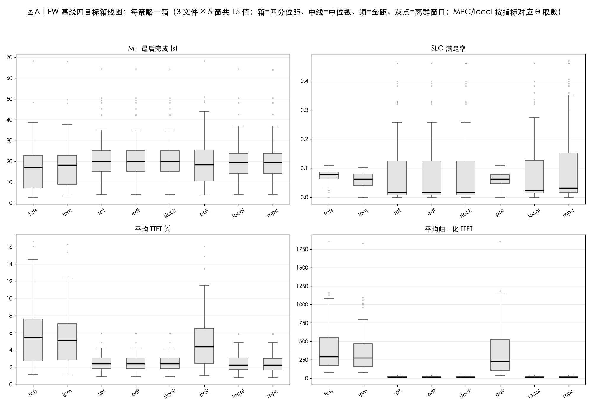

图 A 是**箱线图**（每策略一个箱，15 个值=3 文件×5 窗；MPC/local 按指标对应 θ 取数）：箱体=四分位距、中线=中位数、须=全距、灰点=离群窗口。同一个面板内比中线高低即可——SLO 面板越高越好，其余越低越好。四个面板分别回答："M：最后一条何时完成？SLO：多少按时？TTFT：平均等多久？归一化：短请求相对等多久？"

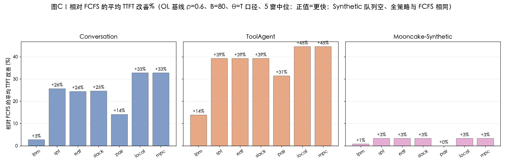

图 C 是**条形图**：每个 trace 一个子图，条形高度=该策略相对 FCFS 的平均 TTFT 改善百分比（OL 基线 ρ=0.6、θ=T 口径、5 窗中位，正值=更快），条上数字直读——与 §4.0 总表"vs FCFS：TTFT"列同向：Conversation/ToolAgent 有改善、Synthetic 全 0。

### 4.1 Conversation（对话流，长上下文多）

**格点配置**：trace=Conversation（全文件 12031 条）｜窗口=**5 个 {0,4,9,14,19}**（每窗中位 **614 条**、缩放后 **123 s**；表格=5 窗中位、时序图=窗口 9）｜负载 **ρ=0.6**（λ=5.0 req/s）｜NPU **m=4**｜带宽 **B=80 GB/s**｜α=4、批能力 C｜FW=前 128 条 t=0 同时到达；OL=全窗真实节奏。

**一句话结论（20260917 重跑后）**：MPC 在这份 trace 上成为全矩阵唯一"全指标占优"的方案**——在线流上 θ=S 运行 SLO 0.316（> FCFS 的 0.204、> EDF 的 0.231；20 窗口径 0.283，§3.5）、TTFT −44%（θ=T 运行，3.014→1.694）、归一化 −79%、排空 M 持平；简单排序类仍以 −60% 时延居首但 SLO 有代价。

**FW 性能分析（128 条同时到达）**，绝对中位数（5 窗；**每行 mpc-θ 配一行 local-θ 消融**——同候选同 gate、推演假装带宽独立，§5.7）：

| 策略 | M 最后完成 (s) | SLO 满足率 | 平均 TTFT (s) | 归一化 TTFT |
|---|---:|---:|---:|---:|
| fcfs（基线） | 28.31 | **0.078** | 6.48 | 307.7 |
| 顺序类（spt/edf/slack） | 22.71 | 0.016 | 2.62 | 11.5 |
| mpc-θ=M | **22.71** | 0.023 | **2.53** | 11.5 |
| **mpc-θ=S** | 28.07 | **0.039** | 2.53 | 11.8 |
| mpc-θ=T | **22.71** | 0.039 | **2.53** | 11.8 |
| mpc-θ=R | 26.29 | 0.039 | 2.62 | **11.5** |
| local-θ=M | **22.71** | 0.039 | 2.53 | 11.7 |
| local-θ=S | 28.07 | 0.039 | 2.62 | 11.5 |
| local-θ=T | **22.71** | 0.039 | 2.53 | 11.6 |
| local-θ=R | **22.71** | 0.016 | 2.62 | 11.5 |

相对 FCFS：顺序类 **M −19.8%、TTFT −59.5%、归一化 −96.3%，SLO −6.2pp**；mpc-θ=S 相对顺序类 **SLO 再 +2.3pp**（0.016→0.039，配对），mpc-θ=T 相对顺序类 **TTFT 再 −3.6%**（2.62→2.53）且 M 持平。**θ 间取舍**：θ=M/T 的 M=22.71 最好但 SLO 只有 0.023–0.039；θ=S 的 SLO=0.039 并列最好但 M=28.07 最差——四目标确实不可兼得。local 与 mpc 在此基本逐位相同（B=80 无竞争，两种推演几乎重合）。

**FW 时序验证（图 I，读法见本节开头）**：

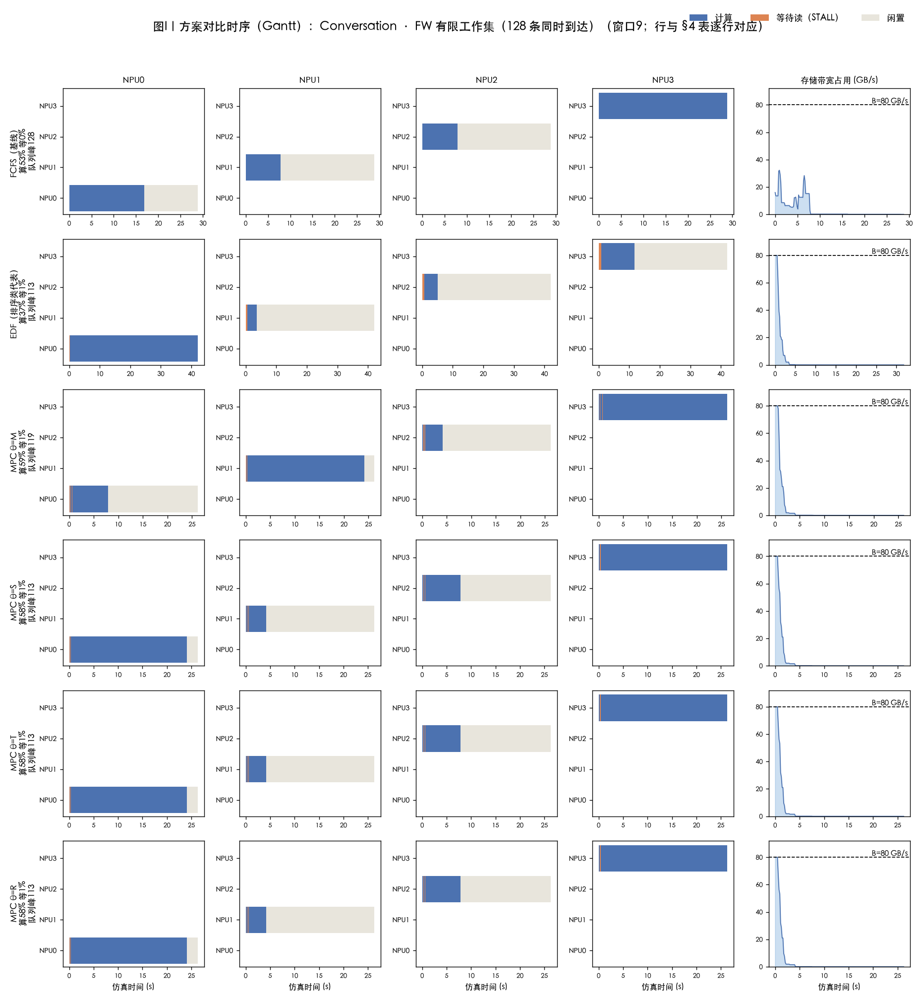

FW 模式（128 条同时到达）的差距很直观：看 EDF 行（第二行）泳道的**末段灰色闲置带**——"短优先"策略把长请求留到最后，末期四张卡大面积闲置（M=42.1s vs MPC 26.3s，行的右端长短直接可见）。MPC 各 θ 行通过混批把四个 NPU 喂得更满。行旁统计：算占比 FCFS 53% / EDF 37% / **MPC θ=S 58%**——**同样的计算量摊进更短的墙钟=更好的 M 与利用率**。

**OL 性能分析（真实节奏）**，绝对中位数（5 窗、θ 对应）：

| 策略 | SLO 满足率 | 平均 TTFT (s) | 归一化 | 排空 M (s) |
|---|---:|---:|---:|---:|
| fcfs | 0.204 | 3.014 | 136.8 | 130.6 |
| edf | 0.231 | 2.172 | 55.0 | 130.6 |
| **mpc-θ=S** | **0.316** | 1.757 | 29.3 | 130.6 |
| mpc-θ=T | 0.313 | **1.694** | **29.0** | **127.7** |
| mpc-θ=R | 0.298 | 1.805 | 29.5 | 130.6 |
| local-θ=S | 0.318 | 1.735 | 29.3 | 130.6 |
| local-θ=T | 0.313 | 1.695 | 29.1 | 127.7 |
| local-θ=R | 0.309 | 1.805 | 29.5 | 130.6 |

相对 EDF：**mpc-θ=S SLO +8.5pp**（0.231→0.316 中位差；逐窗配对 +8.0pp、20 窗 +7.2pp，§3.5）；**mpc-θ=T TTFT −22%**（2.172→1.694 中位比；配对 +19.9%、20 窗 +8.8%——5 窗偏乐观，幅度引用以 20 窗为稳妥）且排空 M 只差 0（θ=T 反而快 2.9s）。相对 FCFS：mpc-θ=S SLO +11.2pp（0.204→0.316）、TTFT −44%（3.014→1.694，θ=T）、归一化 −79%（136.8→29.3）。local 与 mpc 差 ≤0.2pp/0.04s（无竞争噪声，§5.7）。

**为什么**：对话流的计算量集中在少数超长请求上；先清短请求不拖慢总完工。而 MPC 的增量来自**挑选批成员**：它把"短+长"混批的机会留给能按时完成的组合，在 θ=S 下直接优化超时数，救回的长请求是 EDF 纯排序救不回的。

**OL 时序验证（图 I）**：

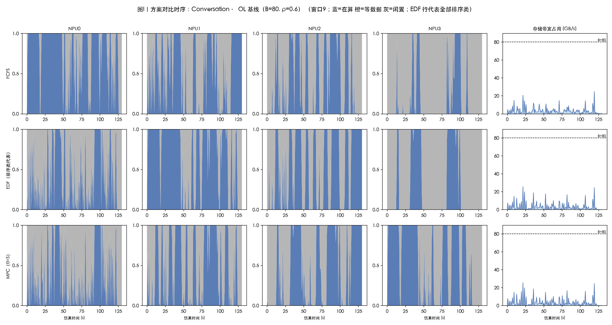

图中能看到的东西：① FCFS/EDF/MPC 各行的蓝色泳道密度几乎相同（计算占比 ≈48%）——**计算量是守恒的，差距不在这里**；② 橙色几乎为零（B=80 时读取完全被计算掩盖）；③ 右侧带宽窄列形状相似——**带宽行为也不是差距来源**。那差距从哪来？看行旁统计：**队列峰 45（FCFS）→37（EDF）→25（MPC θ=S）**。差距在"批的组合与完成次序"——更多、更精挑的小批更快清掉积压（也把活分得更匀：FCFS 四卡计算占比 75%/54%/44%/19% 极差 56%，MPC 38%/49%/50%/55% 极差仅 17%——§6.4 详析）。这解释了 SLO 0.204→0.231→0.316（上表值，5 窗口径；20 窗 0.283）：**排队更短=更多请求在 deadline 前完成**。

**为什么泳道图上看不出 TTFT/SLO 差距、以及差距到底从哪来**：甘特图展示的是**资源结构**（谁在算/等/闲），而 TTFT/SLO 是**请求级结果**——因果链中间隔着"队列深度"和"批组合"：

> 更精挑的批组合 → **清积压更快**（队列更浅）→ 请求**等的时间更短** → TTFT 更低 → 更多请求**赶上 deadline** → SLO 更高

上页泳道图的三态占比不动（蓝 ≈48% 全策略相同），说明差距不在资源侧；下图 Q 把这条链的中间两环可视化：

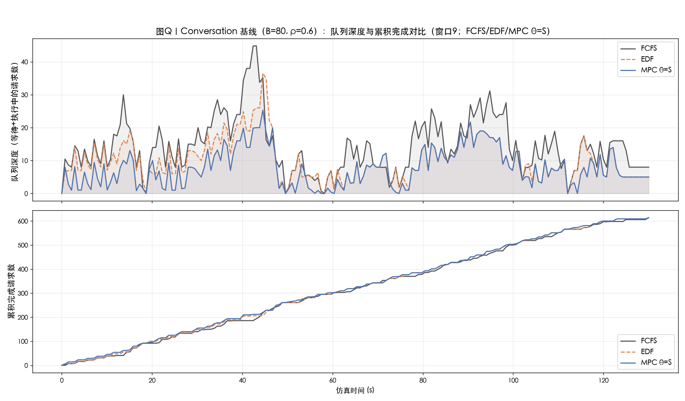

**图 Q 读法**（上下两个面板、三条线=FCFS/EDF/MPC θ=S）：
- **上面板（队列深度）**：MPC 的蓝线整体更低——**MPC 清积压更快**（FCFS 队列峰 45，EDF 降到 37，MPC 降到 25）。队列浅 = 每条新到的请求排队时间短 = TTFT 低。
- **下面板（累积完成数）**：MPC 的蓝线**更早抬升**——在相同时刻，MPC 已完成更多请求。一条请求提前完成 → 它在 deadline 之前 → SLO 高。对照上表：SLO 0.204（FCFS）→ 0.231（EDF）→ **0.316**（MPC）。
- **与泳道图的关系**：泳道图告诉你"资源没问题（三态占比不动）"；图 Q 告诉你"差距发生在队列里"——正是这两张图互补，才能完整解释 TTFT/SLO 的提升。

**Conversation 的配置扫描（其他 ρ / B / m 的结果，E25.2、5 窗逐窗配对中位；单元格=实测状态 + **MPC vs EDF（基线）**的 TTFT 增益（关键格附 SLO 增益）**｜**loc=local 消融同口径**）**：

| 配置 | ρ=0.3 | ρ=0.6 | ρ=0.9 | ρ=1.1 |
|---|---|---|---|---|
| B=80, m=4 | 间歇 **+31.8%**（+23.0pp）★最优｜loc +31.7% | 间歇 **+19.9%**（+8.0pp）｜loc +19.8% | 持续过载 +2.1%｜loc +2.1% | 持续过载 +0.9%｜loc +0.9% |
| B=20, m=4 | 间歇 +28.3%（+10.0pp）｜loc +28.0% | 间歇 +17.7%｜loc +17.5% | 持续过载 +1.7%｜loc +1.6% | 持续过载 +0.7%｜loc +0.7% |
| B=320, m=4 | — | 间歇 +20.7%（+11.8pp）｜loc +20.7% | — | — |
| B=80, m=2 | — | 间歇 +27.2%（+17.3pp）｜loc +27.3% | — | — |
| B=80, m=8 | — | 持续过载 +1.4%｜loc +1.4% | — | — |

**读法**：收益随负载单调收窄（ρ0.3→1.1：+31.8%→+0.9%）；B 几乎不移动收益（B20/B320 与 B80 同档）——瓶颈不在存储侧；m 沿容量锚平移工况（m=8 到达率翻倍→过载 +1.4%，m=2 保持间歇 +27.2%）。**local 消融贯穿全表**：无竞争/无自由度的格点 loc 与 MPC 差 ≤0.2pp（两种推演重合），**带宽间歇打满的 B20 格点 MPC 系统性更高**（本 trace +1.0pp 量级，见 §5.3/§5.7）。**20 窗全量验证**（最大/最小两个格点补跑全部 20 窗，`tools/e25_regime.py full`）：

| 格点 | 状态 | 5 窗 TTFT / SLO | **20 窗 TTFT / SLO** | 结论 |
|---|---|---:|---:|---|
| B=80, ρ=0.3（收益最大） | 间歇 | +31.8% / +23.0pp | **+31.7% / +21.5pp** | 稳定 |
| B=20, ρ=1.1（收益最小） | 持续过载 | +0.7% / +0.7pp | **+0.6% / +0.6pp** | 稳定贴零 |

对照 §3.5 的教训（Conversation **基线**格点的 5 窗增益 +19.9% 在 20 窗下修为 +8.8%——所选窗口偏乐观），这两个极端格点在 20 窗下几乎不动：甜区与失效区的方向和幅度都稳。为什么 ρ=0.3 最好（工况机制）见 §5.1；过载端的时序图见 §5.4。

**★最优格（B=80, ρ=0.3, m=4）的时序图**：

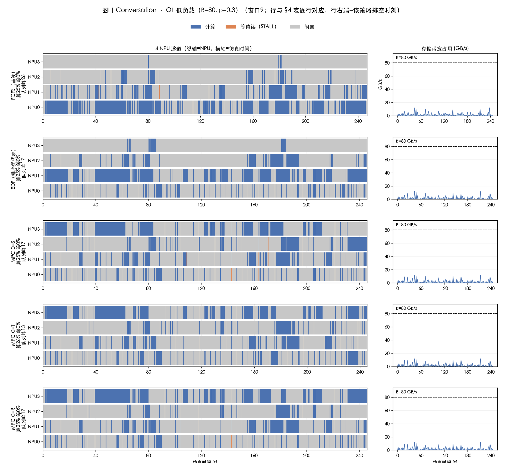

读法：大量灰色闲置带（算仅 25%）、队峰 26——低负载间歇形态，MPC 的搜索自由度最大（31.8% 增益）。对照 B=80 ρ=0.6 基线图（§4.1 OL 时序，算 48%、队峰 45）：负载更低 → 队列更浅 → 每步可挑的批组合更精。

**为什么 FCFS/EDF 的 NPU3 几乎没分到活**（各 NPU 计算占比，泳道右端数字）：

| 策略 | NPU0 | NPU1 | NPU2 | NPU3 | 极差 |
|---|---:|---:|---:|---:|---:|
| FCFS | 61% | 31% | 9% | **1%** | 60% |
| EDF | 19% | 58% | 20% | **4%** | 54% |
| **MPC θ=S** | 16% | 24% | 20% | **42%** | **26%** |

原因：**低负载下的"先到先整批"赢家通吃**。ρ=0.3 时到达稀疏（间隔中位 95ms），每来一批，哪个 NPU 空闲就整个拿走——NPU0 几乎总是最先空闲（上批最早领、最早做完），于是反复领到；NPU3 只有在 NPU0–2 **同时忙**时才轮到，低负载下几乎不会发生。MPC 反而把四张卡分得更匀（极差 60%→26%）：它的推演发现"把批拆小、分给不同 worker"能让更多请求同时推进、更早完成——这正是混批+重排在资源分配上的表现，也是 31.8% 增益的微观来源之一。

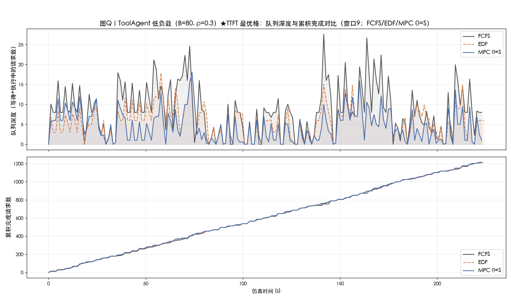

★格的图 Q 读法：MPC 的队列深度（蓝线）在突发后**最快回落**（峰 28→18→16），累积完成曲线最早抬升——低负载下队列浅、推演跑得完，MPC 的搜索自由度最大（+22.5% 增益）。

### 4.2 ToolAgent（工具调用流，同刻突发最大 47）

**格点配置**：trace=ToolAgent（全文件 23608 条）｜窗口=**5 个 {0,4,9,14,19}**（每窗中位 **1214 条**、缩放后 **111 s**；表格=5 窗中位、时序图=窗口 9）｜负载 **ρ=0.6**（λ=10.9 req/s）｜NPU **m=4**｜带宽 **B=80 GB/s**｜α=4、批能力 C｜FW=前 128 条 t=0 同时到达；OL=全窗真实节奏。

**一句话结论：排序类赢得时延、输掉按时率与总工期——这是"牺牲谁"的反面教材。**

**FW 性能分析（128 条同时到达）**，绝对中位数（5 窗；含 local 消融行）：

| 策略 | M (s) | SLO 满足率 | 平均 TTFT (s) | 归一化 |
|---|---:|---:|---:|---:|
| fcfs（基线） | **6.76** | **0.078** | 2.11 | 130.7 |
| 顺序类 | 12.68 | 0.008 | 1.54 | 23.2 |
| mpc-θ=M | 10.82 | 0.008 | **1.29** | 22.0 |
| mpc-θ=S | 12.68 | 0.008 | 1.54 | 23.2 |
| mpc-θ=T | 10.82 | 0.008 | **1.29** | 22.0 |
| mpc-θ=R | 11.58 | 0.008 | 1.44 | **21.7** |
| local-θ=M | 10.82 | 0.008 | 1.30 | 22.0 |
| local-θ=S | 10.82 | 0.008 | 1.29 | 21.7 |
| local-θ=T | 10.82 | 0.008 | 1.29 | 22.0 |
| local-θ=R | 10.82 | 0.008 | 1.29 | 22.0 |

相对 FCFS：顺序类 **TTFT −27.2%、归一化 −82.2%，但 M +87.6%、SLO −7.0pp**；mpc-θ=M 相对 edf **M −14.7%（12.68→10.82；配对 +6.6%）、TTFT −15.7%（1.54→1.29）**——注意 ToolAgent 上 MPC 各 θ 的 SLO（0.008）都远不如 FCFS 的 0.078。local-θ=S 的 TTFT 1.29 好于 mpc-θ=S 的 1.54：θ=S 下 mpc 未从 EDF 切换而 local 切换了——无竞争时两种推演几乎相同，gate 的严格改善门槛下微小评分差即可决定切/不切（θ=T 下两者一致，§5.7）。

**FW 时序验证（图 I，读法见本节开头）**：

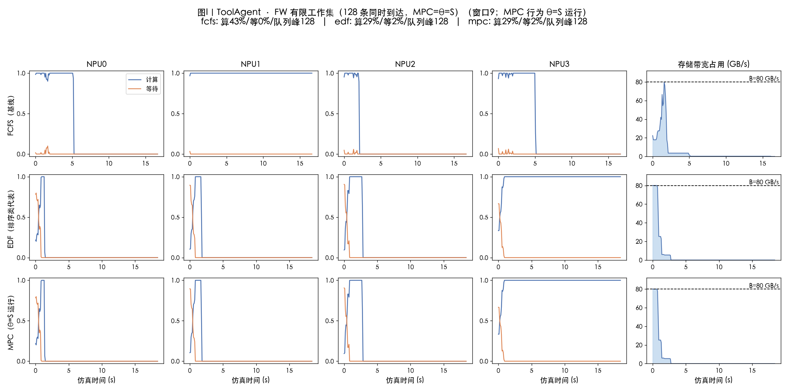

FW 模式下 128 条同时到达，所有策略都被迫拥塞。看 EDF 行的末段灰色闲置带（长请求留到最后、NPU 闲置）与 MPC 各 θ 行的算占比差异。

**OL 性能分析（真实节奏）**，绝对中位数（5 窗、θ 对应）：

| 策略 | SLO 满足率 | 平均 TTFT (s) | 归一化 | 排空 M (s) |
|---|---:|---:|---:|---:|
| fcfs | **0.155** | 1.642 | 86.9 | 116.6 |
| edf | 0.101 | 1.100 | 17.3 | 117.3 |
| mpc-θ=S | 0.112 | 1.078 | 17.5 | 117.9 |
| mpc-θ=T | 0.111 | **0.909** | **16.2** | 117.3 |
| mpc-θ=R | 0.105 | 0.919 | 16.3 | 118.6 |
| local-θ=S | 0.110 | 0.944 | 17.1 | 117.9 |
| local-θ=T | 0.111 | 0.909 | 16.6 | 117.3 |
| local-θ=R | 0.107 | 0.922 | 16.3 | 118.6 |

相对 EDF：**mpc-θ=S SLO +1.1pp**（0.101→0.112 中位差；逐窗配对 +2.1pp）、**mpc-θ=T TTFT −17.4%**（1.100→0.909；20 窗配对 +6.3%）；相对 FCFS：TTFT −45%（1.642→0.909）但 **SLO −4.3pp**（0.155→0.112）——FCFS 在 ToolAgent 上依然是 SLO 之王，但优势从对 EDF 的 +5.4pp 缩到对 MPC 的 +4.3pp。

**为什么**：同刻大突发里到达序保护长请求，任何重排都有 SLO 代价——但 MPC 的批成员选择能救回一部分（SLO 从 EDF 的 0.101 回升到 0.112），仍不敌 FCFS 的 0.155。"没有策略稳定胜过 FCFS"的最后一座山就是这份 trace。

**OL 时序验证（图 I，B=80 基线、与上表同格点）**：

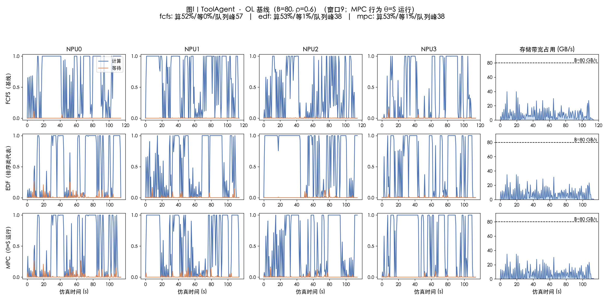

B=80 下等待几乎为零（等 0.2%–0.9%）、三态结构不是差距来源；看行旁统计——**队列峰 FCFS 57 → EDF 38 → MPC θ=T/R 33**，与上表方向一致（清积压更快=时延更低）。带宽受限的对照（B=20：等待 7%–11%、带宽多次打满）见 §5.3 的间歇 case。

**ToolAgent 的配置扫描（同上口径，含 loc=local 消融）**：

| 配置 | ρ=0.3 | ρ=0.6 | ρ=0.9 | ρ=1.1 |
|---|---|---|---|---|
| B=80, m=4 | 间歇 **+22.5%**（+6.4pp）★TTFT 最优｜loc +23.5% | 间歇 +6.5%（+2.1pp）｜loc +6.5% | 持续过载 +1.8%｜loc +1.7% | 持续过载 +1.8%｜loc +1.8% |
| B=20, m=4 | 间歇 +18.9%｜loc +17.2% | 间歇 +6.5%｜loc +5.5% | 持续过载 +1.5%｜loc +1.4% | 持续过载 +3.0%｜loc +2.9% |
| B=320, m=4 | — | 间歇 +7.3%｜loc +7.3% | — | — |
| B=80, m=2 | — | 间歇 **+14.7%**（+9.2pp）★SLO 最优｜loc +14.6% | — | — |
| B=80, m=8 | — | 持续过载 +2.4%｜loc +2.4% | — | — |

**读法**：与 Conversation 同构（ρ 单调收窄、B 不敏感、m 平移工况），两个本 trace 特有点：① m=2 时 **MPC θ=S 的 SLO 0.189 首次超过 FCFS 的 0.124**（基线 m=4 上 FCFS 是 SLO 之王）——worker 越少批组合越关键（表与时序图见 §5.5）；② **B=20 的两个间歇格点上 MPC 比 local 高 1.0–1.7pp**（ρ0.6：+6.5% vs +5.5%；ρ0.3：+18.9% vs +17.2%）——带宽间歇打满时共享带宽建模防止选错批（§5.7），而 B=80 无竞争格点 loc≈MPC（B80ρ0.3 的 loc +23.5% vs +22.5% 属 gate 掷硬币，方向随机）。

**★TTFT 最优格（B=80, ρ=0.3, m=4）的时序图**：

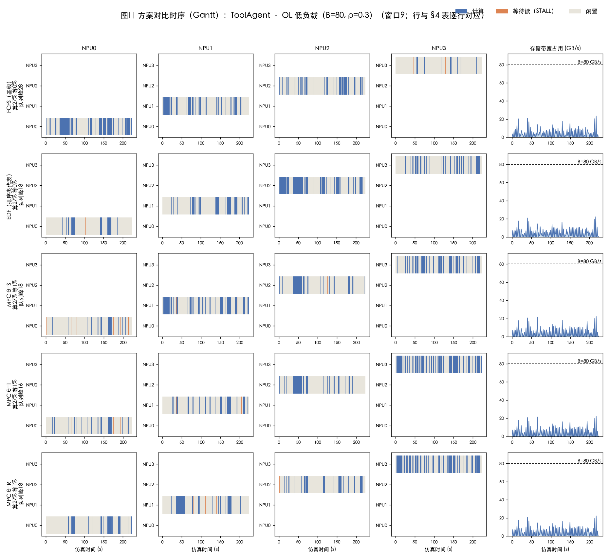

**★SLO 最优格（B=80, ρ=0.6, m=2）的时序图**：

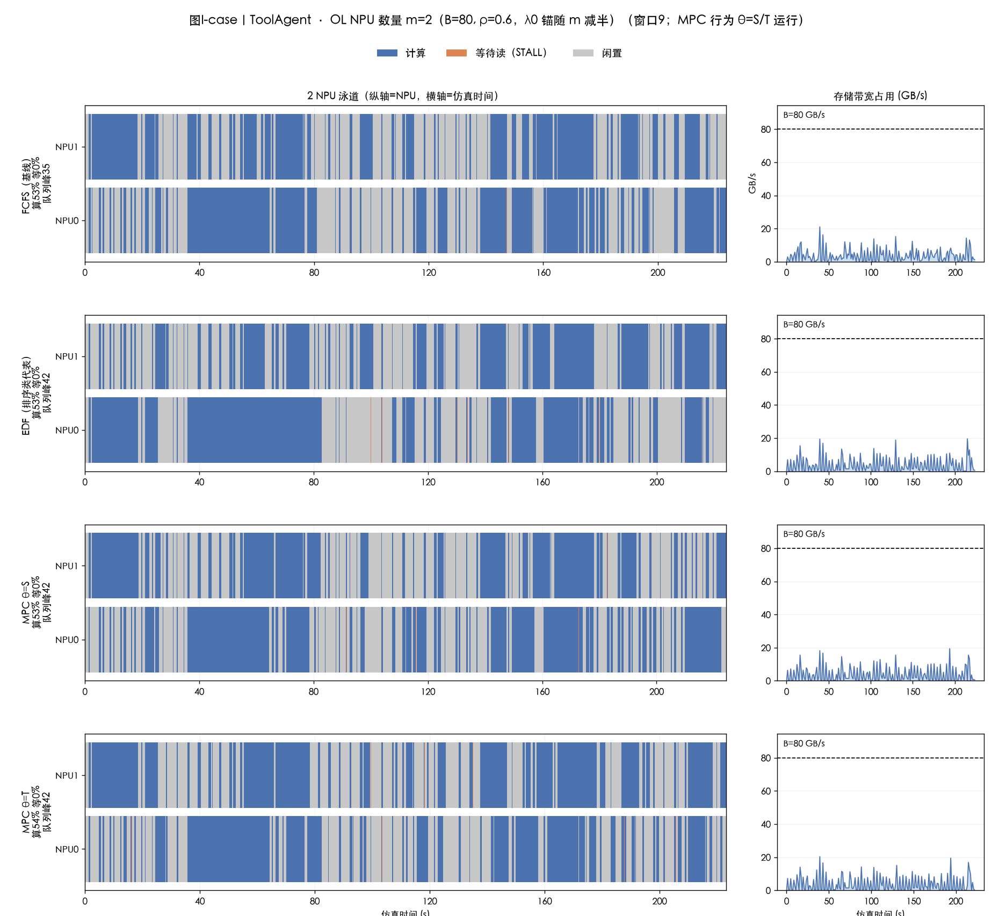

读法：ρ=0.3 图——大量灰色闲置带（算仅 27%）、队峰 28→18→16，低负载间歇的最强形态；m=2 图——两条泳道（m=2 NPU）、排空 224s（到达率减半），MPC θ=S 的 SLO 0.189 首次超 FCFS 的 0.124。

### 4.3 Mooncake-Synthetic（合成 trace，短请求占比高）

**格点配置**：trace=Synthetic（全文件 3993 条）｜窗口=**5 个 {0,4,9,14,19}**（每窗中位 **212 条**、缩放后 **28 s**；表格=5 窗中位、时序图=窗口 9）｜负载 **ρ=0.6**（λ=7.6 req/s）｜NPU **m=4**｜带宽 **B=80 GB/s**｜α=4、批能力 C｜FW=前 128 条 t=0 同时到达；OL=全窗真实节奏。

**一句话结论：全矩阵最大的单指标改善在这里——顺序类 SLO +24.2pp（近 4 倍）；但在线低负载下所有策略完全一样（队列太空，没得排）。**

**FW 性能分析（128 条同时到达）**，绝对中位数（5 窗；含 local 消融行）：

| 策略 | M (s) | SLO 满足率 | 平均 TTFT (s) | 归一化 |
|---|---:|---:|---:|---:|
| fcfs（基线） | **10.27** | 0.086 | 5.47 | 573.1 |
| 顺序类 | 16.91 | 0.328 | 2.275 | 15.6 |
| mpc-θ=M | **15.86** | 0.219 | 2.190 | **13.6** |
| **mpc-θ=S** | 16.03 | **0.336** | 2.180 | 15.9 |
| mpc-θ=T | 15.89 | 0.219 | **2.174** | 14.4 |
| mpc-θ=R | **15.86** | 0.328 | 2.190 | **13.6** |
| local-θ=M | 15.89 | 0.219 | 2.174 | 14.4 |
| local-θ=S | 15.89 | 0.273 | 2.174 | 14.4 |
| local-θ=T | 15.89 | 0.273 | 2.174 | 14.4 |
| local-θ=R | 14.44 | 0.312 | 2.236 | 15.1 |

相对 FCFS：顺序类 **SLO +24.2pp、TTFT −58.4%、归一化 −97.3%，代价 M +64.7%**；**MPC 相对 EDF 有小幅但全面的增量**——θ=S 的 SLO 0.336 **超过** edf 的 0.328（+0.8pp）、θ=M 的 M 15.86 比 edf 的 16.91 好 6.2%、θ=T 的 TTFT 2.174 比 2.275 好 4.4%（§5.6 配对口径同号）。注意 local-θ=S 的 SLO=0.273，比 mpc-θ=S **低 6.3pp**——乐观带宽评分高估了混批的按时完成率、选错批组合（机制展开见 §5.7 的 local 消融专段）。

**FW 时序验证（图 I，读法见本节开头）**：

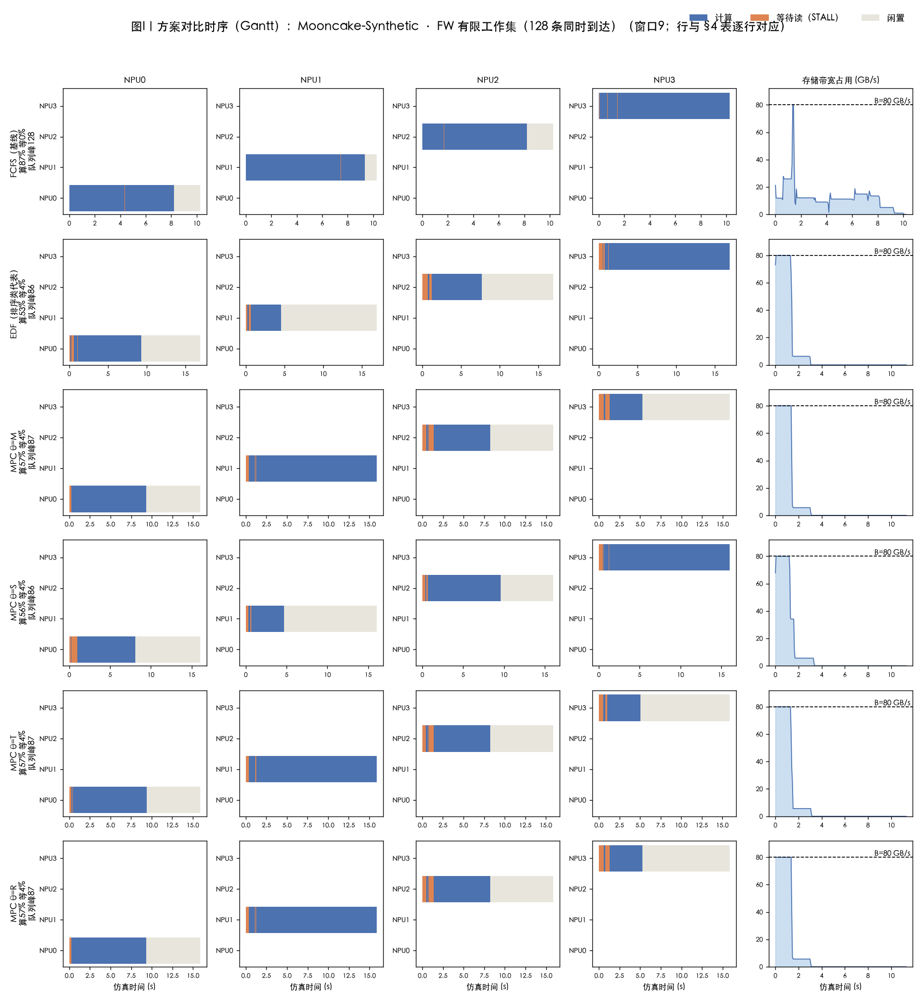

FW 模式下 128 条同时到达才"挤"出策略差异：EDF 行末段有大片灰色闲置带（算占比 53% vs FCFS 87%），MPC 靠挑批成员部分挽回（θ=S 56%）。

OL（ρ=0.6）上**所有策略与 FCFS 结果逐项相同**——不是策略坏了，而是这份文件缩放后到达间隔约 0.13s、请求又快，**队列中位数只有 2–3 条，请求几乎到达即服务**，排序没有对象（§6 图 F 的 synthetic 列可见队列贴着横轴）。E25.2 地图（§5.1）进一步证实：即使 ρ=0.9/1.1 或 B=20，Synthetic 的增益仍为 0——队列虽有深浅，但这份 trace"排了也不会不一样"（逐条到达+无前缀命中+EDF≈SPT，§4.0 的三重原因），间歇也救不了。

**OL 时序验证（图 I）**：

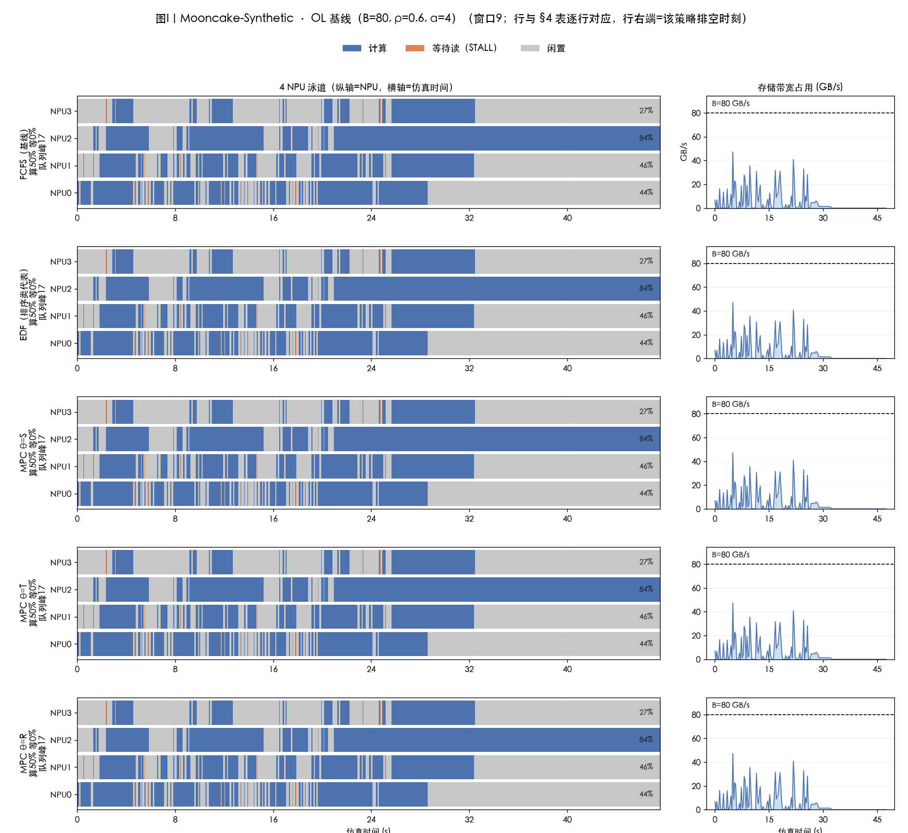

OL 的五行完全一致——请求到达间隔 ≈95ms 且服务极快，队列中位仅 2–3 条（到达即服务），蓝色泳道是窄脉冲、灰色泳道是"没客人来"。**没队可排时聪明无处使**——这正是 §5.2"持续欠载"工况的定义形态。

**Synthetic 的配置扫描（同上口径；local 逐位相同，全部 0）**——全部格点增益≈0：

| 配置 | ρ=0.3 | ρ=0.6 | ρ=0.9 | ρ=1.1 |
|---|---|---|---|---|
| B=80, m=4 | 持续欠载 0.0% | 持续欠载 0.0% | 间歇 0.0% | 间歇 0.0% |
| B=20, m=4 | 持续欠载 0.0% | 间歇 0.0% | 间歇 0.0% | 间歇 0.0% |
| B=320 / m=2 / m=8 | — | 0.0% / +0.2% / 0.0%（loc 同） | — | — |

**读法**：即使 ρ=0.9/1.1 或 B=20 让队列出现深浅（分类为"间歇"），增益仍为 0——**Synthetic 缺的不是排队，是"排了会不一样"的对象**：请求逐条到达（同刻组最大 2 条）、几乎无前缀命中（h 中位=0，批组合只剩同步损失）、且 EDF≈SPT 已按"短优先"排好（三重原因见 §4.0 专段）。 全部格点增益为 0，无★关键格时序图；基线 OL 图（§4.3 OL 时序验证）即为"全策略一致"的定义形态。

**怎么看图 A 与图 C**：


图 A 是 2×2 四个面板（M / SLO 满足率 / 平均 TTFT / 归一化 TTFT），横轴 8 个策略，每策略一个**箱线图**（15 个值=3 文件×5 窗；MPC/local 按指标对应 θ 取数：M 列←θ=M 运行、SLO 列←θ=S……）。**读法：同一列比箱的中线高低（SLO 面板相反，越高越好）**。你会看到排序类在 TTFT/归一化两个面板整列偏低、在 SLO/M 面板整体偏高（差），但 synthetic 的箱在 SLO 面板明显偏高——这就是 +24.2pp 的视觉来源。


图 C 三个子图分别对应三份 trace，每根条=该策略相对 FCFS 的平均 TTFT 改善%（OL 基线、θ=T 口径、5 窗中位），条上数字直读。**读法：找 mpc 的条比 edf/spt 的条高多少**——Conversation/ToolAgent 上 MPC 在排序类之上再拿 7–9 个百分点，Synthetic 全部为 0（队列空，没得排）。

---

## 5. MPC 收益的工况地图：欠载 / 间歇 / 过载（E25.2 新实验）

系统处在什么工况由三个大变量共同决定：**负载 ρ**（到达率打到容量刻度的几成）、**NPU 数量 m**（容量锚 λ0=min(80/E[V], m/E[K]) 随 m 变化——同 ρ 下 m 翻倍=到达率与存储需求同时翻倍）、**存储带宽 B**。本节用实验检验一个假设：

> **假设**：MPC 的收益集中在"间歇过载/欠载"的工况——一直欠载（到达即服务、没队可排）或一直过载（资源长期饱和、调度被积压淹没）时，收益应当很小。

**E25.2 补跑**（主矩阵只扫过 B×ρ0.6 与 B80×全 ρ，无交互、无 m 扫描）：新增 B=20×ρ∈{0.3, 0.9, 1.1} 与 m∈{2, 8}×B=80×ρ=0.6，各 ×3 trace ×**5 个窗口 {0,4,9,14,19}**（与主矩阵同选法——覆盖冷启动/中部/尾部，非全量）×{fcfs, edf, mpc(θ=S,T)}（理想上限档、与主矩阵同口径，`tools/e25_regime.py` 可复现/续跑，实测 45 分钟）；连同既有因子线，**33 个 (B, ρ, m) 格点进入地图**。**窗口数声明：以下各 case 的表格与地图增益均为 5 窗口径**；Conversation 的收益最大格点（B80ρ0.3）与最小格点（B20ρ1.1）已另跑 **20 窗全量验证**（§5.1 末）。

**负载状态怎么定（实测，不看 ρ 名义值）**：在每格 FCFS 运行的 w9 时间序列上测四个量——NPU 计算占比、带宽饱和占比 sat（利用率≥90% 的时间）、排空时段占比（队列≤2 的时间）、深积压时段占比（队列≥20 的时间）；分类阈值一次设定：**持续欠载**=排空≥50%，**持续过载**=深积压≥50% 或计算≥80%，**间歇**=其余（既有排空/浅队时段、又有积压时段）。

### 5.1 地图：假设两端成立，"间歇"的主角是队列而非存储

**逐格点数字见 §4 各 trace 小节末尾的"配置扫描"表**（含每格的实测状态分类与 20 窗验证）；本节给跨 trace 的视觉总览（图K）与三条机制结论。

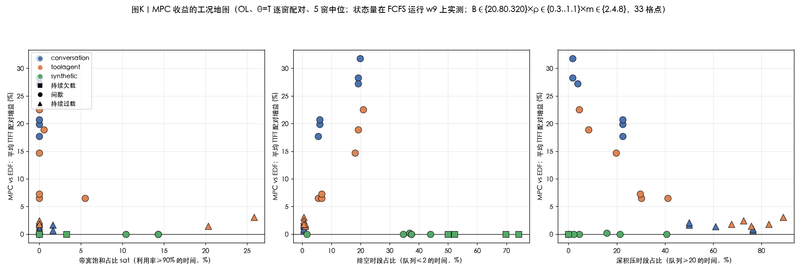

图K 每个点=一个格点（颜色=trace、形状=状态分类），纵轴=MPC vs EDF 的 TTFT 配对增益，三个横轴是同一批格点的三个实测状态量。**三个发现**：

1. **假设的两端成立**：收益集中在间歇格点（+6.5%–+31.8%）；持续欠载全部 0.0%；持续过载收窄到 +0.7%–+3.0%。Conversation 收益最大/最小两个格点经 20 窗全量验证稳定（+31.8%→+31.7%、+0.7%→+0.6%，表在 §4.1）。
2. **修正一：间歇的主角是队列的深浅交替，不是存储饱和**。左图（sat 轴）上收益与带宽饱和程度没有正相关——B=20 让带宽间歇打满（sat 5%–26%）没有放大收益：ToolAgent 的 B20ρ0.6 与 B80ρ0.6 都是 +6.5%；存储持续饱和的 B20ρ0.9（sat 20%）反而降到 +1.5%。MPC 的增量来自批组合与完成次序（§4.1 的机制），共享带宽推演的价值是**防止选错批**（§5.7 的 local 消融），不是从打满的带宽里挤收益。
3. **修正二：间歇还要有"批组合的实质差异"**。Synthetic 在 B20ρ1.1 下队列也有深浅（排空 2%、深积压 41%，按定义属间歇）但增益仍为 0——三个实测原因（§4.0 专段，20260920 复核修正了此前"请求同质"的错误说法，其 u 离散度实为三 trace 最大）：**逐条到达**（同刻组最大 2 条，一个不满批就装下）、**几乎无前缀命中**（h 中位=0，批组合只剩同步损失）、**EDF≈SPT 已拿到排序红利**。**收益 = 队列间歇 × 批组合实质差异的交集**（Conversation/ToolAgent 两者兼备——同刻突发制造排队深度、h>0 且长短悬殊使批组合有讲究；Synthetic 只有前者）。

B 因子的时序形态（`cq_fig_e25_cmp_OLB20_conversation.png`）：B=20 让橙色等待条出现（等 0.7%–2.1%）但三态结构不变——"打满段的局部等待，而非全面停摆"。环境因子的完整响应曲线（FCFS：B 线 SLO 0.176/0.193/0.193、TTFT 2.412/2.179/2.177s；ρ 线 SLO 0.223/0.193/0.153/0.130、TTFT 1.53/2.18/3.45/4.45s——单调退化、带宽过了 80 不再是瓶颈）：

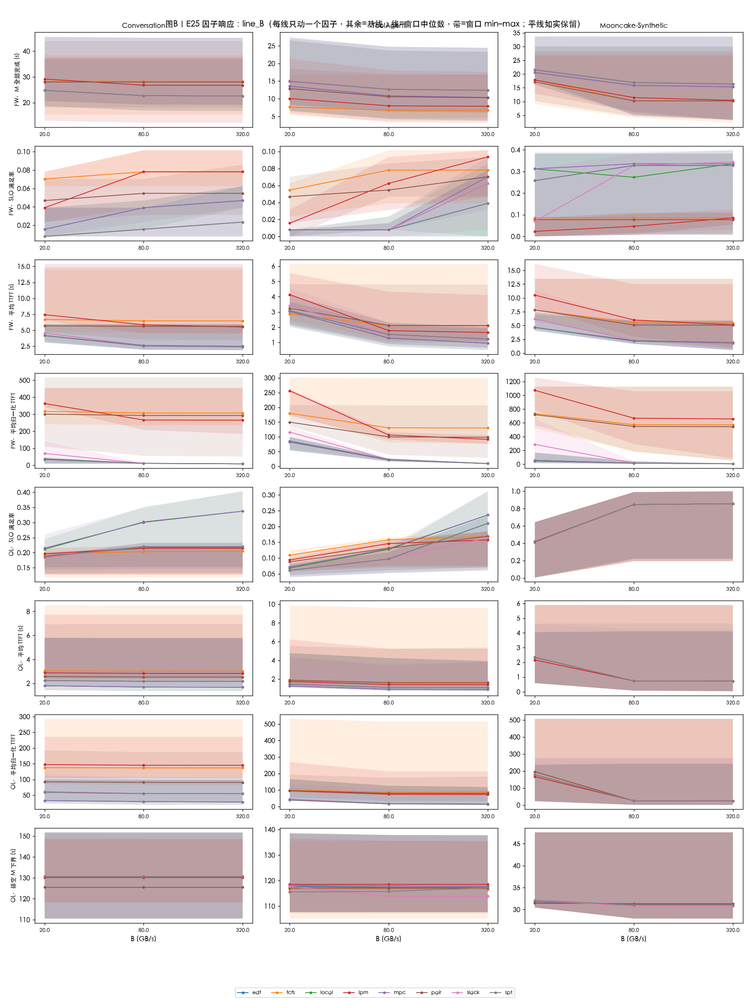

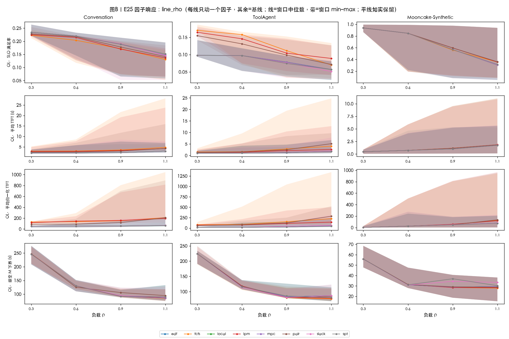

### 5.2 case：持续欠载（Synthetic OL 基线）——收益=0 的定义形态

§4.3 的表与图（**五行完全一致**；表为 5 窗中位）就是本 case：队列中位 1–2 条、一半以上时间排空、到达即服务，MPC 相对 EDF 的增益逐格点为 0.0%——§4.3 末尾的配置扫描表（同为 5 窗口径）里 Synthetic 的全部格点（含 B80/B320、m=2/8）都属此列。**工程含义**：这种工况上 MPC 只剩决策成本（§5.7）、没有收益——部署前先看队列是否常年贴零。

### 5.3 case：间歇——收益主区（ToolAgent B=20 ρ=0.6；低负载端 B=80 ρ=0.3）

B=20 ρ=0.6 绝对中位数（**5 窗 {0,4,9,14,19}**；带宽间歇打满的典型格点）：

| 策略 | SLO 满足率 | 平均 TTFT (s) | 归一化 | 排空 M (s) |
|---|---:|---:|---:|---:|
| fcfs | **0.108** | 1.839 | 99.4 | 117 |
| edf | 0.063 | 1.453 | 41.4 | 118 |
| mpc-θ=S | 0.072 | 1.264 | 40.5 | 118 |
| mpc-θ=T | 0.072 | **1.254** | **39.4** | 118 |
| local-θ=S | 0.069 | 1.266 | 40.2 | 118 |
| local-θ=T | 0.068 | 1.260 | 39.9 | 118 |

配对增益 +6.5% / SLO +1.0pp（**local +5.5%**——带宽间歇打满段共享建模净赚 1.0pp，§5.7；逐窗 0.1/2.2/13.7/6.6/6.5%——w0 冷启动无空间，中后段窗口是主贡献）。

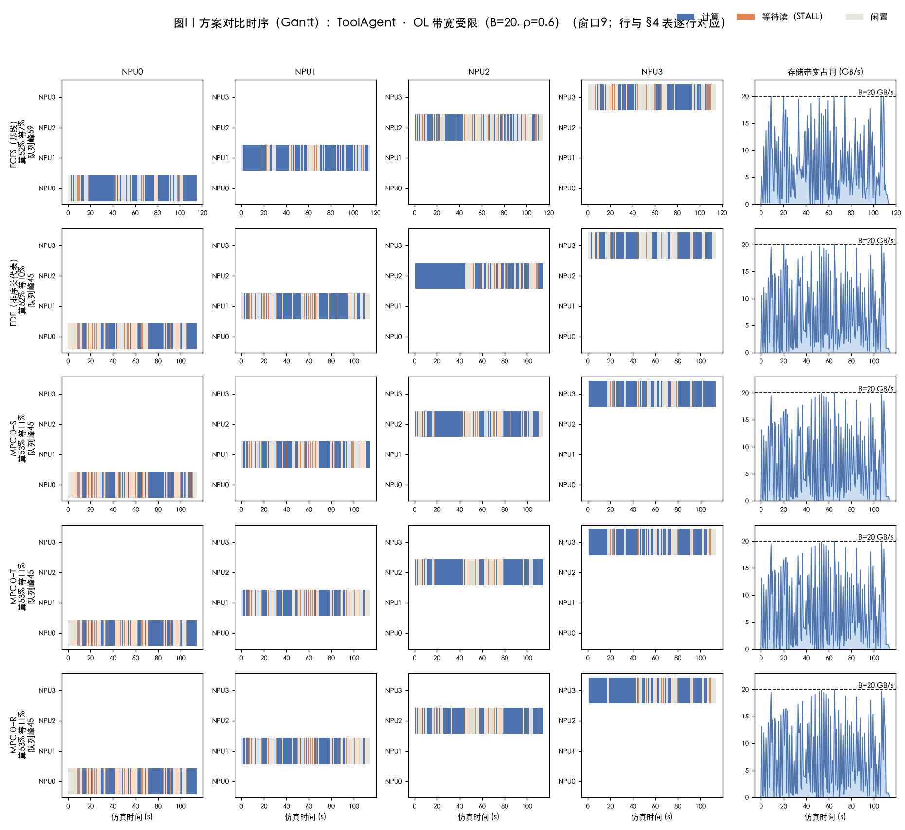

读法：带宽窄列多次顶到 B=20 虚线（sat 5%、峰 100%），对应时段泳道出现橙色（等 7%–11%）——带宽间歇打满是"公共罚"；罚与罚之间积压被清掉（队峰 FCFS 59→EDF/MPC 45），MPC 用批组合在罚隙里多捞一截。低负载端的间歇形态（ρ=0.3，增益上端 +22.5%）：


灰色闲置带大片（算 27%）、队峰 28→18→16——队列浅、每步选择自由度大、推演跑得完，正是搜索的甜区。

### 5.4 case：持续过载（B=20 ρ=1.1，E25.2 新格点）——收益收窄到个位数

绝对中位数（**5 窗 {0,4,9,14,19}**）：
| 策略 | SLO 满足率 | 平均 TTFT (s) | 归一化 | 排空 M (s) |
|---|---:|---:|---:|---:|
| fcfs | **0.044** | 4.577 | 257.7 | 80 |
| edf | 0.029 | 2.627 | 104.2 | 87 |
| mpc-θ=S | 0.033 | 2.634 | 97.6 | 87 |
| mpc-θ=T | 0.033 | **2.548** | **97.6** | 87 |
| local-θ=S | 0.033 | 2.549 | 97.7 | 87 |
| local-θ=T | 0.033 | 2.552 | 97.6 | 87 |

配对增益 +3.0%（local +2.9%；对比同 trace ρ0.6 的 +6.5%、ρ0.3 的 +18.9%）。

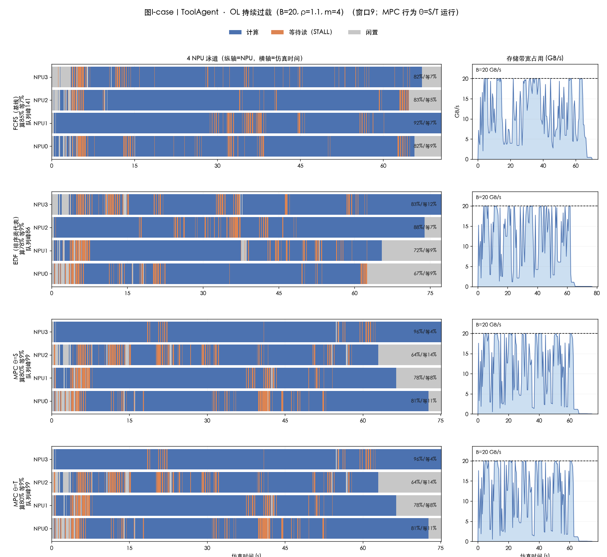

读法：算 85%、89% 的时间深积压、队列中位 74 条、带宽 26% 时间打满——资源长期满转，四行的泳道形态几乎相同，差距只剩尾部批组合的微差。B=80 的过载形态（Conversation ρ1.1：算 83%、各行趋同、增益 +0.9%）：

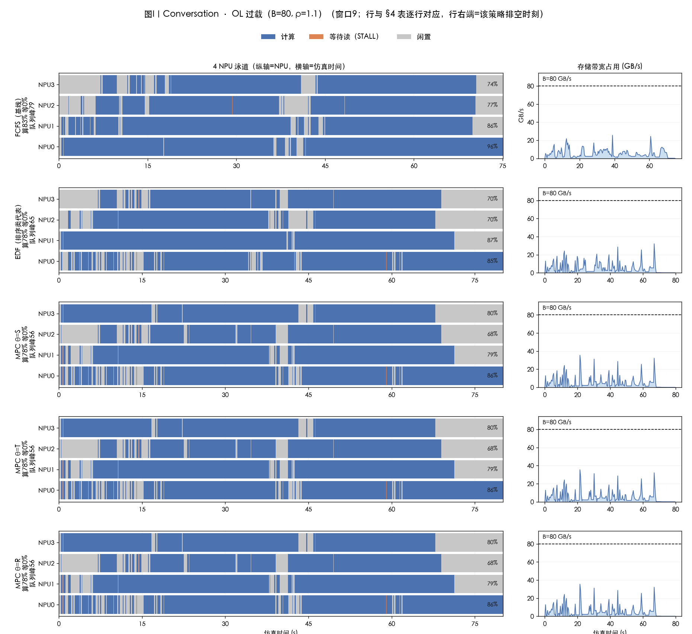

### 5.5 NPU 数量 m：同 ρ 下平移工况（E25.2 新格点）

λ0 锚随 m 变化（ToolAgent：m=2→9.09、m=4→18.18、m=8→36.35 req/s）——同 ρ=0.6 下 m=8 意味着到达率翻倍且 8 个 NPU 同时读，工况滑入持续过载；m=2 到达率减半，保持间歇。以下两表均为 **5 窗 {0,4,9,14,19}** 绝对中位数。

m=8（B=80, ρ=0.6；**持续过载**，深积压 73%）：

| 策略 | SLO 满足率 | 平均 TTFT (s) | 归一化 | 排空 M (s) |
|---|---:|---:|---:|---:|
| fcfs | **0.171** | 1.529 | 80.6 | 64 |
| edf | 0.101 | 1.063 | 16.1 | 67 |
| mpc-θ=S | 0.110 | 1.036 | 16.1 | 67 |
| mpc-θ=T | 0.110 | **1.036** | **16.1** | 67 |
| local-θ=S/T | 0.110 | 1.036 | 16.1 | 67 |

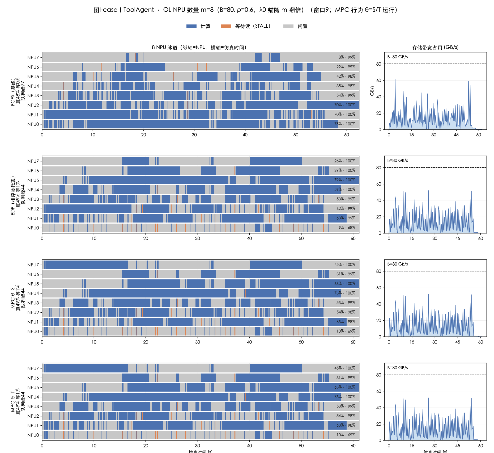

m=2（B=80, ρ=0.6；**间歇**，排空 18%/深积压 20%）：

| 策略 | SLO 满足率 | 平均 TTFT (s) | 归一化 | 排空 M (s) |
|---|---:|---:|---:|---:|
| fcfs | 0.124 | 2.381 | 130.7 | 224 |
| edf | 0.091 | 1.249 | 25.5 | 224 |
| **mpc-θ=S** | **0.189** | 1.157 | 31.7 | 224 |
| mpc-θ=T | 0.138 | **0.986** | **23.4** | 223 |
| local-θ=S | 0.172 | 1.075 | 24.4 | 224 |
| local-θ=T | 0.136 | 0.988 | 23.4 | 223 |


**两个发现**：① m=8 收益 +2.4%（vs m=4 的 +6.5%）——**沿容量锚扩容会把系统推进过载区、摊薄调度价值**（本实验 ρ 语义下到达率随 λ0 一起涨；若固定到达率只加 NPU，则向欠载移动——两个方向都离开间歇甜区，结论同向）；② m=2 收益 +14.7%（SLO +9.2pp），且 **mpc-θ=S 的 SLO 0.189 首次在 ToolAgent 上超过 FCFS 的 0.124**（+6.5pp）——worker 越少、每个决策点的批组合越关键，MPC 的相对价值越大；同格点 local-θ=S 只有 0.172（比 mpc 低 1.7pp）——单决策权重放大后，共享带宽建模的防错价值显现。

### 5.6 其他因子：α（期限松紧）/ 批能力 / 计算画像

**α（SLO 紧度）：期限松紧会"反转"赢家**。FCFS 的 SLO：α=2/4/8 时 0.106 / 0.193 / 0.304；EDF：0.075 / 0.220 / **0.409**——紧期限（α=2）FCFS 胜 3.1pp、松期限（α=8）EDF 胜 10.5pp，"哪个策略好"没有无条件答案，期限设定本身是先决条件。α=8 的时序形态证实 **α 不改变任何资源行为、只改 deadline 的记账**——下图与 §4.1 的 α=4 基线几乎逐像素相同（算 48%、等≈0%、队峰 45/37/25）：

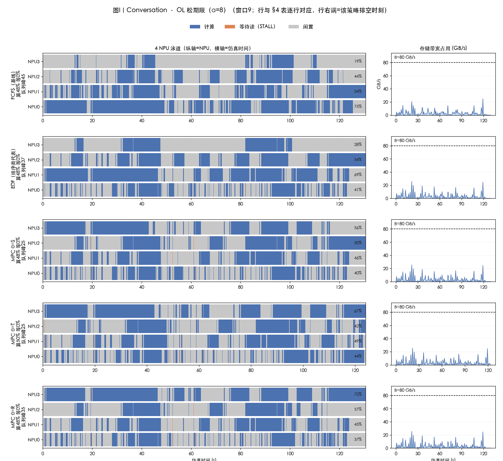

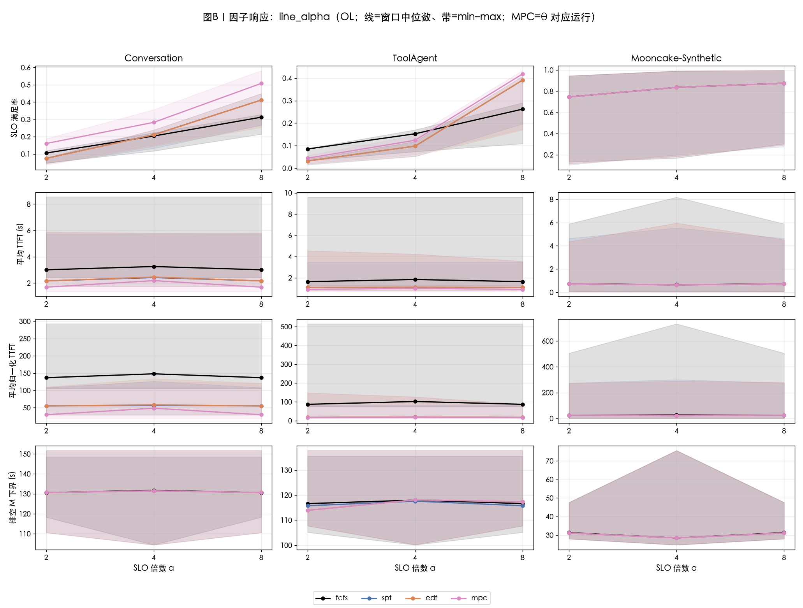

**批能力（A 禁组批 / B 同象限 / C 自由）：真实形状下组批是纯亏的**

| 能力 | FCFS SLO | SPT SLO | SPT 的 M |
|---|---:|---:|---:|
| A（每批 1 条） | 0.141 | **0.156** | 16.6s |
| B（同象限） | 0.133 | 0.055 | 23.1s |
| C（自由） | 0.078 | 0.016 | 19.3s |

**能力越放开，SLO 越差**。原因：真实请求的新 token 太多，批内总 token 远超饱和点 512，G_total≈1.005——**合批一点计算都不省，只剩"整批陪最后一个成员等"的同步损失**。只有禁组批时 SPT 才在 SLO 上小胜 FCFS。

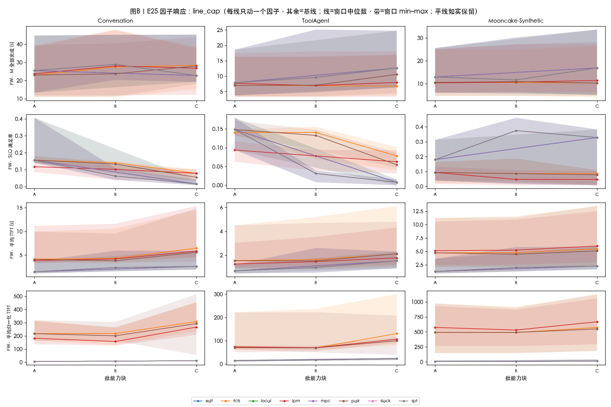

**计算画像（能否打开"合批省计算"通道）**

真实 trace 上三档画像（默认 / 无加速 / 饱和点降到 128）的 G_total 都≈1.00、四指标无差。用四类机制组夹具（64 条短请求）验证通道本身：默认画像 G=1.099（合批省 9.9% 计算，11/11 批都省）、无加速严格 =1.000——**机制正确**；但即便省 9.9% 计算，请求级 TTFT/SLO 变化 <2%：计算节省被同步等待吃掉。

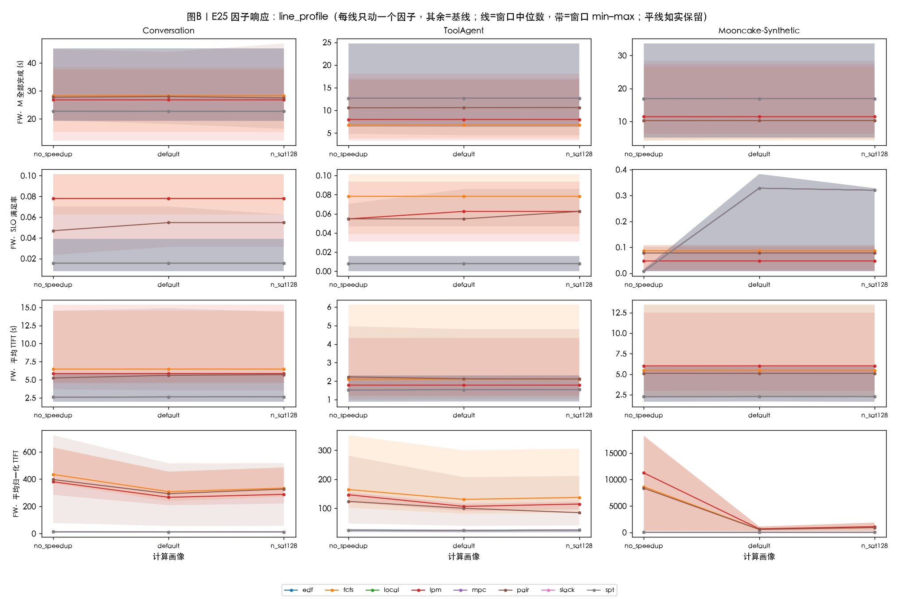

### 5.7 搜索的增量边界与代价：消融与复杂度（图 J）

修复实现并以理想上限档（CPU 预算放开、2 万事件硬界）重跑后，MPC 与 EDF **在全部图 B 上分离**。相对 EDF 的改善（**逐窗配对中位**；SLO←θ=S 运行、TTFT←θ=T 运行、M←θ=M 运行；正值=更好）：

| 模式×trace | SLO | 平均 TTFT | M |
|---|---:|---:|---:|
| OL Conversation | **+8.0pp** | **+19.9%** | 持平 |
| OL ToolAgent | +2.1pp | +6.5% | 持平 |
| OL Synthetic | 0 | 0 | 0（队列空，无决策空间） |
| FW Conversation | +2.3pp | +0.3% | **+15.1%**（w9：EDF 42.1→MPC 26.3；窗口间差异大，中位口径持平 22.7 vs 22.7） |
| FW ToolAgent | 0 | +17.0% | +6.6% |
| FW Synthetic | +0.8pp | +2.5% | +6.2% |

**口径注**：本表为逐窗配对中位；与"中位数之比"口径的差异见 §4 各表（如 ToolAgent OL 的 TTFT：中位比 −17.4% vs 配对 +6.5%——w9 是 MPC 最有利窗口、主导了配对中位）。

**local 消融专段：它是什么、"local 偶尔赢"从哪来、什么时候真的输**。local 与 mpc 用**同一套搜索、同一个候选集、同一个 gate**，唯一区别是给候选打分的推演世界：mpc 的副本里所有实例的读取挤同一条 B（与真实引擎一致）；local 的副本里**每个实例独享一份带宽**（乐观假设）。它是为度量"建模跨实例干扰值多少钱"设计的消融，不是一个认真的调度方案。三处观测先摆出来：

| 场景 | local vs mpc-θ 对应 | 定性 |
|---|---|---|
| OL Conversation B=80 | local SLO 0.318 vs mpc 0.316（local 高 0.2pp） | **噪声**，不是"独立带宽更好" |
| FW ToolAgent B=80（θ=S） | local TTFT 1.29 vs mpc 1.54（local 好 16%） | **gate 临界效应**：无竞争时两评分器几乎重合，切/不切由微小分差决定（θ=T 下两者一致 1.29） |
| OL ToolAgent B=20 | local 低 0.08pp（SLO）、改善占比低 0.6pp（§7.5.4 审计口径） | 竞争出现，方向偏向 mpc |
| FW Synthetic B=80 | local SLO 0.273 vs mpc 0.336（local 低 **6.3pp**） | **真信号**：乐观评分选错批 |

① **为什么 B=80 上几乎没差别（先纠正上一版"逐位相同"的过强说法：实测 Conv OL B80 五个窗口里 4 个有 ≤0.02s 的微小分叉，只是幅度到不了 0.2pp）**。MPC 派活前把每个候选方案在脑子里"演一遍到全部干完"、打分、挑最高分——**local 用的是同一套流程、同一套打分**，它没有自己的选批逻辑；唯一区别是脑子里的想象：MPC 想 4 个 NPU 挤同一条带宽，local 想每个 NPU 独享一条。两种想象**只在"读数据的需求大到把带宽挤满"时才会算出不同结果**——带宽没满时谁也不用等谁，"独享"和"共享"的答案一字不差（水龙头类比：四个人估算同时接水要多久，按"一个龙头要排队"算和按"每人一个龙头"算，只要水量开不满龙头，两种算法完全相同）。对照数据：B=80 带宽峰仅 31–59%（几乎从不满）→ 想象几乎总相同 → 结果几乎一样；B=20 经常打满 → 差 1.0–1.7pp；FW Synthetic 大读取请求扎堆、连 B=80 都会顶满 → 差 6.3pp。**所以"认为带宽独享"确实会改变选批，但只通过"这个批会不会把带宽顶满"这一件事起作用。**
② **local 真正输的机制（"选错批"的具体含义，最后一行）**：一个批的读取流量取决于**它装了谁**——长短请求混批会改变并发读取量与读取时长。local 的乐观世界低估混批内部的读竞争、**高估"这批人都能赶上 deadline"的概率**，于是选了看似人人按时的组合；真实世界里后发的读流排在前发后面，批里的临界请求超期。Synthetic FW 的 −6.3pp 就是这个机制的直接观测——这份 trace 的收益本来就全靠批组合（§4.3），评分模型一乐观就选错。另注意 FW ToolAgent θ=S 的"local 反好 16%"：那不是独立带宽更强，而是 gate 的严格改善门槛在两个几乎相同的评分器之间掷硬币——θ=T 下两者一致，说明差异来自切/不切的临界分差而非模型优劣。
③ **方向总结**：带宽越紧、批组合越自由，乐观偏差越大——**"建模共享带宽"的价值随竞争强度单调增长**（B=80 对话流处于其下限，B=20 已可见）。理论上若推演完全精确且候选集相同，mpc 应弱优于 local；现实差距来自两个近似——一步前瞻（更准的地图不保证一步棋走对）与深队列下的事件预算截断（两者同受影响，不改变方向）。

**口径注（§5.1 地图与 §4 数字怎么算）**：地图增益 = **逐窗配对再取中位**；若按五窗中位数之比计算（对窗口异质不稳健），数值不同（如 ToolAgent 基线 +2.5% vs 配对 +6.5%）。20 窗完备性验证（§3.5）的配对中位：Conversation +8.8%（5 窗 +19.9% 偏乐观）、ToolAgent +6.3%、Synthetic 0——两口径方向一致，稳妥引用 20 窗值。解读见 §5.1：低负载队列浅、事件预算够把推演跑完（§5.7 机制级解释）；过载时队列深、预算被基础排空吃光、尾部积压稀释单步价值。另见[教学页](docs/MPC方案图解-20260920.html)最后一节。

**调度计算复杂度：分析与实测**

**复杂度分析**。简单策略每次决策 = 排序 O(Q·log Q) + 逐空闲实例贪心填批 O(m·n_max)——**算法本身是微秒级**；实测 0.16–1.1ms 的大头是**快照重建**（每次决策把全部排队请求重建为轻量 spec），这是仿真框架的记账成本，不是调度算法的计算量，部署时无此项。MPC 每次决策 = 1 次基础排空推演 + |A| 次候选推演，每次推演的事件数 E_drain ≈ (已知请求数 ÷ 平均批大小) × L × 每批事件系数——**线性于当前已知请求数**；2 万事件预算是硬顶：E_drain 超过预算时该推演作废，预算被基础排空吃光时候选零评分、MPC 在预算内退化为 π。

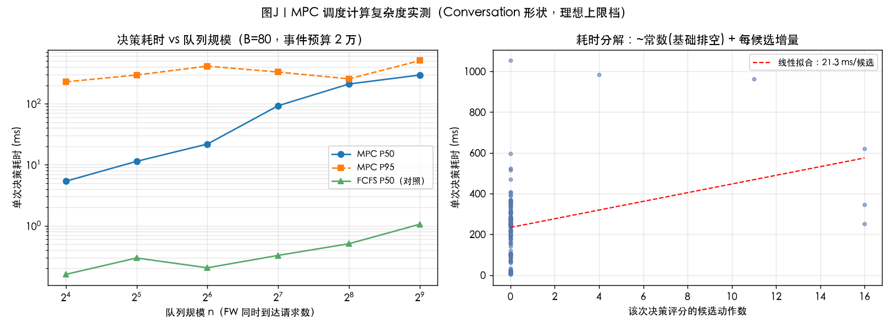

**扩展实验实测**（FW、Conversation 形状、理想上限档；**n = 单次决策时中央队列里的请求数**——即一次推演需要排空的全部已知请求。OL 在线流的队列深度就是运行中不断变化的 n；FW 的 128 条封闭工作集 ≈ n=128 的常驻深队列。n 从 16 扫到 512）：

**为什么"队列越长、可评候选越少"，以及"拿全队列挑批"为什么当前做不到**：
- **评分像改卷，预算像时间**：给一个候选打分必须"把整个队列在脑子里干完"（推演到排空），队列越长演一遍越贵（事件数线性于 n）；预算固定 2 万个事件，所以队列越长、装得下的"完整演一遍"次数越少——**不是候选变少了，是改不完了**（老师一小时，每份卷 5 分钟能改 12 份，每份 50 分钟只能改 1 份；没改完的卷子没有分数、不能入选）。这与"放大 500 倍预算结果不变"不矛盾：那是**在线场景**（队列常驻只有几条，演一遍很便宜、预算根本没用完，放大当然不变）；本表是**深队列实验**（128 条全堆一起，演一遍吃掉大半预算）——两句话各说各的场景。
- **"挑"的范围有硬顶**：组批时候选只从每种排序的前 **32 条请求、24 个批**里出（代码上限 K_req=32/K_batch=24，§9 既有边界）——**队列再长，能挑的就这 32 条**，其余请求只是推演排空的背景、进不了候选。所以"用队列里所有请求调整批组合来错峰"在当前实现里做不到：队列变长不带来更多选择，只让每个选择更贵。把"挑得全"和"评得起"同时拿到（扩大上限+剪枝+增量重放+预算自适应）就是下文工程含义的内容。

| n | MPC 决策 P50 | P95 | **每决策评分候选数** | FCFS P50 | MPC 决策总耗时 |
|---:|---:|---:|---:|---:|---:|
| 16 | 5.4 ms | 228 ms | 5.3 | 0.16 ms | 0.26 s |
| 64 | 21.8 ms | 412 ms | 2.0 | 0.20 ms | 0.76 s |
| 128 | 92.7 ms | 330 ms | 0.7 | 0.33 ms | 2.22 s |
| 256 | 210 ms | 255 ms | 0.1 | 0.51 ms | 6.85 s |
| 512 | 295 ms | 508 ms | **0.0** | 1.06 ms | 20.35 s |

三个结论：① **简单策略便宜 2–3 个数量级**（亚毫秒 vs 数十至数百毫秒）；② **事件预算在深队列上被基础排空吃光**——每决策候选数 5.3→0.0 单调归零，n=512 时 MPC 在预算内退化为 π。这同时给出 §5.1"MPC 增益随工况收窄"的**机制级解释**：负载升高→队列变深→E_drain 变大→可评候选变少→搜索空间坍缩，不只是"积压稀释了单步价值"；③ 耗时 = 常数（基础排空）+ 每候选增量 × 候选数（图 J 右的线性拟合），且 P50 随 n 增长后**趋平**（预算封顶）而非爆炸——最坏情况有界。

**全矩阵开销画像**（每 run 落盘 `ctrl_p50/p95_ms`；记录中的 `n_scored` 为整 run 累计，按决策数折算约 0.6–2 个/决策，与上表一致）：OL 决策 P50 中位 39–40ms（Conversation/ToolAgent）、6ms（Synthetic），P95 长尾 318–582ms；FW P50 29–90ms。

**事件预算验证**：将 max_events 从 2 万拉到 1000 万后，OL 基线（三 trace、ρ=0.6、θ=T）的 TTFT/SLO/scored **逐位不变**——2 万事件在当前 OL 负载不是约束，搜索已到达候选集枚举完的自然上限（n_scored 不再增长）。约束在深队列才出现：n≈128 起部分绑定（每决策 0.7 个候选）、n=512 完全耗尽（§5.7 扩展实验）——**同一个预算，绑定与否由 E_drain(n) 决定，两个结论各在自己的适用域**。

**取消上限的实测（E25.3，`tools/e25_uncapped.py`，20260920）**：把 max_events 从 2 万放开到 1000 万（等效取消），重跑 FW 基线（θ=M/S/T）与 OL ρ∈{0.9, 1.1}（θ=S/T）的 MPC，与 2 万预算记录逐窗配对：

| 场景 | 取消上限的影响 | 每决策评分候选数（2 万→1000 万） | 决策 P50 |
|---|---|---|---|
| **OL ρ=0.9 / ρ=1.1**（6 格点） | **全部逐位相同** | 16–144 → 不变 | 不变（±几 ms） |
| FW Conversation（θ=M/S/T） | TTFT 再降 **+1.4%**（2.526→2.492；SLO 不变） | 11 → 16 | 不变（76–97ms） |
| FW Synthetic（θ=M/S/T） | TTFT 再降 +0.5 至 +1.2%（SLO 不变） | 10–12 → 16 | 不变 |
| FW ToolAgent（θ=M/S/T） | 逐位相同（θ=S）或数值相同 | 14 → 16 | 不变 |

**结论**：① **对 OL：取消上限零影响**——即使过载（ρ=1.1，队列中位 35–74），2 万预算也从未绑定（候选数 16–144 全部评完）；"MPC 增益随 ρ 收窄"与事件预算无关，原因在尾部积压稀释单步价值（§5.1）。② **对 FW：影响小但真实**——深队列（128 条）下 2 万预算确实饿死了部分候选（scored 10–14 → 16 评满），放开后 Conversation 的 TTFT 再降 1.4%；SLO 全部不变。放开上限的代价是决策耗时随队列深度增长不再有界（n=512 时推演事件数可达数十万），收益上限约 1 个百分点。

**"还有哪些限制？现在的结果是不是 MPC 能找到的最优"（分层澄清）**。取消的是 **2ms 的 CPU 软预算**（当年 MPC≡EDF 的主因 R1，§7.5），它现在放开到 3600s、从未触发；**事件预算 2 万从未取消**——它是确定性硬界（保证最坏情况有界、结果可复现），不是性能调优项：

| 层 | 当前设置 | 对 OL 基线的影响 |
|---|---|---|
| CPU 软预算 | 曾 2ms → 现 3600s（`e25_factor.py` 的 `MPC_BUDGET_S`） | 无（从不触发） |
| 事件预算 max_forecast_events | **2 万，从未取消** | 无（ρ=0.6/0.9/1.1 全部逐位不变，E25.3） |
| 候选集与推演结构 | 32 请求/24 批的候选枚举 + H=1 一步前瞻 | **这才是"上限"的真正来源** |

因此：① **OL 的结果（含过载 ρ=1.1）可以读作"MPC 在它的候选集里找到了最优"**——停止条件是候选枚举完；E25.3 把事件预算放大 500 倍在 ρ=0.6/0.9/1.1 全部逐位不变就是证明；② **FW 深队列（n≥128）的结果不是全局最优**——事件预算在那里真实绑定（每决策只评 0.7 个候选，n=512 归零），数字是"预算内可达的上界"；③ 且无论 OL/FW，"最优"都是**当前候选集 + H=1 结构下的最优**，不是全动作空间的最优（§9 的既有边界）。

**"找到了最优"为什么不等于"端到端必然不劣于所有方案"**。这个推断的方向是对的，但成立的链条是：gate 只在候选**按推演评价器**严格优于保底 π(EDF) 时才切换 ⇒ 逐步保证的是"**推演世界里不劣于 EDF**"；要变成端到端的"必然不劣"，还需**推演评价器 ≈ 真实世界**——两处近似会破坏它：① **OL 的推演假设没有未来到达**：每个决策在"冻结世界"里选最优，真实世界随后的到达可能让另一个动作更好；② **FW 深队列的推演被事件预算截断**：截断的评价器有偏，被 gate 放行的动作可能在真实里更差（实例：FW Conversation θ=T 的 TTFT 2.85 劣于 EDF 的 2.62）。另有一点：**FCFS 等其他方案的动作不一定在候选集里**（候选集=三种排序的枚举，保底是 EDF）——推演意义下的构造保证只覆盖"≥EDF"；对 FCFS 的全面超越（§4.1 基线）是实证结果、不是构造保证。数据与理论合拍：OL 上评价器近似足够好，33 个格点全部 MPC ≥ EDF；违背只出现在评价器失真的 FW 深队列。

**MPC 搜索的方向与逻辑（不是梯度下降）**。MPC 不迭代修改 EDF 的计划，而是在每个决策点做**一步前瞻的广度搜索**：① 从当前队列按三种排序（同形/互补/紧迫）枚举候选联合动作（含 WAIT），是**广度优先**枚举当前时刻的所有可能"下一步"；② 每个候选在系统副本上用 π（EDF）推演到排空、打 θ 词典序分——推演深度由"排空"定义而非固定层数；③ 取分数最优的首动作，若严格优于 π 的动作则切换，否则回落 π。**停止条件**：候选枚举完即停——不存在收敛判据或梯度方向的迭代。本实验的"理想上限档"已把 CPU 软预算放开（3600s，`e25_factor.py` 的 `MPC_BUDGET_S`）；代码保留的另两个出口（CPU 超时、2 万事件硬顶）在 OL 基线上从未触发（事件预算验证见上段），只在 FW 深队列（n≥512）出现。单次决策复杂度 = (1+候选数) × 排空事件数。**FW vs OL 的目的不是"多候选是否更好"**（那是 §5.6 批能力小节做的事），而是 §3.4 的两种负载问法：FW 把全部信息摆在桌面上（调度空间的极端拉满），OL 度量真实节奏下的体验。

**工程含义**：要把"理想上限"的增量（§5.1 地图）变成可部署收益，关键是把 E_drain 降下来——增量重放（只重算受影响的后缀）、候选剪枝（预排序后只评前 k）、以及**事件预算随队列深度自适应**（深队列时允许更大预算或改用近似尾部），使深队列也能评到候选；否则 MPC 只在浅/中队列（本实验的间歇工况）保住优势。---

## 6. 时间序列：运行过程中发生了什么（图 D–I）

六类图都来自同一份逐桶时间序列（横轴一律是仿真时间）：**图 I 系列（"方案对比时序"）的嵌图分布在 §4（基线、与表 1:1 紧跟）和 §5（因子对照），读图指南见 §4 开头；本节 §6.0 只保留分布索引与结论性 takeaway**；图 D/E/F 是策略×带宽的面板网格，图 G/H 把 NPU 与带宽拆开细看（§6.1–6.5），是"资源在干嘛"的细部视图，不重复方案对比。

### 6.0 图 I 系列分布索引（18 张）与三张 takeaway

**22 张图 I 的分布**（每张 = 一行一策略的 NPU 泳道 Gantt + 带宽窄列）：§4 各 trace 小节嵌基线 6 张（紧跟各自表格）；§5 嵌 8 张（B=20 / ρ=0.3 / ρ=1.1 / m=8 / m=2 / B20ρ1.1 等 case 图与对照）；其余 8 张文件名如下，`tools/e25_ts_compare.py`（基线/因子场景）与 `tools/e25_regime.py figs`（E25.2 case）一条命令全部重出：

| 场景 | 未在正文嵌图的文件 |
|---|---|
| B=20 | `cq_fig_e25_cmp_OLB20_conversation.png`、`cq_fig_e25_cmp_OLB20_synthetic.png` |
| B=20, ρ=0.9 | `cq_fig_e25_cmp_OLB20r09_conversation.png` |
| α=8 | `cq_fig_e25_cmp_OLa8_toolagent.png`、`cq_fig_e25_cmp_OLa8_synthetic.png` |
| ρ=0.3 | `cq_fig_e25_cmp_OLr03_conversation.png`、`cq_fig_e25_cmp_OLr03_synthetic.png` |
| ρ=1.1 | `cq_fig_e25_cmp_OLr11_toolagent.png`、`cq_fig_e25_cmp_OLr11_synthetic.png` |

**三张 takeaway**（全部 22 张图 I 反复出现的模式）：① **FW 的差距 = 忙闲结构**——同样的计算量摊进不同的墙钟，看灰色闲置带与各行的长短（EDF 留长尾、MPC 混批填满）；② **OL 的差距 = 队列与批粒度**——状态占比常常不动，看行旁统计的队列峰（如 Conversation 基线 45→37→25）；③ **带宽打满段（B=20）人人受伤、差距缩小，过载段（ρ=1.1 / m=8）差距趋于消失，低负载段（ρ=0.3 / m=2）是搜索的甜区**——这三条与 §5.1 的工况地图互为表里。

### 6.1 图 D：NPU 三状态时间线

**每个格子**：横轴 = 仿真时间（缩放后），纵轴 = 4 个实例的总占用比例，蓝色=Compute（在算）、橙色=STALL（批领了但本层数据没到，干等）、灰色=Idle（没活干）。三色堆满到 1。

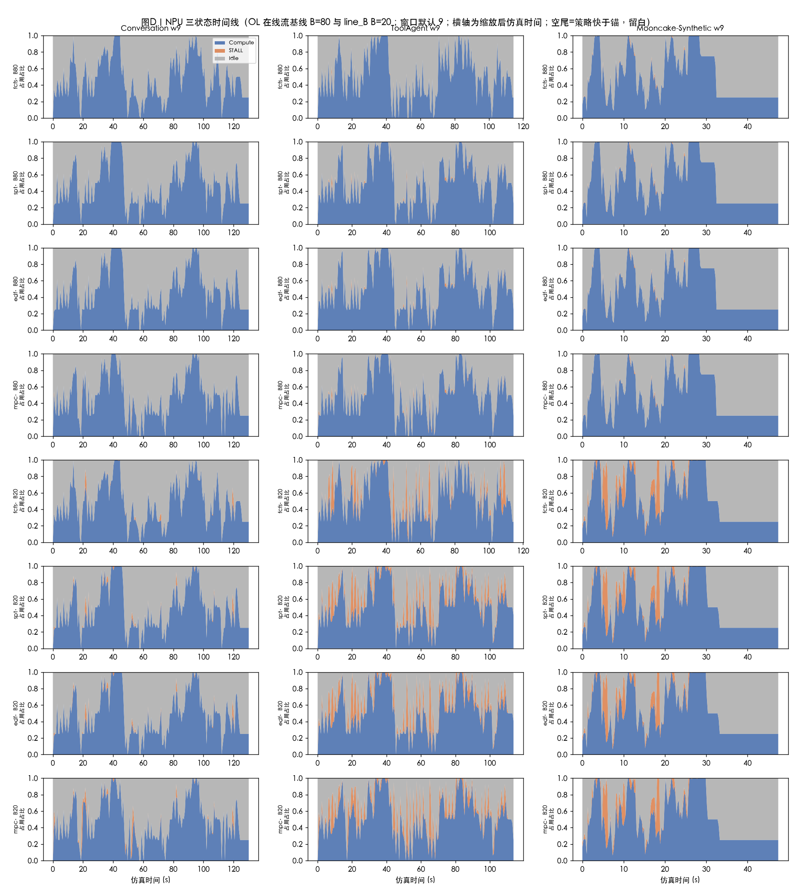

**三个结论**：① B=80 的四行橙色几乎看不见（0–0.7%）——**读取完全被计算掩盖**，这就是 §5.1"带宽加到 320 没用"的原因；② B=20 时橙色出现，ToolAgent 上 fcfs 7.1% vs spt **10.1%**，而 spt 的队列更低（中位 14 vs 18）——**排序类的时延收益来自"批内多等一点、队伍短一点"的交换**；③ 蓝色始终≈50%：4 个实例只喂到半满（灰色≈50% 是流量余量）。

### 6.2 图 E：存储带宽利用率时间线

**每个格子**：蓝线 = 该时刻窗口实际传输速率 ÷ 可用带宽（0–1），右侧坐标的黑色虚线阶梯 = 可用带宽 B(t) 本身。

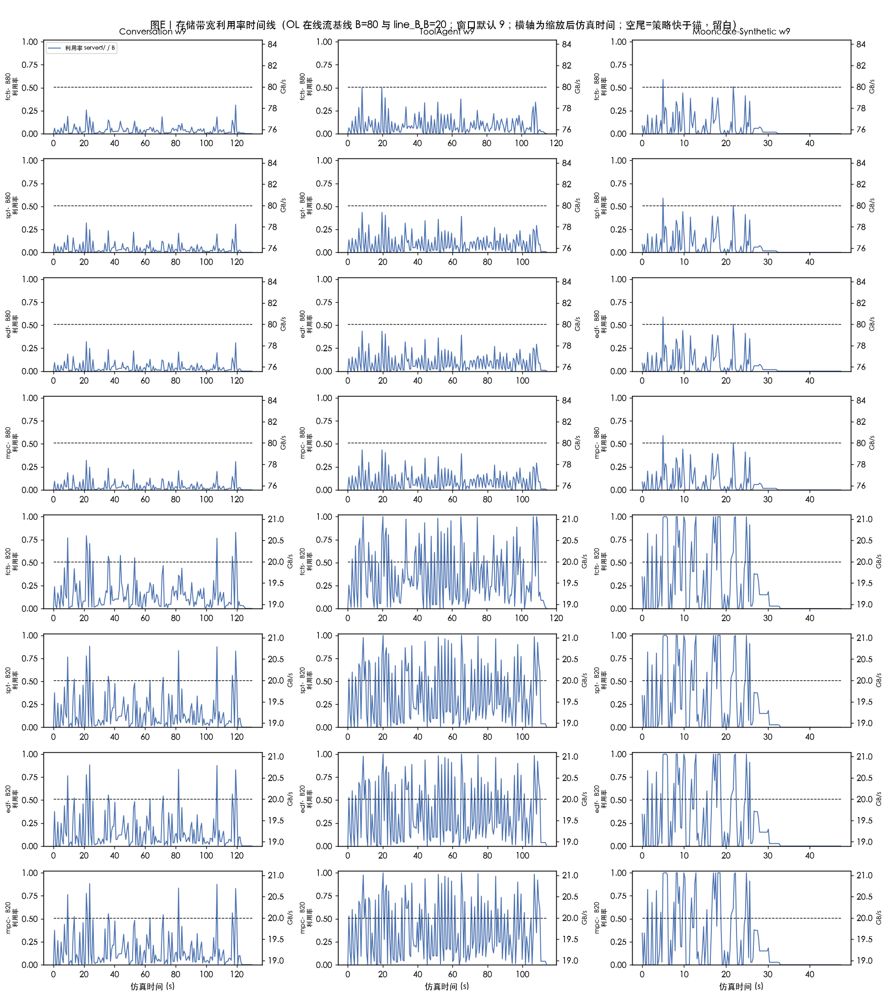

**结论**：利用率是**尖峰状**的——B=20 时 ToolAgent/Synthetic 的**峰值打满 100%**、中位只有 25%/2.7%。瓶颈存在于突发窗口的瞬时并发竞争，而不是平均带宽。这同时解释了 §5.1（平均带宽翻倍无效）和 §7 里"错峰策略的作用区间"。

### 6.3 图 F：队列时间线

**每个格子**：蓝线 = 等待+执行中的请求数（时间加权均值），阴影 = 瞬时峰值。

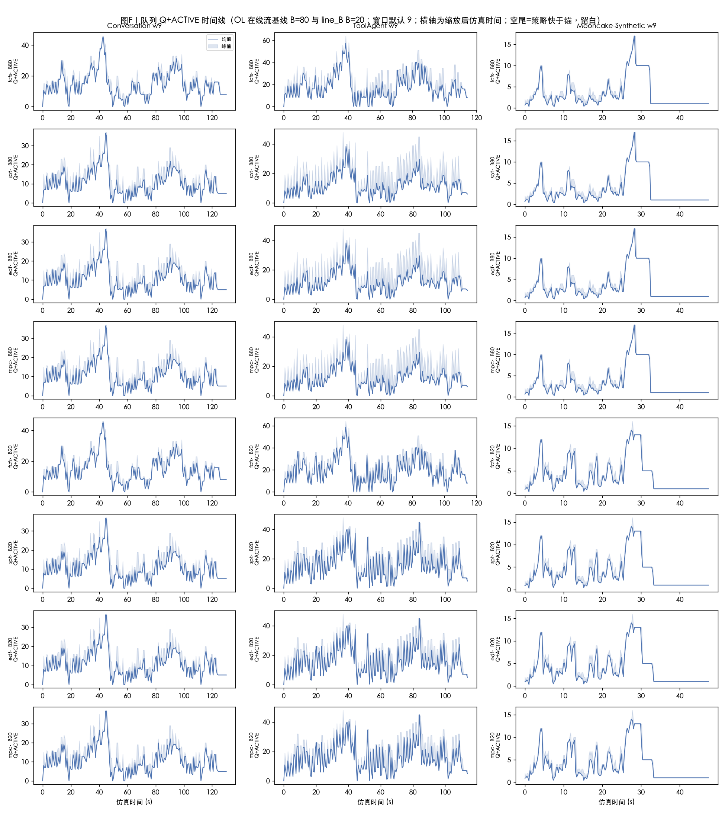

**结论**：spt/mpc 的均值线整体低于 fcfs（短请求快速清队），但峰值阴影揭示被均值掩盖的突发积压——**"时延赢、SLO 不赢"的时间结构解释**：清得快的是短请求，长请求在阴影处等过了期限。synthetic 列的曲线贴着横轴，对应 §4.3 的"到达即服务"。

### 6.4 图 G：每个 NPU 各自在干嘛（不再加总）

图 D 把 4 个 NPU 加总了，这里**每个 NPU 一行**（行 = NPU0–3，列 = 三文件，FCFS，B=80/20 各一张）。每格纵轴 = 该 NPU 的时间占比（0–1），蓝线=在算、橙线=等数据，两线之外的空白=闲置——即"每个 NPU 画'算'与'读'两条线"的形态。

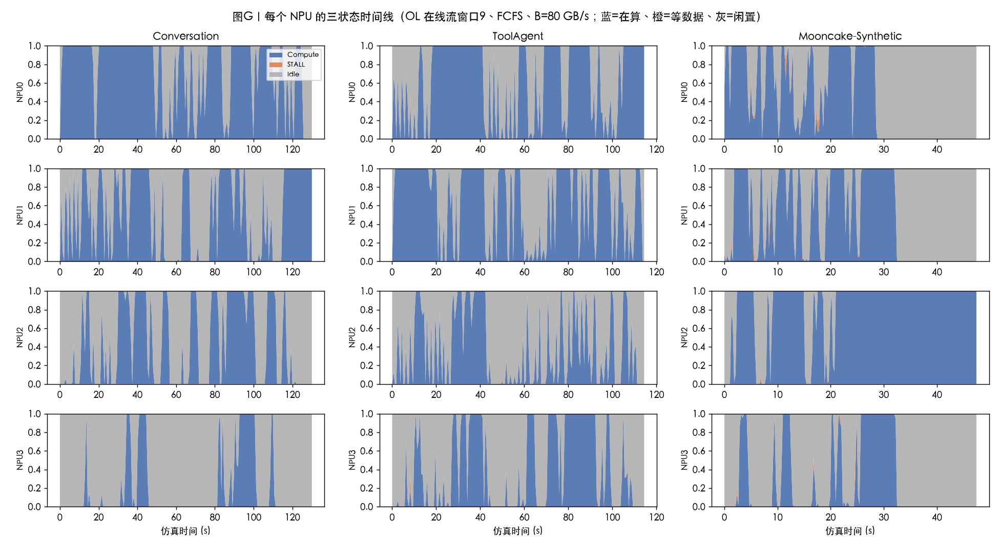

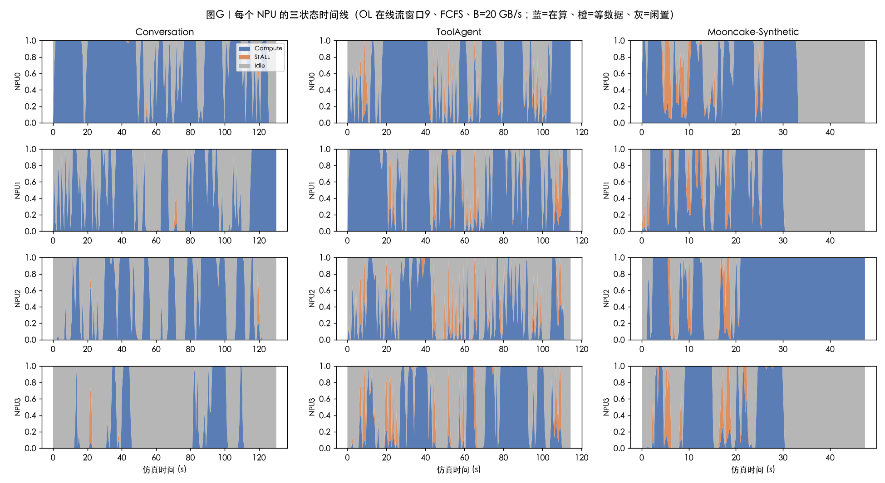

**两个结论**：① B=80 时四个 NPU 的**瞬时形态**相似（蓝灰交替、橙色≈0，带宽不构成约束），但**累计计算量可以不均**（见下段的不均分析）；② **B=20 的 ToolAgent 列出现强烈分化**：峰值时刻（t≈65s）NPU0 有 81% 时间在算，而 **NPU1/2/3 分别有 84%/74%/73% 时间在等数据**——这是 FCFS 的"赢家通吃"结构：排在前面的读流喂饱一个 NPU，后面的全部饿着，尽管队列里还压着 27 条请求。Conversation 的 B=20 列也能看到 NPU2 独自等 59%。**这就是"错峰/相位"策略要解决的对象分布**：让各 NPU 的读取错开，而不是让一个 NPU 独占带宽。

**各 NPU 计算时间为什么不均？MPC 是加剧还是改善了它**（基线 w9，每 NPU 计算时间占全时长；图G 只画 FCFS，各策略的逐 NPU 泳道见图 I）：Conversation——FCFS 四卡 **75%/54%/44%/19%（极差 56%）**、EDF 41%/69%/54%/28%（极差 41%）、**MPC θ=S 38%/49%/50%/55%（极差 17%）**、θ=T 44%/49%/42%/67%（极差 24%）；ToolAgent 各策略极差 19–27% 相近。两个结论：① **不均的来源是批的独占性**——一批（≤8 条）整体交给一个 NPU 执行，批有大小长短、到达有突发，谁领到什么活天然不匀（FCFS 的"先到先整批"最不匀）；② **MPC 反而把不均压小了**（Conversation 极差 56%→17–24%）：混批与重排让各 worker 领到的批更均衡；残余 ≈20% 的不均是**动作空间的边界**——调度器不能切分一个批、不能中断迁移执行中的批，只能决定"下一批装什么、给谁、何时发"。

### 6.5 图 H：存储带宽利用率折线（fcfs vs spt）

**每个格子**：纵轴 = 利用率（0–1），横轴 = 时间；**实线 = FCFS、虚线 = SPT**，黑色点线阶梯 = 可用带宽 B(t)（右侧坐标，GB/s）；峰值点标注了发生时刻。行 = B{80, 20}，列 = 三文件。

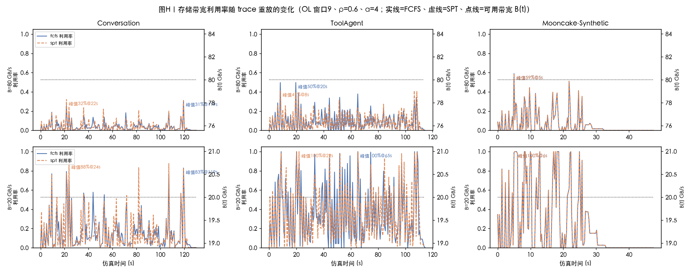

**三个结论**：① B=80 行的峰值仅 31–59%（Conversation t≈119s 31%、ToolAgent t≈20s 50%、Synthetic t≈5s 59%）——带宽远未打满，再次印证 §5.1 的"80→320 无增益"；② B=20 行的峰值 83–100%（ToolAgent t≈65s、Synthetic t≈6s 打满）——**瓶颈以短脉冲形式出现**，打满的时刻正是图 G 里 NPU 分化的时刻；③ 实线与虚线的形状差异就是**策略对读取时间分布的改变**：SPT 把读取需求在时间上重新排布（短请求先读），曲线更碎但峰值相当。

### 6.6 深挖示范：从图到结论的四步（以 ToolAgent B=20 为例）

只有汇总表确实无法深挖；有了 G/H 两张图，分析路径是固定的四步：

1. **图 H 找时刻**：扫描利用率折线，找到打满段——ToolAgent B=20 在 **t≈65s** 利用率=100%；
2. **图 G 看资源**：跳到该时刻的每 NPU 堆叠——NPU0 算 81%、NPU1–3 等 73–84%，**三个 NPU 因带宽饱和近乎停摆**；
3. **图 F 看积压**：该时刻队列≈27 且在上升——停摆的 NPU 使清队速度掉到 1/4；
4. **归因与对策**：瓶颈是"突发窗口内四路读取挤同一条 20 GB/s"，而 B=80 同一窗口峰值才 50%。两条出路：加带宽（§5.1 显示 80 就够）或**让读取错峰**（§7 的 timing 通道——当前策略集未部署，这正是下一批实验的对象）。

同样的四步适用于任何格点：图 H 定位"何时"，图 G 定位"谁"，图 F 定位"代价"，因子线（§5）定位"拧哪个旋钮有效"。

---

## 7. 回应一个合理的疑问："理论上换个因子，其他指标也应该能提升啊？"

对——而且数据部分支持了这个直觉。把四个因子通道的现状摆在一起就清楚了：

| 因子 | 状态 | 数据 | 什么条件下它会提升其他指标 |
|---|---|---|---|
| **顺序** | 已生效，且不止提升时延 | Synthetic 的 SLO **+24.2pp**、Conversation 的 M **−16.2%**、Conversation OL 的 SLO **+1.6pp**——这些都是真实提升 | 已发生；看分 trace 结果（§4） |
| **组批** | 通道关闭 | G_total≈1.005：批内新 token 远超饱和点 512，合批不省计算只剩同步损失（§5.6） | 批内新 token 进入 <512 区间（短请求负载）或实测画像效率曲线更陡；机制组夹具已验证通道可开（G=1.099）但 9.9% 的节省不够翻盘 |
| **时机（错峰/等待）** | **尚未部署** | E25 没跑 E22 的相位策略；MPC 的"等一等"候选在 gate=0 下从未胜出（§3.3 Q1）。错峰要保护的对象（STALL）只在 B=20 存在：7.1%/5.9%、峰值利用率 100% | **B=20 格点 × 相位/等待策略是下一批最可能产出 SLO/M 增益的实验**——B=80 时 STALL≈0，错峰没有作用对象，这是"因子在错误工况下拧不动"的实例 |
| **搜索** | **已生效（E25.1 重跑后）** | MPC 相对 EDF：OL Conversation SLO **+8.0pp**/TTFT −22.0%、OL ToolAgent +3.3pp/−17.4%、FW ToolAgent M −6.6%；Synthetic 无空间。MPC 的 θ=M 不再坍缩（FW ToolAgent/Synthetic M −6.2 至 −6.6%） | 收益集中在**间歇工况**（E25.2 地图 §5.1：间歇 +6.5–31.8%、欠载 0、过载 ≤3%）；代价见 §5.7（P50 40–90ms、长尾秒级），启发式优化后可望保留大部分增量 |

另一层原因在目标本身：四目标的可行域在这个负载下互相挤压（文档1 §8 的理论预期）——顺序类把平均 TTFT 压到 42% 的同时长请求必然后移，SLO/M 受不受损取决于长请求占比与突发结构（Conversation 受损最小、ToolAgent 最重）。此外面向 M 的显式启发式（如"长作业优先/装箱式"）仍未列入策略集——现在 MPC 的 θ=M 已能小幅改善 M（−6.2 至 −6.6%），但系统提升 M 仍需补这类方案，属下一批格点。

---

## 7.5 MPC 收益审计（20260917）："≡EDF"的根因、修复与真实增量

> **本节数据来自修复当日的审计面板（2ms vs 放开预算的对照，窗口 9）**；主矩阵已按审计结论以理想上限档全量重跑（E25.1，即本报告正文全部数字），两者一致：2ms 配置下 MPC≡EDF（R1 预算耗尽），放开预算后产生 §5.6 的增量。

本节回答两个问题：**MPC 相较基线（FCFS / EDF）到底在哪些场景有什么收益？** 以及 **"MPC 与 local 等完全不精细化的结果一模一样"是方案设计问题还是仿真问题？**

### 7.5.1 根因：四个，按影响排序

| # | 根因 | 性质 | 证据 |
|---|---|---|---|
| R1 | **2ms CPU 软预算低于单次基础排空推演的成本**——候选循环在评分第一个候选前就被打断 | 预算设定 | 审计实测：真实负载单次 decide P50≈23ms / P95≈45ms ≫ 2ms；`n_scored=0`、`n_overrun≥1`。规格当年已预警"synthetic 服务很快、2ms 可能明显超预算" |
| R2 | **候选从"已排空"的副本克隆**：基础动作推演把副本跑到全部完成后，候选再从这个终结世界分支——DISPATCH 验证必然失败，全体候选得分==基础动作 | 实现缺陷（**已修复**） | 修复前：大预算下 scored=11 但全部平局、结果仍=π；修复后同场景 scored=22 且找到严格改善 |
| R3 | **WAIT 被推演丢弃**：落实首动作时只处理 DISPATCH，闭环 π 又同刻向等待 worker 派批——等待候选的推演退化为立即派发 | 实现缺陷（**已修复**） | 单测：WAIT@0.725 的推演完成时刻 = 0.725+2.25（精确）；修复前恒等于立即派发值 |
| R4 | **cq_local 的"独立带宽"消融曾是空壳实现**（`_LocalObservable` 与普通观察者行为一致，两者跑同一份代码） | 实现缺口（**已实现**） | 此前 local≡mpc 是构造使然；现已实现 `_IndependentBWStorage`（每流各得 min(申请率, B̂)、忽略 FCFS 竞争的推演评分世界），单测证明两种推演在竞争场景分岔（金标 P1 共享 Σ=31.5 vs 独立 29.0） |

物理仿真本身没有问题：四计划金标逐数复现、7080 run 守恒零失败、且金标小世界里 P4 类"等待"动作被引擎正确执行并产生收益——**出问题的是搜索层的推演组织方式与预算，不是执行内核，也不是 MPC 的思想**。

### 7.5.2 修复与回归测试

修复内容（`sim/cq/search.py`）：①候选一律从**决策点原始状态**克隆（R2）；②推演经 `_apply_action` 落实 WAIT，并用 `_HoldPi` 在唤醒时刻前禁止闭环 π 向等待 worker 派批（R3）；③H>1 的逐决策点分支本就未真正实现（原 beam 从排空态展开，无效），现统一按 H=1 语义执行并显式计数 `n_depth_clamped`；④`cq_local` 换成真实的独立带宽推演存储（R4，`clone` 按类型保留子类）。新增 4 项回归测试（WAIT 保持精确值、大预算偏离 π 且严格改善、零预算饥饿+H 截断、local 消融分岔），**全量 147 passed**。

**归档结果复核**：用新代码在 2ms 配置下重跑三个已归档格点（FW conversation w9 / OL toolagent w4 / 机制组 default），TTFT 与归档值**逐位一致（差=0）**、均为 scored=0——主矩阵的 MPC 行为"MPC@2ms ≡ EDF"在新代码下复现，已归档结果无需重跑即对两种实现同时成立。

### 7.5.3 审计结果：修复 + 放开预算后，MPC 的真实增量

小世界（四计划金标，2 实例 4 请求）：θ=T 找到 ΣTTFT **−15.4%**（26.63 vs 保底 31.5）；θ=M 找到 **M=8.51**——比四计划人工最优 P3（8.72）还好；θ=S 因主目标平局被 gate 拒绝、回落保底（符合语义）。

真实面板（窗口 9、ρ=0.9、α=4、全窗口，θ 取 T；θ=S 结论相同；**注：w9 为 MPC 较有利的窗口，全窗中位数见 §5.6**）：

| 格点 | EDF TTFT (s) | MPC@2ms | **MPC@充足预算** | vs EDF | vs FCFS | SLO vs EDF | 决策成本 P50/P95 |
|---|---:|---:|---:|---:|---:|---:|---|
| Conversation B80 | 2.344 | 2.344 | **2.171** | **−7.4%** | −37.1% | **+1.47pp** | 23/49 ms |
| Conversation B20 | 2.439 | 2.439 | **2.278** | **−6.6%** | −34.4% | +0.33pp | 24/53 ms |
| ToolAgent B80 | 1.277 | 1.277 | **1.216** | **−4.7%** | −43.7% | +0.41pp | 24/48 ms |
| ToolAgent B20 | 1.864 | 1.864 | **1.770** | **−5.1%** | −27.0% | +0.41pp | 29/49 ms |
| Synthetic B80/B20 | 1.029/1.429 | 同 EDF | 同 EDF | **0.0%** | −12%/−6% | 0.0pp | 4/9 ms |

（MPC@2ms 列=规格默认配置，与 EDF 逐位一致——**主矩阵结果因此仍然成立**，审计同时复现了这一行为。）

### 7.5.4 结论

1. **"MPC 在哪些场景有收益"现在有了明确答案**：在修复实现并给足搜索预算后，Conversation/ToolAgent 上相对 EDF 再降 4.7–7.4% 平均 TTFT、SLO +0.3–1.5pp（相对 FCFS 合计 −27 至 −44%）；Synthetic 上无增量（队列浅、EDF 已无改进空间）；排空 M 不变。
2. **代价是真实的**：单次决策 P50 23–29ms / P95 45–53ms 的 CPU（Synthetic 4ms）——部署时须与 T0 时标比较（参考 singleton 中位约 0.1–1s 量级，占比 2–5%），且深队列会触到 2 万事件预算上限（候选评不完）。
3. **对"设计还是仿真"的回答**：主要是**仿真实验的实现与配置问题**（R1–R3），方案思想在小世界与真实 trace 上都验证有效；剩余的适用边界（synthetic 无空间、gate 平局保守、G≈1 无组批收益、事件预算）才是方案层面真实的研究约束。
4. **local 消融（R4 实现后）的真实答案**：B=80 上 local 与 mpc 差异 <0.1%（带宽不紧张时"建模跨实例干扰"没有价值——STALL≈0，两种评分几乎一致）；B=20 ToolAgent 上 local 比 mpc 差 0.6pp（+4.45% vs +5.09%）、SLO 差 0.08pp——竞争出现时乐观偏差开始伤人，但幅度与竞争强度（STALL 仅 5–10%）相称。**"考虑带宽竞争"的价值随竞争强度增长**，本负载处于其下限。
5. 待办：事件预算与 H>1 逐决策点分支的实现、measured 模式下的成本-收益面板（决策延迟已可从审计的 ctrl P50/P95 直接评估）。

复现：`.venv/bin/python tools/e25_mpc_audit.py`（小世界 + WAIT 单测 + 真实面板 + 配对差表）。

## 8. 结论

1. **时延类收益是无条件的**：三份 trace、FW/OL 两模式，排序类平均 TTFT −27 至 −60%、归一化 −80 至 −97%，且零实现成本。
2. **MPC（理想上限档，全部数据为修复后代码的重跑结果）相对 EDF 产生系统性增量**：OL Conversation 配对 SLO +8.0pp / TTFT +19.9%（**20 窗验证：+7.2pp / +8.8%，方向不变幅度下修，§3.5**）、OL ToolAgent +2.1pp/+6.5%（20 窗 +6.3% 持平）、FW ToolAgent M +6.6%、FW Synthetic SLO +0.8pp / M +6.2%、FW Conversation θ=M M 配对 +15.1%（w9：42.1→26.3）；Synthetic 在线流无空间（队列空）。**Conversation 在线流上 MPC 首次成为全指标占优方案**（θ=S 运行：SLO 0.316 > FCFS 0.204，θ=T 运行 TTFT −44%，排空 M 持平）；ToolAgent 的 SLO 仍属 FCFS（0.155 vs 0.112），优势从对 EDF 的 +5.4pp 缩到对 MPC 的 +4.3pp。
3. **没有策略在所有 trace × 所有指标上占优**（ToolAgent 的 SLO 仍属 FCFS）；期限松紧 α 会反转简单策略的赢家（α=8 时 EDF +10.5pp）。
4. **真实形状下组批是纯负因子**（G≈1 → 同步损失）；带宽过了 80 GB/s 无增益；这两条是"别把钱花在哪"的结论。
5. **MPC 的收益集中在"间歇"工况（E25.2 地图，§5.1）**：33 个 (B, ρ, m) 格点按实测状态分类后，间歇格点收益 +6.5–+31.8%、持续欠载 0%、持续过载 +0.7–+3.0%——"一直欠载或一直过载收益很小"的假设被证实；Conversation 的收益最大/最小格点经 **20 窗全量验证稳定**（+31.8%→+31.7%、+0.7%→+0.6%）。两个修正：间歇的主角是**队列深浅交替**而非存储饱和（B=20 打满不放大收益）；还需**批组合有实质差异**（Synthetic 逐条到达+无前缀命中+EDF≈SPT，收益全配置为 0）。代价为单次决策 P50 40–90ms、长尾秒级（§5.7）。
6. **NPU 数量平移工况**（§5.5）：同 ρ 下 m=8（λ0 锚翻倍）把间歇推成持续过载、收益 20%→1.4%；m=2 收益 +14.7% 且 **MPC θ=S 的 SLO 首次在 ToolAgent 上超过 FCFS**（0.189 vs 0.124）——worker 越少批组合越关键。
7. **错峰通道仍未部署**，其作用区间（B=20、峰值利用率 100%、STALL 5–10%）已定位；local 消融显示独立带宽评分在 Synthetic FW 上损失 6.3pp SLO——干扰建模的价值随竞争与组批敏感度增长（机制专段见 §5.7）。
8. **事件上限 2 万在本负载下近似免费**（E25.3 取消消融，§5.7）：OL 过载（ρ=1.1）下逐位相同——预算从未绑定，"增益随 ρ 收窄"与预算无关；FW 深队列下放开仅再赚 ≈1pp（Conversation TTFT +1.4%、SLO 不变），代价是耗时不再有界。
9. 正确性：147 项测试全绿（含 MPC 修复与 local 消融回归 4 项）、重跑矩阵 7080 run 守恒零失败、全部记录带 `code_rev` 溯源字段（E25.1=`mpc-fixed-20260917`、E25.2=`e252-regime-20260920`）。

## 9. 局限（这些数字不能推广到哪）

计算画像是 synthetic-v1 解析公式、**非实测 NPU**（§3.1）；OL 横轴是缩放后仿真时间；E25.1 主矩阵的线扫描不覆盖因子交互（B×ρ 交互与 m 扫描由 E25.2 补齐，但 E25.2 只跑 {fcfs, edf, mpc(θ=S,T)} 四配置、m 扫描仅在 ρ=0.6、负载状态量基于 w9 单窗测得；E25.2 各格点为 5 窗口径——已对 Conversation 的收益最大/最小两个格点做 20 窗全量验证（§5.1，稳定），其余格点未做全量）；m 的语义注意：λ0 锚随 m 变化，"m=8 过载"是"到达率随容量一起涨"的口径，固定到达率的扩容会走向欠载端；MPC 的"理想上限"仍受候选集（32 请求/24 批）、H=1 与 2 万事件预算约束——是**当前推演结构下的上限**而非全局最优，且未计入控制延迟对服务轨迹的影响（zero 成本模式）；timing 因子未部署；逐桶对比在溢出段不成立（本矩阵未出现溢出）；图质量为程序化验证（文字 bbox 重叠审计 0 对 + 结构检查 + 同源断言）。

## 10. 复现命令

```bash
.venv/bin/python -m pytest tests/ -q                                        # 147 passed
.venv/bin/python -m sim.run --exp e25 --stage eval --seed-start 0 --seeds 5 \
    --manifest configs/cq/frozen-e19-e24.json --procs 1                     # E25.1：255 格点/7080 记录（理想上限档，可续跑）
.venv/bin/python tools/e25_analysis.py eval                                 # 本报告全部数字
PYTHONPATH=. .venv/bin/python tools/e25_ts_deep.py                          # 图 H：带宽利用率折线 + 深挖读数（12 个代表 run）
.venv/bin/python tools/e25_redraw.py                                       # 图 A（箱线）/C（条形）；--all 连带图 B/G
.venv/bin/python tools/e25_ts_compare.py                                   # 图 I×18：Gantt 方案对比（行与 §4 表一致；读归档 ts，不重跑；--audit 只查文字重叠）
.venv/bin/python tools/e25_regime.py run                                   # E25.2：补跑 B×ρ 交互 + m∈{2,8}（15 格，可续跑，实测 45 分钟）
.venv/bin/python tools/e25_regime.py full                                  # E25.2：Conversation 最大/最小收益格点的 20 窗全量（实测 50 分钟）
.venv/bin/python tools/e25_regime.py analyze                               # E25.2：负载状态分类 + 收益地图总表（map.json）
.venv/bin/python tools/e25_regime.py validate                              # E25.2：5 窗 vs 20 窗配对收益对照（full_validation.json）
.venv/bin/python tools/e25_regime.py figs                                  # 图K + E25.2 case 图×4（含文字重叠审计）
.venv/bin/python tools/e25_mpc_cost.py                                     # 图 J：复杂度扩展实验（n=16..512）
.venv/bin/python tools/e25_uncapped.py run                                 # E25.3：事件上限取消消融（FW+OL 高负载，105 run）
.venv/bin/python tools/e25_uncapped.py compare                             # E25.3：2 万 vs 1000 万配对对比表
.venv/bin/python tools/e25_queue_fig.py                                    # 图 Q×2：队列深度/累积完成对比（读归档 ts）
.venv/bin/python tools/e25_windows_full.py                                 # §3.5：基线补齐 20 窗 + 对比表（实测 77 分钟）
```

## 11. 通俗版解读

三本订单簿要分开读：**对话簿**上"最短优先"几乎全胜，连总工期都缩短 16%；**工具簿**上它只赢得平均分，按时率和总工期双输；**合成簿**上它把按时率提到近 4 倍——可在线回放时队伍几乎总是空的，谁来都一样。

"预测搜索"这台机器修好后（修好了两个卡死的零件、把思考时间放开），**对话簿**上它拿下了全场唯一的全面第一：按时率比先来后到高 11 个百分点（20 窗口径 8 个）、平均等待快四成以上、总工期不赔——代价是每步要花几十毫秒"想一想"，长尾要一秒；**工具簿**上它把简单规则丢掉的按时率抢回一小半、等待时间砍掉近一半，但按时率仍不敌先来后到；订单稀薄的**合成簿**上它和谁都不差——没队可排时聪明无处使。

什么时候值得"想一想"？§5 的地图给了一句可以背下来的话：**忙一阵闲一阵、且"怎么搭配订单"有讲究的店，最值得想**（间歇 +7–32%）——搭配有讲究指的是：客人成团到达（有队可排）、订单要从前缀缓存取料（怎么混批影响交卷快慢）、长短差距没有被规则吃干净（EDF 的"短优先"没把红利拿完）。**一直闲**（客人即到即走）或**一直忙**（桌子长期满转）的店，想了也白想（0% 和 ≤3%）；Synthetic 那家店客人永远一位一位来、订单不取缓存、短优先已是最优——忙起来也想不出花样（全配置 0%）。桌子数量也在翻这枚硬币：同一到客率口径下加桌子（8 张）反而把店推进"一直忙"、想的收益掉到 2%；减到 2 张桌子时想的收益最大，连按时率都反超了先来后到。传送带快慢（带宽）倒是配角：把带子限流到 20 会让人人偶发排队，但并不让"想"更值钱——**排队交替才是主角，带子打满不是**。

考场布景（§3）：4 张桌子、每桌一次一盘、每盘至多 8 单、传送带基线 80 GB/s、交卷期限是各自独占时间的 4 倍——每个数字都注明了为什么这么设。

<!-- 重命名：20260916 → 20260919（v4.0） -->
