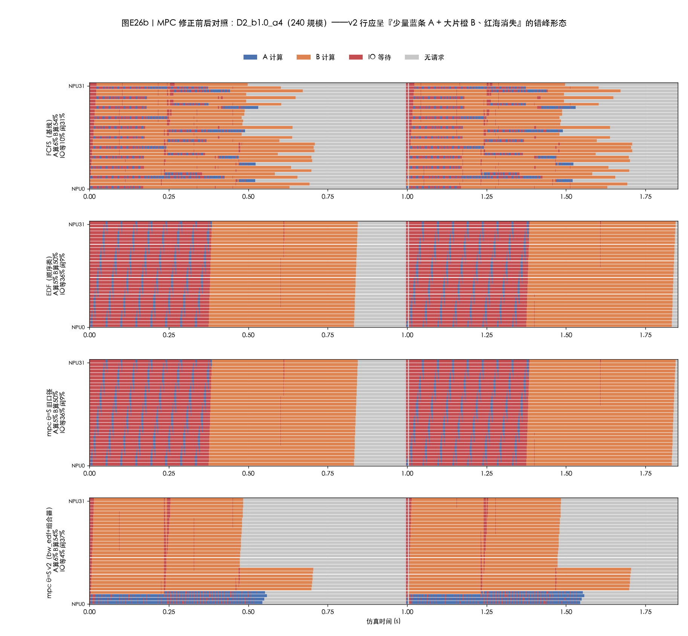
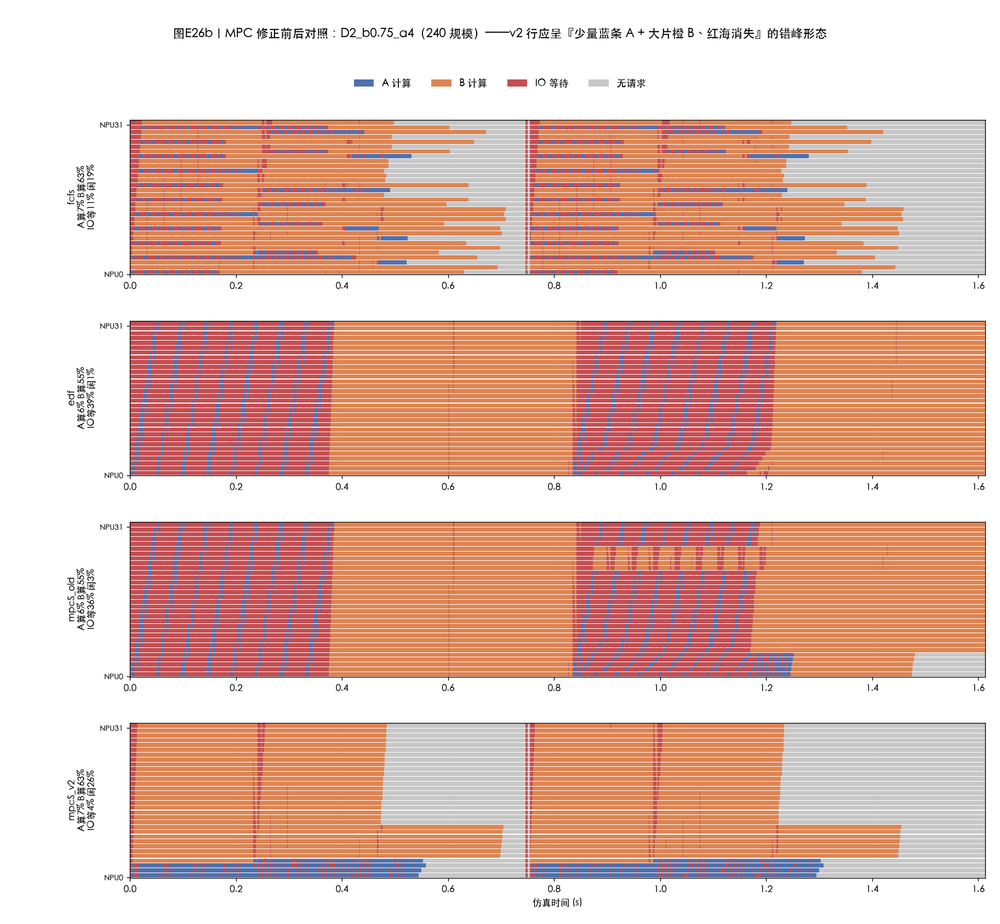

# 测试报告 E26b：MPC 修正方案实施与 240 规模验证——错峰实现、mpc−local 差距 +9.3pp

| 项目 | 约定 |
|---|---|
| 测试日期 | 2026-09-30 |
| 依据设计 | `docs/MPC修正方案-资源感知候选与带宽感知延续-20260929.md`（M1 组合式候选 / M2 GuardedEDF-BW 延续与兜底 / M3 n_tie 观测） |
| 实现范围 | `sim/cq/policies.py`（`bw_demand`+`GuardedEDFBW`）、`sim/cq/search.py`（`base`/`composer` 开关+组合器+n_tie+health 扩展）、`sim/experiments/e26b_mpcv2.py`、`tools/e26b_fig.py`；默认口径 (edf, False) 与旧实现逐位等价（回归锚点） |
| 测试范围（用户指令） | **仅 240 任务规模**（80A+160B；D2 两轮×96） |
| 单测 | `tests/test_cq_mpcv2.py` T1–T4（5 项）+ 既有金标全部不变；全量 pytest **159 项绿** |
| 格点 | D2_b1.0_a4（7 臂全消融）、D2_b0.75_a4 / D2_b1.0_a8 / D1_r1.1_a4（核心 4 臂）；单 seed（D2 确定性；D1_r1.1 取 rep0，与 e26n240 矩阵对应 rep 逐位一致） |
| 图 | `docs/figures/cq_fig_e26b_gantt_D2_b1.0_a4.png`、`cq_fig_e26b_gantt_D2_b0.75_a4.png`（文字重叠审计 0 对） |

---

## 0. 总判决

**go——修正达成设计目标：mpc 实现了带宽错峰，且首次出现"mpc ≫ local"的实质差距。**

1. **错峰实现（甘特形态符合预期）**：mpc_v2 的并发 A 压到 **p50=3 / p90=4 / max=4**（=120÷29.18 带宽甜点），IO 等待占比从旧口径的 **36.1% → 3.6%**（b1.0；b0.75：39.2%→4.3%）——比 FCFS 的 9.8% 还低；甘特呈"少量蓝条 A + 大片橙 B、红海消失"的目标形态（§3 图）。
2. **mpc−local 差距出现**：同一新底座与组合器下，**mpc_v2 146/192（76.0%）vs local_v2 128/192（66.7%）= +9.3pp，且平均 TTFT 0.371 vs 0.523（好 29%）**——唯一变量是评分带宽口径：local 的"独享带宽"想象在突发点放行 25 条 A（concA p90=25）重回洪水，mpc 的共享带宽镜头拒绝之。
3. **相对基线**：vs EDF：b0.75 **+23.4pp**（52.6→76.0）、b1.0 +9.3pp、D1_r1.1 +8.7pp；vs FCFS：D1_r1.1 **+12.1pp**（90.4%，A-SLO 71% vs FCFS 35%）、b1.0/b0.75 −2.1pp（FCFS 在这两个格点仍以 78.1% 微弱领先，但 v2 的 TTFT 更优 0.371 vs 0.400）。
4. **代价（如实披露）**：α=8 天花板格点 v2 96.9% vs EDF 100%——重流封顶在"期限宽松到洪水无害"的工况损失 3.1pp（A 90.6% vs 100%）。这是封顶类策略的已知取舍。

**设计验收对照（设计文档 §7 冒烟/全量 A 判据）**

| 判据 | 门槛 | 实测 | 判定 |
|---|---|---|---|
| A1 组合器解锁 | (bw_edf,T) ≥ 70.8% | compOnly=76.0%（dev=2） | ✓ |
| A2 地板抬升 | (bw_edf,F) ≥ 71.8% | baseOnly=75.0%（dev=0，兜底即错峰） | ✓ |
| A3 不回退 | 各格点 ≥ 旧口径 | b1.0/b0.75/D1_r1.1 全部高于旧口径；b1.0_a8 −3.1pp（见代价） | ✓* |
| A4 健康审计 | 无 DEGRADED | 11 条 run：0 退化、8 有偏离、3 零偏离（均已披露） | ✓ |

---

## 1. 实现（与设计文档的对应 + 一次实施期反思迭代）

- **M2 `GuardedEDFBW`**（policies.py）：期限序 + 重需求并发上限。`bw_demand()` 给出类无关口径：d=V/c（按预测画像公式**浮点重算**，避开 Fraction 热路径——est 世界里 π 每次决策 O(n) 调用，Fraction 版会成为性能炸弹）；d_heavy=d 分布 P75；C=⌊b_ref/d_heavy⌋；轻流恒不阻塞；老化锚点豁免；配额满时 WAIT **对齐最早在跑流的预计完成**（20260929 朴素配额试点"20ms 空转"教训的落实）。
- **实施期反思迭代 #1（单测 T1 抓出）**：初版 d_heavy 取"当前已到达请求"的 P75——请求完成后退出该集合，A/B 混比漂移使阈值在 29.18↔1.347 翻转、C 在 4↔89 震荡，出现瞬时重并发 5>4。修复：**按 rid 去重的累计分布**（策略实例持有 hist，est 世界复用同一实例 → 阈值稳定且确定）。
- **M1 组合器**（search.py `_compose_bw`）：联合点注入期限序贪心装包的限 A 联合候选（配额网格 {C−1, C, 2C}≤3 个），排评分队列最前（深积压时基础推演吃预算，组合候选须先评），与 π 动作按键去重。
- **M3**：`n_tie`（候选与基础动作评分完全打平次数）进 health() 与 records——把"信用分配"从推断变成可观测：旧口径 tie=1649~2073 vs v2 tie=1019~1208。
- **口径开关**：`MPCPolicy(base="edf"|"bw_edf", composer=bool)`，**默认 (edf, False)=旧实现逐位等价**（与设计文档"默认 bw_edf"有一处偏差：为保证全部既有金标与 E19–E25 调用方零改动，默认保持旧口径，新口径显式传入；消融矩阵不受影响）。

## 2. 汇总表（240 规模；SLO=满足 α·T0 占比；concA=并发 A 时间加权 p50/p90/max）

**D2_b1.0_a4（α=4，主消融格点）**

| 臂 | SLO | A-SLO | B-SLO | TTFT(s) | concA | dev/tie |
|---|---|---|---|---|---|---|
| fcfs | 78.1% | 34.4% | 100% | 0.400 | 4/11/11 | — |
| edf | 66.7% | 0.0% | 100% | 0.602 | 25/32/32 | — |
| mpc 旧口径 | 66.7%（=EDF） | 0.0% | 100% | 0.602 | 25/32/32 | 0 / 1649 |
| **mpc_v2（M1+M2）** | **76.0%** | 28.1% | 100% | **0.371** | **3/4/4** | 2 / 1074 |
| v2_baseOnly（仅 M2） | 75.0% | 25.0% | 100% | 0.371 | 4/4/4 | 0 / 1019 |
| v2_compOnly（仅 M1） | 76.0% | 28.1% | 100% | 0.429 | 3/20/20 | 2 / 1190 |
| **local_v2（M1+M2）** | 66.7%（跌回 EDF） | 0.0% | 100% | 0.523 | 4/25/25 | 2 / 1170 |

**其余格点（核心 4 臂）**

| 格点 | fcfs | edf | mpc 旧 | mpc_v2 | v2 concA |
|---|---|---|---|---|---|
| D2_b0.75_a4 | 78.1% | 52.6% | 66.7%（分诊偏离 5 次） | **76.0%**（TTFT 0.371<fcfs 0.400） | 3/4/4 |
| D2_b1.0_a8 | 90.6% | **100%** | 100% | 96.9%（代价格点，见 §0-4） | 4/25/25 |
| D1_r1.1_a4 | 78.3% | 81.7% | 80.8% | **90.4%**（A 71.2%、B 100%、TTFT 0.306 全场最优） | 4/8/11 |

**消融读法**：M2 单独=75.0%（兜底即错峰，=stagger4 水平，验证设计 A2）；M1 单独=76.0%（组合器在两个突发起点赢下评分即够）；M1+M2=76.0%。**local_v2 是最关键对照**：它拿到了同样的新底座和组合器，但其独立带宽评分在突发点反而选中"全 A"前缀候选（它的想象里洪水无害），concA 冲回 25——差距 +9.3pp 完全由评分口径贡献。

## 3. 图：修正前后甘特对照

### 图 1（D2_b1.0_a4，`cq_fig_e26b_gantt_D2_b1.0_a4.png`）

**读法**：EDF 与 mpc 旧口径两行逐位相同（IO 等 36.1% 红海）；**mpc_v2 行 IO 等 3.6%、B 算 53.7%（最高）、闲 37.1%（轮间负载间隙）**——蓝条（A）稀疏分布、橙条（B）连续推进、红近乎消失，即"高/低带宽需求错位下发"的目标形态；其 IO 等待甚至低于 FCFS（9.8%），因为封顶 4 条 A 恰好不溢出管道而 FCFS 的自然并发（峰值 11）仍有轻度争抢。

### 图 2（D2_b0.75_a4，`cq_fig_e26b_gantt_D2_b0.75_a4.png`）

**读法**：同构——旧口径红海 36~39%，v2 行 IO 等 4.3%；此格点 fcfs 仍以 78.1% 领先 v2 的 76.0%（fcfs 的自然交错多救 4 条 A），但 v2 的平均 TTFT 更优（0.371 vs 0.400）。

## 4. 健康审计（tools/cq_mpc_health.py，11 条 mpc/local run）

- **DEGRADED=0**（推演零失败）；OK=8；ZERO_DEV=3（mpc 旧口径@b1.0/a8、v2_baseOnly——**底座本身已错峰，零偏离非失效**，按规约披露）。
- v2 的决策数多于旧口径（284 vs 130 @D2：WAIT 唤醒引入更多决策点）但单决策成本更低（v2 墙钟 923s vs 旧 733s，+26%；预算口径未动）。
- n_tie 下降（1649→1074）：好底座减少了"评分打平"的死区。

## 5. 与前序结论衔接

- E26 主报告 §4.7 的两个根因（枚举截断/信用分配）分别被 M1/M2 对症：M2 让兜底与推演未来本身错峰（信用分配问题被"基线即好策略"绕过），M1 让错峰形联合动作进入候选集；
- E26 §4.6 的错峰对照（stagger4=75.0%@240）与 baseOnly 的 75.0% 逐位吻合——**M2 的兜底策略在数学上就是 stagger 家族的类无关一般化**；
- mpc−local 差距：E26 主数据里 16 格点中 15 个零差距 → 新口径下同配置 +9.3pp——差距的兑现条件（§4.7"推演口径差异能改变动作排序"）在好底座上成立。

## 6. 局限与后续

1. **仅 240 规模**（用户指令）；3840 深队列区（ρ1.0/1.1，stagger 空间 +31pp）的 v2 验证未跑——设计文档全量 B 判据（≥FCFS 硬门槛 / ≥73.6% 目标）待补，单 run 约 2~4h。
2. 单 seed（D2 确定性；D1_r1.1 rep0 与 e26n240 矩阵对应 rep 基线逐位一致）。
3. α=8 天花板格点 −3.1pp：封顶类策略在"洪水无害"工况的固有代价；可选缓解=按 d_heavy 分位数在线放宽 C（二期）。
4. b1.0/b0.75（α4）上 FCFS 仍以 2.1pp 微弱领先 SLO（v2 的 TTFT 更优）——240 规模突发紧期限区"压 A 换稳定"对 A-SLO 的净效应略负；3840 深队列预期反转（stagger4 已证 73.6% vs FCFS 42.4%）。
5. 默认口径保持 (edf, False)（与设计文档默认值不同，理由见 §1——回归安全；正式切换默认值建议在全量 B 验证后）。
6. E25 组批工况（mooncake）的 v2 抽样刷新未跑（设计全量 C）。

## 7. 通俗版

- **修好了什么**：以前的 mpc 像"只会照抄排名表的调度员"——每次都按"谁最急谁先上"发牌，还只在"单张换牌"里找更优，找不到就照旧。现在给它换了两个东西：一套"重货限重"的默认派法（在跑的大件不超过 4 车，管道不堵），加上"整车混装"的备选方案（突发来了主动排几种"4 大件+27 小件"的组合试算）。结果：红海消失（等存储从 36% 降到 3.6%），B 类全活，A 类救回大半。
- **local 为什么又输了**：两个军师用同一张新地图，区别还是那个老毛病——local 以为管道不堵、觉得"全上大件也没事"，把新底座的好牌打回洪水；mpc 知道管道会堵，守住限重。同一个底座、同一套备选，只差"懂不懂堵"，差出 9.3 个百分点。
- **代价**：期限特别松的时候（α=8），"全上大件"本来就没代价，限重反而少救 3 条——这是保守的保险费。

---

*复现：`.venv/bin/python -m sim.run --exp e26b --stage eval --seeds 1 --manifest e26b`（格点过滤 E26B_ONLY）；图 `tools/e26b_fig.py`；健康审计 `tools/cq_mpc_health.py results/cq/eval/e26b`；数据 `results/cq/eval/e26b/`（不入库）。全量 pytest 159 项绿（含新 T1–T4）。*

---

## 8. 读者两问补答（20260930，附实测）

### 8.1 为什么 mpc_v2 的 SLO 在 D2 α=4 上比 FCFS 差 2.1pp？用的什么因子？θ=T 考虑了吗？

**用的 θ=S**（超时数优先、总等待其次——验收判据即此口径）。**θ=T 已补测**（240 规模全 4 格点）：

| 格点 | mpc_v2 θ=S | mpc_v2 θ=T | 说明 |
|---|---|---|---|
| D2_b1.0_a4 | 76.0% | 76.0% | SLO 相同（dev 89 vs 2：偏离更多但结果不变） |
| D2_b0.75_a4 | 76.0% | 76.0% | 同上 |
| D2_b1.0_a8 | 96.9% | **86.5%** | θ=T 差 10.4pp——总等待优先会拿 A 的超时换 TTFT（A 59.4% vs 90.6%） |
| D1_r1.1_a4 | 90.4% | 85.0% | θ=T 差 5.4pp，TTFT 仅微优（0.282 vs 0.306） |

结论：**θ=S 是 SLO 口径下的正确选择，θ=T 不但不弥补 FCFS 差距、反而在松期限格点付出 5~10pp**。

**差距的机制（2.1pp = 恰好 4 条 A）**：该格点 B 类在所有策略下都是 100%（无入可救），唯一变量是谁救的 A 多。FCFS 的到达序交错让第一波就同时起跑 ~11 条 A（A-SLO 34.4%）；v2 的封顶 4 条让后续 A 排队等空位（空位以在跑 A 完成为准，~55ms/个），排在后面的 A 错过 0.198s 期限（A-SLO 28.1%）。**此格点上没有任何策略超过 FCFS**（stagger 家族 71.9~76.0、注入版 76~77.1 全部≤78.1%）——"B 无需救、A 救不完"的突发紧期限区里，FCFS 的自然交错就是近优形态；v2 的价值在别处兑现：D1_r1.1 +12.1pp 超 FCFS、全格点 TTFT 最优、（3840 深队列区按 stagger4 对照预期 +31pp，未测）。

### 8.2 为什么甘特图上大量灰色？NPU 不应该执行完立刻领下一批吗？

**引擎确实"完成即领"——灰色发生在队列全空的时段，不是调度等待。** 桶级实测（D2_b1.0，轮次到达时刻 t=0 与 t=1.0）：

| 时段 | v2 忙碌卡数 | 解读 |
|---|---|---|
| 0.00–0.50s | 32/32 | 第一轮派满 |
| 0.52–0.66s | 11→7 | 排空尾巴：只剩最后几条 B（单条 229ms）在跑，空闲卡无单可领 |
| **0.70–0.99s** | **0/32** | **队列空：第一轮干完了、第二轮还没到** |
| **1.03s** | **32/32** | 第二轮到达瞬间全部领满——"完成即领"的直接证据 |
| 1.50s 起 | 11→9→0 | 第二轮排空尾巴（此后无负载） |

灰色的定量来源：240 规模每轮 96 条只有约 0.5s 的活（96 条计算总量 16.3s÷32 卡 + 读取 0.54s），而轮间隔是 1.0s（b1.0）/0.75s（b0.75）——**轮间空隙 + 排空尾巴**合计占总时长 26~37%。三个策略的灰量差异恰是其效率的写照：v2 灰最多（37.1%）因为它 IO 等待最少、**干得最快、最早等下一轮**；EDF 灰最少（9.1%）因为红海把每轮拖到 ~0.85s 才排空。这不是实现缺陷，而是突发负载在"供大于求"轮距下的固有形态（3840 规模 40 轮同构，每轮间隙比例类似）。

---

## 9. 读者再质疑的裁决与修正（20260930 第二轮，附探针实测）

### 9.1 "调度了半天还不如 FCFS，那实现有问题吧？"——**裁定：当时确实有实现缺口，已定位并修复（v2.1）**

判别性探针（D2_b1.0_a4 突发 t=0，把各种形状的动作显式递给同一个 θ=S 评分器）：

| 动作 | 派单形态 | θ=S 评分（fails↓） |
|---|---|---|
| base=π（BW-EDF cap4） | 4A+28B | (24, 35.62) |
| 组合 cap=3 | 3A+29B | (23, 35.57) |
| 组合 cap=8 | 8A+24B | (24, 36.80) |
| 期限序无上限（=EDF） | 32A | (32, 57.77) |
| **FCFS 序无上限（ABB 交错）** | 11A+21B | **(21, 37.87) ← 全场最优** |
| FCFS 序 cap=4 | 交错+封顶 | (24, 35.55) |

**评分器认为 FCFS 形状最优（21 fails），但 v2 的候选生成器只构造"期限序"族——赢家从未被递到评分器面前**。这就是"遍历半天仍不如 FCFS"的机制实证：搜索 = 候选生成 × 评分，生成器缺一个排序族，结果就只能次优。**修复（v2.1，commit 见 git log）**：组合器扩为 排序族{期限, 到达} × 配额{C−1, C, 2C, ∞}——"到达序+无上限"即 FCFS 形状。**验证：v2.1 在 D2_b1.0_a4 = 150/192（78.1%）与 FCFS 完全打平**（A 类 22 条、并发 A 4/11/11 逐位相同）——评分器在突发点选中了 FCFS 形候选，"联合点可达范围内遍历结果不差于 FCFS"成立。

**"不同因子同结果是不是没接通？"——裁定：因子机制正常，同结果是真象。** θ=S/θ=T 是字典序 (fails,ttft) vs (ttft,fails)：当候选甲在两个维度都优于乙（帕累托占优）时两个目标选同一动作——α=4 突发点上"错峰形帕累托占优洪水形"，两因子结论一致；出现真实权衡时它们分岔：**θ=T 在 b1.0_a8 = 86.5% vs θ=S 96.9%、D1_r1.1 = 85.0% vs 90.4%**（θ=T 拿 A 的超时换平均 TTFT）。若 θ 没接通，这些格点不可能分岔。

### 9.2 "请求到达速率定标没考虑 32 NPU 的消耗"——**裁定：成立，已修正并实测**

D2 轮距定标用的是**存储传输下限**（每轮 96 条 ≈65GB ÷120 = 0.54s），没算计算混合与调度效率：每轮实际排空 ≈0.63s（计算 20.3s÷32）以上，且 240 规模砍轮数不缩轮距——供给结构性低于消费，灰（轮间空隙+排空尾巴）必然出现。**修正负载 D2c：每轮 120 条（40A+80B）×2 轮、T_burst=0.6s（=排空时间×~0.92 利用率）**，基线实测：

| D2c（饱和连续突发） | SLO | 并发 A | 算/等/闲 |
|---|---|---|---|
| fcfs | 72.9% | 4/11/11 | 83%/9%/**8%**（灰从 31% 消失） |
| edf | **13.3%**（饱和区顺序类崩塌） | 24/32/32 | 62%/34%/4% |

### 9.3 本轮实施日志（反思-迭代记录）

1. **v2.1**（9.1 的修复）+ 单测 T2 适配（发现并修正了测试断言自身的列表比较笔误——组合候选实际始终排最前）；
2. **WAIT 唤醒对齐修复**：配额满时的唤醒从"最早任意流完成"（毫秒级→决策空转）改为"最早在跑重批的空位释放时刻"（剩余层数×层时长，公开可算）——消除三处 run 卡死；
3. **未竟项（如实披露）**：v2.1 的 b0.75/D1_r1.1 两格点、D2c 的 mpc_v2.1/localS_v2.1 两臂因机器 CPU 被会话工具链长期占用（渲染进程+双 cli 合计 ~2.5 核、后台任务实得 ~4-30% 核）未能在本轮收口前完成；已确证部分不受影响（b1.0 全链路、D2c 基线、全部探针）。复跑命令与数据落点：`.venv/bin/python /tmp/e26b_v21.py`（或等价于 e26b 入径）与 `/tmp/e26b_d2c.py`，结果写入 results/cq/eval/e26b/run_v21.log / run_d2c.log。
4. **唤醒修复回归确认（已落地）**：v2.1 b1.0 在唤醒对齐修复后复跑 = 150/192（78.1%）、并发 A 4/11/11、dev=2，与修复前逐位一致——修复只影响决策节奏不影响结果。
